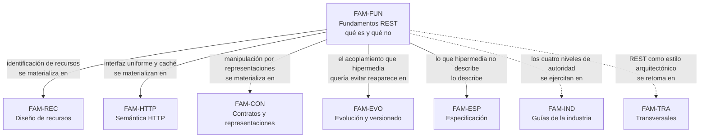

# Fundamentos REST — `FAM-FUN`

## La pregunta que responde esta familia

**¿Qué es REST, y qué de lo que llamamos REST lo es?**

Las dos mitades de la pregunta no son la misma. La primera tiene respuesta documentada: Roy Fielding definió un estilo arquitectónico en el capítulo 5 de su disertación de 2000 (`O-01`), con seis restricciones nombradas y un conjunto de propiedades que esas restricciones inducen. La segunda tiene respuesta medida: de 500 APIs públicas que se declaran REST, el 4,2 % satisface la restricción de hipermedia (`O-04`). Bajo la definición del autor del término, la enorme mayoría de lo que la industria llama REST no lo es.

Esta familia existe para que esa brecha quede establecida antes de que el lector recorra el resto de la guía, porque casi todos los desacuerdos de estilo que aparecen después —dónde va la versión, si `PUT` o `PATCH`, si hace falta un `Link` de paginación— se discuten en el vacío cuando no está claro qué autoridad se está invocando. [`MARCO-CONVENCIONES`](../00-Marco-de-Referencia/Convenciones.md) fija cuatro niveles de autoridad; estos cuatro documentos son donde el lector aprende a distinguirlos en el caso más cargado de mitología de todo el tema.

---

## Documentos

| Documento | ID | Qué establece |
|---|---|---|
| [Qué es REST](Que-es-REST.md) | `TEM-REST` | Las seis restricciones de `O-01` —cinco obligatorias más código bajo demanda—, qué resuelve cada una, y la distancia entre REST-según-Fielding y REST-como-se-usa |
| [Modelo de madurez](Modelo-de-Madurez.md) | `TEM-RMM` | Los niveles 0 a 3 de Richardson según `O-03`, dónde se ubica la industria realmente, y por qué el nivel 2 es el destino práctico de casi toda API |
| [Hipermedia](Hipermedia.md) | `TEM-HATEOAS` | Qué promete HATEOAS, la medición de `O-04`, los formatos que compiten por implementarlo, y qué parte sobrevivió: el link de paginación y `N-10` |
| [REST y alternativas](REST-y-Alternativas.md) | `TEM-ALT` | REST frente a GraphQL, gRPC, tRPC, SOAP y mensajería; criterios de elección por escenario y contexto; el efecto de HTTP/2 y HTTP/3 (`O-06`) sobre el argumento de «menos requests» |

El orden de lectura es el de la tabla. [`TEM-REST`](Que-es-REST.md) fija el vocabulario, [`TEM-RMM`](Modelo-de-Madurez.md) da la escala con la que se ubica una API concreta, [`TEM-HATEOAS`](Hipermedia.md) desarrolla la restricción que la escala pone en su nivel más alto y que casi nadie alcanza, y [`TEM-ALT`](REST-y-Alternativas.md) sale del marco para preguntar si REST era la opción correcta.

---

## Cómo se relaciona con las demás familias

Tres de esas aristas merecen explicación porque no son obvias.

**Hacia [`FAM-EVO`](../50-Evolucion-y-Versionado/README.md).** La restricción de hipermedia de `O-01` es, en su intención, un mecanismo de evolución: si el cliente descubre las URIs en tiempo de ejecución en lugar de construirlas, el servidor puede reorganizar su espacio de nombres sin romper a nadie. Fielding lo dice explícitamente en `O-02` al reclamar que los servidores conserven la libertad de controlar su propio namespace. Cuando el 95,8 % del mercado decide no implementar hipermedia, ese mecanismo de evolución hay que reponerlo por otra vía, y esa vía es el versionado explícito. Las estrategias de [`TEM-VERS`](../50-Evolucion-y-Versionado/Estrategias-de-Versionado.md) son, en buena medida, el precio de no haber hecho lo que `TEM-HATEOAS` describe.

**Hacia [`FAM-ESP`](../60-Especificacion-y-Documentacion/README.md).** El mensaje autodescriptivo de `O-01` pretendía que la respuesta trajera consigo lo necesario para interpretarla. En la práctica, lo que un cliente necesita saber sobre una API no viaja en las respuestas sino en un documento OpenAPI (`N-19`) escrito aparte. La especificación ocupa el lugar que la interfaz uniforme dejó vacante, y por eso [`TEM-OPENAPI`](../60-Especificacion-y-Documentacion/OpenAPI.md) es más central en la práctica que cualquier debate sobre hipermedia.

**Hacia [`FAM-IND`](../90-Guias-de-la-Industria/README.md).** Casi todas las guías corporativas verificadas —Microsoft en `G-01` y `G-02`, Google en `G-04`, Zalando en `G-05`— prescriben APIs que llegan al nivel 2 de `O-03` y no al 3. Es una contradicción tácita entre la teoría canónica y la práctica industrial universal, y conviene tenerla nombrada antes de leer cualquiera de esas guías, para no confundir su autoridad de organización con autoridad normativa.

---

## Qué se lleva el lector de esta familia

Tres capacidades, en orden de utilidad decreciente.

Distinguir cuándo una afirmación sobre REST se apoya en `O-01`, en un RFC, en la guía de una empresa o en la costumbre. Es la habilidad que vuelve productivas las discusiones de diseño, porque desplaza la pregunta de «¿esto es RESTful?» —que casi siempre es irrespondible y siempre es estéril— a «¿qué problema resuelve esto y qué cuesta?».

Ubicar una API ajena en la escala de `O-03` en pocos minutos, que es el primer paso de cualquier trabajo de `ESC-4`.

Decidir, antes de diseñar recursos, si REST es siquiera el estilo adecuado para el problema. La respuesta suele ser sí y a veces no, y descubrirlo después de tres meses de diseño es caro.

---

## Advertencia sobre el vocabulario

Esta guía usa «REST» en su acepción corriente —una API HTTP con recursos identificados por URI y representaciones JSON— porque es la que el lector va a encontrar en toda la documentación que consulte. La acepción estricta de `O-01` se reserva para los pasajes donde la distinción importa, y ahí se dice explícitamente «REST según Fielding» o «REST en sentido estricto». Es criterio de esta guía y se declara como tal: pretender que la industria abandone un término que usa desde hace veinte años no es una posición útil, y negarse a nombrar la diferencia tampoco.
