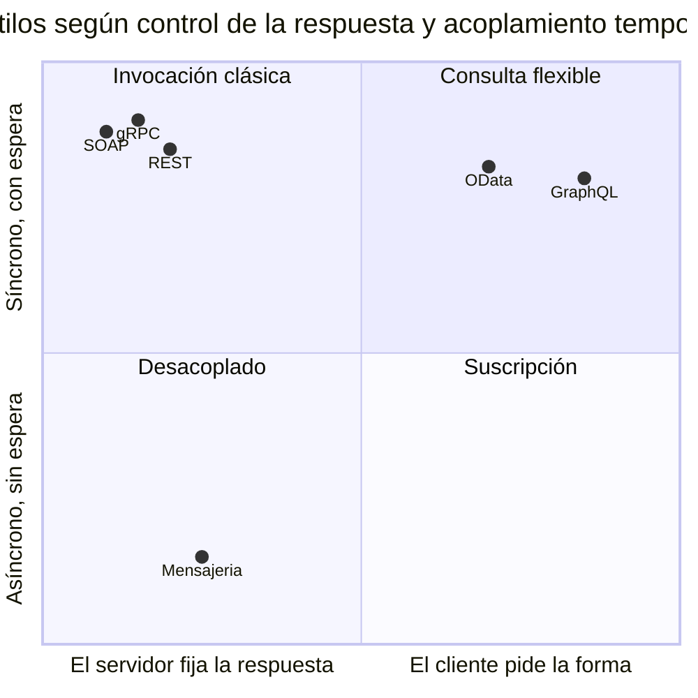

# REST y alternativas — `TEM-ALT`

## Resumen ejecutivo

La decisión de estilo de integración precede a todo lo demás que trata esta guía: elegir mal el estilo hace irrelevantes las convenciones de nomenclatura, de paginación y de errores que se elijan después. REST no es la única opción disponible ni la mejor para todos los problemas, y la pregunta que este documento intenta hacer contestable es cuándo conviene y cuándo no.

Este documento pasó a `confidence: alta` en la revisión del 2026-07-20. La versión anterior declaraba `media` porque no había verificado fuentes primarias sobre gRPC, tRPC, SOAP ni mensajería, y porque el texto de la especificación GraphQL no se había podido leer. Las cuatro lagunas se cerraron: `N-22` se verificó sobre el texto de la especificación —el HTTP 403 anterior era una limitación de la herramienta de consulta, no del sitio—, gRPC quedó respaldado por `N-74` a `N-78` y `O-07`, SOAP por `N-72`, `N-73`, `F-13` y `N-79`, y la familia de mensajería por `F-14`, `F-15` y `F-16`. Lo que sigue sin verificar es acotado y está señalado en el punto exacto donde aparece.

La verificación no confirmó lo que la guía suponía: lo corrigió en dos puntos que cambian el contenido del documento. **Ninguna especificación de GraphQL prescribe responder `200` con un array `errors`**, y el mecanismo por el cual los códigos de gRPC son ajenos a HTTP no está donde se lo busca. Ambos casos se desarrollan más abajo, y ambos son ejemplos de lo que la guía advierte en general: lo que «todo el mundo sabe» sobre estas tecnologías circula sin que nadie haya abierto el documento.

Lo verificado sobre HTTP/2 y HTTP/3 cambia la discusión más de lo que se reconoce, y ahora tiene respaldo normativo además del de `O-06`. `N-70` establece la multiplexación de intercambios concurrentes sobre una misma conexión y `N-71` precisa que el bloqueo residual de transporte de HTTP/2 se resuelve en HTTP/3 sobre QUIC. El argumento clásico de que un estilo es superior porque «evita round-trips» perdió buena parte de su fuerza, y conviene saber cuánta.

---

## Definición

### Qué se está eligiendo

Un **estilo de integración**: el conjunto de decisiones sobre cómo dos sistemas se comunican, que incluye el protocolo de transporte, la forma del contrato, el modelo de invocación —recursos, procedimientos, consultas, mensajes—, el acoplamiento temporal entre las partes y quién controla la forma de la respuesta.

Las opciones no son mutuamente excluyentes y en un sistema real conviven. Una arquitectura típica tiene REST hacia los clientes externos, mensajería para la propagación de eventos internos, y quizá un protocolo binario entre dos servicios con exigencia de latencia. La pregunta correcta no es cuál estilo adoptar sino cuál corresponde a cada borde del sistema.

### El eje que ordena la elección

Esta guía propone dos variables, y lo declara como criterio propio: **quién decide la forma de la respuesta** y **si el llamador espera el resultado**.



El eje horizontal es el que más discrimina en la práctica. Cuando el servidor fija la forma de la respuesta, puede razonar sobre su costo, cachearla y versionarla; cuando el cliente la pide, gana flexibilidad y el servidor pierde predictibilidad. El eje vertical decide cosas distintas: el acoplamiento temporal determina qué pasa cuando el otro lado no está, y esa es la pregunta que domina en `CTX-4`.

### Qué NO es esta decisión

**No es una decisión de moda ni de plantilla.** «Usamos GraphQL porque es moderno» y «usamos REST porque es lo que sabemos» son la misma clase de no-decisión, con distinto signo.

**No es irreversible, pero es cara de revertir.** Cambiar de estilo obliga a reescribir clientes, y en `CTX-1` o con clientes instalados eso significa sostener ambos durante años. La reversibilidad se parece más a la de la elección de lenguaje que a la de una convención de nomenclatura.

**No es lo mismo que la elección de protocolo de transporte.** GraphQL corre habitualmente sobre HTTP; REST está definido sobre cualquier protocolo que satisfaga sus restricciones aunque en la práctica sea HTTP. Confundir ambos planos produce comparaciones sin sentido, del tipo «REST es más lento que gRPC» sin especificar sobre qué versión de HTTP corre cada uno.

**No es una comparación de rendimiento.** Es una comparación de acoplamientos, de garantías y de costo de evolución. El rendimiento importa en un subconjunto de casos identificables, y esos casos se reconocen porque alguien puede decir cuántas peticiones por segundo y con qué latencia objetivo.

---

## Las alternativas

### GraphQL

La edición vigente de la especificación es **September 2025** (`N-22`), la primera desde October 2021. La gobernanza consta en la propia introducción del documento: es un entregable del GraphQL Specification Project, establecido en 2019 con la **Joint Development Foundation**, con la GraphQL Foundation formada ese mismo año como punto focal neutral y las contribuciones gestionadas por el GraphQL Working Group bajo su Technical Steering Committee. La licencia es OWFa 1.0. Cuatro años entre ediciones formales es un dato de decisión: la evolución ocurre por implementaciones y por sub-especificaciones más que por el documento central.

La forma es conocida y ahora citable. `N-22` §2 define exactamente tres tipos de operación —`query`, `mutation` y `subscription`—, la última descrita como una petición de larga vida que entrega datos en respuesta a eventos de origen. Su §3 define el sistema de tipos como aquello que determina si una operación solicitada es válida y garantiza el tipo de los resultados. El cliente declara qué campos quiere y el servidor responde con esa forma: es el extremo derecho del eje horizontal.

La consecuencia que más se subestima no es de rendimiento sino de operación, y tiene respaldo primario. `F-12` establece que el servidor **puede**, a su discreción, aplicar reglas de validación adicionales, y anota como ejemplos el límite de profundidad y el de complejidad. Dicho de otro modo: el protocolo no trae resuelta la protección contra consultas costosas, y esa protección pasa a ser trabajo propio en lugar de venir dada por la superficie de operaciones. `ACT-07` tiene ahí una responsabilidad concreta que en REST está mucho más acotada.

Un matiz que conviene incorporar porque contradice la descripción habitual: **el endpoint único no es un requisito**. `F-12` dice que cada esquema debe servirse en una o más URLs. El `/graphql` universal es convención de facto, no prescripción. Lo que sí es obligatorio según `F-12` es soportar POST con `application/json`.

#### El manejo de errores, que no es lo que se repite

Es el punto donde la verificación corrigió a la guía, y merece desarrollo porque la afirmación falsa es prácticamente universal.

Lo que sí fija `N-22` §7, y es normativo: una respuesta puede contener a la vez datos parciales y una lista de errores. El documento distingue el *execution result*, que debe llevar la clave `data` y lleva además `errors` si la ejecución levantó alguno, del *request error result*, que lleva `errors` y **no debe** llevar `data`. Eso es el respaldo primario del error parcial, y es una diferencia real y profunda respecto de REST: una petición GraphQL puede fallar en parte y responder datos igual, porque una petición contiene varias operaciones que fallan de forma independiente.

Lo que `N-22` **no** dice, en absoluto, es nada sobre HTTP. Su §7 no menciona códigos de estado en ningún punto, porque la especificación es agnóstica del transporte. Toda la capa HTTP vive en `F-12`, la GraphQL over HTTP spec, que es un **draft** en Stage 2 y cuyo propio README advierte que puede cambiar antes de alcanzar el estado `Accepted`.

Y `F-12` no prescribe lo que se le atribuye. Para el caso de respuesta con `data` y `errors` simultáneos recomienda un código **`294`**, no `200`. Su sección «Partial success» reconoce con todas las letras que no existe un código oficial aprobado para el éxito parcial, que ni `203` ni `206` ni `207` encajan, y que por eso el proyecto define uno propio; recomienda usarlo solo junto al media type `application/graphql-response+json`, precisamente porque el código lo inventó el proyecto y no el IETF.

De dónde sale entonces el `200` que se observa en la práctica: de la ruta de compatibilidad. `F-12` define *legacy client* como aquel que no soporta `application/graphql-response+json` y que por lo tanto **no cumple la especificación**, y para él recomienda responder `Content-Type: application/json` en todo `2xx`. El comportamiento «siempre 200 con `errors` en el cuerpo» es la convención de facto del ecosistema `application/json`, no una prescripción de ninguna de las dos especificaciones.

La lectura que esta guía extrae, ahora con la cita correcta: el patrón de error en el cuerpo no es un antipatrón, es la consecuencia lógica de un protocolo con errores parciales, y `N-22` §7 lo respalda. Que eso viaje sobre `200` es convención, y quien la defienda invocando «la especificación de GraphQL» está citando mal dos documentos a la vez. Lo que sigue siendo un problema es importar ese patrón a una API REST de recurso único, donde no existe la justificación del error parcial.

### gRPC

Es un estilo de invocación de procedimientos remotos donde, en palabras de la documentación oficial, una aplicación cliente puede llamar directamente a un método de una aplicación servidora en otra máquina como si fuera un objeto local. Usa **Protocol Buffers** por defecto como mecanismo de serialización y transporta sobre **HTTP/2**. Su gobernanza está en la CNCF, y conviene ser preciso: `O-07` registra que fue aceptado el 2017-02-16 en nivel **incubating**, y `N-78` lo corrobora desde Microsoft. Sigue en incubating, no en graduated, pese a una adopción mayor que la de varios proyectos que sí graduaron.

`N-74` define cuatro tipos de RPC, y son la razón principal por la que gRPC no es simplemente «REST binario»: unary, server streaming, client streaming y bidirectional streaming. Los tres últimos no tienen equivalente natural en una API REST de recurso.

#### Los códigos de estado, y dónde está la prueba

gRPC tiene su propio modelo de resultado: diecisiete códigos que `N-76` enumera, de `OK` (0) a `UNAUTHENTICATED` (16), pasando por `INVALID_ARGUMENT`, `NOT_FOUND`, `PERMISSION_DENIED` y `UNAVAILABLE`. No son códigos HTTP y no se mapean uno a uno con ellos.

La afirmación anterior es correcta, pero la fuente para sostenerla no es la obvia, y esto es un hallazgo de la verificación. `N-76` enumera los códigos y **no contiene ninguna frase que los contraste con HTTP**. La evidencia primaria está en `N-75`, la especificación del protocolo sobre HTTP/2: allí consta que la respuesta gRPC usa HTTP `200` con independencia del resultado del RPC, y que el resultado real viaja en un **trailer** `grpc-status`, obligatorio incluso cuando el código es `OK`. Esa es la prueba de que son dos capas distintas, y es `N-75` lo que corresponde citar.

El paralelo con GraphQL es exacto y vale enunciarlo: los dos estilos que más se contraponen a REST coinciden en desacoplar el resultado de la operación del código de estado HTTP, y en ambos casos por la misma razón de fondo —HTTP no puede expresar el resultado de lo que transporta cuando lo que transporta no es una operación sobre un recurso—.

#### gRPC-Web y por qué existe

`N-77` es explícito: por limitaciones del navegador, la biblioteca cliente web implementa un protocolo distinto del nativo, con el objetivo declarado de desacoplarse del framing de HTTP/2, que «no está, y nunca estará, directamente expuesto a los navegadores». Mueve el status al cuerpo en lugar de a trailers HTTP/2 y requiere un proxy —Envoy por defecto—.

`N-78` lo dice desde el lado de Microsoft con una formulación citable: es imposible llamar directamente a un servicio gRPC desde un navegador, porque gRPC usa intensivamente características de HTTP/2 y ningún navegador ofrece el control necesario sobre las peticiones; en particular, los navegadores no permiten exigir HTTP/2 ni dan acceso a los frames subyacentes. La misma página agrega el otro costo, el de la opacidad: los mensajes van codificados en Protobuf, que es eficiente para enviar y recibir pero cuyo formato binario no es legible por humanos.

#### El encaje, según Microsoft y según esta guía

`N-78` recomienda gRPC para microservicios, comunicación punto a punto en tiempo real, entornos poliglotas, entornos de red restringida y comunicación entre procesos. Recomienda **otra cosa** para dos casos: APIs accesibles desde navegador, donde señala que gRPC-Web ofrece soporte pero con limitaciones y a costa de un proxy, y tiempo real en difusión, donde remite a SignalR porque gRPC no tiene concepto de broadcast. Su tabla comparativa consigna «Browser support: No (requires grpc-web)».

Dos matices de esa página que los resúmenes omiten y que esta guía retiene. El primero es que menciona **gRPC JSON transcoding**, disponible desde .NET 7, como segunda vía de compatibilidad con navegador junto a gRPC-Web. El segundo es de método: su fecha de contenido es antigua, de modo que es una página estable y no una revisión reciente, y conviene tratarla como tal.

En .NET el soporte es de primera clase vía `Grpc.AspNetCore` (`F-22`), en versión 2.80.0 al 2026-04-30. El encaje que esta guía propone coincide con `N-78` y lo traduce a los contextos del marco: `CTX-2`, comunicación entre servicios de la misma organización con ambos extremos coordinables y exigencia de latencia demostrada. Su encaje malo es `CTX-1`, donde el consumidor desconocido tiene que poder llamar a la API con las herramientas que ya tiene.

### tRPC

Es un proyecto **activo**, no un experimento abandonado: `F-21` está en 11.18.0, publicada el 2026-06-17, con cadencia sostenida a lo largo de 2026. Se describe como APIs con seguridad de tipos de extremo a extremo, construidas sin esquemas ni generación de código, aprovechando la inferencia de tipos de TypeScript directamente.

Esa última frase es la definición del mecanismo y también el límite de su aplicabilidad. La documentación exige TypeScript 5.7.2 o superior, y la seguridad de tipos proviene de que el cliente importe el **tipo** del router exportado por el servidor, resuelto por el compilador de TypeScript en tiempo de compilación. No hay esquema de cable, no hay artefacto intermedio, no hay generación de código.

De ahí se sigue directamente por qué es irrelevante para un backend .NET: un servidor en C# no puede exportar un tipo TypeScript para que lo consuma `tsc`. Esta guía declara esa conclusión como **inferencia a partir del mecanismo verificado, no como cita**: ninguna página oficial de tRPC menciona .NET, y no hay documento que declare la incompatibilidad. Lo verificado es el mecanismo; la consecuencia es deducción.

La misma cautela vale para el monorepo. Es habitual describir tRPC como «requiere monorepo», y **ninguna página oficial lo declara como requisito**; el quickstart usa directorios `client/` y `server/` separados. Lo que sí se sigue del mecanismo es que ambos extremos deben compilarse contra la misma definición, con lo cual el despliegue queda acoplado. Eso lo ubica lejos de `CTX-1` y de la parte de `CTX-3` con clientes instalados, que `MARCO-CONTEXTOS` señala que se comportan como `CTX-1` en libertad de cambio aunque el equipo sea el mismo.

En el ecosistema .NET la analogía más cercana es compartir un ensamblado de contratos entre productor y consumidor, y las consecuencias son las mismas: es cómodo mientras todo se despliegue junto y se vuelve una trampa en cuanto deja de hacerlo.

### SOAP y WS-*

El estado formal de SOAP no es el que se supone, y la formulación precisa importa porque las dos versiones corrientes son falsas. **SOAP 1.2 es una W3C Recommendation vigente**, en tres partes —Primer, Messaging Framework y Adjuncts—, todas en segunda edición del 2007-04-27, y `N-72` no lleva ningún banner de obsolescencia: se describe como documento estable utilizable como material de referencia. No está retirada.

Lo que sí terminó es su mantenimiento. El **XML Protocol Working Group cerró el 2009-07-10**, de modo que hace unos diecisiete años que ningún grupo del W3C tiene mandato para revisarla. La formulación correcta es «vigente pero sin grupo que la mantenga». Un matiz de honestidad: esta guía verificó el cierre del grupo pero **no pudo consultar el listado de documentos retirados del W3C**, de modo que no afirma que el W3C nunca haya emitido una designación formal de retiro.

La ironía del contrato está en WSDL. `N-73`, WSDL 2.0, es una Recommendation del 2007-06-26. `F-13`, WSDL 1.1, es una **W3C Note** del 2001 que en su propia sección de estado declara que su publicación «no indica respaldo alguno por parte del W3C, del equipo del W3C ni de sus miembros». La versión que la industria adoptó masivamente es la que no tiene estatus de estándar. Que esa inversión sea un dato sobre cómo se adoptan los estándares es observación de esta guía, no afirmación de esas páginas.

Su lugar en la escala de `O-03` sigue siendo el que la guía ya sostenía: Fowler describe el nivel 0 como el uso de HTTP como sistema de transporte para interacciones remotas sin aprovechar ninguno de los mecanismos de la Web, con un único endpoint y la operación nombrada en el cuerpo.

En .NET moderno la respuesta a «¿existe WCF?» tiene dos partes. `N-79` lista WCF entre las tecnologías de .NET Framework **no disponibles** en .NET 6 y posteriores, y remite en el mismo lugar a `F-23`: el lado servidor de WCF puede usarse en .NET 6+ mediante los paquetes de CoreWCF. CoreWCF es un port del lado servidor, de la .NET Foundation, licencia MIT, en versión 1.9.1 al 2026-06-16, con soporte de producto de Microsoft anunciado. El encuadre preciso es que se trata de un proyecto de la .NET Foundation con contribución y soporte comercial de Microsoft, y no de un producto propiedad de Microsoft. Para proyectos nuevos, Microsoft recomienda considerar alternativas más modernas a SOAP, y nombra gRPC.

La relevancia de todo esto para esta guía es casi enteramente de `ESC-2`. `MARCO-ESCENARIOS` señala la trampa característica del escenario y vale repetirla: migrar SOAP a REST conservando el patrón `POST /api/EjecutarOperacion` con un campo `operacion` en el cuerpo produce SOAP con otra sintaxis, sin ninguna de las ventajas de HTTP y sin las herramientas de SOAP. Si el contrato viejo se va a conservar tal cual, migrar no aporta, y conviene establecerlo antes de financiar el proyecto. La existencia de `F-23` agrega una tercera opción que antes no estaba sobre la mesa: sostener el contrato SOAP sobre .NET moderno sin migrarlo.

### Mensajería y eventos

No hay una especificación única que gobierne este estilo, y esa ausencia es en sí un dato. Lo que hay son tres piezas verificadas que cubren cosas distintas, y conviene no confundirlas.

**`F-14`, AsyncAPI 3.1.0**, publicada el 2026-01-31 bajo la Linux Foundation, es una especificación para **describir** APIs dirigidas por mensajes, agnóstica del protocolo subyacente —AMQP, MQTT, Kafka, WebSockets—. Es a los eventos lo que OpenAPI es a REST: un formato de contrato, no un protocolo. Su gobernanza es abierta y el propio proyecto declara que ninguna empresa la controla.

**`F-15`, CloudEvents v1.0.2**, es un formato común de **sobre** para los eventos mismos, de modo que un evento sea reconocible con independencia de por dónde viaje. Estable desde el 2022-02-06, y ese estancamiento aparente es madurez y no abandono: es un proyecto **graduated** de la CNCF desde el 2024-01-25, el nivel más alto. El contraste con `O-07` es instructivo —gRPC, mucho más conocido, sigue en incubating—, y muestra que el nivel de madurez en una fundación no mide adopción.

**Webhooks: no existe estándar.** La verificación de la ausencia es tan útil como la de una presencia, y acá es concluyente. Una búsqueda en el datatracker del IETF por «webhook» no devuelve **ningún RFC**; existen solo dos Internet-Drafts de presentación individual, ninguno adoptado por un working group, y un draft individual no tiene peso normativo. Lo que sí existe es `F-16`, Standard Webhooks 1.0.0, que se autodescribe como un conjunto de herramientas y guías comunitario y de código abierto, respaldado por un comité técnico con Zapier, Twilio, ngrok, Supabase, Svix y Kong. Es una iniciativa de industria, no un estándar, y su propio encuadre es aspiracional.

La estandarización real disponible está en otro plano: `N-19`, OpenAPI, incorporó en su versión 3.1.0 un campo `webhooks` de nivel superior para describir las peticiones entrantes que un consumidor puede recibir fuera de una llamada a la API, y OAS 3.2.0 lo conserva. Lo más cercano a estandarizar webhooks no es un protocolo sino la capacidad de **describirlos en el contrato**, que es una respuesta más modesta y bastante más útil.

Dicho el estado de las fuentes, lo que importa para decidir es el eje vertical: el emisor no espera el resultado. Esa diferencia arrastra todo lo demás. El receptor puede estar caído sin que el emisor falle; el orden de procesamiento deja de estar garantizado por defecto; la entrega puede repetirse, con lo cual la idempotencia pasa de ser una propiedad deseable a ser un requisito, y ahí [`TEM-IDEM`](../30-Semantica-HTTP/Idempotencia-y-Concurrencia.md) deja de ser lectura opcional.

El síntoma que esta guía propone como señal de que hacía falta mensajería y se usó REST: una operación síncrona que en realidad dispara un proceso largo, y una API que termina inventando un recurso de estado que el cliente consulta en un bucle. Cuando eso aparece, el estilo correcto probablemente era otro, y lo que se construyó es una cola con peor semántica. La contrapartida honesta es que un `202 Accepted` con un recurso de seguimiento es un patrón REST perfectamente legítimo cuando el proceso largo es la excepción y no la regla.

### OData

Se incluye porque en el ecosistema .NET aparece con frecuencia y porque su estado formal se cita mal. El estándar OASIS vigente es la versión **4.01** (`N-21`). La 4.02 (`F-05`) es Committee Specification Draft 02, en revisión pública desde abril de 2024 y sin aprobación a julio de 2026; se la cita habitualmente como «la versión actual de OData» porque es el número más alto publicado, lo cual confunde novedad con autoridad.

Funcionalmente ocupa una posición intermedia en el eje horizontal: define `$filter`, `$orderby`, `$select`, `$top` y `$skip`, de modo que el cliente controla parte de la forma de la respuesta sobre una superficie REST. Es la única de las convenciones de consulta con sintaxis completa y estatus de estándar formal, y es la de menor adopción fuera del ecosistema Microsoft y SAP. Su huella dentro de Microsoft es además desigual: `G-02` usa `$skip` y `$top` de OData, mientras `G-01` usa `skip` y `top` sin prefijo. Citar «Microsoft prescribe OData» sin decir cuál de las dos guías es, en general, incorrecto.

---

## HTTP/2, HTTP/3 y el argumento de «menos requests»

El argumento de que un estilo es superior porque reduce el número de peticiones se formuló bajo HTTP/1.1 y envejeció con el protocolo. Ahora hay respaldo normativo para decirlo, y no solo la documentación de `O-06`.

**HTTP/1.1.** Los clientes tenían que esperar a que cada recurso se descargara antes de pedir el siguiente —bloqueo de cabecera de línea—, y la solución práctica de los navegadores fue abrir hasta seis conexiones TCP por origen. Bajo esa restricción, cada petición adicional costaba caro y la agregación en menos llamadas era una optimización de primer orden.

**HTTP/2.** `N-70`, Proposed Standard de junio de 2022 que obsoleta a RFC 7540, declara en su abstract que reduce la latencia permitiendo múltiples intercambios concurrentes sobre la misma conexión, y precisa el mecanismo en su introducción: la multiplexación se logra asociando cada intercambio petición/respuesta a su propio *stream*, lo que permite intercalar mensajes sobre una única conexión. El bloqueo de cabecera de línea desaparece **a nivel HTTP**.

**HTTP/3.** `N-71`, también Proposed Standard de junio de 2022, es la fuente del matiz que más se pierde. Su §1.1 establece que bajo HTTP/2 un paquete perdido o reordenado hace que **todas** las transacciones activas sufran una detención, con independencia de si esa transacción concreta fue afectada por la pérdida. HTTP/3 mapea la semántica HTTP sobre QUIC, que provee multiplexación de streams, control de flujo por stream y establecimiento de conexión de baja latencia, con fiabilidad a nivel de stream y control de congestión sobre el conjunto de la conexión. HTTP/2 **no** elimina el bloqueo a nivel de transporte; HTTP/3 sí.

La conclusión que esta guía extrae, declarada como criterio propio con el matiz explícito:

**El argumento perdió fuerza pero no desapareció.** Lo que HTTP/2 y HTTP/3 abarataron es el **transporte**: el costo de conexión y la imposibilidad de paralelizar. Lo que no cambió es el costo de **servidor** de cada petición —autenticación, enrutamiento, las consultas a la base de datos que cada una dispara—. Un patrón de N+1 peticiones que golpea N+1 veces la base sigue siendo un problema sobre HTTP/3; lo que dejó de ser un problema es abrir N+1 conexiones.

Conviene declarar el límite de la cita: **ni `N-70` ni `N-71` dicen nada sobre el costo de servidor por petición**. Esa mitad del razonamiento es criterio de esta guía y no tiene respaldo normativo, aunque sea difícil de discutir.

De ahí se sigue un criterio práctico: cuando alguien argumenta a favor de un estilo por el número de peticiones, corresponde preguntar si el costo que le preocupa es de transporte o de backend. Si es de transporte y el despliegue es HTTP/2 o superior, el argumento ya está en gran medida saldado. Si es de backend, cambiar de estilo no lo resuelve por sí solo: una consulta GraphQL que pide cinco relaciones dispara las mismas cinco consultas a menos que alguien haya escrito el agrupamiento.

Una advertencia de citación que esta guía sostiene porque el material sobre el tema la incumple sistemáticamente: **`O-06` no contiene afirmaciones sobre el *domain sharding* ni sobre la concatenación de recursos como antipatrones**. Esa atribución, muy repetida, no está respaldada por la fuente y esta guía no la hace.

---

## Criterios de elección

La tabla siguiente es **criterio de esta guía**. Las fuentes citadas respaldan las propiedades técnicas de cada estilo, no la recomendación de cuándo usarlo; la recomendación es juicio profesional y no debe presentarse como si tuviera respaldo normativo.

| Señal en el problema | Estilo que conviene evaluar primero | Por qué |
|---|---|---|
| Consumidores desconocidos, cantidad indeterminada | REST | Interfaz uniforme sobre herramientas que el integrador ya tiene; es el caso para el que `O-01` §5.1.5 se diseñó |
| Muchas pantallas con necesidades de datos muy distintas sobre el mismo dominio | GraphQL `N-22` | El cliente fija la forma; evita multiplicar endpoints a medida, que es el riesgo dominante de `CTX-3` |
| Lectura masiva y repetida de datos que cambian poco | REST | La caché de `N-02` la aplican intermediarios que ya existen, sin trabajo propio |
| Latencia estricta y medida entre dos servicios propios | gRPC `N-78` | Serialización binaria y contrato compartido; `N-78` lo recomienda para microservicios y entornos de red restringida |
| Streaming bidireccional entre dos servicios | gRPC `N-74` | Es uno de los cuatro tipos de RPC; REST de recurso no tiene equivalente natural |
| Difusión en tiempo real a muchos clientes | SignalR, no gRPC | `N-78` lo dice explícitamente: gRPC no tiene concepto de broadcast |
| El emisor no necesita el resultado | Mensajería | Elimina el acoplamiento temporal; a cambio, la idempotencia pasa a ser requisito |
| Hace falta describir el contrato de los eventos | AsyncAPI `F-14` | Es el equivalente de OpenAPI para lo dirigido por mensajes |
| Hay que emitir eventos hacia terceros | Webhooks descritos en `N-19` 3.1+ | No existe estándar de protocolo; lo estandarizable es la descripción |
| Proceso que tarda minutos u horas | REST con `202` y recurso de seguimiento, o mensajería | Depende de si el caso largo es excepción o regla |
| Contrato impuesto por un tercero | Ninguno: se consume lo que hay | Es `CTX-4`; el trabajo de diseño es la capa de aislamiento |
| Contrato SOAP heredado que no conviene migrar | Sostenerlo sobre `F-23` | CoreWCF porta el lado servidor a .NET moderno sin reescribir el contrato |
| Cliente y servidor comparten lenguaje y se despliegan juntos | Contrato derivado de tipos; tRPC `F-21` solo si ambos extremos son TypeScript | Cómodo mientras la condición se mantenga; trampa en cuanto deje de cumplirse |
| Consultas ad-hoc sobre un modelo tabular dentro del ecosistema Microsoft | OData `N-21` v4.01 | Única convención de consulta con sintaxis completa y estándar formal |

Dos criterios de descarte que esta guía considera más útiles que la tabla:

**Si nadie puede enunciar el número, el argumento de rendimiento no vale.** «Necesitamos gRPC porque REST es lento» sin una latencia objetivo y una medición es una preferencia, no un requisito. La conversación cambia por completo cuando alguien dice «necesitamos p99 bajo 20 ms con 5000 peticiones por segundo».

**Si el consumidor es desconocido, la flexibilidad se paga en soporte.** Un estilo donde el cliente compone la consulta traslada al productor un problema que en REST no tiene: consultas costosas que nadie previó, emitidas por integradores que no se pueden contactar. `F-12` confirma que los límites de profundidad y complejidad son trabajo del implementador. En `CTX-1` esa carga recae sobre `ACT-07` y sobre quien atienda el soporte.

---

## Aplicación por escenario

### `ESC-1` — API nueva

Es el único escenario donde la elección está genuinamente abierta, y por eso conviene tomarla explícitamente y registrarla en lugar de heredarla del template del framework. `dotnet new webapi` produce una API HTTP, y ese es un default razonable que no debería confundirse con una decisión.

Lo que esta guía recomienda decidir acá, en orden: si hay algún borde del sistema donde el emisor no necesita el resultado —porque ahí probablemente corresponda mensajería y no una API—; si el consumidor es conocido y coordinable, porque eso abre opciones que `CTX-1` cierra; y si existe una exigencia de latencia enunciada con números.

La trampa del escenario aplica también acá. Adoptar tres estilos en un sistema nuevo porque cada uno es óptimo para su caso produce tres conjuntos de herramientas, tres formas de autenticar, tres modelos de error y tres cosas que aprender para quien llegue después. Esta guía recomienda un estilo por defecto para todo el sistema y excepciones justificadas caso por caso.

### `ESC-2` — Exposición o migración

La pregunta previa es si el estilo de destino aporta algo respecto del de origen, y con frecuencia la respuesta honesta cambia el proyecto.

Migrar de SOAP a REST aporta cuando el resultado alcanza el nivel 2 de `O-03`: métodos con semántica, códigos de estado, cacheabilidad, intermediarios que entienden el tráfico. No aporta cuando el resultado es un endpoint único con la operación en el cuerpo, que es el nivel 0 con otra sintaxis. Esa evaluación se puede hacer antes de escribir código, comparando el contrato viejo con el modelo de recursos propuesto, y `MARCO-ESCENARIOS` lo señala como el criterio de cierre del escenario.

La verificación agregó una opción que conviene tener presente antes de decidir. Un contrato SOAP heredado no obliga a elegir entre migrar y quedarse en .NET Framework: `F-23` porta el lado servidor de WCF a .NET moderno, `N-79` lo señala como la vía soportada, y Microsoft anunció soporte de producto. Sostener el contrato mientras se moderniza la plataforma es una tercera respuesta legítima, y a veces la correcta cuando los consumidores no se pueden coordinar. Lo que Microsoft sí recomienda es no elegir SOAP para lo nuevo.

Hay un caso donde la migración a REST no es la respuesta y conviene tenerlo previsto: cuando el sistema heredado se consume exclusivamente entre servicios internos con exigencia de latencia, exponerlo en REST agrega una capa sin comprar nada que ese contexto necesite. La respuesta puede ser gRPC, o directamente no migrar.

### `ESC-3` — Evolución en producción

Cambiar de estilo con consumidores activos es, en la práctica, construir una API nueva y sostener la vieja. No es evolución: es coexistencia, y el calendario de apagado es una decisión de `ACT-06` que `MARCO-ACTORES` señala como el rol que más falta hace en este escenario.

El patrón que esta guía considera menos malo es el borde nuevo: se expone la superficie nueva junto a la vieja, se migran consumidores de a uno, y se mide quién sigue usando lo viejo. Sin esa medición la fecha de apagado se fija por intuición, que es exactamente el problema que `ESC-3` plantea.

El error específico del escenario es agregar un segundo estilo sobre el existente sin plan de convergencia. Una API que expone los mismos datos en REST y en GraphQL tiene dos superficies que mantener, dos modelos de autorización que mantener consistentes, y dos lugares donde se filtra información. Es una duplicación cara y su justificación tiene que ser explícita.

### `ESC-4` — Evaluación de una API ajena

El estilo de la API que se va a consumir determina qué hay que construir del lado propio, y esa es la salida útil de la evaluación.

Una API GraphQL exige decidir qué consultas se emiten y cómo se aíslan; el riesgo es que la flexibilidad del cliente se convierta en consultas dispersas por todo el código sin ninguna capa que las contenga. Exige además una decisión de manejo de errores que la evaluación suele omitir: hay que determinar si el proveedor sigue la convención del `200` con `errors` o el `294` de `F-12`, porque de eso depende si el cliente puede confiar en el código de estado. Una API REST exige el manejo de códigos de estado y de reintentos que trata [`TEM-RESIL`](../70-Seguridad-y-Robustez/Resiliencia-y-Reintentos.md). Una API gRPC exige incorporar el `.proto` al proceso de compilación, con la consecuencia de que actualizarlo pasa a ser un evento de despliegue, y exige mapear los códigos de `N-76` a algo que el dominio propio entienda.

En los tres casos el trabajo de `CTX-4` es el mismo y `MARCO-CONTEXTOS` lo nombra como riesgo dominante: que el modelo del proveedor se filtre al dominio propio. Los tipos generados desde un esquema ajeno circulando por toda la aplicación convierten un cambio de proveedor en una reescritura, y esa es la razón por la que la capa de aislamiento no es ceremonia.

En `ESC-4b` el estilo se infiere rápido —un endpoint único que acepta `POST` con un cuerpo de consulta sugiere GraphQL; muchas URIs con métodos repartidos sugieren REST de nivel 2— y esa inferencia debe registrarse como tal. Con una salvedad que `F-12` obliga a incorporar: el endpoint único es convención y no requisito, de modo que varias URLs no descartan GraphQL.

### Qué cambia según el contexto

| Contexto | Estilo por defecto | Qué lo desplazaría |
|---|---|---|
| `CTX-1` pública | REST | Muy poco: el consumidor desconocido necesita las herramientas que ya tiene, y la superficie acotada es lo que permite protegerla |
| `CTX-2` interna | REST, con mensajería para lo que no necesita respuesta | Latencia medida y ambos extremos coordinables abren gRPC; el streaming bidireccional lo abre por sí solo |
| `CTX-3` app propia | REST, agregando por pantalla cuando corresponda | Muchas pantallas con necesidades divergentes sobre el mismo dominio justifican evaluar GraphQL |
| `CTX-4` integración | No se elige | Solo se elige la forma de la capa de aislamiento |

La entrada de `CTX-3` merece la nota de `MARCO-CONTEXTOS` sobre Blazor. En render *interactive server* el componente se ejecuta en el servidor y su consumo de una API interna es una llamada servidor a servidor, con lo cual el contexto efectivo es `CTX-2` y las opciones se amplían, gRPC incluido. En render WebAssembly vuelve a ser un cliente desplegado en el navegador, y ahí aplica la restricción que `N-78` documenta: no se puede llamar directamente a un servicio gRPC desde un navegador, y las salidas son gRPC-Web con un proxy o gRPC JSON transcoding. La distinción cambia dónde viven las credenciales y qué se puede confiar, y se desarrolla en [`TEM-CONSUMO`](../80-Implementacion-en-NET/Consumo-desde-Blazor-y-MAUI.md).

---

## Ejemplos concretos

Ejemplos **sintéticos** del dominio de reserva de salas, construidos para mostrar la diferencia de forma entre estilos. No son benchmarks y no deben leerse como evidencia de rendimiento.

### La misma necesidad, tres formas

La pantalla de detalle de una reserva necesita: los datos de la reserva, el nombre y la capacidad de la sala, y el nombre del solicitante.

En REST de nivel 2, con tres peticiones que sobre HTTP/2 viajan en paralelo por la misma conexión (`N-70`):

```http
GET /reservas/8f3c1e HTTP/1.1
Host: api.salas.ejemplo
Accept: application/json
```

```http
HTTP/1.1 200 OK
Content-Type: application/json
ETag: "v3-8f3c1e"
Cache-Control: private, max-age=15

{ "id": "8f3c1e", "salaId": "a3f1", "solicitanteId": "u-4410", "estado": "confirmada",
  "desde": "2026-08-03T14:00:00Z", "hasta": "2026-08-03T15:00:00Z" }
```

```http
GET /salas/a3f1 HTTP/1.1
Host: api.salas.ejemplo
If-None-Match: "sala-a3f1-v7"
```

```http
HTTP/1.1 304 Not Modified
ETag: "sala-a3f1-v7"
```

La tercera petición, a `/usuarios/u-4410`, es análoga. El punto que el ejemplo demuestra es el que `N-70` habilita: las tres viajan multiplexadas sobre streams propios de la misma conexión, y la de la sala se resuelve sin cuerpo porque el catálogo cambia poco y el cliente ya lo tenía. Esa segunda parte es la ventaja concreta de que el servidor fije la forma de la respuesta: la representación de la sala es estable, cacheable y revalidable según `N-01` §8.8 y `N-02`.

La agregación en una sola petición, que es la respuesta REST cuando el patrón se repite en muchas pantallas:

```http
GET /reservas/8f3c1e?incluir=sala,solicitante HTTP/1.1
Host: api.salas.ejemplo
Accept: application/json
```

```http
HTTP/1.1 200 OK
Content-Type: application/json

{
  "id": "8f3c1e",
  "estado": "confirmada",
  "desde": "2026-08-03T14:00:00Z",
  "sala": { "id": "a3f1", "nombre": "Sala Norte", "capacidad": 12 },
  "solicitante": { "id": "u-4410", "nombre": "A. Pereyra" }
}
```

El parámetro de inclusión es una decisión de diseño con nombres que varían por guía —`expand` en `G-01`, `include` en `F-04`— y se trata en [`TEM-FILTRO`](../40-Contratos-y-Representaciones/Filtrado-Orden-y-Seleccion.md). La contrapartida es que la respuesta agregada es menos cacheable: su frescura la determina la parte que cambia más seguido.

La forma GraphQL sobre HTTP, donde el cliente declara los campos. El `Accept` sigue la recomendación de `F-12`, que pide al cliente incluir `application/graphql-response+json` y degradar a `application/json` cuando no consta que el servidor lo soporte:

```http
POST /graphql HTTP/1.1
Host: api.salas.ejemplo
Content-Type: application/json
Accept: application/graphql-response+json, application/json;q=0.9

{ "query": "{ reserva(id: \"8f3c1e\") { estado desde sala { nombre capacidad } solicitante { nombre } } }" }
```

Una sola petición y exactamente los campos pedidos. Lo que se pierde es lo que el ejemplo anterior mostraba: la caché por recurso desaparece —el cuerpo de la petición varía con cada consulta y el método es `POST`, que `N-01` §9.3.3 declara cacheable solo bajo frescura explícita—, y el servidor no sabe de antemano qué le van a pedir.

### El error parcial, que es la diferencia de fondo

Supóngase que la reserva existe y el servicio de usuarios no responde. `N-22` §7 permite responder datos parciales junto con la lista de errores, y esa es una forma que REST de recurso único no tiene:

```http
HTTP/1.1 294 Partial Success
Content-Type: application/graphql-response+json

{
  "data": {
    "reserva": {
      "estado": "confirmada",
      "sala": { "nombre": "Sala Norte", "capacidad": 12 },
      "solicitante": null
    }
  },
  "errors": [
    { "message": "No se pudo resolver el solicitante",
      "path": ["reserva", "solicitante"] }
  ]
}
```

El código `294` es el que `F-12` recomienda para este caso, y hay que leerlo con las tres advertencias que la propia especificación impone. `F-12` es un **draft** y puede cambiar. El `294` lo definió el proyecto y no el IETF, razón por la cual `F-12` solo lo recomienda junto al media type propio. Y la enorme mayoría de las implementaciones desplegadas hoy responde `200` con `Content-Type: application/json`, que es la ruta que `F-12` reserva para el cliente *legacy*.

De ahí el criterio de esta guía para `ESC-4`: ante una API GraphQL ajena, el cliente **no debe** decidir el éxito por el código de estado sin antes verificar cuál de los dos comportamientos implementa el proveedor. `F-12` lo dice del lado del cliente conforme: quien recibe `application/graphql-response+json` debe procesar el cuerpo como respuesta bien formada con independencia del código de estado.

Lo que no corresponde es trasladar esta forma a la API REST de reservas. En `GET /reservas/8f3c1e` no hay operaciones independientes que puedan fallar por separado: si el recurso no está, es `404`, y devolver `200` con un objeto de error es el antipatrón que trata [`TEM-ERR`](../70-Seguridad-y-Robustez/Errores-y-Problem-Details.md).

### El mismo fallo en gRPC

La equivalencia con lo anterior es lo que hace útil el ejemplo. Un servicio de reservas en gRPC que no encuentra la reserva no responde un código HTTP de error: responde `200` a nivel HTTP y coloca el resultado en el trailer, según `N-75`:

```
HTTP/2 200
content-type: application/grpc

<cuerpo del mensaje, vacío>

grpc-status: 5
grpc-message: No existe la reserva 8f3c1e
```

El `5` es `NOT_FOUND` de los diecisiete códigos de `N-76`. El punto que el ejemplo demuestra es el de `N-75`: el trailer `grpc-status` es obligatorio incluso cuando el resultado es `OK`, de modo que el código HTTP no transporta información sobre el RPC. Un intermediario que solo mire el código de estado —un balanceador, un panel de métricas, un log de acceso— verá `200` en todos los casos, y esa es una consecuencia operativa concreta de elegir gRPC que conviene prever antes y no al diagnosticar el primer incidente.

### Cuando el estilo correcto era mensajería

El síntoma, en REST:

```http
POST /informes-de-ocupacion HTTP/1.1
Host: api.salas.ejemplo
Content-Type: application/json

{ "sedeId": "s-01", "desde": "2026-01-01", "hasta": "2026-06-30" }
```

```http
HTTP/1.1 202 Accepted
Location: /informes-de-ocupacion/7d21ac
Retry-After: 30

{ "id": "7d21ac", "estado": "en-proceso" }
```

```http
GET /informes-de-ocupacion/7d21ac HTTP/1.1
Host: api.salas.ejemplo
```

```http
HTTP/1.1 200 OK
Content-Type: application/json

{ "id": "7d21ac", "estado": "en-proceso", "progreso": 0.4 }
```

Este patrón es correcto y está bien resuelto: `202 Accepted` de `N-01` §15.3.3, un recurso de seguimiento con identidad propia, y `Retry-After` para que el cliente no consulte en un bucle apretado. Es la forma REST de un proceso largo y esta guía la recomienda cuando el caso largo es la excepción.

Deja de ser correcto cuando **la mayoría** de las operaciones del sistema tienen esta forma. Ahí lo que se construyó es un sistema de trabajos con vocabulario de recursos, y las preguntas que empiezan a aparecer —reintento, orden, duplicados, qué pasa si el trabajador muere a mitad— son las de mensajería, con la diferencia de que en una cola vienen resueltas y acá hay que escribirlas. Reconocer el punto de inflexión es la contribución de esta sección.

Cuando esa inflexión se cruza y el sistema pasa a emitir eventos, `F-15` da un sobre común para describirlos. La misma finalización de informe, como evento:

```json
{
  "specversion": "1.0",
  "type": "ejemplo.salas.informe.finalizado",
  "source": "/salas/informes",
  "id": "7d21ac",
  "time": "2026-08-03T15:12:00Z",
  "datacontenttype": "application/json",
  "data": { "informeId": "7d21ac", "sedeId": "s-01", "filas": 4821 }
}
```

Los cinco primeros campos son los que `F-15` define como obligatorios, y su valor está en que un consumidor puede enrutar y deduplicar sin conocer el dominio. El contrato de esos eventos —qué canales existen, qué mensajes viajan por cada uno— es lo que `F-14` permite describir, del mismo modo que `N-19` describe una API REST. Ninguna de las dos cosas es un protocolo: son formatos de descripción, y esa distinción es la que más se pierde cuando se discute «adoptar AsyncAPI» como si fuera una alternativa a un broker.

### Aislar el contrato ajeno, en C#

Ejemplo sintético para `CTX-4`. La forma concreta importa menos que la propiedad: los tipos del proveedor no salen de la clase.

```csharp
// El dominio propio conoce esto y nada más.
public interface IPasarelaDePagos
{
    Task<ResultadoDeSenia> CobrarSeniaAsync(string reservaId, decimal monto, CancellationToken ct);
}

public sealed record ResultadoDeSenia(bool Acreditada, string? MotivoDeRechazo, string ReferenciaExterna);

// La implementación traduce; los tipos generados desde el esquema del proveedor mueren acá.
internal sealed class PasarelaAcme : IPasarelaDePagos
{
    public async Task<ResultadoDeSenia> CobrarSeniaAsync(string reservaId, decimal monto, CancellationToken ct)
    {
        var respuesta = await _clienteAcme.ChargeAsync(
            new AcmeChargeRequest { Amount = monto, IdempotencyKey = reservaId }, ct);

        return respuesta.Status switch
        {
            "succeeded" => new ResultadoDeSenia(true, null, respuesta.Id),
            "declined"  => new ResultadoDeSenia(false, TraducirRechazo(respuesta.DeclineCode), respuesta.Id),
            _           => throw new IntegracionInestableException(respuesta.Status)
        };
    }
}
```

La propiedad que hace valer la capa es que `AcmeChargeRequest` y `respuesta.DeclineCode` no aparecen en ningún otro archivo. Cambiar de proveedor toca una clase. Es la respuesta directa al riesgo dominante de `CTX-4` que `MARCO-CONTEXTOS` enuncia, y aplica igual sea cual sea el estilo del proveedor: REST, GraphQL o gRPC. En el caso gRPC la traducción tiene un ítem más, que es mapear los códigos de `N-76` —`NOT_FOUND`, `PERMISSION_DENIED`, `UNAVAILABLE`— a las excepciones o resultados del dominio propio, en lugar de dejar que `RpcException` circule por la aplicación.

El uso de `reservaId` como clave de idempotencia sigue la convención de facto que sostiene `P-04`, no una norma: el draft de la IETF sobre `Idempotency-Key` (`F-01`) **expiró sin llegar a RFC**. Se desarrolla en [`TEM-IDEM`](../30-Semantica-HTTP/Idempotencia-y-Concurrencia.md).

---

## Preguntas guía

- ¿Puedo enunciar qué problema del sistema resuelve este estilo y cuál no?
- ¿Hay algún borde donde el emisor no necesita el resultado? ¿Por qué eso es una API y no un mensaje?
- Si el argumento es de rendimiento, ¿alguien puede decir el número objetivo y el actual?
- ¿El costo que me preocupa es de transporte o de backend? ¿Sé sobre qué versión de HTTP corre mi despliegue?
- ¿Quién controla la forma de la respuesta, y quién paga cuando esa forma es cara?
- Si elijo GraphQL, ¿quién escribe los límites de profundidad y complejidad que `F-12` deja como trabajo propio?
- Si elijo gRPC, ¿asumí que mis intermediarios van a ver `200` en todos los casos y que el resultado viaja en un trailer?
- ¿Algún consumidor mío corre en un navegador? ¿Verifiqué qué implica eso para el estilo que estoy evaluando?
- ¿Cuántos estilos tiene mi sistema, y cada uno tiene una justificación registrada?
- Si consumo una API ajena, ¿sus tipos circulan por mi dominio? ¿Cuántos archivos tocaría cambiar de proveedor?
- Lo que estoy afirmando sobre esta tecnología, ¿lo verifiqué en su especificación o lo repito?

---

## Criterios de calidad

### Aplicación buena

Existe un estilo por defecto para el sistema y las excepciones están justificadas por escrito, con el problema que resuelven. Un sistema con dos estilos y dos justificaciones está mejor que uno con dos estilos y ninguna.

Los argumentos de rendimiento vienen con números: latencia objetivo, latencia actual, volumen. Sin eso son preferencias, y conviene tratarlas como tales sin acritud.

Las afirmaciones sobre tecnologías ajenas se rastrean hasta la especificación correspondiente, y quien las hace distingue lo que dice el documento central de lo que dice una sub-especificación en estado de draft. Los dos hallazgos que motivaron la revisión de este documento —el `294` de `F-12` y el trailer de `N-75`— son ejemplos de afirmaciones que el consenso de la industria tiene mal y que se corrigen abriendo el documento.

En `CTX-4`, los tipos del proveedor no salen de la capa de integración, y alguien puede decir cuántos archivos habría que tocar para cambiar de proveedor.

### Aplicación pobre y antipatrones

**Elegir por moda o por costumbre.** Ambos son no-decisiones. El síntoma es que nadie puede enunciar qué problema resuelve la elección.

**Comparar estilos sin fijar el transporte.** «X es más rápido que REST» sin decir sobre qué versión de HTTP corre cada uno es una afirmación sin contenido después de `N-70` y `N-71`.

**Repetir el argumento de «menos requests» sin matizarlo.** HTTP/2 y HTTP/3 abarataron el transporte, no el backend. Un patrón de N+1 consultas a la base sigue costando lo mismo, y ningún cambio de estilo lo arregla por sí solo.

**Atribuir a la especificación de GraphQL el `200` con `errors`.** `N-22` no menciona HTTP; `F-12` recomienda `294` y es un draft. El `200` es convención de facto del ecosistema `application/json`, y presentarlo como prescripción es citar mal dos documentos a la vez.

**Citar la página de códigos de estado de gRPC para afirmar que no son códigos HTTP.** `N-76` enumera los códigos y no hace esa afirmación. La fuente correcta es `N-75`, por el trailer `grpc-status`.

**Llamar «estándar» a lo que no lo es.** WSDL 1.1 (`F-13`) es una W3C Note sin respaldo, Standard Webhooks (`F-16`) es una iniciativa de industria y no hay ningún RFC sobre webhooks. El nombre de un documento no indica su estatus.

**Atribuir a `O-06` cosas que no dice.** La fuente no contiene afirmaciones sobre *domain sharding* ni sobre concatenación como antipatrones. La atribución circula ampliamente y no está respaldada.

**Acumular estilos sin plan de convergencia.** Dos superficies sobre los mismos datos son dos modelos de autorización que mantener sincronizados y dos lugares por donde se filtra información. `ACT-07` tiene ahí un problema que suele descubrir tarde.

**Adoptar un contrato derivado de tipos compartidos con clientes que no se despliegan juntos.** La comodidad depende de una condición que `CTX-3` con clientes instalados no cumple: una aplicación MAUI en el teléfono de un usuario sigue llamando a la versión que conocía.

**Elegir gRPC para un consumidor que corre en un navegador.** `N-78` es explícito en que no se puede llamar directamente, y las dos salidas —gRPC-Web con proxy, o JSON transcoding— agregan piezas que hay que operar. Es una decisión legítima si se toma sabiendo el costo, y un descubrimiento caro si se toma sin saberlo.

---

## Anexo — Ficha de decisión de estilo

Se completa antes de diseñar la superficie y se revisa cuando cambia alguna de las señales. La sección de fuentes es la que evita que la decisión se apoye en folklore.

```yaml
sistema: ""
borde: ""                            # qué habla con qué: "app MAUI ↔ API de reservas"
fecha: AAAA-MM-DD
escenario: ESC-?
contexto: CTX-?

senales:
  consumidores_conocidos: si | no | parcialmente
  consumidores_coordinables: si | no
  algun_consumidor_en_navegador: si | no      # descarta gRPC directo segun N-78
  el_emisor_necesita_el_resultado: si | no
  latencia_objetivo: ""              # vacío = no hay requisito de rendimiento real
  latencia_actual: ""
  volumen_esperado: ""
  formas_de_respuesta_divergentes: si | no   # muchas pantallas, necesidades distintas
  necesita_streaming_bidireccional: si | no
  version_http_del_despliegue: "HTTP/1.1 | HTTP/2 | HTTP/3 | desconocida"

decision:
  estilo_elegido: REST | GraphQL | gRPC | mensajeria | SOAP-sostenido | impuesto
  es_el_estilo_por_defecto_del_sistema: si | no
  justificacion_si_no: ""
  alternativas_descartadas:
    - estilo: ""
      motivo: ""

si_es_GraphQL:
  limite_de_profundidad: ""          # F-12 lo deja como trabajo propio
  limite_de_complejidad: ""
  codigo_ante_error_parcial: "200 | 294"

si_es_gRPC:
  mapeo_de_codigos_N-76_al_dominio: ""
  intermediarios_avisados_de_que_veran_200: si | no

fuentes:
  verificadas: []                    # IDs de ANEXO-REFERENCIAS que respaldan la decisión
  no_verificadas: []                 # lo que se asumió y de dónde vino
  a_verificar_antes_de_comprometer: []

si_es_CTX-4:
  proveedor: ""
  estilo_del_proveedor: ""
  capa_de_aislamiento: ""            # dónde vive
  archivos_a_tocar_para_cambiar_de_proveedor: 0
  tipos_ajenos_fuera_de_la_capa: []  # debe quedar vacío
```

Los dos campos que más rinden son `latencia_objetivo` y `no_verificadas`. El primero, vacío, desactiva de inmediato cualquier argumento de rendimiento y devuelve la discusión a los acoplamientos, que es donde se decide. El segundo obliga a escribir de dónde salió cada cosa que el equipo cree saber, y es habitual que la lista quede más larga de lo que nadie esperaba.
