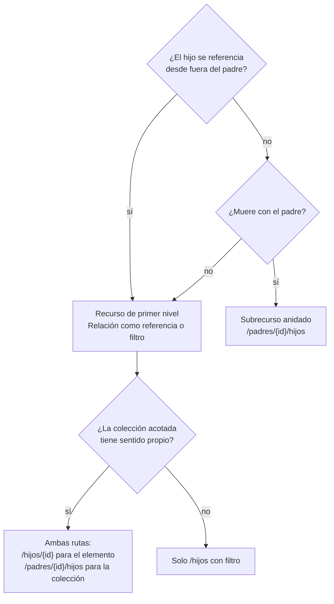
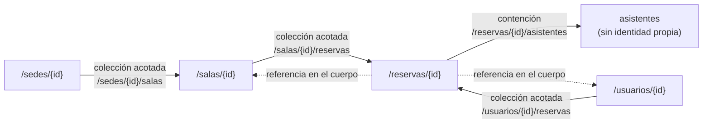

# Jerarquías y relaciones — `TEM-JERARQ`

## Resumen ejecutivo

Una vez que existen los recursos y tienen nombre, queda decidir cómo se alcanzan unos desde otros. La forma más visible de esa decisión es el anidamiento: `/sedes/n1/salas` en lugar de `/salas?sede=n1`. Parece una elección de estilo y no lo es. Cada nivel de anidamiento congela una relación en la estructura de las URIs, y las relaciones del negocio cambian más de lo que se supone al diseñarlas.

El error corriente no es anidar poco sino anidar por reflejo: reproducir en la ruta la cadena de claves foráneas del esquema. Produce URIs largas, obliga al consumidor a conocer todos los ancestros de un recurso para pedirlo, y multiplica las rutas que llevan a la misma cosa. El error simétrico —una superficie completamente plana donde toda relación se expresa con parámetros de consulta— pierde la capacidad de expresar contención y deja al consumidor sin pistas sobre qué depende de qué.

El criterio que ordena todo el documento cabe en una pregunta: **¿el hijo tiene identidad propia fuera del padre?** Si la tiene, la relación es una referencia y va en la representación o en un filtro. Si no la tiene, la relación es contención y el anidamiento la expresa bien.

---

## Definición

### Qué es

La decisión de cómo se expresan en la superficie de la API las relaciones entre recursos: qué recursos aparecen como segmentos anidados bajo otros, qué relaciones se expresan como campos de referencia dentro de una representación, y qué relaciones se navegan mediante filtros sobre colecciones de primer nivel.

### Qué problema resuelve

**Comunicar dependencia.** Que `/reservas/8f21c3/asistentes` esté anidado dice, sin documentación, que un asistente no existe fuera de una reserva. Es información de dominio codificada en la estructura, y el consumidor la absorbe sin leerla.

**Acotar el alcance de una colección.** `/sedes/n1/salas` es la colección de salas de una sede, no la colección de todas las salas filtrada. La distinción tiene consecuencias concretas de autorización: es más fácil razonar sobre «quién puede leer las salas de esta sede» que sobre «quién puede aplicar este filtro».

**Dar contexto a la creación.** `POST /sedes/n1/salas` no necesita un campo `sedeId` en el cuerpo: el contexto ya está en la ruta. Elimina la clase de error en que la ruta dice una cosa y el cuerpo otra, y con ella la pregunta de cuál gana.

### Qué NO es, y con qué se lo confunde

**No es el esquema relacional.** Una clave foránea es una decisión de almacenamiento. Que `reserva` tenga `sala_id` no implica que `reserva` deba colgar de `/salas/{id}`; implica que una reserva referencia una sala, que es otra cosa.

**No es hipermedia.** Anidar expresa relaciones en la estructura de las URIs; hipermedia las expresa como enlaces en la representación, de modo que el cliente no necesite construir rutas. Son mecanismos distintos y no compiten: una API puede anidar y además devolver enlaces. Fielding (`O-02`) sostiene que el cliente no debería construir URIs, lo que llevado al extremo haría irrelevante toda esta discusión; la evidencia de `O-04` —4,2 % de 500 APIs públicas cumplen HATEOAS— indica que el extremo no llegó. Lo trata [`TEM-HATEOAS`](../10-Fundamentos-REST/Hipermedia.md).

**No es agregación.** Que un `GET /reservas/{id}` devuelva la sala anidada en el cuerpo es una decisión de granularidad de representación, materia de [`TEM-RECURSOS`](Modelado-de-Recursos.md). Este documento trata la estructura de las rutas.

---

## El criterio de identidad propia

Es la herramienta que decide casi todos los casos. Un recurso tiene identidad propia cuando se puede responder que sí a estas tres preguntas:

1. **¿Se lo referencia desde otro recurso que no es su padre?** Una sala se referencia desde reservas, desde informes, desde permisos. Un asistente de una reserva no se referencia desde ningún lado.
2. **¿Sobrevive a su padre?** Si se elimina la sede, ¿siguen existiendo sus salas como concepto? En el dominio de reservas, no: una sala sin sede no significa nada. Pero si se elimina una sala, las reservas históricas siguen existiendo como registro.
3. **¿Alguien necesita obtenerlo sin conocer a su padre?** Un enlace en un correo de confirmación apunta a una reserva. Quien lo abre tiene el identificador de la reserva y no el de la sala ni el de la sede.



El nodo `AMB` es el resultado más frecuente en dominios reales y el que más incomoda porque parece una inconsistencia. No lo es, y la sección siguiente explica por qué.

---

## Cuándo anidar y cuándo no

### El patrón que funciona: anidar la colección, no el elemento

La forma que resuelve la mayoría de los casos con identidad propia es asimétrica, y conviene enunciarla explícitamente porque es contraintuitiva:

```http
GET  /v1/sedes/n1/salas          # la colección se accede por su padre
POST /v1/sedes/n1/salas          # la creación toma contexto del padre
GET  /v1/salas/a3f1              # el elemento se accede directamente
PATCH /v1/salas/a3f1             # y se modifica directamente
```

Lo que se anida es la **colección acotada**, porque «las salas de esta sede» es un concepto del negocio con sentido propio. Lo que no se anida es el **elemento**, porque una sala tiene identidad y obligar a conocer su sede para pedirla acopla al consumidor a una relación que puede cambiar —una sala puede reasignarse a otra sede, y con la ruta anidada eso cambiaría su URI—.

La regla que hace que esto no sea inconsistencia: **una URI de elemento tiene exactamente una forma canónica**. Si además existe `/sedes/n1/salas/a3f1`, hay dos rutas para una cosa, con dos entradas de caché, dos formas de referenciarla y la pregunta abierta de qué pasa si la sala no pertenece a esa sede —¿`404`, `403`, o se devuelve igual?—. **Esta guía recomienda** no exponer la forma anidada del elemento cuando el recurso tiene identidad propia; si por compatibilidad hay que servirla, que responda `301` a la canónica.

### Cuándo el anidamiento del elemento sí es correcto

Cuando el hijo **no** tiene identidad propia. Los asistentes de una reserva son el caso claro del dominio: no se referencian desde afuera, mueren con la reserva, y nadie los pide sin la reserva.

```http
GET    /v1/reservas/8f21c3/asistentes
POST   /v1/reservas/8f21c3/asistentes
DELETE /v1/reservas/8f21c3/asistentes/m.paz%40ejemplo.com
```

Acá la ruta anidada del elemento es correcta porque **el identificador del hijo solo es único dentro del padre**. Un correo puede ser asistente de muchas reservas; `/asistentes/m.paz@ejemplo.com` no identificaría nada.

Conviene notar que en este ejemplo los asistentes son a la vez un caso donde exponerlos como subrecurso puede ser innecesario. Si la única manera de modificarlos es reemplazar la lista entera, alcanza con un `PATCH` sobre la reserva y el subrecurso sobra. La razón para exponerlo es la operación individual: agregar o quitar un asistente sin reenviar la lista, con el control de concurrencia que eso permite.

### Cuándo no anidar nada

Cuando la relación no es de contención sino de referencia entre iguales. Una reserva referencia una sala y un usuario; no pertenece a ninguno de los dos en el sentido en que un asistente pertenece a una reserva. La relación se expresa en la representación:

```json
{
  "id": "8f21c3",
  "sala": { "id": "a3f1", "nombre": "Belgrano" },
  "organizador": { "id": "u-771", "nombre": "L. Ferreyra" }
}
```

Y la navegación inversa, cuando hace falta, se expresa como colección acotada —`/salas/a3f1/reservas`— o como filtro sobre la colección de primer nivel —`/reservas?sala=a3f1`—. Las dos formas son legítimas y se eligen con el criterio de [`TEM-URI`](Nomenclatura-de-URIs.md): si «las reservas de esta sala» es un concepto que el negocio nombra, la colección acotada lo expresa mejor; si es una de veinte formas de filtrar reservas, es un filtro y no merece una ruta propia.

**La señal de que un filtro debería haber sido colección acotada** es que aparezca en todos los casos de uso y nunca combinado con otros filtros. La señal inversa —una colección acotada que debería haber sido filtro— es que existan cinco rutas anidadas paralelas para el mismo recurso: `/salas/{id}/reservas`, `/usuarios/{id}/reservas`, `/sedes/{id}/reservas`. Tres formas de listar reservas son tres formas de mantener, documentar y paginar lo mismo.

---

## Hasta qué profundidad

Ninguna guía verificada fija un límite de profundidad. Lo que sí existe es una restricción estructural de Google (`G-04` AIP-121) que tiene consecuencias sobre la profundidad sin hablar de ella: las relaciones entre recursos *«**must** poder representarse mediante un grafo dirigido acíclico»*.

La restricción es más útil de lo que parece, porque el ciclo es fácil de introducir sin advertirlo. Si `/salas/{id}/reservas` existe y `/reservas/{id}/sala` también, hay un ciclo navegable, y con él dos consecuencias molestas: no hay una jerarquía canónica que documentar, y el consumidor puede llegar al mismo recurso por caminos de longitud arbitraria.

Sobre la profundidad concreta, **esta guía recomienda** un máximo de dos colecciones en la ruta —`/padres/{id}/hijos`— y tratar el tercer nivel como excepción que se justifica. Las razones son tres y ninguna es normativa:

**Cada nivel es un compromiso.** `/sedes/n1/salas/a3f1/reservas` afirma que una reserva pertenece a una sala que pertenece a una sede, y que esa cadena es estable. Si mañana una sala puede compartirse entre sedes, la ruta miente y cambiarla es rompiente.

**Cada nivel es un identificador que el consumidor debe tener.** Para pedir las reservas de una sala con la ruta profunda hay que conocer también la sede. Si el consumidor llegó a la sala por un enlace, no la conoce, y necesita una petición extra solo para construir la URI.

**Cada nivel multiplica los casos de error.** Con tres identificadores en la ruta hay que decidir qué responder cuando el primero existe y el segundo no, cuando los dos existen pero no están relacionados, y cuando el tercero pertenece a otro padre. Son cinco o seis combinaciones que hay que especificar y probar, y que en la práctica casi nunca se especifican.

Ese último punto merece una decisión explícita porque es donde las APIs anidadas se rompen en silencio. Ante `GET /sedes/n1/salas/a3f1` donde la sala `a3f1` existe pero pertenece a la sede `s2`:

| Respuesta | Cuándo corresponde |
|---|---|
| `404 Not Found` | La respuesta correcta por defecto: en el contexto de la sede `n1`, esa sala no existe |
| `200 OK` con la sala | Incorrecto: la ruta afirma una relación que no se cumple |
| `403 Forbidden` | Solo si además hay un problema de permisos, y con la advertencia de `ACT-07` sobre filtrado de existencia |

**Esta guía recomienda** `404`, y que la validación de la cadena completa sea obligatoria y esté probada. Una API anidada que no verifica la relación entre los segmentos está sirviendo el recurso por su último identificador e ignorando el resto de la ruta, lo cual es peor que no anidar: le enseña al consumidor que el prefijo no importa.

---

## Relaciones muchos a muchos

El caso que ninguna guía resuelve bien y donde más se improvisa. En el dominio de reservas aparece con las salas y los equipamientos: una sala tiene varios equipamientos, un equipamiento está en varias salas.

Hay tres formas y se eligen por una sola pregunta: **¿la relación en sí tiene datos o ciclo de vida?**

### Opción A — Sin datos propios: la relación es un campo

Cuando lo único que importa es qué está relacionado con qué, la relación se expresa como una lista de referencias dentro de la representación:

```json
{ "id": "a3f1", "nombre": "Belgrano", "equipamientos": ["proyector", "videoconferencia"] }
```

La modificación se hace reemplazando la lista con `PATCH` sobre la sala. Es la opción más simple y la correcta en la mayoría de los casos. Su límite aparece cuando la lista es grande —cientos de elementos hacen impracticable el reemplazo completo— o cuando dos clientes la modifican concurrentemente, momento en que el último gana y el otro pierde sus cambios sin enterarse. Ese problema tiene solución con peticiones condicionales, y lo trata [`TEM-IDEM`](../30-Semantica-HTTP/Idempotencia-y-Concurrencia.md).

### Opción B — Sin datos propios pero con operación individual: subcolección de referencias

Cuando hay que agregar y quitar de a uno, la relación se expone como subcolección desde uno de los lados:

```http
GET    /v1/salas/a3f1/equipamientos
PUT    /v1/salas/a3f1/equipamientos/proyector      # idempotente: lo asocia
DELETE /v1/salas/a3f1/equipamientos/proyector      # lo desasocia
```

El uso de `PUT` es deliberado y aprovecha su idempotencia según `N-01` §9.2.2: asociar dos veces deja el mismo estado. Con `POST` habría que decidir qué pasa en la segunda llamada. La semántica completa la trata [`TEM-METODOS`](../30-Semantica-HTTP/Metodos.md).

La decisión que queda abierta es **desde qué lado se expone**, y conviene resolverla por asimetría de uso: se expone desde el lado que la aplicación consulta y modifica, no desde ambos. Exponer `/salas/{id}/equipamientos` y `/equipamientos/{id}/salas` duplica la superficie y obliga a mantener dos vistas coherentes de la misma tabla.

### Opción C — Con datos propios: la relación es un recurso

Cuando la asociación tiene atributos, estado o ciclo de vida, deja de ser una relación y pasa a ser una cosa. En el dominio: la participación de un usuario en una reserva tiene estado de confirmación, fecha de invitación y a veces un rol.

```http
GET   /v1/participaciones/p-4471
PATCH /v1/participaciones/p-4471      # { "estado": "confirmada" }
GET   /v1/reservas/8f21c3/participaciones
GET   /v1/usuarios/u-771/participaciones
```

Es el **recurso de asociación**, y su señal de aparición es inconfundible: cuando alguien pregunta «¿dónde guardo la fecha en que aceptó la invitación?», la relación ya es un recurso y modelarla como lista de referencias va a fallar.

El costo es real y conviene declararlo: aparece un concepto en la API que el negocio quizá no nombra. Si el negocio no tiene palabra para eso, conviene buscarla con `ACT-05` antes de inventarla, porque un recurso llamado `salaEquipamiento` es una tabla de unión con otra ropa.

| Opción | Cuándo | Costo |
|---|---|---|
| **A** — lista de referencias en el campo | La relación no tiene datos y la lista es chica | Reemplazo completo; concurrencia por último-gana |
| **B** — subcolección de referencias | Hace falta operación individual | Superficie extra; decidir desde qué lado |
| **C** — recurso de asociación | La relación tiene datos o estado propio | Un concepto más que el negocio quizá no nombra |

---

## Aplicación por escenario

### `ESC-1` — API nueva

Se decide con el criterio de identidad aplicado recurso por recurso, y se registra el resultado. La salida es una tabla que declara, para cada par de recursos relacionados, cómo se expresa la relación y por qué.

La trampa específica de este escenario es anidar por prolijidad. Un modelo con jerarquía completa —`/organizaciones/{id}/sedes/{id}/salas/{id}/reservas/{id}`— se ve ordenado en un diagrama y es hostil en uso: cada petición exige cuatro identificadores, cada relación queda comprometida, y el primer traslado de una sala entre sedes rompe URIs.

Conviene además fijar acá una decisión que después es cara de revertir: **si el elemento tiene forma canónica única**. Publicar desde el principio `/salas/{id}` como única forma de referirse a una sala evita la discusión posterior sobre cuál de las dos rutas es la buena.

### `ESC-2` — Exposición o migración

El escenario donde el anidamiento se hereda sin decidirse, porque la cadena de claves foráneas del esquema se traduce mecánicamente en cadena de segmentos. El resultado típico es una API con cuatro niveles que reproduce el diagrama entidad-relación.

El procedimiento correctivo tiene un solo paso que hace casi todo el trabajo: **por cada nivel de anidamiento propuesto, verificar si el consumidor conoce ese identificador en el momento en que necesita hacer la llamada**. Un nivel que obliga a una petición previa solo para construir la URI es un nivel que sobra.

Hay un caso particular de migración desde SOAP: las operaciones viejas suelen recibir todos los identificadores de la cadena como parámetros, porque en RPC no cuesta nada. Traducir eso a segmentos anidados reproduce el acoplamiento con otra sintaxis.

### `ESC-3` — Evolución en producción

Las rutas anidadas publicadas están congeladas, y esto tiene una consecuencia que se descubre tarde: **un cambio en el modelo de negocio puede invalidar una jerarquía sin invalidar ningún dato**. Cuando una sala pasa a poder compartirse entre sedes, la ruta `/sedes/{id}/salas/{id}` deja de tener sentido y no hay forma compatible de arreglarla.

La reacción habitual —agregar la ruta plana `/salas/{id}` y dejar la anidada funcionando— es correcta como transición y produce el estado que este documento desaconseja: dos formas para una cosa. Conviene entonces hacerlo con las tres piezas completas: se publica la forma canónica, se deprecia la anidada con el mecanismo de [`TEM-DEPR`](../50-Evolucion-y-Versionado/Deprecacion-y-Retiro.md), y se mide quién la sigue usando. Sin la medición, la ruta vieja queda para siempre.

Agregar una subcolección nueva a un recurso existente no rompe y es el movimiento seguro de este escenario.

### `ESC-4` — Evaluación de una API ajena

**`ESC-4a`.** Se extrae el árbol de rutas de la especificación y se buscan cuatro cosas: profundidad mayor a dos, elementos accesibles por más de una ruta, ciclos navegables, y subcolecciones paralelas del mismo recurso desde varios padres. Cada una es un hallazgo con consecuencia práctica para quien va a integrar.

Una quinta verificación produce hallazgos que el equipo productor suele desconocer: **probar si la cadena de la ruta se valida**. Pedir `/sedes/n1/salas/a3f1` con una sala que pertenece a otra sede revela si el servidor está ignorando el prefijo. Es una prueba de treinta segundos y falla con más frecuencia de la que se admite.

**`ESC-4b`.** El árbol se reconstruye desde las rutas observadas, agrupando por posición de segmento. Lo que se puede inferir con confianza razonable es la jerarquía declarada; lo que no se puede inferir es si esa jerarquía se valida ni si existen rutas alternativas no documentadas para los mismos recursos. Ambas cosas se registran como preguntas abiertas.

La técnica de sondeo que resolvería la duda —probar rutas construidas por combinación de identificadores conocidos— cae de lleno en el límite que fija [`MARCO-ESCENARIOS`](../00-Marco-de-Referencia/Escenarios.md): solo con autorización y dentro de los términos de servicio.

### Qué cambia según el contexto

| Contexto | Qué cambia en las jerarquías |
|---|---|
| `CTX-1` pública | Cada nivel es un compromiso público sobre una relación del negocio. Conviene anidar lo mínimo: agregar una subcolección después no rompe, quitar un nivel sí. La validación de la cadena es obligatoria y auditable |
| `CTX-2` interna | Una jerarquía mal elegida se puede corregir coordinando el despliegue. El riesgo propio es el inverso: rutas que cambian de forma tan seguido que ningún consumidor las memoriza |
| `CTX-3` app propia | La tentación es anidar según el flujo de navegación de la interfaz —la pantalla entra por sede, entonces la ruta entra por sede—. Es el mismo antipatrón del recurso-pantalla, con otra forma |
| `CTX-4` integración | La jerarquía la impone el proveedor, y suele ser profunda. El trabajo es que esa profundidad no se propague: la capa de aislamiento expone recursos planos hacia adentro |

---

## Ejemplos concretos

Ejemplos **sintéticos** del sistema de reserva de salas.

### El mapa de relaciones del dominio



Las flechas punteadas son referencias que viven en la representación y no producen rutas. La flecha a `ASIST` es la única contención verdadera: es el único recurso sin forma canónica de primer nivel.

Nótese la decisión visible en el diagrama: **hay dos colecciones acotadas de reservas**, desde sala y desde usuario. Es exactamente la situación que la sección de antipatrones desaconseja cuando se multiplica, y acá se acepta porque las dos corresponden a casos de uso primarios del negocio —«qué hay reservado en esta sala» y «qué reservé yo»— y no a filtros arbitrarios. Con una tercera, la decisión correcta sería colapsarlas todas en `/reservas` con filtros.

### La superficie resultante

```http
# Sedes y salas
GET    /v1/sedes/n1
GET    /v1/sedes/n1/salas                     # colección acotada
POST   /v1/sedes/n1/salas                     # la sede viene de la ruta, no del cuerpo
GET    /v1/salas/a3f1                         # forma canónica del elemento
PATCH  /v1/salas/a3f1

# Reservas: elemento plano, colecciones acotadas
GET    /v1/reservas/8f21c3
GET    /v1/salas/a3f1/reservas?desde=2026-08-01
GET    /v1/usuarios/u-771/reservas?estado=confirmada

# Asistentes: sin identidad propia, anidados también en el elemento
GET    /v1/reservas/8f21c3/asistentes
PUT    /v1/reservas/8f21c3/asistentes/m.paz%40ejemplo.com
DELETE /v1/reservas/8f21c3/asistentes/m.paz%40ejemplo.com

# Equipamientos: relación muchos a muchos sin datos propios (opción B)
GET    /v1/salas/a3f1/equipamientos
PUT    /v1/salas/a3f1/equipamientos/proyector
```

Lo que deliberadamente **no** existe en esta superficie: `/sedes/n1/salas/a3f1` —el elemento por ruta anidada—, `/sedes/n1/salas/a3f1/reservas/8f21c3` —tercer nivel—, y `/equipamientos/proyector/salas` —el lado inverso de la relación—.

### Creación con contexto en la ruta

```http
POST /v1/sedes/n1/salas HTTP/1.1
Content-Type: application/json

{ "nombre": "Sarmiento", "capacidad": 8, "equipamientos": ["proyector"] }
```

```http
HTTP/1.1 201 Created
Location: /v1/salas/c9d4
Content-Type: application/json

{ "id": "c9d4", "nombre": "Sarmiento", "capacidad": 8, "sede": { "id": "n1", "nombre": "Norte" } }
```

Dos cosas que hace este intercambio. El cuerpo no lleva `sedeId` porque la ruta ya lo dice, lo que elimina la posibilidad de que discrepen. Y el `Location` apunta a la **forma canónica** del recurso creado, no a la ruta anidada por donde se lo creó: es el mecanismo que le enseña al consumidor cuál es la URI buena sin necesidad de documentación.

### La validación de la cadena

```http
GET /v1/sedes/n1/salas/a3f1 HTTP/1.1
```

Esta ruta no existe en la superficie propuesta y devuelve `404`. Pero si por compatibilidad hubiera que servirla, la conducta correcta ante una sala que pertenece a otra sede es:

```http
HTTP/1.1 404 Not Found
Content-Type: application/problem+json

{
  "type": "https://api.reservas.ejemplo.com/problemas/recurso-no-encontrado",
  "title": "Recurso no encontrado",
  "status": 404,
  "detail": "La sala a3f1 no pertenece a la sede n1."
}
```

Devolver `200` con la sala sería el error: la ruta afirma una relación que no se cumple, y el consumidor concluiría que la verificó.

### En C#: la validación que casi nunca se escribe

```csharp
// Incorrecto y frecuente: el prefijo de la ruta se ignora.
app.MapGet("/v1/sedes/{sedeId}/salas/{salaId}",
    async (string sedeId, string salaId, IRepositorioSalas repo) =>
    {
        var sala = await repo.ObtenerAsync(salaId);      // sedeId no se usa para nada
        return sala is null ? Results.NotFound() : Results.Ok(sala.AResource());
    });
```

```csharp
// Correcto: la cadena completa es parte de la identificación.
app.MapGet("/v1/sedes/{sedeId}/salas/{salaId}",
    async (string sedeId, string salaId, IRepositorioSalas repo) =>
    {
        var sala = await repo.ObtenerAsync(salaId);
        if (sala is null || sala.SedeId.Valor != sedeId)
            return Results.NotFound();                   // no distingue "no existe" de "es de otra sede"
        return Results.Ok(sala.AResource());
    });
```

La condición unificada no es descuido: distinguir «no existe» de «existe pero es de otra sede» le confirma a quien pregunta que el identificador es válido, que es la filtración de existencia sobre la que advierte `ACT-07` en [`MARCO-ACTORES`](../00-Marco-de-Referencia/Actores.md). Google llega a la misma conclusión por otro camino en `G-04` AIP-193, donde prescribe `PERMISSION_DENIED` con HTTP 403 con independencia de si el recurso existe.

La creación con contexto en la ruta, y la decisión de no aceptar el padre en el cuerpo:

```csharp
public sealed record CrearSalaRequest(string Nombre, int Capacidad, string[] Equipamientos);
// Deliberadamente sin SedeId: viene de la ruta y no puede discrepar.

app.MapPost("/v1/sedes/{sedeId}/salas",
    async (string sedeId, CrearSalaRequest cuerpo, IRepositorioSedes sedes, IRepositorioSalas salas) =>
    {
        if (!await sedes.ExisteAsync(sedeId))
            return Results.NotFound();

        var sala = Sala.Crear(sedeId, cuerpo.Nombre, cuerpo.Capacidad, cuerpo.Equipamientos);
        await salas.AgregarAsync(sala);

        // Location apunta a la forma canónica, no a la ruta anidada de creación.
        return Results.Created($"/v1/salas/{sala.Id.Valor}", sala.AResource());
    });
```

La asociación idempotente de la relación muchos a muchos:

```csharp
// PUT: asociar dos veces deja el mismo estado. 204 en ambos casos.
app.MapPut("/v1/salas/{salaId}/equipamientos/{equipamiento}",
    async (string salaId, string equipamiento, IRepositorioSalas repo) =>
    {
        var sala = await repo.ObtenerAsync(salaId);
        if (sala is null) return Results.NotFound();
        if (!Equipamiento.EsValido(equipamiento)) return Results.NotFound();

        sala.AsociarEquipamiento(equipamiento);   // idempotente por diseño del agregado
        await repo.GuardarAsync(sala);
        return Results.NoContent();
    });
```

La elección del código de estado —`204` frente a `200` o `201`— y las implicancias de la idempotencia son materia de [`TEM-STATUS`](../30-Semantica-HTTP/Codigos-de-Estado.md) y [`TEM-METODOS`](../30-Semantica-HTTP/Metodos.md).

---

## Preguntas guía

- Para cada recurso anidado: ¿tiene identidad propia? ¿Cómo lo verifiqué?
- ¿Alguno de mis recursos es alcanzable por más de una ruta? ¿Cuál es la canónica y está documentada?
- ¿Valido la cadena completa de identificadores, o sirvo el recurso por el último y el resto es decorativo?
- Para cada nivel de anidamiento: ¿el consumidor conoce ese identificador cuando necesita hacer la llamada?
- Si mañana la relación entre esos dos recursos cambia de cardinalidad, ¿cuántas URIs quedan mintiendo?
- ¿Cuántas colecciones acotadas del mismo recurso mantengo? ¿Todas corresponden a casos de uso reales?
- ¿Alguna relación muchos a muchos mía tiene datos que no sé dónde poner?
- ¿Hay algún ciclo navegable en mi grafo de recursos?

---

## Criterios de calidad

### Señales de una jerarquía sana

Cada recurso tiene exactamente una URI canónica de elemento. El anidamiento no pasa de dos colecciones salvo excepción registrada. Toda cadena de identificadores se valida completa y hay una prueba que lo verifica. Las relaciones sin contención se expresan como referencias o filtros, no como rutas. El grafo de recursos es acíclico. Y las colecciones acotadas que existen corresponden a conceptos que el negocio nombra.

### Antipatrones

**El esquema entidad-relación traducido a rutas.** Cuatro o cinco niveles que reproducen la cadena de claves foráneas. Se detecta contando identificadores por URI: más de dos es sospechoso, más de tres casi siempre es esto.

**El prefijo decorativo.** La ruta anida pero el servidor solo usa el último identificador. Es el defecto más común de las APIs anidadas y el más invisible: funciona en todos los casos de prueba, porque las pruebas usan combinaciones coherentes. Se detecta con una sola petición de identificadores cruzados.

**Las dos rutas para un elemento.** `/salas/a3f1` y `/sedes/n1/salas/a3f1` sirviendo lo mismo. Duplica caché, duplica documentación, y deja abierta la pregunta de cuál poner en un enlace.

**La proliferación de colecciones acotadas.** El mismo recurso listado desde cinco padres distintos. Cada una hay que paginarla, filtrarla, autorizarla y documentarla por separado, y casi siempre divergen con el tiempo. Tres es el umbral donde conviene colapsar en una colección de primer nivel con filtros.

**El ciclo navegable.** `/salas/{id}/reservas/{id}/sala/{id}/reservas`. No suele diseñarse: aparece por agregar subcolecciones de a una sin mirar el grafo completo.

**La tabla de unión expuesta.** Un recurso `salaEquipamiento` o `reservaUsuario`, con nombre concatenado, que existe porque existe la tabla. Si la asociación tiene datos propios merece un recurso, y ese recurso merece el nombre que el negocio le da; si no los tiene, no merece recurso.

**El anidamiento según el flujo de la interfaz.** Rutas que reproducen el orden en que las pantallas piden los datos. Se reconoce porque la jerarquía cambia cuando cambia el diseño de la aplicación.

**La subcolección de un recurso sin operaciones individuales.** Exponer `/reservas/{id}/asistentes/{correo}` cuando la única forma real de modificar asistentes es reemplazar la lista entera. Superficie que hay que mantener y que nadie usa.

---

## Anexo — Lista de verificación de relaciones

Se recorre por cada par de recursos relacionados, en `ESC-1` y `ESC-2`, y se revisa en `ESC-3` cada vez que cambia una cardinalidad del negocio.

```yaml
relacion:
  origen: ""                       # recurso padre o referente
  destino: ""                      # recurso hijo o referenciado
  cardinalidad: 1-1 | 1-n | n-m

  criterio_de_identidad:
    destino_se_referencia_desde_fuera: si | no
    destino_sobrevive_al_origen: si | no
    destino_se_obtiene_sin_conocer_al_origen: si | no
    # tres "no" ⇒ contención; alguno "sí" ⇒ referencia

  expresion: contencion | coleccion-acotada | referencia-en-cuerpo | filtro | recurso-de-asociacion
  ruta_coleccion: ""               # p. ej. /sedes/{sedeId}/salas
  ruta_canonica_elemento: ""       # p. ej. /salas/{salaId}. Vacío solo si hay contención
  rutas_alternativas: []           # deberían ser cero; si hay, indicar cuál redirige

  profundidad: 0                   # colecciones en la ruta. >2 exige justificacion
  justificacion_profundidad: ""

  validacion_de_cadena:
    se_valida_completa: si | no
    respuesta_si_no_corresponde: 404 | 403
    prueba_automatizada: ""        # nombre del test que lo verifica

  estabilidad:
    puede_cambiar_la_cardinalidad: si | no | desconocido
    impacto_si_cambia: ""          # qué URIs quedarían mintiendo

  # solo para n-m
  datos_propios_de_la_relacion: si | no
  lado_expuesto: ""                # uno solo
  nombre_de_negocio_de_la_asociacion: ""   # vacío ⇒ probablemente sea tabla de unión
```

Los dos campos que más previenen son `validacion_de_cadena.prueba_automatizada` y `estabilidad.puede_cambiar_la_cardinalidad`.

El primero, porque el prefijo decorativo es un defecto que ninguna prueba escrita de la manera habitual detecta: hay que probarlo con identificadores cruzados a propósito.

El segundo, porque la pregunta rara vez se hace en el momento del diseño y siempre se responde tarde. Una relación que el negocio podría cambiar de `1-n` a `n-m` no debería estar codificada en la estructura de las URIs, por más que hoy sea `1-n`.
