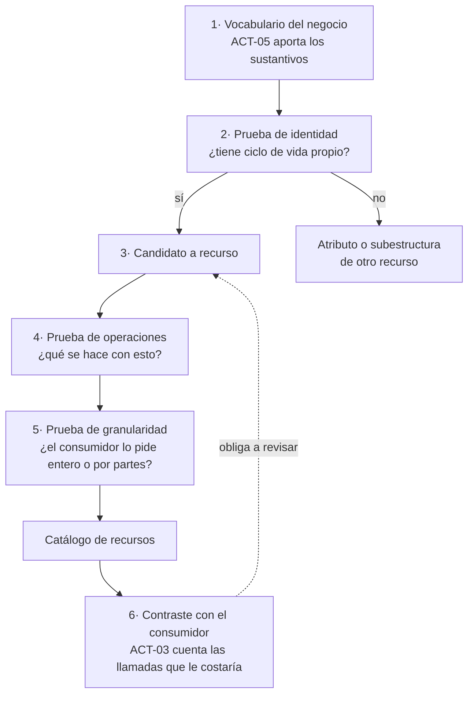
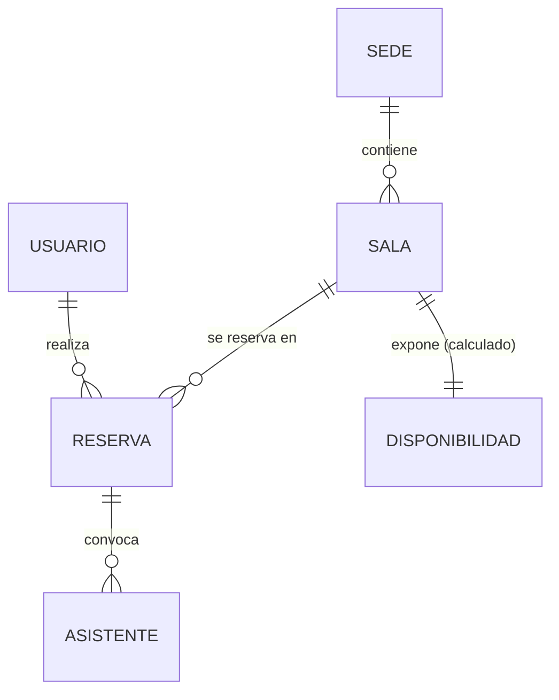

# Modelado de recursos — `TEM-RECURSOS`

## Resumen ejecutivo

Antes de discutir si la ruta va en plural o si el segmento lleva guión, hay una pregunta anterior que casi nunca se hace explícita: qué cosas existen en esta API. La respuesta parece obvia y no lo es. La mayoría de las APIs mal diseñadas que uno encuentra no fallaron por elegir mal el casing sino por haber tomado el catálogo de recursos de un lugar equivocado —la lista de tablas, la lista de clases del dominio, la lista de pantallas— en vez de construirlo.

Un recurso es cualquier cosa que merece ser nombrada e identificada de forma estable. Esa definición es amplia a propósito: incluye entidades del negocio, pero también colecciones, configuraciones, informes calculados y procesos en curso. Lo que la definición excluye es igual de importante: no todo lo que tiene una fila en una tabla merece una URI, y no todo lo que merece una URI tiene una fila en una tabla.

Este documento trata cómo se llega desde el vocabulario del dominio hasta un catálogo de recursos defendible, qué granularidad conviene, y qué aporta —y qué cuesta— adoptar el diseño orientado a recursos de Google (`G-04` AIP-121) como marco de referencia.

---

## Definición

### Qué es

Un **recurso** es una abstracción con identidad estable a la que se le puede asignar un identificador y de la que se pueden obtener representaciones. La formulación proviene de Fielding (`O-01` §5.2.1.1), donde el concepto se define como una función de pertenencia que varía en el tiempo: el recurso es «las reservas de la sala Belgrano de hoy», y lo que devuelve cambia cada día sin que el recurso deje de ser el mismo. Esa distinción entre el recurso y su representación es la que sostiene todo lo demás; la desarrolla [`TEM-REST`](../10-Fundamentos-REST/Que-es-REST.md).

Para el trabajo cotidiano alcanza con una versión operativa: **es un recurso aquello sobre lo que tiene sentido preguntar «¿lo puedo obtener por su nombre?»**. Si la respuesta es sí y el nombre no cambia cuando cambian sus datos, es un recurso.

El modelado de recursos es la actividad de producir el catálogo de esos nombres para un dominio dado, junto con la decisión de qué queda adentro y qué se representa como campo de otro recurso.

### Qué problema resuelve

**Que el consumidor pueda razonar sobre la API sin leer su documentación completa.** Un catálogo de recursos bien elegido es una descripción del negocio. Alguien que ve `salas`, `sedes`, `reservas` y `usuarios` entiende el sistema antes de leer una sola operación. Alguien que ve `obtenerDatosGenerales`, `procesarSolicitud` y `consultaMaestro` no entiende nada hasta abrir cada endpoint, y a veces ni así.

**Que las operaciones se deriven en lugar de inventarse.** Con un catálogo de recursos y la semántica estándar de los métodos HTTP, la mayor parte de la superficie de la API queda determinada: sobre una colección se lista y se crea, sobre un elemento se obtiene, se reemplaza, se modifica y se borra. Google lo formaliza en `G-04` AIP-121 con cinco métodos estándar —Get, List, Create, Update, Delete— y la regla de que *«las APIs **should** preferir métodos estándar antes que métodos custom»*. La consecuencia práctica es que cada operación nueva que no encaja obliga a justificarse, y esa fricción es sana.

**Que el contrato sobreviva al refactor interno.** Un recurso es un concepto del dominio expuesto; una tabla es una decisión de almacenamiento. Cuando coinciden es coincidencia, no diseño. Separarlos cuesta trabajo de traducción y compra la libertad de reorganizar la base sin publicar una versión nueva.

### Qué NO es, y con qué se lo confunde

**Un recurso no es una tabla.** Es el error dominante de `ESC-2`. Una tabla `TB_RESERVA_CAB` con su `TB_RESERVA_DET` produce, si nadie interviene, los recursos `reservaCab` y `reservaDet`, y con eso se le filtra al consumidor una decisión de normalización que no le incumbe. Desde el punto de vista del negocio hay **una** reserva, con sus asistentes adentro. La relación entre recursos y tablas puede ser de uno a muchos en cualquier dirección: un recurso `disponibilidad-de-sala` puede no tener ninguna tabla detrás, y las tres tablas de una reserva pueden ser un solo recurso.

**Un recurso no es una clase del dominio.** Es el error simétrico, más sutil y más frecuente en equipos con buen diseño interno. Un agregado de dominio bien construido tiene invariantes, comportamiento y a menudo un grafo de objetos interno que no tiene por qué ser público. Exponer `Reserva` la clase como `reserva` el recurso con todos sus campos convierte cada refactor del dominio en un cambio de contrato. La guía hermana de código trata el mismo límite desde el otro lado en [`TEM-MODELOS`](../../Organizacion-Estilo-Patrones-Codigo/30-Organizacion-Interna/Modelos-y-Contratos.md).

**Un recurso no es una pantalla.** Es el riesgo dominante de `CTX-3`. Un recurso `pantalla-mis-reservas` que devuelve exactamente los campos que esa vista dibuja funciona perfecto hasta el primer rediseño visual, momento en que un cambio de maquetación se convierte en un cambio de backend con su despliegue y su versión.

**Un recurso no es una operación.** Es el error que produce `POST /crearReserva`. Lo trata en detalle [`TEM-ACCIONES`](Operaciones-No-CRUD.md), con la salvedad de que hay casos legítimos donde un proceso sí merece ser recurso, y la diferencia está en si tiene identidad y estado observable.

---

## Cómo se llega al modelo desde el dominio

No hay algoritmo. Hay una secuencia que funciona y que se puede auditar después, lo cual importa porque el resultado hay que defenderlo ante quien pregunte por qué la API no se parece a la base de datos.



**Paso 1 — el vocabulario.** El material bruto son los sustantivos que usa el negocio, y quien los tiene es `ACT-05`. La instrucción concreta es escuchar las distinciones: si el negocio dice «reserva» y «solicitud de reserva» como cosas diferentes, son dos recursos o son uno con estados, y decidirlo mal se paga después con un campo `tipo` que reintroduce la distinción de la peor manera posible.

**Paso 2 — la prueba de identidad.** Un candidato pasa si se puede responder afirmativamente a estas tres: ¿se lo puede referenciar desde otro lado sin repetir sus datos? ¿tiene un ciclo de vida que no coincide con el de su contenedor? ¿alguien necesita obtenerlo sin obtener a su contenedor? En el dominio de reservas, una `sede` pasa las tres. Un `horario-de-apertura` de esa sede no pasa ninguna: no se lo referencia, nace y muere con la sede, y nadie lo pide suelto. Es un campo.

**Paso 3 y 4 — las operaciones.** Para cada candidato se enumera qué se le hace. Un recurso sobre el que solo se hace `GET` y nada más es sospechoso: puede ser legítimo —un catálogo de referencia lo es— o puede ser un campo disfrazado. `G-04` AIP-121 va más lejos y fija un mínimo: *«un recurso **must** soportar como mínimo Get»* y *«**must** soportar también List, salvo los recursos singleton»*. Como criterio de descarte funciona bien; como obligación es la convención de Google y no aplica fuera de su ecosistema.

**Paso 5 — la granularidad.** Se trata en la sección siguiente.

**Paso 6 — el contraste.** El paso que más se saltea y el único que produce evidencia. Se toman los tres o cuatro casos de uso reales del consumidor y se cuenta cuántas peticiones le cuesta cada uno con el modelo propuesto. Un caso de uso corriente que exige seis llamadas es un defecto de modelado, no una oportunidad de que el cliente paralelice.

---

## Granularidad

Es la decisión con más consecuencias y la que menos se discute explícitamente. Se puede enunciar como una tensión entre dos costos que se mueven en direcciones opuestas.

**Recursos gruesos** —pocos, con mucho adentro— hacen que un caso de uso se resuelva en una llamada, y hacen que cada llamada traiga datos que nadie pidió. El costo aparece en la escritura: si `reserva` incluye la sala completa y el usuario completo, actualizar la hora de inicio implica decidir qué pasa con esos objetos anidados, y las respuestas posibles son todas incómodas.

**Recursos finos** —muchos, cada uno mínimo— hacen que cada cosa se pueda leer y escribir por separado, y hacen que dibujar una pantalla cueste ocho peticiones. Es el modelo que Google favorece y funciona bien cuando el consumidor es una biblioteca cliente generada que puede componer, no tanto cuando es una aplicación móvil con latencia real.

La resolución no es elegir un punto en el eje sino **elegir grueso para la lectura y fino para la escritura**, que es lo que hace la mayoría de las APIs que envejecen bien. Un `GET /reservas/{id}` devuelve la reserva con la sala y el usuario resumidos —lo suficiente para mostrar sin una segunda llamada—; la modificación de la sala se hace sobre `/salas/{id}` y no a través de la reserva. Esto es criterio propio: **esta guía recomienda** disociar la granularidad de lectura de la de escritura, y tratar los objetos anidados de una respuesta como referencias enriquecidas y no como partes modificables.

El mecanismo que evita tener que elegir de una vez para siempre es la selección de campos —`fields`, `select`, *sparse fieldsets*—, que permite un recurso grueso por defecto y fino a pedido. Su sintaxis y sus costos los trata [`TEM-FILTRO`](../40-Contratos-y-Representaciones/Filtrado-Orden-y-Seleccion.md); acá interesa solo como argumento para no sobre-fragmentar el modelo por miedo a las respuestas grandes.

---

## Tipos de recurso

La clasificación no es normativa: es una herramienta de esta guía para no tratar todos los casos con la misma plantilla.

| Tipo | Qué es | Ejemplo del dominio | Métodos típicos |
|---|---|---|---|
| **Colección** | El conjunto, con identidad propia | `/salas` | `GET`, `POST` |
| **Elemento** | Un miembro identificado de una colección | `/salas/{id}` | `GET`, `PUT`, `PATCH`, `DELETE` |
| **Singleton** | Existe uno solo; no vive dentro de una colección | `/usuarios/{id}/preferencias` | `GET`, `PUT`, `PATCH` |
| **Subcolección** | Colección que solo existe dentro de un padre | `/salas/{id}/reservas` | `GET`, `POST` |
| **Calculado** | Derivado, no almacenado; sin escritura | `/salas/{id}/disponibilidad` | `GET` |
| **De proceso** | Representa una ejecución en curso, con estado observable | `/importaciones/{id}` | `GET`, a veces `DELETE` |

### La colección es un recurso, no un listado

La confusión más común y la que más consecuencias tiene. `/salas` no es «la operación de listar salas»: es un recurso con su propia representación, su propio `ETag`, su propia caché y su propia paginación. Tratarlo así explica de inmediato por qué `POST /salas` crea una sala —se agrega un miembro a la colección, no se «llama al método crear»— y por qué la respuesta a un `GET /salas` puede llevar metadatos que no pertenecen a ninguna sala en particular.

### Singleton frente a colección

Un recurso es singleton cuando su cardinalidad respecto de su contexto es exactamente uno y no tiene sentido enumerar los demás. Las preferencias de un usuario son singleton: no hay una colección de preferencias de la que este usuario tenga una. La configuración de una sede también.

La señal de que algo se modeló mal como singleton es que aparezca la necesidad de tener dos. La señal simétrica, más frecuente, es una colección que siempre tiene un elemento y a la que el consumidor accede siempre con el mismo índice.

Sobre singletons, `G-04` AIP-121 introduce la excepción explícita: un recurso *must* soportar `List` **salvo los singleton**, que por definición no tienen nada que listar. Y `G-05` regla 134 exige pluralizar los nombres de recursos, lo cual sobre un singleton produce un nombre en plural para algo que es uno solo. Ninguna de las dos guías resuelve del todo el caso; **esta guía recomienda** nombrar los singleton en singular (`/preferencias` es plural en español por la palabra, no por la cardinalidad; `/configuracion` es el caso claro) y aceptar la inconsistencia con la regla de pluralización, porque un `/configuraciones` que siempre devuelve una cosa miente.

---

## El diseño orientado a recursos de Google

`G-04` es el corpus de *API Improvement Proposals* de Google: documentos numerados con estados formales de aprobación, mantenidos por un cuerpo de editores. Es la formulación más completa y más consistente que existe de un método de diseño de APIs, y por eso conviene conocerla aunque no se la adopte. Es también, íntegramente, **la convención de una organización**: nada de lo que sigue es normativo fuera de Google.

### AIP-121 — diseño orientado a recursos

Tres prescripciones que vale la pena retener:

**Los cinco métodos estándar.** Get, List, Create, Update, Delete. La API se define como un conjunto de recursos con estos métodos, y todo lo demás es excepción que se justifica. La regla textual es que las APIs *«**should** preferir métodos estándar antes que métodos custom»*.

**El mínimo de operaciones.** *«Un recurso **must** soportar como mínimo Get»*. Un recurso que no se puede obtener por su nombre no es un recurso; es un efecto.

**El grafo acíclico.** Las relaciones entre recursos *«**must** poder representarse mediante un grafo dirigido acíclico»*. Es la restricción más útil de las tres y la que más se viola sin darse cuenta: si `/salas/{id}/reservas/{id}/sala` es navegable, hay un ciclo, y con él la garantía de que dos consumidores van a modelar la misma cosa de dos maneras. Se desarrolla en [`TEM-JERARQ`](Jerarquias-y-Relaciones.md).

### AIP-122 — nombres de recursos

La noción central del método de Google, y la que más lo distingue de la práctica corriente. Un **resource name** es una ruta jerárquica sin barra inicial que identifica al recurso de forma completa:

```
publishers/123/books/les-miserables
```

Las reglas verificadas de AIP-122:

- Los segmentos se separan con `/`, y ningún segmento no terminal puede contener `/`.
- Los identificadores de colección *must* estar en `camelCase`, empezar con minúscula, usar solo letras y números ASCII, y ser **plurales**.
- Los identificadores provistos por el usuario *should* cumplir RFC-1034: `^[a-z]([a-z0-9-]{0,61}[a-z0-9])?$`, máximo 63 caracteres, sin caracteres no ASCII.
- Todo recurso *must* exponer un campo `name` que contenga su resource name, de tipo string, y *should* ser el primer campo.
- Los recursos *must not* exponer tuplas, *self-links* ni otras formas de identificación.
- Ningún otro campo puede llamarse `name`.
- Para referencias entre APIs existe la forma completa: `//library.googleapis.com/publishers/123/books/les-miserables`.

### Qué cuesta adoptarlo

El punto que las presentaciones de AIP omiten: **`name` como clave primaria colisiona de frente con la práctica del resto del ecosistema**, donde `id` es el identificador y `name` es una etiqueta legible por humanos. Heroku (`G-08`) prescribe `id` con UUID; JSON:API (`F-04`) usa el par `id` + `type`. La contradicción está registrada como C8 en la comparativa de la industria, y no es cosmética: migrar de una convención a la otra rompe a todos los clientes, porque el campo que usaban para identificar pasa a significar otra cosa.

La segunda objeción es de dominio. Un `name` jerárquico como identificador funciona cuando la jerarquía es real y estable. En el sistema de reservas, una reserva pertenece a una sala que pertenece a una sede; si una reserva se traslada de sala, su resource name cambia, y un identificador que cambia deja de ser identificador.

**Esta guía recomienda** tomar de AIP-122 lo que es transportable —la disciplina de que el identificador de un recurso sea una ruta y no una tupla, la exigencia de un formato explícito para los identificadores provistos por el usuario— y no adoptar `name` como clave primaria salvo que se esté construyendo dentro del ecosistema de Google o generando clientes con su tooling.

---

## Aplicación por escenario

### `ESC-1` — API nueva

Es donde el modelado se hace de verdad, y donde su costo es prácticamente nulo comparado con cualquier otro momento. La secuencia de seis pasos se recorre entera antes de escribir el primer controlador, y su salida es una tabla de recursos con sus operaciones que se convierte directamente en el esqueleto de la especificación OpenAPI.

La trampa específica de este escenario no es modelar poco sino modelar de más: descomponer en veinte recursos un dominio que tiene seis, porque en abstracto cada concepto parece merecer su URI. El correctivo es el paso 6: si ningún caso de uso real necesita obtener un recurso por separado, ese recurso no existe todavía y agregarlo después no rompe nada.

Conviene además fijar acá una decisión que después es cara: **qué recursos se consideran públicos y estables y cuáles son detalle de la implementación actual**. La distinción no se puede hacer retroactivamente, porque desde el momento en que algo está en la URI el consumidor lo trata como contrato.

### `ESC-2` — Exposición o migración

El escenario donde este documento hace la mayor parte de su trabajo, porque acá el modelo de recursos ya existe en otro lado y empuja. La tensión que describe [`MARCO-ESCENARIOS`](../00-Marco-de-Referencia/Escenarios.md) es exactamente esta: el modelo interno existente produce, si nadie interviene, una API que lo refleja.

El procedimiento que funciona es hacer el modelado **como si el sistema no existiera** —los seis pasos, partiendo del vocabulario del negocio— y recién después construir el mapa entre cada recurso y lo que lo respalda internamente. Hacerlo en el otro orden contamina el resultado de forma irreversible: una vez que uno miró las tablas, ya no puede no haberlas visto.

Ese mapa es el artefacto de salida del escenario y conviene que sea explícito y versionado:

| Recurso público | Respaldo interno | Traducción necesaria |
|---|---|---|
| `reserva` | `TB_RESERVA_CAB` + `TB_RESERVA_DET` | Agregación; los detalles se anidan como asistentes |
| `sala` | `TB_SALA` + `TB_SALA_EQUIP` | Los equipamientos pasan de filas a array de strings |
| `disponibilidad` | Ninguno: se calcula sobre `TB_RESERVA_CAB` | Cálculo puro, sin persistencia |
| — | `TB_LOG_ACCESO` | No se expone |

La última fila es la más importante y la que siempre falta: **declarar qué del sistema interno no se expone y por qué**. Sin esa fila, la ausencia de un recurso se lee como olvido y alguien lo agrega en la siguiente iteración.

En la variante de migración desde SOAP o RPC hay un caso particular: el sistema viejo no tiene recursos, tiene operaciones. El modelado parte de agrupar esas operaciones por el sustantivo que manipulan, y el resultado suele revelar que tres operaciones distintas actuaban sobre la misma cosa con nombres inconsistentes.

### `ESC-3` — Evolución en producción

El modelo de recursos existente está congelado en lo que ya se publicó. Lo que queda por decidir es dónde entra lo nuevo, y hay tres opciones con costos muy distintos.

**Agregar un recurso** es barato y no rompe: nadie depende de que una URI no exista. Es la opción correcta cuando el concepto nuevo pasa la prueba de identidad.

**Agregar campos a un recurso existente** es barato en lectura y peligroso en escritura, por las razones que detalla [`TEM-BREAK`](../50-Evolucion-y-Versionado/Compatibilidad-y-Cambios-Rompientes.md). Es la opción correcta cuando el concepto nuevo no tiene identidad propia.

**Cambiar la granularidad de un recurso existente** —partir uno en dos, fusionar dos en uno— es rompiente casi siempre y es la razón más común por la que se emite una versión mayor. Merece registrarse como decisión, no ejecutarse como refactor.

Hay un cuarto movimiento que conviene nombrar porque es el que produce las APIs incoherentes: agregar un recurso que solapa con uno existente porque cambiar el existente hubiera sido rompiente. Es una decisión legítima y tiene un costo que hay que declarar: el modelo pasa a tener dos formas de decir lo mismo, y quien llegue después no va a saber cuál usar. Si se hace, se deprecia la vieja de inmediato con el mecanismo de [`TEM-DEPR`](../50-Evolucion-y-Versionado/Deprecacion-y-Retiro.md), aunque el apagado quede lejos.

### `ESC-4` — Evaluación de una API ajena

**`ESC-4a`, con código o especificación.** El modelo de recursos se extrae de la especificación y se contrasta con dos cosas: el vocabulario que usa la documentación de usuario y el esquema de la base si está accesible. Las dos preguntas que producen hallazgos son si algún recurso público tiene nombre de tabla, y si algún concepto que la documentación menciona no aparece como recurso en ningún lado.

**`ESC-4b`, solo desde afuera.** El modelo se infiere de las URIs observadas, y lo que se obtiene es una hipótesis. La técnica: se recolectan todas las rutas que aparecen en la documentación y en el tráfico legítimo de un cliente propio, se las descompone en segmentos, y se agrupan los segmentos que ocupan la misma posición. Los segmentos que se repiten como padres son las colecciones; los que aparecen una sola vez son sospechosos de ser operaciones disfrazadas.

Lo que **no** se puede inferir desde afuera es la granularidad de escritura ni las reglas de identidad: un `GET /reservas/{id}` que devuelve la sala anidada no dice si esa sala se puede modificar por ahí. Eso se registra como pregunta abierta, no como hipótesis.

El límite ético de `ESC-4b` aplica con particular fuerza a este documento: enumerar identificadores para mapear el modelo de datos no es caracterización, y `MARCO-ESCENARIOS` lo excluye explícitamente.

### Qué cambia según el contexto

| Contexto | Qué cambia en el modelado |
|---|---|
| `CTX-1` pública | Cada recurso publicado es un compromiso de años. Se expone de menos: agregar recursos no rompe, quitarlos sí. La granularidad se elige por generalidad del dominio, nunca por el caso de uso de un integrador concreto |
| `CTX-2` interna | El modelo se puede corregir coordinando el despliegue, y conviene aprovecharlo en lugar de arrastrar un nombre mal elegido. El riesgo propio es el opuesto: modelos que cambian tan seguido que ningún consumidor puede depender de ellos |
| `CTX-3` app propia | El riesgo dominante es modelar según la pantalla. La agregación por caso de uso es legítima con un solo cliente y deja de serlo con el segundo. Un cliente MAUI instalado congela el modelo igual que `CTX-1` |
| `CTX-4` integración | El modelo es un dato, no una decisión. El trabajo de modelado se traslada a la capa de aislamiento: qué recursos propios se definen para no dejar circular los del proveedor por el dominio |

---

## Ejemplos concretos

Todos los ejemplos son **sintéticos**, del sistema de reserva de salas descrito en [`MARCO-CONVENCIONES`](../00-Marco-de-Referencia/Convenciones.md).

### El catálogo de recursos del dominio



| Recurso | Tipo | Justificación de identidad |
|---|---|---|
| `sedes` | Colección | Se referencia desde salas; ciclo de vida propio |
| `salas` | Colección | Se referencia desde reservas; se consulta sin su sede |
| `reservas` | Colección | Ciclo de vida propio con estados |
| `usuarios` | Colección | Referenciado desde reservas; existe sin ellas |
| `salas/{id}/disponibilidad` | Calculado | Se consulta por sí solo; no se almacena |
| Asistentes de una reserva | **No es recurso** | No se referencia desde afuera; muere con la reserva |
| Equipamiento de una sala | **No es recurso** | Lista cerrada de valores; es un atributo |

Las dos últimas filas son las que hacen el trabajo. Documentar lo que **no** es recurso, con la razón, evita que la próxima persona lo agregue por simetría.

### Lectura gruesa

```http
GET /v1/reservas/8f21c3 HTTP/1.1
Host: api.reservas.ejemplo.com
Accept: application/json
```

```http
HTTP/1.1 200 OK
Content-Type: application/json
ETag: "c41a9e"

{
  "id": "8f21c3",
  "estado": "confirmada",
  "inicio": "2026-08-14T14:00:00Z",
  "fin": "2026-08-14T15:30:00Z",
  "sala": { "id": "a3f1", "nombre": "Belgrano", "capacidad": 12 },
  "organizador": { "id": "u-771", "nombre": "L. Ferreyra" },
  "asistentes": [
    { "correo": "m.paz@ejemplo.com", "confirmado": true },
    { "correo": "j.rios@ejemplo.com", "confirmado": false }
  ]
}
```

Tres decisiones de modelado visibles en esta respuesta. La sala viene **resumida**, no completa: lo suficiente para mostrar sin una segunda llamada, y no tanto como para que alguien crea que puede modificarla desde acá. Los asistentes vienen **anidados** porque no tienen identidad propia. Y no hay ningún campo que revele la partición en dos tablas del sistema interno.

### El recurso calculado

```http
GET /v1/salas/a3f1/disponibilidad?desde=2026-08-14&hasta=2026-08-16 HTTP/1.1
Accept: application/json
```

```http
HTTP/1.1 200 OK
Content-Type: application/json
Cache-Control: max-age=60

{
  "sala": "a3f1",
  "intervalos": [
    { "inicio": "2026-08-14T09:00:00Z", "fin": "2026-08-14T14:00:00Z", "libre": true },
    { "inicio": "2026-08-14T14:00:00Z", "fin": "2026-08-14T15:30:00Z", "libre": false }
  ]
}
```

No hay tabla `disponibilidad` y no debería haberla. El recurso existe porque el consumidor necesita preguntar eso, y la alternativa —que el cliente traiga todas las reservas y calcule los huecos— traslada una regla de negocio al cliente, que es exactamente lo que un modelo de recursos bien hecho evita. La caché corta es la que hace viable el cálculo por petición; la trata [`TEM-CACHE`](../30-Semantica-HTTP/Cache-y-Peticiones-Condicionales.md).

### El singleton

```http
GET /v1/usuarios/u-771/preferencias HTTP/1.1
```

```http
HTTP/1.1 200 OK
Content-Type: application/json

{ "zonaHoraria": "America/Argentina/Buenos_Aires", "recordatorioMinutos": 15 }
```

Sin `id` propio, sin colección padre, sin `POST` ni `DELETE`. Se obtiene y se reemplaza o se modifica; nada más.

### En C#: separar el recurso del modelo interno

El punto que el ejemplo demuestra es que el contrato es un tipo aparte y la traducción es explícita, no un mapeo automático sobre la entidad.

```csharp
// Contrato público: es el recurso. Su forma es una decisión de API.
public sealed record ReservaResource(
    string Id,
    string Estado,
    DateTimeOffset Inicio,
    DateTimeOffset Fin,
    SalaResumen Sala,
    UsuarioResumen Organizador,
    IReadOnlyList<AsistenteResource> Asistentes);

public sealed record SalaResumen(string Id, string Nombre, int Capacidad);
public sealed record UsuarioResumen(string Id, string Nombre);
public sealed record AsistenteResource(string Correo, bool Confirmado);
```

```csharp
// Traducción explícita desde el agregado de dominio.
// El costo de este método es el precio de no acoplar el contrato al dominio.
internal static ReservaResource AResource(this Reserva reserva) => new(
    Id: reserva.Id.Valor,
    Estado: reserva.Estado.ToString().ToLowerInvariant(),
    Inicio: reserva.Franja.Inicio,
    Fin: reserva.Franja.Fin,
    Sala: new SalaResumen(reserva.Sala.Id.Valor, reserva.Sala.Nombre, reserva.Sala.Capacidad),
    Organizador: new UsuarioResumen(reserva.Organizador.Id.Valor, reserva.Organizador.NombreParaMostrar),
    Asistentes: reserva.Asistentes
        .Select(a => new AsistenteResource(a.Correo.Valor, a.Confirmado))
        .ToArray());
```

```csharp
// El recurso calculado no tiene entidad detrás: se compone en el endpoint.
app.MapGet("/v1/salas/{salaId}/disponibilidad",
    async (string salaId, DateOnly desde, DateOnly hasta, ICalculadorDisponibilidad calculador) =>
    {
        var intervalos = await calculador.CalcularAsync(salaId, desde, hasta);
        return Results.Ok(new DisponibilidadResource(salaId, intervalos));
    });
```

La organización de este código dentro del proyecto —dónde viven los contratos, cómo se evita que la entidad de EF Core se serialice por accidente— es materia de [`TEM-PROYECTO`](../80-Implementacion-en-NET/) y de la guía hermana de código.

### El contraejemplo, para tener presente cómo se ve

```http
POST /api/EjecutarOperacion HTTP/1.1
Content-Type: application/json

{ "operacion": "OBTENER_RESERVA", "parametros": { "idReserva": "8f21c3" } }
```

Es RPC sobre HTTP: nivel 0 del modelo de Richardson (`O-03`), lo que Fowler llama el pantano del POX. No hay recursos, no hay caché posible, no hay códigos de estado significativos, y toda la semántica vive en un campo de texto. Aparece con frecuencia en `ESC-2` como resultado de migrar una API SOAP conservando su contrato, y en ese caso la migración no aportó nada: se perdieron las herramientas de SOAP sin ganar las de HTTP.

---

## Preguntas guía

- ¿Puedo explicar mi catálogo de recursos sin mencionar ni una tabla ni una clase interna?
- Para cada recurso: ¿alguien necesita obtenerlo sin obtener a su contenedor? Si la respuesta es no, ¿por qué es un recurso?
- ¿Cuántas peticiones le cuesta al consumidor su caso de uso más frecuente? ¿Lo medí o lo supongo?
- ¿Qué conceptos del negocio decidí **no** exponer, y está escrito por qué?
- ¿Hay dos recursos que representan la misma cosa? ¿Cuál se supone que debe usar alguien nuevo?
- Si mañana particiono una tabla, ¿cambia alguna URI pública?
- ¿Algún recurso mío existe solo porque una pantalla lo necesita con esa forma?

---

## Criterios de calidad

### Señales de un modelo sano

El catálogo se puede leer como una descripción del negocio, y alguien de `ACT-05` reconocería en él el vocabulario que usa. Cada recurso justifica su identidad con la prueba de las tres preguntas. Existe el registro de lo que deliberadamente no es recurso. Los casos de uso principales del consumidor están contados en cantidad de peticiones. Y ningún nombre de recurso delata la tecnología de almacenamiento.

### Antipatrones

**El espejo de la base de datos.** Recursos con nombre y forma de tabla, incluidas las tablas de unión y los sufijos de normalización. Se detecta porque aparecen recursos que ningún humano del negocio nombraría. El costo real no es estético: cada refactor de esquema pasa a ser un cambio de contrato.

**El recurso-verbo.** `POST /crearReserva`, `POST /obtenerDisponibilidad`. El sustantivo de la URI es una acción. Convierte a HTTP en un transporte y descarta caché, idempotencia y códigos de estado de una sola vez. Su tratamiento correcto —incluidos los casos en que un verbo es defendible— está en [`TEM-ACCIONES`](Operaciones-No-CRUD.md).

**El recurso-pantalla.** `/dashboard`, `/pantallaMisReservas`, `/vistaCalendario`. Se reconoce porque el nombre pertenece al vocabulario de la interfaz y no al del dominio. Es legítimo como capa explícita de *Backend for Frontend* en `CTX-3`, y solo si está declarado como tal y separado de la superficie de dominio; deja de serlo apenas hay dos clientes.

**El recurso-bolsa.** Un recurso `datos`, `info` o `general` que devuelve un conjunto heterogéneo sin identidad común. Suele nacer de una necesidad legítima de agregación y resolverse mal. La corrección es nombrar el concepto que se está agregando: si `/general` devuelve el estado de una sede, es `/sedes/{id}/resumen`.

**El anidado sin identidad promovido a recurso.** Exponer `/reservas/{id}/asistentes/{i}` cuando el asistente no se referencia desde ningún otro lado y no sobrevive a la reserva. Multiplica la superficie sin agregar capacidad, y obliga a mantener operaciones que nadie usa.

**El campo `tipo` que reintroduce una distinción del negocio.** Un solo recurso `solicitudes` con un campo `tipo: "reserva" | "cancelacion" | "prorroga"`, donde cada valor admite campos distintos y transiciones distintas. Es la señal de que el modelo colapsó tres conceptos que el negocio distingue. Se detecta cuando la documentación de un campo empieza con «solo aplica si tipo es…».

**El modelo sin fila de exclusiones.** No es un error visible en la API sino en su documentación: nada dice qué se decidió no exponer. La consecuencia aparece meses después, cuando alguien agrega el recurso faltante creyendo que fue un olvido.

---

## Anexo — Ficha de modelado de un recurso

Se completa por cada candidato a recurso, durante `ESC-1` o `ESC-2`. Los tres primeros campos son los que deciden; el resto documenta.

```yaml
recurso: ""                      # nombre en el vocabulario del negocio, singular
es_recurso: si | no
prueba_de_identidad:
  se_referencia_desde_otro: si | no
  ciclo_de_vida_propio: si | no
  se_obtiene_sin_su_contenedor: si | no
  # tres "no" ⇒ es un atributo de otro recurso, no un recurso

tipo: coleccion | elemento | singleton | subcoleccion | calculado | proceso
operaciones: []                  # las que existen de verdad, no las que "podrían"
granularidad_lectura: ""         # qué trae, y qué referencias vienen resumidas
granularidad_escritura: ""       # qué se puede modificar por acá y qué no

respaldo_interno: ""             # tablas, servicios, cálculo puro. Vacío si no hay
traduccion_necesaria: ""         # obligatorio en ESC-2

casos_de_uso:
  - descripcion: ""
    peticiones_requeridas: 0     # con el modelo propuesto

decision_de_exclusion: ""        # si es_recurso = no: por qué, para que no se repregunte
autoridad: propia | G-04 | G-05 | G-01 | otra
```

El campo `peticiones_requeridas` es el que más discusión produce y el que más previene. Un caso de uso frecuente que exige más de tres peticiones es un defecto de modelado que conviene resolver antes de publicar, porque después se resuelve agregando un endpoint de agregación que el modelo no previó.

El campo `decision_de_exclusion` es el que sostiene la coherencia en el tiempo. Un recurso que no existe y no tiene explicación registrada va a existir en seis meses.
