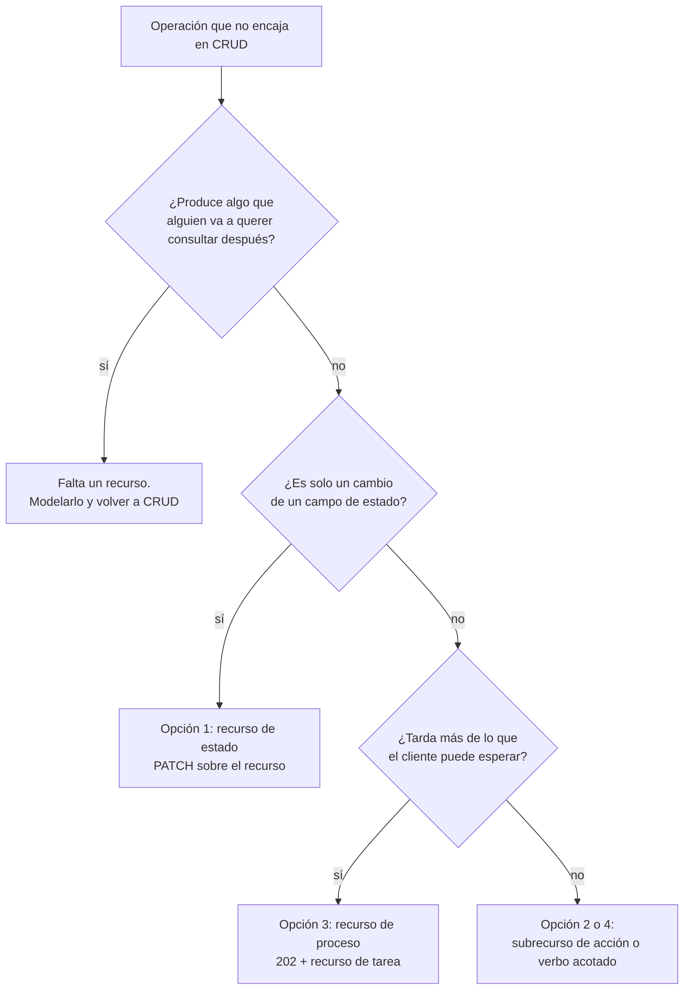
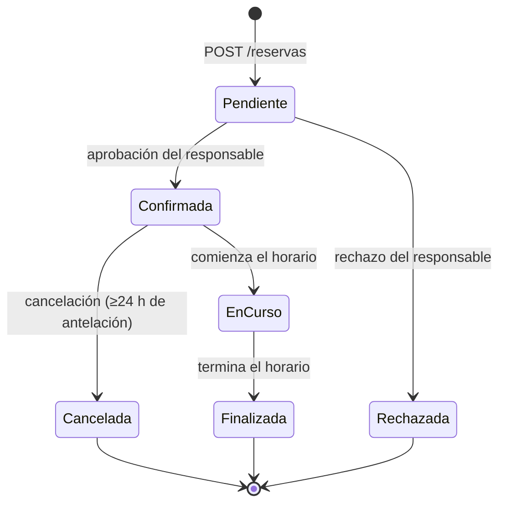

# Operaciones no CRUD — `TEM-ACCIONES`

## Resumen ejecutivo

Es el punto donde la mayoría de los diseños REST se quiebra, y ocurre siempre igual. El modelo de recursos está bien, las URIs son sustantivos en plural, los métodos HTTP se usan con su semántica, y entonces el analista dice «hay que poder cancelar una reserva». Cancelar no es crear, no es leer, no es reemplazar y no es borrar. En ese momento aparecen dos reacciones, ambas malas: agregar `POST /reservas/{id}/cancelar` y seguir adelante, o defender la pureza con un `PATCH` que cambia un campo de estado y esconder toda la lógica de negocio detrás de una asignación de valor.

Las dos son defendibles en algunos casos y ninguna es la respuesta general. Hay cuatro formas de resolver el problema, cada una con costos distintos, y la elección depende de tres cosas: si la operación tiene un resultado observable, si es idempotente, y si tarda.

Este documento enumera las cuatro opciones con sus costos verificables, ofrece un criterio de selección, y —esto es lo que más falta en el material disponible— explica en qué condiciones un verbo en la URI es la decisión correcta y cómo acotarlo para que no se convierta en la puerta por la que se cuela una API RPC.

Advertencia de confianza: este documento tiene `confidence: media` porque una de las opciones que presenta —los métodos custom de Google— se apoya en una AIP que no está entre las verificadas de primera mano. El punto está señalado donde corresponde.

---

## Definición

### Qué es

Una operación no CRUD es una acción del dominio que cambia el estado de un recurso y que no se corresponde con ninguna de las cinco operaciones estándar sobre recursos: listar, obtener, crear, actualizar y borrar. Cancelar una reserva, aprobar una solicitud, enviar una notificación, publicar un informe, reintentar un cobro.

### Qué problema resuelve

Reconocerlas como categoría resuelve un problema de método antes que de sintaxis. Mientras la operación se piense como «un endpoint que hay que agregar», la decisión se toma endpoint por endpoint y la superficie termina con cuatro estilos distintos. Tratada como categoría, tiene un procedimiento: primero se pregunta si falta un recurso, y solo si no falta se elige entre las formas de expresar la acción.

### Qué NO es, y con qué se lo confunde

**No es toda operación que no sea un método HTTP estándar.** Buena parte de las acciones que parecen no-CRUD son transiciones de estado que un `PATCH` expresa perfectamente. La pregunta discriminadora está en la sección siguiente.

**No es una excepción a REST.** Fielding (`O-01`) no prohíbe nada de esto; define un estilo con restricciones sobre identificación de recursos, manipulación por representaciones, mensajes autodescriptivos e hipermedia. Un recurso que representa una cancelación es tan REST como cualquier otro. Lo que sí rompe la interfaz uniforme es usar `POST` sobre rutas arbitrarias con la semántica en el nombre, porque el mensaje deja de ser autodescriptivo para cualquier intermediario.

**No es un problema de framework.** ASP.NET Core permite expresar cualquiera de las cuatro opciones con la misma facilidad. La decisión es de diseño y precede al código.

---

## La primera pregunta: ¿falta un recurso?

Antes de elegir cómo expresar la acción conviene descartar que el problema sea otro. **La mayoría de las operaciones que no encajan en CRUD dejan de ser un problema cuando se descubre el sustantivo que les falta.**

«Cancelar una reserva» suena a verbo irreductible. Pero en un dominio con política de cancelación —y el de reservas la tiene: hay antelación mínima— la cancelación no es un evento instantáneo sino una cosa: tiene autor, fecha, motivo, a veces una penalidad calculada, y a veces se puede consultar después. Eso es un recurso.



La prueba de la primera bifurcación es concreta: **¿alguien va a preguntar por eso más adelante?** Si la respuesta a «¿quién canceló esta reserva y por qué?» tiene que estar en algún lado, la cancelación es una cosa y no una acción.

Cuando la respuesta es que no —«enviar recordatorio» no produce nada consultable en la mayoría de los dominios— es cuando empieza la discusión real de este documento.

---

## Las cuatro opciones

### Opción 1 — Recurso de estado: `PATCH` sobre el recurso

La acción se expresa como una modificación del campo que representa el estado del recurso.

```http
PATCH /v1/reservas/8f21c3 HTTP/1.1
Content-Type: application/merge-patch+json
If-Match: "c41a9e"

{ "estado": "cancelada" }
```

**Qué la hace atractiva.** No agrega superficie: el recurso ya existía y el método ya existía. Es la opción que Google y Microsoft Graph prefieren para actualizaciones en general —`G-04` AIP-134 dice *should* usar `PATCH` y no `PUT`; `G-02` dice **MUST NOT** usar `PUT`—, y es la que mejor se lleva con el control de concurrencia por `ETag` que trata [`TEM-IDEM`](../30-Semantica-HTTP/Idempotencia-y-Concurrencia.md).

**Qué cuesta.** Tres cosas, y la tercera es la que más pesa.

La transición pierde su nombre. `{"estado": "cancelada"}` no dice si eso es una cancelación por el usuario, un vencimiento automático o una anulación administrativa, que en el dominio de reservas son tres cosas con reglas distintas. La solución habitual —agregar `motivoCancelacion` al mismo `PATCH`— empieza a reconstruir la operación dentro del cuerpo, y es la señal de que faltaba un recurso.

El contrato no expresa qué transiciones son válidas. Un `PATCH` que acepta `estado` acepta sintácticamente cualquier valor del enumerado, y la especificación OpenAPI no puede declarar que de `cancelada` no se puede volver a `confirmada`. El servidor rechaza con `409` o `422`, pero el consumidor solo lo descubre probando.

Los parámetros de la acción no tienen dónde ir. Cancelar puede requerir un motivo; aprobar puede requerir un comentario; ninguno de los dos es un campo del recurso. Meterlos en el cuerpo del `PATCH` los convierte en campos fantasma que se envían y no se devuelven.

**Cuándo es la opción correcta.** Cuando la transición es efectivamente un cambio de valor sin parámetros, sin variantes y sin resultado consultable. Marcar una reserva como vista, cambiar la visibilidad de una sala, activar o desactivar un usuario.

### Opción 2 — Subrecurso de acción

La acción se expresa como un recurso subordinado, y el método HTTP conserva su semántica sobre ese recurso.

```http
PUT /v1/reservas/8f21c3/cancelacion HTTP/1.1
Content-Type: application/json

{ "motivo": "sala inhabilitada por mantenimiento" }
```

```http
HTTP/1.1 201 Created
Location: /v1/reservas/8f21c3/cancelacion
Content-Type: application/json

{
  "fecha": "2026-08-13T10:22:00Z",
  "autor": { "id": "u-771", "nombre": "L. Ferreyra" },
  "motivo": "sala inhabilitada por mantenimiento",
  "penalidad": { "importe": 0, "moneda": "ARS" }
}
```

El segmento es un sustantivo —`cancelacion`, no `cancelar`— y sobre él operan métodos con su significado habitual: `PUT` la crea o la reemplaza, `GET` la consulta, `DELETE` la deshace si el dominio lo permite.

**Qué la hace atractiva.** Es la que más propiedades conserva. `PUT` es idempotente según `N-01` §9.2.2, de modo que cancelar dos veces deja el mismo estado y un reintento por timeout de red es seguro sin ninguna maquinaria adicional. La acción tiene nombre, tiene parámetros propios, y su resultado es consultable con un `GET` posterior. Y la transición inversa, si existe, tiene una expresión natural.

**Qué cuesta.** Superficie: cada acción agrega un subrecurso con sus métodos y su documentación. Y una decisión que hay que tomar y que no tiene respuesta única: si `GET /reservas/8f21c3/cancelacion` sobre una reserva no cancelada devuelve `404` —el recurso no existe todavía, que es lo correcto— el consumidor tiene que tratar el `404` como respuesta normal, lo cual es incómodo aunque sea semánticamente exacto.

Hay un límite claro: la opción funciona cuando la acción ocurre **como máximo una vez** por recurso. Cancelar una reserva es único. Enviar un recordatorio no lo es, y `PUT /reservas/{id}/recordatorio` reemplazaría el anterior en lugar de enviar otro. Para acciones repetibles, el subrecurso es una colección y se crea con `POST`:

```http
POST /v1/reservas/8f21c3/recordatorios HTTP/1.1
Content-Type: application/json

{ "canal": "correo" }
```

```http
HTTP/1.1 201 Created
Location: /v1/reservas/8f21c3/recordatorios/r-9931
```

Esa forma pierde la idempotencia y la recupera con `Idempotency-Key`, que es convención de facto sostenida por la práctica de Stripe (`P-04`) y **no** una especificación vigente: el draft de la IETF expiró en la revisión -07 sin llegar a RFC. Lo trata [`TEM-IDEM`](../30-Semantica-HTTP/Idempotencia-y-Concurrencia.md).

**Cuándo es la opción correcta.** Cuando la acción tiene parámetros, o resultado consultable, o conviene que sea idempotente. **Esta guía recomienda** tratarla como la opción por defecto para las acciones de dominio con estado.

### Opción 3 — Recurso de proceso o tarea

Cuando la operación no termina dentro de la petición, lo que se crea no es el resultado sino la ejecución.

```http
POST /v1/importaciones-de-reservas HTTP/1.1
Content-Type: application/json

{ "origen": "calendario-corporativo", "sede": "n1", "desde": "2026-09-01" }
```

```http
HTTP/1.1 202 Accepted
Location: /v1/importaciones-de-reservas/imp-3310
Content-Type: application/json

{ "id": "imp-3310", "estado": "en-curso", "progreso": 0 }
```

```http
GET /v1/importaciones-de-reservas/imp-3310 HTTP/1.1
```

```http
HTTP/1.1 200 OK
Content-Type: application/json

{
  "id": "imp-3310",
  "estado": "completada",
  "progreso": 100,
  "resultado": { "creadas": 42, "rechazadas": 3 },
  "reservasCreadas": "/v1/reservas?importacion=imp-3310"
}
```

El proceso es un recurso de pleno derecho: tiene identidad, estado observable, ciclo de vida y a veces cancelación propia con `DELETE`. Google usa el mismo patrón en su corpus —`G-04` AIP-135 contempla que un `Delete` de larga duración devuelva un `google.longrunning.Operation` en lugar del resultado—, lo que confirma que la solución no es una invención local.

**Qué cuesta.** Es la opción más cara: hay que persistir el estado del proceso, decidir cuánto vive, decidir qué pasa si nadie lo consulta, y el cliente necesita lógica de sondeo. A cambio resuelve el único caso donde las otras tres no funcionan.

**Cuándo es la opción correcta.** Cuando la operación puede tardar más de lo que un cliente tolera esperar, o cuando puede fallar parcialmente y el detalle de qué falló importa. La segunda condición se subestima: una importación que crea 42 reservas y rechaza 3 no tiene ningún código de estado HTTP que la describa, y el recurso de proceso es lo que permite contarlo.

### Opción 4 — Métodos custom con verbo acotado

La forma de Google, y la que hay que presentar con una advertencia de verificación.

Lo que **está verificado** de `G-04`: AIP-121 establece los cinco métodos estándar y prescribe que las APIs *«**should** preferir métodos estándar antes que métodos custom»*. La existencia de la categoría «método custom» en el corpus de Google y su carácter subordinado son firmes.

Lo que **no está verificado** en las fuentes de esta guía: AIP-136, el documento que define cómo se nombran y se escriben esos métodos custom, no figura entre las AIP verificadas de primera mano según [`ANEXO-REFERENCIAS`](../99-Anexos/Referencias.md). La sintaxis que circula ampliamente —un separador `:` antes del verbo, de la forma `/v1/reservas/8f21c3:cancel`— **no debe citarse como prescripción verificada de Google**. Quien vaya a adoptarla tiene que leer AIP-136 directamente.

Con esa salvedad, la idea general es transportable y vale por sí misma: **si hay que poner un verbo, que sea sintácticamente distinguible del resto de la ruta**. Un separador que no sea `/` logra que el verbo no parezca un recurso, que las herramientas puedan detectarlo, y que sea contable —se puede medir cuántos métodos custom tiene una API y usar ese número como indicador de deuda—.

Hay un detalle de `N-08` que juega a favor: el carácter `:` es un *gen-delim*, y su aparición dentro de un segmento de path es sintácticamente válida sin codificación. La forma no viola RFC 3986.

**Cuándo es la opción correcta.** Cuando la acción no produce nada consultable, no tiene estado, no encaja en ningún recurso, y las tres opciones anteriores producirían un recurso artificial que nadie del negocio reconocería. Es un caso real y menos frecuente de lo que se invoca.

---

## Tabla de decisión

| | Opción 1 · Estado | Opción 2 · Subrecurso | Opción 3 · Proceso | Opción 4 · Verbo acotado |
|---|---|---|---|---|
| **Forma** | `PATCH /reservas/{id}` | `PUT /reservas/{id}/cancelacion` | `POST /importaciones` + sondeo | `POST /reservas/{id}:accion` |
| **Idempotente** | Sí, con `If-Match` | Sí con `PUT`; no con `POST` a colección | La creación, no | No sin `Idempotency-Key` |
| **La acción tiene nombre** | No | Sí | Sí | Sí |
| **Admite parámetros propios** | Mal | Sí | Sí | Sí |
| **Resultado consultable** | No | Sí | Sí | No |
| **Superficie que agrega** | Ninguna | Un subrecurso | Una colección y un ciclo de vida | Un método |
| **Costo principal** | Pierde la semántica de la transición | Superficie y el `404` del recurso ausente | Persistencia y sondeo | No es un recurso; erosiona la interfaz uniforme |
| **Autoridad** | `G-04` AIP-134, `G-02` prefieren `PATCH` | Criterio propio; práctica extendida | `G-04` AIP-135 para larga duración | `G-04` AIP-136, **no verificada** |

**Esta guía recomienda** este orden de preferencia: descubrir el recurso que falta; si no falta, subrecurso de acción; si la operación tarda o puede fallar parcialmente, recurso de proceso; el `PATCH` de estado para las transiciones sin parámetros ni variantes; y el verbo acotado como última opción, contada y justificada.

---

## Cuándo aceptar un verbo y cómo acotarlo

Hay situaciones donde ninguna de las tres primeras opciones produce un diseño honesto, y forzarlas genera recursos que existen solo para satisfacer una regla. Modelar `POST /reservas/{id}/recalculos-de-precio` para una operación que no persiste nada y no se consulta nunca es peor que admitir un verbo: agrega un sustantivo falso al vocabulario de la API.

Las condiciones bajo las cuales **esta guía** considera aceptable un verbo:

1. La acción no produce nada que alguien vaya a consultar después.
2. No tiene estado propio ni ciclo de vida.
3. El sustantivo que la nombraría no existe en el vocabulario del negocio: habría que inventarlo.
4. Está contada y registrada en el documento de convenciones.

Y las reglas para acotarlo, que son lo que evita que el primer verbo se convierta en una API RPC:

**El verbo va al final, sobre un recurso identificado.** `/reservas/8f21c3:reenviar-invitaciones`, nunca `/reenviarInvitaciones`. El sujeto de la acción tiene que estar en la URI antes que la acción.

**Se usa `POST`, siempre.** El método es no seguro y no idempotente según `N-01` §9.3.3, que es exactamente lo que un verbo sin garantías es. Usar `GET` para una acción con efectos es el error que hace que un *crawler*, un *prefetch* del navegador o un reintento de un proxy ejecuten la operación.

**Es sintácticamente distinguible.** Un separador distinto de `/` hace que el verbo sea detectable por una herramienta y no confundible con un recurso.

**Se cuentan.** El número de métodos custom de una API es un indicador de deuda de modelado, y conviene que sea visible. **Esta guía recomienda** fijar un presupuesto explícito —un dígito para una API de tamaño medio— y que superarlo dispare una revisión del modelo de recursos, no una excepción a la convención.

**Se documenta la alternativa descartada.** Por cada verbo, una línea que diga qué recurso se consideró y por qué no se creó. Es lo que permite revisar la decisión cuando el dominio cambie.

---

## Aplicación por escenario

### `ESC-1` — API nueva

El momento de fijar el procedimiento antes de que aparezca el primer caso, porque el primer caso se resuelve por urgencia y después se copia. Lo que corresponde escribir en el documento de convenciones no es una lista de acciones permitidas sino el **árbol de decisión** y el presupuesto de verbos.

La trampa específica es el purismo: rechazar todo verbo y modelar recursos artificiales para cada acción. Produce una API con sustantivos que nadie reconoce —`activaciones`, `procesamientos`, `ejecuciones`— y es tan mala como la RPC que quería evitar, con la desventaja de que parece bien diseñada.

El artefacto de salida más útil de este escenario, para este tema en particular, es el **diagrama de estados de los recursos con ciclo de vida**. La mayoría de las operaciones no CRUD son transiciones, y tener el diagrama antes de escribir endpoints resuelve la mitad de las preguntas: qué transiciones existen, cuáles tienen parámetros, cuáles son reversibles.

### `ESC-2` — Exposición o migración

El escenario donde el problema aparece con más volumen, porque el sistema existente **es** un conjunto de operaciones. Una API SOAP o un servicio RPC no tiene recursos: tiene `EjecutarCancelacion`, `ProcesarAprobacion`, `ValidarDisponibilidad`.

El procedimiento que funciona: se listan todas las operaciones existentes, se agrupan por el sustantivo sobre el que actúan, y para cada grupo se pregunta cuáles son CRUD disfrazado. El resultado sistemático es que entre la mitad y dos tercios lo son —`ObtenerReservaPorId`, `ListarReservasDeSala`, `InsertarReserva`— y el resto es el material de este documento.

La trampa que describe [`MARCO-ESCENARIOS`](../00-Marco-de-Referencia/Escenarios.md) aplica acá con toda su fuerza: conservar el patrón `POST /EjecutarOperacion` con un campo `operacion` en el cuerpo produce SOAP con otra sintaxis, sin las ventajas de HTTP y sin las herramientas de SOAP. La variante intermedia —un endpoint por operación, con el nombre de la operación como ruta— es el nivel 0 del modelo de Richardson (`O-03`) apenas disimulado.

Hay un hallazgo frecuente que conviene buscar: **operaciones distintas que actúan sobre la misma cosa con nombres inconsistentes**. `AnularReserva`, `CancelarBooking` y `BajaDeSolicitud` suelen ser la misma transición implementada tres veces por tres personas. Descubrirlo es uno de los mayores aportes de valor del escenario.

### `ESC-3` — Evolución en producción

Los endpoints de acción publicados están congelados. Lo que se decide es cómo entra la acción nueva, y hay una tensión conocida: si la API ya tiene `POST /reservas/{id}/cancelar`, agregar `PUT /reservas/{id}/aprobacion` produce dos estilos.

**Esta guía recomienda** el mismo criterio que [`TEM-URI`](Nomenclatura-de-URIs.md) aplica a la nomenclatura: mantener el estilo vigente aunque sea peor, y cambiarlo solo en un límite de versión mayor. La predictibilidad se destruye por la mezcla, no por la elección.

Hay un movimiento seguro que conviene conocer: **agregar la forma buena junto a la vieja, deprecar la vieja, y medir**. El costo es un período de convivencia; la alternativa —arrastrar el estilo malo indefinidamente— no tiene fecha de fin.

Un cambio que parece compatible y no lo es: convertir una acción síncrona en asíncrona. Pasar de `200 OK` con el resultado a `202 Accepted` con un `Location` rompe a todo cliente que esperaba el resultado en la respuesta, aunque no haya cambiado ninguna URI ni ningún campo. Lo trata [`TEM-BREAK`](../50-Evolucion-y-Versionado/Compatibilidad-y-Cambios-Rompientes.md).

### `ESC-4` — Evaluación de una API ajena

**`ESC-4a`.** Se cuentan las operaciones que no son CRUD y se clasifican en las cuatro opciones. Los indicadores que producen hallazgos: la proporción de `POST` sobre el total —una API con `POST` en más de la mitad de sus operaciones probablemente está haciendo RPC—, la existencia de `GET` con efectos secundarios, y la presencia de un campo `accion`, `operacion` o `tipo` en el cuerpo de peticiones que ramifica el comportamiento.

El último es el hallazgo más severo y el menos evidente en una especificación: un endpoint documentado como uno solo que en realidad son cinco, con esquemas de cuerpo distintos según un campo discriminador. Se detecta leyendo las descripciones de los campos en busca de «solo aplica si».

**`ESC-4b`.** Desde afuera, las acciones se reconocen por los segmentos que son verbos y por los `POST` sobre rutas que no son colecciones. Lo que **no** se puede saber es si son idempotentes, y esa es justamente la pregunta que más importa para construir un cliente con reintentos. Se registra como pregunta abierta, y probarlo empíricamente —ejecutar la acción dos veces para ver qué pasa— solo es legítimo con autorización y sobre datos propios.

### Qué cambia según el contexto

| Contexto | Qué cambia en las operaciones no CRUD |
|---|---|
| `CTX-1` pública | Cada acción publicada es contrato indefinido, y las acciones son lo más difícil de deprecar porque el consumidor no tiene sustituto obvio. El presupuesto de verbos se aplica con rigor. La idempotencia deja de ser preferencia: un integrador que no controla la red va a reintentar |
| `CTX-2` interna | Se puede corregir un estilo coordinando el despliegue, y conviene hacerlo antes de que se copie. El riesgo propio es que las acciones se conviertan en llamadas a procedimientos entre servicios, con el acoplamiento que eso implica |
| `CTX-3` app propia | La tentación es un endpoint de acción por botón de la interfaz. Se reconoce porque el nombre de la operación coincide con el texto del botón. Un cliente MAUI instalado congela la acción igual que `CTX-1` |
| `CTX-4` integración | Las acciones del proveedor son un dato. La idempotencia pasa a ser el problema central: si el proveedor no la garantiza, hay que construirla del lado propio con registro de operaciones ejecutadas |

---

## Ejemplos concretos

Ejemplos **sintéticos** del sistema de reserva de salas. El dominio tiene una política de cancelación con antelación mínima, que es lo que hace que el caso no sea trivial.

### El diagrama de estados que precede a las decisiones



Cinco transiciones, y no todas se resuelven igual: dos son automáticas por tiempo y no tienen endpoint, dos requieren decisión de un actor con comentario opcional, y una tiene una regla de negocio con resultado calculado.

### La cancelación como subrecurso, con la regla de negocio visible

```http
PUT /v1/reservas/8f21c3/cancelacion HTTP/1.1
Content-Type: application/json
If-Match: "c41a9e"

{ "motivo": "el equipo viaja a la sede sur" }
```

```http
HTTP/1.1 201 Created
Location: /v1/reservas/8f21c3/cancelacion
ETag: "d02b7f"
Content-Type: application/json

{
  "fecha": "2026-08-13T10:22:00Z",
  "autor": { "id": "u-771", "nombre": "L. Ferreyra" },
  "motivo": "el equipo viaja a la sede sur",
  "antelacionHoras": 28,
  "penalidad": { "importe": 0, "moneda": "ARS" }
}
```

Y el caso que la política rechaza:

```http
PUT /v1/reservas/9a44d1/cancelacion HTTP/1.1
Content-Type: application/json

{ "motivo": "cambio de planes" }
```

```http
HTTP/1.1 409 Conflict
Content-Type: application/problem+json

{
  "type": "https://api.reservas.ejemplo.com/problemas/antelacion-insuficiente",
  "title": "La reserva no puede cancelarse",
  "status": 409,
  "detail": "Faltan 6 horas para el inicio y la política exige 24.",
  "antelacionRequeridaHoras": 24,
  "antelacionActualHoras": 6
}
```

El formato es `N-04` (RFC 9457), con miembros de extensión que el consumidor puede usar programáticamente. La elección entre `409` y `422` para una regla de negocio violada es materia de [`TEM-STATUS`](../30-Semantica-HTTP/Codigos-de-Estado.md); lo que importa acá es que la información esté estructurada y no solo en la prosa del `detail`.

La consulta posterior, que es lo que la Opción 1 no permite:

```http
GET /v1/reservas/8f21c3/cancelacion HTTP/1.1
```

```http
HTTP/1.1 200 OK
Content-Type: application/json

{ "fecha": "2026-08-13T10:22:00Z", "autor": { "id": "u-771", "nombre": "L. Ferreyra" }, "motivo": "el equipo viaja a la sede sur", "antelacionHoras": 28, "penalidad": { "importe": 0, "moneda": "ARS" } }
```

### La misma acción con las otras tres opciones, para comparar

```http
# Opción 1 — recurso de estado. Pierde motivo, autor y penalidad.
PATCH /v1/reservas/8f21c3
{ "estado": "cancelada" }

# Opción 3 — recurso de proceso. Sobra: la cancelación es instantánea.
POST /v1/cancelaciones
{ "reserva": "8f21c3", "motivo": "…" }
→ 202 Accepted, Location: /v1/cancelaciones/c-119

# Opción 4 — verbo acotado. No aprovecha que la cancelación es una cosa.
POST /v1/reservas/8f21c3:cancelar
{ "motivo": "…" }
```

La Opción 3 merece atención porque parece razonable y no lo es en este caso: `/cancelaciones` como colección de primer nivel desconecta la cancelación de su reserva y obliga a un identificador propio que nadie necesita.

### Una acción repetible: la colección de subrecursos

```http
POST /v1/reservas/8f21c3/recordatorios HTTP/1.1
Content-Type: application/json
Idempotency-Key: 3f9a1c22-1d84-4e6b-9a0f-7c1e5b220ab3

{ "canal": "correo", "destinatarios": ["todos"] }
```

```http
HTTP/1.1 201 Created
Location: /v1/reservas/8f21c3/recordatorios/r-9931
Content-Type: application/json

{ "id": "r-9931", "canal": "correo", "enviadoEn": "2026-08-13T10:30:00Z", "destinatarios": 4 }
```

`POST` porque enviar dos recordatorios es distinto de enviar uno, y `Idempotency-Key` porque un reintento por timeout no debería producir el segundo. La cabecera es convención de facto sostenida por `P-04`, no norma.

### Un verbo que esta guía considera aceptable

```http
POST /v1/salas/a3f1:verificar-disponibilidad HTTP/1.1
Content-Type: application/json

{ "inicio": "2026-08-20T14:00:00Z", "fin": "2026-08-20T15:00:00Z" }
```

```http
HTTP/1.1 200 OK
Content-Type: application/json

{ "disponible": false, "conflictos": [ { "reserva": "8f21c3", "inicio": "…", "fin": "…" } ] }
```

Cumple las cuatro condiciones: no persiste nada, no tiene estado, el sustantivo que lo nombraría —`verificaciones`— no existe en el vocabulario del negocio, y está registrado.

Queda una objeción legítima que conviene no esconder: **esto podría ser un `GET` sobre el recurso calculado `/salas/a3f1/disponibilidad?inicio=…&fin=…`** que ya existe en el modelo, y en ese caso sería cacheable y seguro. Es la mejor solución, y el verbo solo se justifica si los parámetros son demasiado grandes o sensibles para ir en la query. Se incluye el ejemplo precisamente porque **la mayoría de los verbos que uno cree necesarios tienen una alternativa así, y el ejercicio de buscarla es el que evita la deuda**.

### En C#: las cuatro formas

```csharp
// Opción 2 — subrecurso de acción, idempotente por PUT.
app.MapPut("/v1/reservas/{reservaId}/cancelacion",
    async (string reservaId,
           CancelacionRequest cuerpo,
           [FromHeader(Name = "If-Match")] string? etag,
           IRepositorioReservas repo,
           IPoliticaCancelacion politica) =>
    {
        var reserva = await repo.ObtenerAsync(reservaId);
        if (reserva is null) return Results.NotFound();
        if (etag is not null && etag != reserva.Version) return Results.StatusCode(412);

        // Ya cancelada: idempotente, se devuelve la cancelación existente.
        if (reserva.Cancelacion is { } existente)
            return Results.Ok(existente.AResource());

        var evaluacion = politica.Evaluar(reserva, DateTimeOffset.UtcNow);
        if (!evaluacion.EsPosible)
            return Results.Problem(
                type: "https://api.reservas.ejemplo.com/problemas/antelacion-insuficiente",
                title: "La reserva no puede cancelarse",
                statusCode: StatusCodes.Status409Conflict,
                detail: evaluacion.Explicacion,
                extensions: new Dictionary<string, object?>
                {
                    ["antelacionRequeridaHoras"] = evaluacion.RequeridaHoras,
                    ["antelacionActualHoras"] = evaluacion.ActualHoras
                });

        var cancelacion = reserva.Cancelar(cuerpo.Motivo, evaluacion.Penalidad);
        await repo.GuardarAsync(reserva);

        return Results.Created($"/v1/reservas/{reservaId}/cancelacion", cancelacion.AResource());
    });
```

El bloque que hace el trabajo real es el de la cancelación existente: es lo que convierte a `PUT` en verdaderamente idempotente y lo que permite que un cliente reintente sin consecuencias. Sin ese bloque, la segunda llamada devolvería `409` y el cliente no podría distinguir «no se pudo» de «ya estaba hecho».

```csharp
// Opción 3 — recurso de proceso.
app.MapPost("/v1/importaciones-de-reservas",
    async (ImportacionRequest cuerpo, IColaDeTrabajos cola, IRepositorioImportaciones repo) =>
    {
        var importacion = Importacion.Crear(cuerpo.Origen, cuerpo.Sede, cuerpo.Desde);
        await repo.AgregarAsync(importacion);
        await cola.EncolarAsync(new ProcesarImportacion(importacion.Id));

        return Results.Accepted(
            $"/v1/importaciones-de-reservas/{importacion.Id.Valor}",
            importacion.AResource());
    });

app.MapGet("/v1/importaciones-de-reservas/{id}",
    async (string id, IRepositorioImportaciones repo) =>
        await repo.ObtenerAsync(id) is { } imp
            ? Results.Ok(imp.AResource())
            : Results.NotFound());
```

```csharp
// Opción 4 — verbo acotado. ASP.NET Core admite ':' en el segmento sin configuración especial.
app.MapPost("/v1/salas/{salaId}:verificar-disponibilidad",
    async (string salaId, VerificacionRequest cuerpo, ICalculadorDisponibilidad calculador) =>
    {
        var resultado = await calculador.VerificarAsync(salaId, cuerpo.Inicio, cuerpo.Fin);
        return Results.Ok(resultado);
    });
```

La organización de estos endpoints dentro del proyecto, y si conviene expresarlos con Minimal APIs o con controllers, es materia de [`TEM-MINIMAL`](../80-Implementacion-en-NET/Minimal-APIs-y-Controllers.md).

---

## Preguntas guía

- Para cada operación que no encaja en CRUD: ¿probé buscarle el sustantivo antes de resolverla con un verbo?
- ¿Alguien va a preguntar después quién ejecutó esta acción y por qué? Si sí, ¿dónde está guardado eso y cómo se consulta?
- Si el cliente reintenta esta operación porque no llegó la respuesta, ¿qué pasa?
- ¿Cuántos verbos tiene mi API? ¿Está el número escrito en algún lado?
- ¿Alguna de mis operaciones tarda lo suficiente como para que el cliente considere abandonar la espera?
- ¿Alguna operación puede fallar parcialmente? ¿Cómo lo comunico con un solo código de estado?
- ¿Algún `GET` mío tiene efectos secundarios?
- ¿Tengo un campo en el cuerpo que ramifica el comportamiento del endpoint?
- ¿Las transiciones válidas de mis recursos con estado están documentadas, o solo el servidor las conoce?

---

## Criterios de calidad

### Señales de un diseño sano

Existe un diagrama de estados por cada recurso con ciclo de vida, y las transiciones de la API se corresponden con él. Las acciones con resultado consultable son recursos. Las acciones repetibles aceptan una clave de idempotencia o son idempotentes por método. Los verbos están contados, presupuestados y justificados uno por uno. Ningún `GET` tiene efectos. Y ningún endpoint ramifica su comportamiento según un campo del cuerpo.

### Antipatrones

**El verbo por reflejo.** `POST /reservas/{id}/cancelar` como primera y única opción, sin haber pasado por el árbol de decisión. No es el peor diseño posible —el sujeto está en la URI y el método es correcto— y su problema es acumulativo: el primero se justifica solo, el décimo convirtió la API en RPC.

**El endpoint despachador.** `POST /api/ejecutar` con `{"operacion": "..."}`. Nivel 0 del modelo de Richardson. Descarta caché, códigos de estado, idempotencia y toda posibilidad de que una herramienta razone sobre el tráfico. Aparece en `ESC-2` como resultado de migrar SOAP sin rediseñar.

**El `GET` con efectos.** `GET /reservas/{id}/cancelar`. Viola la seguridad del método según `N-01` §9.2.1, y las consecuencias no son teóricas: un *prefetch*, un rastreador o un reintento de un intermediario ejecutan la acción. Es el defecto más grave de esta familia y el más fácil de detectar automáticamente.

**El `PATCH` de estado que esconde una máquina de estados.** Un endpoint que acepta `{"estado": "X"}` para siete valores distintos, cada uno con reglas propias, parámetros propios y permisos propios. El contrato declara una asignación y la realidad son siete operaciones. Se detecta porque la documentación del campo `estado` es más larga que la del resto del recurso.

**El sustantivo inventado.** `activaciones`, `procesamientos`, `ejecuciones`, `gestiones`. Recursos creados para evitar un verbo, que no corresponden a nada que el negocio nombre. El resultado se ve bien diseñado y no lo está: el vocabulario de la API dejó de ser el del dominio.

**La acción sin idempotencia en operación con dinero o efectos externos.** Enviar una notificación, cobrar una seña, emitir una factura, sin `PUT` ni clave de idempotencia. Funciona hasta el primer timeout de red, y el primer timeout de red llega siempre.

**El cambio silencioso de síncrono a asíncrono.** Pasar de `200` con resultado a `202` con `Location` sin versionar. No cambia ninguna URI ni ningún campo, y rompe a todos los clientes.

**Los verbos sin presupuesto.** No es un defecto de un endpoint sino del proceso. Sin un número declarado y visible, cada verbo nuevo se evalúa contra la excepción anterior y no contra el modelo, y la deuda crece sin que nadie la vea.

---

## Anexo — Ficha de decisión por operación

Se completa por cada operación que no es CRUD, antes de implementarla. Las cuatro primeras respuestas determinan la opción; el resto documenta la decisión para poder revisarla.

```yaml
operacion: ""                      # como la nombra el negocio: "cancelar una reserva"
recurso_afectado: ""
actor_que_la_ejecuta: ""           # ACT-xx o rol del dominio

descubrimiento_del_sustantivo:
  produce_algo_consultable: si | no
  sustantivo_candidato: ""         # "cancelación"
  existe_en_el_vocabulario_del_negocio: si | no
  # "si" + "si" ⇒ falta un recurso: modelarlo y no seguir con esta ficha

caracterizacion:
  tiene_parametros_propios: si | no
  es_repetible: si | no            # ¿puede ocurrir más de una vez por recurso?
  duracion_esperada: instantanea | segundos | larga
  puede_fallar_parcialmente: si | no
  es_reversible: si | no

opcion_elegida: estado | subrecurso | proceso | verbo
alternativas_descartadas:
  - opcion: ""
    razon: ""

forma:
  metodo: GET | POST | PUT | PATCH | DELETE
  ruta: ""
  codigo_exito: 200 | 201 | 202 | 204
  codigos_de_error: []             # con la regla de negocio que dispara cada uno

idempotencia:
  garantizada_por: metodo | idempotency-key | ninguna
  conducta_ante_repeticion: ""     # obligatorio si "ninguna" no es aceptable

transiciones:
  estado_origen: []                # desde qué estados es válida
  estado_destino: ""
  documentada_en_openapi: si | no

# solo si opcion_elegida = verbo
verbo:
  condiciones_cumplidas: [1, 2, 3, 4]   # las cuatro de la sección correspondiente
  recurso_que_se_considero: ""
  por_que_no_se_creo: ""
  numero_de_verbo: 0                    # el N-ésimo de la API
  presupuesto_declarado: 0
```

El bloque `descubrimiento_del_sustantivo` es el que evita la mayor parte del trabajo posterior, y es el que se saltea cuando hay apuro.

El campo `idempotencia.conducta_ante_repeticion` es el que salva integraciones reales: un consumidor de `CTX-1` o `CTX-4` va a reintentar, con o sin permiso, y lo que pase entonces es parte del contrato lo declare o no.

El campo `numero_de_verbo` junto a `presupuesto_declarado` es el mecanismo que convierte la deuda de modelado en algo visible. Un contador que se acerca al presupuesto es la señal de revisar el modelo de recursos, no de ampliar el presupuesto.
