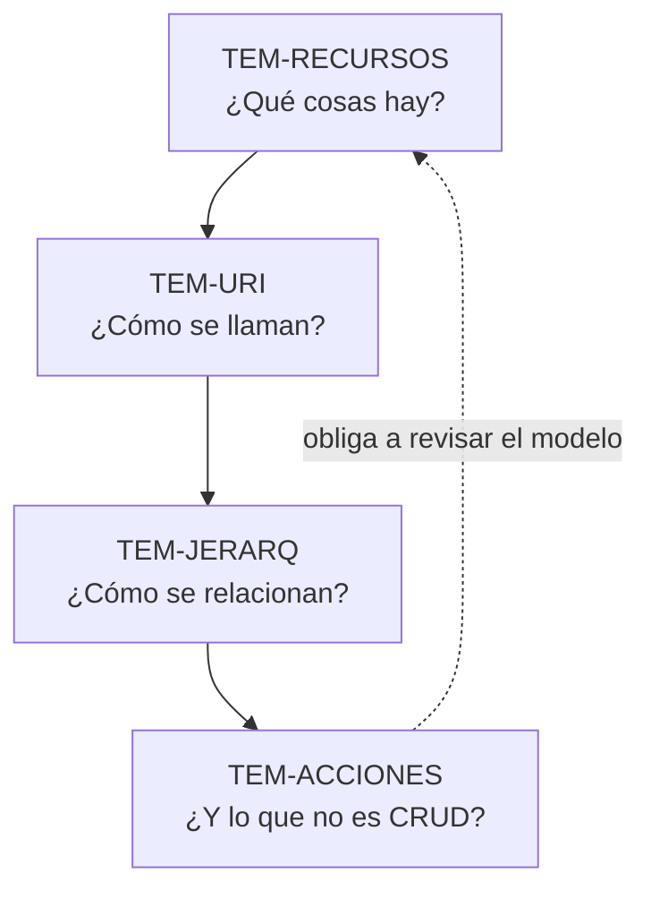

# Diseño de recursos — `FAM-REC`

## La pregunta que responde esta familia

**¿Qué cosas expone la API y cómo se llaman?**

Es la primera decisión y la más difícil de revertir. Un código de estado mal elegido se corrige con un despliegue; un formato de error se puede migrar con una capa de traducción; una estrategia de versionado se puede reemplazar por otra. Un recurso mal modelado y mal nombrado queda en las URIs que los consumidores escribieron en su código, en los enlaces que alguien guardó, en los ejemplos de la documentación y en la memoria muscular de todo el que integró. Cambiarlo es, por definición, un cambio rompiente.

Lo que agrava el problema es que sobre esta materia casi no hay norma. `N-08` (RFC 3986) define la sintaxis de una URI —qué caracteres se admiten, cómo se delimitan los segmentos— y no dice absolutamente nada sobre si una colección se llama en plural ni sobre si los segmentos van en `kebab-case`. Todo lo que suena a «regla REST» sobre nomenclatura proviene de guías de organizaciones que se contradicen entre sí de forma frontal y documentada. Esta familia trata esa contradicción como su material principal en lugar de esconderla.

---

## Documentos

| ID | Documento | Responde |
|----|-----------|----------|
| `TEM-RECURSOS` | [Modelado de recursos](Modelado-de-Recursos.md) | ¿Qué entidades del dominio merecen ser recursos, y con qué granularidad? |
| `TEM-URI` | [Nomenclatura de URIs](Nomenclatura-de-URIs.md) | ¿Cómo se escribe la ruta de un recurso: sustantivo, plural, casing, idioma? |
| `TEM-JERARQ` | [Jerarquías y relaciones](Jerarquias-y-Relaciones.md) | ¿Cuándo un recurso cuelga de otro y cuándo vive por su cuenta? |
| `TEM-ACCIONES` | [Operaciones no CRUD](Operaciones-No-CRUD.md) | ¿Dónde va «cancelar una reserva», que no es crear, leer, actualizar ni borrar? |

El orden es deliberado y conviene respetarlo en la primera lectura. Se modela antes de nombrar, se nombra antes de jerarquizar, y la pregunta por las operaciones que no encajan en CRUD solo tiene sentido cuando ya existe un modelo de recursos contra el cual no encajan.

La flecha de retorno no es adorno. La aparición de una operación que no encaja en ningún recurso es, en la mayoría de los casos, la señal de que falta un recurso: el problema de dónde poner «cancelar» se resuelve más veces descubriendo la cancelación como cosa que forzando un verbo en la ruta.

---

## Relación con las otras familias

**Hacia arriba, con [`FAM-FUN`](../10-Fundamentos-REST/) — fundamentos.** El nivel 1 del modelo de madurez de Richardson (`O-03`) es exactamente esta familia: pasar de un endpoint único a recursos con identidad propia. Quien no leyó [`TEM-RMM`](../10-Fundamentos-REST/Modelo-de-Madurez.md) puede leer esta familia igual; quien la leyó entiende por qué el modelado de recursos es la frontera entre RPC sobre HTTP y otra cosa.

**Hacia abajo, con [`FAM-HTTP`](../30-Semantica-HTTP/) — semántica HTTP.** El recurso responde qué se manipula; el método responde cómo. Las dos decisiones se toman juntas y se documentan por separado: qué significa `POST` sobre una colección lo fija [`TEM-METODOS`](../30-Semantica-HTTP/Metodos.md), y esta familia lo cita sin repetirlo. La dependencia es real en ambas direcciones: un modelo de recursos que obliga a inventar métodos es un modelo mal hecho.

**En paralelo, con [`FAM-CON`](../40-Contratos-y-Representaciones/) — contratos.** Hay un reparto de fronteras que conviene fijar de entrada porque es la fuente de duplicación más probable de toda la guía:

| Decisión | Dónde se trata |
|---|---|
| Casing de los **segmentos de URI** (`/salas-de-reunion`) | `TEM-URI`, en esta familia |
| Casing de los **campos JSON** (`fechaInicio` vs `fecha_inicio`) | [`TEM-CAMPOS`](../40-Contratos-y-Representaciones/Formato-y-Nomenclatura-de-Campos.md) |
| Casing de los **parámetros de query** | [`TEM-CAMPOS`](../40-Contratos-y-Representaciones/Formato-y-Nomenclatura-de-Campos.md) |
| Cuándo un filtro va en la **ruta** y cuándo en la **query** | `TEM-URI`, en esta familia |
| Qué sintaxis tiene ese filtro | [`TEM-FILTRO`](../40-Contratos-y-Representaciones/Filtrado-Orden-y-Seleccion.md) |
| Forma de la **colección** como recurso | `TEM-RECURSOS`, en esta familia |
| Forma de la **representación** de esa colección y su paginación | [`TEM-PAG`](../40-Contratos-y-Representaciones/Colecciones-y-Paginacion.md) |

La separación no es arbitraria: Zalando (`G-05`) prescribe deliberadamente casings distintos por capa —`kebab-case` en paths, `snake_case` en query y en JSON—, de modo que tratar ambos planos en un mismo documento haría creer que la decisión es una sola.

**Hacia adelante, con [`FAM-EVO`](../50-Evolucion-y-Versionado/) — evolución.** Los nombres de recursos son el elemento del contrato con menos margen de corrección. GOV.UK (`G-06`) recomienda explícitamente que los nombres de recursos sean **persistentes entre versiones**: cambiarlos obliga a versionar aunque nada más haya cambiado. Esa asimetría —agregar un recurso es barato, renombrarlo es caro— es la que justifica gastar tiempo en `ESC-1` sobre decisiones que todavía no duelen.

---

## Cómo entra cada actor

| Actor | Qué le toca en esta familia |
|---|---|
| `ACT-01` arquitecto | Decide. El modelo de recursos y la nomenclatura son sus dos filas vinculantes en la matriz de [`MARCO-ACTORES`](../00-Marco-de-Referencia/Actores.md) |
| `ACT-05` analista funcional | Aporta el vocabulario. Su distinción entre «reserva» y «solicitud de reserva» es literalmente el material del que salen los nombres |
| `ACT-03` consumidor | Voz consultiva y la más informada: descubre en horas que el modelo obliga a cinco llamadas donde debería haber una |
| `ACT-02` productor | Ejecuta, y es quien erosiona la convención endpoint por endpoint si no hay verificación automática |

La forma efectiva en que `ACT-01` ejerce esta autoridad no es revisar nombre por nombre —eso lo convierte en cuello de botella— sino publicar la convención y hacerla verificable por una herramienta sobre la especificación OpenAPI.

---

## Advertencia de nivel de autoridad

Esta familia es donde la distinción de los cuatro niveles de [`MARCO-CONVENCIONES`](../00-Marco-de-Referencia/Convenciones.md) más se necesita y más se pierde. El resumen honesto del estado de la materia:

- **Normativo hay poquísimo.** `N-08` da sintaxis, no estilo. `N-09` (RFC 6570) da plantillas de URI, no nomenclatura.
- **Guía de organización hay mucho, y se contradice.** Google (`G-04` AIP-122) exige `camelCase` en los identificadores de colección; Zalando (`G-05` regla 129) exige `kebab-case`; Azure (`G-01`) admite ambos. No hay forma de cumplir las tres.
- **Convención de facto hay una sola sólida:** recursos como sustantivos, colecciones en plural. Y ni siquiera es unánime, porque GOV.UK (`G-06`) delega la pluralización en el criterio del equipo.
- **Criterio propio hay bastante**, y va marcado como tal en cada documento.

Ninguna de las contradicciones documentadas se resuelve en esta guía diciendo quién tiene razón. Se resuelve dándole al lector el criterio para elegir: qué problema estaba resolviendo cada organización cuando decidió así.
