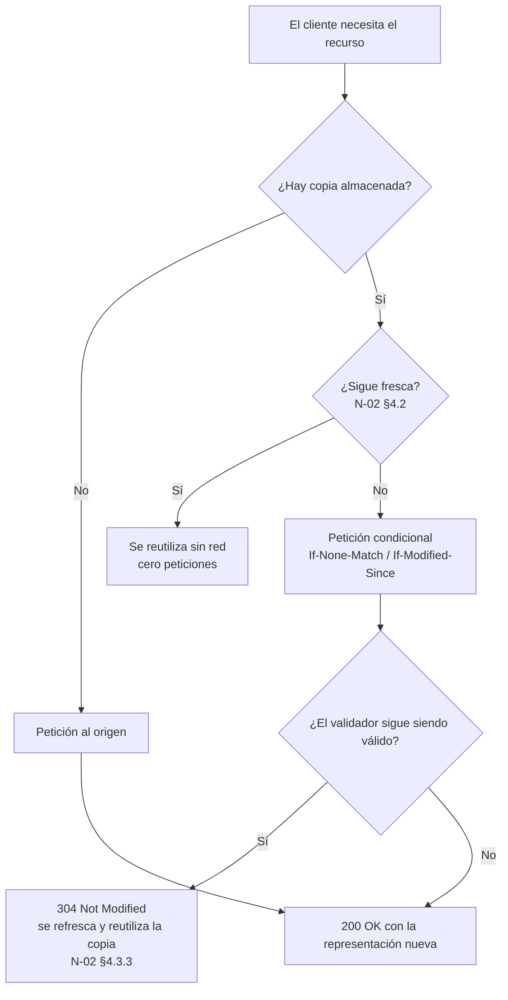
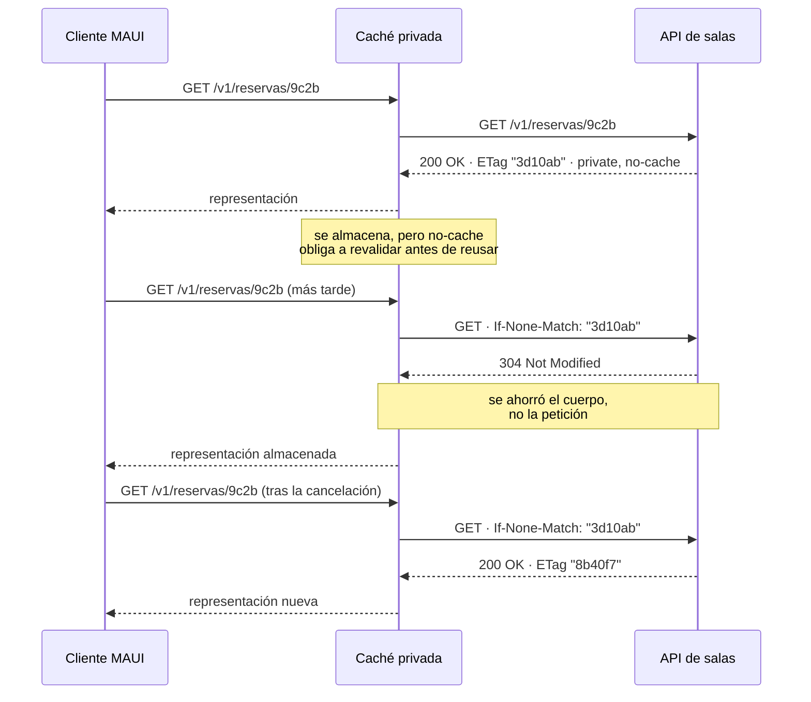

# Caché y peticiones condicionales — `TEM-CACHE`

## Resumen ejecutivo

La caché es una de las seis restricciones que `O-01` atribuye al estilo REST, y la única cuyo mecanismo está enteramente especificado en un documento con estatus de Internet Standard: `N-02` (RFC 9111, STD 98), que obsoleta RFC 7234. La restricción existe porque la respuesta más barata es la que no se hace, y HTTP trae la maquinaria para lograrlo sin que la aplicación intervenga.

En las APIs esa maquinaria se usa poco, y hay razones honestas para ello. Los datos que devuelve una API suelen ser específicos del solicitante, cambian con frecuencia y se leen una sola vez; en esas condiciones el ahorro es escaso y el riesgo de servir algo obsoleto o ajeno es alto. Pero «se usa poco» no es lo mismo que «no sirve», y la parte que sí rinde casi siempre es la que menos se implementa: las peticiones condicionales con `ETag`, que ahorran la transferencia sin ahorrar la petición y que, además, son la base del control de concurrencia optimista de [`TEM-IDEM`](Idempotencia-y-Concurrencia.md).

Este documento distingue con cuidado dos usos del mismo mecanismo. `If-None-Match` con `ETag` sirve para **revalidar** una copia y obtener `304`. `If-Match` con `ETag` sirve para **escribir sin pisar** y obtener `412` cuando alguien se adelantó. Son la misma cabecera de validador al servicio de dos problemas distintos.

---

## Definición

Una caché HTTP es un almacén de respuestas previas y el subsistema que controla su almacenamiento, recuperación y eliminación. `N-02` define cuándo una respuesta puede almacenarse, cuánto tiempo puede reutilizarse sin consultar al origen, y cómo se verifica que sigue siendo válida cuando ese tiempo pasó.

`N-02` distingue dos clases por su ubicación. Una **caché privada** es específica de un solo usuario —el almacén del navegador, el de una aplicación MAUI—. Una **caché compartida** sirve a más de un usuario: un *proxy* corporativo, una red de distribución de contenido, una pasarela delante de la API. La distinción no es de tamaño sino de a quién se le puede servir lo almacenado, y de ella depende el riesgo con respuestas autenticadas.

Una **petición condicional** es una petición que lleva una precondición sobre el estado del recurso, expresada mediante un validador. `N-01` §8.8 define dos validadores —`ETag` y `Last-Modified`— y §13.1 define las precondiciones que los usan: `If-Match`, `If-None-Match`, `If-Modified-Since`, `If-Unmodified-Since` e `If-Range`.

### Qué no es

La caché HTTP no es la caché de aplicación. Que el servicio guarde en memoria el resultado de una consulta costosa no tiene relación con `N-02`: es una decisión interna, invisible al protocolo, y no exime de emitir las cabeceras correctas. Confundirlas lleva a APIs con caché interna agresiva y sin una sola cabecera de frescura, que es lo peor de las dos opciones: el cliente sigue transfiriendo todo y el servidor sirve datos viejos sin decirlo.

Tampoco es un mecanismo de rendimiento aislado. `Cache-Control` es parte del contrato: declara durante cuánto tiempo el productor considera aceptable que el consumidor use una copia. Cambiar ese valor cambia el comportamiento observable de todos los clientes.

Y `304 Not Modified` no significa que el recurso no cambió; significa que el validador que el cliente envió sigue siendo válido. La distinción importa con validadores débiles, donde el recurso pudo cambiar de forma que el servidor considera semánticamente irrelevante.

---

## Frescura y validación

`N-02` organiza el mecanismo en dos etapas sucesivas.



La primera etapa ahorra la petición entera; la segunda ahorra solo el cuerpo. En APIs la segunda es la que se puede usar casi siempre, y la primera exige una decisión sobre cuánta obsolescencia se tolera.

### Frescura

`N-02` §4.2.1 fija la precedencia para calcular la vida útil de una respuesta almacenada, y el orden es exacto:

1. Si la caché es **compartida** y hay directiva `s-maxage`, ese valor.
2. Si no, `max-age`.
3. Si no, la diferencia entre `Expires` y `Date`.
4. Si no hay nada de lo anterior, una heurística que define §4.2.2.

Que la heurística exista es la razón por la que el silencio no es neutro. Una respuesta sin ninguna cabecera de frescura puede quedar almacenada y reutilizada por decisión de un intermediario, según un cálculo que el productor no controla. Emitir `Cache-Control` explícito, aunque sea `no-store`, es lo que convierte la caché en una decisión de diseño.

### Directivas de `Cache-Control`

`N-02` §5.2.2 define las directivas de respuesta, que son las relevantes para quien diseña una API:

| Directiva | Qué indica |
|---|---|
| `max-age` | Segundos durante los cuales la respuesta se considera fresca |
| `s-maxage` | Lo mismo, solo para cachés compartidas; tiene precedencia sobre `max-age` en ellas |
| `no-cache` | Puede almacenarse, pero **no reutilizarse sin revalidar** con el origen |
| `no-store` | No puede almacenarse en absoluto |
| `private` | Solo puede almacenarla una caché privada |
| `public` | Puede almacenarla una caché compartida aunque otras reglas lo impedirían |
| `must-revalidate` | Una vez rancia, no puede servirse sin revalidar |
| `proxy-revalidate` | Como la anterior, aplicada solo a cachés compartidas |
| `must-understand` | La respuesta solo se almacena si la caché entiende los requisitos de su código de estado. **Nueva en `N-02` respecto de RFC 7234** |
| `no-transform` | Los intermediarios no deben alterar la representación |

`N-02` §5.2.1 define además directivas de petición —`max-age`, `max-stale`, `min-fresh`, `no-cache`, `no-store`, `no-transform`, `only-if-cached`—, que emite el cliente y que rara vez controla quien diseña la API.

El par que más se confunde es `no-cache` y `no-store`. **`no-cache` permite almacenar y obliga a revalidar; `no-store` prohíbe almacenar.** Para datos sensibles corresponde `no-store`; para datos que cambian de forma impredecible pero cuya transferencia conviene ahorrar, `no-cache` con `ETag` es la combinación correcta, porque habilita el `304`.

### Validación

Cuando la copia deja de ser fresca, `N-02` §4.3 describe la revalidación: el cliente emite una petición condicional con `If-None-Match` —preferido— o `If-Modified-Since`, y el servidor responde `304 Not Modified` si la copia sigue sirviendo. §4.3.3 precisa que la respuesta almacenada se **actualiza** con las cabeceras del `304` y se reutiliza.

---

## `ETag`: fuerte y débil

`N-01` §8.8 define `ETag` como un identificador opaco de la representación seleccionada. Opaco significa que el cliente no debe interpretarlo: no es un número de versión, ni una fecha, ni un hash que se pueda comparar por partes. Se compara por igualdad y nada más.

```http
ETag: "b91d40"
ETag: W/"b91d40"
```

Sin prefijo es un validador **fuerte**: dos representaciones con el mismo `ETag` fuerte son equivalentes byte a byte. Con el prefijo `W/` es **débil**: las representaciones son semánticamente equivalentes, aunque difieran en la codificación.

La elección tiene una consecuencia concreta. Los validadores fuertes sirven para peticiones por rangos y para control de concurrencia; los débiles no sirven para rangos y sí sirven para revalidación de caché. En una API que devuelve JSON serializado, el `ETag` fuerte exige que la serialización sea determinista —mismo orden de campos, mismo formato de números— o el validador cambia sin que el recurso haya cambiado. Cuando esa determinación no está garantizada, el validador débil calculado sobre la versión lógica del recurso es más honesto y más estable.

`Last-Modified` es el otro validador de `N-01` §8.8. Su resolución es de un segundo, lo que lo vuelve inútil para recursos que cambian más rápido que eso, y depende de relojes. Su ventaja es que muchos sistemas ya tienen la marca de tiempo de la última modificación y no requiere calcular nada. Cuando ambos están disponibles, `ETag` tiene precedencia y `N-02` §4.3 lo declara preferido para revalidar.

---

## Peticiones condicionales

`N-01` §13.1 define cinco precondiciones. Tres importan en el diseño de una API.

| Precondición | Compara con | Uso | Fallo |
|---|---|---|---|
| `If-None-Match` | `ETag` | Revalidar una copia almacenada | `304 Not Modified` |
| `If-Modified-Since` | `Last-Modified` | Revalidar cuando no hay `ETag` | `304 Not Modified` |
| `If-Match` | `ETag` | Escribir solo si nadie modificó | `412 Precondition Failed` |
| `If-Unmodified-Since` | `Last-Modified` | Variante temporal de la anterior | `412 Precondition Failed` |
| `If-Range` | `ETag` o fecha | Continuar una transferencia parcial | — |

`N-01` §13.2.2 fija el orden de evaluación, y el dato relevante es que **`If-Match` y `If-Unmodified-Since` se evalúan antes que el resto**. Una petición que lleva `If-Match` y `If-None-Match` simultáneamente resuelve primero la condición de escritura.

Los dos usos canónicos que enuncia `N-01` son los que este documento y [`TEM-IDEM`](Idempotencia-y-Concurrencia.md) se reparten: `If-None-Match` para revalidación de caché, con `304` como resultado del acierto; `If-Match` para concurrencia optimista, con `412` como resultado del fallo.

Hay un detalle de `If-None-Match` que rinde en creación de recursos y casi nadie usa: `If-None-Match: *` en un `PUT` significa «solo si el recurso no existe todavía», lo que convierte al `PUT` en una creación que falla con `412` si alguien se adelantó.

---

## Caché en APIs: por qué se usa poco y cuándo conviene

La restricción de caché de `O-01` supone un espacio de recursos con lecturas repetidas de datos compartidos. Una API de negocio raramente cumple ese supuesto: casi todo lo que devuelve depende de quién pregunta, cambia con frecuencia y se lee una vez. En esas condiciones la caché de frescura no ahorra casi nada y arriesga bastante.

Hay tres situaciones donde sí rinde, y conviene reconocerlas porque son concretas.

**Datos de referencia con cambio lento.** El catálogo de sedes, la lista de tipos de equipamiento, la tabla de franjas horarias. Son compartidos entre todos los usuarios, cambian pocas veces al año y se consultan en cada pantalla. Un `Cache-Control: public, max-age=3600` sobre ese conjunto elimina un porcentaje sustancial del tráfico.

**Recursos individuales que se releen.** El detalle de una reserva que la aplicación consulta cada vez que se abre la pantalla. Acá la frescura no sirve —el estado puede cambiar en cualquier momento— y la revalidación sí: `Cache-Control: private, no-cache` más `ETag` produce un `304` en la mayoría de las lecturas y ahorra la transferencia sin arriesgar obsolescencia.

**Clientes móviles con red mala.** Es el caso donde el ahorro se nota. Una aplicación MAUI en una red lenta paga cada byte, y un `304` de doscientos bytes frente a una representación de veinte kilobytes es una diferencia perceptible por el usuario. Lo trata [`TEM-CONSUMO`](../80-Implementacion-en-NET/Consumo-de-APIs.md) desde el lado del cliente.

Y hay una situación donde conviene explícitamente **no** cachear: las colecciones paginadas. Una página de resultados es una vista de un conjunto que cambia, su `ETag` cambia con cualquier modificación de cualquier elemento, y su URI incluye parámetros de cursor que la vuelven casi única. El costo de gestionar la caché supera al ahorro. La paginación es materia de [`TEM-PAG`](../40-Contratos-y-Representaciones/Colecciones-y-Paginacion.md).

---

## Caché privada, compartida y el riesgo con respuestas autenticadas

Es el riesgo más grave de este documento y el que justifica leerlo aunque se decida no usar caché.

Una respuesta que depende de la identidad del solicitante —el listado de reservas del usuario, el detalle de una sala que solo ven ciertos roles— no puede almacenarse en una caché compartida sin control, porque el siguiente solicitante recibiría datos ajenos. El mecanismo de protección tiene dos piezas y ambas son necesarias.

La primera es `Cache-Control: private`, que restringe el almacenamiento a cachés privadas. La segunda es `Vary: Authorization`, que declara que la respuesta depende de esa cabecera de petición; sin `Vary`, una caché que decida almacenar no tiene forma de saber que la respuesta no es intercambiable entre usuarios.

Para datos sensibles la respuesta correcta no es `private` sino `no-store`: prohíbe el almacenamiento en cualquier caché, incluida la del navegador, y evita que la representación quede en disco.

```http
HTTP/1.1 200 OK
Content-Type: application/json
Cache-Control: private, no-cache
Vary: Authorization
ETag: "5f21c8"

{ "datos": [ { "id": "9c2b", "salaId": "a3f1", "estado": "confirmada" } ] }
```

Esa combinación —`private` más `no-cache` más `Vary` más `ETag`— es la configuración de referencia para una lectura autenticada que quiere aprovechar la revalidación sin riesgo de fuga: se puede almacenar solo en la caché del propio usuario, no se reutiliza sin preguntar, y la pregunta se resuelve con `304`.

El defecto simétrico también existe y es menos visible: marcar `public` una respuesta autenticada por copiar una configuración pensada para recursos estáticos. Un `Cache-Control: public, max-age=300` sobre el listado de reservas del usuario, detrás de una red de distribución de contenido, es una filtración de datos personales con todas las letras, y entra en el terreno de veto de `ACT-07` según [`MARCO-ACTORES`](../00-Marco-de-Referencia/Actores.md).

---

## Aplicación por escenario

### `ESC-1` — API nueva

La caché está en la lista de decisiones **postergables** que enuncia [`MARCO-ESCENARIOS`](../00-Marco-de-Referencia/Escenarios.md), junto con hipermedia y el filtrado avanzado. Agregar `Cache-Control` y `ETag` después no rompe a nadie, y diseñar una estrategia de caché para una API sin consumidores ni mediciones es exactamente el sobrediseño que el escenario advierte.

Lo que sí conviene hacer desde el principio, porque no cuesta nada y evita accidentes, es emitir `Cache-Control` explícito en todas las respuestas —aunque sea `no-store` en las autenticadas— para que la heurística de `N-02` §4.2.2 no decida por su cuenta, y garantizar que la serialización sea determinista si se piensa usar `ETag` fuerte más adelante.

### `ESC-2` — Exposición o migración

El sistema previo no tiene noción de validadores, y calcular un `ETag` puede resultar caro si obliga a materializar la representación completa. La salida razonable es apoyarse en algo que el sistema ya tenga: un número de versión de fila, una marca de última modificación, un contador de cambios. Un `ETag` débil derivado de la versión lógica es barato y correcto.

Aparece también el caso de la caché heredada: sistemas con caché interna agresiva que devuelven datos viejos sin declararlo. Exponerlos con `Cache-Control` honesto es parte del trabajo de traducción, y a veces revela que el sistema previo servía datos más rancios de lo que su equipo creía.

### `ESC-3` — Evolución en producción

Agregar `ETag` y aceptar peticiones condicionales no rompe: un cliente que no envía `If-None-Match` recibe lo mismo que antes. Es de las mejoras más seguras que se pueden desplegar en una API viva.

Cambiar `Cache-Control` sí es un cambio de comportamiento observable. Subir `max-age` hace que los clientes vean datos más viejos; bajarlo aumenta el tráfico de golpe. Y hay un cambio que rompe de manera particularmente fea: **modificar el algoritmo de cálculo del `ETag`**. Todos los validadores en poder de los clientes dejan de coincidir a la vez, la revalidación falla en masa y el tráfico se dispara justo cuando se desplegó. Si hay que cambiarlo, conviene hacerlo en una ventana prevista y con capacidad de sobra.

### `ESC-4` — Evaluación de una API ajena

En `ESC-4a` se verifica que las cabeceras declaradas coincidan con las emitidas, y sobre todo que ninguna respuesta autenticada salga con `public` o sin `Vary: Authorization`. Es un hallazgo de seguridad, no de rendimiento.

En `ESC-4b` las cabeceras de caché son de lo primero que se observa, y dicen bastante. `Cache-Control` ausente indica que nadie lo pensó; `no-store` en todo indica una decisión conservadora deliberada; la presencia de `ETag` indica que hay revalidación disponible y probablemente también concurrencia optimista. Repetir una lectura con `If-None-Match` y ver si llega `304` verifica que el mecanismo funciona de verdad y no solo que la cabecera está.

### Qué cambia según el contexto

| Contexto | Qué cambia respecto de la caché |
|---|---|
| `CTX-1` pública | El `Cache-Control` es contrato publicado: los integradores construyen sus propias cachés sobre él. La caché de datos de referencia rinde mucho porque hay muchos consumidores leyendo lo mismo. El riesgo con respuestas autenticadas es máximo, porque hay intermediarios que no se controlan |
| `CTX-2` interna | Suele haber una pasarela o un *service mesh* que es una caché compartida, con frecuencia sin que el equipo lo tenga presente. `private` y `Vary: Authorization` son obligatorios ahí, aunque «sea todo interno» |
| `CTX-3` backend de app propia | Es donde la revalidación con `ETag` más rinde: cliente identificado, lecturas repetidas, red variable. Blazor en render *interactive server* se comporta como `CTX-2` y su caché vive en el servidor; MAUI tiene caché propia en el dispositivo y es privada por construcción |
| `CTX-4` integración | Las cabeceras las emite el proveedor y hay que respetarlas: ignorar su `Cache-Control` y consultar de más es una de las formas de chocar contra su límite de uso. Del lado propio, la capa de aislamiento es un buen lugar para una caché de aplicación con la política que el proveedor declaró |

---

## Ejemplos concretos

Sintéticos, del sistema de reserva de salas.

### Datos de referencia con frescura

```http
GET /v1/tipos-equipamiento HTTP/1.1
Host: api.salas.ejemplo.com
Accept: application/json
```

```http
HTTP/1.1 200 OK
Content-Type: application/json
Cache-Control: public, max-age=3600
ETag: "cat-2026-07-11"
Vary: Accept

{ "datos": [ { "codigo": "proyector", "nombre": "Proyector" },
              { "codigo": "videoconf", "nombre": "Equipo de videoconferencia" } ] }
```

Datos compartidos, sin relación con la identidad del solicitante, cambio infrecuente. Es el caso donde `public` es correcto.

### Revalidación de un recurso autenticado

```http
GET /v1/reservas/9c2b HTTP/1.1
Host: api.salas.ejemplo.com
Authorization: Bearer eyJhbGciOi…
If-None-Match: "3d10ab"
```

```http
HTTP/1.1 304 Not Modified
ETag: "3d10ab"
Cache-Control: private, no-cache
Vary: Authorization
```

Sin cuerpo. La copia del cliente sigue sirviendo y no se transfirió nada.

Cuando el recurso cambió:

```http
HTTP/1.1 200 OK
Content-Type: application/json
ETag: "8b40f7"
Cache-Control: private, no-cache
Vary: Authorization

{ "id": "9c2b", "estado": "cancelada", "salaId": "a3f1" }
```

### Secuencia completa de revalidación



### Datos sensibles

```http
GET /v1/usuarios/me/credenciales HTTP/1.1
Host: api.salas.ejemplo.com
Authorization: Bearer eyJhbGciOi…
```

```http
HTTP/1.1 200 OK
Content-Type: application/json
Cache-Control: no-store
Vary: Authorization

{ "clienteId": "app-maui", "expiraEn": "2026-07-21T00:00:00Z" }
```

### En ASP.NET Core — emisión de `ETag` y manejo de `304`

```csharp
app.MapGet("/v1/reservas/{id}", async (
    string id, IReservaService svc, HttpRequest req, HttpResponse resp, CancellationToken ct) =>
{
    var reserva = await svc.ObtenerAsync(id, ct);
    if (reserva is null) return Results.NotFound();

    // ETag débil derivado de la versión lógica: no exige serialización determinista.
    var etag = $"W/\"{reserva.Version}\"";

    // Toda respuesta autenticada: private + Vary. Ver el riesgo de caché compartida.
    resp.Headers.CacheControl = "private, no-cache";
    resp.Headers.Vary = "Authorization";
    resp.Headers.ETag = etag;

    // N-01 §13.1: If-None-Match satisfecho ⇒ 304 sin cuerpo.
    if (req.Headers.IfNoneMatch.Contains(etag))
        return Results.StatusCode(StatusCodes.Status304NotModified);

    return Results.Ok(reserva);
});
```

### Datos de referencia con `ResponseCache` en un controller

```csharp
[HttpGet("tipos-equipamiento")]
[ResponseCache(Duration = 3600, Location = ResponseCacheLocation.Any, VaryByHeader = "Accept")]
public async Task<ActionResult<IReadOnlyList<TipoEquipamientoDto>>> Tipos(CancellationToken ct)
    => Ok(await _svc.ListarTiposAsync(ct));

// Location = Any emite public; Client emite private; None emite no-store.
// Usar Any sobre una respuesta que depende del usuario es el defecto grave del tema.
```

---

## Preguntas guía

- ¿Alguna respuesta de mi API sale sin `Cache-Control`? Si sale, ¿sé qué hace con ella la heurística de `N-02` §4.2.2?
- ¿Alguna respuesta que depende del usuario sale con `public`, o sin `Vary: Authorization`?
- ¿Distingo `no-cache` de `no-store` al elegir, o uso uno de los dos por costumbre?
- Mis `ETag`, ¿son fuertes o débiles? Si son fuertes, ¿mi serialización es determinista?
- ¿Cuántas de mis lecturas podrían resolverse con `304` y hoy transfieren el cuerpo completo?
- ¿Qué pasa si cambio el algoritmo de cálculo del `ETag` un martes a las diez de la mañana?
- ¿Tengo alguna caché de aplicación sirviendo datos más viejos de lo que mis cabeceras declaran?

---

## Criterios de calidad

Una aplicación buena se reconoce por tres rasgos. Toda respuesta lleva `Cache-Control` explícito, de modo que ninguna decisión de almacenamiento queda librada a la heurística. Ninguna respuesta dependiente del usuario es almacenable por una caché compartida. Y los recursos que se releen tienen `ETag`, de modo que la revalidación sea posible aunque el cliente todavía no la use.

### Antipatrones

**Ausencia total de cabeceras de caché.** No significa «sin caché»: significa que la decisión la toma la heurística de `N-02` §4.2.2, en cada intermediario, sin que el productor sepa cuál es el resultado. Es el antipatrón por omisión más extendido del tema.

**`public` sobre respuestas autenticadas.** El defecto grave. Habilita a cualquier caché compartida a servirle a un usuario los datos de otro, y suele venir de copiar una configuración pensada para recursos estáticos. En ASP.NET Core el disparador concreto es `ResponseCacheLocation.Any` aplicado a un endpoint con autorización.

**`Vary` ausente en respuestas negociadas o autenticadas.** El complemento del anterior y el más difícil de detectar, porque solo se manifiesta con una caché compartida real de por medio.

**`ETag` que cambia sin que el recurso cambie.** Ocurre con validadores fuertes calculados sobre una serialización no determinista: cambia el orden de las claves, cambia el `ETag`, y toda revalidación falla. El síntoma es que nunca se ve un `304`.

**`ETag` que no cambia cuando el recurso sí cambió.** El defecto simétrico y mucho peor: los clientes sirven datos viejos indefinidamente y el productor no tiene forma de enterarse. Suele venir de calcular el validador sobre un subconjunto de los campos.

**Confundir `no-cache` con `no-store`.** Usar `no-cache` creyendo que impide el almacenamiento deja la representación guardada en disco; usar `no-store` cuando alcanzaba con revalidar renuncia gratuitamente al `304`.

**Caché de aplicación sin cabeceras coherentes.** El servidor sirve datos de hasta cinco minutos de antigüedad desde su memoria, y declara `no-store`. La declaración es falsa y el consumidor no tiene forma de saber que está recibiendo algo rancio.

**Cachear colecciones paginadas.** El `ETag` de una página cambia con cualquier modificación de cualquier elemento, y su URI es casi única por los parámetros de cursor. Se paga la complejidad y no se cobra el ahorro.

---

## Anexo — Ficha de política de caché

Se completa por familia de recursos, no por endpoint: los recursos de la misma naturaleza deben tener la misma política.

```yaml
familia_de_recursos: ""            # p. ej. "catálogo de referencia", "reservas del usuario"
depende_del_solicitante: si | no
sensibilidad: baja | media | alta

cache_control:
  directiva_principal: "public | private | no-store"
  max_age_segundos: 0
  s_maxage_segundos: null
  no_cache: si | no
  must_revalidate: si | no
justificacion: ""                  # por qué esta tolerancia a datos viejos es aceptable

vary:
  cabeceras: []                    # Authorization obligatorio si depende_del_solicitante = si

validadores:
  emite_etag: si | no
  tipo_etag: fuerte | debil
  calculado_sobre: ""              # versión lógica, hash del cuerpo, marca de tiempo
  serializacion_determinista: si | no | no-aplica   # obligatorio "si" con ETag fuerte
  emite_last_modified: si | no
  acepta_if_none_match: si | no
  acepta_if_match: si | no         # ver TEM-IDEM: es concurrencia, no caché

verificacion:
  probado_304: si | no             # se repitió la lectura con If-None-Match y llegó 304
  probado_sin_fuga: si | no        # dos usuarios distintos no reciben la misma copia
cache_de_aplicacion_interna: si | no
coherente_con_cache_control: si | no | no-aplica
```

Los dos campos de `verificacion` son los que separan una política declarada de una política que funciona. El segundo, `probado_sin_fuga`, es el único que verifica el riesgo grave del documento, y no se comprueba leyendo configuración: se comprueba haciendo la misma petición con dos credenciales distintas a través del intermediario real.
