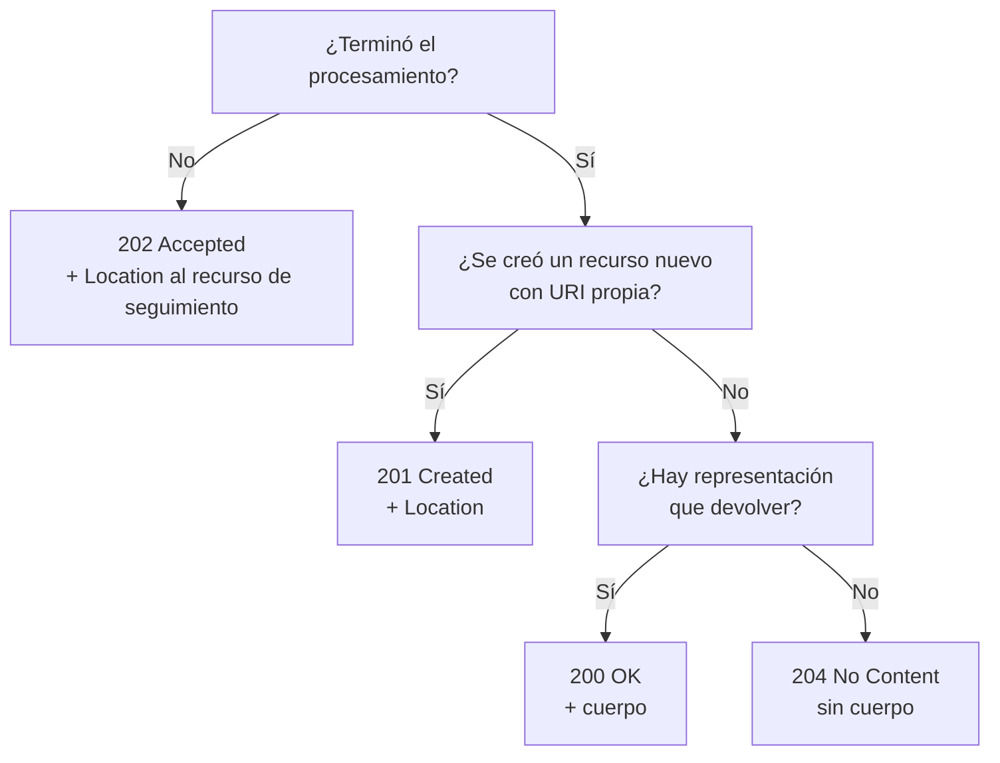

# Códigos de estado HTTP — `TEM-STATUS`

> Este documento adopta la **variante de catálogo** que autoriza [`MARCO-CONVENCIONES`](../00-Marco-de-Referencia/Convenciones.md): los ejemplos se distribuyen dentro de cada código en lugar de agruparse en una sección propia.

## Resumen ejecutivo

El código de estado es la parte de la respuesta que consumen los componentes que no leen el cuerpo: el *proxy* que decide si cachear, la política de reintentos que decide si repetir, el panel de observabilidad que cuenta errores, el navegador que decide si mostrar un diálogo de credenciales. Elegirlo bien es lo que permite que esa infraestructura funcione sin que nadie la haya programado para la API propia.

`N-01` §15 define cuarenta y seis códigos repartidos en cinco clases. Una API típica usa entre ocho y quince, y el trabajo de diseño no consiste en usar más sino en usar consistentemente los que corresponden. Los errores caros no son de exotismo sino de indistinción: `200` con un error adentro, `400` para todo lo que el cliente hizo mal, `500` para todo lo que salió mal del lado del servidor.

Este documento recorre las cinco clases y desarrolla los códigos que aparecen en el diseño de una API. Define **qué código** corresponde a cada situación; el **formato del cuerpo** de la respuesta de error lo define `N-04` (RFC 9457, que obsoleta RFC 7807) y lo desarrolla [`TEM-ERR`](../40-Contratos-y-Representaciones/Manejo-de-Errores.md).

---

## Definición

Un código de estado es un entero de tres dígitos que describe el resultado de la petición. El primer dígito define la clase y es lo único que un cliente está obligado a entender: `N-01` §15 establece que un cliente que recibe un código no reconocido debe tratarlo como el `x00` de su clase. De ahí sale una propiedad útil: emitir `422` ante un cliente que no lo conoce degrada a `400`, y eso es exactamente lo deseable.

| Clase | Significado según `N-01` §15 | Quién tiene el problema |
|---|---|---|
| `1xx` | Informational — respuesta provisional | Nadie; es negociación de protocolo |
| `2xx` | Successful — la petición se recibió, entendió y aceptó | Nadie |
| `3xx` | Redirection — hace falta una acción adicional | El cliente debe ir a otro lado |
| `4xx` | Client Error — la petición tiene un problema | El cliente; repetirla igual no sirve |
| `5xx` | Server Error — el servidor falló al procesar una petición aparentemente válida | El servidor; repetirla puede servir |

La frontera entre `4xx` y `5xx` es la que más consecuencias operativas tiene y la que más se cruza mal. Un `500` significa «esto es un defecto mío»: alimenta las alarmas, cuenta contra el objetivo de nivel de servicio y despierta a alguien. Un endpoint que devuelve `500` ante una entrada inválida no solo miente sobre la causa: contamina la señal con la que se opera el sistema.

### Qué no es

El código de estado no es el error de negocio. El espacio de códigos HTTP es corto y está semánticamente cargado; no alcanza para expresar «la sala no admite reservas los domingos» distinguido de «la sala está en mantenimiento». El patrón verificado en las plataformas grandes es de dos niveles: status HTTP para la clase del problema, más un `code` de cadena estable dentro del cuerpo para la identidad del error de dominio. Stripe (`P-04`) y `G-01` (Azure) llegaron a esa solución de forma independiente. La estructura de ese segundo nivel es materia de [`TEM-ERR`](../40-Contratos-y-Representaciones/Manejo-de-Errores.md).

Tampoco es un mecanismo de mensaje al usuario final. El código lo consume el cliente programático; el texto para la persona es responsabilidad del consumidor, que conoce su idioma y su contexto.

### Advertencias de fuente

Tres precisiones que este documento sostiene de forma literal, porque los tres errores circulan mucho.

`N-01` **renombró tres códigos** respecto de RFC 7231 y RFC 4918. `413` pasó de *Request Entity Too Large* a **Content Too Large**; `414` de *Request-URI Too Long* a **URI Too Long**; `422` de *Unprocessable Entity* a **Unprocessable Content**. Un texto que use los nombres viejos trabaja sobre documentación anterior a junio de 2022.

**`429 Too Many Requests` no está en `N-01`.** Se verificó explícitamente contra el índice del RFC: ni `428`, ni `429`, ni `431` figuran entre sus secciones. Los define `N-03` (RFC 6585, Proposed Standard de abril de 2012, vigente y no obsoleto). `451` lo define RFC 7725, no consultado en la verificación de [`ANEXO-REFERENCIAS`](../99-Anexos/Referencias.md). La atribución «429 según RFC 9110» es incorrecta y aparece constantemente.

**RFC 2616 y RFC 7231 están obsoletos.** El primero desde 2014, el segundo desde junio de 2022, ambos reemplazados en esta materia por `N-01`. Citarlos para semántica de códigos de estado es citar documentos retirados.

---

## Catálogo

### Clase `1xx` — Informational

`N-01` §15.2 define `100 Continue` y `101 Switching Protocols`. Ninguno se emite desde la lógica de una API: los gestiona el servidor o el marco de trabajo. Se listan por completitud y no se desarrollan.

---

### Clase `2xx` — Successful

`N-01` §15.3 define siete: `200 OK`, `201 Created`, `202 Accepted`, `203 Non-Authoritative Information`, `204 No Content`, `205 Reset Content` y `206 Partial Content`. Los tres últimos aparecen rara vez en APIs —`205` es para formularios de navegador y `206` para transferencia por rangos—; `203` es prácticamente inexistente.

#### `200 OK`

La petición se procesó y hay una representación en el cuerpo. Es el código por defecto de toda lectura exitosa y de las escrituras que devuelven el estado resultante.

```http
GET /v1/salas/SEDE-NORTE-201 HTTP/1.1
Host: api.salas.ejemplo.com
Accept: application/json
```

```http
HTTP/1.1 200 OK
Content-Type: application/json
ETag: "b91d40"

{ "codigo": "SEDE-NORTE-201", "nombre": "Sala Norte 201", "capacidad": 12 }
```

Un caso que sorprende y es correcto: una colección vacía es `200` con un array vacío, no `404`. La colección existe; lo que no hay es elementos.

```http
HTTP/1.1 200 OK
Content-Type: application/json

{ "datos": [], "total": 0 }
```

#### `201 Created`

Se creó uno o más recursos como consecuencia de la petición. `N-01` §10.2.2 asocia la cabecera `Location` a este código para identificar el recurso creado; omitirla es el defecto más común de las implementaciones que sí eligieron bien el código.

```http
POST /v1/reservas HTTP/1.1
Host: api.salas.ejemplo.com
Content-Type: application/json

{ "salaId": "a3f1", "desde": "2026-08-03T09:00:00Z", "hasta": "2026-08-03T10:30:00Z" }
```

```http
HTTP/1.1 201 Created
Location: /v1/reservas/9c2b
Content-Type: application/json
ETag: "3d10ab"

{ "id": "9c2b", "estado": "confirmada", "salaId": "a3f1" }
```

Un `PUT` que crea el recurso porque la URI no existía también devuelve `201`; si el recurso ya existía y se reemplazó, devuelve `200` o `204`. Distinguir ambos casos le ahorra al cliente una lectura previa.

#### `202 Accepted`

La petición se aceptó para procesamiento y el procesamiento **no terminó**. Es el código de las operaciones asíncronas, y su compromiso implícito es que existe una forma de averiguar cómo terminó: sin recurso de seguimiento, el `202` deja al cliente sin salida.

```http
POST /v1/informes/ocupacion HTTP/1.1
Host: api.salas.ejemplo.com
Content-Type: application/json

{ "sedeId": "norte", "desde": "2026-01-01", "hasta": "2026-06-30" }
```

```http
HTTP/1.1 202 Accepted
Location: /v1/tareas/7f21
Content-Type: application/json

{ "tareaId": "7f21", "estado": "en-proceso", "seguimiento": "/v1/tareas/7f21" }
```

El error frecuente es usar `202` para lo que en realidad se procesó de forma síncrona, «por si acaso». Devolver `202` cuando el resultado ya está obliga al cliente a un ciclo de sondeo innecesario.

#### `204 No Content`

Se procesó con éxito y **no hay cuerpo que devolver**. `204` prohíbe el cuerpo, y eso es lo que lo distingue de `200`: no es «200 sin datos», es la declaración de que no hay representación que enviar.

```http
DELETE /v1/reservas/9c2b HTTP/1.1
Host: api.salas.ejemplo.com
```

```http
HTTP/1.1 204 No Content
```

#### `200` frente a `201` frente a `202` frente a `204`

La decisión se resuelve con dos preguntas.



Entre `200` y `204` tras una escritura hay criterio de diseño legítimo. Devolver el recurso actualizado con `200` le ahorra al cliente una lectura y le entrega el `ETag` nuevo; devolver `204` ahorra ancho de banda. Esta guía recomienda `200` con el recurso en `CTX-1` y `CTX-3` —donde cada ida y vuelta cuesta— y admite `204` en `CTX-2`, donde el consumidor suele no necesitar el resultado.

---

### Clase `3xx` — Redirection

`N-01` §15.4 define nueve: `300 Multiple Choices` (§15.4.1), `301 Moved Permanently` (§15.4.2), `302 Found` (§15.4.3), `303 See Other` (§15.4.4), `304 Not Modified` (§15.4.5), `305 Use Proxy` (§15.4.6), `306` **(Unused)** (§15.4.7), `307 Temporary Redirect` (§15.4.8) y `308 Permanent Redirect` (§15.4.9).

En una API la clase importa mucho menos que en la web de documentos, con una excepción central.

#### `304 Not Modified`

La respuesta a una petición condicional cuando la representación almacenada por el cliente sigue siendo válida. No lleva cuerpo, y esa es toda su ventaja: ahorra la transferencia sin ahorrar la petición.

```http
GET /v1/salas/SEDE-NORTE-201 HTTP/1.1
Host: api.salas.ejemplo.com
If-None-Match: "b91d40"
```

```http
HTTP/1.1 304 Not Modified
ETag: "b91d40"
Cache-Control: max-age=60
```

Es el único `3xx` que una API emite habitualmente desde su propia lógica. El mecanismo completo —validadores, precedencia, revalidación— lo desarrolla [`TEM-CACHE`](Cache-y-Peticiones-Condicionales.md).

#### `301`, `307` y `308`

Reubicación de recursos. La distinción práctica es que `301` y `302` habilitaron históricamente que el cliente cambiara el método a `GET` al seguir la redirección, mientras `307` y `308` preservan el método y el cuerpo. Para una API, redirigir un `POST` con `301` es una fuente de errores silenciosos; cuando hace falta redirigir preservando la semántica, corresponden `307` —temporal— y `308` —permanente—.

Su uso más razonable en una API es la reorganización del espacio de URIs durante una migración de `ESC-2`, como puente temporal mientras los consumidores se actualizan. Como estrategia permanente de versionado no funciona, y las alternativas las trata [`TEM-VERS`](../50-Evolucion-y-Versionado/Estrategias-de-Versionado.md).

#### `303 See Other`

Indica que la respuesta a la petición está en otra URI, a la que se accede con `GET`. Tiene un uso legítimo y poco explotado en operaciones asíncronas: el recurso de seguimiento de un `202`, una vez terminado el trabajo, puede responder `303` apuntando al resultado.

---

### Clase `4xx` — Client Error

Es la clase que más decisiones exige. `N-01` §15.5 define veintidós códigos; `N-03` agrega `428`, `429` y `431`.

#### `400 Bad Request` — §15.5.1

El servidor no puede o no quiere procesar la petición por algo que percibe como un error del cliente. Es el código general de la clase, y su uso correcto es el de las peticiones **sintácticamente** defectuosas: JSON mal formado, tipo de dato imposible, parámetro obligatorio ausente.

```http
POST /v1/reservas HTTP/1.1
Host: api.salas.ejemplo.com
Content-Type: application/json

{ "salaId": "a3f1", "desde": }
```

```http
HTTP/1.1 400 Bad Request
Content-Type: application/problem+json

{ "type": "about:blank", "title": "Bad Request", "status": 400,
  "detail": "El cuerpo no es JSON válido: se esperaba un valor en la posición 34." }
```

#### `401 Unauthorized` — §15.5.2

Falta autenticación válida. El nombre es históricamente desafortunado: significa **no autenticado**. `N-01` §15.5.2 exige que la respuesta incluya `WWW-Authenticate` con al menos un desafío.

```http
GET /v1/reservas HTTP/1.1
Host: api.salas.ejemplo.com
```

```http
HTTP/1.1 401 Unauthorized
WWW-Authenticate: Bearer realm="api.salas.ejemplo.com"
```

`N-16` (RFC 6750) precisa el uso con tokens portadores: `invalid_token` corresponde a `401`, y cuando la petición no lleva credenciales el servidor *SHOULD NOT* incluir código de error en el desafío.

#### `403 Forbidden` — §15.5.4

El servidor entendió la petición, sabe quién la hace y **se niega a autorizarla**. Reautenticarse no cambia nada, que es exactamente la diferencia con `401`.

```http
DELETE /v1/reservas/9c2b HTTP/1.1
Host: api.salas.ejemplo.com
Authorization: Bearer eyJhbGciOi…
```

```http
HTTP/1.1 403 Forbidden
Content-Type: application/problem+json

{ "type": "https://api.salas.ejemplo.com/problemas/permiso-insuficiente",
  "title": "Permiso insuficiente", "status": 403,
  "detail": "La cancelación de reservas ajenas requiere el rol de administrador de sede." }
```

`N-16` asigna `403` al error `insufficient_scope`.

#### `401` frente a `403`

| | `401 Unauthorized` | `403 Forbidden` |
|---|---|---|
| Significa | No sé quién sos | Sé quién sos y no podés |
| Cabecera exigida | `WWW-Authenticate` | Ninguna |
| ¿Reintentar con otras credenciales ayuda? | Sí | No con las mismas |
| Causa típica | Token ausente, expirado o inválido | Rol insuficiente, recurso ajeno, plan sin la función |

El error frecuente es devolver `401` cuando el token expiró **y también** cuando el usuario carece de permiso. El cliente que renueva el token automáticamente entra en un ciclo de renovaciones que nunca resuelve nada. La mecánica de autenticación la desarrolla [`TEM-AUTH`](../70-Seguridad-y-Robustez/Autenticacion-y-Autorizacion.md).

#### `404 Not Found` — §15.5.5

El servidor no encontró una representación actual para el recurso, o no quiere revelar que existe. Esa segunda mitad de la definición es la que habilita su uso deliberado como respuesta de ocultamiento.

#### `404` frente a `403` y la filtración de información

Cuando un usuario pide una reserva que existe pero pertenece a otro, hay dos respuestas defendibles y no dan la misma información.

`403 Forbidden` es semánticamente exacto y **confirma que el recurso existe**. Un atacante que recorre identificadores distingue `404` —no hay nada— de `403` —hay algo que no es suyo—, y con eso enumera el modelo de datos sin acceder a un solo registro.

`404 Not Found` no filtra nada y miente por omisión, al precio de que un usuario legítimo con un problema de permisos reciba un mensaje que lo manda a buscar en la dirección equivocada.

`G-04` AIP-193 resuelve la tensión en la dirección opuesta a la intuición: prescribe que si el usuario no tiene permiso sobre el recurso o su padre, **con independencia de que el recurso exista o no**, el servicio debe responder `PERMISSION_DENIED`, que en HTTP es `403`. La coherencia es lo que hace segura esa opción: responder siempre `403` no filtra, porque no hay diferencia observable entre los dos casos. Lo inseguro no es elegir uno u otro código, es **elegir según el caso**.

Esta guía recomienda fijar la política por superficie y documentarla: `404` uniforme cuando los identificadores son adivinables y el recurso es sensible —el caso de `CTX-1`—, y `403` uniforme cuando los identificadores no son enumerables y la claridad del mensaje pesa más. El desarrollo del problema como riesgo de seguridad corresponde a [`TEM-PROT`](../70-Seguridad-y-Robustez/Proteccion-y-Limites.md) y a `ACT-07`.

#### `405 Method Not Allowed` — §15.5.6

El recurso existe y el método no está admitido para él. `N-01` exige que la respuesta incluya `Allow` con la lista de métodos admitidos.

```http
HTTP/1.1 405 Method Not Allowed
Allow: GET, POST
```

#### `406 Not Acceptable` — §15.5.7

No hay representación que satisfaga la negociación proactiva de contenido pedida por el cliente. Se emite ante un `Accept` que la API no puede servir; el mecanismo lo trata [`TEM-HEADERS`](Cabeceras-y-Negociacion.md).

#### `408 Request Timeout` — §15.5.9

El servidor no recibió la petición completa dentro del tiempo que estaba dispuesto a esperar. Es sobre la recepción de la petición, no sobre la duración del procesamiento: un endpoint que tarda demasiado en responder no es `408`, es `504` si hay una pasarela de por medio, o un problema de diseño.

#### `409 Conflict` — §15.5.10

La petición entra en conflicto con el **estado actual** del recurso. Es el código de las reglas de negocio que dependen del estado, y en el dominio de salas cubre el caso central: el solapamiento de horarios.

```http
POST /v1/reservas HTTP/1.1
Host: api.salas.ejemplo.com
Content-Type: application/json

{ "salaId": "a3f1", "desde": "2026-08-03T09:00:00Z", "hasta": "2026-08-03T10:30:00Z" }
```

```http
HTTP/1.1 409 Conflict
Content-Type: application/problem+json

{ "type": "https://api.salas.ejemplo.com/problemas/solapamiento",
  "title": "La sala ya está reservada en ese intervalo", "status": 409,
  "detail": "Existe la reserva 4b81 de 08:30 a 10:00 en la sala a3f1.",
  "reservaEnConflicto": "/v1/reservas/4b81" }
```

Stripe (`P-04`) usa `409` también para la reutilización de una clave de idempotencia con parámetros distintos, que es otro conflicto con el estado registrado.

#### `410 Gone` — §15.5.11

El recurso existió y ya no está, de forma permanente y deliberada. Frente a `404`, `410` afirma; su valor es informar a los clientes y a los rastreadores que no vale la pena volver. Mantener el registro necesario para distinguirlo tiene costo, y por eso su uso razonable es acotado: recursos con ciclo de vida conocido y consumidores que se benefician de la distinción.

#### `412 Precondition Failed` — §15.5.13

Una precondición expresada en las cabeceras de la petición dio falsa al evaluarse contra el estado actual del recurso. Es la respuesta canónica al fallo de `If-Match` en control de concurrencia optimista.

```http
PUT /v1/salas/SEDE-NORTE-201 HTTP/1.1
Host: api.salas.ejemplo.com
Content-Type: application/json
If-Match: "b91d40"

{ "nombre": "Sala Norte 201", "capacidad": 14, "sedeId": "norte" }
```

```http
HTTP/1.1 412 Precondition Failed
ETag: "c07a12"
Content-Type: application/problem+json

{ "type": "https://api.salas.ejemplo.com/problemas/version-desactualizada",
  "title": "El recurso cambió desde la última lectura", "status": 412,
  "detail": "El ETag enviado no coincide con la versión actual." }
```

#### `409` frente a `412`

Ambos hablan de estado y no son intercambiables. **`412` significa que el cliente declaró una expectativa sobre el estado —vía `If-Match` o `If-Unmodified-Since`— y esa expectativa falló.** `409` significa que la operación es incompatible con el estado actual, sin que el cliente haya declarado nada.

El criterio operativo: si la petición no lleva cabecera de precondición, `412` no corresponde. Y a la inversa, `409` no debe usarse para señalar una colisión de versiones cuando el cliente sí envió `If-Match`, porque el cliente tiene lógica específica para `412` y no la va a disparar. El desarrollo completo del mecanismo está en [`TEM-IDEM`](Idempotencia-y-Concurrencia.md).

#### `413 Content Too Large` — §15.5.14

El cuerpo de la petición supera lo que el servidor está dispuesto a procesar. **Se llamaba *Request Entity Too Large* antes de `N-01`.**

#### `414 URI Too Long` — §15.5.15

La URI es más larga de lo que el servidor interpreta. **Se llamaba *Request-URI Too Long*.** Aparece en la práctica con filtros complejos codificados en la cadena de consulta, y es el argumento concreto a favor de trasladar esas consultas a un `POST` sobre un recurso de búsqueda.

#### `415 Unsupported Media Type` — §15.5.16

El `Content-Type` de la petición no está soportado por el recurso para ese método. En una API con `PATCH` es un código de uso real: un endpoint que acepta `application/merge-patch+json` y recibe `application/json-patch+json` responde `415`, y la respuesta a `OPTIONS` con `Accept-Patch` de `N-05` es lo que le permite al cliente evitarlo.

#### `422 Unprocessable Content` — §15.5.21

El servidor entendió el tipo de contenido y la sintaxis es correcta, pero **no puede procesar las instrucciones contenidas**. **Se llamaba *Unprocessable Entity* en RFC 4918; `N-01` lo renombró.**

```http
POST /v1/reservas HTTP/1.1
Host: api.salas.ejemplo.com
Content-Type: application/json

{ "salaId": "a3f1", "desde": "2026-08-03T11:00:00Z", "hasta": "2026-08-03T09:00:00Z" }
```

```http
HTTP/1.1 422 Unprocessable Content
Content-Type: application/problem+json

{ "type": "https://api.salas.ejemplo.com/problemas/validacion",
  "title": "La petición no supera la validación", "status": 422,
  "errors": [ { "pointer": "#/hasta", "detail": "Debe ser posterior a 'desde'." } ] }
```

#### `400` frente a `422`

La distinción es de nivel: **`400` para lo que no se pudo interpretar, `422` para lo que se interpretó y no se pudo aceptar.**

| Situación | Código |
|---|---|
| JSON mal formado | `400` |
| Campo obligatorio ausente | `400` |
| `capacidad: "doce"` donde se espera un número | `400` |
| `capacidad: -3`, sintácticamente válido y semánticamente imposible | `422` |
| `hasta` anterior a `desde` | `422` |
| Referencia a una sala que no existe, enviada en el cuerpo | `422` |

Hay una objeción legítima a esta distinción y conviene registrarla: **`422` es opcional en la práctica**. Un cliente que no lo reconoce lo degrada a `400` por la regla de clase de `N-01` §15, así que la información no se pierde; y muchas APIs grandes usan `400` para ambos casos sin que nadie lo considere un defecto. Esta guía recomienda distinguir en `CTX-1` —donde el integrador se beneficia de saber si debe corregir su serializador o sus datos— y considera aceptable no distinguir en `CTX-2`, siempre que la decisión sea uniforme y esté documentada.

#### `428 Precondition Required` — `N-03`

El servidor exige que la petición sea condicional. Es el código que permite obligar al control de concurrencia optimista: un `PUT` sin `If-Match` sobre un recurso donde la actualización perdida es inaceptable se rechaza con `428` en lugar de aplicarse a ciegas. **Lo define `N-03`, no `N-01`.**

```http
HTTP/1.1 428 Precondition Required
Content-Type: application/problem+json

{ "type": "https://api.salas.ejemplo.com/problemas/precondicion-requerida",
  "title": "Se requiere If-Match", "status": 428,
  "detail": "Las modificaciones de sala exigen el ETag de la versión leída." }
```

#### `429 Too Many Requests` — `N-03`

El cliente envió demasiadas peticiones en un lapso dado. **No está en `N-01`**: lo define `N-03` (RFC 6585), verificado contra el índice de ambos documentos.

Su compañero natural es `Retry-After`, que sí define `N-01` §10.2.3 —sección no consultada individualmente en la verificación de [`ANEXO-REFERENCIAS`](../99-Anexos/Referencias.md)—. Sin `Retry-After`, el cliente que recibe `429` no tiene más opción que adivinar, y lo que adivina suele ser reintentar de inmediato.

```http
HTTP/1.1 429 Too Many Requests
Retry-After: 30
Content-Type: application/problem+json

{ "type": "https://api.salas.ejemplo.com/problemas/limite-excedido",
  "title": "Límite de peticiones excedido", "status": 429,
  "detail": "Máximo 100 peticiones por minuto. Reintentá en 30 segundos." }
```

Los campos `RateLimit` que comunican la cuota restante **no son normativos**: `F-02` es un Internet-Draft activo con fecha de expiración 2026-11-24, y define solo dos campos —`RateLimit-Policy` y `RateLimit`— con parámetros de una letra, no los populares `X-RateLimit-*`. El dimensionamiento y la aplicación del límite son materia de [`TEM-PROT`](../70-Seguridad-y-Robustez/Proteccion-y-Limites.md).

#### `431 Request Header Fields Too Large` — `N-03`

Las cabeceras exceden lo admitido. Aparece en la práctica con tokens JWT sobredimensionados por exceso de *claims*.

---

### Clase `5xx` — Server Error

`N-01` §15.6 define seis: `500 Internal Server Error`, `501 Not Implemented`, `502 Bad Gateway`, `503 Service Unavailable`, `504 Gateway Timeout` y `505 HTTP Version Not Supported`.

#### `500 Internal Server Error`

El servidor encontró una condición inesperada que le impidió completar la petición. Es la respuesta a un defecto propio, y debe tratarse como tal: cada `500` es un incidente, no un resultado previsto.

```http
HTTP/1.1 500 Internal Server Error
Content-Type: application/problem+json

{ "type": "about:blank", "title": "Internal Server Error", "status": 500,
  "instance": "/v1/reservas", "trazaId": "0af7651916cd43dd8448eb211c80319c" }
```

El identificador de traza es lo único que un `500` puede aportar sin comprometer nada: le da al consumidor algo que citar en un ticket y al equipo la forma de encontrar el evento. Lo que **no** debe aparecer es la traza de excepción, que expone estructura interna, versiones de bibliotecas y a veces cadenas de conexión; es una de las intervenciones específicas de `ACT-07` según [`MARCO-ACTORES`](../00-Marco-de-Referencia/Actores.md).

#### `501 Not Implemented`

El servidor no soporta la funcionalidad requerida para cumplir la petición. Se distingue de `405`: `501` dice que el método no se reconoce en absoluto; `405` dice que se reconoce y no aplica a ese recurso.

#### `502 Bad Gateway` y `504 Gateway Timeout`

Los emite un intermediario. `502` cuando recibió una respuesta inválida del servidor de origen; `504` cuando no la recibió a tiempo. Importan sobre todo desde el lado del consumidor: en `CTX-4`, un `504` de la pasarela de pagos **no dice si la operación se ejecutó**, y ese es precisamente el escenario que vuelve obligatorio el tratamiento de [`TEM-IDEM`](Idempotencia-y-Concurrencia.md).

#### `503 Service Unavailable`

El servidor no puede atender la petición ahora, por sobrecarga o mantenimiento, y la condición es **temporal**. Admite `Retry-After`, y ese es el aporte que lo hace útil.

```http
HTTP/1.1 503 Service Unavailable
Retry-After: 120
Content-Type: application/problem+json

{ "type": "https://api.salas.ejemplo.com/problemas/mantenimiento",
  "title": "Servicio en mantenimiento", "status": 503,
  "detail": "Ventana de mantenimiento hasta las 03:00 UTC." }
```

#### `500` frente a `503`

`500` significa «algo se rompió y no lo esperaba»; `503` significa «estoy bien, no puedo atenderte ahora, volvé». La diferencia es la que decide el comportamiento del cliente y del operador.

| | `500` | `503` |
|---|---|---|
| Causa | Defecto no previsto | Condición operativa conocida |
| ¿Reintentar sirve? | Probablemente no | Sí, después de `Retry-After` |
| `Retry-After` | No aplica | Corresponde |
| Efecto operativo | Alarma, incidente | Esperado durante una ventana |

Devolver `500` durante un mantenimiento planificado confunde la señal y hace que el reintento del cliente sea una decisión a ciegas. La dependencia caída —la base de datos que no responde— es el caso que más se etiqueta mal: si el servicio no puede operar y se espera que se recupere, `503` con `Retry-After` es más honesto y más accionable que `500`.

---

## Aplicación por escenario

### `ESC-1` — API nueva

Lo que conviene fijar antes del primer endpoint no es la lista de códigos sino las **políticas**: `400` frente a `422`, `404` frente a `403` en recursos ajenos, `200` frente a `204` tras una escritura, y qué devuelve el segundo `DELETE`. Sin esas cuatro decisiones tomadas y escritas, cada desarrollador resuelve la suya y la API termina con criterios distintos por endpoint, que es el defecto que `ACT-02` erosiona sin que se note según [`MARCO-ACTORES`](../00-Marco-de-Referencia/Actores.md).

La trampa es la inversa de la habitual: no es sobrediseñar, es subespecificar. `ESC-1` declara terminado su trabajo cuando existe un ejemplo de petición y respuesta para cada operación **incluyendo los errores**, y los errores son exactamente lo que suele faltar.

### `ESC-2` — Exposición o migración

El sistema previo trae su propio vocabulario de resultados —códigos numéricos internos, un campo `exito: false`, excepciones tipadas— y hay que traducirlo. La traducción es el trabajo, y hacerla mal produce el antipatrón más caro del escenario: `200` con un error adentro, que es literalmente lo que hacía el sistema anterior transportado a HTTP.

Un caso concreto: un servicio SOAP que devolvía `SOAP-Fault` para todo fallo se migra a HTTP repartiendo esos *faults* entre `400`, `403`, `409`, `422` y `500`, y ese reparto es una decisión de diseño que exige a `ACT-05` para las reglas de negocio y a `ACT-02` para los caminos técnicos.

### `ESC-3` — Evolución en producción

Cambiar el código de estado de una respuesta existente es rompiente y es de los cambios rompientes más fáciles de hacer sin darse cuenta. Un cliente que ramifica sobre `404` deja de funcionar cuando la API empieza a devolver `403` en ese mismo caso, aunque el cambio se haya hecho por una razón de seguridad legítima.

**Agregar** códigos nuevos es donde está el matiz. Emitir `422` donde antes se emitía `400` no rompe a los clientes que ramifican por clase, y sí rompe a los que comparan con el entero exacto. Emitir `429` en una API que nunca lo emitió rompe a todo cliente sin política de reintento. La clasificación formal la trata [`TEM-BREAK`](../50-Evolucion-y-Versionado/Compatibilidad-y-Cambios-Rompientes.md).

### `ESC-4` — Evaluación de una API ajena

En `ESC-4a` el contraste rinde de inmediato: se listan los códigos que la especificación OpenAPI declara por operación y se comparan con los que el código puede emitir. La divergencia típica es que el código emite `500` en caminos que la especificación no contempla, y que la especificación declara `404` en operaciones donde el código devuelve `403`.

En `ESC-4b` los códigos son la principal fuente de inferencia disponible. Un `403` ante un identificador ajeno revela que ese recurso existe; un `422` bien usado indica que hay una capa de validación distinta de la deserialización; un `500` ante una entrada inválida indica que no la hay. Lo que se obtiene es hipótesis y debe registrarse como tal.

### Qué cambia según el contexto

| Contexto | Qué cambia respecto de los códigos de estado |
|---|---|
| `CTX-1` pública | El código es documentación en el momento de mayor necesidad. Conviene distinguir `400`/`422`, publicar la política `404`/`403` y emitir `429` con `Retry-After`. Cada código declarado es un compromiso: dejar de emitirlo rompe |
| `CTX-2` interna | Se puede simplificar el catálogo si la simplificación es uniforme. Lo que no se negocia es la frontera `4xx`/`5xx`, porque de ella dependen las alarmas y los reintentos del *service mesh* |
| `CTX-3` backend de app propia | La tentación es devolver `200` con un campo `error` porque el cliente propio lo maneja igual. Rompe el manejo de errores del cliente HTTP, la observabilidad y la caché, y se vuelve irreversible cuando el cliente móvil instalado ya depende de ese formato |
| `CTX-4` integración | Los códigos los emite el proveedor y hay que traducirlos hacia adentro. La regla práctica: `5xx` y `429` ajenos se reintentan con retroceso; `4xx` ajenos no se reintentan nunca, salvo `408` y `429` |

---

## Preguntas guía

- ¿Mi API devuelve alguna vez `200` con un error adentro? ¿Dónde y por qué se decidió así?
- ¿Qué distingue en mi API un `400` de un `422`, y está escrito en algún lado o vive en la cabeza de quien implementó cada endpoint?
- Ante un recurso que existe y no le pertenece al solicitante, ¿respondo `403` o `404`? ¿Respondo lo mismo siempre?
- ¿Cada `401` de mi API viene con `WWW-Authenticate`? ¿Cada `405` con `Allow`? ¿Cada `429` y `503` con `Retry-After`?
- ¿Cuántos de mis `500` son defectos reales y cuántos son entradas inválidas mal clasificadas?
- ¿La especificación OpenAPI declara todos los códigos que el código puede emitir, incluidos los caminos de fallo que nadie probó?
- Si mañana empiezo a emitir `429`, ¿qué hacen mis consumidores actuales?

---

## Criterios de calidad

Una aplicación buena se reconoce por la coherencia antes que por la variedad. El mismo tipo de situación produce el mismo código en toda la superficie; la frontera entre `4xx` y `5xx` refleja de verdad quién tiene el problema; los códigos que exigen cabecera la traen; y la especificación declara los caminos de fallo, no solo el feliz.

### Antipatrones

**`200` con un error en el cuerpo.** El más caro de todos. Rompe el manejo de errores de cualquier cliente HTTP, envenena la observabilidad —el panel muestra cero errores mientras el sistema falla—, y permite que una caché almacene una respuesta de error como si fuera válida. La evidencia de las plataformas verificadas es unánime en contra: Stripe define `200` como *«everything worked as expected»* (`P-04`) y `G-01` exige una cabecera de error que presupone status de error. El único matiz honesto es que en protocolos con *batching* —GraphQL— el patrón es consecuencia del diseño y no un defecto; para una API REST de recurso único no hay tal excusa.

**`500` como cajón de sastre.** Un `catch` general que devuelve `500` ante cualquier excepción convierte las entradas inválidas en incidentes propios. Es el defecto que `ACT-04` debe buscar activamente según [`MARCO-ACTORES`](../00-Marco-de-Referencia/Actores.md), porque el camino feliz sigue funcionando perfecto.

**`404` para todo lo que no salió bien.** Devolver `404` cuando el recurso existe y el parámetro estaba mal, o cuando la ruta no coincidía con ninguna, deja al consumidor sin forma de distinguir «no existe» de «me equivoqué al llamarte».

**`401` para permisos insuficientes.** Provoca ciclos de renovación de credenciales que no resuelven nada, y es de los defectos que solo aparecen en producción con clientes reales.

**Códigos inconsistentes por endpoint.** La misma condición —recurso inexistente, validación fallida— resuelta con códigos distintos en distintos endpoints. Se detecta con un *linter* de OpenAPI en integración continua, que es la forma efectiva de ejercer la autoridad de `ACT-01`.

**Códigos exóticos por prestigio.** `418`, que `N-01` §15.5.19 registra explícitamente como **(Unused)**, o `451` en situaciones que no son requerimientos legales. Un código que el consumidor no reconoce degrada a `x00`; usar uno raro sin motivo cuesta claridad y no compra nada.

**`412` sin precondición en la petición.** Emitir `412` cuando el cliente no envió `If-Match` ni `If-Unmodified-Since` es una contradicción con `N-01` §15.5.13. La situación que se quería señalar suele ser `409`.

**`Retry-After` ausente en `429` y `503`.** Ambos códigos le dicen al cliente que espere, y ninguno de los dos le dice cuánto si falta la cabecera. El resultado previsible es el reintento inmediato, que agrava exactamente la condición que se quería aliviar.

---

## Anexo — Tabla de decisión y ficha de política

### Del síntoma al código

| Situación | Código | Cabecera obligada |
|---|---|---|
| Lectura exitosa | `200` | — |
| Colección sin elementos | `200` con array vacío | — |
| Recurso creado | `201` | `Location` |
| Trabajo aceptado, sin terminar | `202` | `Location` al seguimiento |
| Escritura exitosa sin representación | `204` | — |
| Representación del cliente todavía válida | `304` | `ETag` |
| JSON mal formado o campo obligatorio ausente | `400` | — |
| Sin credenciales, o credenciales inválidas | `401` | `WWW-Authenticate` |
| Autenticado y sin permiso | `403` | — |
| Recurso inexistente, o existente y ocultado | `404` | — |
| Método no admitido por el recurso | `405` | `Allow` |
| Ningún `Accept` satisfacible | `406` | — |
| Conflicto con el estado actual del recurso | `409` | — |
| Recurso eliminado de forma permanente | `410` | — |
| Fallo de `If-Match` o `If-Unmodified-Since` | `412` | `ETag` actual |
| Cuerpo demasiado grande | `413` | — |
| URI demasiado larga | `414` | — |
| `Content-Type` no soportado | `415` | `Accept-Patch` si es `PATCH` |
| Sintaxis válida, contenido no procesable | `422` | — |
| Se exige petición condicional | `428` (`N-03`) | — |
| Límite de peticiones excedido | `429` (`N-03`) | `Retry-After` |
| Defecto no previsto del servidor | `500` | — |
| Sobrecarga o mantenimiento temporal | `503` | `Retry-After` |

### Ficha de política de códigos

Se completa una vez por API y se revisa cuando se agrega una superficie nueva.

```yaml
api: ""
politica_validacion: "400-para-todo | 400-sintaxis-422-semantica"
politica_recurso_ajeno: "403-siempre | 404-siempre"   # uniforme, nunca según el caso
justificacion_recurso_ajeno: ""
politica_escritura_exitosa: "200-con-recurso | 204-sin-cuerpo"
politica_segundo_delete: "404 | 204"
emite_422: si | no
emite_428: si | no
emite_429: si | no
retry_after_en_429: si | no | no-aplica
retry_after_en_503: si | no
formato_del_cuerpo_de_error: "application/problem+json (N-04) | propio"   # ver TEM-ERR
codigos_declarados_en_openapi: si | parcial | no
linter_de_consistencia_en_ci: si | no
```

Los dos campos que más información aportan son `politica_recurso_ajeno` —cuya única respuesta segura es una que no dependa del caso— y `codigos_declarados_en_openapi`, porque un «parcial» describe con precisión la divergencia entre especificación e implementación que `ESC-4a` encuentra como hallazgo más frecuente.
