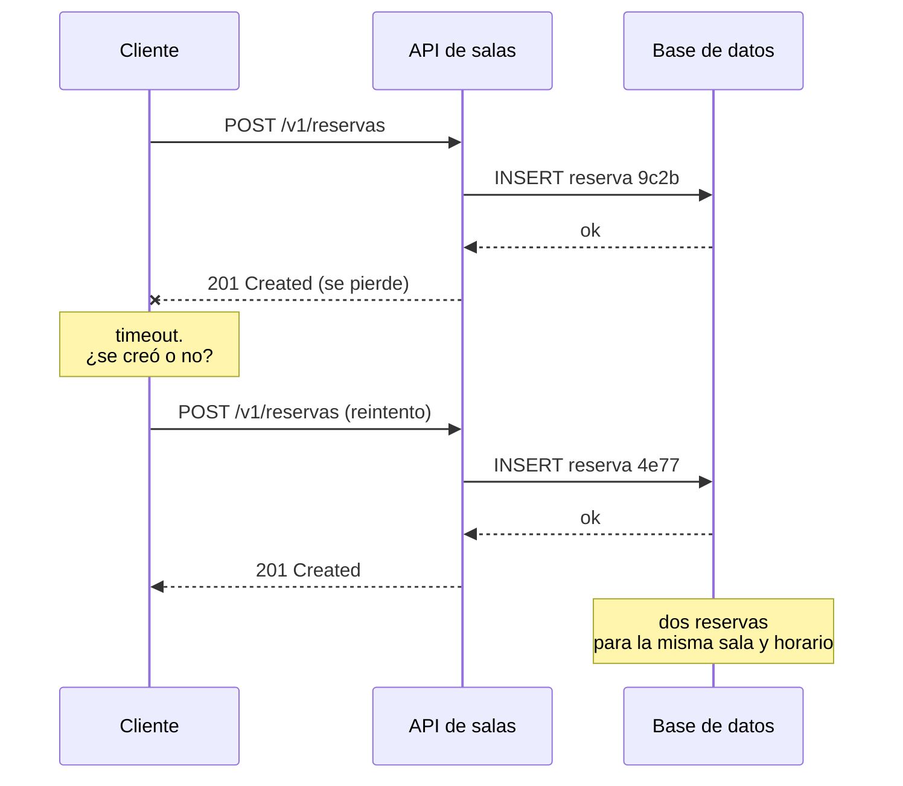
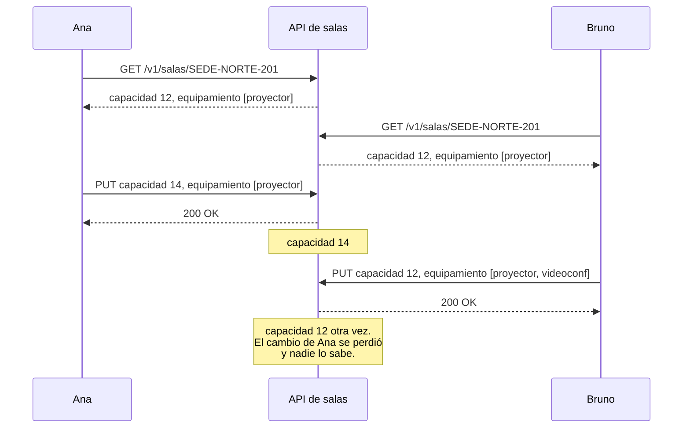
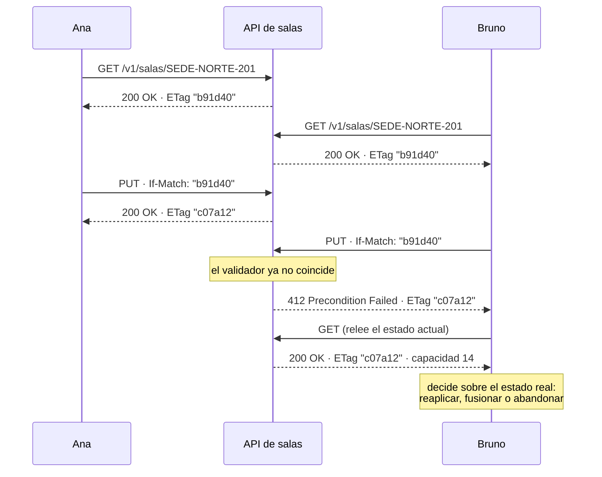

# Idempotencia y concurrencia — `TEM-IDEM`

## Resumen ejecutivo

Dos problemas distintos comparten este documento porque comparten mecanismo. El primero es el reintento: una petición se envía, la red se corta antes de que llegue la respuesta, y el cliente no sabe si la operación se ejecutó. El segundo es la escritura concurrente: dos clientes leen el mismo recurso, ambos lo modifican, y el segundo pisa el trabajo del primero sin que nadie se entere. Ambos se resuelven con precondiciones y validadores, y ambos aparecen exactamente cuando el sistema empieza a usarse en serio.

La distinción que ordena todo el documento es entre **idempotencia del protocolo** —una propiedad que `N-01` §9.2.2 le atribuye a ciertos métodos— e **idempotencia de negocio**, que es la garantía de que ejecutar una operación dos veces no cobre dos veces. La primera está especificada; la segunda no lo está, y el mecanismo que la industria usa para conseguirla —la cabecera `Idempotency-Key`— **no es un estándar**: el draft del IETF que lo describía **expiró sin llegar a RFC** (`F-01`), y lo que queda es una convención de facto impuesta por Stripe (`P-04`).

El control de concurrencia optimista, en cambio, sí está enteramente especificado: `If-Match` con `ETag` y `412 Precondition Failed` como respuesta al fallo, todo dentro de `N-01`. Es de las funciones más completas y menos implementadas del protocolo.

---

## Definición

### Idempotencia del protocolo

`N-01` §9.2.2 define un método como idempotente cuando el efecto sobre el servidor de varias peticiones idénticas sucesivas es el mismo que el de una sola. Son idempotentes los cuatro métodos seguros —`GET`, `HEAD`, `OPTIONS`, `TRACE`— más `PUT` y `DELETE`. No lo son `POST` ni `CONNECT`, ni `PATCH`, que define `N-05` con la frase *«PATCH is neither safe nor idempotent»*.

La propiedad se predica del **efecto sobre el estado del servidor**, no del código de respuesta. Que el primer `DELETE` devuelva `204` y el segundo `404` no la viola: el estado resultante es idéntico. Es la confusión más difundida del tema y la trata [`TEM-METODOS`](Metodos.md).

Y es una propiedad **declarada, no verificada**: `N-01` dice qué debe garantizar cada método, no comprueba que la implementación lo haga. Un `PUT` que incrementa un contador en cada llamada es no idempotente en los hechos y aparenta serlo en la especificación. Solo se comprueba ejecutando dos veces y comparando el estado.

### Idempotencia de negocio

Es la garantía de que una operación de dominio produce el mismo resultado observable aunque se solicite varias veces: una sola reserva creada, un solo cobro, una sola notificación enviada. No está en ningún RFC vigente, y no coincide con la del protocolo: `POST /reservas` es no idempotente según `N-01` y aun así puede diseñarse para que un reintento no duplique nada.

### Concurrencia optimista

Es la estrategia de control de concurrencia que permite que varios clientes lean y modifiquen sin bloquear, y detecta el conflicto en el momento de escribir. Se apoya en un validador —`ETag`, definido en `N-01` §8.8— que el cliente devuelve al escribir mediante `If-Match` (§13.1). Si el validador ya no coincide, la escritura se rechaza con `412 Precondition Failed` (§15.5.13).

Su alternativa es el bloqueo pesimista, que reserva el recurso durante la edición. HTTP no lo soporta de forma nativa, exige estado del lado del servidor y contradice la restricción de ausencia de estado de `O-01`; existen soluciones basadas en recursos de bloqueo explícitos y quedan fuera del alcance de este documento.

### Qué no es

La idempotencia no es la eliminación de duplicados a posteriori. Detectar dos reservas iguales y borrar una es una compensación, no una garantía: hay una ventana en la que ambas existieron y algo pudo actuar sobre ellas.

Tampoco es una política de reintentos. Reintentar es lo que hace el cliente; la idempotencia es lo que hace que reintentar sea seguro. Un cliente con reintentos sobre una operación no idempotente no es resiliente: es una fuente de duplicados con retroceso exponencial. La política de reintentos es materia de [`TEM-RESIL`](../70-Seguridad-y-Robustez/Resiliencia.md).

Y el control de concurrencia optimista no es un mecanismo de bloqueo. No impide que dos clientes editen a la vez; garantiza que el segundo se entere de que perdió.

---

## Por qué `POST` no es idempotente y qué hacer al respecto

El problema tiene una forma precisa y conviene enunciarla sin metáforas. Un cliente envía `POST /v1/reservas`. El servidor crea la reserva y responde `201`. La respuesta se pierde: se cayó la conexión, expiró el *timeout*, una pasarela devolvió `504`. El cliente está ahora en un estado donde **no puede distinguir** entre «la petición nunca llegó» y «la petición se ejecutó y la respuesta se perdió».



Las dos ramas exigen conductas opuestas —reintentar o no reintentar— y no hay información para elegir. Ese es el problema completo, y el protocolo no lo resuelve para `POST`.

Hay tres salidas, en orden de preferencia.

**Usar `PUT` con un identificador que elija el cliente.** Si el cliente genera un UUID y hace `PUT /v1/reservas/{uuid}`, el método es idempotente por `N-01` §9.2.2 y el reintento es seguro sin ningún mecanismo adicional. Es la solución más limpia y la menos usada, porque exige que el cliente sepa generar identificadores y porque incomoda a quien espera que la creación sea `POST` sobre la colección. Cuando se puede aplicar, se acabó el problema.

**Detectar el duplicado por una regla del dominio.** En el dominio de salas hay una restricción natural: una sala no admite dos reservas solapadas. El segundo `POST` idéntico choca contra esa regla y devuelve `409 Conflict`. No es idempotencia —el resultado observable difiere: `201` la primera vez, `409` la segunda— pero evita el duplicado sin infraestructura adicional. Su límite es que solo cubre las operaciones que tienen una restricción así, y muchas no la tienen.

**Usar una clave de idempotencia.** Es la solución general, y es la que la industria adoptó.

---

## `Idempotency-Key`: convención de facto, no estándar

El cliente genera una clave única por intento lógico de operación —no por reintento— y la envía en una cabecera. El servidor registra la clave junto con el resultado; si llega otra petición con la misma clave, devuelve el resultado registrado en lugar de ejecutar de nuevo.

### El estado real de la especificación

`F-01`, `draft-ietf-httpapi-idempotency-key-header`, alcanzó la revisión **-07 el 2025-10-15** y su estado en el datatracker es **Expired**. No tiene número de RFC asignado y nunca lo tuvo. **La frase «seguí el draft IETF de `Idempotency-Key`» cita un documento muerto.**

Lo que existe es una convención de facto impuesta por Stripe y adoptada por el ecosistema de pagos, sostenida por `P-04`. La cabecera es perfectamente utilizable; lo que no es utilizable es el argumento de autoridad. Presentarla como estándar en una especificación OpenAPI o en una discusión de diseño es una cita incorrecta.

Un dato que la verificación de [`ANEXO-REFERENCIAS`](../99-Anexos/Referencias.md) dejó registrado y que conviene no exagerar: las implementaciones fuera de Stripe —Twilio, Shopify, Adyen, PayPal— **no se verificaron**, ni si coinciden en el nombre de la cabecera o en el código de estado. La afirmación «la industria usa `Idempotency-Key`» tiene una sola fuente confirmada.

### El *fingerprint*

El draft expirado introducía el concepto de **idempotency fingerprint**: un resumen del contenido de la petición que, junto con la clave, determina la unicidad. La razón es concreta. Si el servidor solo compara la clave, un cliente que reutiliza una clave con parámetros distintos —por error de programación— recibe el resultado de la operación anterior, que no es la que pidió.

La conducta verificada de Stripe es exactamente esa: un error dedicado, `idempotency_error`, que se produce cuando *«an `Idempotency-Key` is re-used on a request that does not match the first request's API endpoint and parameters»*, con `409 Conflict` como código. La práctica precedió a la especificación y le sobrevivió.

### Qué hay que decidir al implementarla

Cuatro cosas, y ninguna la resuelve el protocolo.

**Cuánto se conserva la clave.** Retenerla para siempre es un almacén que crece sin límite; retenerla poco reabre la ventana de duplicación. Un plazo del orden de las veinticuatro horas cubre los reintentos razonables.

**Qué se devuelve en la repetición.** Devolver el mismo `201` con el mismo cuerpo es lo más útil para el cliente. Marcar la respuesta repetida con una cabecera propia ayuda al diagnóstico y no es normativo.

**Qué pasa con la petición en curso.** Si el reintento llega antes de que la primera termine, hay dos peticiones concurrentes con la misma clave. La respuesta correcta es `409`, no ejecutar y esperar.

**Qué se hace con las claves que el cliente no envía.** Exigir la cabecera es lo más seguro y rompe a todos los clientes existentes; aceptarla como opcional deja el problema sin resolver para quien no la use. En `ESC-1` conviene exigirla desde el principio en las operaciones que cuestan dinero; en `ESC-3` corresponde aceptarla, medir la adopción y exigirla en una versión nueva.

---

## Concurrencia optimista y la actualización perdida

El problema de la actualización perdida no necesita concurrencia real ni carga alta: basta con dos personas editando la misma sala en pestañas distintas.



Bruno escribió sobre una lectura que ya era vieja. Ambos recibieron `200`, ambos creen que su cambio quedó, y el sistema quedó en un estado que ninguno de los dos pidió. Nada falló técnicamente; el defecto es de diseño.

### La solución especificada

`N-01` la resuelve por completo. El servidor emite `ETag` en cada lectura. El cliente devuelve ese `ETag` en `If-Match` al escribir. El servidor compara: si coincide, escribe y emite un `ETag` nuevo; si no coincide, responde `412 Precondition Failed` sin tocar nada.



Lo que el mecanismo garantiza es que el conflicto **se detecta**; qué hacer con él es decisión del cliente y no del protocolo. Reaplicar sobre el estado nuevo, presentar ambas versiones a la persona, o abandonar son las tres respuestas razonables, y cuál corresponde depende del dominio. Lo que no es aceptable es que el cliente reintente el mismo `PUT` con el `ETag` viejo, porque va a recibir `412` indefinidamente.

`N-01` §13.2.2 fija un detalle de orden que importa cuando se combinan precondiciones: **`If-Match` e `If-Unmodified-Since` se evalúan antes que las demás**.

### `If-Unmodified-Since`

Es la variante temporal, basada en `Last-Modified` en lugar de `ETag`. Sirve cuando el sistema ya tiene una marca de última modificación y calcular un `ETag` resulta caro. Su límite es la resolución de un segundo: dos escrituras dentro del mismo segundo son indistinguibles y el mecanismo falla en silencio. Para recursos con escritura frecuente, `ETag` es la única opción correcta.

### Exigir la precondición: `428`

Aceptar un `PUT` sin `If-Match` deja la puerta abierta a la actualización perdida para todo cliente que no implemente el mecanismo. Cuando el recurso lo amerita, corresponde rechazar la escritura no condicional con **`428 Precondition Required`**, que define `N-03` y no `N-01`.

Es una decisión de contrato, no un detalle. Exigirlo desde `ESC-1` cuesta poco; agregarlo en `ESC-3` es rompiente para todos los clientes que hoy escriben sin condición, y la vía compatible es la habitual: emitir `ETag`, aceptar `If-Match`, medir cuántos lo envían, exigirlo en la versión siguiente.

### `409` frente a `412`

La distinción se enuncia en [`TEM-STATUS`](Codigos-de-Estado.md) y se aplica acá. **`412` responde al fallo de una precondición que el cliente declaró.** `409` responde a un conflicto con el estado actual que el cliente no anticipó. Si la petición no lleva `If-Match` ni `If-Unmodified-Since`, `412` no corresponde. Y a la inversa: emitir `409` ante una colisión de versiones cuando el cliente sí envió `If-Match` desactiva la rama de código que ese cliente escribió específicamente para manejarla.

---

## Aplicación por escenario

### `ESC-1` — API nueva

Las dos decisiones cuestan poco ahora y mucho después. La primera es emitir `ETag` en toda lectura de recurso individual modificable: no rompe nada, no obliga a nadie, y habilita tanto la revalidación de [`TEM-CACHE`](Cache-y-Peticiones-Condicionales.md) como la concurrencia optimista. La segunda es decidir qué operaciones exigen clave de idempotencia y exigirla desde el principio; agregarla como obligatoria después es rompiente.

La trampa de este escenario es la habitual y aplica: implementar claves de idempotencia con almacén persistente y política de expiración para una API interna cuyas operaciones son todas consultas es resolver un problema que no se tiene. El criterio de selección es concreto: la operación necesita clave si ejecutarla dos veces produce un daño que alguien tiene que reparar a mano.

### `ESC-2` — Exposición o migración

El sistema previo suele tener ya un mecanismo de detección de duplicados —un número de operación, una clave natural, una restricción de unicidad— y conviene encontrarlo antes de inventar otro. Exponerlo como `Idempotency-Key` sobre el mecanismo existente es más barato y más confiable que construir un registro paralelo.

Para la concurrencia, el hallazgo típico es que el sistema previo ya tiene una columna de versión de fila que nadie exponía. Derivar el `ETag` de ella es inmediato, es un validador débil correcto y no exige serialización determinista.

### `ESC-3` — Evolución en producción

Toda la materia de este documento se agrega de forma compatible salvo en un punto. Emitir `ETag` no rompe. Aceptar `If-Match` no rompe. Aceptar `Idempotency-Key` opcional no rompe. **Exigir** cualquiera de las dos cabeceras rompe a todos los clientes actuales, sin degradación gradual.

Hay un caso intermedio que conviene tener presente: empezar a emitir `412` en un endpoint que nunca lo emitió no rompe a los clientes que no envían `If-Match` —nunca lo van a recibir—, pero sí requiere que la especificación lo declare antes de que aparezca, porque un código no documentado es un hallazgo de `ESC-4a` esperando a ocurrir.

### `ESC-4` — Evaluación de una API ajena

En `ESC-4a` la verificación central es si las operaciones costosas admiten alguna forma de idempotencia, y si las escrituras sobre recursos compartidos admiten `If-Match`. La ausencia de ambas cosas en una API con dinero de por medio es un hallazgo de primer orden.

En `ESC-4b` se infiere observando. La presencia de `ETag` en las lecturas sugiere que puede haber `If-Match`; probarlo con un valor deliberadamente incorrecto y ver si llega `412` lo confirma. Para la idempotencia, enviar dos veces la misma operación con la misma clave y comprobar si se duplica es la prueba directa, y hay que hacerla con autorización y sobre datos propios, dentro del límite que enuncia [`MARCO-ESCENARIOS`](../00-Marco-de-Referencia/Escenarios.md).

### Qué cambia según el contexto

| Contexto | Qué cambia respecto de idempotencia y concurrencia |
|---|---|
| `CTX-1` pública | Los integradores reintentan con políticas que no se controlan y que van a ser agresivas. Las operaciones con efecto económico necesitan clave de idempotencia documentada, y su semántica —qué pasa si se reutiliza con otros parámetros— es parte del contrato |
| `CTX-2` interna | El reintento automático del *service mesh* está activado por defecto y suele no estar presente en la cabeza de quien diseña el endpoint. Un `POST` no idempotente detrás de un reintento automático produce duplicados que nadie atribuye al *mesh* |
| `CTX-3` backend de app propia | Las redes móviles cortan a mitad de petición con frecuencia, y el cliente MAUI reintenta. Es el contexto donde la idempotencia de negocio más se necesita y menos se implementa, porque en desarrollo la red nunca falla |
| `CTX-4` integración | Es el contexto que [`MARCO-CONTEXTOS`](../00-Marco-de-Referencia/Contextos.md) nombra como aquel donde «la idempotencia deja de ser teoría y se vuelve el problema central». Un `504` de la pasarela de pagos no dice si el cobro se ejecutó, y hay que saber cómo averiguarlo o cómo reintentar sin duplicar. Ese mecanismo lo define el proveedor: hay que leerlo antes de integrarse, no después del primer cobro doble |

---

## Ejemplos concretos

Sintéticos, del sistema de reserva de salas.

### Creación con clave de idempotencia

```http
POST /v1/reservas HTTP/1.1
Host: api.salas.ejemplo.com
Content-Type: application/json
Idempotency-Key: 9f1c4d2e-6b80-4a13-9f77-2c5e1b0a7d34

{ "salaId": "a3f1", "desde": "2026-08-03T09:00:00Z", "hasta": "2026-08-03T10:30:00Z" }
```

```http
HTTP/1.1 201 Created
Location: /v1/reservas/9c2b
Content-Type: application/json
ETag: "3d10ab"

{ "id": "9c2b", "estado": "confirmada", "salaId": "a3f1" }
```

El reintento con la misma clave y el mismo cuerpo:

```http
HTTP/1.1 201 Created
Location: /v1/reservas/9c2b
Content-Type: application/json
ETag: "3d10ab"
Idempotent-Replay: true

{ "id": "9c2b", "estado": "confirmada", "salaId": "a3f1" }
```

`Idempotent-Replay` es una cabecera propia, no normativa; se documenta como tal y sirve para diagnóstico.

La misma clave con otro cuerpo, siguiendo la conducta de `P-04`:

```http
POST /v1/reservas HTTP/1.1
Host: api.salas.ejemplo.com
Content-Type: application/json
Idempotency-Key: 9f1c4d2e-6b80-4a13-9f77-2c5e1b0a7d34

{ "salaId": "b7e2", "desde": "2026-08-04T15:00:00Z", "hasta": "2026-08-04T16:00:00Z" }
```

```http
HTTP/1.1 409 Conflict
Content-Type: application/problem+json

{ "type": "https://api.salas.ejemplo.com/problemas/clave-idempotencia-reutilizada",
  "title": "Clave de idempotencia reutilizada con otros parámetros",
  "status": 409,
  "detail": "La clave 9f1c4d2e… se registró para otra reserva. Usá una clave nueva." }
```

### Concurrencia optimista completa

```http
GET /v1/salas/SEDE-NORTE-201 HTTP/1.1
Host: api.salas.ejemplo.com
```

```http
HTTP/1.1 200 OK
Content-Type: application/json
ETag: "b91d40"

{ "codigo": "SEDE-NORTE-201", "nombre": "Sala Norte 201", "capacidad": 12 }
```

```http
PUT /v1/salas/SEDE-NORTE-201 HTTP/1.1
Host: api.salas.ejemplo.com
Content-Type: application/json
If-Match: "b91d40"

{ "nombre": "Sala Norte 201", "capacidad": 12, "sedeId": "norte", "equipamiento": ["proyector", "videoconf"] }
```

```http
HTTP/1.1 412 Precondition Failed
ETag: "c07a12"
Content-Type: application/problem+json

{ "type": "https://api.salas.ejemplo.com/problemas/version-desactualizada",
  "title": "El recurso cambió desde la última lectura", "status": 412,
  "detail": "Releé el recurso y volvé a aplicar el cambio sobre la versión c07a12." }
```

Devolver el `ETag` actual en el `412` le ahorra al cliente una comparación y le dice explícitamente sobre qué versión debe rehacer el trabajo.

### Escritura sin precondición, rechazada

```http
PUT /v1/salas/SEDE-NORTE-201 HTTP/1.1
Host: api.salas.ejemplo.com
Content-Type: application/json

{ "nombre": "Sala Norte 201", "capacidad": 20, "sedeId": "norte" }
```

```http
HTTP/1.1 428 Precondition Required
Content-Type: application/problem+json

{ "type": "https://api.salas.ejemplo.com/problemas/precondicion-requerida",
  "title": "Se requiere If-Match", "status": 428,
  "detail": "Las modificaciones de sala exigen el ETag obtenido en la lectura previa." }
```

### En ASP.NET Core — concurrencia optimista

```csharp
app.MapPut("/v1/salas/{codigo}", async (
    string codigo, SalaCompleta cuerpo, ISalaService svc,
    HttpRequest req, HttpResponse resp, CancellationToken ct) =>
{
    var actual = await svc.ObtenerAsync(codigo, ct);
    if (actual is null) return Results.NotFound();

    var etagActual = $"W/\"{actual.Version}\"";
    var ifMatch = req.Headers.IfMatch;

    // N-03: sin precondición no se escribe sobre un recurso compartido.
    if (ifMatch.Count == 0)
        return Results.Problem(
            statusCode: StatusCodes.Status428PreconditionRequired,
            title: "Se requiere If-Match",
            detail: "Las modificaciones de sala exigen el ETag obtenido en la lectura previa.");

    // N-01 §15.5.13: el validador no coincide ⇒ 412, sin modificar nada.
    if (!ifMatch.Contains(etagActual) && !ifMatch.Contains("*"))
    {
        resp.Headers.ETag = etagActual;
        return Results.Problem(
            statusCode: StatusCodes.Status412PreconditionFailed,
            title: "El recurso cambió desde la última lectura");
    }

    var actualizada = await svc.ReemplazarAsync(codigo, cuerpo, actual.Version, ct);
    resp.Headers.ETag = $"W/\"{actualizada.Version}\"";
    return Results.Ok(actualizada);
});
```

La comparación en memoria no basta por sí sola: entre la lectura y la escritura hay una ventana. La verificación tiene que llegar hasta el almacenamiento —una cláusula `WHERE version = @version` sobre la actualización, o el token de concurrencia de Entity Framework Core— y el `412` emitirse cuando esa escritura afecta cero filas.

### En ASP.NET Core — clave de idempotencia

```csharp
// Idempotency-Key es convención de facto sostenida por P-04.
// El draft IETF F-01 EXPIRÓ el 2025-10-15 sin llegar a RFC: no citarlo como estándar.
app.MapPost("/v1/reservas", async (
    [FromHeader(Name = "Idempotency-Key")] string? clave,
    NuevaReserva cuerpo, IReservaService svc, IRegistroIdempotencia registro,
    HttpResponse resp, CancellationToken ct) =>
{
    if (string.IsNullOrWhiteSpace(clave))
        return Results.Problem(
            statusCode: StatusCodes.Status400BadRequest,
            title: "Falta la cabecera Idempotency-Key");

    // El fingerprint distingue "mismo intento" de "clave reutilizada por error".
    var huella = Huella.De(cuerpo);
    var registrada = await registro.BuscarAsync(clave, ct);

    if (registrada is not null)
    {
        if (registrada.Huella != huella)
            return Results.Problem(
                statusCode: StatusCodes.Status409Conflict,
                title: "Clave de idempotencia reutilizada con otros parámetros");

        if (registrada.EnCurso)
            return Results.Problem(
                statusCode: StatusCodes.Status409Conflict,
                title: "Hay una petición en curso con esta clave");

        resp.Headers["Idempotent-Replay"] = "true";
        return Results.Created($"/v1/reservas/{registrada.ReservaId}", registrada.Respuesta);
    }

    await registro.ReservarAsync(clave, huella, ct);
    var creada = await svc.CrearAsync(cuerpo, ct);
    await registro.CompletarAsync(clave, creada, ct);

    return Results.Created($"/v1/reservas/{creada.Id}", creada);
});
```

El registro y la creación deben ser atómicos entre sí: si el proceso muere entre `CrearAsync` y `CompletarAsync`, la clave queda marcada en curso con una reserva ya creada. Resolverlo exige que ambas escrituras compartan transacción, o un mecanismo de reconciliación; es el punto donde la implementación se vuelve genuinamente difícil y donde conviene no improvisar.

---

## Preguntas guía

- Para cada operación de escritura de mi API: si el cliente la reintenta tras un *timeout*, ¿qué pasa? ¿Lo verifiqué o lo supongo?
- ¿Cuáles de mis operaciones producirían, al duplicarse, un daño que alguien tiene que reparar a mano?
- ¿Mis lecturas de recursos modificables emiten `ETag`? Si no, ¿cómo espero que un cliente escriba sin pisar a otro?
- ¿Qué pasa hoy si dos usuarios editan la misma sala al mismo tiempo? ¿Alguien se entera?
- Si acepto `Idempotency-Key`, ¿comparo también el contenido de la petición o solo la clave?
- ¿Cuánto tiempo conservo las claves de idempotencia, y qué pasa cuando expiran?
- En `CTX-4`, ¿sé qué mecanismo de idempotencia ofrece mi proveedor, o lo voy a averiguar después del primer cobro doble?
- ¿Mi verificación de `If-Match` llega hasta el almacenamiento o se resuelve en memoria?

---

## Criterios de calidad

Una aplicación buena de esta materia se reconoce por dos cosas verificadas, no declaradas: que ejecutar dos veces la misma operación de escritura produce un solo efecto, comprobado ejecutando; y que dos escrituras concurrentes sobre el mismo recurso no se pisan en silencio, comprobado con dos clientes reales.

### Antipatrones

**Reintentar sin idempotencia.** Una política de reintentos con retroceso exponencial sobre un `POST` que no la tiene multiplica los duplicados en lugar de recuperar la operación. Es el defecto que `ACT-04` debe buscar con la pregunta que [`MARCO-ACTORES`](../00-Marco-de-Referencia/Actores.md) le asigna: «¿qué pasa si esta operación se ejecuta dos veces?».

**Citar `Idempotency-Key` como estándar del IETF.** El draft `F-01` expiró en la revisión -07, el 2025-10-15, sin número de RFC. Es convención de facto sostenida por `P-04`, y así corresponde presentarla en la documentación y en la especificación.

**Comparar solo la clave y no el contenido.** Un cliente que reutiliza una clave por un defecto propio recibe el resultado de otra operación y lo da por bueno. El *fingerprint* del draft y la conducta verificada de Stripe existen exactamente para eso.

**Escrituras sin `ETag` sobre recursos compartidos.** Habilita la actualización perdida de forma permanente y silenciosa. Nadie reporta el defecto porque nadie se entera: ambos clientes recibieron `200`.

**Verificar `If-Match` solo en memoria.** Comparar el validador y después escribir sin condición deja una ventana entre ambas operaciones. La verificación tiene que llegar hasta el almacenamiento.

**`412` sin precondición en la petición, o `409` cuando sí la había.** Los dos lados del mismo error de reparto. El primero contradice `N-01` §15.5.13; el segundo desactiva la rama de código que el cliente escribió para el conflicto de versiones.

**Idempotencia por deduplicación posterior.** Detectar y borrar el duplicado no es una garantía: hubo un intervalo en que ambos existieron, y en el dominio de salas eso puede significar dos confirmaciones enviadas y una sala doblemente ocupada.

**Suponer que `PUT` es idempotente porque lo dice `N-01`.** La norma declara lo que el método debe garantizar; no verifica la implementación. Un `PUT` que agrega a una lista en lugar de reemplazarla no es idempotente, y la especificación no lo va a delatar.

---

## Anexo — Ficha de idempotencia y concurrencia por operación

Se completa por operación de escritura. Las operaciones de lectura no la necesitan.

```yaml
operacion: ""                       # p. ej. POST /v1/reservas
metodo: POST | PUT | PATCH | DELETE
idempotente_por_protocolo: si | no  # N-01 §9.2.2; PATCH no lo es (N-05)

# Idempotencia de negocio
dano_si_se_duplica: ninguno | reparable | grave
mecanismo: "ninguno | PUT-con-id-del-cliente | restriccion-de-dominio | Idempotency-Key"
justificacion_si_ninguno: ""        # obligatoria si dano_si_se_duplica != ninguno

idempotency_key:
  aceptada: si | no
  obligatoria: si | no
  compara_contenido: si | no        # "no" permite devolver el resultado equivocado
  retencion: ""                     # p. ej. "24 h"
  respuesta_en_repeticion: "misma-respuesta | 409 | otra"
  respuesta_si_en_curso: "409 | espera | otra"
  documentada_como_convencion: si | no   # F-01 expiró; no es estándar IETF
  atomicidad_registro_y_efecto: si | no

# Concurrencia
emite_etag_en_lectura: si | no
tipo_etag: fuerte | debil | no-aplica
acepta_if_match: si | no
exige_if_match: si | no             # con 428 (N-03) cuando falta
codigo_ante_validador_obsoleto: "412 | 409 | ninguno"
etag_actual_en_la_respuesta_412: si | no
verificacion_llega_al_almacenamiento: si | no

# Verificación efectiva
probado_doble_ejecucion: si | no
probado_escritura_concurrente: si | no
```

Los dos últimos campos son los únicos que distinguen una garantía real de una intención. La idempotencia y la detección de conflictos son afirmaciones sobre el comportamiento del sistema bajo condiciones que no ocurren en desarrollo, y por eso hay que provocarlas: dos peticiones simultáneas con la misma clave, dos `PUT` con el mismo `ETag`. Lo que no se probó de esa forma es una hipótesis.
