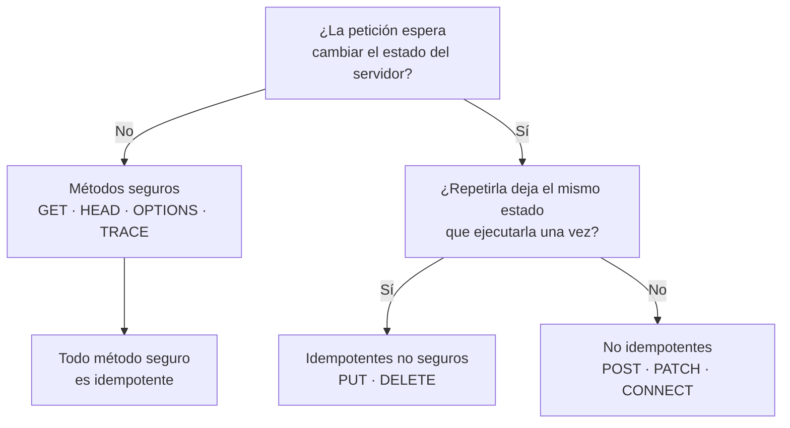

# Métodos HTTP — `TEM-METODOS`

## Resumen ejecutivo

El método de una petición HTTP declara la intención del cliente sobre el recurso identificado por la URI. `N-01` §9 define ocho, y a cada uno le asigna tres propiedades verificables —si es seguro, si es idempotente y si sus respuestas son cacheables— de las que dependen componentes que nadie escribió: el proxy que decide si puede reintentar, la caché que decide si puede almacenar, la biblioteca cliente que decide si un *timeout* admite reintento automático.

Elegir mal el método no rompe nada de inmediato, y por eso la elección se degrada con facilidad. Un `GET` que modifica estado funciona en la primera prueba y falla el día que un *prefetcher* del navegador, un rastreador o una caché intermedia lo invoca sin que nadie lo pidiera. Un `POST` usado para todo funciona siempre, al precio de renunciar a que la infraestructura entienda algo del tráfico.

Este documento es la referencia de la que dependen los demás de [`FAM-HTTP`](README.md). La definición de idempotencia de `N-01` §9.2.2 es la que después habilita el control de concurrencia optimista de [`TEM-IDEM`](Idempotencia-y-Concurrencia.md), y la de cacheabilidad de §9.2.3 es la premisa de [`TEM-CACHE`](Cache-y-Peticiones-Condicionales.md).

---

## Definición

Un método HTTP es un *token* sensible a mayúsculas al comienzo de la línea de petición que indica el propósito de esa petición. `N-01` §9.1 fija el conjunto de métodos registrados; los ocho de §9.3 son los que define el propio documento.

### Las tres propiedades

`N-01` §9.2 define tres propiedades y las define de forma precisa, no aproximada.

**Seguro** (§9.2.1). El método es esencialmente de solo lectura: el cliente no solicita ni espera ningún cambio de estado en el servidor. Que el servidor registre la petición en un log o incremente un contador de visitas no viola la propiedad, porque el cliente no pidió ese efecto ni es responsable de él. Los métodos seguros de `N-01` son `GET`, `HEAD`, `OPTIONS` y `TRACE`.

**Idempotente** (§9.2.2). El efecto sobre el servidor de varias peticiones idénticas sucesivas es el mismo que el de una sola. Son idempotentes los cuatro métodos seguros más `PUT` y `DELETE`. La relación entre ambas propiedades tiene una sola dirección: **todo método seguro es idempotente, y no al revés** —`PUT` es idempotente y no es seguro—.

**Cacheable** (§9.2.3). Las respuestas al método pueden almacenarse para reutilizarse en peticiones posteriores. `GET` y `HEAD` lo son; `POST` solo condicionalmente, cuando la respuesta trae información de frescura explícita.

### Qué no es

La idempotencia de `N-01` **no es una propiedad del código de estado devuelto sino del efecto sobre el estado del servidor**. Es la confusión más frecuente del tema. Que el primer `DELETE` devuelva `204` y el segundo `404` no rompe la idempotencia: el estado resultante —el recurso no está— es idéntico en ambos casos. Discutir si `DELETE` «es idempotente» a partir del código de respuesta es discutir sobre otra cosa.

Tampoco es idempotencia de negocio. Un `POST` que crea una reserva es no idempotente por definición del método, y hacerlo seguro frente a reintentos es un problema de diseño que el protocolo no resuelve; lo trata [`TEM-IDEM`](Idempotencia-y-Concurrencia.md).

Y el método no es la operación de negocio. La correspondencia entre métodos HTTP y operaciones CRUD es una simplificación didáctica útil que se rompe apenas el dominio deja de ser un catálogo: cancelar una reserva no es «borrar» una reserva, y forzar la analogía produce diseños peores. El caso general lo trata [`TEM-ACCIONES`](../20-Diseno-de-Recursos/Operaciones-No-CRUD.md).

---

## Los ocho métodos de `N-01`

La tabla reproduce las propiedades tal como las fija `N-01` §9.2 y §9.3, con la sección de cada método.

| Método | Seguro | Idempotente | Cacheable | Sección |
|---|---|---|---|---|
| `GET` | Sí | Sí | Sí | §9.3.1 |
| `HEAD` | Sí | Sí | Sí | §9.3.2 |
| `POST` | No | No | Solo con frescura explícita | §9.3.3 |
| `PUT` | No | Sí | No | §9.3.4 |
| `DELETE` | No | Sí | No | §9.3.5 |
| `CONNECT` | No | No | No | §9.3.6 |
| `OPTIONS` | Sí | Sí | No | §9.3.7 |
| `TRACE` | Sí | Sí | No | §9.3.8 |

`PATCH` no figura en esa tabla porque no lo define `N-01`: lo define `N-05` (RFC 5789), que declara textualmente que *«PATCH is neither safe nor idempotent»*.



### `GET` — §9.3.1

Solicita una representación del recurso. Es el método sobre el que descansa toda la infraestructura de caché de la web, y el único cuyo mal uso tiene consecuencias fuera del sistema propio: un `GET` con efectos secundarios queda expuesto a los rastreadores, a los aceleradores de navegador y a cualquier intermediario que se sienta autorizado a repetirlo, precisamente porque `N-01` §9.2.1 le garantiza que no pasa nada si lo hace.

### `HEAD` — §9.3.2

Idéntico a `GET` salvo que el servidor no envía el cuerpo. Sirve para consultar metadatos —tamaño, tipo de contenido, validadores— sin transferir la representación. Su utilidad concreta en APIs es modesta y suele resolverse mejor con peticiones condicionales; conviene que exista porque `N-01` lo hace equivalente a `GET`, no porque los clientes lo usen mucho.

### `POST` — §9.3.3

Procesa la representación enviada según la semántica propia del recurso destino. Es el método deliberadamente abierto de la especificación: `N-01` no restringe qué significa procesar, y por eso `POST` es el receptáculo de todo lo que no encaja en los demás. Ni seguro ni idempotente.

Sus usos legítimos en una API son tres: crear un subordinado dentro de una colección, ejecutar una operación de dominio que no es una escritura de recurso, y transportar una consulta cuyos parámetros no caben razonablemente en una URI. Los tres son correctos; el problema aparece cuando `POST` deja de ser el residuo y pasa a ser la regla.

### `PUT` — §9.3.4

Solicita que el estado del recurso destino sea **reemplazado** por el de la representación enviada. La palabra que hace todo el trabajo es reemplazado: `PUT` no fusiona. Un `PUT` con la mitad de los campos deja el recurso con la mitad de los campos, y si la implementación conserva los omitidos está implementando `PATCH` bajo otro nombre y rompiendo la expectativa que la norma crea.

De ese carácter total deriva su idempotencia: enviar la misma representación diez veces deja el recurso en el mismo estado que enviarla una vez.

`PUT` admite crear el recurso cuando la URI no existe todavía, y esa es la diferencia estructural con `POST`: **en `PUT` la URI la elige el cliente; en `POST` la elige el servidor**. La distinción decide el método cuando el identificador es natural —un código de sala, un ISBN— frente a cuando lo genera el sistema.

### `DELETE` — §9.3.5

Pide la eliminación de la asociación entre el recurso y su funcionalidad actual. Es idempotente, y su idempotencia es la que más discusión genera porque se la evalúa mal: la propiedad se predica del estado del servidor tras la repetición, no del código devuelto en cada intento. Ambas conductas de la segunda petición son defendibles: `404`, que informa con precisión que ya no hay recurso, y `204`, que trata la operación como declaración de estado deseado. Esta guía recomienda `404` en `CTX-1` porque es más informativo para un integrador que no puede leer el código, y `204` cuando el consumidor conocido reintenta de forma automática y el `404` le obligaría a un caso especial.

### `CONNECT` — §9.3.6

Establece un túnel hacia el servidor de destino a través del *proxy*. Ni seguro ni idempotente ni cacheable. No interviene en el diseño de APIs: es infraestructura, y la única razón para nombrarlo acá es que forma parte de los ocho.

### `OPTIONS` — §9.3.7

Consulta las opciones de comunicación disponibles para un recurso. Seguro e idempotente, no cacheable. Su presencia en una API suele deberse a CORS, donde el navegador lo emite como *preflight* sin que el diseñador lo haya previsto. Tiene además un uso previsto por `N-05`: la respuesta a `OPTIONS` de un recurso que admite `PATCH` *SHOULD* incluir la cabecera `Accept-Patch` declarando qué formatos de parche acepta.

### `TRACE` — §9.3.8

Solicita un eco de la petición recibida, para diagnóstico de la cadena de intermediarios. Seguro e idempotente. En la práctica se deshabilita por política de seguridad y no cumple ningún rol en el diseño de una API.

---

## `PUT` frente a `POST` frente a `PATCH`

Es la decisión que más veces por día se toma mal, y tiene criterios precisos.

| | `POST` | `PUT` | `PATCH` |
|---|---|---|---|
| Define | `N-01` §9.3.3 | `N-01` §9.3.4 | `N-05` |
| Idempotente | No | Sí | No |
| Quién elige la URI | El servidor | El cliente | Preexistente |
| Alcance de la escritura | Lo que el recurso decida | Reemplazo total | Modificación parcial |
| Cuerpo | Representación a procesar | Representación completa del recurso | **Documento de parche**, no el recurso |

La confusión más costosa no es entre `PUT` y `POST` sino entre `PATCH` y ambos. **El cuerpo de un `PATCH` no es una versión recortada del recurso: es un conjunto de instrucciones de modificación.** Esa es la lectura de `N-05`, y es la que justifica los formatos de `N-06` (JSON Patch, media type `application/json-patch+json`, un array de operaciones) y `N-07` (JSON Merge Patch, `application/merge-patch+json`, donde `null` significa eliminar el miembro). Enviar `{"capacidad": 12}` con `Content-Type: application/json` a un endpoint `PATCH` es una convención de facto muy difundida y no es ninguno de los dos formatos especificados. Los detalles de cada formato los trata [`TEM-PATCH`](../40-Contratos-y-Representaciones/Actualizaciones-Parciales.md).

`N-05` es explícito sobre la no idempotencia de `PATCH`, lo que resulta contraintuitivo para el caso común: reemplazar un campo por un valor fijo sí es idempotente en la práctica. La norma habla del método en general, y hay parches que no lo son —una operación de incremento, o una de `add` sobre un array—. La forma de obtener idempotencia real es combinarlo con `If-Match` y `ETag`, que es exactamente lo que [`TEM-IDEM`](Idempotencia-y-Concurrencia.md) desarrolla.

Un detalle de la ficha de verificación que conviene retener: **la palabra *idempotent* no aparece en `N-07`**. Cualquier afirmación sobre la idempotencia de JSON Merge Patch puede ser verdadera y no puede atribuirse a ese RFC.

Existe además una divergencia entre guías de organización que vale nombrar porque toca directamente esta decisión. `G-02` (Microsoft Graph) prescribe **MUST NOT** usar `PUT` para actualizaciones, y `G-04` AIP-134 (Google) prescribe **SHOULD** preferir `PATCH` sobre `PUT`, con el argumento de que agregar campos nuevos al recurso convierte cada `PUT` de un cliente viejo en un borrado accidental de los campos que no conoce. Son prescripciones de dos organizaciones que coinciden —algo infrecuente— y no son normativas: `N-01` §9.3.4 no desaconseja `PUT`.

---

## Qué método para qué caso

| Situación en el dominio de salas | Método | Razón |
|---|---|---|
| Listar las salas de una sede | `GET /sedes/{id}/salas` | Lectura pura, cacheable |
| Consultar una reserva | `GET /reservas/{id}` | Lectura pura |
| Crear una reserva con identificador generado por el servidor | `POST /reservas` | El servidor elige la URI; devuelve `201` con `Location` |
| Registrar una sala cuyo código lo fija la organización | `PUT /salas/{codigo}` | El cliente conoce la URI antes de crear |
| Reemplazar por completo los datos de una sala | `PUT /salas/{codigo}` | Reemplazo total, idempotente |
| Cambiar solo la capacidad de una sala | `PATCH /salas/{codigo}` | Modificación parcial |
| Eliminar una reserva de prueba | `DELETE /reservas/{id}` | Eliminación, idempotente |
| **Cancelar** una reserva | `POST /reservas/{id}/cancelacion` | No es un borrado: hay transición de estado, reglas de antelación y la reserva sigue existiendo |
| Consultar disponibilidad con veinte filtros | `GET` con query, o `POST` a un recurso de búsqueda si no cabe | El `POST` sacrifica caché e idempotencia; se usa cuando la URI no alcanza |

La fila de la cancelación es la que más enseña. `DELETE /reservas/{id}` describe la desaparición del recurso; una cancelación deja la reserva en el sistema con estado `cancelada`, dispara reglas de negocio y es auditada. Modelarla como borrado obliga después a inventar un `GET` sobre recursos borrados. La alternativa —un subrecurso al que se hace `POST`— la desarrolla [`TEM-ACCIONES`](../20-Diseno-de-Recursos/Operaciones-No-CRUD.md).

---

## Aplicación por escenario

### `ESC-1` — API nueva

La elección de métodos es de las decisiones baratas de tomar bien y caras de revertir: cambiar `POST /obtenerSalas` por `GET /salas` una vez publicado es un cambio rompiente. Lo que conviene fijar antes del primer controlador es la correspondencia entre operaciones del dominio y métodos, incluidas las operaciones que no son CRUD, y la política ante el segundo `DELETE`.

La trampa del escenario es la simétrica de la que enuncia [`MARCO-ESCENARIOS`](../00-Marco-de-Referencia/Escenarios.md): implementar `HEAD`, `OPTIONS` y `PATCH` en todos los recursos porque «la norma los prevé», cuando ningún consumidor los va a llamar. Los métodos se implementan cuando hay caso de uso.

### `ESC-2` — Exposición o migración

Es donde el uso de métodos se degrada con más facilidad, y la razón está en el punto de partida. Un sistema previo con una operación `EjecutarOperacion(codigo, payload)` empuja hacia `POST /api/ejecutar` con un campo `operacion` en el cuerpo, y eso reproduce el modelo anterior sin ninguna de las ventajas de HTTP. Un endpoint SOAP migrado que conserva `POST` para todo es, en el nivel 0 de `O-03`, exactamente lo que era antes.

El trabajo de este escenario consiste en clasificar cada operación del sistema previo en lectura, reemplazo, modificación parcial, creación, eliminación o transición de estado, y recién entonces asignar método. La clasificación es también el mapa recurso ↔ sistema interno que `ESC-2` pide como artefacto de salida.

### `ESC-3` — Evolución en producción

Cambiar el método de una operación publicada rompe a todos sus consumidores sin excepción y sin degradación gradual: no hay cliente que se adapte solo. Corregir un `POST /obtenerSalas` heredado exige publicar `GET /salas` en paralelo, medir el uso del viejo y deprecarlo por el procedimiento de [`TEM-DEPR`](../50-Evolucion-y-Versionado/Deprecacion.md).

Lo que sí se puede hacer sin romper es **agregar** un método a un recurso existente: sumar `PATCH` a un recurso que solo tenía `GET` y `PUT` no afecta a nadie. Y hay una asimetría a tener presente: agregar campos nuevos al recurso convierte los `PUT` de los clientes viejos en borrados silenciosos de esos campos, que es el argumento de `G-04` AIP-134 y una de las pocas formas en que un cambio aditivo rompe.

### `ESC-4` — Evaluación de una API ajena

En `ESC-4a` la verificación es directa: se recorre la especificación operación por operación y se contrasta el método declarado con la semántica que la operación tiene realmente. Los hallazgos típicos son `GET` con efectos, `POST` donde correspondía `PUT`, y `PUT` implementado como fusión parcial —detectable leyendo el código, no la especificación—.

En `ESC-4b` se infiere desde afuera. `OPTIONS` sobre un recurso a veces devuelve `Allow` con los métodos admitidos; probar un método no documentado distingue un `405 Method Not Allowed` —el recurso existe y el método no aplica— de un `404`. La prueba de si un `PUT` reemplaza o fusiona se hace enviando una representación incompleta y volviendo a leer el recurso. Todo eso vale dentro del límite que `ESC-4b` enuncia: con autorización y sin exceder los límites de uso publicados.

### Qué cambia según el contexto

| Contexto | Qué cambia respecto del uso de métodos |
|---|---|
| `CTX-1` pública | El método es parte del contrato publicado y no se cambia. La corrección semántica importa más que en ningún otro contexto porque el integrador no puede preguntar: si el método miente, la API enseña mal |
| `CTX-2` interna | Un método mal elegido se corrige coordinando el despliegue. Lo que no se puede recuperar es la confianza de la infraestructura: un `GET` con efectos rompe igual detrás del *service mesh* |
| `CTX-3` backend de app propia | La tentación es `POST` para todo porque el cliente propio no se queja. El costo aparece con el cliente móvil instalado, que se comporta como `CTX-1` y congela el método elegido |
| `CTX-4` integración | El método lo decide el proveedor. El trabajo propio es saber qué garantías da: si su endpoint de cobro es `POST`, hay que asumir que no es idempotente y resolverlo con [`TEM-IDEM`](Idempotencia-y-Concurrencia.md) |

---

## Ejemplos concretos

Los ejemplos son sintéticos y pertenecen al sistema de reserva de salas descrito en [`MARCO-CONVENCIONES`](../00-Marco-de-Referencia/Convenciones.md).

### Creación con identificador del servidor: `POST`

```http
POST /v1/reservas HTTP/1.1
Host: api.salas.ejemplo.com
Content-Type: application/json

{ "salaId": "a3f1", "desde": "2026-08-03T09:00:00Z", "hasta": "2026-08-03T10:30:00Z" }
```

```http
HTTP/1.1 201 Created
Location: /v1/reservas/9c2b
Content-Type: application/json

{ "id": "9c2b", "salaId": "a3f1", "estado": "confirmada", "desde": "2026-08-03T09:00:00Z", "hasta": "2026-08-03T10:30:00Z" }
```

Repetir esta petición crea una segunda reserva: `POST` no es idempotente por `N-01` §9.2.2, y en este dominio el efecto es visible y molesto.

### Reemplazo con identificador del cliente: `PUT`

```http
PUT /v1/salas/SEDE-NORTE-201 HTTP/1.1
Host: api.salas.ejemplo.com
Content-Type: application/json
If-Match: "8f3c1e"

{ "nombre": "Sala Norte 201", "capacidad": 12, "sedeId": "norte", "equipamiento": ["proyector"] }
```

```http
HTTP/1.1 200 OK
Content-Type: application/json
ETag: "b91d40"

{ "codigo": "SEDE-NORTE-201", "nombre": "Sala Norte 201", "capacidad": 12, "sedeId": "norte", "equipamiento": ["proyector"] }
```

La representación es completa. Si se omitiera `equipamiento`, el recurso debe quedar sin equipamiento: eso es lo que significa reemplazo en `N-01` §9.3.4. El `If-Match` no es parte del método sino de la concurrencia optimista de [`TEM-IDEM`](Idempotencia-y-Concurrencia.md).

### Modificación parcial: `PATCH` con JSON Merge Patch

```http
PATCH /v1/salas/SEDE-NORTE-201 HTTP/1.1
Host: api.salas.ejemplo.com
Content-Type: application/merge-patch+json
If-Match: "b91d40"

{ "capacidad": 14, "equipamiento": null }
```

```http
HTTP/1.1 200 OK
Content-Type: application/json
ETag: "c07a12"

{ "codigo": "SEDE-NORTE-201", "nombre": "Sala Norte 201", "capacidad": 14, "sedeId": "norte" }
```

El `null` de `N-07` elimina el miembro; no lo pone en nulo. Es la fuente de sorpresa más habitual de ese formato y la razón por la que el `Content-Type` no es decorativo: `application/json` y `application/merge-patch+json` piden cosas distintas al mismo endpoint.

### Transición de estado: `POST` a un subrecurso

```http
POST /v1/reservas/9c2b/cancelacion HTTP/1.1
Host: api.salas.ejemplo.com
Content-Type: application/json

{ "motivo": "reunión reprogramada" }
```

```http
HTTP/1.1 409 Conflict
Content-Type: application/problem+json

{ "type": "https://api.salas.ejemplo.com/problemas/cancelacion-fuera-de-plazo",
  "title": "La reserva no admite cancelación",
  "status": 409,
  "detail": "La cancelación requiere 24 horas de antelación; faltan 3." }
```

El código y su elección se justifican en [`TEM-STATUS`](Codigos-de-Estado.md); el formato del cuerpo es `N-04` y lo trata [`TEM-ERR`](../40-Contratos-y-Representaciones/Manejo-de-Errores.md).

### Método no permitido

```http
DELETE /v1/salas/SEDE-NORTE-201/reservas HTTP/1.1
Host: api.salas.ejemplo.com
```

```http
HTTP/1.1 405 Method Not Allowed
Allow: GET, POST
```

`N-01` §15.5.6 exige que la respuesta `405` incluya `Allow` con los métodos admitidos por el recurso. Es un requisito que la mayoría de las implementaciones omite y que en `ESC-4b` resulta de gran utilidad.

### En ASP.NET Core — Minimal APIs

```csharp
var salas = app.MapGroup("/v1/salas");

// GET: seguro, idempotente, cacheable.
salas.MapGet("/{codigo}", async (string codigo, ISalaService svc, CancellationToken ct) =>
{
    var sala = await svc.ObtenerAsync(codigo, ct);
    return sala is null ? Results.NotFound() : Results.Ok(sala);
});

// PUT: reemplazo total. El cuerpo es la representación completa.
salas.MapPut("/{codigo}", async (string codigo, SalaCompleta cuerpo, ISalaService svc, CancellationToken ct) =>
{
    var resultado = await svc.ReemplazarAsync(codigo, cuerpo, ct);
    return resultado.FueCreado
        ? Results.Created($"/v1/salas/{codigo}", resultado.Sala)
        : Results.Ok(resultado.Sala);
});

// POST sobre la colección: el servidor asigna la URI y la devuelve en Location.
var reservas = app.MapGroup("/v1/reservas");

reservas.MapPost("/", async (NuevaReserva cuerpo, IReservaService svc, CancellationToken ct) =>
{
    var creada = await svc.CrearAsync(cuerpo, ct);
    return Results.Created($"/v1/reservas/{creada.Id}", creada);
});

// DELETE: idempotente. Acá se elige 404 en la repetición; ver el criterio del documento.
reservas.MapDelete("/{id}", async (string id, IReservaService svc, CancellationToken ct) =>
    await svc.EliminarAsync(id, ct) ? Results.NoContent() : Results.NotFound());
```

`Results.Created` escribe la cabecera `Location`, que `N-01` §10.2.2 asocia a `201`; hacerlo a mano es una fuente habitual de omisión. La organización del código de endpoints —cuándo Minimal APIs y cuándo controllers— es materia de [`TEM-MINIMAL`](../80-Implementacion-en-NET/Minimal-APIs-y-Controllers.md).

### En ASP.NET Core — controllers

```csharp
[ApiController]
[Route("v1/salas")]
public sealed class SalasController : ControllerBase
{
    private readonly ISalaService _svc;

    public SalasController(ISalaService svc) => _svc = svc;

    [HttpGet("{codigo}")]
    public async Task<ActionResult<SalaDto>> Obtener(string codigo, CancellationToken ct)
        => await _svc.ObtenerAsync(codigo, ct) is { } sala ? Ok(sala) : NotFound();

    [HttpPut("{codigo}")]
    public async Task<ActionResult<SalaDto>> Reemplazar(
        string codigo, SalaCompleta cuerpo, CancellationToken ct)
    {
        var r = await _svc.ReemplazarAsync(codigo, cuerpo, ct);
        return r.FueCreado ? CreatedAtAction(nameof(Obtener), new { codigo }, r.Sala) : Ok(r.Sala);
    }

    // OPTIONS declarando el formato de parche aceptado, según N-05.
    [HttpOptions("{codigo}")]
    public IActionResult Opciones(string codigo)
    {
        Response.Headers.Allow = "GET, PUT, PATCH, DELETE, OPTIONS";
        Response.Headers["Accept-Patch"] = "application/merge-patch+json, application/json-patch+json";
        return NoContent();
    }
}
```

---

## Preguntas guía

- Para cada endpoint de mi API, ¿la propiedad de seguridad e idempotencia que `N-01` §9.2 le atribuye al método coincide con lo que el código realmente hace?
- ¿Algún `GET` de mi API cambia estado? ¿Lo verifiqué o lo supongo?
- Mi `PUT`, ¿reemplaza o fusiona? Si fusiona, ¿por qué no es `PATCH`?
- ¿El cuerpo de mis `PATCH` es un documento de parche con su media type, o una representación recortada con `application/json`?
- Cuando el cliente reintenta un `POST` tras un *timeout*, ¿qué pasa? ¿Y quién lo decidió?
- ¿Qué devuelve el segundo `DELETE` sobre el mismo recurso, y esa decisión está documentada?
- ¿Cuántas de mis operaciones son `POST` porque corresponde y cuántas porque nadie las clasificó?

---

## Criterios de calidad

Una aplicación buena de esta materia se reconoce por tres cosas. Los métodos seguros no tienen efectos, verificado y no supuesto. `PUT` reemplaza de verdad y `PATCH` recibe un documento de parche con su media type declarado. Las operaciones que no son CRUD tienen un modelado explícito y no se disfrazan de `DELETE` o de `PUT`.

### Antipatrones

**`POST` para todo.** El endpoint único que recibe un campo `operacion` en el cuerpo, o la familia `POST /obtenerSalas`, `POST /crearReserva`, `POST /borrarReserva`. Es el nivel 0 de `O-03` con sintaxis HTTP, y renuncia a caché, a reintentos seguros, a `405`, a `Allow` y a que cualquier intermediario entienda el tráfico. Aparece casi siempre en `ESC-2`, arrastrado desde el sistema anterior.

**`GET` que modifica.** `GET /reservas/9c2b/cancelar` es el caso clásico. Viola `N-01` §9.2.1 y el daño no es teórico: cualquier componente autorizado a repetir un `GET` —caché, *prefetcher*, rastreador, botón de recargar— ejecuta la cancelación. Es el único antipatrón de esta lista con consecuencias fuera del propio sistema.

**`PUT` que fusiona.** Implementar `PUT` conservando los campos omitidos parece amable con el cliente y rompe la garantía de `N-01` §9.3.4. Además hace indistinguibles «no envié el campo» y «quiero borrar el campo», que es justamente la distinción que `N-07` resuelve con `null`.

**`PATCH` sin media type de parche.** Aceptar `application/json` en un `PATCH` es convención de facto, no formato especificado. Es aceptable si se declara como tal en la especificación; deja de serlo cuando el consumidor asume `N-06` y el servidor espera otra cosa.

**Verbos en la URI.** `POST /reservas/9c2b/actualizarEstado` pone en la ruta lo que el método ya expresa. La regla y sus excepciones legítimas —las transiciones de estado que son recursos— las trata [`TEM-URI`](../20-Diseno-de-Recursos/Nomenclatura-de-URIs.md).

**`DELETE` con cuerpo semántico.** `N-01` §9.3.5 no le asigna significado definido al cuerpo de un `DELETE`, y hay intermediarios que lo descartan. Un `DELETE` cuyo comportamiento depende de lo que lleve en el cuerpo funciona hasta que aparece el primer *proxy*.

**Cancelar borrando.** Modelar una transición de estado como `DELETE` porque «el usuario ve que desaparece» acopla la API a la pantalla, que es el riesgo dominante de `CTX-3`, y deja sin lugar a la reserva cancelada que sigue existiendo.

---

## Anexo — Lista de verificación por endpoint

```yaml
endpoint: ""                        # p. ej. POST /v1/reservas
metodo: GET | HEAD | POST | PUT | PATCH | DELETE | OPTIONS

# Propiedades declaradas por N-01 §9.2 para este método
seguro_segun_norma: si | no
idempotente_segun_norma: si | no
cacheable_segun_norma: si | no | solo-con-frescura

# Verificación contra la implementación real
efectos_secundarios_reales: ""      # vacío obligatorio si seguro_segun_norma = si
repeticion_verificada: si | no      # se ejecutó dos veces y se comparó el estado
codigo_en_repeticion: ""            # qué devuelve el segundo intento

# Solo para PUT
reemplaza_totalmente: si | no       # "no" significa que es un PATCH mal etiquetado

# Solo para PATCH
media_type_de_parche: "application/json-patch+json | application/merge-patch+json | otro"
declarado_en_openapi: si | no
accept_patch_en_options: si | no

# Contrato
allow_en_405: si | no
location_en_201: si | no | no-aplica
documentado_en_openapi: si | no
```

La fila `repeticion_verificada` es la que más defectos descubre. La idempotencia de `N-01` §9.2.2 es una afirmación sobre el comportamiento del sistema, no sobre la anotación del método, y solo se comprueba ejecutando.
