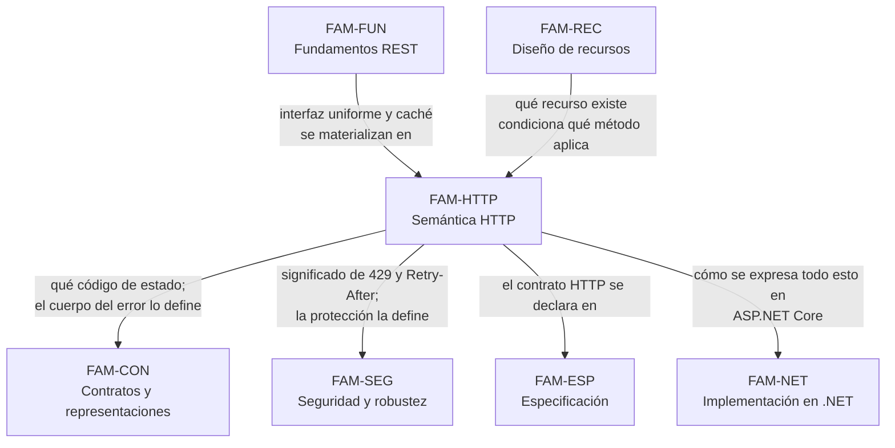

# Semántica HTTP — `FAM-HTTP`

## La pregunta que responde esta familia

**¿Qué significa cada pieza del protocolo y cómo se usa bien?**

Es la familia con más respaldo normativo de toda la guía, y la diferencia es de naturaleza, no de grado. Dónde va la versión de una API o cómo se nombra un campo son decisiones donde compiten guías corporativas que se contradicen entre sí; qué significa `PUT`, qué garantiza la idempotencia y cuándo corresponde `412` está escrito en documentos con estatus de Internet Standard. `N-01` (RFC 9110, STD 97) y `N-02` (RFC 9111, STD 98) resuelven la enorme mayoría de las discusiones de esta familia por lectura directa.

Que exista la norma no significa que se la conozca. El material sobre APIs sigue citando masivamente RFC 2616 y RFC 7231 para semántica HTTP, dos documentos obsoletos —el segundo desde junio de 2022—, y con ellos arrastra nombres de códigos que cambiaron y un modelo de caché que se reescribió. La contracara también aparece: se atribuye a `N-01` cosas que no están ahí, empezando por `429 Too Many Requests`, que define `N-03` (RFC 6585). Buena parte del valor de esta familia consiste en saber qué documento dice qué.

Hay además un territorio genuinamente no normativo dentro del tema, y esta familia lo señala en lugar de disimularlo: la cabecera `Idempotency-Key` es convención de facto sostenida por Stripe (`P-04`) sobre un draft IETF que **expiró sin llegar a RFC** (`F-01`), y los campos `RateLimit` de `F-02` siguen siendo un Internet-Draft con fecha de expiración.

---

## Documentos

| Documento | ID | Qué establece |
|---|---|---|
| [Métodos](Metodos.md) | `TEM-METODOS` | Los ocho métodos de `N-01` §9.3 con su tabla de propiedades —seguro, idempotente, cacheable—; `PUT` frente a `POST` y a `PATCH`; qué método corresponde a cada caso |
| [Códigos de estado](Codigos-de-Estado.md) | `TEM-STATUS` | Catálogo por clase de los códigos que importan en una API; los renombres de `N-01`; las distinciones que más se erran: `400`/`422`, `401`/`403`, `404`/`403`, `409`/`412`, `500`/`503` |
| [Cabeceras y negociación](Cabeceras-y-Negociacion.md) | `TEM-HEADERS` | Negociación de contenido (`N-01` §12), `Vary`, `Location`, `Link` (`N-10`) y el registro de relaciones (`N-11`), cabeceras personalizadas y `Retry-After` |
| [Caché y peticiones condicionales](Cache-y-Peticiones-Condicionales.md) | `TEM-CACHE` | `N-02` completo: directivas de `Cache-Control`, frescura y validación, `ETag` fuerte y débil, `304`, y por qué la caché HTTP se usa poco en APIs |
| [Idempotencia y concurrencia](Idempotencia-y-Concurrencia.md) | `TEM-IDEM` | Idempotencia del protocolo frente a idempotencia de negocio, `Idempotency-Key` como convención de facto, concurrencia optimista con `If-Match` y `412`, actualización perdida |

El orden de lectura es el de la tabla. [`TEM-METODOS`](Metodos.md) fija las propiedades de las que todo lo demás depende —sin la definición de idempotencia de `N-01` §9.2.2 no se entiende ni `412` ni `Idempotency-Key`—, [`TEM-STATUS`](Codigos-de-Estado.md) es la referencia de consulta que más se vuelve a abrir, y los tres restantes desarrollan mecanismos que se apoyan en los dos primeros.

---

## Cómo se relaciona con las demás familias

Dos aristas necesitan aclaración porque marcan fronteras de responsabilidad que esta familia respeta de forma estricta.

**Hacia [`FAM-CON`](../40-Contratos-y-Representaciones/README.md).** El reparto es limpio: acá se decide **qué código de estado** corresponde a cada situación; el **formato del cuerpo** de la respuesta de error lo trata [`TEM-ERR`](../40-Contratos-y-Representaciones/Manejo-de-Errores.md) con `N-04` (RFC 9457, que obsoleta RFC 7807). Cuando [`TEM-STATUS`](Codigos-de-Estado.md) dice «`422` con detalle de los campos ofensores», la forma de ese detalle no se define acá. Lo mismo con `PATCH`: [`TEM-METODOS`](Metodos.md) explica la semántica del método según `N-05`, y los formatos de parche —`N-06` JSON Patch, `N-07` JSON Merge Patch— los desarrolla [`TEM-PATCH`](../40-Contratos-y-Representaciones/Actualizaciones-Parciales.md).

**Hacia [`FAM-SEG`](../70-Seguridad-y-Robustez/README.md).** El *rate limiting* aparece en dos documentos con preguntas distintas. Acá interesa qué significa `429` —y que lo define `N-03`, no `N-01`— y cómo se comunica la espera con `Retry-After`. Cómo se dimensiona un límite, dónde se aplica y qué protege es materia de [`TEM-PROT`](../70-Seguridad-y-Robustez/Proteccion-y-Limites.md). La filtración de información por diferencias entre `404` y `403` se enuncia acá como criterio de elección de código y se desarrolla como problema de seguridad allá.

---

## Qué se lleva el lector de esta familia

Poder resolver por lectura de norma discusiones que habitualmente se resuelven por opinión. La pregunta «¿`DELETE` de algo que ya no existe devuelve `404` o `204`?» tiene una parte con respuesta normativa —`DELETE` es idempotente según `N-01` §9.2.2, y la idempotencia se predica del efecto sobre el servidor, no del código devuelto— y una parte que es criterio de diseño. Distinguir las dos partes es la habilidad central.

Saber detectar una cita muerta a simple vista. Un texto que llame `422` «Unprocessable Entity», `413` «Request Entity Too Large» o que atribuya `429` a RFC 9110 está trabajando con material anterior a junio de 2022 o con material que nunca verificó su fuente.

Reconocer dónde termina lo normativo. `Idempotency-Key` y los campos `RateLimit` son las dos zonas donde el tema aparenta tener estándar y no lo tiene; usar ambas cosas es perfectamente razonable, y presentarlas como estándar no lo es.

---

## Advertencia sobre las fuentes de esta familia

Todas las afirmaciones normativas de estos cinco documentos se citan con identificador y sección exacta, en la forma «`N-01` §9.2.2», según prescribe [`MARCO-CONVENCIONES`](../00-Marco-de-Referencia/Convenciones.md). Las secciones que la verificación de [`ANEXO-REFERENCIAS`](../99-Anexos/Referencias.md) no consultó individualmente —el caso de `N-01` §10.2.3 para `Retry-After`— se marcan en el texto donde aparecen. Un lector que necesite apoyarse en ellas para una decisión de contrato debe abrir el RFC.
