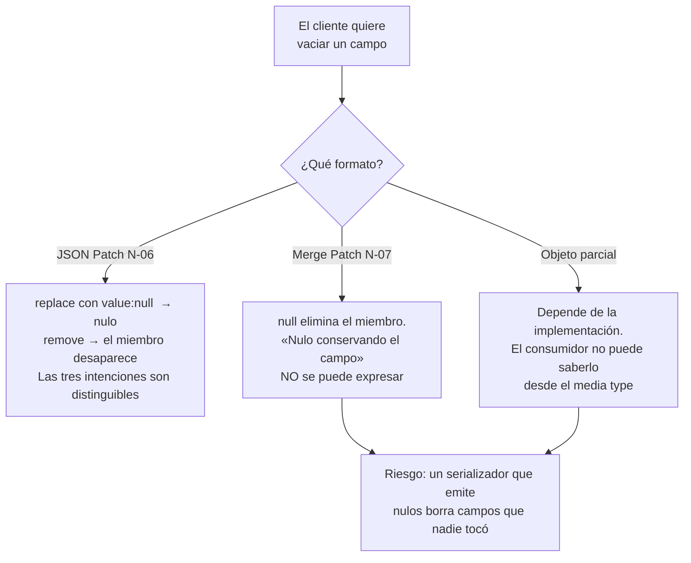

# Actualizaciones parciales — `TEM-PATCH`

## Resumen ejecutivo

Modificar un campo de un recurso que tiene veinte parece la operación más simple del catálogo y es la que más especificaciones distintas tiene detrás. `N-05` (RFC 5789) define el método `PATCH` y deliberadamente **no** define qué se manda en el cuerpo: delega el formato en el media type. Los dos formatos registrados que existen —`N-06` (JSON Patch) y `N-07` (JSON Merge Patch)— tienen semánticas distintas, media types distintos y modos de falla distintos.

Es el tema mejor especificado de esta familia y uno de los peor implementados. Lo que se encuentra en producción, con abrumadora frecuencia, es un `PATCH` que recibe un objeto JSON parcial con `Content-Type: application/json` y aplica los campos presentes: ninguno de los tres RFC lo describe, funciona razonablemente, y arrastra un problema concreto que este documento desarrolla —la imposibilidad de distinguir «poné este campo en nulo» de «no toques este campo»— y que en el dominio de reserva de salas se manifiesta el día que alguien quiere borrar las notas de una reserva.

Le sirve a `ACT-01`, que elige el formato, y a `ACT-02`, que descubre al implementarlo que la elección determina cómo se valida la petición.

---

## Definición

Una actualización parcial es una petición que modifica un subconjunto del estado de un recurso existente, describiendo el cambio en lugar del resultado.

**Qué problema resuelve.** Tres, y conviene tenerlos separados porque no todos los formatos los resuelven igual. Reduce el volumen que el cliente debe enviar, lo que importa en clientes móviles. Evita que el cliente tenga que conocer y reenviar campos que no le interesan, incluidos los que se agregaron a la API después de que él se escribió. Y reduce la ventana de pérdida de actualizaciones concurrentes: dos clientes que modifican campos distintos del mismo recurso no se pisan si cada uno manda solo el suyo, mientras que con reemplazo total el segundo revierte el cambio del primero.

**Qué no es.** No es una operación de negocio. Cancelar una reserva no es «poner el campo estado en cancelada»: es una transición con reglas —antelación mínima, permisos, efectos sobre la seña— y modelarla como un `PATCH` del campo `estado` traslada al cliente la responsabilidad de saber qué transiciones existen y deja la regla sin lugar donde vivir. Dónde va esa operación lo trata [`TEM-ACCIONES`](../20-Diseno-de-Recursos/Operaciones-No-CRUD.md).

Tampoco es un método idempotente. `N-05` lo dice sin rodeos: *«PATCH is neither safe nor idempotent»*. Se puede volver idempotente en la práctica combinándolo con `If-Match` y una `ETag`, que es el mecanismo que trata [`TEM-IDEM`](../30-Semantica-HTTP/Idempotencia-y-Concurrencia.md); la propiedad no viene con el método.

**Con qué se lo confunde.** Con `PUT`. El punto siguiente lo desarrolla porque la confusión es la fuente del defecto más caro del tema.

---

## `PUT` frente a `PATCH`

`PUT` reemplaza la representación completa del recurso por la que viaja en el cuerpo. Su consecuencia práctica es la que se pasa por alto: **lo que no está en el cuerpo se borra**. Un cliente que envía un `PUT` con cinco campos sobre un recurso que tiene veinte está pidiendo, según la semántica del método, que los otros quince desaparezcan.

Google (`G-04`) AIP-134 formula el riesgo de evolución con precisión: **debería** usarse `PATCH` y no `PUT`, porque con `PUT` agregar campos nuevos al recurso provoca el borrado accidental de los que el cliente no conoce. Un cliente escrito contra la versión que tenía quince campos sigue mandando quince; el día que la API agrega el decimosexto, cada `PUT` de ese cliente lo borra silenciosamente. Graph (`G-02`) llega más lejos y declara **MUST NOT** usar `PUT` para actualizaciones.

Es una de las pocas áreas de acuerdo entre Google y Microsoft, y contradice frontalmente la enseñanza REST de manual, donde `PUT` es el verbo canónico de modificación.

| | `PUT` | `PATCH` |
|---|---|---|
| Semántica | Reemplaza la representación completa | Aplica un cambio descrito |
| Campos ausentes | Se borran | No se tocan (según el formato) |
| Idempotente | Sí, según `N-01` §9.2.2 | No, según `N-05` |
| Riesgo de evolución | Alto: un campo nuevo se borra sin aviso | Bajo |
| Postura de las guías | `G-02` **MUST NOT**; `G-04` AIP-134 **SHOULD NOT** | Preferido por ambas |
| Cuándo sirve | Recursos chicos y completamente conocidos por el cliente; carga de un documento entero | El caso general |

**Esta guía recomienda `PATCH` como verbo de modificación** y reserva `PUT` para dos casos donde su semántica de reemplazo es exactamente lo que se quiere: recursos cuya representación es un valor único y completo —el contenido de un archivo adjunto, un documento de configuración que se edita entero— y creación con identificador elegido por el cliente, donde el reemplazo total es trivialmente correcto porque no había nada.

---

## Los dos formatos de parche

`N-05` define el método y remite el formato al media type de la petición. La cabecera `Content-Type` deja de ser un detalle administrativo y pasa a ser lo que determina cómo se interpreta el cuerpo. `N-05` define además la cabecera de respuesta **`Accept-Patch`**, que **debería** aparecer en la respuesta a un `OPTIONS` sobre un recurso que admite el método, y que es el mecanismo por el cual un cliente descubre qué formatos acepta el servidor.

### JSON Patch — `N-06`

Media type **`application/json-patch+json`**. El documento es un **array de operaciones** que se aplican en secuencia.

| `op` | Miembros requeridos |
|---|---|
| `add` | `op`, `path`, `value` |
| `remove` | `op`, `path` |
| `replace` | `op`, `path`, `value` |
| `move` | `op`, `path`, `from` |
| `copy` | `op`, `path`, `from` |
| `test` | `op`, `path`, `value` |

Los miembros `path` y `from` son JSON Pointer, definido en RFC 6901, que las fichas de esta guía **no verificaron** y que por lo tanto no se cita como respaldo de ninguna afirmación sobre su sintaxis.

Lo que JSON Patch resuelve y el otro formato no: distingue explícitamente las tres intenciones que se confunden. `{"op":"replace","path":"/notas","value":null}` pone el campo en nulo; `{"op":"remove","path":"/notas"}` lo elimina; no mencionar `/notas` lo deja intacto. Permite operar sobre posiciones de un array sin reemplazarlo entero. Y la operación `test` habilita una precondición dentro del propio documento: el parche falla si el valor no es el esperado, lo que da una forma de concurrencia optimista a nivel de campo que la `ETag` no ofrece.

Lo que cuesta: es verboso, es incómodo de escribir a mano, y su validación no es la del recurso sino la del documento de parche, lo que significa que las anotaciones de validación del modelo no se aplican solas. Y su expresividad es también su superficie de riesgo: `move` y `copy` sobre rutas arbitrarias permiten manipulaciones que el diseñador del endpoint no anticipó, de modo que un servidor sensato acota qué rutas admite.

### JSON Merge Patch — `N-07`

Media type **`application/merge-patch+json`**. El documento tiene la misma forma que el recurso; los miembros presentes se aplican, los ausentes se dejan.

La regla que define el formato y que produce su limitación central: **`null` significa eliminar el miembro** correspondiente del destino. No hay forma de decir «poné este campo en nulo conservándolo», porque `null` ya está tomado.

La segunda limitación es sobre arrays. `N-07` establece que **no se puede parchear parcialmente un array**: los arrays se reemplazan enteros. La cita del RFC es *«is not possible to patch part of a target that is not an object»*. Agregar un equipamiento a la lista de una reserva exige enviar la lista completa, con todo lo que eso implica sobre concurrencia.

Una precisión de citación que las fichas verificaron sobre el texto completo: **la palabra «idempotent» no aparece en RFC 7396**. Afirmaciones sobre la idempotencia de JSON Merge Patch pueden ser correctas y **no pueden atribuirse a ese RFC**. Es un error de cita frecuente y fácil de detectar.

### El tercer formato, el que se usa

Un objeto JSON parcial con `Content-Type: application/json`. No está en ningún RFC. Es indistinguible de JSON Merge Patch en la mayoría de los casos, con dos diferencias que importan: no declara su semántica en el media type, de modo que el consumidor no puede saber qué significa un `null` sin leer la documentación; y como no la declara, distintos endpoints de la misma API pueden interpretarlo distinto sin que nada lo delate.

Esta guía no lo recomienda, y lo registra porque es lo que el lector va a encontrar y probablemente lo que ya tiene escrito. Migrar de él a `application/merge-patch+json` es barato cuando la semántica de `null` que la implementación ya tiene coincide con la de `N-07`, y es un cambio rompiente cuando no coincide.

### Comparación

| | JSON Patch (`N-06`) | JSON Merge Patch (`N-07`) | Objeto parcial |
|---|---|---|---|
| Media type | `application/json-patch+json` | `application/merge-patch+json` | `application/json` |
| Forma | Array de operaciones | Igual que el recurso | Igual que el recurso |
| Poner en `null` | `replace` con `value: null` | **Imposible**: `null` elimina | Ambiguo, depende de la implementación |
| Eliminar un miembro | `remove` | `null` | Ambiguo |
| Arrays | Por posición | Reemplazo total | Reemplazo total |
| Precondición interna | `test` | No | No |
| Legibilidad | Baja | Alta | Alta |
| Validación del modelo | No aplica directamente | Aplica sobre el resultado | Aplica sobre el resultado |
| Riesgo | Expresividad no acotada | Borrado accidental por `null` | Semántica no declarada |

---

## El problema del nulo

Es la dificultad estructural del tema y no la resuelve del todo ningún formato.

Un cliente quiere borrar las notas de una reserva. Manda `{"notas": null}`. Bajo `N-07` eso elimina el miembro, que es lo que quería. Ahora otro cliente quiere modificar solo el estado y su serializador emite todos los campos, incluidos los que no tocó, y los nulos entre ellos: `{"estado":"confirmada","notas":null}` borra las notas sin que nadie lo haya pedido. El mismo cuerpo expresa una intención deliberada y un accidente, y el servidor no puede distinguirlos.



Las salidas practicables son tres. Usar JSON Patch cuando la distinción importa de verdad, que es la respuesta correcta y la más cara. Configurar el cliente para que omita los nulos al serializar, que en .NET es `JsonIgnoreCondition.WhenWritingNull` y que resuelve el accidente sin resolver la imposibilidad de expresar la intención. O aceptar que en esta API «vaciar» y «eliminar» son la misma cosa, documentarlo y no sufrir, que es lo que la mayoría hace y lo que **esta guía recomienda** cuando el recurso no tiene campos donde la diferencia sea observable.

En .NET hay un mecanismo que expresa la distinción en el tipo, disponible desde que el compilador reconoce `JsonElement` o mediante un envoltorio propio del estilo `Opcional<T>` con tres estados —ausente, presente con valor, presente con nulo—. Cuesta más de lo que parece: contamina el modelo de contrato y hay que enseñarle a la especificación OpenAPI qué significa. Esta guía lo recomienda solo cuando un campo concreto tiene la distinción como requisito del dominio, y no como política general.

---

## Qué se usa en la práctica

Las fichas de evidencia de esta guía verificaron la postura de las guías de organización y **no verificaron** el formato de parche que usan las plataformas grandes. Lo que se puede afirmar con respaldo es acotado y conviene decirlo así:

- Graph (`G-02`) declara **MUST NOT** usar `PUT` para actualizaciones; el verbo es `PATCH`.
- Google (`G-04`) AIP-134 **debería** usar `PATCH` y no `PUT`, y su mecanismo de parcialidad no es ninguno de los dos formatos IETF sino un **`update_mask`** de tipo `FieldMask` que viaja en la petición, con una regla explícita: si la máscara se omite, el servicio **debe** tratarla como equivalente a todos los campos poblados. Es un tercer modelo, incompatible con `N-06` y `N-07`.
- JSON:API (`F-04`) usa `PATCH`.
- Zalando (`G-05`) no aporta una prescripción de formato de parche en lo verificado por las fichas.

Que qué media type de parche sirve cada plataforma grande no esté verificado es, en sí, un dato útil: **no hay evidencia recogida por esta guía de adopción amplia de `application/json-patch+json` ni de `application/merge-patch+json` en APIs públicas de escala**. Quien necesite decidir apoyándose en la conducta de la industria tiene que verificarlo por su cuenta; este documento no lo afirma en ninguna dirección.

---

## Aplicación por escenario

### `ESC-1` — API nueva

La elección del formato es una de las que el escenario clasifica como caras de revertir, porque cambiar el media type de parche de una API publicada rompe a todos los clientes que ya lo emiten. Lo que sí se puede postergar es soportar un segundo formato: aceptar `application/merge-patch+json` desde el día uno y agregar `application/json-patch+json` cuando aparezca un caso que lo pida es compatible, porque el media type discrimina.

El criterio de esta guía para `ESC-1`: **`PATCH` con `application/merge-patch+json`** como opción por defecto, documentando explícitamente qué significa `null`; y `PUT` solo para los dos casos de reemplazo genuino. Declarar el media type desde el principio cuesta lo mismo que no declararlo y evita el problema de un `application/json` cuya semántica nadie fijó.

### `ESC-2` — Exposición o migración

El sistema previo suele tener una operación de actualización que recibe el registro completo y lo reemplaza, con todos los campos obligatorios. Exponerla tal cual produce un `PUT` con las consecuencias de evolución que AIP-134 describe, y en un sistema en crecimiento eso significa borrados silenciosos cada vez que se agrega una columna.

En la variante de migración desde SOAP aparece un caso propio y frecuente: el servicio viejo tiene una operación de actualización por cada campo —`ActualizarEstado`, `ActualizarNotas`, `ActualizarAsistentes`—. La traducción directa produce endpoints con verbo en la URI, que es la trampa que el escenario advierte; la traducción correcta es un solo `PATCH` sobre el recurso, salvo que alguna de esas operaciones sea en realidad una transición de negocio con reglas, y entonces le corresponde su propio tratamiento en [`TEM-ACCIONES`](../20-Diseno-de-Recursos/Operaciones-No-CRUD.md).

### `ESC-3` — Evolución en producción

Migrar de `PUT` a `PATCH` sobre una API con consumidores no es un cambio rompiente si se sostienen ambos métodos: son verbos distintos sobre la misma ruta y pueden coexistir. Es de las pocas correcciones de diseño de la guía que se pueden hacer sin versionar, y por eso conviene hacerla apenas se detecta.

Lo que sí rompe: cambiar el media type que el endpoint acepta, cambiar la interpretación de `null`, y —el más sutil— agregar un campo obligatorio al recurso. Ese último merece atención porque interactúa con este tema de forma no obvia: un `PATCH` que no menciona el campo nuevo deja el recurso sin él, y si la validación exige que esté, todas las peticiones de parche de los clientes viejos empiezan a fallar aunque el campo no tenga nada que ver con lo que están modificando.

### `ESC-4` — Evaluación de una API ajena

Tres pruebas. Un `OPTIONS` sobre el recurso, para ver si aparece `Accept-Patch`: `N-05` dice que **debería** estar y su ausencia es lo normal, de modo que su presencia indica que alguien leyó el RFC. Un `PATCH` con `application/json-patch+json` sobre una API que documenta objetos parciales, para ver si responde `415 Unsupported Media Type` —correcto— o si intenta aplicarlo —revelador—. Y un `PATCH` con un campo en `null`, sobre un recurso de prueba, para determinar experimentalmente si borra, si vacía o si ignora.

Esa tercera prueba es la más informativa del tema y la única forma de conocer la semántica cuando la documentación no la declara, que es la mayoría de las veces. En `ESC-4b` conviene registrarla como observación con su fecha, no como contrato.

### Qué cambia según el contexto

| Contexto | Qué cambia en este tema |
|---|---|
| `CTX-1` pública | La semántica de `null` es contrato y hay que documentarla explícitamente, porque un integrador no puede leer el código para averiguarla. JSON Patch es más defendible acá, donde el consumidor es un programa y la verbosidad no molesta |
| `CTX-2` interna | Se puede elegir el formato más simple y corregirlo coordinando. Conviene igual declarar el media type: cuando el equipo rota, la semántica no documentada se pierde |
| `CTX-3` backend de app propia | La reducción de volumen importa de verdad en clientes móviles. El riesgo propio es el serializador del cliente que emite nulos por todos los campos que la pantalla no tocó, y borra la mitad del recurso |
| `CTX-4` integración | El formato lo impone el proveedor. Un proveedor que acepta `PUT` únicamente obliga a leer el recurso antes de modificarlo, con la ventana de concurrencia que eso abre; conviene resolverla con `If-Match` si el proveedor lo soporta |

---

## Ejemplos concretos

Ejemplos **sintéticos** del dominio de reserva de salas.

### JSON Merge Patch

```http
PATCH /v1/reservas/r-3391 HTTP/1.1
Host: api.salas.ejemplo.com
Content-Type: application/merge-patch+json
If-Match: "8f3c1e"

{
  "asistentesEsperados": 15,
  "requiereProyector": true
}
```

```http
HTTP/1.1 200 OK
Content-Type: application/json
ETag: "b21d09"

{
  "id": "r-3391",
  "estado": "confirmada",
  "asistentesEsperados": 15,
  "requiereProyector": true,
  "notas": "Traer adaptador HDMI",
  "equipamientoSolicitado": ["pizarra"]
}
```

El `If-Match` con la `ETag` que el cliente obtuvo al leer es lo que hace segura una operación que `N-05` declara no idempotente: si otro cliente modificó el recurso en el intervalo, el servidor responde `412 Precondition Failed` y no aplica nada. El mecanismo lo trata [`TEM-IDEM`](../30-Semantica-HTTP/Idempotencia-y-Concurrencia.md).

Devolver el recurso completo en la respuesta es criterio de esta guía: le ahorra al cliente una lectura y le entrega la `ETag` nueva. `204 No Content` es igualmente correcto y las fuentes consultadas no prescriben ninguno de los dos.

### El nulo que borra

```http
PATCH /v1/reservas/r-3391 HTTP/1.1
Content-Type: application/merge-patch+json

{ "notas": null, "equipamientoSolicitado": ["pizarra", "proyector"] }
```

Bajo `N-07`, el miembro `notas` desaparece del recurso y el array de equipamiento se reemplaza **entero**: la operación no agrega «proyector» a la lista, la sustituye. Si otro cliente agregó un elemento entre la lectura y la escritura, ese elemento se pierde. Es la limitación de arrays de `N-07` en su manifestación práctica, y el `If-Match` es lo único que la detecta.

### JSON Patch, cuando la distinción importa

```http
PATCH /v1/reservas/r-3391 HTTP/1.1
Content-Type: application/json-patch+json
If-Match: "8f3c1e"

[
  { "op": "test",    "path": "/estado", "value": "confirmada" },
  { "op": "replace", "path": "/asistentesEsperados", "value": 15 },
  { "op": "add",     "path": "/equipamientoSolicitado/-", "value": "proyector" },
  { "op": "remove",  "path": "/notas" }
]
```

Cuatro cosas que Merge Patch no puede expresar. La operación `test` aborta el parche completo si la reserva ya no está confirmada, que es una precondición sobre el contenido y no sobre la versión. El `add` sobre `/equipamientoSolicitado/-` agrega al final del array sin reemplazarlo. Y `remove` sobre `/notas` elimina el miembro de forma explícita, distinguible de haberlo puesto en nulo.

Si la operación `test` falla:

```http
HTTP/1.1 409 Conflict
Content-Type: application/problem+json

{
  "type": "https://api.salas.ejemplo.com/problemas/precondicion-de-parche",
  "title": "La precondición del parche no se cumple",
  "status": 409,
  "detail": "La operación 'test' sobre /estado esperaba 'confirmada' y encontró 'cancelada'.",
  "operacionFallida": 0
}
```

`N-05` enumera entre los códigos aplicables 204, 400, 404, 409, 412, 415 y 422. La elección concreta para cada caso la trata [`TEM-STATUS`](../30-Semantica-HTTP/Codigos-de-Estado.md); el miembro `operacionFallida` es una extensión de `N-04` §3.2 y su forma es criterio propio de esta guía.

### Media type no soportado

```http
PATCH /v1/reservas/r-3391 HTTP/1.1
Content-Type: application/json-patch+json
```

```http
HTTP/1.1 415 Unsupported Media Type
Accept-Patch: application/merge-patch+json
Content-Type: application/problem+json

{
  "type": "https://api.salas.ejemplo.com/problemas/formato-de-parche",
  "title": "Formato de parche no soportado",
  "status": 415,
  "detail": "Este recurso acepta application/merge-patch+json."
}
```

La cabecera `Accept-Patch` de `N-05` en la respuesta de error le dice al cliente qué debería haber mandado, sin que tenga que abrir la documentación.

### Implementación en ASP.NET Core

Merge patch con un tipo que distingue los tres estados de cada campo:

```csharp
// Sintético. 'Opcional<T>' distingue ausente / presente-con-valor / presente-en-null.
public readonly struct Opcional<T>
{
    public bool Presente { get; }
    public T? Valor { get; }
    private Opcional(T? valor) { Presente = true; Valor = valor; }
    public static Opcional<T> De(T? valor) => new(valor);
    public static Opcional<T> Ausente => default;
}

public sealed record ParcheReserva(
    Opcional<int> AsistentesEsperados,
    Opcional<bool> RequiereProyector,
    Opcional<string?> Notas,                       // el T anidado nullable transporta el null explícito
    Opcional<IReadOnlyList<string>> EquipamientoSolicitado);

app.MapPatch("/v1/reservas/{id}", async Task<Results<Ok<ReservaDto>, NotFound, ProblemHttpResult>> (
    string id,
    ParcheReserva parche,
    [FromHeader(Name = "If-Match")] string? etag,
    ReservasDbContext db,
    CancellationToken ct) =>
{
    var reserva = await db.Reservas.FindAsync([id], ct);
    if (reserva is null) return TypedResults.NotFound();

    if (etag is not null && etag != reserva.VersionComoETag())
        return TypedResults.Problem(
            title: "El recurso cambió desde la última lectura",
            statusCode: StatusCodes.Status412PreconditionFailed);

    if (parche.AsistentesEsperados.Presente)
        reserva.AsistentesEsperados = parche.AsistentesEsperados.Valor;
    if (parche.RequiereProyector.Presente)
        reserva.RequiereProyector = parche.RequiereProyector.Valor;
    if (parche.Notas.Presente)
        reserva.Notas = parche.Notas.Valor;         // null explícito llega hasta acá

    // La validación se corre sobre el resultado, no sobre el parche.
    if (reserva.AsistentesEsperados > reserva.Sala.Capacidad)
        return TypedResults.Problem(
            type: "https://api.salas.ejemplo.com/problemas/capacidad-excedida",
            title: "La sala no admite esa cantidad de asistentes",
            detail: $"La sala {reserva.SalaId} admite {reserva.Sala.Capacidad} personas.",
            statusCode: StatusCodes.Status422UnprocessableEntity);

    await db.SaveChangesAsync(ct);
    return TypedResults.Ok(ReservaDto.Desde(reserva));
})
.Accepts<ParcheReserva>("application/merge-patch+json");
```

Dos decisiones cargan el peso. El tipo `Opcional<T>` es lo que permite que «no mandó el campo» y «mandó el campo en nulo» lleguen distintos al *handler*; sin él, ambos casos son un `null` en la propiedad y la información se perdió antes de que el código pudiera mirarla. Y la validación se ejecuta **sobre el recurso resultante**, no sobre el documento de parche: la regla de capacidad depende de campos que el parche no tocó, y validar solo lo enviado la dejaría sin evaluar.

El tipo `Opcional<T>` requiere un convertidor de `System.Text.Json` que lo mapee, y su declaración correcta en la especificación OpenAPI exige un *transformer* de esquema. Ese trabajo es real y es la razón por la que esta guía no recomienda el patrón como política general. La mecánica de ambas cosas la tratan [`TEM-SERIAL`](../80-Implementacion-en-NET/Serializacion-Con-System-Text-Json.md) y [`TEM-OPENAPI`](../60-Especificacion-y-Documentacion/OpenAPI.md); la forma exacta de los ejemplos de este documento no se verificó contra el SDK.

---

## Preguntas guía

- ¿Mi endpoint de modificación es `PUT` o `PATCH`? Si es `PUT`, ¿qué pasa el día que agregue un campo al recurso?
- ¿Qué media type acepta mi `PATCH`, y está declarado en la especificación o es `application/json` por omisión?
- Si un cliente manda un campo en `null`, ¿qué hace mi API? ¿Alguien lo decidió o es lo que salió?
- ¿Puede un cliente distinguir «vaciar el campo» de «no tocarlo»? ¿Necesita distinguirlo?
- ¿Cómo se agrega un elemento a un array sin reemplazarlo entero, y qué pasa si dos clientes lo hacen a la vez?
- ¿Mi validación corre sobre el parche o sobre el recurso resultante? ¿Hay reglas que involucren campos que el parche no tocó?
- ¿Un `PATCH` sin `If-Match` está permitido? ¿Qué pierdo si lo está?

---

## Criterios de calidad

Una actualización parcial está bien resuelta cuando el media type declara la semántica del cuerpo, cuando el cliente puede expresar exactamente su intención sobre cada campo, cuando la validación evalúa el estado resultante y no el fragmento enviado, y cuando dos modificaciones concurrentes sobre campos distintos no se pisan.

### Antipatrones

**`PUT` como método general de modificación.** Cada campo que se agregue al recurso lo borran los clientes viejos, en silencio. Es lo que `G-02` prohíbe y `G-04` AIP-134 desaconseja.

**`PATCH` con `application/json` y semántica no declarada.** El consumidor no puede saber qué hace un `null` sin preguntar, y distintos endpoints de la misma API pueden hacer cosas distintas sin que nada lo delate.

**Atribuirle idempotencia a `N-07`.** La palabra no aparece en RFC 7396. La afirmación puede ser cierta y la cita es falsa.

**Validar el parche en lugar del resultado.** Deja sin evaluar toda regla que involucre campos no enviados. La regla de capacidad del ejemplo es exactamente ese caso: nadie mandó la sala y la sala determina si el número de asistentes es válido.

**`PATCH` sin concurrencia optimista.** El método no es idempotente y el recurso es compartido. Sin `If-Match`, dos clientes se pisan y ninguno se entera.

**El parche que dispara una transición de negocio.** `{"estado":"cancelada"}` como forma de cancelar deja la regla de antelación sin lugar donde vivir y le pide al cliente que sepa qué transiciones existen.

**Aceptar rutas arbitrarias en JSON Patch.** `move` y `copy` sobre cualquier ruta del documento es más expresividad de la que el endpoint necesita y más superficie de la que nadie revisó.

**El cliente que serializa nulos.** No es un defecto de la API y la API lo padece: un cliente cuyo serializador emite todos los campos borra, bajo `N-07`, todo lo que no completó la pantalla. Vale advertirlo en la documentación del endpoint.

---

## Anexo — Ficha de decisión de modificación parcial

Se completa por recurso modificable. La aprueba `ACT-01` y la verifica `ACT-04` con peticiones reales, no leyendo el código.

```yaml
recurso: ""                          # ruta

verbo: PATCH | PUT | ambos
justificacion_si_PUT: ""             # obligatoria; ver G-02 y G-04 AIP-134

formato:
  media_type: application/merge-patch+json | application/json-patch+json | application/json
  declarado_en_openapi: si | no
  accept_patch_en_OPTIONS: si | no    # N-05 dice SHOULD; su ausencia es lo habitual

semantica_del_null:
  significado: elimina-el-miembro | pone-en-null | rechazado
  documentado_publicamente: si | no
  cliente_puede_distinguir_vaciar_de_no_tocar: si | no

arrays:
  conducta: reemplazo-total | por-posicion
  operacion_de_agregado_sin_reemplazo: ""   # cómo, o "no existe"

concurrencia:
  if_match_soportado: si | no
  if_match_obligatorio: si | no
  codigo_ante_conflicto: 412 | 409

validacion:
  se_ejecuta_sobre: recurso-resultante | documento-de-parche
  reglas_que_involucran_campos_no_enviados: []

campos_no_parcheables: []            # id, creadaEn, estado si tiene transiciones propias
transiciones_de_negocio_excluidas: []  # las que van por TEM-ACCIONES, no por PATCH
```

Las dos filas decisivas son `cliente_puede_distinguir_vaciar_de_no_tocar` y `se_ejecuta_sobre`. La primera obliga a mirar de frente el problema del nulo en lugar de descubrirlo cuando un usuario reporta que se le borraron las notas; la segunda es la que más veces está mal y la que produce defectos que ninguna prueba unitaria del *handler* encuentra, porque la regla que quedó sin evaluar involucra datos que el caso de prueba no envió.
