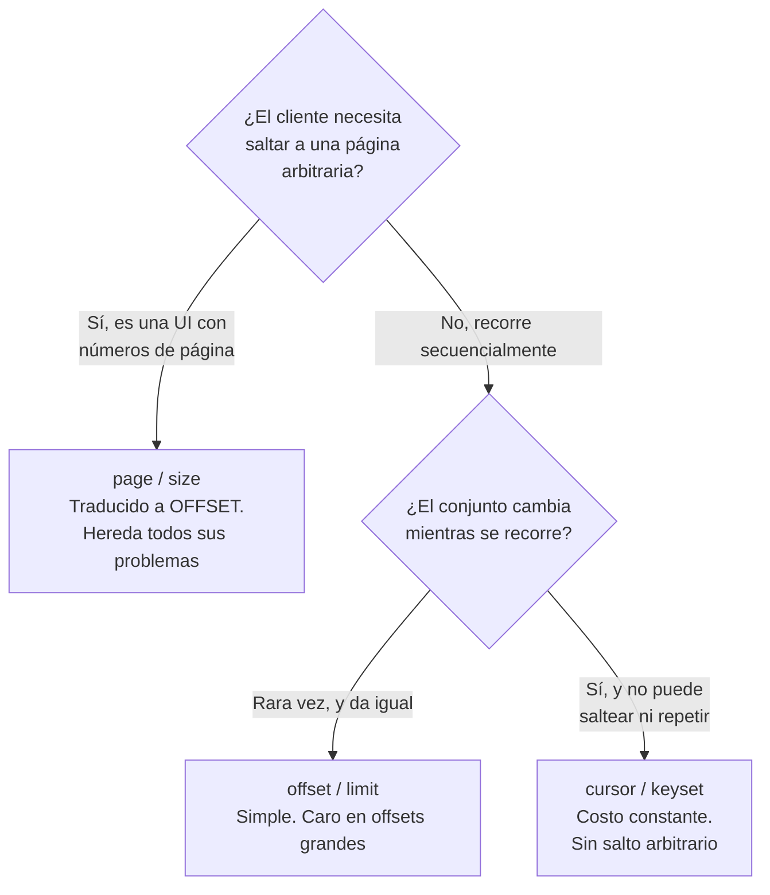

# Colecciones y paginación — `TEM-PAG`

## Resumen ejecutivo

Una colección sin paginación es una bomba de tiempo con retardo variable: funciona durante toda la etapa de desarrollo, durante las pruebas y durante los primeros meses de producción, y falla el día que un cliente con dos años de historia pide sus reservas. No falla con un error claro; falla con una respuesta de veinte megabytes, un tiempo de espera agotado en el cliente móvil y una consulta que deja la base de datos ocupada mientras el resto de los usuarios espera.

Todas las guías consultadas coinciden en que las colecciones deben paginarse —Zalando lo declara **MUST** en su regla 159, Google lo estructura en AIP-158, Microsoft lo prescribe en sus dos guías vivas— y no coinciden en absolutamente nada más. Los nombres de los parámetros no convergen ni siquiera dentro de Microsoft, donde Azure usa `skip` y `top` y Graph usa `$skip` y `$top`. El enlace a la página siguiente vive en una cabecera estándar en GitHub y en el cuerpo en Azure, JSON:API y Stripe.

Este documento separa lo que tiene sustento técnico —el costo del `OFFSET` grande y la inconsistencia ante datos que cambian, ambos documentados en `O-05`— de lo que es preferencia de organización, que es casi todo el resto.

---

## Definición

Paginar es partir la respuesta a una petición de colección en fragmentos de tamaño acotado y darle al consumidor un mecanismo para recorrer los fragmentos restantes. La decisión abarca tres cosas: la forma del cuerpo que transporta un fragmento, los parámetros con que el consumidor pide el siguiente, y dónde viaja el enlace o el cursor que se lo permite.

**Qué problema resuelve.** Acota el trabajo del servidor y el volumen de la respuesta a algo predecible. La palabra clave es *predecible*: sin paginación el costo de una petición depende de datos que el productor no controla, y una API cuyo peor caso es desconocido no se puede dimensionar ni proteger.

**Qué no es.** No es filtrado. Paginar reduce el tamaño de la respuesta sin cambiar el conjunto de resultados; filtrar cambia el conjunto. Se combinan constantemente y se deciden por separado; el filtrado lo trata [`TEM-FILTRO`](Filtrado-Orden-y-Seleccion.md). Tampoco es control de uso: un límite de peticiones por minuto protege al servidor de un consumidor abusivo, la paginación lo protege del tamaño de sus propios datos. Los límites los trata [`TEM-PROT`](../70-Seguridad-y-Robustez/Proteccion-y-Limites.md).

**Con qué se lo confunde.** Con la paginación de una interfaz de usuario. La numeración de páginas que ve el usuario final es una decisión de presentación; la paginación de la API es una decisión de transporte, y la mejor opción para una no siempre sirve para la otra. Un cursor opaco es excelente para un recorrido secuencial e inútil para pintar los botones «1 2 3 … 47», y ese conflicto concreto es el que determina buena parte de las elecciones reales.

---

## La forma de una colección

Un array desnudo en la raíz del cuerpo no tiene dónde poner la información de paginación, y esa es la razón por la que casi ninguna API grande lo usa:

```json
[ { "id": "r-3391" }, { "id": "r-3392" } ]
```

Las estructuras verificadas en las fuentes son cuatro, y difieren en el nombre del miembro que contiene los elementos y en dónde ponen la navegación.

| Fuente | Miembro con los elementos | Navegación | Total |
|---|---|---|---|
| Azure (`G-01`) | `value` | Campo `nextLink` en el cuerpo, URL absoluta | No prescrito en lo verificado |
| Graph (`G-02`) | Colección OData | `nextLink`, **MUST** | — |
| Google (`G-04`) AIP-132 | Campo repetido, **debería** ser el primero, número de campo 1 | `next_page_token` | `total_size`, opcional |
| JSON:API (`F-04`) | `data` | Objeto `links` con `first`, `last`, `prev`, `next` | En `meta` |
| Stripe (`P-03`) | `data` | `has_more` booleano; el cliente construye con el último `id` | No lo devuelve |

Stripe (`P-03`) es el caso más instructivo porque su objeto de lista lleva `object: "list"`, `url`, `has_more` y `data`, y **no incluye un campo `next`**: el consumidor arma la petición siguiente pasando el identificador del último elemento recibido. Es una decisión que traslada trabajo al cliente a cambio de no exponer una URL que el servidor tendría que sostener.

Azure aporta un detalle operativo que rara vez se cita y que vale para cualquier esquema: **el campo `nextLink` se omite en la última página en lugar de enviarse con valor `null`**. El propósito es que un cliente descuidado no interprete la presencia del campo como invitación a pedir una página más. La misma guía exige que el `nextLink` sea una URL absoluta y que incluya el parámetro `api-version`, porque un enlace que el cliente debe completar deja de ser un enlace.

**Esta guía recomienda** un cuerpo con forma de objeto, un miembro con los elementos y un miembro con la información de navegación, y desaconseja el array desnudo por una razón de evolución antes que de estética: pasar de array desnudo a objeto envuelto es un cambio rompiente para todos los consumidores, de modo que empezar sin envoltorio compromete la única decisión que después no se puede corregir barato.

---

## Las tres estrategias



### Offset y límite

El consumidor pide «los veinte elementos a partir del número doscientos». Se traduce directamente a `OFFSET`/`LIMIT` en SQL o a `Skip`/`Take` en LINQ, es trivial de implementar y de explicar, y tiene dos defectos que están documentados con fuente.

**El costo crece con el desplazamiento.** Winand (`O-05`) lo formula sin ambigüedad: *«the database must still fetch these rows from the disk and bring them in order before it can send the following ones»*. Para servir la página que empieza en el elemento cien mil, el motor produce y ordena cien mil veinte filas y descarta cien mil. El trabajo es proporcional al desplazamiento y no al tamaño de la página, de modo que el tiempo de respuesta de una API empeora exactamente donde el usuario ya se estaba impacientando.

**El resultado se desplaza cuando los datos cambian.** El mismo autor describe el fenómeno: si entre dos peticiones se inserta una fila que ordena antes que la posición actual, todo el conjunto se corre y **una fila ya vista reaparece** en la página siguiente. Con un borrado ocurre lo simétrico y una fila **se saltea sin que nadie se entere**. En el dominio de reserva de salas esto no es teórico: un listado de reservas ordenado por fecha de creación, en un sistema donde se crean reservas todo el tiempo, produce duplicados y omisiones en cualquier recorrido que dure más de unos segundos.

Winand agrega un dato sobre el estado de la práctica que conviene retener: sostiene que la paginación por keyset es *«even faster than offset»* y que la barrera principal a su adopción no es la técnica sino **el soporte de los frameworks**.

### Página y tamaño

Es la misma estrategia con otra aritmética: `page=5&per_page=20` equivale a un desplazamiento de ochenta. Hereda íntegramente los dos problemas anteriores y agrega uno propio, que es que el número de página es una referencia a una posición en un conjunto que puede haber cambiado.

Su ventaja es real y es la razón por la que sobrevive: es la única de las tres que permite saltar a una página arbitraria, y una interfaz con botones numerados no se puede construir sin ella.

### Cursor y keyset

El consumidor no dice «a partir del elemento doscientos» sino «a partir de este elemento». Winand (`O-05`) describe la implementación en una frase: *«just use a where clause that selects only data you haven't seen yet»*, usando las mismas columnas por las que se ordena. Con un índice sobre esas columnas, el motor se posiciona directamente y el costo de cada página es el mismo, sin importar cuán adentro del conjunto esté.

Google (`G-04`) AIP-158 lo lleva a su forma más estricta: el `page_token` **debe** ser una cadena opaca —aunque segura para URL— y **no debe** ser interpretable por el usuario. La opacidad no es capricho: si el cliente no puede construir un token, el servidor puede cambiar el mecanismo interno sin romper a nadie. AIP-158 fija además que ni `page_size` ni `page_token` pueden ser obligatorios, que un `page_size` negativo produce `INVALID_ARGUMENT`, que un valor por encima del máximo **debería** reducirse en lugar de rechazarse, y que al llegar al final `next_page_token` **debe** quedar vacío.

Stripe (`P-03`) implementa la estrategia sin la opacidad: sus cursores `starting_after` y `ending_before` toman el **identificador de un objeto**, no un token cifrado. Es más simple de depurar y acopla el cursor al orden por creación, que es el único que Stripe ofrece en ese recorrido.

El costo de la estrategia es el que la hace inviable en algunos casos: **no permite saltar**. No hay forma de pedir la página cuarenta y siete sin recorrer las cuarenta y seis anteriores. Y exige un orden total: si dos elementos comparten el valor de la columna de orden, el cursor necesita un desempate estable —habitualmente el identificador— o vuelve a saltear y repetir.

---

## Qué usa realmente cada plataforma

La brecha entre lo que las guías prescriben y lo que las plataformas grandes hacen es, en este tema, considerable.

| Plataforma | Estrategia | Parámetros exactos | Dónde va el «siguiente» |
|---|---|---|---|
| **Stripe** (`P-03`) | Cursor puro | `limit` (por defecto **10**, rango **1–100**), `starting_after`, `ending_before`, mutuamente excluyentes | En el cuerpo: `has_more` booleano, sin campo `next` |
| **GitHub** (`P-06`) | Página y tamaño, con cursor en algunos endpoints | `page`, `per_page`; `before`/`after`/`since` en endpoints puntuales | **Cabecera `link`** de `N-10`, con `rel="prev"`, `"next"`, `"first"`, `"last"` |
| **Azure** (`G-01`) | Opaca, con offset del lado cliente | `skip` (por defecto 0), `top` (mínimo 1), `maxpagesize` | Campo `nextLink` en el cuerpo, URL absoluta, omitido en la última página |
| **Graph** (`G-02`) | Server-driven | `$top`, `$skip` (**SHOULD**), `$skiptoken` (**MAY**) | `nextLink`, **MUST** |
| **Google** (`G-04`) AIP-158 | Cursor opaco | `page_size`, `page_token` | `next_page_token`, vacío al final |
| **Zalando** (`G-05`) | Ambivalente | Regla 137 lista `offset`, `limit`, `cursor` | Regla 161: enlaces de paginación (**SHOULD**) |
| **JSON:API** (`F-04`) | Agnóstica | Familia `page[...]`, el servidor define los miembros | Objeto `links` con `first`, `last`, `prev`, `next` |

Dos observaciones se sostienen sobre esta tabla y ninguna es cómoda para el material divulgativo del tema.

**La plataforma más citada como ejemplar usa el esquema que las guías desaconsejan.** GitHub sigue exponiendo `page` y `per_page` en la mayoría de sus endpoints, y agregó cursores solo en algunos. Zalando recomienda cursor en su regla 160 —*«prefer cursor-based pagination, avoid offset-based pagination»*— y en la 137 estandariza los nombres `offset` y `limit`; es una ambivalencia interna de la propia guía.

**El estándar del enlace tiene poca adopción.** `N-10` (RFC 8288) define la cabecera `Link` y `N-11` registra las relaciones necesarias. GitHub la usa. Azure, JSON:API y Stripe ponen la navegación en el cuerpo. La prescripción «usá `Link`» describe lo que una minoría hace.

Hay una lectura que sí puede sacarse de todo esto y que es de las pocas cosas que hipermedia ganó de forma inequívoca: **el enlace de paginación es el único elemento hipermedia que la industria adoptó de verdad**. Sobrevivió porque resuelve un problema concreto —que el cliente no tenga que construir cursores a mano— y no porque nadie lo haya prescrito. Lo desarrolla [`TEM-HATEOAS`](../10-Fundamentos-REST/Hipermedia.md).

---

## Dónde va el enlace: cabecera o cuerpo

| | Cabecera `Link` (`N-10`) | Campo en el cuerpo |
|---|---|---|
| Respaldo | Normativo. `N-10` define la sintaxis, `N-11` registra `next`, `prev`, `first`, `last` | Ninguno. Convención por guía |
| Contamina el contrato del cuerpo | No | Sí: el consumidor debe conocer la forma del envoltorio |
| Legible en una herramienta de exploración | Requiere mirar cabeceras | Inmediato |
| Accesible desde JavaScript en el navegador | Solo si CORS expone la cabecera | Siempre |
| Sobrevive a un proxy que reescribe cabeceras | Riesgo real | Sí |
| Quién lo usa | GitHub (`P-06`) | Azure (`G-01`), JSON:API (`F-04`), Stripe (`P-03`), Google (`G-04`) |

El punto de CORS es el que más decide en la práctica y el que menos aparece en las comparaciones: una aplicación de navegador no lee una cabecera de respuesta que el servidor no haya declarado expuesta, de modo que la opción normativamente mejor fundada exige una configuración adicional que se olvida y produce un cliente que no encuentra la página siguiente sin ningún mensaje de error.

**Esta guía recomienda el cuerpo** para el consumo programático habitual, y agregar la cabecera `Link` cuando el consumidor es un navegador que ya sabe interpretarla o cuando la API aspira a que herramientas genéricas la recorran. Es criterio propio y va contra el respaldo normativo; la justificación es que el cuerpo es la única de las dos opciones que ningún intermediario altera y que ninguna configuración olvida exponer.

---

## Totales, y por qué son caros

Un campo `total` con la cantidad de elementos del conjunto completo es lo primero que pide todo consumidor y lo que más cuesta servir.

Con offset, obtenerlo exige una segunda consulta con `COUNT`, que en un motor relacional sobre un conjunto grande recorre el índice entero. El costo es del orden del tamaño del conjunto, no de la página, y se paga en cada petición aunque el consumidor solo mire la primera página. Con cursor, además, el total es conceptualmente incómodo: la estrategia existe justamente para no recorrer el conjunto.

Las fuentes son coherentes con esa dificultad. Google (`G-04`) AIP-132 declara `total_size` **opcional**. Stripe (`P-03`) no lo devuelve en absoluto: entrega `has_more`, que responde la única pregunta que el recorrido necesita —¿queda algo?— a costo constante. En lo verificado de `G-01` no figura una prescripción de total.

**Esta guía recomienda** no devolver el total por defecto; ofrecer `has_more` o equivalente, que es lo que el recorrido realmente necesita; y cuando el total sea un requisito de producto, exponerlo bajo un parámetro explícito —del estilo `incluirTotal=true`— para que el consumidor que no lo necesita no pague su costo, documentando que la respuesta con total es más lenta. Un total aproximado y declarado como aproximado es una tercera opción legítima cuando el uso es informativo.

---

## Aplicación por escenario

### `ESC-1` — API nueva

Es una de las decisiones que el escenario clasifica como caras de postergar. Una colección publicada sin paginación no se puede paginar después sin romper: agregar un límite por defecto cambia el resultado de una petición que antes devolvía todo, y un consumidor que asumía completitud empieza a procesar datos parciales sin darse cuenta. Es el peor modo de falla posible, porque no produce error.

El criterio de esta guía para `ESC-1`: **toda colección nace paginada**, con un tamaño por defecto y un máximo, aunque en el momento de escribirla tenga tres elementos. La decisión entre offset y cursor sí se puede postergar si los parámetros elegidos no comprometen —y ahí hay una asimetría útil: una API que nació con `limit` más un cursor opaco puede cambiar el mecanismo interno del cursor sin tocar el contrato, mientras que una que nació con `page` y `per_page` quedó atada a la aritmética de desplazamiento.

### `ESC-2` — Exposición o migración

El sistema previo casi nunca pagina, y la operación que se está exponiendo suele ser un procedimiento que devuelve un conjunto completo. Aparece la tentación de envolverlo tal cual y paginar en memoria dentro del servicio: funciona, cuesta lo mismo que no paginar, y traslada el problema a un lugar donde es menos visible.

La variante de migración trae un problema específico: si la API anterior devolvía la colección entera, sus consumidores dependen de esa completitud. Paginar en la migración es un cambio de contrato y hay que tratarlo como tal, no como detalle de implementación.

### `ESC-3` — Evolución en producción

Reducir el tamaño de página por defecto de cien a veinte, para bajar la carga, es rompiente en los hechos aunque el esquema no cambie: un cliente que procesaba la primera página y suponía que ahí estaba todo pasa a procesar un quinto de los datos, en silencio. El camino compatible es sostener el valor por defecto histórico, publicar el nuevo como opción, medir el uso y cambiar el defecto solo cuando el uso del viejo llegue a cero. `TEM-BREAK` lo desarrolla.

Introducir un cursor junto al offset existente es de los pocos cambios francamente compatibles del tema, porque el parámetro nuevo es opcional y el viejo se sostiene. Es la ruta habitual de migración y la que GitHub siguió.

### `ESC-4` — Evaluación de una API ajena

La primera prueba en `ESC-4b` es pedir una colección sin parámetros y mirar cuántos elementos vuelven: si vuelven todos, la API no pagina y ese es un hallazgo de primer orden. La segunda es pedir un tamaño de página absurdo —diez mil— y ver si la API lo acota, lo rechaza o lo obedece; obedecer es el peor de los tres resultados y revela que no hay máximo.

La tercera prueba es la que más información da sobre la calidad del diseño: recorrer dos páginas seguidas mientras se crean elementos y comprobar si aparecen duplicados. Es la manifestación observable del *drifting* que describe `O-05`, y responde sin ver el código si la estrategia es de desplazamiento.

En `ESC-4a`, con la especificación a la vista, la pregunta es si el tamaño máximo de página está declarado y si el comportamiento ante un valor fuera de rango está especificado. Suele no estarlo, y suele ser el punto donde la implementación y la especificación divergen.

### Qué cambia según el contexto

| Contexto | Qué cambia en este tema |
|---|---|
| `CTX-1` pública | El tamaño máximo de página es también una medida de protección, y conviene publicarlo junto con los límites de uso. `ACT-07` interviene acá. La estabilidad del esquema de paginación es contrato: cambiar el nombre de un parámetro rompe |
| `CTX-2` interna | Se puede elegir la estrategia por caso de uso real, porque los consumidores son conocidos. El riesgo propio es el opuesto: como cambiar es barato, cada servicio inventa su convención y la organización termina con cinco esquemas |
| `CTX-3` backend de app propia | La necesidad de la interfaz decide. Una lista con desplazamiento infinito pide cursor; una tabla con números de página pide `page` y `size`. Con un cliente móvil instalado, el esquema queda congelado como en `CTX-1` |
| `CTX-4` integración | El esquema lo impone el proveedor y hay que consumirlo, incluidos sus defectos. El trabajo de diseño es la capa que lo aísla: un iterador propio que oculte si por debajo hay cursor u offset, para que cambiar de proveedor no toque el dominio |

---

## Ejemplos concretos

Ejemplos **sintéticos** del dominio de reserva de salas. No reproducen ninguna API en producción.

### Cursor, la forma que esta guía recomienda

```http
GET /v1/salas/s-auditorio-norte/reservas?limite=20&desde=2026-08-01 HTTP/1.1
Host: api.salas.ejemplo.com
Accept: application/json
```

```http
HTTP/1.1 200 OK
Content-Type: application/json

{
  "datos": [
    { "id": "r-3391", "inicioLocal": "2026-08-14T09:00:00", "estado": "confirmada" },
    { "id": "r-3392", "inicioLocal": "2026-08-14T11:00:00", "estado": "pendiente" }
  ],
  "hayMas": true,
  "cursorSiguiente": "eyJpIjoiMjAyNi0wOC0xNFQxMTowMCIsImlkIjoici0zMzkyIn0"
}
```

La petición siguiente repite todos los criterios y agrega el cursor:

```http
GET /v1/salas/s-auditorio-norte/reservas?limite=20&desde=2026-08-01&cursor=eyJpIjoiMjAyNi0wOC0xNFQxMTowMCIsImlkIjoici0zMzkyIn0 HTTP/1.1
Host: api.salas.ejemplo.com
```

La última página omite `cursorSiguiente`, siguiendo el criterio de Azure de no enviar el campo con `null`:

```json
{
  "datos": [ { "id": "r-3410", "inicioLocal": "2026-08-31T16:00:00", "estado": "confirmada" } ],
  "hayMas": false
}
```

El cursor del ejemplo codifica el par ordenado por el que se recorre —instante de inicio e identificador como desempate— y es opaco para el consumidor, como pide `G-04` AIP-158. Que sea decodificable por quien se tome el trabajo no es un problema de seguridad si no contiene nada sensible, pero sí es una invitación a que un cliente lo construya a mano, y por eso el contrato debe declararlo explícitamente como opaco.

### Un tamaño de página fuera de rango

```http
GET /v1/reservas?limite=5000 HTTP/1.1
```

```http
HTTP/1.1 200 OK
Content-Type: application/json

{
  "datos": [ … 100 elementos … ],
  "hayMas": true,
  "cursorSiguiente": "…",
  "avisos": [
    { "codigo": "limite_reducido", "detalle": "El máximo es 100. Se aplicó 100." }
  ]
}
```

Reducir en lugar de rechazar es lo que **debería** hacerse según `G-04` AIP-158. El campo `avisos` es criterio propio de esta guía y no está en ninguna fuente: la alternativa —reducir en silencio— deja al consumidor creyendo que pidió cinco mil y recibió cien porque no había más.

Un valor negativo sí se rechaza, con el cuerpo de error que fija [`TEM-ERR`](Manejo-de-Errores.md):

```http
HTTP/1.1 400 Bad Request
Content-Type: application/problem+json

{
  "type": "https://api.salas.ejemplo.com/problemas/parametro-invalido",
  "title": "Parámetro de consulta inválido",
  "status": 400,
  "detail": "El parámetro 'limite' debe ser un entero entre 1 y 100.",
  "errores": [ { "parametro": "limite", "detalle": "Se recibió -5." } ]
}
```

### La cabecera `Link`, como la usa GitHub

```http
HTTP/1.1 200 OK
Content-Type: application/json
Link: <https://api.salas.ejemplo.com/v1/reservas?pagina=3&tamano=20>; rel="next",
      <https://api.salas.ejemplo.com/v1/reservas?pagina=1&tamano=20>; rel="first",
      <https://api.salas.ejemplo.com/v1/reservas?pagina=47&tamano=20>; rel="last"
Access-Control-Expose-Headers: Link
```

La última cabecera es la que se olvida y sin la cual un cliente de navegador no ve nada. Las relaciones usadas son las de `N-11`; `N-10` define el registro y la sintaxis de la cabecera, no todos los nombres de relación.

### Implementación por keyset en ASP.NET Core

```csharp
// Sintético. Recorrido por (inicioLocal, id) — el id desempata instantes iguales.
app.MapGet("/v1/salas/{salaId}/reservas", async (
    string salaId,
    string? cursor,
    int? limite,
    ReservasDbContext db,
    CancellationToken ct) =>
{
    const int LimiteMaximo = 100;
    var tamano = Math.Clamp(limite ?? 20, 1, LimiteMaximo);   // coerción, no rechazo

    var consulta = db.Reservas
        .Where(r => r.SalaId == salaId)
        .OrderBy(r => r.InicioLocal)
        .ThenBy(r => r.Id);                                    // orden total: sin esto el cursor saltea

    if (Cursor.TryDecodificar(cursor, out var ultimo))
    {
        consulta = consulta.Where(r =>
            r.InicioLocal > ultimo.InicioLocal ||
            (r.InicioLocal == ultimo.InicioLocal && string.Compare(r.Id, ultimo.Id) > 0));
    }

    // Se pide uno de más para saber si hay página siguiente sin ejecutar un COUNT.
    var pagina = await consulta.Take(tamano + 1).ToListAsync(ct);
    var hayMas = pagina.Count > tamano;
    if (hayMas) pagina.RemoveAt(tamano);

    return TypedResults.Ok(new PaginaDto<ReservaDto>(
        Datos: pagina.Select(ReservaDto.Desde).ToList(),
        HayMas: hayMas,
        CursorSiguiente: hayMas ? Cursor.Codificar(pagina[^1]) : null));
});

// El campo se omite del JSON cuando es null, siguiendo el criterio de G-01.
public sealed record PaginaDto<T>(
    IReadOnlyList<T> Datos,
    bool HayMas,
    [property: JsonIgnore(Condition = JsonIgnoreCondition.WhenWritingNull)] string? CursorSiguiente);
```

Tres detalles cargan el peso del ejemplo. El `ThenBy` sobre el identificador convierte el orden en total, y sin él dos reservas con el mismo instante de inicio se saltean o se repiten. Pedir un elemento de más resuelve `hayMas` sin la consulta de conteo que haría cara la respuesta. Y el `JsonIgnoreCondition.WhenWritingNull` es lo que materializa la omisión del campo en la última página en lugar del `null`.

La comparación de cadenas dentro de una expresión LINQ traducida a SQL depende del proveedor y de la intercalación configurada; el ejemplo es ilustrativo del patrón y no una implementación validada contra un motor concreto.

---

## Preguntas guía

- ¿Todas mis colecciones tienen tamaño máximo de página, y está publicado en la especificación?
- Si un consumidor no manda ningún parámetro, ¿qué recibe? ¿Está documentado?
- ¿Qué pasa si alguien recorre mi colección mientras otro inserta elementos? ¿Puedo demostrar que no se saltean ni se repiten?
- ¿Cuánto tarda la petición de la página mil comparada con la de la primera?
- ¿Devuelvo un total? ¿Alguien lo usa, o lo devuelvo porque parecía obvio?
- Si mañana cambio el mecanismo interno del cursor, ¿rompo a alguien? ¿O algún cliente lo está construyendo a mano porque no era opaco?
- ¿El enlace a la página siguiente lo puede leer una aplicación de navegador, o quedó en una cabecera que CORS no expone?

---

## Criterios de calidad

Una colección está bien paginada cuando el peor caso de una petición es acotado y conocido, cuando el consumidor puede recorrer el conjunto entero sin recibir duplicados ni omisiones aunque los datos cambien durante el recorrido, y cuando el mecanismo se puede reemplazar internamente sin tocar el contrato.

### Antipatrones

**La colección sin límite.** El caso base. Funciona en desarrollo, en pruebas y durante meses de producción; el modo de falla es un tiempo de espera agotado con la base de datos ocupada.

**El límite sin techo.** `?limite=1000000` obedecido es equivalente a no tener límite, con el agravante de que alguien creyó haberlo resuelto.

**El total en cada respuesta.** Una consulta de conteo sobre el conjunto entero por cada página, para un dato que la mayoría de los consumidores no mira.

**Offset sobre datos que cambian.** Duplicados y omisiones silenciosos. Es el defecto que ninguna prueba de integración con datos estáticos detecta, y por eso llega a producción.

**El cursor no opaco.** En cuanto un consumidor descubre que el cursor es `id=3392`, lo construye a mano, y a partir de ahí el mecanismo interno quedó congelado sin que el productor lo sepa.

**Reducir el tamaño por defecto sin migración.** Cambia el resultado de peticiones existentes sin ningún error. Es rompiente y no lo parece.

**El orden no determinista.** Paginar sin `ORDER BY` estable produce resultados incoherentes entre páginas, y el motor no está obligado a devolver dos veces el mismo orden. `ACT-03` se acopla al orden observado y se rompe cuando cambia el plan de ejecución.

**`nextLink` con `null` en la última página.** Contra la prescripción explícita de `G-01`, e invita a una petición de más.

**Cinco esquemas en la misma organización.** El antipatrón de `CTX-2`: como coordinar es barato, nadie coordina, y cada servicio pagina a su manera.

---

## Anexo — Lista de verificación de paginación

Se aplica por colección, no por API. La completa `ACT-02` y la verifica `ACT-04`.

```yaml
coleccion: ""                       # ruta del endpoint

estrategia: offset | page | cursor
justificacion: ""                   # por qué esta y no otra, en términos del uso real

parametros:
  nombre_tamano: ""                 # limite | per_page | top | page_size
  tamano_por_defecto: 0
  tamano_maximo: 0
  conducta_si_excede: coercion | rechazo     # G-04 AIP-158 prescribe coerción
  conducta_si_negativo: rechazo

orden:
  campos: []                        # el orden por defecto, explícito
  es_total: si | no                 # con desempate estable; obligatorio si estrategia=cursor
  cliente_puede_cambiarlo: si | no  # ver TEM-FILTRO

respuesta:
  miembro_datos: ""                 # datos | value | data
  senal_de_fin: campo-ausente | booleano | token-vacio
  total: no | opcional-bajo-parametro | siempre
  costo_del_total_medido: ""        # obligatorio si total != no

navegacion:
  transporte: cuerpo | cabecera-link | ambos
  cabecera_expuesta_por_cors: si | no | no-aplica
  cursor_opaco: si | no | no-aplica
  declarado_opaco_en_la_spec: si | no

verificado:
  recorrido_completo_sin_duplicados: si | no | no-probado
  latencia_pagina_1: ""
  latencia_pagina_1000: ""
```

Las dos filas finales son las que más suelen quedar en `no-probado` y las que más información aportan. Un recorrido completo con inserciones concurrentes es una prueba de veinte líneas que revela en el acto si la estrategia tiene el problema de desplazamiento que describe `O-05`, y la comparación de latencias entre la primera página y la milésima revela si el costo es constante o proporcional al desplazamiento.
