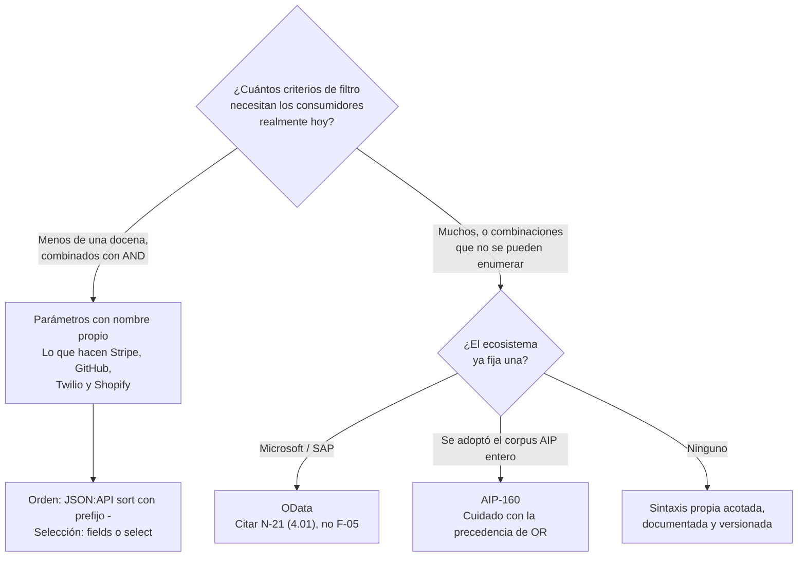

# Filtrado, orden y selección — `TEM-FILTRO`

## Resumen ejecutivo

Existen tres convenciones maduras para expresar «dame solo las reservas confirmadas de agosto, ordenadas por fecha, y de cada una solo el identificador y el estado». OData tiene estatus de estándar OASIS, JSON:API es una especificación comunitaria estable y las AIP de Google son el corpus de una de las organizaciones que más APIs opera. Las tres son mutuamente incompatibles en los tres ejes, y ninguna de las plataformas grandes verificadas en las fichas —Stripe, GitHub, Twilio, Shopify— adopta ninguna de las tres: todas usan filtros específicos por endpoint.

Ese hecho es el material central de este documento, porque desarma la recomendación que más circula sobre el tema. «Adoptá una convención de filtrado» suena razonable y no tiene respaldo en la conducta de las plataformas que más consumidores sirven. Lo que sí tiene respaldo es el criterio para elegir según cuánta expresividad hace falta, y la advertencia de que la expresividad tiene costos que se pagan en rendimiento, en superficie de seguridad y en imposibilidad de evolucionar.

Le sirve a `ACT-01`, que decide el criterio general, y a `ACT-02`, que descubre en el momento de implementarlo que un filtro genérico obliga a traducir un lenguaje a consultas de base de datos.

---

## Definición

Tres capacidades distintas que se agrupan porque comparten el transporte —la *query string*— y porque se deciden juntas:

**Filtrado** reduce el conjunto de elementos que la colección devuelve, evaluando condiciones sobre sus campos. **Orden** fija la secuencia en que llegan. **Selección** —los *sparse fieldsets*— reduce los campos de cada elemento sin reducir la cantidad de elementos.

**Qué problema resuelven.** Los tres atacan lo mismo desde ángulos distintos: que el consumidor traiga menos datos de los que la colección completa contiene. La selección tiene además un segundo efecto que suele importar más que el ancho de banda: permite que la API sirva a clientes con necesidades distintas —una lista y una pantalla de detalle— sin multiplicar endpoints, que es el antídoto contra el riesgo dominante de `CTX-3`.

**Qué no son.** No son paginación. Filtrar cambia qué elementos componen el conjunto; paginar entrega ese conjunto por partes. Se combinan siempre y la interacción tiene una consecuencia concreta que conviene fijar de entrada: **el filtro y el orden son parte de la identidad del recorrido**, de modo que un cursor obtenido bajo un filtro no vale bajo otro. Lo trata [`TEM-PAG`](Colecciones-y-Paginacion.md).

Tampoco son una capa de consultas. Un filtro con expresividad arbitraria sobre campos arbitrarios convierte la API en un motor de consultas remoto, con el modelo de datos interno expuesto y el plan de ejecución en manos del consumidor. Ese es el límite que este documento intenta hacer visible.

**Con qué se confunden.** Con la elección entre ruta y *query string*. Que las reservas de una sala se pidan como `/salas/{id}/reservas` y no como `/reservas?salaId={id}` es una decisión de modelado de recursos y la trata [`TEM-URI`](../20-Diseno-de-Recursos/Nomenclatura-de-URIs.md). Este documento empieza donde esa decisión ya se tomó y el criterio va en la *query*.

---

## Las tres convenciones y su incompatibilidad

| | **OData** | **JSON:API** (`F-04`) | **Google AIP-160** (`G-04`) |
|---|---|---|---|
| Filtrado | `$filter=estado eq 'confirmada' and asistentes gt 10` | Familia `filter` **reservada, sin sintaxis definida** | Campo único `filter` con DSL propio |
| Orden | `$orderby=inicio desc` | `sort=-inicio,titulo`, prefijo `-` para descendente | `order_by` (AIP-132) |
| Selección | `$select=id,estado` | `fields[reservas]=id,estado`, **por tipo** | *Field masks* (AIP-157) |
| Paginación asociada | `$top`, `$skip` | Familia `page[...]` | `page_size`, `page_token` (AIP-158) |
| Estatus | **v4.01 es OASIS Standard** (`N-21`); **v4.02 es solo Committee Specification Draft 02** (`F-05`) | v1.1 estable, finalizada 2022-09-30; sin organización de estándares que la respalde | *Approved* en el corpus AIP, creado 2020-02-24 |
| Adopción fuera de su ecosistema | Escasa fuera de Microsoft y SAP | Recomendada por GOV.UK (`G-06`) a quien no tenga estándar propio | Prácticamente nula fuera de Google |

### OData

Es la única con sintaxis completa, gramática publicada y estatus de estándar formal. Su `$filter` admite operadores de comparación, conjunciones, funciones sobre cadenas y navegación por relaciones; `$select`, `$orderby`, `$top`, `$skip` y `$expand` completan el juego.

Dos precisiones que producen citas incorrectas con frecuencia. **La versión que se cita como actual no es estándar**: el estándar OASIS vigente es la 4.01 (`N-21`), y la 4.02 (`F-05`) es Committee Specification Draft 02, en revisión pública desde abril de 2024 y sin aprobación a julio de 2026. El error viene de confundir el número más alto publicado con el documento que tiene autoridad.

Y **Microsoft no adopta OData de manera uniforme**. Graph (`G-02`) usa `$top`, `$skip` y `$filter` con `eq` y `ne`; Azure (`G-01`) usa `skip`, `top`, `filter`, `orderby`, `select` y `expand` **sin el prefijo `$`**. Es la misma empresa con dos convenciones que no interoperan, y es la razón por la que «Microsoft prescribe OData» es una afirmación que hay que calificar diciendo cuál de las dos guías.

El costo real de OData es la implementación. Aceptar `$filter` significa parsear un lenguaje, traducirlo a consultas y responder por lo que ese lenguaje permite pedir. Sin control de qué campos son filtrables y qué complejidad se admite, el consumidor puede componer una expresión que ningún índice cubre.

### JSON:API

Define con precisión el orden y la selección, y **reserva el filtrado sin especificarlo**. La propia especificación declara ser agnóstica respecto de las estrategias de filtrado y limitarse a reservar el nombre `filter` para ese propósito.

Es el caso más notorio de especificación que aparenta estandarizar y en realidad delega. Dos APIs que cumplen JSON:API pueden tener filtrados mutuamente ininteligibles, y por lo tanto un cliente genérico no puede filtrar contra una API JSON:API sin leer su documentación particular. Toda guía que diga «seguí JSON:API para filtrar» está prescribiendo algo que la especificación no define, y conviene detectarlo porque es una recomendación frecuente.

Lo que sí aporta es sólido. El `sort` con prefijo `-` para descendente y coma para múltiples criterios es compacto y no ambiguo. Y `fields[TYPE]` es la única de las tres que resuelve un problema que las otras dos ignoran: cuando la respuesta incluye recursos de varios tipos, la selección de campos tiene que poder decir de qué tipo habla. `$select=nombre` es ambiguo si en la respuesta hay salas y sedes que ambas tienen `nombre`.

### Google AIP-160

Un solo campo de tipo cadena llamado `filter`, que transporta una expresión en un lenguaje propio: `AND`, `OR`, `NOT` y `-` para negación, los operadores `=`, `!=`, `<`, `>`, `<=`, `>=`, el punto para recorrer campos anidados, los dos puntos como operador de pertenencia y el asterisco como comodín. Los campos siempre a la izquierda, los literales a la derecha.

Hay una trampa verificada que merece figurar en cualquier evaluación de esta opción: **`OR` tiene mayor precedencia que `AND`**, al revés que en SQL y que en todos los lenguajes de programación de uso corriente. Una expresión escrita con la intuición habitual se evalúa distinto de lo que su autor cree, sin ningún error visible. Es un pie de página de la especificación con capacidad de producir defectos que nadie atribuye al filtro.

La ventaja del modelo es el transporte: un solo parámetro, opaco para la infraestructura intermedia, que no crece en la superficie de la especificación OpenAPI a medida que se agregan campos filtrables. La desventaja es la misma que la de OData multiplicada: un lenguaje propio que hay que documentar, parsear y explicar, y que ninguna herramienta genérica entiende.

### Qué hacen las plataformas grandes

Ninguna de las verificadas adopta ninguna de las tres. Stripe, GitHub, Twilio y Shopify usan **filtros específicos declarados por endpoint**: parámetros con nombre propio, tipo conocido y semántica documentada, del estilo `estado=confirmada&creadaDesde=2026-08-01`.

La observación es importante porque invierte la conclusión intuitiva. Las plataformas que sirven a más integradores eligieron consistentemente la opción menos expresiva y más aburrida, y es razonable suponer que no fue por desconocimiento. Lo que un parámetro con nombre propio compra es que aparece en la especificación OpenAPI con su tipo y sus valores admitidos, que la herramienta de generación de clientes lo convierte en un argumento tipado, que el productor sabe exactamente qué combinaciones tiene que indexar, y que el conjunto de consultas posibles es finito y auditable.

---

## El criterio para elegir



**Esta guía recomienda empezar por parámetros con nombre propio** y adoptar una convención completa solo cuando la enumeración deje de ser posible. La recomendación es criterio propio y se apoya en la evidencia de qué hacen las plataformas grandes, que es evidencia de conducta y no de corrección.

Para el orden, esta guía recomienda **la sintaxis de JSON:API** —`orden=-inicio,id`— aunque no se adopte el resto de la especificación, porque es compacta, no ambigua, cabe en un parámetro y es la única de las tres que un lector reconoce sin documentación. Para la selección, un parámetro `campos` con lista separada por comas cuando la respuesta es de un solo tipo, y la forma `campos[tipo]` de JSON:API cuando hay varios.

Tres restricciones acompañan la recomendación y son las que la vuelven sostenible:

**Los campos filtrables y ordenables son un conjunto cerrado y publicado.** Permitir filtrar por cualquier campo del recurso expone el modelo interno y garantiza que antes o después alguien ordene por una columna sin índice. Un valor no admitido se rechaza con `400` y un cuerpo que diga cuáles sí lo son.

**El orden por defecto es explícito y total.** Sin él, la paginación se vuelve incoherente entre páginas —el motor no está obligado a devolver dos veces la misma secuencia— y `ACT-03` se acopla a un orden que nadie prometió.

**El filtro es parte de la identidad del recorrido paginado.** Cambiar el filtro invalida el cursor, y el contrato tiene que decir qué pasa cuando llega un cursor con un filtro distinto del que lo originó. Rechazar con `400` es lo que esta guía recomienda; aceptarlo produce recorridos que saltean elementos sin ninguna señal.

---

## Selección de campos

La selección es la capacidad de esta familia con mejor relación entre lo que cuesta y lo que resuelve, y la que menos se implementa.

Su valor no está en el ancho de banda. Está en que **evita la proliferación de endpoints por pantalla**. Sin selección, la lista de reservas necesita un endpoint que devuelva poco y la pantalla de detalle otro que devuelva mucho, y en cuanto aparece un tercer cliente con otra necesidad el backend empieza a acumular variantes: es exactamente el modo en que se degrada `CTX-3`.

Los costos son concretos y hay que declararlos. La respuesta deja de tener una forma única, lo que complica el esquema en la especificación OpenAPI y la generación de clientes tipados. Se multiplican las variantes de caché: cada combinación de campos es una entrada distinta, y el `Vary` correspondiente lo trata [`TEM-CACHE`](../30-Semantica-HTTP/Cache-y-Peticiones-Condicionales.md). Y aparece una pregunta que el contrato tiene que responder: si el consumidor pide un campo que no existe, ¿la API lo ignora o rechaza la petición? Esta guía recomienda rechazar, porque ignorar convierte un error de tipeo del consumidor en un campo silenciosamente faltante.

**Esta guía recomienda** que el identificador se devuelva siempre, se lo pida o no: una representación sin identidad no sirve para nada y su ausencia solo produce clientes rotos.

---

## Aplicación por escenario

### `ESC-1` — API nueva

El escenario lo clasifica entre las decisiones **postergables sin penalización**, y esa clasificación se sostiene: agregar un parámetro de filtro opcional a un endpoint publicado es compatible, mientras que agregar paginación después no lo es. La trampa específica acá es la de sobrediseñar: implementar `$filter` completo antes de que exista un solo consumidor resuelve un problema que la API todavía no tiene, a cambio de un compromiso de expresividad que después no se puede reducir.

El criterio de esta guía para `ESC-1`: implementar los filtros que algún consumidor identificable pidió, con nombre propio, y dejar la puerta abierta. Lo que sí conviene fijar de entrada es el **orden por defecto**, porque cambiarlo después altera el resultado de peticiones existentes sin ningún error.

### `ESC-2` — Exposición o migración

Es donde el filtrado genérico es más tentador y más peligroso. Un sistema previo con un procedimiento almacenado que acepta quince parámetros opcionales empuja hacia un endpoint que los reexpone todos, y con eso el contrato público hereda el modelo interno completo. El costo de traducir a un conjunto de filtros pensados desde el consumidor es el mismo que el escenario ya identificó para el modelo de recursos y hay que declararlo del mismo modo.

En la variante de migración desde SOAP aparece un caso propio: los servicios de esa generación suelen exponer una operación de búsqueda con un objeto de criterios en el cuerpo. Trasladarla a `POST /reservas/busqueda` con el mismo objeto es reproducir el contrato viejo con otra sintaxis, que es la trampa que el escenario advierte. Existe un caso legítimo para el filtro en el cuerpo —cuando la expresión no entra en una URI— y lo trata [`TEM-ACCIONES`](../20-Diseno-de-Recursos/Operaciones-No-CRUD.md); la diferencia está en si se eligió o se heredó.

### `ESC-3` — Evolución en producción

Agregar un filtro opcional es compatible. Los tres cambios que rompen sin parecerlo son cambiar el orden por defecto, endurecer la validación de un parámetro que antes se ignoraba en silencio —quien mandaba `orden=fecha_inicio` con un nombre que no existía recibía la colección sin ordenar y ahora recibe `400`— y retirar un campo del conjunto de filtrables porque su consulta resultó cara.

El caso más difícil del escenario es el que llega desde operaciones y no desde producto: un filtro publicado resulta insostenible en carga. Retirarlo es rompiente; sostenerlo degrada el servicio para todos. La salida practicable es acotarlo —exigir que venga acompañado de un rango de fechas, limitar su tamaño de página, moverlo a una ruta con límites de uso propios— antes que eliminarlo, y anunciarlo con el mecanismo de deprecación que fija [`TEM-DEPR`](../50-Evolucion-y-Versionado/Deprecacion-y-Retiro.md).

### `ESC-4` — Evaluación de una API ajena

Cuatro pruebas ordenadas por lo que revelan. Pedir un filtro por un campo que existe en la respuesta pero que la documentación no lista: si funciona, hay filtrado genérico no declarado y por lo tanto una superficie mayor que la documentada. Pedir un orden por un campo arbitrario y medir la latencia: una diferencia grande delata qué campos tienen índice. Mandar un parámetro con un nombre inventado: si la API lo ignora en silencio, cualquier error de tipeo del consumidor va a producir un conjunto de resultados incorrecto sin ninguna señal. Y combinar filtro con paginación y avanzar una página cambiando el filtro, para ver si el cursor se acepta indebidamente.

En `ESC-4a` la pregunta sobre la especificación es si los valores admitidos de cada parámetro están enumerados. Un parámetro declarado como `string` sin restricciones es, casi siempre, un parámetro cuya validación real nadie escribió.

### Qué cambia según el contexto

| Contexto | Qué cambia en este tema |
|---|---|
| `CTX-1` pública | Todo filtro publicado es un compromiso de rendimiento indefinido, sobre datos que van a crecer. `ACT-07` interviene: un filtro por un campo con datos personales es un mecanismo de enumeración. Conviene empezar restrictivo |
| `CTX-2` interna | Se puede implementar el filtro concreto que el otro equipo necesita y retirarlo después de verificar que nadie lo usa. Es el contexto donde el filtrado a medida es sostenible |
| `CTX-3` backend de app propia | La selección de campos vale más que en ningún otro contexto, porque es lo que evita un endpoint por pantalla. Con cliente móvil instalado, los parámetros quedan congelados como en `CTX-1` |
| `CTX-4` integración | La sintaxis la impone el proveedor. El trabajo es la capa que la aísla: una especificación de criterios propia que se traduzca en la frontera, para que cambiar de proveedor no obligue a reescribir las consultas del dominio |

---

## Ejemplos concretos

Ejemplos **sintéticos** del dominio de reserva de salas.

### La forma que esta guía recomienda

```http
GET /v1/reservas?sedeId=sd-centro&estado=confirmada&inicioDesde=2026-08-01&inicioHasta=2026-08-31&orden=-inicioLocal,id&campos=id,estado,inicioLocal,salaId&limite=20 HTTP/1.1
Host: api.salas.ejemplo.com
Accept: application/json
```

```http
HTTP/1.1 200 OK
Content-Type: application/json
Vary: Accept

{
  "datos": [
    { "id": "r-3410", "estado": "confirmada", "inicioLocal": "2026-08-31T16:00:00", "salaId": "s-auditorio-norte" },
    { "id": "r-3409", "estado": "confirmada", "inicioLocal": "2026-08-31T14:00:00", "salaId": "s-sala-2" }
  ],
  "hayMas": true,
  "cursorSiguiente": "eyJpIjoiMjAyNi0wOC0zMVQxNDowMCIsImlkIjoici0zNDA5In0"
}
```

Cada parámetro tiene nombre propio, tipo declarable en OpenAPI y un conjunto de valores admitidos. El orden usa la sintaxis de JSON:API con el desempate por identificador que el cursor necesita. La selección devuelve `id` aunque el consumidor lo hubiera omitido.

### Un campo de orden no admitido

```http
GET /v1/reservas?orden=notas HTTP/1.1
```

```http
HTTP/1.1 400 Bad Request
Content-Type: application/problem+json

{
  "type": "https://api.salas.ejemplo.com/problemas/parametro-invalido",
  "title": "Parámetro de consulta inválido",
  "status": 400,
  "detail": "El campo 'notas' no admite ordenamiento.",
  "errores": [
    {
      "parametro": "orden",
      "detalle": "Valor no admitido: 'notas'.",
      "admitidos": ["inicioLocal", "creadaEn", "estado", "id"]
    }
  ]
}
```

Enumerar los valores admitidos en el propio error es criterio propio de esta guía; el miembro `errores` es una extensión de `N-04` §3.2 y la trata [`TEM-ERR`](Manejo-de-Errores.md). El argumento a favor es que en `CTX-1` el error es la documentación en el momento en que más se la necesita.

### Cursor obtenido bajo otro filtro

```http
GET /v1/reservas?estado=pendiente&cursor=eyJpIjoiMjAyNi0wOC0zMVQxNDowMCIsImlkIjoici0zNDA5In0 HTTP/1.1
```

```http
HTTP/1.1 400 Bad Request
Content-Type: application/problem+json

{
  "type": "https://api.salas.ejemplo.com/problemas/cursor-incompatible",
  "title": "Cursor incompatible con los criterios",
  "status": 400,
  "detail": "El cursor se emitió con estado='confirmada'. Reiniciá el recorrido o conservá los criterios originales."
}
```

Aceptar el cursor produciría un recorrido que saltea elementos sin ninguna señal, que es el modo de falla que más tarda en detectarse.

### Las mismas tres capacidades en las tres convenciones

```http
GET /v1/reservas?$filter=estado eq 'confirmada' and asistentes gt 10&$orderby=inicioLocal desc&$select=id,estado&$top=20
```

```http
GET /v1/reservas?filter[estado]=confirmada&sort=-inicioLocal&fields[reservas]=id,estado&page[size]=20
```

```http
GET /v1/reservas?filter=estado="confirmada" AND asistentes>10&order_by=inicio_local desc&page_size=20
```

El primero es OData, y hay que citarlo contra `N-21` porque la 4.02 no es estándar aprobado. El segundo es JSON:API, y su `filter[estado]` es una **invención del ejemplo**: la especificación reserva el nombre `filter` sin definirle sintaxis, de modo que esa forma concreta no la prescribe nadie. El tercero es AIP-160, donde una expresión con `OR` se evaluaría con precedencia invertida respecto de la intuición de quien viene de SQL.

### Implementación con lista blanca en ASP.NET Core

```csharp
// Sintético. El conjunto de campos ordenables es cerrado y publicado.
private static readonly Dictionary<string, Expression<Func<Reserva, object>>> Ordenables = new()
{
    ["inicioLocal"] = r => r.InicioLocal,
    ["creadaEn"]    = r => r.CreadaEn,
    ["estado"]      = r => r.Estado,
    ["id"]          = r => r.Id
};

app.MapGet("/v1/reservas", async (
    [AsParameters] CriteriosReserva criterios,
    ReservasDbContext db,
    CancellationToken ct) =>
{
    if (!TryConstruirOrden(criterios.Orden, out var orden, out var invalido))
    {
        return TypedResults.Problem(
            type: "https://api.salas.ejemplo.com/problemas/parametro-invalido",
            title: "Parámetro de consulta inválido",
            detail: $"El campo '{invalido}' no admite ordenamiento.",
            statusCode: StatusCodes.Status400BadRequest,
            extensions: new Dictionary<string, object?>
            {
                ["errores"] = new[]
                {
                    new { parametro = "orden", detalle = $"Valor no admitido: '{invalido}'.",
                          admitidos = Ordenables.Keys }
                }
            });
    }

    var consulta = db.Reservas.AsQueryable();

    // Filtros con nombre propio: cada uno es una condición conocida e indexable.
    if (criterios.SedeId is { } sede)       consulta = consulta.Where(r => r.SedeId == sede);
    if (criterios.Estado is { } estado)     consulta = consulta.Where(r => r.Estado == estado);
    if (criterios.InicioDesde is { } desde) consulta = consulta.Where(r => r.InicioLocal >= desde);
    if (criterios.InicioHasta is { } hasta) consulta = consulta.Where(r => r.InicioLocal < hasta);

    var pagina = await AplicarOrdenYCursor(consulta, orden, criterios).ToListAsync(ct);
    return TypedResults.Ok(Proyectar(pagina, criterios.Campos));   // 'id' siempre incluido
});

// Cada criterio es un parámetro tipado: aparece en OpenAPI y se valida sin código a medida.
public sealed record CriteriosReserva(
    string? SedeId,
    EstadoReserva? Estado,
    DateTime? InicioDesde,
    DateTime? InicioHasta,
    string? Orden,
    string? Campos,
    string? Cursor,
    int? Limite);
```

El diccionario `Ordenables` es lo que impide que un consumidor ordene por una columna sin índice, y su presencia en el código es también la fuente de verdad de la lista que el error enumera. El tipo `CriteriosReserva` con `[AsParameters]` hace que cada filtro aparezca en el documento OpenAPI con su tipo, que es la ventaja concreta del enfoque por parámetros con nombre propio sobre cualquiera de las tres convenciones genéricas.

La sintaxis exacta de `TypedResults.Problem` con extensiones corresponde a la superficie de ASP.NET Core que documentan `N-28` y `N-30`; el ejemplo es ilustrativo del contrato resultante y su forma de invocación no se verificó contra el SDK.

---

## Preguntas guía

- ¿Puedo enumerar todos los filtros que mi API acepta, o hay endpoints donde el conjunto es abierto?
- Por cada campo filtrable u ordenable, ¿existe un índice que lo cubra? ¿Alguien lo verificó, o se supone?
- Si un consumidor manda un parámetro con un nombre que no existe, ¿qué pasa? ¿Lo sabe él?
- ¿Cuál es el orden por defecto de cada colección, y está escrito en la especificación o solo en el código?
- ¿Qué pasa si alguien cambia el filtro y reusa el cursor de antes?
- Si implemento selección de campos, ¿cuántas variantes de caché estoy creando, y el `Vary` lo refleja?
- ¿El filtro más caro que mi API admite tiene un límite de uso propio, o comparte el del resto?

---

## Criterios de calidad

El filtrado está bien resuelto cuando el conjunto de consultas que la API admite es finito, enumerable y respaldado por índices; cuando un parámetro incorrecto produce un error que dice cuál era el correcto; y cuando el orden por defecto está declarado y es total.

### Antipatrones

**El filtro genérico sobre cualquier campo.** Expone el modelo interno, garantiza consultas sin índice y no se puede retirar una vez publicado.

**El parámetro desconocido ignorado en silencio.** Un error de tipeo del consumidor produce un conjunto de resultados incorrecto sin ninguna señal. Es el defecto más caro de diagnosticar de este documento, porque el cliente ve datos plausibles.

**Ordenar sin desempate.** Con valores repetidos en la columna de orden, la paginación saltea y repite elementos. Se manifiesta solo con datos reales.

**Cambiar el orden por defecto.** Altera el resultado de peticiones existentes sin producir error y sin figurar en ningún esquema.

**Citar OData 4.02 como estándar.** No lo es: es Committee Specification Draft 02 (`F-05`). El estándar OASIS vigente es la 4.01 (`N-21`).

**Decir «seguimos JSON:API» para el filtrado.** La especificación reserva el nombre y no define la sintaxis. La afirmación no informa nada al consumidor sobre cómo filtrar.

**Adoptar AIP-160 sin advertir la precedencia de `OR`.** Produce expresiones que se evalúan al revés de lo que su autor cree, sin error.

**Filtrar en memoria.** Traer la colección completa y aplicar el criterio en el proceso resuelve el contrato y no resuelve nada del problema; el costo del servidor queda idéntico al de no filtrar.

**La selección que omite el identificador.** Una representación sin identidad no le sirve a ningún cliente y solo produce una segunda petición.

---

## Anexo — Ficha de capacidades de consulta

Se completa por colección. La aprueba `ACT-01`, la implementa `ACT-02` y la verifica `ACT-04` contra el comportamiento real.

```yaml
coleccion: ""                       # ruta del endpoint
convencion: parametros-propios | odata | json-api | aip-160 | propia
justificacion: ""

filtros_admitidos:
  - parametro: ""
    tipo: ""
    valores_admitidos: []           # vacío solo si el tipo ya los acota
    indice_que_lo_cubre: ""         # obligatorio; "ninguno" es un hallazgo
    combinable_con: []              # qué otros filtros se pueden usar a la vez

orden:
  parametro: ""                     # orden | sort | $orderby | order_by
  sintaxis: ""                      # p.ej. "-campo para descendente, coma para varios"
  campos_admitidos: []
  orden_por_defecto: []             # explícito y total
  desempate_estable: si | no

seleccion:
  soportada: si | no
  parametro: ""                     # campos | fields[tipo] | $select
  campos_siempre_presentes: [id]
  conducta_ante_campo_inexistente: rechazo | ignorar
  impacto_en_cache_declarado: si | no

interaccion_con_paginacion:
  cursor_ligado_a_los_criterios: si | no
  conducta_si_cambian: rechazo-400 | indefinida

parametros_desconocidos:
  conducta: rechazo | ignorar       # esta guía recomienda rechazo
  documentada: si | no

limites:
  consulta_mas_cara_identificada: ""
  tiene_limite_de_uso_propio: si | no
```

La fila `indice_que_lo_cubre` es la que convierte esta ficha en algo más que documentación. Completarla obliga a mirar el plan de ejecución de cada filtro publicado, y el valor «ninguno» aparece con una frecuencia que sorprende a quien no lo había mirado. La fila `conducta_ante_campo_inexistente` es la segunda en importancia y la que más suele estar sin decidir: en la mayoría de las implementaciones el parámetro desconocido se ignora, y eso no fue una decisión sino el comportamiento por defecto del enlace de modelos.
