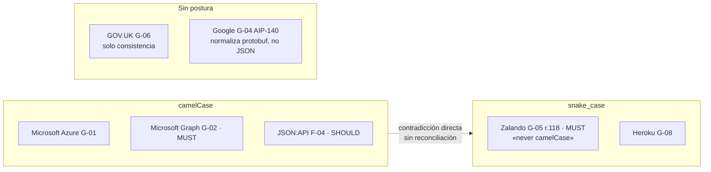

# Formato y nomenclatura de campos — `TEM-CAMPOS`

## Resumen ejecutivo

Cada nombre de campo que una API publica es un compromiso del mismo orden que una URI: queda escrito en el código de todos los consumidores, en los ejemplos de la documentación y en las pruebas de integración de gente que el productor nunca va a conocer. La diferencia con la URI es que el campo pasa desapercibido en la revisión. Nadie discute media hora si la colección se llama `/reservas` o `/reserva`, pero el campo `fecha_hora_inicio` aparece en un *commit* sin que nadie lo mire.

Sobre esta materia no hay ninguna especificación. Ningún RFC dice cómo capitalizar un nombre de propiedad JSON, y las guías de las organizaciones grandes se contradicen de manera frontal y deliberada: Microsoft exige `camelCase` en sus dos guías vivas, Zalando exige `snake_case` y escribe la prohibición explícita de la alternativa. El objeto de este documento es dar el mapa de esa contradicción, los criterios de tipos donde sí hay convergencia —fechas, dinero, nulos— y la advertencia sobre el conflicto semántico más caro del tema, que es el significado del campo `name` en el mundo de Google frente al resto de la industria.

Le sirve a `ACT-01`, que decide, y a `ACT-03`, que sufre la decisión desde el otro lado del cable.

---

## Definición

La nomenclatura de campos es el conjunto de reglas que fija cómo se llaman las propiedades de los objetos JSON que la API produce y consume, y cómo se representan los valores que no tienen forma canónica en JSON: instantes de tiempo, importes monetarios, valores de un conjunto cerrado, ausencia de dato.

**Qué problema resuelve.** Uno solo, y no es estético: la **predecibilidad**. Un consumidor que ya integró tres endpoints debe poder anticipar cómo se va a llamar el cuarto campo del quinto endpoint sin abrir la documentación. Una API donde conviven `fechaInicio`, `fecha_fin`, `SalaId` y `cantidad_personas` obliga a consultar la especificación en cada línea de código del cliente, y produce una clase de defecto particularmente irritante: el que compila, deserializa sin error y deja el campo en su valor por defecto porque el nombre no coincidía.

**Qué no es.** No es la configuración del serializador. Que `System.Text.Json` produzca `camelCase` bajo `JsonSerializerDefaults.Web` (`N-39`) es un mecanismo; la decisión de que el contrato sea `camelCase` es anterior e independiente de la plataforma, y se trata acá. El cómo se configura lo trata [`TEM-SERIAL`](../80-Implementacion-en-NET/Serializacion-Con-System-Text-Json.md).

Tampoco es la nomenclatura de URIs. Son dos planos separados y hay al menos una guía mayor que los separa a propósito: Zalando (`G-05`) prescribe `kebab-case` en segmentos de path por su regla 129 y `snake_case` en propiedades JSON por su regla 118. Quien lea una sola de las dos reglas y la generalice va a producir exactamente lo que la guía prohíbe.

**Con qué se lo confunde.** Con una discusión de gusto. La elección entre `camelCase` y `snake_case` es, tomada aisladamente, arbitraria: ninguna de las dos es técnicamente superior y ambas están sostenidas por organizaciones que operan APIs a escala. Lo que no es arbitrario es **elegir una sola y sostenerla**, porque el costo no está en la convención sino en la mezcla.

---

## La contradicción central: `camelCase` frente a `snake_case`

Es el caso más limpio de toda la guía para ejercitar los cuatro niveles de autoridad de [`MARCO-CONVENCIONES`](../00-Marco-de-Referencia/Convenciones.md), porque el nivel normativo está literalmente vacío.

| Quién | Qué prescribe | Fuerza declarada | Nivel de autoridad |
|---|---|---|---|
| Ningún RFC | — | — | **No hay norma** |
| Microsoft Azure (`G-01`) | `camelCase` en todos los nombres de campo JSON | Prescripción del documento, fechado 2025-03-28 | Guía de organización |
| Microsoft Graph (`G-02`) | `lowerCamelCase` en todos los nombres | **MUST** | Guía de organización |
| JSON:API (`F-04`) | `camelCase` para nombres de miembro | **SHOULD**, y en la página de recomendaciones, no en la normativa | Convención comunitaria |
| Zalando (`G-05`) regla 118 | `snake_case`, regex `^[a-z_][a-z_0-9]*$`, explícitamente *«never camelCase»* | **MUST** | Guía de organización |
| Heroku (`G-08`) | minúsculas con guion bajo (`service_class`, `created_at`) | Prescripción del documento | Guía de organización, de facto inactiva |
| Google (`G-04`) AIP-140 | `lower_snake_case` **en protobuf**; el AIP menciona que los nombres «se mapean a la convención apropiada en JSON» sin especificar cuál | **MUST** sobre protobuf | Guía de organización, con vacío declarado |
| GOV.UK (`G-06`) | No prescribe casing; pide consistencia | — | Guía de organización |

La fila de Google merece precisión, porque es donde más citas falsas circulan. AIP-140 normaliza `lower_snake_case` para las definiciones de campo en archivos protobuf y **no especifica el casing de la representación JSON**. La práctica observable de Google es `lowerCamelCase` en JSON, pero eso no está verificado en AIP-140 y esta guía no lo afirma como prescripción de Google. Citar «Google prescribe `snake_case` en JSON» es incorrecto; citar «Google prescribe `camelCase` en JSON» también.



### Qué problema estaba resolviendo cada uno

La contradicción se vuelve manejable cuando se lee cada postura contra su contexto de origen, en lugar de buscar cuál tiene razón.

`camelCase` gana cuando el consumidor dominante es **JavaScript o TypeScript**, porque el JSON deserializado se usa directamente como objeto del lenguaje y `reserva.fechaInicio` es idiomático donde `reserva.fecha_inicio` no lo es. El argumento de Heroku (`G-08`) apunta al mismo hecho desde la vereda opuesta: elige guion bajo *«so that attribute names can be typed without quotes in JavaScript»*, es decir, ambos justifican su decisión con la ergonomía de JavaScript y llegan a conclusiones distintas. El argumento no decide nada por sí solo.

`snake_case` gana cuando la API es la superficie externa de un sistema cuyo lenguaje interno usa `snake_case` —Python, Ruby, o un modelo protobuf— y cuando la organización valora la **legibilidad en documentos largos y en logs**, donde el guion bajo separa palabras con más contraste que un cambio de caja. Zalando además obtiene una propiedad que ninguna otra guía busca: al usar tres casings distintos por capa, mirar un identificador aislado revela de qué capa proviene.

Para .NET hay un dato de plataforma que conviene tener presente y que no es un argumento decisivo: MVC en ASP.NET Core produce `camelCase` por defecto (`N-37`), y `JsonSerializerDefaults.Web` implica esa política de nombres (`N-39`). Sin ASP.NET Core de por medio, `System.Text.Json` deja los nombres tal como están en la clase, capitalización incluida (`N-38`), de modo que una API .NET sin configuración explícita fuera del pipeline web publica `PascalCase`. Ese `PascalCase` accidental no lo prescribe ninguna de las ocho guías de la tabla y es el resultado más frecuente de no tomar la decisión.

### Criterio de esta guía

**Esta guía recomienda `camelCase`** para APIs implementadas en ASP.NET Core, por dos razones acumulativas y ninguna de principio: es el valor por defecto de la plataforma (`N-37`, `N-39`), de modo que sostenerlo no exige configuración ni vigilancia; y es la postura de las dos guías vivas de Microsoft, que es el ecosistema en el que el lector va a encontrar el resto de sus decisiones.

La recomendación se abandona sin discusión en dos situaciones. En `CTX-4`, cuando se diseña la superficie que interopera con un sistema externo que ya fija otra convención, se adopta la del otro lado en esa frontera y se traduce hacia adentro. Y en una organización que ya publicó APIs en `snake_case`, la consistencia con lo existente vale más que cualquier argumento de este documento: la peor de todas las opciones es tener las dos.

---

## Nombres de campo

Elegido el casing, quedan las decisiones sobre el nombre en sí, y hay dos donde la industria diverge de forma consecuente.

### `id`: el consenso frágil

La convención mayoritaria es que el identificador del recurso se llama `id`. Heroku (`G-08`) lo prescribe explícitamente y agrega usar UUID en minúsculas con el formato 8-4-4-4-12 salvo razón de peso; JSON:API (`F-04`) lo exige junto con `type` para identificar cada objeto de recurso. GOV.UK (`G-06`) no fija el nombre pero pide que los identificadores sean **consistentes entre recursos similares**, con los ejemplos `user_id` y `address_id`.

Sobre si la clave foránea se llama `sala` o `sala_id` no hay prescripción verificada en ninguna de las guías consultadas. Esta guía recomienda el sufijo explícito cuando el valor es un identificador y el nombre desnudo cuando el valor es un objeto embebido, porque hace que el tipo sea legible sin consultar el esquema: `salaId` contiene una cadena, `sala` contiene un objeto.

### `name`: el conflicto severo

Google (`G-04`) AIP-122 establece que un recurso **debe** exponer un campo `name` que contiene su *resource name* completo —la ruta jerárquica sin barra inicial, del estilo `publishers/123/books/les-miserables`—, que **debe** ser de tipo string y **debería** ser el primer campo. Y agrega dos prohibiciones que son las que producen el choque: los recursos **no deben** exponer tuplas, *self-links* ni otras formas de identificación, y **ningún otro campo puede llamarse `name`** salvo para ese propósito.

En el resto de la industria `name` es una etiqueta legible por humanos. Una sala se llama «Auditorio Norte» y ese texto vive en `name`, mientras que la identidad vive en `id`.

| | Convención Google (`G-04` AIP-122) | Convención general (`G-08`, `F-04`, práctica dominante) |
|---|---|---|
| Clave primaria | `name`, con la ruta completa | `id` |
| Etiqueta humana | Otro campo, nunca `name` | `name` |
| *Self-link* | Prohibido exponerlo | Habitual (`F-04` lo estructura en `links`) |
| Consecuencia | El cliente compone URIs a partir de `name` | El cliente compone URIs a partir de `id` |

No es una diferencia de estilo: es una diferencia de qué significa un identificador. Migrar de una convención a la otra rompe a todos los clientes, porque el mismo nombre de campo cambia de tipo semántico. Quien adopte el corpus AIP de Google debe adoptarlo entero; quien tome de él solo AIP-158 para paginar y AIP-160 para filtrar —que es lo habitual— debería saber que está mezclando dos modelos de identidad y elegir explícitamente cuál sigue.

### Otras reglas de nombre verificadas

Graph (`G-02`) prescribe evitar palabras redundantes respecto del contexto: dentro de `/places/{id}` el campo es `displayName` y no `placeName`, porque el tipo ya lo dice la ruta. La misma guía pide casing consistente en los acrónimos de dos letras, con los ejemplos `ioLimit` y `driveId`; el problema real que ataca es que `IOLimit`, `ioLimit` y `IoLimit` conviven en cualquier API grande que no lo haya decidido.

Google AIP-140 agrega tres reglas que sobreviven al cambio de casing y que esta guía considera aprovechables fuera de su ecosistema: usar las abreviaturas ya establecidas (`config`, `id`, `info`, `spec`, `stats`) en lugar de escribir la palabra completa, evitar palabras reservadas de los lenguajes habituales, y no incluir preposiciones —`with`, `for`, `at`, `by`— con la única excepción de `per` para unidades.

---

## Tipos y su representación

JSON tiene seis tipos y ninguno de ellos es una fecha, un importe ni un enumerado. Cada API decide cómo los representa, y acá sí hay convergencia real en algunos puntos.

### Fechas e instantes

Es el único punto de esta sección con consenso verificado entre guías que se contradicen en todo lo demás. Azure (`G-01`) prescribe RFC 3339 en los cuerpos JSON y en la query, reservando el formato de RFC 7231 para las cabeceras HTTP. Heroku (`G-08`) prescribe aceptar y devolver tiempos **solo en UTC**, renderizados en ISO 8601, con el ejemplo `"finished_at": "2012-01-01T12:00:00Z"`. GOV.UK (`G-06`) prescribe ISO 8601.

La distinción entre formato del cuerpo y formato de las cabeceras que hace Azure importa: una fecha en un campo JSON y una fecha en `Last-Modified` no se escriben igual, y confundirlas produce cabeceras que los intermediarios no interpretan. Lo trata [`TEM-HEADERS`](../30-Semantica-HTTP/Cabeceras-y-Negociacion.md).

Hay una decisión que ninguna de las guías consultadas resuelve y que en el dominio de reserva de salas es central: **un instante y una fecha local no son el mismo tipo**. El momento en que se creó una reserva es un instante y va en UTC con `Z`. El horario en que empieza la reunión es una hora local de la sede, y almacenarla como instante UTC funciona hasta que un cambio de horario de verano mueve reservas ya confirmadas. Esta guía recomienda que un campo de fecha lleve el desplazamiento cuando representa un instante, y que cuando la semántica sea «las nueve de la mañana en la sede, sea cual sea el desplazamiento vigente ese día» se representen por separado la fecha-hora local y el identificador de zona horaria. La afirmación es criterio propio; no hay respaldo en las fichas.

### Dinero

Ninguna de las guías verificadas prescribe una representación monetaria. Lo que sí es un hecho del formato es que el tipo `number` de JSON no tiene precisión decimal garantizada, y que un intérprete que lo mapee a punto flotante binario de doble precisión no representa exactamente valores como `0,10`.

Esta guía recomienda dos representaciones y desaconseja la tercera. Un objeto con importe en cadena y moneda explícita —`{ "importe": "1500.00", "moneda": "ARS" }`— preserva la precisión y la escala escrita, a costa de que el consumidor deba parsear. Un entero en la unidad mínima con la moneda al lado —`{ "importe_menor": 150000, "moneda": "ARS" }`— evita el parseo a costa de que el consumidor deba conocer la escala de cada moneda. Lo que esta guía desaconseja es un `number` JSON desnudo sin moneda, que acumula los dos problemas: precisión no garantizada y ambigüedad de unidad. Es criterio propio y es discutible; lo que no es discutible es que la moneda tiene que estar en la representación y no en la documentación.

### Enumerados

Un enumerado en el contrato es un conjunto cerrado de cadenas. Google (`G-04`) AIP-193 usa `UPPER_SNAKE_CASE` para el campo `reason` de sus errores, con patrón `[A-Z][A-Z0-9_]+[A-Z0-9]` y máximo de 63 caracteres; Graph (`G-02`) usa `camelCase` para el `code` de sus errores. Se contradicen igual que en el resto.

La decisión que importa más que el casing es la del **carácter rompiente de agregar un valor**. Un consumidor que deserializa el enumerado con validación estricta falla ante un valor que no conocía, y por lo tanto agregar `EN_ESPERA_DE_APROBACION` a un campo `estado` rompe a esos clientes aunque no rompa a los que tratan el campo como cadena. `TEM-BREAK` lo analiza; lo que corresponde acá es la consecuencia sobre la representación: **el contrato debe declarar de entrada si el conjunto es cerrado o extensible**, y si es extensible debe documentar qué debe hacer el cliente ante un valor desconocido. Un enumerado sin esa declaración es un campo que no se puede evolucionar.

Sobre el uso de enteros en lugar de cadenas para enumerados, esta guía recomienda cadenas: un `estado: 3` obliga a consultar la documentación en cada log y no sobrevive a una reordenación accidental de la enumeración interna.

### Nulos y ausencia

JSON distingue tres situaciones que los consumidores confunden sistemáticamente: el campo no está, el campo está con valor `null`, y el campo está con el valor vacío de su tipo —cadena vacía, array vacío—.

Esta guía recomienda fijar una semántica y documentarla, porque la elección concreta importa menos que su estabilidad. La que esta guía propone: **ausente significa «no aplica o no se solicitó», `null` significa «aplica y no tiene valor», y el vacío del tipo es un valor legítimo**. Un array vacío es una colección sin elementos, no un dato faltante, y devolver `null` en su lugar obliga a todos los consumidores a escribir una comprobación que no debería existir.

El caso donde esta distinción deja de ser doctrinaria y se vuelve técnica es la modificación parcial, porque `N-07` (JSON Merge Patch) le asigna a `null` el significado de **eliminar el miembro**, con lo cual «poner en null» y «no tocar» dejan de poder expresarse ambos. Lo trata [`TEM-PATCH`](Actualizaciones-Parciales.md); es la razón por la que la decisión de esta subsección no puede tomarse aisladamente.

Azure aporta un dato concreto y comprobable en la misma dirección: prescribe **omitir el campo `nextLink` en la última página en lugar de mandarlo con valor `null`**. La lógica es que la ausencia del campo es una señal más barata de interpretar que un valor nulo, y evita que un cliente descuidado haga una petición de más. Lo detalla [`TEM-PAG`](Colecciones-y-Paginacion.md).

### Booleanos

Un campo booleano se nombra de forma que su valor `true` sea afirmativo y no requiera doble negación: `activa` y no `noActiva`, `permiteCancelacion` y no `sinCancelacion`. La regla es criterio propio y su justificación es que la doble negación se lee mal en la condición del cliente.

Más sustantivo es el criterio de cuándo **no** usar un booleano. Un campo `confirmada: true` colapsa en dos valores un ciclo de vida que casi siempre tiene tres o más, y la evolución hacia `confirmada` más `cancelada` más `pendiente` como tres booleanos independientes produce combinaciones que el dominio no admite. Cuando el dominio tiene estados, el contrato lleva un campo `estado` enumerado. Es criterio propio y coincide con el modelado que pide [`TEM-RECURSOS`](../20-Diseno-de-Recursos/Modelado-de-Recursos.md).

---

## El envoltorio

La pregunta es si `GET /reservas/{id}` devuelve el objeto directamente o envuelto en un miembro contenedor.

```json
{ "id": "r-3391", "estado": "confirmada" }
```

```json
{ "data": { "id": "r-3391", "estado": "confirmada" } }
```

JSON:API (`F-04`) obliga al envoltorio: un documento **debe** contener al menos uno de `data`, `errors`, `meta` o un miembro definido por una extensión, y `data` y `errors` **no pueden coexistir**. Azure (`G-01`) envuelve las colecciones en un campo `value` acompañado de `nextLink`, y envuelve los errores en un miembro `error`, pero no envuelve el recurso individual. Microsoft en su formato de error, Google en `google.rpc.Status` y Heroku en `{id, message, url}` toman posturas distintas para el caso de error, y ninguna de las guías consultadas prescribe envoltorio general para el recurso individual fuera de JSON:API.

El argumento a favor del envoltorio es que reserva lugar para agregar metadatos sin cambiar la forma del contenido, y que uniforma la respuesta exitosa con la de error. El argumento en contra es que agrega una indirección que el 100 % de los consumidores paga en cada acceso, para un beneficio que la mayoría de las APIs nunca usa.

**Esta guía recomienda no envolver el recurso individual y sí darle forma de objeto a la colección** —lo que en la práctica es un envoltorio para el caso donde hace falta—, porque una colección necesita transportar la información de paginación y un array desnudo no tiene dónde ponerla. El detalle está en [`TEM-PAG`](Colecciones-y-Paginacion.md). La decisión es del nivel de criterio propio y su costo de revertir es alto: pasar de array desnudo a objeto envuelto es rompiente para todo consumidor.

---

## El idioma de los campos

Esta guía escribe sus ejemplos de dominio en español, y esa es una convención documental, no una recomendación de diseño. La decisión real tiene dos consideraciones.

Ninguna de las guías consultadas prescribe idioma. GOV.UK (`G-06`) es la que más cerca llega, con su exigencia de consistencia y de nombres persistentes entre versiones. Lo que sí es un hecho verificable es que **el corpus técnico con el que el consumidor va a trabajar está en inglés**: los nombres de las cabeceras HTTP, los miembros de `N-04`, las palabras clave de OpenAPI (`N-19`) y todos los ejemplos de las ocho guías de la tabla anterior.

Contra eso juega el vocabulario del dominio, que es aporte de `ACT-05` y que a menudo no tiene traducción limpia. «Sede», «solicitud de reserva» y «antelación de cancelación» son términos del negocio, y traducirlos a un inglés aproximado introduce una capa de imprecisión entre el analista y el contrato.

**Esta guía recomienda decidir por API y no por campo**, y documentar la decisión: la mezcla —`startDate` junto a `sede`— es lo único claramente peor que cualquiera de las dos opciones puras. En `CTX-1` con integradores de varios países el inglés reduce fricción; en `CTX-2` y `CTX-3` dentro de una organización hispanohablante, el español mantiene el vocabulario del dominio intacto y no cuesta nada. La misma decisión gobierna el idioma de las URIs y la trata [`TEM-URI`](../20-Diseno-de-Recursos/Nomenclatura-de-URIs.md); conviene que ambas coincidan.

---

## Aplicación por escenario

### `ESC-1` — API nueva

Es donde corresponde tomar la decisión y donde es gratis. Casing, idioma, formato de fechas, política de nulos y presencia o ausencia de envoltorio se fijan antes del primer endpoint y se escriben en un documento que `ACT-01` publica. La trampa específica de este escenario en este tema es la contraria a la habitual: no es sobrediseñar sino **no decidir**, y descubrir tres meses después que la API publica `PascalCase` porque nadie tocó la configuración del serializador y ASP.NET Core no estaba mediando en esa ruta (`N-38`).

Un signo de que el escenario cerró bien: existe una petición y una respuesta de ejemplo por operación, y el revisor puede leerlas todas seguidas sin encontrar un campo que rompa el patrón.

### `ESC-2` — Exposición o migración

El riesgo dominante del escenario se manifiesta acá con particular nitidez. Un sistema cuyas columnas se llaman `FEC_INI_RES` y `COD_SAL` produce, si nadie interviene, campos JSON `FEC_INI_RES` y `COD_SAL`, y con eso el contrato público hereda una decisión de modelado de otra década. La traducción entre el modelo interno y el contrato es trabajo real que hay que declarar ante quien financia, porque desde afuera parece redundante.

En la variante de migración desde SOAP o desde un servicio previo aparece una tensión propia: conservar los nombres viejos facilita la migración de los consumidores existentes y perpetúa el problema. El criterio de esta guía es que conviene conservar los nombres cuando el objetivo declarado es una migración de transporte sin rediseño, y corregirlos cuando el objetivo es una API nueva que además reemplaza a la vieja; lo que no funciona es dejarlo a criterio de cada endpoint.

### `ESC-3` — Evolución en producción

Renombrar un campo publicado es rompiente, sin matices. Lo que sí es compatible en la mayoría de las configuraciones de cliente es **agregar** un campo, y esa asimetría define la única estrategia de corrección disponible sin versionar: publicar el nombre nuevo junto al viejo, poblar ambos, medir quién sigue leyendo el viejo, y retirarlo cuando el número llega a cero. Sin la medición, la fecha de retiro se fija por intuición.

Los dos cambios de este documento que rompen sin que parezca que rompen son cambiar el tipo de un campo existente —de `number` a `string` para corregir la precisión de un importe— y agregar un valor a un enumerado. Ambos se analizan en [`TEM-BREAK`](../50-Evolucion-y-Versionado/Compatibilidad-y-Cambios-Rompientes.md).

### `ESC-4` — Evaluación de una API ajena

En `ESC-4a`, con la especificación a mano, la nomenclatura se evalúa por barrido: se extraen todos los nombres de propiedad del documento OpenAPI y se cuenta cuántos casings distintos aparecen. El resultado es un indicador razonable de si hubo convención o no, y se obtiene en minutos.

En `ESC-4b` el mismo barrido se hace sobre las respuestas observadas, con la salvedad de que lo que se obtiene es una hipótesis: un campo que no apareció en ninguna respuesta puede existir y estar vacío. Conviene registrar por separado lo observado y lo inferido, como pide el escenario. Un hallazgo frecuente y diagnóstico: los campos del camino feliz siguen una convención y los del cuerpo de error siguen otra, lo que suele indicar que el formato de error se copió de una guía distinta.

### Qué cambia según el contexto

| Contexto | Qué cambia en este tema |
|---|---|
| `CTX-1` pública | Cada nombre publicado es un compromiso indefinido. Conviene exponer de menos: agregar un campo es compatible, quitarlo no. La decisión de idioma pesa más porque los integradores pueden no ser hispanohablantes |
| `CTX-2` interna | La convención sigue siendo necesaria y el error se puede corregir coordinando el despliegue. Es el contexto donde renombrar todavía es posible, y por lo tanto donde conviene hacerlo apenas se detecta |
| `CTX-3` backend de app propia | Depende del cliente. Una aplicación Blazor *interactive server* se despliega con el backend y admite el renombre; una aplicación MAUI instalada se comporta como `CTX-1` y no lo admite. El riesgo propio es nombrar los campos según la pantalla: un campo `textoBotonConfirmar` convierte cualquier rediseño visual en un cambio de contrato |
| `CTX-4` integración | El casing lo fija el proveedor en la frontera y se traduce hacia adentro. Dejar que sus nombres circulen por el dominio propio es exactamente el riesgo dominante del contexto |

---

## Ejemplos concretos

Todos los ejemplos son **sintéticos** y pertenecen al dominio de reserva de salas de esta guía. No corresponden a ninguna API en producción.

### El mismo recurso bajo las dos convenciones

Con `camelCase`, la postura de `G-01`, `G-02` y `F-04`:

```http
GET /v1/reservas/r-3391 HTTP/1.1
Host: api.salas.ejemplo.com
Accept: application/json
```

```http
HTTP/1.1 200 OK
Content-Type: application/json
ETag: "8f3c1e"

{
  "id": "r-3391",
  "salaId": "s-auditorio-norte",
  "sedeId": "sd-centro",
  "solicitanteId": "u-1174",
  "estado": "confirmada",
  "inicioLocal": "2026-08-14T09:00:00",
  "finLocal": "2026-08-14T10:30:00",
  "zonaHoraria": "America/Argentina/Buenos_Aires",
  "creadaEn": "2026-07-19T13:42:05Z",
  "asistentesEsperados": 12,
  "requiereProyector": true,
  "sena": { "importe": "1500.00", "moneda": "ARS" },
  "notas": null,
  "equipamientoSolicitado": []
}
```

Con `snake_case`, la postura de `G-05` regla 118 y de `G-08`, el mismo recurso:

```json
{
  "id": "r-3391",
  "sala_id": "s-auditorio-norte",
  "estado": "confirmada",
  "inicio_local": "2026-08-14T09:00:00",
  "zona_horaria": "America/Argentina/Buenos_Aires",
  "creada_en": "2026-07-19T13:42:05Z",
  "requiere_proyector": true,
  "sena": { "importe": "1500.00", "moneda": "ARS" }
}
```

Ambas son correctas. Ninguna especificación permite preferir una. Lo que no es correcto es el tercer ejemplo, que es el que aparece en producción:

```json
{
  "Id": "r-3391",
  "sala_id": "s-auditorio-norte",
  "FechaInicio": "14/08/2026 09:00",
  "estado": 2,
  "sena": 1500.0
}
```

Cuatro problemas en cinco campos: tres casings distintos, una fecha en formato local ambiguo sin zona ni desplazamiento, un enumerado como entero opaco y un importe como `number` sin moneda.

### Los tres estados de un campo

```json
{
  "notas": null,
  "equipamientoSolicitado": []
}
```

Bajo la semántica que recomienda esta guía: la reserva **no tiene** notas —el campo aplica y está vacío— y **no solicitó** equipamiento —la colección existe y tiene cero elementos—. Si el consumidor pidió una proyección parcial que excluía las notas, el campo no aparece en absoluto. La diferencia entre las tres situaciones es la que un cliente necesita para decidir si pinta un espacio en blanco, un guion o nada.

### Contrato en C#

El contrato se declara en un tipo dedicado, separado de la entidad de persistencia. Que ese tipo produzca `camelCase` bajo el pipeline web de ASP.NET Core es comportamiento por defecto (`N-37`, `N-39`); la configuración explícita y sus alternativas las trata [`TEM-SERIAL`](../80-Implementacion-en-NET/Serializacion-Con-System-Text-Json.md).

```csharp
// Contrato público. Sintético, dominio de reserva de salas.
public sealed record ReservaDto(
    string Id,
    string SalaId,
    string SedeId,
    string SolicitanteId,
    EstadoReserva Estado,
    DateTime InicioLocal,          // fecha-hora local de la sede, sin desplazamiento
    DateTime FinLocal,
    string ZonaHoraria,            // identificador IANA; da sentido a los dos anteriores
    DateTimeOffset CreadaEn,       // instante; se serializa en UTC
    int AsistentesEsperados,
    bool RequiereProyector,
    Importe? Sena,
    string? Notas,
    IReadOnlyList<string> EquipamientoSolicitado);

public sealed record Importe(string Valor, string Moneda);   // valor como cadena: preserva escala

[JsonConverter(typeof(JsonStringEnumConverter<EstadoReserva>))]
public enum EstadoReserva
{
    Pendiente,
    Confirmada,
    Cancelada
}
```

Tres decisiones de contrato visibles en el tipo. El enumerado viaja como cadena y no como entero, por el convertidor. El importe es un objeto con moneda, y su valor es `string` para no depender de la precisión del `number` de JSON. Y el instante de creación usa `DateTimeOffset` mientras el horario de la reunión usa `DateTime` con una zona horaria al lado, porque son dos tipos semánticos distintos aunque JSON los escriba parecido.

La colección se declara `IReadOnlyList<string>` y no se admite `null`: el contrato promete un array, vacío si no hay nada.

### El campo que documenta su propia extensibilidad

```csharp
/// <summary>Estado de la reserva.</summary>
/// <remarks>
/// CONJUNTO EXTENSIBLE. Se pueden agregar valores en versiones futuras sin
/// cambio de versión mayor. Un cliente que reciba un valor desconocido debe
/// tratarlo como estado no terminal y no rechazar la respuesta.
/// </remarks>
public EstadoReserva Estado { get; init; }
```

La anotación no cambia el JSON. Cambia lo que el consumidor tiene derecho a suponer, y es la diferencia entre poder agregar un estado y no poder.

---

## Preguntas guía

- ¿Puedo nombrar la convención de casing de mi API y señalar dónde está escrita, o la deduzco mirando respuestas?
- Si genero la especificación OpenAPI y extraigo todos los nombres de propiedad, ¿cuántos casings distintos aparecen?
- ¿Mi API distingue «campo ausente», «campo en null» y «valor vacío», y esa distinción está documentada o es accidental?
- ¿Qué pasa si le agrego un valor al enumerado `estado`? ¿Sé qué clientes lo deserializan estrictamente?
- ¿Los campos de mis cuerpos de error siguen la misma convención que los del camino feliz?
- Si un campo de fecha representa un horario de reunión, ¿el cliente puede saber a qué instante corresponde sin conocer datos que no están en la respuesta?
- ¿El campo `name` de mi API es un identificador o una etiqueta? ¿Lo decidí?

---

## Criterios de calidad

Una nomenclatura de campos está bien resuelta cuando un consumidor que integró tres endpoints puede predecir el nombre del cuarto campo del quinto endpoint sin abrir la documentación, cuando el tipo de un valor se puede inferir de su nombre, y cuando la convención está escrita en un lugar y verificada por una herramienta sobre la especificación en lugar de por un revisor humano en cada *pull request*.

### Antipatrones

**Casing mixto en la misma superficie.** El más frecuente y el más barato de detectar. Suele aparecer por capas: los recursos siguen una convención, los errores otra, y algún endpoint agregado tarde expone el nombre de la propiedad de C# tal cual.

**`PascalCase` accidental.** Sin ASP.NET Core mediando, `System.Text.Json` deja los nombres sin cambios, capitalización incluida (`N-38`). El resultado no lo prescribe ninguna guía y no es una decisión: es la ausencia de una.

**Fechas sin zona ni desplazamiento.** `"2026-08-14 09:00"` no identifica un instante. Obliga al consumidor a suponer una zona, y la suposición es correcta hasta que un usuario abre la aplicación desde otro país.

**Dinero como `number` desnudo.** Sin moneda, el valor no significa nada; en punto flotante binario, no significa exactamente lo que dice.

**El enumerado sin política de evolución.** Un conjunto de valores publicado sin declarar si es cerrado o extensible es un campo que no se puede ampliar sin arriesgar romper clientes, y esa restricción se descubre el día que el negocio pide un estado nuevo.

**`null` en lugar de colección vacía.** Obliga a todos los consumidores, sin excepción, a escribir una comprobación defensiva por cada colección de la API.

**El campo modelado según la pantalla.** `textoBotonConfirmar`, `colorEstado`, `mostrarAdvertencia`. Cada uno convierte un rediseño visual en un cambio de contrato, y es el riesgo dominante de `CTX-3`.

**Abreviaturas inventadas.** `fchIni`, `cantAsist`, `reqProy`. Ahorran caracteres que a nadie le costaban y obligan a consultar la documentación para leer una respuesta.

**Exponer campos internos.** `rowVersion`, `deletedAt`, `tenantId`, `discriminator`. Cada uno es un compromiso que nadie decidió asumir y que después no se puede quitar sin romper, además de ser información que `ACT-07` probablemente no aprobó publicar.

---

## Anexo — Ficha de convención de campos

Se completa una vez por API, la aprueba `ACT-01` y se verifica sobre la especificación OpenAPI en integración continua, no en revisión manual.

```yaml
casing_campos_json: camelCase | snake_case | PascalCase
casing_query_params: camelCase | snake_case | kebab-case
idioma_de_campos: es | en
justificacion_del_casing: ""        # qué se eligió y contra qué se decidió

identificadores:
  nombre_clave_primaria: id | name  # 'name' solo si se adopta G-04 AIP-122 entero
  formato: uuid | opaco | numerico
  sufijo_claves_foraneas: si | no   # salaId vs sala

fechas:
  instantes: RFC3339-UTC
  fechas_hora_locales: ""           # cómo se transporta la zona, o "no aplica"
  formato_en_cabeceras: HTTP-date   # distinto del formato del cuerpo

dinero:
  representacion: cadena-con-moneda | entero-menor-con-moneda
  campo_moneda_obligatorio: si

enumerados:
  representacion: cadena | entero
  casing: ""
  politica: cerrado | extensible
  conducta_cliente_ante_valor_desconocido: ""   # obligatorio si es extensible

nulos:
  significado_ausente: ""
  significado_null: ""
  colecciones_vacias: array-vacio | null | ausente

envoltorio:
  recurso_individual: ninguno | data
  coleccion: objeto | array-desnudo

verificacion:
  herramienta: ""                   # linter de OpenAPI en CI
  regla_activa: si | no
```

Las dos filas que más discusión generan son `politica` de los enumerados —porque obliga a comprometerse antes de necesitarlo— y `conducta_cliente_ante_valor_desconocido`, que suele quedar vacía y es la que determina si el campo se puede evolucionar. Un enumerado marcado como extensible sin esa conducta documentada es, en la práctica, un enumerado cerrado que todavía no se enteró.
