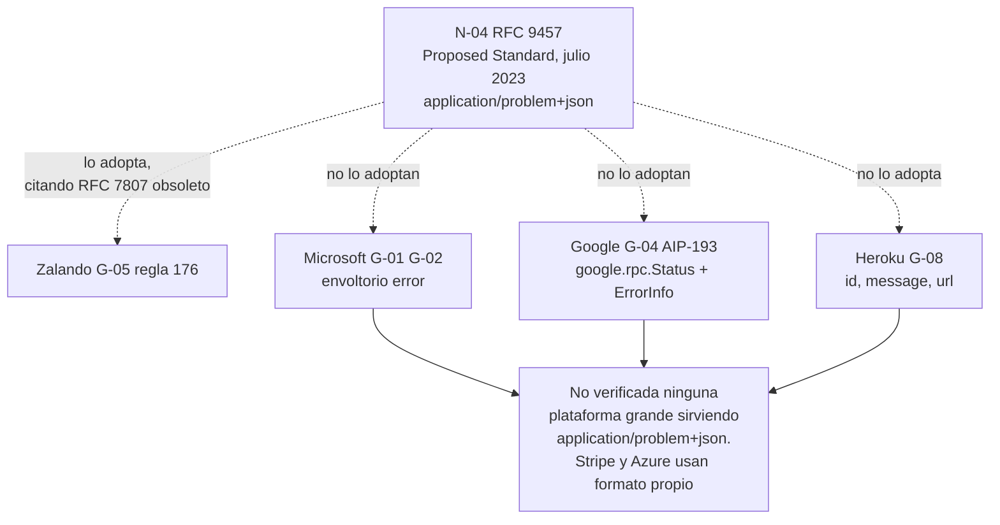

# Manejo de errores — `TEM-ERR`

## Resumen ejecutivo

El cuerpo de un error es la parte del contrato que más se usa cuando algo importa y la que menos se diseña. En `CTX-1` es literalmente la documentación en el momento en que más se la necesita: un integrador que recibe `400` a las tres de la mañana no puede leer el código y no va a esperar a que abra el equipo de soporte. Lo que ese cuerpo diga determina si el problema se resuelve en cinco minutos o en dos días.

Existe una especificación vigente para el formato: `N-04` (RFC 9457, julio de 2023, que obsoleta RFC 7807). Y existe una fragmentación de la industria que las fichas de esta guía verificaron con detalle: **cuatro modelos mutuamente incompatibles**, ninguno de los cuales es superconjunto de otro, sostenidos por Microsoft, Google, Zalando y Heroku. Solo Zalando adopta el estándar del IETF, y lo cita en su versión obsoleta. No se verificó ni una plataforma grande sirviendo `application/problem+json`: ni Stripe ni Azure lo hacen.

Este documento describe el estándar con precisión, expone la fragmentación sin arbitrarla, y trata las tres decisiones que ninguna de las cuatro guías resuelve del todo: cómo se reportan varios errores de validación a la vez, cómo convive un código de error de negocio con el código de estado HTTP, y qué información no puede aparecer en un error aunque el consumidor la quiera.

---

## Definición

El manejo de errores, en el alcance de este documento, es el diseño del **cuerpo** de la respuesta cuando una petición no produce el resultado que buscaba: qué estructura tiene, qué información transporta, qué puede consumir un programa y qué puede leer una persona.

**Qué problema resuelve.** Que el consumidor pueda decidir. Un error útil responde tres preguntas distintas: si el problema es del cliente o del servidor —lo cual determina si tiene sentido reintentar—, cuál de los muchos errores posibles de esa clase ocurrió —lo cual determina qué rama toma el código—, y qué hay que cambiar para que no vuelva a pasar —lo cual determina qué le muestra al usuario o qué escribe en el ticket—. Un cuerpo que responde solo la tercera obliga a parsear texto; uno que responde solo la primera obliga a llamar por teléfono.

**Qué no es.** No es el código de estado. Qué código corresponde a cada situación —`400` frente a `422`, `403` frente a `404`, `409` frente a `412`— lo fija [`TEM-STATUS`](../30-Semantica-HTTP/Codigos-de-Estado.md). Este documento empieza donde ese ya se eligió y trata qué lo acompaña. La separación importa porque el código de estado es lo que consumen la infraestructura, los reintentos y la observabilidad, mientras que el cuerpo es lo que consume el programa cliente y la persona que lo escribió.

Tampoco es el registro de diagnóstico. Lo que el servidor escribe en sus propios logs puede y debe ser más detallado que lo que devuelve; confundir ambas superficies es el origen de la filtración de información que este documento trata al final.

**Con qué se lo confunde.** Con el manejo de excepciones. Una excepción no capturada que se convierte en `500` con la traza adentro no es un diseño de errores: es la ausencia de uno.

---

## RFC 9457 — Problem Details

`N-04` define un formato de datos para transportar detalles de un problema en una respuesta HTTP. Reemplaza a RFC 7807, y esa sustitución es de las que la guía pide detectar por el número: un documento que cite 7807 está desactualizado en ese punto, incluida la regla 176 de Zalando (`G-05`), que lo sigue citando.

**Media types exactos:** `application/problem+json` y `application/problem+xml`.

### Los cinco miembros

| Miembro | Tipo | Semántica según `N-04` §3.1 |
|---|---|---|
| `type` | URI reference | Identifica el **tipo** de problema. Si está ausente, el valor por defecto es **`about:blank`**, y en ese caso la semántica la aporta únicamente el código de estado |
| `title` | string | Resumen humano corto del tipo. **No debería cambiar** entre ocurrencias del mismo problema, salvo por localización |
| `status` | number | El código de estado HTTP. Es **informativo**: debe coincidir con el de la respuesta, y su presencia sirve para detectar alteración por intermediarios |
| `detail` | string | Explicación humana de **esta** ocurrencia. **Debería** orientarse a ayudar al cliente a corregir el problema, no a dar información de depuración. No está pensado para ser parseado |
| `instance` | URI reference | Identifica la ocurrencia concreta. Puede ser opaca o dereferenciable |

Cuatro precisiones que cambian cómo se usa el formato y que suelen perderse.

**`type` es el campo que el programa consume.** La distinción entre `type` y `title` es la de identidad frente a etiqueta: `title` es texto para humanos y puede traducirse; `type` es un identificador estable sobre el que el cliente ramifica. Un cliente que compara el texto de `title` está acoplado a algo que la especificación autoriza a cambiar por localización.

**El `type` no tiene que ser dereferenciable.** `N-04` agrega guía específica sobre URIs `type` que no resuelven a nada. Usar `https://api.ejemplo.com/problemas/capacidad-excedida` como identificador sin publicar una página en esa dirección es legítimo, aunque publicar la página es un servicio real para `ACT-03` y esta guía lo recomienda en `CTX-1`.

**`detail` no debe traer información de depuración.** El texto del RFC es explícito en que **debería** enfocarse en ayudar al cliente a corregir el problema. Es la frase que resuelve, por vía normativa, buena parte de la tensión entre `ACT-03` y `ACT-07`.

**Las extensiones son parte del diseño.** `N-04` §3.2 establece que los tipos de problema pueden definir miembros adicionales y que **los consumidores deben ignorar** los que no reconocen. Esa obligación del consumidor es lo que convierte agregar una extensión en un cambio compatible por diseño de la especificación, garantía que muy pocos formatos de esta guía traen escrita.

**Novedad de 9457 frente a 7807:** el registro **HTTP Problem Types** (§4.2, con política *Specification Required*) y la guía sobre múltiples problemas.

### La ficha con `about:blank`

```json
{ "type": "about:blank", "title": "Not Found", "status": 404 }
```

Es un *problem details* válido y no aporta nada que el código de estado no diga. Su utilidad es formal: permite responder con el media type correcto sin comprometerse a un vocabulario de tipos. Devolverlo sistemáticamente es cumplir la letra de la especificación sin obtener ninguno de sus beneficios.

---

## Los cuatro modelos de la industria

La fragmentación de este tema es, según la verificación de las fichas, la peor del ecosistema de diseño de APIs. Cuatro formatos incompatibles, ninguno superconjunto de otro.

| | **Microsoft** (`G-01`, `G-02`) | **Google** (`G-04` AIP-193) | **Zalando** (`G-05`) | **Heroku** (`G-08`) |
|---|---|---|---|---|
| Estructura | Envoltorio `error` | `google.rpc.Status` | *problem+json* | Objeto plano |
| Miembros | `code`, `message`, `target`, `details[]`, `innererror{}` | `code`, `message`, `details[]` | `type`, `title`, `status`, `detail`, `instance` | `id`, `message`, `url` |
| Identidad del error | `code` string; en Graph, `camelCase` coincidiendo con la descripción del status | Par `(reason, domain)` dentro de `ErrorInfo` | `type` como URI | `id` legible por máquina, p. ej. `rate_limit` |
| Obligatorio adicional | Cabecera `x-ms-error-code` en Azure, con el mismo valor que el `code` de nivel superior | **Todo error debe** incluir un `ErrorInfo` en `details` | — | — |
| Enlace a documentación | — | — | `type` | `url` |
| Fuerza | Prescripción de guía | **MUST** para `ErrorInfo` | **MUST** regla 176 | Prescripción de guía, de facto inactiva |
| Adopta un estándar | No | No | Sí, citando el RFC obsoleto | No |



### Google, y la regla que vale más que el formato

AIP-193 exige que **todo** error incluya un `ErrorInfo` dentro de `details`, con tres campos: `reason` en `UPPER_SNAKE_CASE` con patrón `[A-Z][A-Z0-9_]+[A-Z0-9]` y máximo de 63 caracteres, `domain` como agrupación globalmente única —típicamente el nombre del servicio, del estilo `pubsub.googleapis.com`— y `metadata` con pares clave-valor.

El par `(reason, domain)` es el identificador legible por máquina y **debe ser el mismo** para el mismo error entre llamadas distintas. Y hay una regla que esta guía considera la más aprovechable de todo el AIP, con independencia de si se adopta el formato: toda información contextual que aparezca en el mensaje **debe** estar también como metadato dentro del `ErrorInfo`. La consecuencia es que ningún cliente necesita nunca parsear el texto del mensaje, que es exactamente lo que los clientes hacen cuando el dato solo está ahí.

AIP-193 agrega una precisión de transporte: sobre HTTP y JSON, el campo `code` lleva el código de estado HTTP —404— y no el valor del enum, mientras que `status` lleva el nombre del enum —`NOT_FOUND`—. Es un uso de los dos nombres que no coincide con el de `N-04`, donde `status` es el número.

### Microsoft, y el error en la cabecera

Azure (`G-01`) exige una cabecera de respuesta **`x-ms-error-code`** cuyo valor sea idéntico al `code` de nivel superior del cuerpo. El valor de la duplicación es concreto y vale la pena aunque no se adopte el resto del modelo: una infraestructura intermedia, un tablero de observabilidad o un cliente que hizo `HEAD` pueden clasificar el error sin parsear el cuerpo.

Graph (`G-02`) usa el mismo envoltorio con menos miembros —`code`, `message`, `target`— y prescribe que `code` vaya en `camelCase` coincidiendo con la descripción del código de estado HTTP.

### Heroku, y el enlace

`{id, message, url}` es el modelo más pobre de los cuatro y el único que incluye deliberadamente un enlace a la documentación del error. `ACT-03` lo agradece más de lo que sugiere su simplicidad: convierte cada error en una entrada de documentación alcanzable con un clic.

### Qué hacen las plataformas

Stripe (`P-04`) usa formato propio: un objeto `error` con `type` acotado a cuatro valores —`api_error`, `card_error`, `idempotency_error`, `invalid_request_error`—, más `message`, `code` como cadena corta para manejo programático, `param` con el nombre del parámetro ofensor, y campos de dominio como `decline_code`, `doc_url` y `request_log_url`. Azure usa el suyo. Ninguna de las dos sirve `application/problem+json`.

Que el formato de errores de validación de GitHub, Twilio, Shopify y Atlassian **no esté verificado** por las fichas es un dato que este documento declara: no se afirma nada sobre ellos en ninguna dirección.

### El criterio de esta guía

**Esta guía recomienda `N-04` con extensiones**, y la recomendación se apoya en tres razones antes que en el argumento de autoridad. Es el único formato con especificación vigente, lo que significa que su vocabulario no depende de que una empresa siga manteniendo un documento. Su mecanismo de extensión trae la garantía de compatibilidad escrita en §3.2. Y en ASP.NET Core es el camino de menor resistencia: `ProblemDetails` es un tipo de primera clase de la plataforma (`N-30`), `AddProblemDetails` y `IProblemDetailsService` lo integran en el pipeline (`N-28`, `N-31`), y las respuestas de error automáticas de `[ApiController]` ya lo producen (`N-36`).

La recomendación viene con una advertencia de estado verificada: **ASP.NET Core no adoptó formalmente RFC 9457**. El issue 52414 del repositorio `dotnet/aspnetcore` (`N-63`) que pide ese soporte está **abierto**, con milestone *Backlog* y sin ramas ni pull requests asociados. El tipo `ProblemDetails` de la plataforma es compatible con la estructura de 9457 porque los cinco miembros no cambiaron respecto de 7807, pero la afirmación «ASP.NET Core implementa RFC 9457» no tiene respaldo.

Y una salvedad de contexto: en `CTX-4`, cuando la API se integra en un ecosistema que ya fijó otro formato, el costo de la coherencia supera al del estándar. Un servicio dentro de Azure que devuelva *problem+json* mientras el resto devuelve el envoltorio `error` le complica la vida a `ACT-03` sin comprarle nada.

---

## Errores de validación de múltiples campos

Es el caso que los cuatro modelos resuelven peor y el más frecuente en la práctica: un formulario de reserva con tres campos mal completados debe producir un error que mencione los tres, porque devolver el primero y esperar a que el usuario lo corrija para descubrir el segundo es una experiencia que nadie acepta.

`N-04` **sí lo cubre**, mediante miembros de extensión. El propio RFC incluye un ejemplo con un miembro `errors` que es un array donde cada elemento contiene `detail` para describir el problema y `pointer` para ubicarlo dentro del contenido de la petición, mediante un JSON Pointer.

La estructura del ejemplo del RFC es la que esta guía recomienda, con una adición: **un código estable por error individual**. El `detail` de cada elemento es texto para humanos y puede cambiar; sin un identificador al lado, un cliente que quiera distinguir «la fecha es pasada» de «la fecha excede el horizonte de reserva» tiene que parsear ese texto.

Sobre el localizador hay tres opciones y ninguna guía las arbitra. El `pointer` con JSON Pointer del ejemplo de `N-04` ubica con precisión dentro de estructuras anidadas y arrays, a costa de una sintaxis que el consumidor tiene que conocer. Un nombre de campo plano es legible y no ubica dentro de un array. Y el `param` de Stripe (`P-04`) nombra el parámetro sin comprometerse con la ruta. **Esta guía recomienda el `pointer`** para cuerpos de petición, porque es lo que el ejemplo del estándar usa y porque el nombre plano deja de servir en cuanto hay una colección anidada.

Hay una decisión previa que determina si todo esto sirve: **la validación tiene que acumular**. Un pipeline que aborta en el primer fallo no puede reportar tres errores por más rico que sea el formato de salida. En ASP.NET Core el `ModelState` acumula por diseño y `[ApiController]` produce la respuesta `400` automática a partir de él (`N-36`); en Minimal APIs la validación nativa llegó con .NET 10 mediante `Microsoft.Extensions.Validation` (`N-35`), con limitaciones documentadas —entre ellas, que los tipos de valor anulables declarados como parámetros no se validan (`N-65`)—. La mecánica la trata [`TEM-VALID`](../80-Implementacion-en-NET/Validacion.md).

---

## Código de negocio frente a código de estado

Las fichas verificaron el mismo patrón en dos plataformas que lo resolvieron de forma independiente, Stripe (`P-04`) y Azure (`G-01`): **dos niveles**.

El **código de estado HTTP** expresa la clase del problema. Es lo que consumen los intermediarios, las políticas de reintento y la observabilidad, y es lo que determina si tiene sentido volver a intentar. El **código de error como cadena estable** expresa la identidad del error de negocio. Es sobre lo que el cliente ramifica su lógica.

El segundo nivel existe porque el espacio de códigos HTTP es demasiado chico y está demasiado cargado semánticamente para expresar errores de dominio. Todas estas situaciones son `409 Conflict` en el dominio de reserva de salas: la sala ya está ocupada en ese horario, la reserva ya fue cancelada, hay una reserva recurrente que bloquea el horario, la sala está en mantenimiento. Un cliente que necesita mostrarle al usuario cuál de las cuatro ocurrió no puede obtenerlo del código de estado, y si el único otro dato es un texto en español, va a parsear ese texto.

En un cuerpo de `N-04`, el papel de ese código lo cumple el miembro **`type`**, y esa es una de las razones por las que la especificación lo separa de `title`.

Stripe aporta además un caso que las guías genéricas rara vez ofrecen y que vale como ejemplo de diseño: usa **`402 Request Failed`** para «los parámetros eran válidos pero la operación falló», típicamente un rechazo de tarjeta. Es un uso deliberado de un código casi muerto para distinguir «tu petición estaba mal» —`400`— de «tu petición estaba bien y el mundo dijo que no» —`402`—. La distinción tiene traducción directa al dominio de esta guía: pedir una reserva con un campo mal formado y pedir una reserva impecable sobre una sala ocupada son fallos de naturaleza distinta, y colapsarlos en `400` le quita información al cliente.

---

## El debate del `200` con error adentro

La evidencia verificada es unánime en una dirección y tiene una excepción que conviene entender antes de descartarla.

Stripe (`P-04`) define `200 OK` como *«Everything worked as expected»* y usa códigos `4xx` y `5xx` para todo fallo. Azure (`G-01`) exige una cabecera de error, lo que presupone un código de error. Ninguna de las dos plataformas verificadas devuelve errores con `200`.

Las razones son concretas y no doctrinarias. Los intermediarios —cachés, balanceadores, mallas de servicios— clasifican por código de estado, de modo que una respuesta de error con `200` puede quedar cacheada. Las políticas de reintento de los clientes ramifican por código, y un `200` no dispara ninguna. Y la observabilidad reporta una tasa de error del cero por ciento mientras el servicio falla, que es el modo de falla más caro de todos porque nadie se entera.

La excepción es GraphQL, que devuelve `200` con un miembro `errors` en el cuerpo por diseño, porque una consulta puede tener éxito parcial. El patrón no es un antipatrón en abstracto: es la consecuencia lógica de un protocolo donde una sola petición contiene varias operaciones que pueden fallar de forma independiente. Las fichas de esta guía **no verificaron el texto de la especificación de GraphQL** sobre este punto —`spec.graphql.org` devolvió HTTP 403— y por lo tanto se registra como conocido sin cita primaria.

La conclusión defendible con lo verificado, y la que esta guía sostiene: **para una API REST donde cada petición opera sobre un recurso, la evidencia de las plataformas grandes es unánime a favor de usar códigos de estado de error**. El debate solo tiene contenido real en protocolos con agrupación de operaciones. Y hay un caso intermedio legítimo dentro de REST —la operación por lotes donde algunos elementos se procesan y otros no—, que se resuelve con `207` o con un cuerpo de resultados por elemento y `202`; lo trata [`TEM-STATUS`](../30-Semantica-HTTP/Codigos-de-Estado.md).

---

## Qué no puede aparecer en un error

Acá es donde `ACT-03` y `ACT-07` tiran en direcciones opuestas, y la matriz de [`MARCO-ACTORES`](../00-Marco-de-Referencia/Actores.md) registra el formato de errores como una de las dos filas que más conflicto generan. `ACT-07` tiene poder de veto y es el único actor que lo tiene.

**Nunca, sin excepciones:** trazas de excepción, nombres de clases y de ensamblados, sentencias SQL, cadenas de conexión, nombres de servidores internos, rutas del sistema de archivos, versiones de bibliotecas, credenciales o partes de ellas, y valores de campos con datos personales que el peticionante no está autorizado a ver. Una traza de excepción en un `500` expone la estructura interna del sistema, y a menudo bastante más.

**El caso que exige criterio** es la diferencia entre respuestas. Un `404` que dice «la reserva no existe» y un `403` que dice «la reserva existe pero no es tuya» le confirman a un atacante la existencia del recurso, y con eso convierten un identificador enumerable en un mecanismo de descubrimiento. Google (`G-04`) AIP-193 lo resuelve con una regla dura: si el usuario no tiene permiso sobre el recurso o su padre, **con independencia de que exista o no**, el servicio **debe** fallar con `PERMISSION_DENIED`, que en HTTP es `403`. Es una postura verificada y es una de las dos posibles; la otra —responder `404` uniformemente— tiene el mismo efecto de no filtrar y le da menos información a un usuario legítimo que se equivocó de identificador.

Lo que no funciona es la tercera opción, que es la que sale sola: responder `404` cuando no existe y `403` cuando existe y no corresponde. La diferencia es la filtración.

**El caso que resuelve la tensión** es el identificador de correlación. Un miembro que transporte un identificador de la petición —Heroku (`G-08`) prescribe una cabecera `Request-Id` con un UUID en cada respuesta— le permite a `ACT-03` abrir un ticket con un dato que localiza el evento exacto en los registros del productor, sin que la respuesta contenga nada sensible. Es la forma en que el detalle técnico llega a quien lo necesita por un canal donde `ACT-07` puede controlar el acceso. **Esta guía recomienda** incluirlo en todo error `5xx` y en los `4xx` donde el diagnóstico no sea evidente.

`N-04` ofrece además una vía normativa para la tensión, que es el propio texto de la especificación: `detail` **debería** enfocarse en ayudar al cliente a corregir el problema **en lugar de dar información de depuración**. Un `detail` que respeta esa frase difícilmente filtre nada.

Un detalle de plataforma que conviene conocer: ASP.NET Core distingue el manejo de errores por entorno y la página de excepción de desarrollador no está pensada para producción. Lo tratan `N-28` y `N-29`, y su configuración la trata [`TEM-RESIL`](../70-Seguridad-y-Robustez/Resiliencia.md). El defecto que este documento advierte no es el de la plataforma sino el del código propio que captura una excepción y pone `ex.ToString()` en el `detail` porque durante el desarrollo era cómodo.

---

## Aplicación por escenario

### `ESC-1` — API nueva

El escenario clasifica el formato de errores entre las decisiones caras de postergar, y con razón: cambiar la forma del cuerpo de error de una API publicada rompe a todos los clientes que lo interpretan. Lo que hay que decidir antes del primer endpoint es el formato, el media type, el vocabulario de valores de `type` y quién lo administra.

La trampa específica es la contraria a la del resto de la guía. Acá no se sobrediseña: se subdiseña, porque en `ESC-1` no hay errores todavía y el catálogo de tipos parece vacío. El resultado es una API que devuelve `about:blank` para todo y un vocabulario que se va inventando endpoint por endpoint, con lo cual la organización termina con quince valores de `type` que nombran el mismo problema de tres maneras.

El criterio de esta guía: definir el formato y **el catálogo de tipos como recurso compartido de la API**, no por endpoint. Un signo de que el escenario cerró bien es que existe un ejemplo de respuesta de error por cada operación de la especificación, no solo del camino feliz.

### `ESC-2` — Exposición o migración

El sistema previo tiene su propio vocabulario de errores, casi siempre códigos numéricos con significado histórico, y a menudo la costumbre de devolver éxito con un campo de resultado adentro. Traducirlo es trabajo real y hay que declararlo.

La variante de migración desde SOAP trae un caso propio: los `Fault` de SOAP tienen estructura y el equipo consumidor la conoce. Conservar sus códigos como valores de `type` es legítimo y facilita la migración; conservar el patrón de responder `200` con el fallo adentro reproduce el problema en un protocolo que ofrece una solución mejor, y es exactamente la trampa que el escenario advierte.

Un hallazgo frecuente en este escenario: el sistema previo distingue casos de error que la API nueva colapsa porque el diseñador no sabía que existían. `ACT-05` es quien tiene esa información y conviene pedírsela antes y no después.

### `ESC-3` — Evolución en producción

Cambiar la forma del cuerpo de error rompe. Agregar un miembro de extensión no rompe, y eso está garantizado por `N-04` §3.2, que obliga a los consumidores a ignorar lo que no reconocen. Es una de las pocas garantías de compatibilidad escritas en una especificación de esta familia y conviene aprovecharla: el camino de evolución del formato de errores es agregar extensiones, no reestructurar.

Agregar un valor nuevo de `type` es el caso ambiguo del escenario y merece atención. Formalmente no rompe, porque el cliente que no lo conoce puede caer en su rama por defecto. En los hechos rompe a los clientes que ramifican exhaustivamente sin rama por defecto, que son más de los que uno espera. La mitigación es documentar de entrada que el conjunto de tipos es extensible y qué debe hacer el cliente ante uno desconocido —tratarlo según la clase del código de estado—, que es la misma política que [`TEM-CAMPOS`](Formato-y-Nomenclatura-de-Campos.md) pide para cualquier enumerado.

El cambio que más silenciosamente rompe: cambiar el código de estado de un error existente. Un caso que devolvía `400` y pasa a devolver `422` altera la conducta de reintento de todos los clientes sin cambiar nada del cuerpo.

### `ESC-4` — Evaluación de una API ajena

El barrido de errores es lo que más rápido revela la calidad de una API ajena, y en `ESC-4b` es de las pocas cosas que se pueden hacer sin autorización especial, siempre dentro de los términos de servicio y sin exceder los límites publicados.

Cuatro sondeos ordenados por lo que revelan. Mandar un cuerpo sintácticamente inválido y ver qué devuelve: si viene una traza de excepción, la evaluación de seguridad terminó y el hallazgo es de primer orden. Mandar tres campos inválidos a la vez y contar cuántos reporta: si reporta uno, la validación aborta al primer fallo. Pedir un recurso inexistente y pedir uno existente que no corresponde al peticionante, y comparar las dos respuestas: si difieren, la API filtra existencia. Y provocar el mismo error dos veces para verificar si el identificador de tipo es estable entre ocurrencias.

En `ESC-4a`, la pregunta sobre la especificación es cuántas operaciones declaran sus respuestas de error. La respuesta habitual es que declaran `200` y a lo sumo `400`, y esa omisión es el hallazgo: `ACT-04` no puede probar caminos de fallo que nadie especificó, y es donde la divergencia entre especificación e implementación es mayor.

### Qué cambia según el contexto

| Contexto | Qué cambia en este tema |
|---|---|
| `CTX-1` pública | El error **es** la documentación en el momento crítico. Corresponde publicar el catálogo de tipos, hacer dereferenciables las URIs de `type`, incluir identificador de correlación y localizar los textos humanos. `ACT-07` interviene con veto sobre cada dato que aparezca |
| `CTX-2` interna | El cuerpo puede ser más informativo porque el consumidor está dentro del perímetro, y aun así los datos personales siguen vetados. Lo que gana peso es la propagación del contexto de traza, que es la preocupación propia del contexto |
| `CTX-3` backend de app propia | Aparece una tentación específica: poner en `detail` el texto que la aplicación va a mostrarle al usuario. Eso acopla la presentación al backend y rompe la localización del lado del cliente. Lo correcto es un `type` estable sobre el que el cliente elija su propio texto |
| `CTX-4` integración | Los errores ajenos se traducen a los propios en la frontera. Dejar que el código de error del proveedor circule por el dominio es el riesgo dominante del contexto en su forma más pura: cambiar de proveedor pasa a ser una reescritura |

---

## Ejemplos concretos

Ejemplos **sintéticos** del dominio de reserva de salas.

### Validación de múltiples campos

```http
POST /v1/reservas HTTP/1.1
Host: api.salas.ejemplo.com
Content-Type: application/json

{
  "salaId": "s-auditorio-norte",
  "inicioLocal": "2026-07-01T09:00:00",
  "finLocal": "2026-07-01T08:00:00",
  "asistentesEsperados": 350
}
```

```http
HTTP/1.1 422 Unprocessable Content
Content-Type: application/problem+json
x-correlacion: 9f2b41c8-7d3a-4e11-9a55-6c0b2f1e8d47

{
  "type": "https://api.salas.ejemplo.com/problemas/validacion",
  "title": "La solicitud tiene campos inválidos",
  "status": 422,
  "detail": "Se encontraron 3 problemas en la solicitud.",
  "instance": "/v1/reservas",
  "correlacion": "9f2b41c8-7d3a-4e11-9a55-6c0b2f1e8d47",
  "errores": [
    {
      "pointer": "/inicioLocal",
      "codigo": "fecha_en_el_pasado",
      "detail": "El inicio debe ser posterior al momento actual."
    },
    {
      "pointer": "/finLocal",
      "codigo": "rango_invertido",
      "detail": "El fin debe ser posterior al inicio."
    },
    {
      "pointer": "/asistentesEsperados",
      "codigo": "capacidad_excedida",
      "detail": "La sala admite 120 personas y se solicitaron 350.",
      "maximo": 120
    }
  ]
}
```

El miembro `errores` es una extensión de `N-04` §3.2, con la forma del ejemplo del propio RFC —`pointer` más `detail` por elemento— y dos adiciones de esta guía. El `codigo` por elemento es lo que le permite al cliente ramificar sin parsear texto; el `maximo` es el dato contextual que, siguiendo el criterio de AIP-193 que esta guía adopta, viaja como campo y no solo dentro de la frase.

El identificador de correlación aparece en la cabecera y en el cuerpo. La duplicación es deliberada: la cabecera la lee la infraestructura, el cuerpo lo copia la persona que abre el ticket.

La elección de `422` frente a `400` corresponde a [`TEM-STATUS`](../30-Semantica-HTTP/Codigos-de-Estado.md); el nombre correcto del código en `N-01` es **Unprocessable Content**, no *Unprocessable Entity* como lo llamaba RFC 4918.

### Conflicto de negocio: cuatro casos, un mismo código de estado

```http
POST /v1/reservas HTTP/1.1
Content-Type: application/json

{ "salaId": "s-auditorio-norte", "inicioLocal": "2026-08-14T09:00:00", "finLocal": "2026-08-14T10:30:00" }
```

```http
HTTP/1.1 409 Conflict
Content-Type: application/problem+json

{
  "type": "https://api.salas.ejemplo.com/problemas/solapamiento-de-horario",
  "title": "El horario solicitado se superpone con otra reserva",
  "status": 409,
  "detail": "La sala s-auditorio-norte tiene una reserva confirmada de 08:30 a 09:45 el 2026-08-14.",
  "instance": "/v1/reservas",
  "salaId": "s-auditorio-norte",
  "reservaEnConflicto": "r-3388",
  "proximoHorarioLibre": "2026-08-14T09:45:00"
}
```

El `type` es lo que distingue este `409` de `sala-en-mantenimiento`, de `reserva-ya-cancelada` y de `bloqueo-por-recurrencia`, que devuelven el mismo código de estado. Las tres extensiones al final transportan como campos la información que el `detail` menciona en prosa, de modo que el cliente puede ofrecer «reservar a las 09:45» sin leer la frase. El `proximoHorarioLibre` es, además, el tipo de dato que convierte un error en algo accionable, y es un aporte de `ACT-05` que ningún formato prescribe.

### Cancelación fuera de plazo

```http
DELETE /v1/reservas/r-3391 HTTP/1.1
```

```http
HTTP/1.1 422 Unprocessable Content
Content-Type: application/problem+json

{
  "type": "https://api.salas.ejemplo.com/problemas/antelacion-insuficiente",
  "title": "La cancelación requiere más antelación",
  "status": 422,
  "detail": "Esta reserva admite cancelación hasta 24 horas antes del inicio. Faltan 6 horas.",
  "antelacionRequeridaHoras": 24,
  "antelacionRestanteHoras": 6,
  "instance": "/v1/reservas/r-3391"
}
```

### Lo que un error no debe contener

```json
{
  "type": "about:blank",
  "title": "Internal Server Error",
  "status": 500,
  "detail": "System.Data.SqlClient.SqlException: Timeout expired. Server=sql-prod-03.interno.ejemplo.com;Database=SalasProd;User Id=svc_api;...\n   at Salas.Infra.ReservaRepository.Guardar(Reserva r) in C:\\build\\src\\Infra\\ReservaRepository.cs:line 212"
}
```

Nombre del servidor, nombre de la base, usuario de servicio, versión del proveedor de acceso a datos, estructura de espacios de nombres y ruta absoluta del código fuente en la máquina de construcción. Cada uno es un dato que `ACT-07` no autorizó a publicar y que no le sirve a `ACT-03` para nada, porque no puede actuar sobre ninguno.

La forma correcta del mismo evento:

```http
HTTP/1.1 500 Internal Server Error
Content-Type: application/problem+json
x-correlacion: 9f2b41c8-7d3a-4e11-9a55-6c0b2f1e8d47

{
  "type": "https://api.salas.ejemplo.com/problemas/error-interno",
  "title": "Error interno del servicio",
  "status": 500,
  "detail": "La solicitud no pudo procesarse. Reintentá en unos instantes; si persiste, reportá el identificador de correlación.",
  "correlacion": "9f2b41c8-7d3a-4e11-9a55-6c0b2f1e8d47"
}
```

La traza completa va a los registros del productor, indexada por ese mismo identificador. `ACT-03` obtiene lo único que puede usar —si reintentar y qué informar— y `ACT-07` no cede nada.

### El error que filtra existencia

Los tres intercambios siguientes son sobre reservas que el peticionante no puede ver:

```http
GET /v1/reservas/r-9999 → 404  { "detail": "La reserva r-9999 no existe." }
GET /v1/reservas/r-3391 → 403  { "detail": "La reserva no pertenece a tu organización." }
```

La diferencia entre ambas respuestas convierte la enumeración de identificadores en un mapa de qué reservas existen. La postura verificada de `G-04` AIP-193 responde `403` en los dos casos; responder `404` en los dos tiene el mismo efecto protector. Lo que no vale es la mezcla.

### Implementación en ASP.NET Core

```csharp
// Sintético. Catálogo de tipos centralizado: un solo lugar donde vive el vocabulario.
public static class TiposDeProblema
{
    private const string Base = "https://api.salas.ejemplo.com/problemas/";
    public const string Validacion            = Base + "validacion";
    public const string Solapamiento          = Base + "solapamiento-de-horario";
    public const string CapacidadExcedida     = Base + "capacidad-excedida";
    public const string AntelacionInsuficiente = Base + "antelacion-insuficiente";
    public const string ErrorInterno          = Base + "error-interno";
}

builder.Services.AddProblemDetails(opciones =>
{
    // Se agrega a TODA respuesta de problema, incluidas las que genera la plataforma.
    opciones.CustomizeProblemDetails = ctx =>
    {
        var correlacion = ctx.HttpContext.TraceIdentifier;
        ctx.ProblemDetails.Extensions["correlacion"] = correlacion;
        ctx.ProblemDetails.Instance ??= ctx.HttpContext.Request.Path;
        ctx.HttpContext.Response.Headers["x-correlacion"] = correlacion;   // criterio de G-01
    };
});
```

El manejador de excepciones no propaga nada de la excepción hacia afuera:

```csharp
public sealed class ManejadorDeExcepciones(ILogger<ManejadorDeExcepciones> log) : IExceptionHandler
{
    public async ValueTask<bool> TryHandleAsync(
        HttpContext ctx, Exception ex, CancellationToken ct)
    {
        // Todo el detalle va al registro, indexado por el mismo identificador que ve el cliente.
        log.LogError(ex, "Fallo no controlado. Correlación {Correlacion}", ctx.TraceIdentifier);

        var problema = new ProblemDetails
        {
            Type = TiposDeProblema.ErrorInterno,
            Title = "Error interno del servicio",
            Status = StatusCodes.Status500InternalServerError,
            Detail = "La solicitud no pudo procesarse. Reintentá en unos instantes; " +
                     "si persiste, reportá el identificador de correlación."
            // Nada de 'ex' cruza esta frontera. Ni el mensaje, ni el tipo, ni la traza.
        };

        ctx.Response.StatusCode = problema.Status.Value;
        await ctx.Response.WriteAsJsonAsync(problema, ct);
        return true;
    }
}
```

El error de negocio se construye con su vocabulario y sus datos contextuales:

```csharp
private static ProblemHttpResult Solapamiento(Reserva conflicto, DateTime proximoLibre) =>
    TypedResults.Problem(
        type: TiposDeProblema.Solapamiento,
        title: "El horario solicitado se superpone con otra reserva",
        detail: $"La sala {conflicto.SalaId} tiene una reserva confirmada de " +
                $"{conflicto.InicioLocal:HH:mm} a {conflicto.FinLocal:HH:mm}.",
        statusCode: StatusCodes.Status409Conflict,
        extensions: new Dictionary<string, object?>
        {
            ["salaId"] = conflicto.SalaId,
            ["reservaEnConflicto"] = conflicto.Id,          // el dato, no solo la frase
            ["proximoHorarioLibre"] = proximoLibre
        });
```

Un detalle de plataforma con consecuencia operativa: desde .NET 10, un `IExceptionHandler` que devuelve `true` **suprime los registros y las métricas** que el pipeline habría emitido (`N-29`). El ejemplo registra explícitamente por esa razón; un manejador que devuelva `true` sin registrar deja el fallo invisible para la observabilidad, que es el peor resultado posible de un manejo de errores.

La forma exacta de estas invocaciones corresponde a la superficie que documentan `N-28`, `N-29`, `N-30` y `N-31`; los ejemplos ilustran el contrato resultante y no se verificaron contra el SDK.

---

## Preguntas guía

- ¿Puedo enumerar los tipos de error que mi API devuelve, o los descubro leyendo el código?
- ¿Un cliente puede distinguir dos errores distintos que comparten código de estado sin parsear texto en español?
- Si tres campos vienen mal, ¿mi API los reporta los tres? ¿O la validación aborta en el primero?
- ¿Qué devuelve mi API ante una excepción no controlada? ¿Lo probé, o supongo?
- ¿La respuesta a «no existe» y la respuesta a «existe y no es tuyo» son distinguibles desde afuera?
- ¿Un integrador que recibe un `500` a las tres de la mañana tiene algo que ponerle al ticket?
- ¿Cuántas de mis operaciones declaran sus respuestas de error en la especificación OpenAPI?
- ¿El texto de `detail` está pensado para que el cliente corrija el problema, o para que un desarrollador depure?

---

## Criterios de calidad

Un manejo de errores está bien resuelto cuando el consumidor puede ramificar su lógica sobre un identificador estable, cuando obtiene en una sola respuesta todo lo que tiene que corregir, cuando la información que necesita para reportar un incidente está presente y la que podría comprometer al productor no lo está, y cuando la especificación declara los errores de cada operación con el mismo detalle que el camino feliz.

### Antipatrones

**`200` con el error adentro.** El código de estado es lo que consumen los intermediarios, los reintentos y la observabilidad. Con `200`, la tasa de error reportada es cero mientras el servicio falla.

**La traza de excepción en el cuerpo.** Expone estructura interna, versiones, rutas y a veces credenciales. Le sirve al atacante y no le sirve a `ACT-03`, que no puede actuar sobre ninguno de esos datos.

**El error como cadena suelta.** `"Error al procesar la reserva"` obliga a parsear texto y no sobrevive a una traducción.

**Un formato de error por endpoint.** El síntoma de que nadie decidió: cada `ACT-02` resolvió el suyo. El consumidor escribe un manejador por operación.

**Reportar solo el primer error de validación.** No es un problema del formato sino del pipeline que aborta al primer fallo, y ningún cuerpo rico lo compensa.

**Filtrar existencia por la diferencia entre respuestas.** `404` cuando no existe y `403` cuando existe y no corresponde convierte los identificadores en un mapa.

**El `type` como texto legible.** Es un identificador, no una etiqueta. Cambiarlo por localización rompe a los clientes que ramifican sobre él; para eso está `title`.

**Citar RFC 7807.** Obsoleto desde julio de 2023, reemplazado por `N-04`. Se detecta mirando el número, y lo hace hasta la regla 176 de `G-05`.

**El `detail` como texto de interfaz.** Acopla la presentación al backend y rompe la localización del lado del cliente. Es el riesgo específico de `CTX-3`.

**El error que no dice qué hacer.** «Solicitud inválida» sin decir qué campo ni por qué obliga a un intercambio de correos por cada integración.

**El manejador que devuelve `true` sin registrar.** Desde .NET 10 eso suprime registros y métricas (`N-29`): el fallo ocurre y no queda constancia en ningún lado.

---

## Anexo — Catálogo de tipos de problema

Se mantiene por API, no por endpoint, y es responsabilidad de `ACT-01`. Se revisa con `ACT-07` antes de publicar cada entrada nueva. Cuando la API es de `CTX-1`, cada URI de `type` debería resolver a una página de documentación.

```yaml
formato:
  estandar: RFC-9457 | microsoft | google | heroku | propio
  media_type: application/problem+json
  cabecera_de_codigo_de_error: ""      # x-ms-error-code o equivalente; "ninguna" es válido
  identificador_de_correlacion:
    en_cuerpo: si | no
    en_cabecera: ""
  extension_de_validacion:
    miembro: errores
    localizador: pointer | nombre-de-campo | param
    codigo_estable_por_error: si | no

catalogo:
  - type: "https://…/problemas/validacion"
    status: 422
    title: ""
    cuando: ""                          # condición exacta que lo dispara
    extensiones: [errores]
    accionable_por_el_cliente: si | no
    url_publicada: si | no
    aprobado_por_ACT-07: si | no

politica_de_evolucion:
  conjunto_de_types: cerrado | extensible
  conducta_cliente_ante_type_desconocido: ""   # obligatorio si es extensible

prohibido_en_el_cuerpo:
  - traza-de-excepcion
  - nombres-de-clase-o-ensamblado
  - sentencias-SQL
  - nombres-de-servidor-o-base
  - rutas-de-archivo
  - versiones-de-bibliotecas
  - datos-personales-no-autorizados

decisiones_de_no-filtracion:
  recurso-inexistente-vs-sin-permiso: 403-uniforme | 404-uniforme | DIFERENCIADO
  # 'DIFERENCIADO' es un hallazgo de seguridad, no una opción

verificacion:
  errores_declarados_en_openapi: ""      # cuántas operaciones sobre el total
  probado_con_entrada_malformada: si | no
  probado_con_varios_campos_invalidos: si | no
  probado_recurso_ajeno: si | no
```

Dos filas concentran el valor de la ficha. `aprobado_por_ACT-07` obliga a que el veto se ejerza cuando el error se diseña y no cuando ya está publicado, que es la falla que el propio actor tiene registrada en [`MARCO-ACTORES`](../00-Marco-de-Referencia/Actores.md): intervenir tarde produce un requisito de seguridad rompiente que se negocia como excepción y la excepción se vuelve permanente. Y `errores_declarados_en_openapi` expresado como fracción es el indicador más honesto de la madurez del manejo de errores de una API: en la mayoría de los casos el numerador sorprende a quien no lo había contado.
