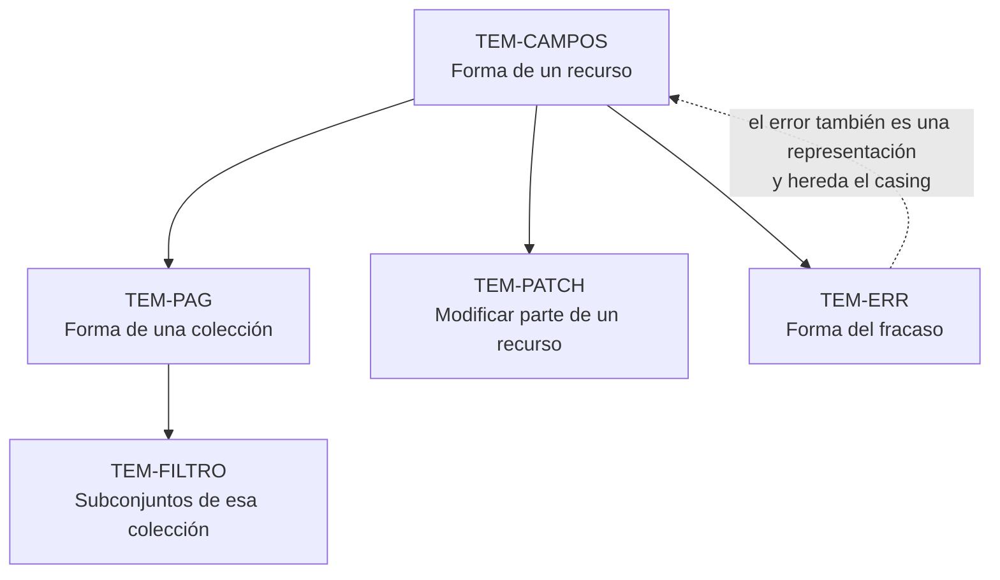

# Contratos y representaciones — `FAM-CON`

## La pregunta que responde esta familia

**¿Qué forma tiene lo que viaja por el cable?**

[`FAM-REC`](../20-Diseno-de-Recursos/) decidió qué cosas existen y cómo se llaman sus URIs. [`FAM-HTTP`](../30-Semantica-HTTP/) decidió con qué método se las manipula y qué código de estado devuelve cada resultado. Queda el contenido: los bytes concretos que el servidor escribe en el cuerpo de la respuesta y el consumidor deserializa en su modelo. Un campo se llama `fechaInicio` o `fecha_inicio`; una colección viene envuelta en `data` o llega como array desnudo; el enlace a la página siguiente vive en una cabecera o en el cuerpo; un error de validación devuelve un texto o una estructura que el cliente puede recorrer campo por campo.

Ninguna de esas decisiones es visible en el modelo de recursos ni en la elección de métodos, y todas son igual de rompientes. Un consumidor que deserializa `fechaInicio` deja de funcionar el día que el campo pasa a `fecha_inicio`, con el mismo estruendo con que dejaría de funcionar si le cambiaran la ruta.

Lo que distingue a esta familia del resto de la guía es la **desproporción entre lo normativo y lo prescrito**. Sobre errores existe un RFC vigente, `N-04` (RFC 9457), y sobre modificación parcial existen tres, `N-05`, `N-06` y `N-07`. Sobre el casing de los campos JSON no existe absolutamente nada normativo, y las guías de organización se contradicen de forma frontal: Microsoft exige `camelCase` en `G-01` y `G-02`, Zalando exige `snake_case` en la regla 118 de `G-05` con la fórmula literal *«never camelCase»*. No hay reconciliación posible. Elegir una es descartar la otra.

---

## Documentos

| ID | Documento | Responde |
|----|-----------|----------|
| `TEM-CAMPOS` | [Formato y nomenclatura de campos](Formato-y-Nomenclatura-de-Campos.md) | ¿Cómo se llaman y de qué tipo son los campos del JSON? |
| `TEM-PAG` | [Colecciones y paginación](Colecciones-y-Paginacion.md) | ¿Qué forma tiene una lista y cómo se recorre cuando no entra en una respuesta? |
| `TEM-FILTRO` | [Filtrado, orden y selección](Filtrado-Orden-y-Seleccion.md) | ¿Cómo pide el consumidor un subconjunto de esa lista, y solo los campos que le sirven? |
| `TEM-PATCH` | [Actualizaciones parciales](Actualizaciones-Parciales.md) | ¿Cómo se cambia parte de un recurso sin reenviarlo entero? |
| `TEM-ERR` | [Manejo de errores](Manejo-de-Errores.md) | ¿Qué hay en el cuerpo cuando algo salió mal? |

El orden de lectura no es indiferente. `TEM-CAMPOS` fija decisiones —casing, tipos, envoltorio— que los otros cuatro documentos dan por tomadas: la forma de una colección paginada hereda el casing de los campos, y un cuerpo de error es una representación más que se somete a las mismas reglas. La flecha punteada señala la incoherencia más frecuente en producción, y una que se ve a simple vista: una API que devuelve recursos en `camelCase` y errores en `snake_case` porque el formato de error lo copió de una guía distinta de la que usó para el resto.

---

## Relación con las otras familias

**Con [`FAM-REC`](../20-Diseno-de-Recursos/) — diseño de recursos.** El reparto está fijado en el índice de esa familia y conviene repetirlo acá porque es la frontera que más se cruza: el casing de los **segmentos de URI** lo trata [`TEM-URI`](../20-Diseno-de-Recursos/Nomenclatura-de-URIs.md), el casing de los **campos JSON y de los parámetros de query** lo trata [`TEM-CAMPOS`](Formato-y-Nomenclatura-de-Campos.md). Que la decisión esté partida en dos documentos refleja un hecho del material: Zalando (`G-05`) prescribe deliberadamente tres casings distintos según la capa —`kebab-case` en paths por la regla 129, `snake_case` en query por la 130, `snake_case` en JSON por la 118— y presentarlo como una sola decisión sería falsear la fuente.

**Con [`FAM-HTTP`](../30-Semantica-HTTP/) — semántica HTTP.** El reparto es entre continente y contenido. Qué código de estado corresponde a un fallo de validación lo fija [`TEM-STATUS`](../30-Semantica-HTTP/Codigos-de-Estado.md); qué va en el cuerpo que acompaña a ese código lo fija [`TEM-ERR`](Manejo-de-Errores.md). La semántica de `PATCH` como método —que `N-05` declara ni seguro ni idempotente— la fija [`TEM-METODOS`](../30-Semantica-HTTP/Metodos.md); qué formato de documento de parche se manda y con qué media type lo fija [`TEM-PATCH`](Actualizaciones-Parciales.md). Y la cabecera `Link` de `N-10` la describe [`TEM-HEADERS`](../30-Semantica-HTTP/Cabeceras-y-Negociacion.md); cuándo conviene poner ahí el enlace a la página siguiente en lugar de en el cuerpo lo discute [`TEM-PAG`](Colecciones-y-Paginacion.md).

**Con [`FAM-EVO`](../50-Evolucion-y-Versionado/) — evolución.** Todo lo que decide esta familia es contrato, y por lo tanto rompible. Renombrar un campo, cambiar el tipo de uno existente, agregar un valor a un enumerado o pasar de un array desnudo a un objeto con envoltorio son cambios cuyo carácter rompiente se analiza en [`TEM-BREAK`](../50-Evolucion-y-Versionado/Compatibilidad-y-Cambios-Rompientes.md). La conexión más útil es la asimetría: `N-04` §3.2 establece que los consumidores de *problem details* **deben ignorar** los miembros de extensión que no reconocen, lo que convierte agregar una extensión en un cambio compatible por diseño de la especificación. Muy pocos formatos de esta familia traen esa garantía escrita.

**Con [`FAM-NET`](../80-Implementacion-en-NET/) — implementación.** La frontera es entre qué conviene y cómo se consigue. Esta familia decide que los campos van en `camelCase` o en `snake_case`; [`TEM-SERIAL`](../80-Implementacion-en-NET/Serializacion-Con-System-Text-Json.md) explica cómo se configura `System.Text.Json` para producirlo, qué implica `JsonSerializerDefaults.Web` (`N-39`) y qué cambió en .NET 10 con `Strict` y `AllowDuplicateProperties` (`N-41`). Los ejemplos de C# que aparecen en esta familia son ilustrativos del contrato resultante, no la referencia de configuración.

---

## Cómo entra cada actor

| Actor | Qué le toca en esta familia |
|---|---|
| `ACT-01` arquitecto | Decide. Nomenclatura de campos, formato de errores y criterio de paginación son tres de sus filas vinculantes en la matriz de [`MARCO-ACTORES`](../00-Marco-de-Referencia/Actores.md) |
| `ACT-03` consumidor | La voz más informada y la menos escuchada. Es quien descubre que el error no distingue casos que su cliente necesita distinguir, y que la paginación no sirve para el uso real |
| `ACT-07` seguridad | Poder de veto sobre qué información puede aparecer en un cuerpo de error, y sobre qué campos con datos personales se exponen. Tira en dirección opuesta a `ACT-03` |
| `ACT-02` productor | Ejecuta y erosiona: cada endpoint es una oportunidad de devolver un error con forma propia porque era más rápido |
| `ACT-04` QA | Verifica campo por campo que la respuesta real coincida con el esquema publicado, y que los caminos de fallo devuelvan lo que la especificación declara |

La fila «formato de errores» de la matriz de actores es la que más conflicto genera de toda la guía, y el conflicto es legítimo: `ACT-03` necesita un error que le permita diagnosticar sin abrir un ticket, `ACT-07` necesita que ese mismo error no le confirme a un atacante la existencia de un recurso ni le describa la estructura interna. [`TEM-ERR`](Manejo-de-Errores.md) trata esa tensión sin fingir que se resuelve con una regla general.

---

## Advertencia de nivel de autoridad

El estado de la materia, tema por tema:

- **Errores.** Hay norma vigente, `N-04` (RFC 9457, julio de 2023, que obsoleta RFC 7807), y la industria la ignora. Se verificaron cuatro modelos mutuamente incompatibles en producción o en guía: el envoltorio `error` de Microsoft (`G-01`, `G-02`), `google.rpc.Status` con `ErrorInfo` obligatorio (`G-04` AIP-193), *problem+json* en Zalando (`G-05` regla 176, que además sigue citando el RFC obsoleto) y `{id, message, url}` de Heroku (`G-08`). No se verificó ni una plataforma grande sirviendo `application/problem+json`: ni Stripe ni Azure lo hacen.
- **Modificación parcial.** Hay tres RFC —`N-05`, `N-06`, `N-07`—, con media types registrados y semánticas distintas y bien definidas. Es el tema mejor especificado de la familia y uno de los peor implementados.
- **Casing de campos.** No hay norma. Solo guías que se contradicen y una decisión excluyente.
- **Paginación.** No hay norma sobre nombres de parámetros ni sobre forma de la respuesta. `N-10` estandariza la cabecera `Link` y `N-11` registra las relaciones `next`, `prev`, `first` y `last`, pero la mayoría del ecosistema pone la navegación en el cuerpo. Sí hay evidencia dura sobre el costo técnico del `OFFSET` grande, en `O-05`.
- **Filtrado.** Tres convenciones incompatibles —OData (`N-21` para la 4.01, `F-05` para la 4.02 que todavía es draft), JSON:API (`F-04`) y `G-04` AIP-160— y ninguna plataforma grande verificada adopta ninguna de las tres. JSON:API reserva el parámetro `filter` sin definirle sintaxis.

De ahí sale el criterio de lectura que esta familia pide: cuando un documento diga «se recomienda X», hay que poder ver de quién es la recomendación. Donde la respuesta sea «de esta guía», está escrito con esa fórmula y es discutible.
