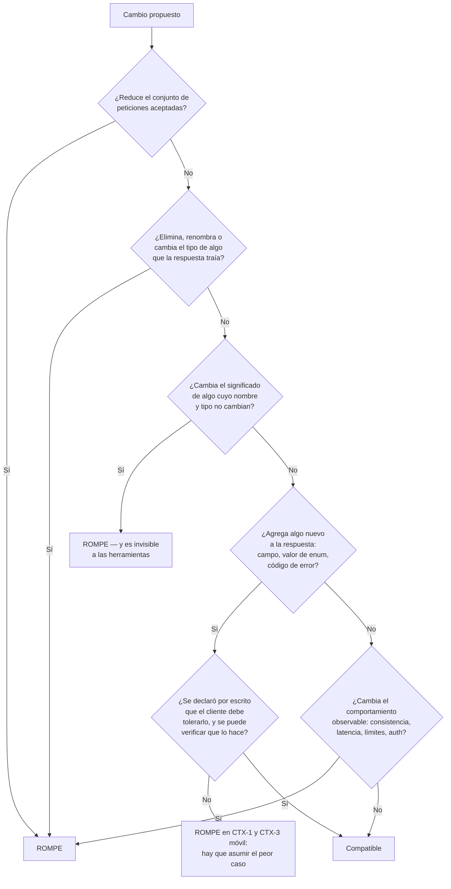

# Compatibilidad y cambios rompientes — `TEM-BREAK`

## 1. Resumen ejecutivo

Un cambio es rompiente cuando un cliente que funcionaba antes deja de funcionar después sin haber cambiado él. La definición cabe en una línea y produce respuestas incómodas: agregar un campo obligatorio a una petición rompe, agregar un valor a un enumerado rompe a buena parte de los clientes, y endurecer una validación laxa rompe a quien dependía de la laxitud. La intuición de que agregar es seguro es falsa, y `MARCO-ESCENARIOS` la registra como la trampa característica de `ESC-3`.

La pregunta tiene respuesta técnica, no opinable, y ese es el aporte central de este documento. La respuesta depende de dos cosas: de qué lado del intercambio ocurre el cambio —petición o respuesta— y de qué hace el cliente con lo que no reconoce. La segunda mitad es la que se olvida, y es la que hace que la misma modificación rompa a un consumidor y no a otro.

El documento incluye la tabla exhaustiva cambio → ¿rompe? → por qué, que es el instrumento operativo del tema, y sitúa el principio de robustez de Postel en su estado actual: `N-14` —RFC 9413, del IAB, junio de 2023— lo somete a una revisión sustantiva, y presentarlo como buena práctica sin matices está desactualizado.

Le sirve a `ACT-02`, que necesita responder «¿este cambio que estoy por hacer rompe a alguien?» antes de hacerlo; a `ACT-04`, que tiene que probar precisamente lo que la especificación no dice; y a `ACT-06`, que decide sobre la base de esta respuesta si hay que publicar una versión.

---

## 2. Definición

**Compatibilidad hacia atrás** es la propiedad por la cual un cliente escrito contra el contrato de ayer sigue funcionando contra el servidor de hoy sin modificaciones. **Cambio rompiente** —*breaking change*— es cualquier modificación que la viola.

La violación puede tomar tres formas, y distinguirlas ayuda a diagnosticar:

**Fallo duro.** El cliente recibe un error donde antes recibía éxito, o una excepción al deserializar. Es el caso benigno, porque se ve.

**Fallo silencioso.** El cliente sigue recibiendo `200 OK` y sigue procesando, pero el resultado es incorrecto. Ocurre cuando cambia la semántica de un campo sin cambiar su nombre ni su tipo, o cuando desaparece un elemento que el cliente leía como opcional y ahora asume vacío. Es el caso caro: se detecta semanas después, en los datos.

**Fallo diferido.** Nada se rompe hasta que aparece un dato que ejercita el camino nuevo. El ejemplo canónico es el valor agregado a un enumerado: el cliente funciona con normalidad hasta que llega la primera reserva con el estado nuevo.

El problema que resuelve razonar sobre esto es concreto: decidir si un cambio requiere una versión nueva, que es la pregunta que [`TEM-VERS`](Estrategias-de-Versionado.md) presupone resuelta.

### Qué no es

**No es una propiedad del cambio solo.** Es una relación entre el cambio y el comportamiento de los clientes reales. Agregar un campo a una respuesta es compatible frente a un cliente que ignora lo que no conoce, y rompiente frente a uno que deserializa con validación estricta y rechaza miembros desconocidos. Por eso una tabla de rupturas es útil y no suficiente: hay que saber además cómo se comportan los consumidores, y en `CTX-1` eso no se sabe, lo que obliga a asumir el peor caso.

**No es lo mismo que compatibilidad hacia adelante.** La compatibilidad hacia atrás protege al cliente viejo frente al servidor nuevo. La compatibilidad hacia adelante —que el cliente nuevo tolere un servidor viejo— importa cuando el orden de despliegue no está garantizado, típicamente en `CTX-2`. Este documento trata la primera salvo donde se indique.

**No es una decisión de política.** Que un cambio rompa es un hecho técnico. Que se haga igual es una decisión, y le corresponde a `ACT-06` según la matriz de [`MARCO-ACTORES`](../00-Marco-de-Referencia/Actores.md). Confundir ambos planos produce la discusión más estéril del tema, en la que alguien argumenta que un cambio «no debería» romper porque hacerlo es inconveniente.

**No es un problema que las herramientas resuelvan solas.** Un comparador de documentos OpenAPI detecta las rupturas estructurales y ninguna de las semánticas. La detección automática la trata [`TEM-CLIENTES`](../60-Especificacion-y-Documentacion/Clientes-y-Pruebas-de-Contrato.md); acá se define qué es lo que hay que detectar.

---

## 3. Aplicación por escenario

### `ESC-1` — API nueva

Sin consumidores no hay nada que romper, y esa es exactamente la razón por la que este documento importa en `ESC-1`. Las decisiones que determinan **cuánto va a costar cambiar después** se toman todas acá, y son las que §4.5 desarrolla: campos opcionales por defecto, enumerados diseñados para admitir valores nuevos, ausencia de compromisos implícitos sobre orden, y un contrato que declara por escrito de qué no se puede depender.

Una API nueva que se diseñó sin pensar en esto llega a `ESC-3` con un contrato donde casi cualquier evolución es rompiente, y ahí el versionado deja de ser una herramienta y pasa a ser la única salida. El corolario de `MARCO-ESCENARIOS` —toda API de `ESC-1` termina en `ESC-3`, normalmente antes de lo previsto— tiene su consecuencia más concreta en este documento.

La contraparte, y la trampa de `ESC-1`, es diseñar todo tan tolerante que el contrato no diga nada: campos todos opcionales, tipos todos permisivos, enumerados todos abiertos. Esa API se puede cambiar sin romper nada porque nunca prometió nada, y el costo lo paga el consumidor, que tiene que defenderse de todo.

### `ESC-2` — Exposición o migración

La compatibilidad hacia atrás relevante acá es respecto del **contrato previo**, no de una versión anterior de la API nueva. La decisión de fondo es cuánta de la incompatibilidad se acepta de entrada, y `MARCO-ESCENARIOS` es explícito: si el contrato viejo se va a conservar tal cual, migrar no aporta.

La ruptura que este escenario produce y que nadie anota es la del modelo interno filtrado. Cuando la API expuso los campos del sistema de respaldo tal como estaban —el caso de `TB_RESERVA_CAB` que `MARCO-ESCENARIOS` usa como ejemplo—, cualquier refactorización interna posterior se vuelve rompiente hacia afuera. La traducción explícita entre modelo público e interno, que desde afuera parece trabajo redundante, es exactamente lo que compra la libertad de cambiar por dentro sin romper por fuera.

### `ESC-3` — Evolución en producción

El escenario del documento, y donde la tabla de §4.1 se usa a diario. `MARCO-ESCENARIOS` enumera la trampa con tres ejemplos que son los tres casos contraintuitivos de §4.2: campo obligatorio agregado a la petición, valor nuevo en un enumerado, validación endurecida.

Lo que agrega este escenario es una asimetría de información. El productor sabe qué cambió; no sabe de qué dependían los clientes. `MARCO-ACTORES` lo señala al describir el modo de fallar de `ACT-03`: acoplarse a detalles no garantizados —el orden de una colección sin `sort`, la forma exacta del texto de un error, un campo no documentado que apareció en la respuesta— y descubrir la ruptura cuando el productor hizo un cambio que consideraba compatible.

De ahí se sigue un criterio práctico: en `ESC-3` la pregunta no es solo «¿esto rompe según la tabla?» sino «¿de esto podía depender alguien, aunque no debiera?». La respuesta cambia según lo que se haya declarado por escrito, que es la utilidad del bloque `declarado_fuera_del_contrato` de la plantilla de [`TEM-VERS`](Estrategias-de-Versionado.md).

### `ESC-4` — Evaluación de una API ajena

No se decide sobre rupturas: se evalúa cuán expuesto queda el consumidor a las que el proveedor decida hacer. Es la lectura de este documento desde la vereda de enfrente, y produce preguntas concretas: ¿los enumerados están documentados como cerrados o admiten valores nuevos?, ¿la API declara qué no está garantizado?, ¿existe una política publicada de cambios rompientes?

En `ESC-4a`, con la especificación a la vista, el hallazgo más frecuente es el que `MARCO-ESCENARIOS` señala para esa variante: la divergencia entre lo que la especificación declara y lo que el código hace. Un campo documentado como obligatorio que en la práctica puede faltar es una ruptura ya ocurrida que nadie registró.

En `ESC-4b` la evaluación se reduce a observar y a proteger el propio cliente: deserialización tolerante, tratamiento explícito del valor de enumerado desconocido, y ninguna dependencia del orden ni del texto. El aislamiento del contrato ajeno respecto del código propio es responsabilidad de `ACT-03` y lo desarrolla [`TEM-CONSUMO`](../80-Implementacion-en-NET/Consumo-de-APIs.md).

### Qué cambia según el contexto

| Contexto | Qué cambia frente a un cambio rompiente |
|---|---|
| `CTX-1` pública | No se puede saber cómo se comportan los clientes: hay que asumir el peor caso en cada fila de la tabla. Requiere versión nueva y deprecación anunciada, con soporte simultáneo por meses |
| `CTX-2` interna entre servicios | El único contexto donde un cambio rompiente puede simplemente coordinarse: se despliegan ambos lados juntos y se corrige el nombre mal elegido en lugar de arrastrarlo. El riesgo que `MARCO-CONTEXTOS` señala es que, si se abusa, se llega al monolito distribuido |
| `CTX-3` backend de aplicación propia | Se parte en dos. Blazor *interactive server* ejecuta en el servidor y se despliega junto: se comporta como `CTX-2`. Una aplicación .NET MAUI instalada **se comporta como `CTX-1`**: sigue llamando al contrato que conocía durante todo el tiempo que el usuario tarde en actualizar, o para siempre si nunca actualiza |
| `CTX-4` integración con terceros | Las rupturas llegan de afuera y no se negocian. Lo que se decide es cuánto del modelo del proveedor circula por dentro: si circula por todo el dominio, cada cambio suyo es una reescritura |

---

## 4. Ejemplos concretos

El dominio es el sistema de reserva de salas y todos los ejemplos son **sintéticos**.

### 4.1 Tabla exhaustiva: cambio → ¿rompe? → por qué

La columna «rompe» toma tres valores: **Sí** cuando rompe a cualquier cliente conforme al contrato anterior; **Depende** cuando rompe solo a clientes con determinado comportamiento, que se especifica; **No** cuando no rompe a ningún cliente conforme.

#### Cambios en la petición

| Cambio | ¿Rompe? | Por qué |
|---|---|---|
| Agregar un campo **opcional** al cuerpo | No | El cliente que no lo envía sigue siendo válido |
| Agregar un campo **obligatorio** al cuerpo | **Sí** | Toda petición existente pasa a ser inválida. Es el caso contraintuitivo por excelencia: agregar rompe |
| Volver opcional un campo antes obligatorio | No | Toda petición válida antes sigue siéndolo |
| Volver obligatorio un campo antes opcional | **Sí** | Equivale a agregar uno obligatorio para quien no lo enviaba |
| Eliminar un campo de la petición | Depende | Si se ignora en silencio, no rompe. Si se rechaza la petición por campo desconocido, rompe |
| Renombrar un campo de la petición | **Sí** | Es eliminar más agregar obligatorio, simultáneamente |
| Agregar un parámetro de query opcional | No | — |
| Agregar un parámetro de query obligatorio | **Sí** | Misma lógica que el campo obligatorio |
| **Endurecer una validación** (largo máximo, formato, rango) | **Sí** | Peticiones que antes se aceptaban ahora se rechazan. Se desarrolla en §4.2 |
| Relajar una validación | No | El conjunto de peticiones aceptadas crece |
| Aceptar un valor nuevo en un enumerado **de entrada** | No | El cliente viejo no lo envía |
| Dejar de aceptar un valor de un enumerado de entrada | **Sí** | Peticiones válidas pasan a ser inválidas |
| Ampliar el tipo aceptado (`int` → `int` o `string`) | No | Lo anterior sigue siendo válido |
| Restringir el tipo aceptado | **Sí** | — |
| Cambiar el **significado** de un campo con nombre y tipo iguales | **Sí, y es invisible** | El cliente sigue enviando lo mismo con otro efecto. Ninguna herramienta lo detecta |
| Agregar una precondición obligatoria (`If-Match` exigido) | **Sí** | Peticiones sin la cabecera pasan a fallar. Ver [`TEM-IDEM`](../30-Semantica-HTTP/Idempotencia-y-Concurrencia.md) |

#### Cambios en la respuesta

| Cambio | ¿Rompe? | Por qué |
|---|---|---|
| Agregar un campo a la representación | **Depende** | No rompe al cliente tolerante; rompe al que deserializa en modo estricto rechazando miembros desconocidos. En `CTX-1` hay que asumir que existe |
| Eliminar un campo de la representación | **Sí** | El cliente que lo lee obtiene ausencia o nulo donde esperaba un valor. Fallo silencioso frecuente |
| Renombrar un campo de la representación | **Sí** | Eliminar más agregar |
| Cambiar el tipo de un campo (`número` → `string`) | **Sí** | Falla la deserialización o, peor, la conversión implícita produce un valor incorrecto |
| Volver opcional un campo antes siempre presente | **Sí** | El cliente no tiene rama para su ausencia. Es una ruptura que las herramientas de comparación de esquemas sí detectan y que los equipos suelen subestimar |
| Volver `null` un campo que nunca lo era | **Sí** | Mismo caso, agravado en clientes con tipos no anulables |
| **Agregar un valor a un enumerado de salida** | **Sí en la práctica** | Se desarrolla en §4.2. Es la ruptura más discutida y la peor documentada |
| Eliminar un valor de un enumerado de salida | Depende | No rompe la deserialización; rompe la lógica del cliente que tenía una rama para ese valor y ahora nunca la ejecuta. Fallo silencioso |
| Agregar un recurso o una operación nuevos | No | Nada existente cambia |
| Eliminar un recurso o una operación | **Sí** | — |
| Cambiar la URI de un recurso existente | **Sí** | Salvo que se sostenga un `301` permanente, y aun así el cliente debe seguir redirecciones |
| Cambiar el código de estado de un caso (`200` → `202`) | **Sí** | El cliente ramifica por código. Ver [`TEM-STATUS`](../30-Semantica-HTTP/Codigos-de-Estado.md) |
| Agregar un código de estado nuevo para un caso nuevo | No | Ningún caso existente cambia |
| Cambiar `400` por `422` para el mismo caso | **Sí** | Es cambiar el código de un caso existente, con otro nombre |
| Cambiar el formato del cuerpo de error | **Sí** | El cliente lo parsea. Ver [`TEM-ERR`](../40-Contratos-y-Representaciones/Manejo-de-Errores.md) |
| Cambiar el texto libre de un mensaje de error | No, si se declaró no garantizado | Rompe a quien parseaba el texto, que no debía. Depende de qué se haya declarado |
| Agregar un código de error de negocio nuevo | Depende | Rompe al cliente cuyo `switch` sobre el código no tiene rama por defecto |
| **Cambiar el orden de una colección sin `sort` explícito** | Depende | Se desarrolla en §4.2 |
| Cambiar el tamaño de página por defecto | Depende | Rompe a quien asumía un tamaño fijo para calcular totales o para paginar por su cuenta. Ver [`TEM-PAG`](../40-Contratos-y-Representaciones/Colecciones-y-Paginacion.md) |
| Cambiar el formato de un cursor de paginación opaco | No | Si es genuinamente opaco. `G-04` AIP-158 exige que los tokens sean opacos y no parseables por el usuario, justamente para preservar esta libertad |
| Agregar una cabecera de respuesta | No | — |
| Eliminar una cabecera de respuesta documentada | **Sí** | — |
| Cambiar la representación de una fecha (`2026-08-01` → `2026-08-01T00:00:00Z`) | **Sí** | Es un cambio de formato dentro del mismo tipo `string`; el comparador de esquemas no lo ve |
| Cambiar la precisión de un número decimal | Depende | Rompe cuando el cliente compara por igualdad o cuando el valor excede la precisión de su tipo |
| Empezar a devolver `null` en lugar de omitir el campo, o al revés | Depende | Rompe a quien distingue ausencia de nulo. Es una decisión de serialización: ver [`TEM-SERIAL`](../80-Implementacion-en-NET/Serializacion.md) |

#### Cambios en el comportamiento

| Cambio | ¿Rompe? | Por qué |
|---|---|---|
| Volver asíncrona una operación antes síncrona | **Sí** | El cliente recibe `202` y una referencia en lugar del resultado |
| Introducir límites de uso donde no los había | **Sí** | Aparece `429` donde antes había éxito. Ver [`TEM-PROT`](../70-Seguridad-y-Robustez/Proteccion-y-Limites.md) |
| Endurecer un límite de uso existente | Depende | Rompe a quien operaba entre el límite viejo y el nuevo |
| Agregar un requisito de autenticación o un scope | **Sí** | Aparece `401` o `403` donde antes había éxito |
| Cambiar la ventana de validez de un token | Depende | Rompe al cliente que no renueva |
| Volver eventualmente consistente una lectura antes inmediata | **Sí** | El cliente que escribe y lee a continuación deja de ver su propia escritura. Ruptura de comportamiento sin ningún cambio de contrato observable en el esquema |
| Cambiar el criterio de orden por defecto de una colección | Depende | Ver §4.2 |
| Reducir la latencia | No | — |
| Aumentar la latencia más allá de los timeouts del cliente | **Sí en la práctica** | No es un cambio de contrato y rompe igual |

La última fila incomoda y merece quedarse: la compatibilidad es una propiedad observable del sistema, no del documento que lo describe.

### 4.2 Los casos contraintuitivos, en detalle

#### Agregar un campo obligatorio a la petición

```http
POST /v1/reservas HTTP/1.1
Content-Type: application/json

{ "idSala": "a3f1", "desde": "2026-08-01T09:00:00Z", "hasta": "2026-08-01T11:00:00Z" }
```

Se agrega `motivo` como obligatorio. La petición de arriba, que era válida ayer, hoy recibe:

```http
HTTP/1.1 400 Bad Request
Content-Type: application/json

{ "codigo": "campo_requerido_ausente", "campo": "motivo" }
```

Ningún cliente cambió y todos fallan. La regla general que se desprende: **la compatibilidad de la petición se mide sobre el conjunto de peticiones aceptadas, y ese conjunto solo puede crecer**. Cualquier cambio que lo reduzca rompe.

La salida cuando el campo hace falta de verdad es agregarlo opcional con un valor por defecto documentado, medir cuántos consumidores lo envían, y recién entonces —con la medición de [`TEM-DEPR`](Deprecacion-y-Retiro.md) en la mano— decidir si vale una versión nueva que lo exija.

#### Agregar un valor a un enumerado de salida

Es el caso que más discusión genera y el peor documentado. El campo `estado` de una reserva admitía `pendiente`, `confirmada` y `cancelada`; se agrega `en_espera`.

```http
HTTP/1.1 200 OK
Content-Type: application/json

{ "id": "r-9012", "estado": "en_espera", "idSala": "a3f1" }
```

Qué le pasa al cliente depende de cómo deserialice, y en .NET el abanico completo aparece según cómo esté declarado el tipo. Un cliente que modela `estado` como `string` y lo compara contra constantes no falla al deserializar: cae en la rama por defecto, si la tiene, o ignora la reserva, si no. Un cliente que lo modela como `enum` de C# y confía en el convertidor de cadenas de `System.Text.Json` recibe una excepción de deserialización cuando el valor no corresponde a ningún miembro. Y un cliente que deserializa a `enum` **sin** convertidor de cadenas —esperando el número subyacente— ya estaba roto antes.

Hay una variante peor que la excepción. Si el cliente mapea a un `enum` con un valor por defecto y el convertidor es tolerante, la reserva `en_espera` puede terminar clasificada como `pendiente` —el miembro cero— y procesarse como si estuviera pendiente. Falla en silencio y en la dirección equivocada.

Por eso este documento clasifica el caso como **rompiente en la práctica**, y no como «depende»: en `CTX-1` no se puede saber cómo deserializan los consumidores, y basta con que uno lo haga estrictamente. La única forma de que no rompa es haber declarado el enumerado como extensible **desde el principio** y haber documentado qué debe hacer el cliente con un valor desconocido. Es una decisión de `ESC-1` y por eso este documento importa antes de que haya consumidores.

`G-04` AIP-185 tiene una disposición relacionada que ilustra el rigor con que Google trata la superficie enumerable: la funcionalidad deprecada **no debe graduar** entre niveles de estabilidad, y el conjunto de funcionalidades de un canal debe ser superconjunto del canal más estable. La regla no habla de enumerados, pero refleja el mismo principio: el conjunto de valores observables por un cliente es parte del contrato.

#### Endurecer una validación

El campo `motivo` aceptaba cualquier cadena; se le impone un máximo de 200 caracteres, o se exige que `desde` sea posterior al instante actual. Ambas son correcciones razonables de un contrato demasiado laxo, y ambas rompen: hay peticiones que se aceptaban y dejan de aceptarse.

La variante más sutil aparece cuando la validación existía en el papel y no se aplicaba. Si la especificación declaraba `maxLength: 200` y el servidor nunca lo verificó, empezar a verificarlo es formalmente una corrección de la implementación hacia la especificación, y rompe igual a los clientes que se habían acomodado al comportamiento real. Es el punto donde `N-14` es directamente aplicable y se trata en §4.4.

#### Cambiar el orden de una colección sin `sort` explícito

```http
GET /v1/salas/a3f1/reservas?desde=2026-08-01&limite=20 HTTP/1.1
```

Sin parámetro de orden, la API devolvía las reservas en el orden en que la consulta las producía. Se agrega un índice, cambia el plan de ejecución, cambia el orden. Formalmente no se rompió nada, porque nunca se prometió un orden. En la práctica se rompe todo cliente que mostraba la primera como «la próxima reserva», y se rompe además la paginación: sin orden estable, paginar produce elementos repetidos y elementos saltados entre páginas.

Es el caso donde más importa lo que se haya declarado. `MARCO-ACTORES` registra el acoplamiento al orden no garantizado entre los modos típicos de fallar de `ACT-03`, lo que reparte la responsabilidad; pero la responsabilidad repartida no arregla el cliente roto. Esta guía recomienda **definir siempre un orden por defecto explícito y documentarlo**, incluso cuando no haya parámetro `sort`, porque un orden documentado es un compromiso que se puede sostener y un orden accidental es una ruptura esperando el próximo cambio de plan de consulta. El tratamiento del parámetro de orden está en [`TEM-FILTRO`](../40-Contratos-y-Representaciones/Filtrado-Orden-y-Seleccion.md) y su interacción con la estabilidad de la paginación en [`TEM-PAG`](../40-Contratos-y-Representaciones/Colecciones-y-Paginacion.md).

### 4.3 El árbol de decisión



La rama que decide el caso ambiguo es la de la pregunta F, y su respuesta no es técnica: depende de qué se declaró en `ESC-1` y de qué contexto se está. Un mismo cambio es compatible en `CTX-2` e incompatible en `CTX-1`.

### 4.4 El principio de robustez y su estado cuestionado

El principio de Postel —*sé conservador en lo que enviás, liberal en lo que aceptás*— es la justificación clásica de la tolerancia del cliente, y se cita en material sobre APIs como si fuera un axioma. Desde junio de 2023 no lo es.

`N-14` —RFC 9413, *Maintaining Robust Protocols*, de M. Thomson y D. Schinazi, stream IAB, Informational— somete el principio a una revisión de fondo. Su argumento verificado: *When official specifications fail to be updated, then deployed implementations —including their quirks— often become a substitute standard*. El defecto de la lógica de Postel, según el documento, es **presuponer la inmutabilidad de las especificaciones**: si la especificación no se mantiene, la tolerancia de los receptores convierte los defectos de los emisores en el estándar real, y a partir de ahí ya no se pueden corregir.

El documento propone tres líneas: **intolerancia virtuosa** —rechazar las violaciones para dar retroalimentación temprana—, **evolución responsiva** —mantenimiento activo tanto de la especificación como de las implementaciones— y **exclusión deliberada** de implementaciones no conformes. Lo que hace viable hoy esa postura, y no lo era en 1980, son los mecanismos de actualización rápida de software.

Dos precisiones sobre el estatus. `N-14` es **Informational** y del stream IAB: es una posición razonada del cuerpo de arquitectura de internet, no una norma que obligue. Y su precursor era el borrador `draft-thomson-postel-was-wrong`, cuyo título explica bien el tono.

Las consecuencias para el diseño de una API son dos y tiran en direcciones opuestas, lo que es exactamente por qué el tema no se resuelve con un eslogan.

Del lado del **servidor**, `N-14` recomienda rechazar lo que no cumple. Un servidor que ignora en silencio los campos desconocidos de una petición está aceptando errores tipográficos del cliente: `fechaDesde` en lugar de `desde` se descarta sin aviso y la reserva se crea con un rango distinto del que el cliente creía. Rechazar con `400` da retroalimentación inmediata. El costo es que agregar un campo opcional a la petición pasa a romper —la fila correspondiente de §4.1 cambia de «no» a «depende»—, de modo que la intolerancia del servidor se paga en rigidez futura. Es una decisión de diseño con dos costos reales, y esta guía recomienda resolverla por contexto: rechazo estricto en `CTX-2`, donde el ciclo de corrección es corto; tolerancia declarada en `CTX-1`, donde no se puede coordinar nada.

Del lado del **cliente**, `N-14` no invalida la tolerancia: la tolerancia del cliente frente a campos y valores desconocidos sigue siendo lo que permite que el servidor evolucione, y es la premisa de la rama F del árbol de §4.3. Lo que sí invalida es tratarla como virtud incondicional: un cliente que tolera todo en silencio oculta las divergencias en lugar de reportarlas. La posición que esta guía recomienda es **tolerar y registrar**: ignorar el campo desconocido para no fallar, y dejar constancia de que apareció, porque esa constancia es la evidencia que `ACT-03` puede llevarle a `ACT-01`.

Una guía de APIs que cite a Postel como buena práctica sin mencionar `N-14` está desactualizada en ese punto, con independencia de su fecha de publicación.

### 4.5 Cómo diseñar para poder cambiar

Todas estas decisiones se toman en `ESC-1` y son irreversibles a bajo costo.

**Campos opcionales por defecto en la entrada.** Un campo obligatorio es una promesa de que nunca va a haber una petición legítima sin él. Cuando la obligatoriedad es genuina —no se puede crear una reserva sin sala— hay que declararla; cuando es «por ahora siempre viene», conviene no hacerlo, porque relajar es compatible y endurecer no.

**Enumerados extensibles desde el diseño.** El contrato declara que el conjunto de valores puede crecer y qué debe hacer el cliente con uno desconocido. La documentación lo dice, el ejemplo lo muestra y, cuando el consumidor es propio, el cliente generado lo implementa. En .NET la forma concreta es no deserializar directamente a un `enum` de C# sin previsión: recibir la cadena y mapearla con una rama explícita para el valor no reconocido. `JsonStringEnumMemberName`, disponible desde .NET 9, permite desacoplar el nombre del miembro de C# del valor del contrato, lo que evita que un renombre interno se convierta en un cambio de contrato; el tratamiento completo está en [`TEM-SERIAL`](../80-Implementacion-en-NET/Serializacion.md).

Un patrón alternativo que conviene conocer: dividir el estado en un campo enumerado estable y de cardinalidad baja —`activa` o `inactiva`— más un campo de detalle abierto —`en_espera`, `cancelada_por_usuario`—. El cliente ramifica por el primero y muestra el segundo. Agregar detalles deja de ser rompiente porque el campo por el que se ramifica no cambia.

**Ningún compromiso implícito.** Todo lo que la respuesta expone y no está garantizado tiene que estar declarado como no garantizado. El bloque `declarado_fuera_del_contrato` de la plantilla de [`TEM-VERS`](Estrategias-de-Versionado.md) existe para eso.

**Cursores opacos.** `G-04` AIP-158 exige que los tokens de paginación sean opacos y **no parseables por el usuario**. La razón es exactamente esta: un cursor opaco puede cambiar de formato sin romper a nadie, y uno que el cliente aprendió a interpretar es contrato.

**Tolerancia del cliente, verificable.** Cuando el consumidor es propio —`CTX-3`— la tolerancia se puede verificar con una prueba: enviarle una respuesta con un campo de más y un valor de enumerado desconocido, y comprobar que no falla. Es la clase de caso que `MARCO-ACTORES` señala que `ACT-04` no suele probar, porque los defectos de contrato más caros están en lo que la especificación no dice: qué pasa con un campo de más, con un valor de enumerado desconocido, con una petición concurrente sobre el mismo recurso.

**Un campo por decisión.** Reutilizar un campo existente para un significado nuevo es la fuente principal de rupturas invisibles. Agregar `capacidadDePie` cuesta un campo; redefinir `capacidad` cuesta un incidente que nadie va a diagnosticar rápido.

### 4.6 Un ejemplo completo de evolución compatible

La necesidad: una reserva pasa a poder tener varios asistentes, donde antes tenía un responsable único. La versión inicial:

```http
HTTP/1.1 200 OK
Content-Type: application/json

{
  "id": "r-9012",
  "idSala": "a3f1",
  "responsable": { "id": "u-77", "nombre": "M. Álvarez" },
  "estado": "confirmada"
}
```

La versión ingenua elimina `responsable` y agrega `asistentes`, lo que rompe a todo cliente existente. La versión compatible agrega sin quitar y mantiene la coherencia entre ambas representaciones:

```http
HTTP/1.1 200 OK
Content-Type: application/json

{
  "id": "r-9012",
  "idSala": "a3f1",
  "responsable": { "id": "u-77", "nombre": "M. Álvarez" },
  "asistentes": [
    { "id": "u-77", "nombre": "M. Álvarez", "rol": "responsable" },
    { "id": "u-91", "nombre": "J. Pereyra", "rol": "invitado" }
  ],
  "estado": "confirmada"
}
```

`responsable` queda como duplicado del asistente con rol `responsable`, se documenta como deprecado y se le pone fecha de retiro conforme a [`TEM-DEPR`](Deprecacion-y-Retiro.md). La redundancia es el costo de la compatibilidad, y es un costo real: hay que sostener el invariante entre ambos campos, y una petición que agrega un asistente con rol `responsable` tiene que actualizar los dos. El pago es que ningún cliente se rompe y que la eliminación de `responsable` se puede programar para cuando la medición diga que nadie lo lee.

La ruptura invisible que este ejemplo evita, y que la versión ingenua alternativa cometería: dejar `responsable` en su lugar pero redefinirlo como «el primer asistente». Nombre igual, tipo igual, significado distinto. Ninguna herramienta lo detecta.

---

## 5. Preguntas guía

- ¿Este cambio reduce el conjunto de peticiones que la API acepta? Si sí, rompe, sin más análisis.
- ¿Elimina, renombra o cambia el tipo de algo que la respuesta ya traía? Si sí, rompe.
- ¿Cambia el significado de algo cuyo nombre y tipo no cambian? Si sí, rompe, y ninguna herramienta lo va a detectar por mí.
- Si agrego un campo o un valor de enumerado, ¿puedo verificar que los consumidores lo toleran, o lo estoy suponiendo?
- ¿Qué declaré por escrito como no garantizado, y lo declaré antes o después de que alguien se acoplara a ello?
- ¿Mis enumerados de salida están documentados como cerrados o como extensibles? ¿El cliente sabe qué hacer con un valor que no reconoce?
- ¿Mi servidor ignora los campos desconocidos de una petición o los rechaza? ¿Decidí eso o me pasó? ¿Qué dice `N-14` sobre la opción que elegí?
- ¿La colección tiene un orden por defecto documentado, o solo el que la consulta produce hoy?
- ¿Estoy tratando la compatibilidad como propiedad del cambio o como relación con clientes cuyo comportamiento conozco?

---

## 6. Criterios de calidad

El tratamiento de la compatibilidad está bien resuelto cuando existe un criterio escrito de qué constituye una ruptura y `ACT-02` lo aplica antes de abrir el *pull request*, no después del incidente; cuando la especificación declara explícitamente qué **no** está garantizado; cuando los enumerados de salida dicen si son cerrados o extensibles; cuando hay una prueba automática que compara el contrato entre versiones —el mecanismo lo trata [`TEM-CLIENTES`](../60-Especificacion-y-Documentacion/Clientes-y-Pruebas-de-Contrato.md)—; y cuando alguien revisa las rupturas semánticas a mano, porque son las que la automatización no ve.

### Antipatrones

**«Agregar nunca rompe».** Es falso en cuatro filas de la tabla de §4.1, y las cuatro son frecuentes. Sostenerlo como regla general es la causa más común de rupturas evitables en `ESC-3`.

**Decidir si algo rompe consultando la conveniencia.** Que un cambio sea inconveniente de evitar no lo vuelve compatible. La confusión entre el hecho técnico y la decisión de negocio deja al consumidor roto y con un argumento.

**Confiar el análisis únicamente al comparador de esquemas.** Detecta el campo eliminado y el tipo cambiado; no detecta la semántica alterada, el formato de fecha modificado dentro del mismo tipo `string`, la consistencia que pasó a ser eventual ni el orden que cambió. La herramienta cubre la mitad barata del problema.

**Enumerados cerrados en una API pública.** Declarar en `ESC-1` que `estado` admite exactamente tres valores es prometer que el negocio no va a inventar un cuarto. Los negocios inventan cuartos.

**Reutilizar un campo para un significado nuevo.** La ruptura más cara del catálogo, porque el consumidor la descubre como error de datos y no como error de integración, y para entonces ya la procesó.

**Corregir un defecto rompiendo.** Que el comportamiento anterior fuera un error no cambia que alguien dependa de él. `N-14` da argumentos para corregirlo igual y esta guía los comparte, pero el cambio sigue siendo rompiente y necesita el mismo tratamiento que cualquier otro: versión, aviso y ventana.

**Contrato tan tolerante que no promete nada.** El extremo opuesto, y la trampa de `ESC-1`. Una API donde todo es opcional y anulable se puede cambiar libremente porque nunca dijo nada, y el costo lo paga íntegro el consumidor.

**Citar a Postel sin `N-14`.** El principio de robustez lleva más de dos años bajo revisión explícita del IAB. Invocarlo como axioma es una cita desactualizada.

---

## 7. Anexo — Checklist de cambio rompiente

Se completa por cada cambio que toque la superficie pública, antes de integrarlo. La completa `ACT-02`; la revisa `ACT-01`; la decisión de publicar, si el resultado es rompiente, es de `ACT-06`. Los valores del ejemplo son sintéticos.

```yaml
cambio:
  descripcion: "El campo responsable pasa a estar acompañado por la colección asistentes"
  operaciones_afectadas: ["GET /reservas/{id}", "GET /salas/{id}/reservas", "POST /reservas"]
  autor: ACT-02
  fecha: 2026-07-20

analisis_de_ruptura:
  reduce_peticiones_aceptadas: no
  elimina_o_renombra_campos_de_respuesta: no
  cambia_tipos: no
  cambia_semantica_sin_cambiar_nombre_ni_tipo: no        # el caso invisible
  agrega_valor_a_enumerado_de_salida: no
  cambia_codigos_de_estado_de_casos_existentes: no
  cambia_formato_del_cuerpo_de_error: no
  cambia_orden_por_defecto_de_alguna_coleccion: no
  cambia_comportamiento: no                              # consistencia, límites, auth, latencia
  agrega_campo_a_respuesta: si
    tolerancia_verificada_en_consumidores: parcial
    consumidores_no_verificados: ["integradores CTX-1"]

veredicto: compatible_con_reserva
# compatible | compatible_con_reserva | rompiente
justificacion: >
  Solo agrega. La reserva es que en CTX-1 no puede verificarse la tolerancia
  de los integradores externos ante un campo nuevo. Se asume el peor caso y
  se anuncia el cambio en el canal de novedades sin publicar versión nueva.

si_es_rompiente:
  version_destino: ""
  ver: TEM-VERS
  plan_de_deprecacion_de_lo_anterior: ""                 # ver TEM-DEPR
  consumidores_afectados_conocidos: []
  ventana_de_migracion: ""

verificacion:
  comparacion_openapi_entre_versiones: ejecutada         # ver TEM-CLIENTES
  prueba_de_tolerancia_del_cliente_propio: ejecutada
  revision_semantica_manual: ejecutada
  revisor: ACT-01
```

Dos campos concentran el valor del formulario. `cambia_semantica_sin_cambiar_nombre_ni_tipo` es el único que ninguna herramienta puede responder, y por eso está redactado como pregunta directa: es el punto donde el formulario obliga a que una persona piense. Y `veredicto` admite el valor intermedio `compatible_con_reserva` porque en `CTX-1` la respuesta honesta a menudo no es «no rompe» sino «no rompe a ningún cliente conforme, y no puedo verificar que todos lo sean».

---

## Fuentes citadas

`N-14` RFC 9413, *Maintaining Robust Protocols*, IAB, Informational, junio de 2023 · `N-01` RFC 9110 · `G-04` AIP-158 y AIP-185 · `N-40` `System.Text.Json`, generación por origen y `JsonStringEnumMemberName` · `O-04` Neumann et al. Registradas en [`ANEXO-REFERENCIAS`](../99-Anexos/Referencias.md).

**No verificado.** La definición formal y enumerada de cambio rompiente de GitHub no pudo obtenerse —la URL correspondiente devuelve 404— y el texto de la Azure Breaking Change Policy, referenciada por `G-01`, no está enumerado en el documento consultado. Ninguna afirmación de este documento se apoya en esas dos fuentes; la tabla de §4.1 es criterio de esta guía derivado de la definición de compatibilidad y de la semántica de `N-01`, y se declara como tal.
