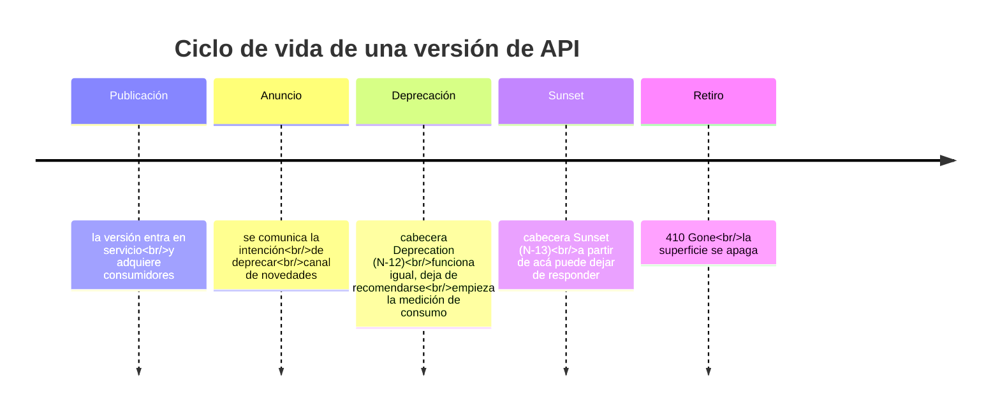

# Deprecación y retiro — `TEM-DEPR`

## 1. Resumen ejecutivo

Deprecar es declarar que algo publicado dejó de recomendarse y va a dejar de existir, dando tiempo a que quien lo usa migre. Retirar es apagarlo. Entre ambos momentos hay una ventana, y la calidad de una política de deprecación se mide casi enteramente por dos cosas: si esa ventana está anunciada con antelación y si su duración se fijó sobre una medición o sobre una intuición.

HTTP tiene dos cabeceras para señalizar el proceso, y no tienen el mismo peso. `Deprecation` (`N-12`, RFC 9745, marzo de 2025) es **Proposed Standard** y su valor es un Structured Field de tipo Date, escrito como arroba seguida de tiempo Unix: `Deprecation: @1688169599`. `Sunset` (`N-13`, RFC 8594, mayo de 2019) es **Informational** —no standards track— y usa un HTTP-date clásico: `Sunset: Sat, 31 Dec 2018 23:59:59 GMT`. La intuición corriente las trata como pareja simétrica; no lo son ni en estatus ni en formato, y casi ningún material lo dice.

La evidencia de la práctica es más incómoda que la ausencia de simetría. **Las dos plataformas más citadas del corpus verificado no deprecan.** Stripe mantiene las cuentas pinneadas indefinidamente y el ascenso de versión es opcional del usuario; Twilio sirve desde una URL cuya fecha no se movió en unos dieciséis años. Solo GitHub y Shopify publican ventanas concretas —veinticuatro meses y al menos doce, respectivamente—. Y no se verificó ni un caso de una plataforma grande emitiendo la cabecera de `N-12`.

Le sirve a `ACT-06`, que conduce este proceso y para quien apagar una versión vieja es la decisión más difícil de la matriz de `MARCO-ACTORES`, porque el costo lo paga un actor y la decisión la toma otro.

---

## 2. Definición

El ciclo completo tiene cuatro momentos y conviene nombrarlos por separado porque se confunden entre sí.

**Anuncio.** Se comunica la intención de deprecar antes de que la deprecación surta efecto. Es opcional y es lo que distingue una política respetuosa de una correcta. Su canal es el de novedades, no la respuesta HTTP.

**Deprecación.** El elemento sigue funcionando exactamente igual y deja de recomendarse. `N-13` la describe como la etapa uno del proceso: ya no recomendado, todavía operativo. Nada cambia en el comportamiento; cambia el estatus.

**Sunset.** El instante anunciado a partir del cual el elemento puede dejar de responder. `N-13` es preciso: una fecha pasada significa que el recurso **puede** volverse no disponible en cualquier momento, no que ya lo esté.

**Retiro.** El elemento deja de existir. La respuesta pasa a ser `410 Gone` cuando se quiere comunicar que existió y ya no, o `404 Not Found` cuando no se quiere distinguir; la semántica de ambos códigos la trata [`TEM-STATUS`](../30-Semantica-HTTP/Codigos-de-Estado.md).



La regla dura que vincula las dos cabeceras, verificada en `N-13`: **el instante de `Sunset` no puede ser anterior al de `Deprecation`**. Es la única restricción formal de todo el proceso.

### Qué no es

**No es apagar.** Deprecar sin ventana es retirar con preaviso simbólico. Si la fecha de sunset no deja tiempo real para que un consumidor de `CTX-1` planifique, priorice, desarrolle, pruebe y despliegue, la deprecación es un trámite.

**No es un mecanismo técnico.** El instrumento principal no es una cabecera sino un calendario y un canal de comunicación. `MARCO-ACTORES` es explícito: las decisiones de deprecación son de producto, no técnicas, y sin alguien que conduzca la negociación entre el costo de mantener y el costo de forzar la migración, la versión vieja se sostiene indefinidamente por miedo o se apaga de golpe por cansancio.

**No aplica solo a versiones enteras.** Un campo, un valor de enumerado, un parámetro de query o un recurso individual se deprecan con el mismo ciclo. La cabecera `Deprecation` se aplica a un recurso; la deprecación de un campo vive en la documentación y en el documento OpenAPI, que tiene la marca `deprecated` para operaciones y parámetros.

**No es lo contrario de romper.** Deprecar es la forma ordenada de romper. Al final del ciclo, algo que funcionaba deja de funcionar; lo que la deprecación compra es que sea previsible.

---

## 3. Aplicación por escenario

### `ESC-1` — API nueva

No hay nada que deprecar, y sin embargo es el escenario donde se decide si va a poder deprecarse.

Tres cosas se fijan acá y ninguna es reversible barata. La primera es **la política publicada**: `MARCO-CONTEXTOS` señala para `CTX-1` que la política de versionado y deprecación debe estar publicada antes de necesitarla, y la razón es contractual —un integrador que se sumó cuando no había política tiene fundamento para esperar soporte indefinido—.

La segunda es **la instrumentación**. Medir el consumo por versión, por consumidor y por operación es barato de construir al principio y caro de agregar después, y sin esa medición la fecha de apagado se fija por intuición, que es la observación con la que `MARCO-ESCENARIOS` cierra `ESC-3`.

La tercera es **el canal de aviso**. `MARCO-ACTORES` lo dice respecto de `ACT-03` en `CTX-1`: conviene construir el canal antes de necesitarlo, porque una API pública sin forma de escuchar a sus integradores acumula fricción invisible. El mismo canal sirve para hablarles.

### `ESC-2` — Exposición o migración

La deprecación que importa es la del sistema anterior, y es la parte del proyecto que más se subestima. Poner una API REST encima de un sistema existente no retira el acceso anterior; lo agrega. Si el endpoint SOAP de 2009 sigue respondiendo, va a seguir usándose, y la migración no termina nunca.

El plan de retiro del contrato previo pertenece al proyecto de migración desde el inicio, con la misma estructura de este documento: anuncio, ventana, medición y fecha. Sin él, `ESC-2` produce dos superficies vivas en lugar de una, que es el resultado opuesto al buscado.

### `ESC-3` — Evolución en producción

El escenario propio. `MARCO-ESCENARIOS` enumera entre sus decisiones cómo se anuncia la deprecación, con cuánta antelación, y cómo se mide quién sigue usando lo viejo; y fija el criterio de terminación: cada versión publicada tiene una fecha de fin de soporte comunicada, y existe telemetría por versión que permite saber si esa fecha es realista.

Las dos mitades de ese criterio están conectadas. Una fecha sin telemetría es una apuesta, y su desenlace habitual es la prórroga: llegado el día, alguien pregunta cuántos consumidores quedan, nadie lo sabe, y la fecha se corre. Correrla una vez enseña a los consumidores que las fechas se corren, y a partir de ahí la política deja de funcionar como incentivo.

### `ESC-4` — Evaluación de una API ajena

La política de deprecación de un proveedor es, junto con la estrategia de versionado, el mejor indicador disponible de qué compromiso de estabilidad asume. Las preguntas concretas para `ESC-4a` y `ESC-4b`: ¿hay una ventana publicada y con qué duración?, ¿hay un registro de versiones retiradas que permita ver si las fechas se cumplieron?, ¿existe un canal de anuncio al que suscribirse?

En `ESC-4b`, sin documentación, algo se puede observar desde afuera: si las respuestas traen `Deprecation` o `Sunset`, si la documentación marca operaciones como deprecadas, y qué devuelve una versión que la documentación ya no menciona —`410` indica retiro deliberado, `404` no distingue—. Lo que se obtiene es una hipótesis y conviene registrarla como tal.

El hallazgo que este documento aporta a `ESC-4` es que la ausencia de política publicada no significa necesariamente desorden. `P-01` y `P-08` no publican ventanas de sunset porque su compromiso es más fuerte, no más débil: no romper. Distinguir «no tiene política» de «su política es no deprecar» exige mirar el historial, no la ausencia del documento.

### Qué cambia según el contexto

| Contexto | Qué cambia en la deprecación |
|---|---|
| `CTX-1` pública | Ventana larga, política publicada por escrito y anuncio por un canal que los integradores sigan. No se puede coordinar con nadie: la fecha es el único instrumento. Las referencias verificadas son `P-05` con veinticuatro meses y `P-07` con al menos doce |
| `CTX-2` interna entre servicios | La ventana puede ser de semanas porque se coordina el despliegue. El instrumento útil no es la cabecera sino la medición: saber qué servicio sigue llamando y pedirle que deje de hacerlo. `MARCO-CONTEXTOS` advierte que la facilidad de cambiar acá es la que produce el monolito distribuido |
| `CTX-3` backend de aplicación propia | Se parte en dos. La aplicación Blazor *interactive server* se despliega con el backend y no necesita ventana. La aplicación .NET MAUI instalada necesita una ventana de `CTX-1`: la fecha de retiro no la fija el equipo sino la curva real de adopción de la versión nueva en las tiendas de aplicaciones, más la cola de usuarios que nunca actualizan |
| `CTX-4` integración con terceros | Se padece la ventana ajena. El trabajo propio es tener un consumidor que la detecte —leer `Deprecation` y `Sunset` de las respuestas, si el proveedor las emite— y una capa de aislamiento que acote el alcance de la migración forzada |

La fila de `CTX-3` contiene el problema práctico más difícil de todo el documento. Una aplicación móvil instalada tiene una cola larga de versiones viejas que puede no extinguirse nunca, y no hay ventana que la agote. Las salidas reales son dos y ninguna es de contrato: forzar la actualización desde el cliente —el cliente comprueba una versión mínima soportada y bloquea el uso hasta actualizarse— o aceptar sostener la superficie vieja indefinidamente. Conviene decidir cuál antes de publicar la primera versión de la aplicación, porque la primera exige código en el cliente que después no se puede agregar retroactivamente a los que ya están instalados.

---

## 4. Ejemplos concretos

Los ejemplos del dominio de reserva de salas son **sintéticos**.

### 4.1 Las dos cabeceras, y su asimetría

Una respuesta que señaliza ambas etapas del ciclo:

```http
HTTP/1.1 200 OK
Content-Type: application/json
Deprecation: @1688169599
Sunset: Wed, 30 Jun 2027 23:59:59 GMT
Link: <https://developers.reservas.ejemplo.com/migracion/v1-a-v2>; rel="deprecation"
X-Reservas-Api-Version: 2026-04-01

{ "datos": [ … ] }
```

La asimetría entre ambas es sustantiva y conviene desglosarla, porque es de las cosas peor documentadas del tema.

| | `Deprecation` | `Sunset` |
|---|---|---|
| RFC | `N-12` — RFC 9745 | `N-13` — RFC 8594 |
| Publicación | Marzo de 2025 | Mayo de 2019 |
| Estatus | **Proposed Standard** — standards track | **Informational** — no standards track |
| Tipo del valor | Structured Field de tipo Date | HTTP-date |
| Sintaxis | `Deprecation: @1688169599` | `Sunset: Sat, 31 Dec 2018 23:59:59 GMT` |
| Qué señala | El recurso será o ya fue deprecado | Cuándo el URI dejará de responder |
| Etapa | Uno: ya no recomendado, operativo | Dos: fin previsto |
| Autoría | S. Dalal, E. Wilde | — |

Dos correcciones de citación que `N-12` vuelve necesarias. La primera: durante años el documento circuló como `draft-dalal-deprecation-header` y buena parte del material sigue citándolo así; **ya no es un borrador**, es un RFC publicado. La segunda es de formato: el valor **ya no es un HTTP-date** del estilo `Sun, 11 Nov 2018 23:59:59 GMT`, sino un Structured Field Date con arroba y tiempo Unix. Un ejemplo con el formato viejo está desactualizado aunque la cabecera sea la correcta.

La consecuencia de la diferencia de estatus es concreta: **la cabecera menos formalizada es la que comunica la información más consecuente**. Que algo esté deprecado es una recomendación; que se apague en una fecha es un hecho operativo, y ese es el que viaja en una cabecera Informational.

Sobre `Link` con `rel="deprecation"`: ambos RFC asocian una relación de enlace a su cabecera. La relación `deprecation` **no figura** entre las verificadas en el registro IANA de `N-11` para esta guía, de modo que el ejemplo de arriba usa el mecanismo de `N-10` con una relación cuya inscripción en el registro no está confirmada acá. La cabecera `Link` en sí y su sintaxis sí están respaldadas por `N-10`, y las trata [`TEM-HEADERS`](../30-Semantica-HTTP/Cabeceras-y-Negociacion.md).

**La brecha de adopción.** No se verificó ni un caso de una plataforma grande emitiendo la cabecera `Deprecation` de `N-12` en respuestas reales. El estándar existe desde marzo de 2025 y es plausible que su adopción sea nula. Esta guía recomienda emitir ambas cabeceras de todos modos —cuestan poco, son el mecanismo correcto y un consumidor instrumentado las aprovecha—, con la advertencia explícita de que **ningún consumidor va a leerlas por defecto**. El anuncio efectivo es el del canal de novedades, y la cabecera es el respaldo verificable. Presentar la cabecera como el instrumento principal invierte la importancia relativa.

### 4.2 Deprecar una versión completa

La secuencia sobre el dominio sintético, con la versión `2026-04-01` de la API de reservas.

Durante la deprecación, cada respuesta lo señaliza y el servicio funciona sin cambios:

```http
GET /salas/a3f1/reservas HTTP/1.1
Host: api.reservas.ejemplo.com
X-Reservas-Api-Version: 2026-04-01
```

```http
HTTP/1.1 200 OK
Content-Type: application/json
Deprecation: @1782950400
Sunset: Thu, 01 Jul 2027 00:00:00 GMT
Link: <https://developers.reservas.ejemplo.com/versiones/2026-04-01>; rel="deprecation"

{ "datos": [ … ] }
```

Pasado el sunset y ejecutado el retiro:

```http
HTTP/1.1 410 Gone
Content-Type: application/json

{
  "codigo": "version_retirada",
  "mensaje": "La versión 2026-04-01 de la API se retiró el 2027-07-01.",
  "versionesVigentes": ["2027-01-15", "2027-06-30"],
  "guiaDeMigracion": "https://developers.reservas.ejemplo.com/versiones/2026-04-01"
}
```

`410 Gone` en lugar de `404` porque comunica que existió y ya no, que es exactamente la información que el consumidor roto necesita. La alternativa que algunas plataformas eligen —servir silenciosamente la versión más nueva cuando se pide una retirada— es peor: el cliente no falla, procesa una respuesta de un contrato que no conoce, y el fallo aparece más tarde y en otro lugar.

### 4.3 Deprecar un campo

Retomando el ejemplo de [`TEM-BREAK`](Compatibilidad-y-Cambios-Rompientes.md), donde `responsable` quedó como duplicado del asistente con rol `responsable`:

```http
HTTP/1.1 200 OK
Content-Type: application/json

{
  "id": "r-9012",
  "responsable": { "id": "u-77", "nombre": "M. Álvarez" },
  "asistentes": [
    { "id": "u-77", "nombre": "M. Álvarez", "rol": "responsable" },
    { "id": "u-91", "nombre": "J. Pereyra", "rol": "invitado" }
  ]
}
```

La deprecación de un campo no se señaliza con `Deprecation`, que aplica al recurso completo: vive en el documento OpenAPI y en la documentación de referencia. En OpenAPI, `deprecated: true` sobre la propiedad, y la descripción indica el reemplazo y la fecha de retiro.

Un campo deprecado tiene un problema que una versión deprecada no tiene: **es más difícil de medir**. Saber qué versión pide un consumidor es directo; saber si lee un campo de la respuesta es imposible desde el servidor. Las aproximaciones son tres y ninguna es exacta: preguntar por el canal, ofrecer un parámetro de selección de campos —lo que `TEM-FILTRO` trata como *sparse fieldsets*— y observar quién lo usa, o retirarlo primero en un entorno de pruebas y esperar reportes. Esta guía recomienda ser más conservador con la ventana de un campo deprecado que con la de una versión, precisamente porque la medición es peor.

### 4.4 Cómo se mide quién usa lo viejo

Sin esta medición la fecha de apagado se fija por intuición. Lo mínimo utilizable son cuatro dimensiones registradas por petición: versión servida, identidad del consumidor, operación y momento.

Con eso se responden las tres preguntas que `ACT-06` necesita, que son las que `MARCO-ACTORES` le atribuye: quién consume cada versión y cuánto tardaría en migrar, qué se prometió por escrito sobre estabilidad, y cuánto cuesta sostener la versión anterior un trimestre más.

La forma de la medición importa. Un porcentaje de tráfico es engañoso: si el 0,3 % de las peticiones va a la versión vieja pero ese 0,3 % pertenece a los dos integradores más grandes, apagar no es una decisión menor. **La unidad de medida es el consumidor, no la petición.** El tránsito de la versión vieja concentrado en pocos consumidores identificables suele ser el caso más fácil de resolver: se los llama.

La segunda métrica útil es la **derivada**: cuántos consumidores migraron por mes desde el anuncio. Una curva plana significa que el anuncio no llegó o que no hay incentivo, y ambas cosas se detectan meses antes de la fecha y se pueden corregir. Descubrirlo la semana previa deja como únicas opciones prorrogar o romper.

En `CTX-3` con clientes instalados hay una tercera métrica y es la que gobierna: **la distribución de versiones instaladas del cliente**, que no se obtiene de la API sino de la plataforma de distribución de la aplicación. Es la única que permite estimar cuándo la cola se hace lo bastante corta.

Un dato de `P-05` pone en perspectiva estas curvas: el default de GitHub sigue siendo `2022-11-28` más de tres años después de fijado. La versión que un consumidor obtiene sin pedir nada no migra sola, porque migrar exige que alguien agregue una cabecera que hoy no necesita.

### 4.5 Las ventanas reales

| Plataforma | Ventana | Detalle verificado | Fuente |
|---|---|---|---|
| GitHub | 24 meses | *API versions are supported for 24 months after a newer API version is released.* Tabla pública de fin de soporte: `2022-11-28` termina el 2028-03-10 | `P-05` |
| Shopify | ≥12 meses | Release trimestral; cada versión estable soportada un mínimo de doce meses, con al menos nueve meses de solapamiento entre consecutivas | `P-07` |
| Microsoft Graph | 36 meses | La guía `G-02` fija un mínimo de treinta y seis meses para la deprecación en GA, o veinticuatro con evidencia de no uso | `G-02` |
| Google | 180 días en canal beta | `G-04` AIP-185 recomienda ciento ochenta días de deprecación para el canal beta; el canal alpha puede removerse sin aviso | `G-04` |
| Stripe | **No hay** | Cuentas pinneadas indefinidamente; el ascenso de versión es opcional del usuario. No hay sunset forzado publicado | `P-01` |
| Twilio | **No hay** | Base URL `https://api.twilio.com/2010-04-01` sin cambios en unos dieciséis años: política de facto de no romper nunca | `P-08` |

La cláusula de `G-02` merece atención porque contiene el mecanismo que resuelve el problema real: veinticuatro meses **con evidencia de no uso**, en lugar de treinta y seis. Es la formalización de la idea de que la ventana debe depender de la medición y no solo del calendario, y es la única de las fuentes verificadas que la incorpora explícitamente.

### 4.6 La evidencia incómoda: Stripe y Twilio no deprecan

La prescripción dominante en el material sobre APIs es deprecar con ventana y comunicar con `Deprecation` y `Sunset`. **La práctica dominante entre las plataformas verificadas es directamente no deprecar.**

`P-01` documenta que las cuentas de Stripe quedan fijadas a una versión indefinidamente y que el ascenso es una acción voluntaria del usuario; no hay fecha de apagado publicada. `P-08` muestra que la URL base de Twilio incorpora la fecha `2010-04-01` y que esa fecha no se movió en unos dieciséis años. Ninguna de las dos publica ventanas de migración porque ninguna de las dos fuerza migraciones.

Lo que eso implica no es que sean menos rigurosas. Es que eligieron un modelo económico distinto: **compatibilidad indefinida a costa de complejidad interna**. Sostener todas las versiones históricas de un contrato exige una arquitectura que las traduzca —típicamente una cadena de transformaciones desde el modelo interno actual hacia cada contrato publicado— y ese costo crece sin techo. Es una inversión que una plataforma de pagos con ingresos por transacción puede amortizar y que la mayoría de las organizaciones no.

Tres cosas se siguen de esta evidencia y conviene tenerlas separadas.

**La ventana de migración no es la única política válida.** Es la política de `P-05`, `P-07` y `G-02`; no es la de `P-01` ni `P-08`. Presentarla como la única forma correcta de evolucionar una API contradice la práctica de dos de las plataformas más citadas del tema.

**La compatibilidad indefinida no es gratis, es diferida.** El costo se paga en complejidad interna acumulada, y esa complejidad tiene un efecto de segundo orden importante: hace más lento cada cambio futuro. Elegirla sin haberla presupuestado produce el peor resultado —ni se deprecó ni se sostiene bien—.

**El único caso claramente malo es no decidir.** Una API sin política publicada y sin compromiso de estabilidad deja al consumidor sin base para planificar, y termina apagando cosas por cansancio, que es el desenlace que `MARCO-ACTORES` describe cuando falta `ACT-06`.

Esta guía recomienda elegir explícitamente entre los dos modelos y publicarlo, y observa que el segundo —compatibilidad indefinida— solo es sostenible si se decide en `ESC-1`, porque exige una arquitectura interna que lo permita. Adoptarlo en `ESC-3` sobre un sistema que no lo previó suele significar, en la práctica, no deprecar por incapacidad de decidir.

### 4.7 Deprecación y pruebas de contrato

El vínculo con [`TEM-CLIENTES`](../60-Especificacion-y-Documentacion/Clientes-y-Pruebas-de-Contrato.md) opera en dos direcciones. Las pruebas de contrato detectan que un cambio rompió algo —qué constituye una ruptura lo define [`TEM-BREAK`](Compatibilidad-y-Cambios-Rompientes.md)—; y una versión deprecada pero viva sigue necesitando su propio conjunto de pruebas, porque durante toda la ventana debe seguir comportándose como prometió. Es una parte del costo de sostener una versión vieja que rara vez se presupuesta: no es solo mantener el código, es mantener la verificación.

---

## 5. Preguntas guía

- ¿Existe una política de deprecación publicada, y se publicó antes de que hubiera consumidores?
- ¿Sé quién consume cada versión, o lo estoy suponiendo? ¿Puedo nombrar a los consumidores de la versión que quiero apagar?
- ¿La ventana que fijé alcanza para que un consumidor externo priorice, desarrolle, pruebe y despliegue, o solo para que se entere?
- ¿Cuántos consumidores migraron por mes desde el anuncio? Si la curva es plana, ¿el anuncio llegó?
- ¿Corrí alguna vez una fecha de apagado? ¿Qué le enseñó eso a mis consumidores sobre la próxima?
- ¿Mi modelo es ventana de migración o compatibilidad indefinida? ¿Lo elegí o me pasó?
- En `CTX-3` con clientes instalados, ¿tengo forma de forzar la actualización, y la puse en el cliente antes de publicarlo?
- ¿Qué devuelve hoy una petición a una versión que ya retiré: `410`, `404`, o la versión más nueva en silencio?
- ¿Estoy midiendo el uso de la versión vieja en peticiones o en consumidores?

---

## 6. Criterios de calidad

Una política de deprecación está bien resuelta cuando la ventana está publicada antes de necesitarse y su duración se puede justificar con una medición; cuando existe telemetría por versión y por consumidor, y `ACT-06` puede nombrar a quienes siguen en lo viejo; cuando el anuncio llega por un canal que los consumidores efectivamente siguen, y la cabecera es el respaldo y no el mecanismo; cuando el retiro devuelve una respuesta que explica qué pasó y adónde ir; y cuando las fechas anunciadas se cumplen, porque una fecha que se corrió deja de ser un instrumento.

### Antipatrones

**Deprecar sin medir.** La fecha se fija por intuición y el día señalado nadie sabe qué pasa si se apaga. El desenlace habitual es la prórroga, y la prórroga enseña que las fechas no son reales.

**Anunciar solo con la cabecera.** No se verificó adopción de `N-12` en ninguna plataforma grande, y no hay razón para suponer que los consumidores inspeccionan cabeceras que nadie emite. Una deprecación anunciada únicamente por cabecera no fue anunciada.

**Ventana proporcional a la comodidad del productor.** Tres meses para que un integrador de `CTX-1` migre es una ventana que ignora que el consumidor tiene su propio calendario, su propio backlog y sus propias prioridades. Las referencias verificadas son de doce, veinticuatro y treinta y seis meses.

**Retirar devolviendo la versión nueva en silencio.** El cliente que pide una versión retirada y recibe otra no falla: procesa un contrato que no conoce. Es la peor forma de retirar porque convierte un error de integración en un error de datos.

**Deprecar por lotes al final.** Acumular deprecaciones y anunciarlas todas juntas seis meses antes de un apagado grande produce una migración que ningún consumidor puede absorber. Deprecar temprano y de a poco es más trabajo de comunicación y menos riesgo.

**No decidir el modelo.** Ni ventana ni compatibilidad indefinida: se sostiene lo viejo por miedo hasta que alguien lo apaga por cansancio. Es el resultado por omisión cuando `ACT-06` no existe, y `MARCO-ACTORES` lo señala como la consecuencia típica de que ese rol quede vacante.

**Presentar la ventana de migración como la única política correcta.** `P-01` y `P-08` prueban que no lo es. Lo que sí es incorrecto es no tener ninguna.

---

## 7. Anexo — Plantillas

### 7.1 Política de deprecación

Se publica en `CTX-1` y se completa antes de la primera deprecación. Valores sintéticos.

```yaml
politica_de_deprecacion:
  api: "API de reserva de salas"
  modelo: ventana_de_migracion          # ventana_de_migracion | compatibilidad_indefinida
  actor_responsable: ACT-06

  ventana:
    desde: publicacion_de_la_sucesora
    duracion_minima: "18 meses"
    solapamiento_minimo_entre_versiones: "12 meses"
    reduccion_por_evidencia_de_no_uso: "hasta 9 meses"   # patrón de G-02
    prorrogas: "ninguna comprometida; toda prórroga se anuncia con 60 días"

  anuncio:
    canal_primario: "boletín de novedades para desarrolladores"
    canal_secundario: "changelog público del portal"
    antelacion_al_inicio_de_la_deprecacion: "60 días"
    señalizacion_en_respuesta:
      deprecation: true                  # N-12, Structured Field Date: @<unix>
      sunset: true                       # N-13, HTTP-date
      link_a_guia_de_migracion: true     # N-10

  retiro:
    codigo_de_respuesta: 410
    cuerpo_incluye: [codigo, mensaje, versiones_vigentes, guia_de_migracion]

  medicion:
    dimensiones: [version, consumidor, operacion, fecha]
    unidad_de_decision: consumidor       # no porcentaje de peticiones
    revision: mensual desde el anuncio
    umbral_para_apagar: "cero consumidores durante 30 días, o contacto directo con los restantes"
    metrica_de_clientes_instalados: ""   # obligatorio en CTX-3 con clientes móviles

  fuera_de_esta_politica:
    - "Canales de preview: pueden cambiar o retirarse sin ventana"
    - "Campos y valores documentados como experimentales"
```

El campo `unidad_de_decision` es el que más cambia la conducta. Fijado en `consumidor`, obliga a mirar quiénes son y no cuántas peticiones hacen, y suele revelar que el tránsito residual de la versión vieja pertenece a pocos integradores identificables a los que se puede llamar por teléfono.

### 7.2 Aviso de deprecación

Texto del anuncio, sintético. Sirve para el canal de novedades y para la página de la versión.

```markdown
# Deprecación de la versión 2026-04-01 de la API de reserva de salas

**Fecha del anuncio:** 2026-07-20
**Inicio de la deprecación:** 2026-09-30
**Fecha de retiro (sunset):** 2027-07-01
**Versión sucesora:** 2026-09-15

## Qué cambia

La versión `2026-04-01` deja de recomendarse el 2026-09-30 y deja de responder
el 2027-07-01. Hasta esa fecha funciona sin ninguna modificación de
comportamiento: no hay degradación progresiva ni límites reducidos.

## Por qué

El campo `responsable` de una reserva se reemplaza por la colección
`asistentes`, que admite varios participantes con rol. La representación
anterior no puede expresar el caso y se mantuvo por compatibilidad desde
la versión 2026-04-01.

## Qué hay que hacer

1. Leer la guía de migración: <enlace>
2. Reemplazar las lecturas de `responsable` por el elemento de `asistentes`
   cuyo `rol` es `responsable`.
3. Enviar la cabecera `X-Reservas-Api-Version: 2026-09-15`.
4. Verificar contra el entorno de pruebas, disponible desde el 2026-08-01.

## Cómo saber si me afecta

Toda petición servida por la versión deprecada devuelve, desde el 2026-09-30,
las cabeceras `Deprecation` y `Sunset`. El panel de la cuenta muestra qué
versiones consumió cada credencial en los últimos 90 días.

## Contacto

Quien no llegue con la fecha debe escribir a <canal> antes del 2027-04-01.
Las prórrogas se evalúan caso por caso y se anuncian con 60 días.
```

La sección «Cómo saber si me afecta» es la que más reduce el tránsito de soporte y la que más se omite. Un consumidor que recibe un aviso de deprecación no sabe, en general, si su integración usa lo que se va a apagar; darle un modo de averiguarlo por su cuenta convierte el aviso en una acción posible. Su tratamiento como problema de experiencia de desarrollador está en [`TEM-DX`](../95-Transversales/Experiencia-del-Desarrollador.md).

Sobre el último párrafo: la invitación a pedir prórroga es deliberada y discutible. La alternativa —no ofrecerla— produce consumidores que no avisan y se rompen el día del apagado. Esta guía recomienda ofrecer el canal y no comprometer el resultado, que es lo que el texto hace.

### 7.3 Registro de elementos deprecados

Se mantiene junto a la documentación de referencia y es la fuente de la que se derivan los avisos.

```yaml
deprecados:
  - elemento: "versión 2026-04-01"
    tipo: version
    anunciado: 2026-07-20
    deprecado_desde: 2026-09-30
    sunset: 2027-07-01
    retirado: null
    reemplazo: "versión 2026-09-15"
    consumidores_activos: 14              # actualizado por la medición
    guia_de_migracion: "<enlace>"

  - elemento: "campo responsable en Reserva"
    tipo: campo
    anunciado: 2026-07-20
    deprecado_desde: 2026-09-30
    sunset: 2027-07-01
    retirado: null
    reemplazo: "asistentes[] con rol=responsable"
    consumidores_activos: desconocido     # no medible desde el servidor
    guia_de_migracion: "<enlace>"

  - elemento: "parámetro de query ordenPor"
    tipo: parametro
    anunciado: 2025-11-02
    deprecado_desde: 2026-01-15
    sunset: 2026-07-01
    retirado: 2026-07-01
    reemplazo: "sort"
    consumidores_activos: 0
    guia_de_migracion: "<enlace>"
```

El valor `desconocido` en `consumidores_activos` para el campo deprecado no es un dato faltante: es la información relevante. Un elemento cuyo uso no se puede medir necesita una ventana más larga que uno cuyo uso se conoce, y el registro lo hace visible en lugar de dejarlo implícito.

---

## Fuentes citadas

`N-12` RFC 9745, *The Deprecation HTTP Response Header Field*, Proposed Standard, marzo de 2025, S. Dalal y E. Wilde · `N-13` RFC 8594, *The Sunset HTTP Header Field*, Informational, mayo de 2019 · `N-10` RFC 8288, Web Linking · `N-11` registro IANA de relaciones de enlace · `N-19` OpenAPI 3.2.0, marca `deprecated` · `G-02` Microsoft Graph REST API Guidelines · `G-04` AIP-185 · `P-01` Stripe · `P-05` GitHub · `P-07` Shopify · `P-08` Twilio. Registradas en [`ANEXO-REFERENCIAS`](../99-Anexos/Referencias.md).

**No verificado, y declarado como tal.** No se confirmó ni un caso de una plataforma grande emitiendo la cabecera `Deprecation` de `N-12` en respuestas reales; es plausible que la adopción sea nula, y ninguna afirmación de este documento supone lo contrario. Las políticas de deprecación publicadas de Twilio y Shopify más allá de la ventana de soporte no pudieron obtenerse. La inscripción de la relación de enlace `deprecation` en el registro de `N-11` no se verificó en esta guía. Los umbrales concretos de la plantilla de §7.1 —dieciocho meses, sesenta días de antelación, treinta días sin consumo— son criterio propio de esta guía y no derivan de ninguna fuente verificada; las referencias externas disponibles son las de §4.5.
