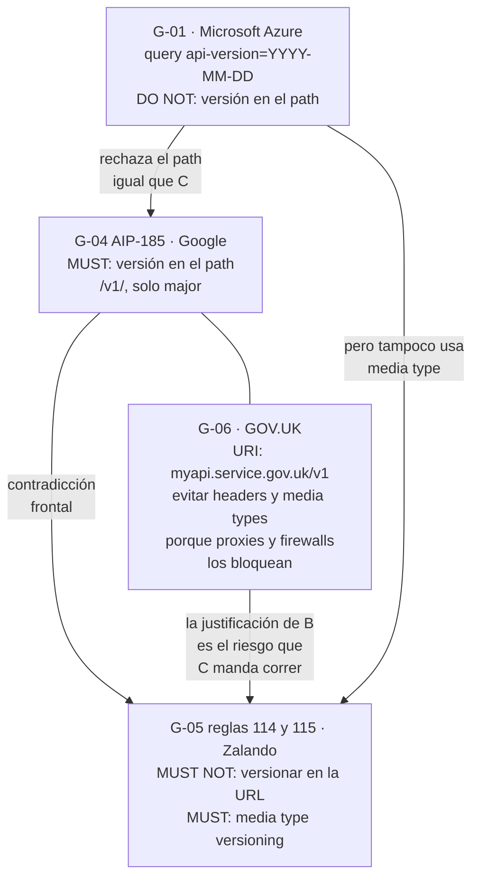

# Estrategias de versionado — `TEM-VERS`

## 1. Resumen ejecutivo

Versionar una API es publicar más de un contrato a la vez y darle al consumidor un modo de decir cuál quiere. Todo lo demás —dónde se escribe el número, qué forma tiene, cuántos hay— son variantes de emplazamiento sobre esa única idea, y tienen mucha menos consecuencia de la que sugiere el volumen de discusión que generan.

La decisión se toma en `ESC-1`, cuando todavía no hace falta, y se paga en `ESC-3`, cuando ya no se puede cambiar. Ese desfasaje es el rasgo característico del tema: el emplazamiento de la versión es una de las poquísimas decisiones que hay que tomar antes de tener el problema, porque introducirla después es en sí mismo un cambio rompiente —los clientes que llamaban a `/salas` no llaman a `/v1/salas`—.

Este documento presenta las cinco opciones reales de emplazamiento con su costo verificable, expone la contradicción a tres bandas entre las guías de organización que prescriben sobre el tema, y contrasta ambas cosas con lo que las plataformas grandes efectivamente hacen. El hallazgo que más conviene retener del contraste: **la opción teóricamente más correcta, la negociación por media type, tiene adopción nula entre las cinco plataformas verificadas**, y el `/v1 → /v2 → /v3` incremental que enseñan los tutoriales tampoco se usa como mecanismo de evolución continua en ninguna de ellas.

Le sirve a `ACT-01`, que decide la estrategia y tiene que poder justificarla, y a `ACT-06`, que hereda el costo de sostener cada versión que se publique.

---

## 2. Definición

Una **versión de API** es un contrato completo e identificable: dado un identificador de versión, el consumidor sabe qué recursos existen, qué campos tiene cada representación, qué códigos de estado puede recibir y qué significa cada uno. Dos versiones coexisten cuando el servidor puede atender ambos contratos simultáneamente y el consumidor elige.

El problema que resuelve es exactamente uno: **permitir un cambio rompiente sin coordinar el despliegue con el consumidor**. Qué constituye un cambio rompiente lo define [`TEM-BREAK`](Compatibilidad-y-Cambios-Rompientes.md), y esa dependencia es de orden lógico: si un cambio no rompe, no necesita versión, y publicar una versión nueva por un cambio compatible duplica la superficie de mantenimiento a cambio de nada.

### Qué no es

**No es un número de release del software.** El versionado semántico —`MAJOR.MINOR.PATCH`— describe la evolución de un artefacto de software que alguien instala. Una API publicada no se instala: el consumidor no elige cuándo actualizar, elige a qué contrato llamar. La consecuencia es que las partes `MINOR` y `PATCH` no significan nada para el consumidor de una API HTTP, porque los cambios compatibles no requieren que haga nada. `G-04` AIP-185 lo prescribe con esas palabras: *Google APIs must not expose minor or patch version numbers*, admitiendo solo `v1` y no `v1.0`, `v1.1` ni `v1.4.2`. `G-05` regla 116, en cambio, exige SemVer completo, aunque en el campo `info.version` del documento OpenAPI y no en la URL, que es una superficie distinta. La confusión entre ambos planos es constante y produce APIs con `/v2.3.1/` en el path, donde cada dígito adicional es una promesa que nadie va a cumplir.

**No es un mecanismo de despliegue.** Publicar `/v2` y apagar `/v1` la misma noche no es versionar: es un cambio rompiente con un rodeo. El valor de versionar está enteramente en la ventana de coexistencia, y una estrategia de versionado sin política de deprecación —[`TEM-DEPR`](Deprecacion-y-Retiro.md)— no llega a ser una estrategia.

**No es un sustituto de diseñar para poder cambiar.** Es el error de razonamiento más caro del tema. Una API que versiona no necesita menos disciplina de compatibilidad, necesita la misma: cada versión publicada es una superficie que hay que mantener, probar, documentar y eventualmente apagar, y las organizaciones que tratan la versión nueva como vía de escape acumulan versiones hasta que sostenerlas consume el presupuesto de evolución completo. La observación general de `MARCO-CONTEXTOS` sobre `CTX-1` aplica de lleno acá: conviene exponer de menos y agregar, porque quitar es rompiente y agregar no.

**No es lo mismo que la evolución del recurso.** Que un recurso tenga estados, historial o un campo `revision` es modelado de dominio y lo trata [`TEM-RECURSOS`](../20-Diseno-de-Recursos/Modelado-de-Recursos.md). El versionado del que habla este documento es el del contrato, no el del dato.

---

## 3. Aplicación por escenario

### `ESC-1` — API nueva

Es donde se decide, y donde menos parece necesario. Una API sin consumidores no tiene ninguna versión que sostener, y por eso la discusión sobre versionado en `ESC-1` se percibe como ceremonia prematura. `MARCO-ESCENARIOS` la clasifica explícitamente entre las decisiones que hay que tomar ahora porque después cuestan, junto con la nomenclatura y el formato de errores.

El argumento concreto: introducir un identificador de versión donde no lo había es un cambio rompiente bajo cualquier emplazamiento. Si la versión va en el path, las URIs cambian. Si va en query o cabecera, hay que decidir qué significa su ausencia, y esa decisión —tomada tarde— fuerza a que el contrato original sea para siempre el default implícito. GitHub ilustra el costo: `P-05` muestra que una petición sin `X-GitHub-Api-Version` recibe la versión `2022-11-28` por defecto, y esa versión sigue siendo el default más de tres años después de publicada. El default es la versión que se congela.

Lo que sí es sobrediseño en `ESC-1` —la trampa que `MARCO-ESCENARIOS` señala para este escenario— es implementar tres emplazamientos simultáneos, montar el enrutamiento por versión antes de que exista una segunda, o versionar recurso por recurso sin haber tenido nunca dos contratos vivos. Esta guía recomienda una posición intermedia: **decidir y documentar la estrategia, e implementar el mínimo que la haga efectiva** —normalmente, publicar la v1 con su identificador visible y con el comportamiento ante la ausencia del identificador ya definido—.

### `ESC-2` — Exposición o migración

El versionado aparece acá con una forma particular: hay un contrato previo, en otro protocolo o en otra plataforma, y hay que decidir si la API nueva es la versión 2 de algo o un sistema distinto.

Casi siempre es lo segundo, y tratarla como versión sucesora arrastra el problema que `MARCO-ESCENARIOS` identifica como la trampa de este escenario. Una API REST que se declara «v2» de una API SOAP hereda la expectativa de correspondencia operación por operación, y esa expectativa es precisamente lo que empuja a reproducir el contrato viejo con otra sintaxis.

`P-02` ofrece un precedente útil y poco citado: el namespace `/v2` de Stripe **no es la versión sucesora de `/v1`**. Ambos conviven en la misma integración, y `/v2` agrupa productos nuevos con un modelo distinto mientras el versionado real de la plataforma sigue ocurriendo por fecha en cabecera. El número en el path, ahí, nombra una superficie, no una generación.

Cuando la migración sí conserva consumidores del sistema anterior, la decisión útil es publicar la API nueva con su propio versionado desde el día uno y tratar el sistema previo como una superficie separada con su propio calendario de retiro, que es materia de [`TEM-DEPR`](Deprecacion-y-Retiro.md).

### `ESC-3` — Evolución en producción

El escenario propio del tema. La pregunta operativa no es cuál estrategia es mejor sino cuál se puede introducir ahora dado lo que ya está publicado.

Si la API ya tiene versión en el path, agregar `/v2` es barato y las alternativas son en la práctica inaccesibles. Si no tiene ningún identificador de versión, la opción menos rompiente es un identificador **opcional** en cabecera o en query, cuya ausencia significa el contrato actual: los clientes existentes siguen funcionando sin tocar nada y los nuevos pueden pedir explícitamente. Es el camino que muestra `P-05`: la superficie de GitHub cuelga de `api.github.com` sin ningún `/v1/`, y el versionado se agregó después mediante una cabecera con default.

La otra pregunta de `ESC-3` es si el cambio justifica una versión. `MARCO-ESCENARIOS` la enuncia como decisión de este escenario, y la respuesta pasa por [`TEM-BREAK`](Compatibilidad-y-Cambios-Rompientes.md). Publicar una versión por un cambio compatible es el desperdicio más frecuente; publicar un cambio rompiente sin versión es la ruptura silenciosa más frecuente.

### `ESC-4` — Evaluación de una API ajena

No se decide nada: se caracteriza. La estrategia de versionado de una API ajena es uno de los datos más informativos que se pueden recoger sobre ella, porque revela el compromiso de estabilidad que su productor está dispuesto a asumir.

En `ESC-4a`, con la especificación disponible, se lee directamente del documento OpenAPI y de la documentación de política. En `ESC-4b` se infiere de tres observaciones: si las URIs contienen un segmento de versión, si la respuesta a una petición sin identificador difiere de la respuesta con uno, y si las cabeceras de respuesta declaran alguna versión servida. Lo que se obtiene es una hipótesis, y `MARCO-ESCENARIOS` insiste en registrarla como tal.

Hay una pregunta que en `ESC-4` importa más que el mecanismo: **cuántas versiones sostiene simultáneamente y por cuánto tiempo**. Una API con versión en el path y una sola versión viva desde hace cuatro años no versiona, congela; el caso de `P-08` es el ejemplo extremo y se desarrolla más abajo.

### Qué cambia según el contexto

| Contexto | Qué cambia en la decisión de versionado |
|---|---|
| `CTX-1` pública | Versionado explícito y publicado, con política escrita antes de necesitarla. El emplazamiento importa poco; la ventana de coexistencia importa mucho. El consumidor es incoordinable por definición |
| `CTX-2` interna entre servicios | Es el único contexto donde el versionado formal puede omitirse legítimamente: un cambio rompiente se resuelve coordinando el despliegue de ambos lados. `MARCO-CONTEXTOS` lo registra como «ligero o ninguno». El riesgo es el que ese documento señala: si se cambia siempre así, se termina con servicios que solo pueden desplegarse todos juntos |
| `CTX-3` backend de aplicación propia | **El matiz decisivo de todo el documento.** Una Blazor en render *interactive server* ejecuta en el servidor y se comporta como `CTX-2`; una aplicación .NET MAUI instalada no se actualiza cuando el backend se despliega y, en términos de libertad de cambio, **se comporta como `CTX-1` aunque el equipo sea el mismo**. Un solo consumidor propio puede exigir el rigor de versionado de una API pública |
| `CTX-4` integración con terceros | El versionado es un dato, no una decisión: lo impone el proveedor. El trabajo propio consiste en aislar su esquema de versiones detrás de una capa, para que un cambio forzado del otro lado no se propague al dominio |

La regla de `MARCO-CONTEXTOS` para APIs que están en varios contextos a la vez aplica sin excepción: rige el contexto más restrictivo. Una API que sirve a la aplicación MAUI y a integradores externos versiona como `CTX-1`.

---

## 4. Ejemplos concretos

Todos los ejemplos del dominio de reserva de salas son **sintéticos**. Los fragmentos atribuidos a plataformas reales reproducen lo verificado en las fuentes `P-xx` correspondientes.

### 4.1 Las cinco opciones de emplazamiento

`N-60` —el documento de Azure Architecture Center, única guía de primera parte de Microsoft sobre el tema— enumera cinco enfoques: sin versionado, URI, query string, cabecera y media type. Opera en el nivel de diseño y **deliberadamente no prescribe ninguno**. La enumeración que sigue agrega el versionado por fecha, que es ortogonal al emplazamiento y merece tratarse aparte porque cambia el modelo mental.

**Segmento de ruta.**

```http
GET /v1/salas/a3f1/reservas?desde=2026-08-01 HTTP/1.1
Host: api.reservas.ejemplo.com
Accept: application/json
```

Visible en cualquier registro de acceso, trivial de enrutar, trivial de probar desde un navegador o desde `curl`, y cacheable sin configuración adicional porque la URI es la clave de caché. `N-60` observa que URI y query string son *cache-friendly* y que cabecera y media type *typically require more logic*.

El costo es doble. Cada versión duplica el espacio de URIs, de modo que el mismo recurso tiene dos identificadores permanentes y `/v1/salas/a3f1` y `/v2/salas/a3f1` nombran la misma sala; es la objeción que se deriva del principio de `O-02` según el cual el servidor debe conservar la libertad sobre su propio namespace. Y empuja al versionado global: como el segmento está al principio de la ruta, versionar un solo recurso obliga a un esquema `/salas/v2/...` que rompe la uniformidad.

**Query string.**

```http
GET /salas/a3f1/reservas?api-version=2026-04-01&desde=2026-08-01 HTTP/1.1
Host: api.reservas.ejemplo.com
```

Es lo que prescribe `G-01`, la guía de Azure fechada el 2025-03-28: *use a required query parameter named `api-version` on every operation*, con valores `YYYY-MM-DD` y sufijo `-preview`, y explícitamente *DO NOT include a version number segment in any operation path*. Conserva la ventaja de caché y no duplica el espacio de rutas, a costa de contaminar cada URI con un parámetro que no describe el recurso ni la consulta. Que sea obligatorio en toda operación —como exige `G-01`— es lo que evita el problema del default implícito, al precio de romper toda petición que lo omita.

**Cabecera personalizada.**

```http
GET /salas/a3f1/reservas HTTP/1.1
Host: api.reservas.ejemplo.com
X-Reservas-Api-Version: 2026-04-01
```

Lo que hacen `P-01` y `P-05` con `Stripe-Version` y `X-GitHub-Api-Version`. Deja la URI limpia: el recurso tiene un identificador y solo uno. El costo es de ergonomía y de caché. No se puede pegar una URL en un navegador y obtener la versión que se quiere; toda herramienta y todo ejemplo de documentación necesita la cabecera; y la caché exige `Vary` sobre la cabecera, lo que multiplica las entradas almacenadas.

**Media type — negociación de contenido.**

```http
GET /salas/a3f1/reservas HTTP/1.1
Host: api.reservas.ejemplo.com
Accept: application/vnd.reservas.v2+json
```

Es la opción teóricamente más correcta, en el sentido de que usa el mecanismo que `N-01` §12 define para elegir entre representaciones de un mismo recurso en lugar de inventar uno. Es la que `G-05` regla 114 exige como **MUST** y la que `G-08` documenta con `Accept: application/vnd.heroku+json; version=3`.

Sus costos son los de la cabecera, amplificados: la ergonomía es peor porque el valor es más largo y menos memorable, la caché necesita `Vary: Accept`, y hay un costo adicional que `G-06` señala explícitamente y que se trata en §4.3. Un matiz de diseño que `G-08` agrega: recomienda **no** tener versión por defecto, obligando al cliente a declararla siempre. Es la posición más limpia conceptualmente y la que más fricción impone a quien empieza a integrar.

**Versionado por fecha.**

```http
GET /salas/a3f1/reservas HTTP/1.1
Host: api.reservas.ejemplo.com
Stripe-Version: 2026-06-24.dahlia
```

No es un emplazamiento sino un esquema de identificadores, y puede combinarse con cualquiera de los cuatro anteriores: `P-01` lo pone en cabecera, `G-01` en query, `P-07` en la URL. Lo que cambia es el modelo mental. Un entero ordinal sugiere generaciones sucesivas, pocas y grandes; una fecha sugiere un flujo continuo de contratos donde cada uno se distingue por cuándo se congeló.

El esquema de `P-01` merece detalle porque es el más elaborado de los verificados: el formato es `YYYY-MM-DD.nombre_de_release`, la versión vigente al 2026-07-20 es `2026-06-24.dahlia`, los releases mayores llevan nombre —Acacia, Dahlia— e incluyen cambios incompatibles, y los mensuales reusan el nombre del último mayor y contienen solo cambios compatibles. La fecha identifica el contrato exacto; el nombre agrupa la generación.

### 4.2 Comparación

| Opción | Ejemplo | Caché | Ergonomía | Versionado parcial | Quién la prescribe | Quién la usa |
|---|---|---|---|---|---|---|
| Segmento de ruta | `/v1/salas` | Directa | Alta | Difícil | `G-04` AIP-185 (MUST), `G-06`, `G-02` | `P-07` (con fecha), `P-08` (congelada) |
| Query string | `?api-version=2026-04-01` | Directa | Media | Por operación | `G-01` (MUST, obligatorio) | Azure |
| Cabecera personalizada | `X-GitHub-Api-Version` | Requiere `Vary` | Baja | Por operación | Ninguna guía verificada | `P-01`, `P-05` |
| Media type | `Accept: application/vnd.x.v2+json` | Requiere `Vary` | Baja | Por representación | `G-05` regla 114 (MUST), `G-08` | **Ninguna de las cinco plataformas verificadas** |
| Fecha (esquema) | `2026-06-24.dahlia` | Según emplazamiento | Media | Según emplazamiento | `G-01` (en query) | `P-01`, `P-05`, `P-07` |

La columna «versionado parcial» se explica en §4.5.

### 4.3 La contradicción a tres bandas

Es la divergencia más limpia de todo el corpus de guías, porque no admite lectura conciliadora: una guía prohíbe explícitamente lo que otra exige explícitamente.



Las tres posturas, con su nivel de autoridad declarado, son las siguientes.

**Google, en `G-04` AIP-185, prescribe la versión en el path como MUST.** Exige que aparezca en dos lugares —el package protobuf y la primera parte del path URI REST— y prohíbe exponer minor o patch. Vale para quien adopta las AIP, y su coherencia depende del ecosistema completo de Google: generación de clientes, canales alpha/beta/stable con la regla de que la funcionalidad de beta debe ser superconjunto de la de stable, y la prohibición de que una versión mayor nueva dependa de la anterior.

**Zalando, en `G-05`, prohíbe la URL y exige media type.** La regla 115 es un **MUST NOT** sobre el URL versioning; la regla 114 un **MUST** sobre media type versioning vía content negotiation cuando haya cambios incompatibles. Es la postura más alineada con la teoría: el recurso conserva un identificador único y la versión selecciona entre representaciones, que es para lo que `N-01` §12 define el mecanismo.

**GOV.UK, en `G-06`, actualizada el 2024-07-19, recomienda la URI y desaconseja explícitamente cabeceras y media types custom**, con una justificación operativa: proxies y firewalls pueden bloquearlos.

La ironía vale la pena nombrarla porque no aparece en ninguna de las tres fuentes. **La razón que GOV.UK da para preferir el path es exactamente el riesgo que Zalando manda correr.** No es que una tenga razón y la otra no: es que operan en entornos distintos. Un organismo público británico diseña para integradores cuyo tránsito atraviesa infraestructura corporativa e institucional que no controla, donde una cabecera `Accept` con un media type no registrado puede ser normalizada o descartada por un intermediario. Una empresa de comercio electrónico diseña sobre todo para su propia infraestructura y para partners con configuraciones conocidas. La pregunta útil, siguiendo el criterio de `MARCO-CONVENCIONES`, no es cuál acierta sino qué problema resolvía cada una.

Una cuarta postura completa el cuadro y muestra que no hay siquiera coherencia interna dentro de un mismo vendor: `G-01` rechaza el path como `G-05`, pero tampoco adopta media type; usa query string. Y `G-02`, la guía de Microsoft Graph, publica dos endpoints —`v1.0` y `beta`— con la versión **en el path**. Mismo vendor, dos guías vivas, dos convenciones incompatibles. Citar «Microsoft prescribe X» sin decir cuál de las dos guías es, en general, incorrecto.

### 4.4 Qué usan realmente las plataformas grandes

La evidencia `P-xx` prueba qué se hace, jamás qué corresponde hacer. Con esa salvedad, el cuadro es el siguiente.

| Plataforma | Mecanismo | Detalle verificado | Fuente |
|---|---|---|---|
| Stripe | Fecha en cabecera | `Stripe-Version: 2026-06-24.dahlia`. Cuenta pinneada por defecto. `/v2` es un namespace de productos nuevos que convive con `/v1`, no una versión sucesora | `P-01`, `P-02` |
| GitHub | Cabecera con fecha | `X-GitHub-Api-Version`; sin la cabecera, default `2022-11-28`. Todo cuelga de `api.github.com` sin `/v1/`. Vigentes `2026-03-10` y `2022-11-28`, esta última con fin de soporte 2028-03-10 | `P-05` |
| Shopify | Fecha en la URL | `2026-04` en la ruta de la petición; release trimestral a las 17:00 UTC; canales `release candidate` y `unstable` | `P-07` |
| Twilio | Fecha congelada en el path | `https://api.twilio.com/2010-04-01/Accounts`: la fecha no cambió en unos dieciséis años | `P-08` |
| Azure | Query string obligatorio | `api-version=YYYY-MM-DD`, requerido en toda operación, sufijo `-preview` | `G-01` |

Tres lecturas se sostienen sobre esa tabla.

**Ninguna de las cinco usa negociación por media type.** La opción que `G-05` exige como MUST y que la teoría respalda mejor tiene adopción cero en este conjunto. Es la brecha más grande entre prescripción y práctica de todo el tema, y conviene tenerla presente antes de adoptar la regla 114 por su elegancia conceptual.

**Ninguna usa el `/v1 → /v2 → /v3` incremental como mecanismo de evolución continua.** Stripe tiene `/v1` y `/v2`, pero `P-02` establece que `/v2` es un namespace nuevo y no una versión que depreque a la anterior. Twilio tiene una fecha en el path que nunca movió. Shopify sí versiona en la URL, pero con fecha y cadencia trimestral, que es un modelo distinto del ordinal. El esquema que enseñan casi todos los tutoriales de introducción no aparece en ninguna de las plataformas verificadas como su mecanismo de evolución.

**El versionado por fecha domina.** Cuatro de las cinco lo usan, en tres emplazamientos distintos. Esta guía interpreta la convergencia así: cuando se publican decenas de cambios por año, un ordinal obliga a decidir constantemente si algo «merece» un número nuevo, y la fecha elimina esa discusión porque el identificador es simplemente cuándo se congeló el contrato.

Un rasgo del modelo de `P-01` que las guías casi nunca mencionan y que tiene consecuencias reales: la versión de Stripe está acoplada a una **cuenta pinneada**, no a la petición. La cabecera permite anular esa fijación en una llamada concreta, pero el valor por defecto es estado del lado del servidor asociado a la cuenta. Es un modelo que no es puramente sin estado por petición, y que resuelve un problema práctico —que un integrante nuevo del equipo del consumidor no reciba sin querer un contrato distinto— a costa de que la respuesta a una misma petición dependa de configuración externa a ella. Reproducirlo exige un almacén de configuración por consumidor, que es un costo de implementación considerable.

### 4.5 Versionado global frente a versionado por recurso

Versionado global: un único identificador cubre toda la superficie, y `v2` significa lo mismo para cada endpoint aunque solo uno haya cambiado. Versionado por recurso: cada recurso avanza su versión por su cuenta.

El versionado por recurso es atractivo en el papel —solo se mueve lo que cambió— y produce un problema combinatorio inmediato. Con doce recursos en versiones distintas, la pregunta «¿qué contrato estoy consumiendo?» deja de tener respuesta única, la documentación tiene que expresar una matriz en lugar de una lista, y las pruebas de contrato de [`TEM-CLIENTES`](../60-Especificacion-y-Documentacion/Clientes-y-Pruebas-de-Contrato.md) tienen que cubrir combinaciones y no versiones. Ninguna de las cinco plataformas verificadas versiona por recurso: `P-01`, `P-05`, `P-07` y `G-01` aplican un identificador único a toda la superficie.

Esta guía recomienda **versionado global**, con una excepción acotada: cuando una superficie es genuinamente separable —un módulo con su propio equipo, su propio ciclo de vida y consumidores mayormente distintos— conviene tratarla como una API distinta con su propio versionado global, y no como un recurso versionado aparte dentro de la misma. El precedente de `P-02` sostiene ese criterio: `/v2` en Stripe nombra una superficie con su propio modelo, no una parte de la anterior que avanzó sola.

### 4.6 Qué versionar y qué no

La versión cubre lo que el consumidor puede observar y de lo que se le permitió depender. Fuera de eso, no.

| Elemento | ¿Entra en la versión? | Razón |
|---|---|---|
| Rutas y forma de las URIs | Sí | Es el contrato de acceso |
| Campos de las representaciones y su tipo | Sí | Es de lo que el consumidor deserializa |
| Códigos de estado por caso | Sí | Es lo que ramifica la lógica del cliente |
| Semántica de un campo con nombre y tipo iguales | Sí, y es el caso más peligroso | Ningún mecanismo automático lo detecta |
| Formato del cuerpo de error | Sí | El cliente lo parsea; `TEM-ERR` desarrolla el formato |
| Reglas de validación de entrada | Sí, cuando se endurecen | Ver [`TEM-BREAK`](Compatibilidad-y-Cambios-Rompientes.md) |
| Implementación interna, esquema de base de datos | No | Invisible por definición, salvo que se haya filtrado —el riesgo de `ESC-2`— |
| Rendimiento y latencia | No | Salvo compromiso explícito de nivel de servicio |
| Mensajes de error en texto libre | No | Y conviene declararlo: `MARCO-ACTORES` registra que acoplarse a la forma exacta del texto es un modo típico de fallar de `ACT-03` |
| Orden de una colección sin `sort` explícito | No, pero requiere declaración | Se trata en [`TEM-BREAK`](Compatibilidad-y-Cambios-Rompientes.md) |

La fila de la semántica invariante merece énfasis. Si `capacidad` pasa de significar «personas sentadas» a «personas totales incluyendo de pie», ningún comparador de documentos OpenAPI lo detecta: el nombre y el tipo no cambiaron. Es un cambio rompiente perfectamente invisible a las herramientas, y la única defensa es que alguien lo advierta al revisar el contrato.

### 4.7 Implementación en ASP.NET Core

ASP.NET Core **no incluye versionado de APIs**. La afirmación está verificada al 2026-07-20: la única guía de primera parte de Microsoft es `N-60`, que opera en el nivel de diseño, y la implementación corriente es de terceros.

Esa implementación es la familia `Asp.Versioning` (`F-09`), cuyos paquetes están en la versión 10.0.0 publicada el 2026-04-21, con licencia MIT y target `net10.0`. Su procedencia importa y se malinterpreta sistemáticamente: **no es un producto de Microsoft**, pese a vivir en `github.com/dotnet/`. Su mantenedor declaró en la discusión 807 del repositorio: *I am not, nor have ever been, a part of the ASP.NET team*, y el proyecto nunca tuvo patrocinio ni financiación de la empresa. El README indica que está *supported by the .NET Foundation*, que es tutela de la fundación y no soporte de producto. Su política de soporte, textual, se alinea al soporte de .NET con cobertura para `N-1` versiones LTS.

El paquete anterior, `Microsoft.AspNetCore.Mvc.Versioning` (`F-10`), está **formalmente deprecado en NuGet desde agosto de 2022**; su última versión es 5.1.0 de mayo de 2023 y acumula 270,6 millones de descargas, lo que explica cuánto material sigue enseñándolo. El renombrado ocurrió en la versión 6.0 y su razón declarada fue justamente que los nombres viejos sugerían pertenencia a Microsoft.

Los cuatro *readers* del namespace `Asp.Versioning` mapean uno a uno con cuatro de los cinco enfoques de `N-60`:

| Reader | Enfoque de `N-60` |
|---|---|
| `UrlSegmentApiVersionReader` | URI |
| `QueryStringApiVersionReader` | Query string |
| `HeaderApiVersionReader` | Cabecera |
| `MediaTypeApiVersionReader` (y `MediaTypeApiVersionReaderBuilder`) | Media type |

El comportamiento por defecto es la composición de `QueryStringApiVersionReader` y `UrlSegmentApiVersionReader`, con `api-version` como nombre del parámetro de query. Combinar readers es explícito:

```csharp
builder.Services.AddApiVersioning(options =>
    options.ApiVersionReader = ApiVersionReader.Combine(
        new QueryStringApiVersionReader(),
        new HeaderApiVersionReader { HeaderNames = { "x-ms-api-version" } }));
```

El patrón de integración con Minimal APIs documentado en `N-68` —post del .NET Blog del 2026-04-28, de autor invitado MVP en canal oficial— es el siguiente, aplicado al dominio sintético de reserva de salas:

```csharp
builder.Services.AddApiVersioning()
    .AddApiExplorer(options => { options.GroupNameFormat = "'v'VVV"; })
    .AddOpenApi();

var salasV1 = app.NewVersionedApi("Salas")
    .MapGroup("api/salas")
    .HasApiVersion("1.0");

salasV1.MapGet("/{idSala}/reservas", ObtenerReservasV1);
```

`N-68` documenta además que `app.MapOpenApi().WithDocumentPerVersion()` produce documentos separados por versión en `/openapi/v1.json` y `/openapi/v2.json`, lo que conecta con [`TEM-OPENAPI`](../60-Especificacion-y-Documentacion/OpenAPI.md). La guía de paquetes es: Minimal APIs con `Asp.Versioning.Http` más `Asp.Versioning.Mvc.ApiExplorer`; controllers con `Asp.Versioning.Mvc` más `Asp.Versioning.Mvc.ApiExplorer`; OpenAPI con `Asp.Versioning.OpenApi`.

Un aviso sobre material desactualizado: las APIs `NewApiVersionSet()` y `WithApiVersionSet()`, que aparecen en abundante material de comunidad, corresponden a un estilo anterior y **no están verificadas para la versión 10**. El sample oficial actual usa `NewVersionedApi(...).MapGroup(...).HasApiVersion(...)`.

### 4.8 Los tres emplazamientos vistos en HTTP crudo

El mismo recurso del dominio sintético, pedido en su versión 2 de tres maneras.

```http
GET /v2/salas/a3f1/reservas?desde=2026-08-01&limite=20 HTTP/1.1
Host: api.reservas.ejemplo.com
Accept: application/json
```

```http
GET /salas/a3f1/reservas?api-version=2026-04-01&desde=2026-08-01&limite=20 HTTP/1.1
Host: api.reservas.ejemplo.com
Accept: application/json
```

```http
GET /salas/a3f1/reservas?desde=2026-08-01&limite=20 HTTP/1.1
Host: api.reservas.ejemplo.com
Accept: application/json
X-Reservas-Api-Version: 2026-04-01
```

La respuesta declara qué contrato sirvió, con independencia del emplazamiento elegido. Es una práctica que esta guía recomienda y que las fuentes verificadas no prescriben: hace que el diagnóstico de una discrepancia no dependa de reconstruir qué pidió el cliente.

```http
HTTP/1.1 200 OK
Content-Type: application/json
X-Reservas-Api-Version: 2026-04-01
Vary: X-Reservas-Api-Version

{ "datos": [ … ], "siguiente": "…" }
```

La cabecera `Vary` es obligatoria en el emplazamiento por cabecera y por media type para que las cachés intermedias no sirvan la representación de una versión a quien pidió otra. Su semántica general la trata [`TEM-CACHE`](../30-Semantica-HTTP/Cache-y-Peticiones-Condicionales.md).

Cuando el consumidor pide una versión que no existe, la respuesta corresponde a un error del cliente. `Asp.Versioning` devuelve `400 Bad Request` por defecto para una versión no soportada; el cuerpo sigue el formato de error de la API, que trata [`TEM-ERR`](../40-Contratos-y-Representaciones/Manejo-de-Errores.md).

---

## 5. Preguntas guía

- ¿Mi API tiene hoy un identificador de versión, y qué significa que el consumidor lo omita?
- Si tuviera que publicar mañana un cambio rompiente, ¿cuánto trabajo es habilitar una segunda versión, y cuánto sostenerla durante un año?
- ¿Cuántas versiones puedo mantener simultáneamente con el equipo que tengo? La respuesta condiciona qué considero admisible romper.
- ¿La prescripción de versionado que estoy por adoptar es de una guía de organización, de un RFC o de la costumbre? Si es de una guía, ¿qué problema resolvía esa organización y lo tengo yo?
- ¿Mi versionado es global o por recurso, y si es por recurso, puedo describir en una frase qué contrato consume un cliente concreto?
- ¿Estoy versionando cosas que el consumidor no observa, o dejando fuera cosas de las que sí depende?
- En `CTX-3`, ¿mi cliente se despliega conmigo o se instala en un teléfono? Si es lo segundo, ¿estoy versionando como si fuera `CTX-1`?
- ¿Qué versión sirve una petición sin identificador dentro de tres años, y quién decidió eso?

---

## 6. Criterios de calidad

Una estrategia de versionado está bien resuelta cuando el identificador es visible en la petición o su ausencia tiene un significado documentado; cuando la respuesta declara qué contrato sirvió; cuando existe una política escrita que dice cuántas versiones se sostienen y por cuánto tiempo, publicada antes de necesitarla en `CTX-1`; cuando la elección del emplazamiento se puede justificar por su costo y no por una cita de autoridad; y cuando publicar una versión nueva es una decisión de `ACT-06` sobre un criterio técnico de [`TEM-BREAK`](Compatibilidad-y-Cambios-Rompientes.md), y no una reacción ante un cambio que ya se hizo.

### Antipatrones

**Versionar por cambios compatibles.** Publicar `/v2` porque se agregó un campo opcional duplica la superficie a cambio de nada y entrena a los consumidores a ignorar los anuncios de versión. Es el desperdicio más frecuente y su causa habitual es no tener un criterio técnico de ruptura.

**Versión que nunca avanza.** `/v1` durante seis años, con cambios rompientes hechos adentro. El identificador está pero no significa nada, y el consumidor que confía en él confía en una etiqueta. Distinguirlo del caso legítimo de `P-08`, donde la fecha congelada refleja una política real de no romper nunca, exige mirar el historial de cambios y no la URI.

**Versión que avanza sola.** El opuesto simétrico: `v7` en dieciocho meses, con seis versiones vivas. El costo de sostenerlas se lleva el presupuesto de evolución y ningún consumidor sabe cuál debería usar. `P-07` marca la referencia razonable en el extremo ágil del espectro: trimestral, con solapamiento de al menos nueve meses.

**Minor y patch en la superficie pública.** `/v2.3.1/` promete al consumidor una granularidad que nadie va a sostener. `G-04` AIP-185 lo prohíbe explícitamente para las APIs de Google, y la prohibición es sensata más allá de ese ecosistema.

**Semántica cambiada dentro de la misma versión.** Redefinir qué significa `capacidad` sin mover el identificador es la ruptura más difícil de diagnosticar del catálogo, porque ninguna herramienta la ve y el consumidor descubre el problema como un error de negocio y no como un error de integración.

**Copiar la estrategia de una plataforma grande sin su modelo operativo.** Reproducir el pinneo por cuenta de `P-01` exige un almacén de configuración por consumidor y una política de compatibilidad indefinida hacia atrás; reproducir la cadencia trimestral de `P-07` exige el aparato de release que la sostiene. Copiar el mecanismo sin la maquinaria produce lo peor de ambos.

**Confundir un namespace con una versión.** El caso de `P-02` muestra que `/v2` puede nombrar una superficie de productos nuevos y no una generación sucesora. Publicar `/v2` sin decir cuál de las dos cosas es deja al consumidor sin saber si tiene que migrar.

**Invocar a Fielding contra el `/v1/`.** `O-02` no discute el versionado en URI. La objeción es una derivación de su principio de que el cliente no debe construir URIs, y presentarla como condena textual es una cita incorrecta que circula mucho.

---

## 7. Anexo — Plantilla de política de versionado

Se completa en `ESC-1`, antes de publicar, y se revisa cuando cambia la cadencia o el conjunto de consumidores. En `CTX-1` es un documento público. Todos los valores del ejemplo son sintéticos.

```yaml
politica_de_versionado:
  api: "API de reserva de salas"
  contexto: CTX-1                       # rige el más restrictivo si hay varios
  actor_responsable: ACT-06

  emplazamiento: header                 # path | query | header | media-type
  nombre_del_identificador: "X-Reservas-Api-Version"
  esquema: fecha                        # ordinal | fecha
  formato: "AAAA-MM-DD"
  ejemplo: "2026-04-01"

  ausencia_del_identificador:
    comportamiento: version_por_defecto  # version_por_defecto | rechazo_400
    version_por_defecto: "2026-04-01"
    nota: "El default es el contrato que queda congelado. Cambiarlo es rompiente."

  alcance: global                       # global | por-recurso
  versionado_de_preview: "sufijo -preview; sin garantía de estabilidad"

  cadencia:
    version_mayor: "como máximo una por año"
    version_menor: "no se expone; los cambios compatibles no llevan versión"

  soporte:
    versiones_simultaneas_maximas: 2
    ventana_minima_desde_la_publicacion_de_la_siguiente: "12 meses"
    ver: TEM-DEPR

  declarado_fuera_del_contrato:
    - "Texto libre de los mensajes de error"
    - "Orden de las colecciones sin parámetro sort explícito"
    - "Latencia y rendimiento"
    - "Campos no documentados que aparezcan en una respuesta"

  respuesta_declara_version_servida: true
  documento_openapi_por_version: true   # ver TEM-OPENAPI
```

El campo `ausencia_del_identificador` es el que más consecuencias tiene a largo plazo y el que menos discusión suele recibir. La evidencia de `P-05` es el argumento: el default `2022-11-28` de GitHub sigue vigente más de tres años después de fijado, porque todo consumidor que nunca envió la cabecera depende de él. Elegir `rechazo_400` —la posición de `G-01`, que exige el parámetro en toda operación, y la que `G-08` recomienda al desaconsejar tener versión por defecto— evita ese congelamiento a costa de romper toda petición que lo omita, lo que solo es viable en `ESC-1`.

El campo `declarado_fuera_del_contrato` existe porque `MARCO-ACTORES` registra que el modo típico de fallar de `ACT-03` es acoplarse a detalles no garantizados. Enumerarlos por escrito no impide que ocurra, pero convierte la discusión posterior en una cuestión de contrato y no de opinión.

---

## Fuentes citadas

`N-01` RFC 9110 §12 · `N-60` Azure Architecture Center, API design · `N-68` .NET Blog, versionado en .NET 10 · `G-01` Azure REST API Guidelines · `G-02` Microsoft Graph REST API Guidelines · `G-04` AIP-185 · `G-05` reglas 114, 115 y 116 · `G-06` GOV.UK API technical and data standards · `G-08` Heroku HTTP API Design Guide · `F-09` familia `Asp.Versioning` · `F-10` `Microsoft.AspNetCore.Mvc.Versioning`, deprecado · `O-02` Fielding, 2008 · `O-04` Neumann et al. · `P-01`, `P-02` Stripe · `P-05` GitHub · `P-07` Shopify · `P-08` Twilio. Todas registradas en [`ANEXO-REFERENCIAS`](../99-Anexos/Referencias.md) con su fecha de verificación.

**No verificado.** La política de deprecación publicada de Twilio y Shopify más allá de su ventana de soporte, y la definición formal de cambio rompiente de GitHub, no pudieron confirmarse de primera mano y no se usan como respaldo de ninguna afirmación de este documento.
