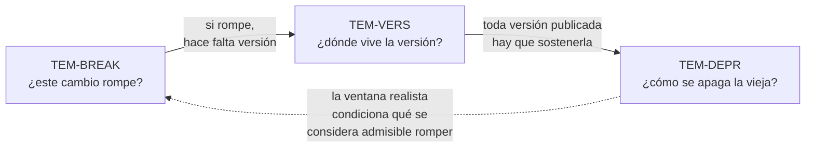
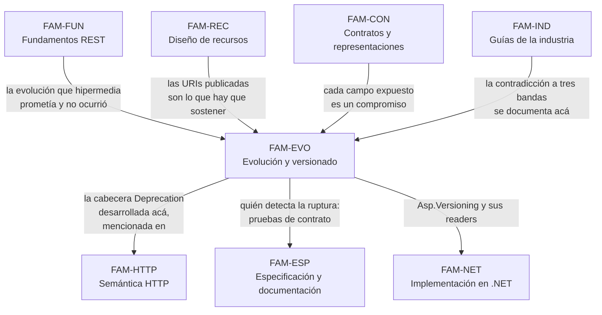

# Evolución y versionado — `FAM-EVO`

## La pregunta que responde esta familia

**¿Cómo se cambia una API sin romper a quien la usa?**

Es la pregunta de `ESC-3`, el escenario más frecuente en la vida real y el peor cubierto por el material disponible, que suele detenerse en cómo diseñar una API y no en cómo modificarla una vez publicada. La restricción que la vuelve difícil está enunciada en [`MARCO-ESCENARIOS`](../00-Marco-de-Referencia/Escenarios.md) y conviene repetirla porque gobierna todo lo que sigue: **el productor no controla el calendario del consumidor**. Una aplicación .NET MAUI instalada en un teléfono sigue llamando a la API que conocía durante meses o años después de que se publicó la nueva, y ninguna decisión técnica del lado del servidor cambia eso.

De ahí se desprende una segunda pregunta, menos evidente y más determinante: **¿cuál de mis cambios rompe?**. Tiene respuesta técnica precisa, no opinable, y la enorme mayoría de las rupturas de producción provienen de haberla contestado por intuición. Agregar es seguro, dice la intuición; agregar un campo obligatorio a una petición no lo es.

Esta familia también contiene la advertencia sobre el nivel de autoridad que más falta hace en toda la guía. **En versionado casi nada es normativo.** No hay ningún RFC que diga dónde va la versión de una API. Lo que existe son guías de organización que se contradicen frontalmente entre sí, y una práctica de plataformas grandes que no coincide con ninguna de ellas. Los dos únicos documentos normativos del tema —`N-12` y `N-13`— cubren la señalización de la deprecación, no la estrategia, y ni siquiera tienen el mismo peso formal.

---

## Documentos

| Documento | ID | Qué establece |
|---|---|---|
| [Estrategias de versionado](Estrategias-de-Versionado.md) | `TEM-VERS` | Las cinco opciones de emplazamiento de la versión, su costo real, la contradicción a tres bandas entre `G-04`, `G-05` y `G-06`, qué usan efectivamente Stripe, GitHub, Shopify, Twilio y Azure, y el criterio de elección por escenario y contexto |
| [Compatibilidad y cambios rompientes](Compatibilidad-y-Cambios-Rompientes.md) | `TEM-BREAK` | La tabla cambio → ¿rompe? → por qué, los casos contraintuitivos, el principio de robustez y su estado cuestionado según `N-14`, y cómo diseñar para poder cambiar |
| [Deprecación y retiro](Deprecacion-y-Retiro.md) | `TEM-DEPR` | El ciclo anuncio → deprecación → sunset → retiro, las cabeceras `Deprecation` (`N-12`) y `Sunset` (`N-13`) con su asimetría de estado y de formato, las ventanas reales de `P-05` y `P-07`, y la evidencia de que `P-01` y `P-08` directamente no deprecan |

El orden de lectura no es el de la tabla. [`TEM-BREAK`](Compatibilidad-y-Cambios-Rompientes.md) es el documento fundacional de la familia y conviene leerlo primero: sin saber qué constituye una ruptura no hay forma de decidir si hace falta una versión nueva, y sin esa decisión el mecanismo de versionado que se elija es indiferente. [`TEM-VERS`](Estrategias-de-Versionado.md) responde entonces dónde vive la versión, y [`TEM-DEPR`](Deprecacion-y-Retiro.md) qué pasa con la vieja.

La flecha punteada de vuelta es la que más se ignora. Una organización que no puede sostener dos versiones en paralelo tiene, de hecho, un criterio de ruptura más estricto que otra que sí puede, aunque ambas usen la misma tabla técnica.

---

## Cómo se relaciona con las demás familias

Cuatro de esas relaciones necesitan explicación.

**Con [`FAM-FUN`](../10-Fundamentos-REST/README.md).** La restricción de hipermedia de `O-01` era, en su intención, el mecanismo de evolución del estilo: si el cliente descubre las URIs en tiempo de ejecución en lugar de construirlas, el servidor puede reorganizar su espacio de nombres sin romper a nadie, que es lo que Fielding reclama en `O-02` al defender la libertad del servidor sobre su propio namespace. La medición de `O-04` dice que el 4,2 % de las APIs públicas satisface esa restricción. El versionado explícito es, en buena medida, **el precio de no haber hecho lo que hipermedia proponía**, y por eso esta familia existe con el tamaño que tiene.

**Con [`FAM-HTTP`](../30-Semantica-HTTP/README.md).** [`TEM-HEADERS`](../30-Semantica-HTTP/Cabeceras-y-Negociacion.md) menciona `Deprecation` y `Sunset` en su inventario de cabeceras y trata la negociación de contenido como mecanismo general; el tratamiento en profundidad de ambas cabeceras como instrumento de ciclo de vida está en [`TEM-DEPR`](Deprecacion-y-Retiro.md), y la evaluación de la negociación por media type **como estrategia de versionado** está en [`TEM-VERS`](Estrategias-de-Versionado.md). Son preguntas distintas sobre el mismo mecanismo.

**Con [`FAM-ESP`](../60-Especificacion-y-Documentacion/README.md).** La división de trabajo es nítida y conviene retenerla: esta familia **define qué es una ruptura**, y [`TEM-CLIENTES`](../60-Especificacion-y-Documentacion/Clientes-y-Pruebas-de-Contrato.md) explica **cómo se detecta automáticamente** mediante pruebas de contrato y comparación de documentos OpenAPI entre versiones. Una tabla de rupturas sin mecanismo de detección se aplica cuando alguien se acuerda; un mecanismo de detección sin definición de ruptura marca ruido.

**Con [`FAM-IND`](../90-Guias-de-la-Industria/README.md).** El versionado es la decisión donde las guías corporativas divergen más, hasta el punto de que una prohíbe explícitamente lo que otra exige. [`TEM-GCOMP`](../90-Guias-de-la-Industria/Comparativa.md) recoge la comparación general entre guías; la contradicción específica de versionado se desarrolla en [`TEM-VERS`](Estrategias-de-Versionado.md) porque es donde el lector la necesita para decidir.

---

## Quién conduce

`ACT-06`, el product owner de API, según la matriz de [`MARCO-ACTORES`](../00-Marco-de-Referencia/Actores.md). Es el actor cuya existencia más se omite y el que más falta hace acá, porque las dos decisiones centrales de la familia —publicar una versión nueva y apagar una vieja— figuran en esa matriz con `ACT-06` como decisor y no como consultado.

La razón es que ninguna de las dos es una decisión técnica. Cuánto tiempo se sostiene una versión vieja es una negociación entre el costo de mantenerla y el costo de forzar la migración de los consumidores, y `MARCO-ACTORES` señala que «apagar una versión vieja» es una de las dos filas de su matriz donde el costo lo paga un actor y la decisión la toma otro. Sin alguien que conduzca esa negociación, la versión vieja se sostiene indefinidamente por miedo o se apaga de golpe por cansancio.

`ACT-01` decide la estrategia de versionado —una decisión de arquitectura, tomada una vez y cara de revertir— y `ACT-03` aporta la evidencia que nadie más tiene: qué se rompió, cuándo y con qué aviso.

---

## Qué se lleva el lector de esta familia

Responder «¿este cambio rompe?» con un criterio técnico y no con una impresión, incluidos los seis o siete casos donde la respuesta contradice la intuición.

Elegir un mecanismo de versionado sabiendo de quién es cada prescripción que va a encontrar, y sabiendo que la opción teóricamente más correcta es la que tiene adopción nula entre las plataformas verificadas.

Escribir una política de deprecación con fechas defendibles, lo que exige medir el consumo por versión: sin esa medición la fecha de apagado se fija por intuición, y esa es la observación con la que `MARCO-ESCENARIOS` cierra la descripción de `ESC-3`.

---

## Advertencia sobre la autoridad en este tema

En ninguna otra familia de la guía es tan alta la proporción de prescripción sin fundamento. Conviene entrar con tres hechos a la vista.

No existe documento normativo alguno que fije dónde va la versión de una API. `N-60` —la única guía de primera parte de Microsoft sobre el tema— enumera cinco enfoques y deliberadamente no prescribe ninguno.

Las guías de organización se contradicen de frente: `G-04` AIP-185 exige la versión en el path, `G-05` regla 115 la **prohíbe** en la URL y su regla 114 exige media type versioning, y `G-06` recomienda la URI justamente para evitar los media types custom que `G-05` manda usar. Ninguna de las tres es normativa fuera de su organización.

Y la evidencia `P-xx` de lo que las plataformas hacen no coincide con ninguna de esas prescripciones. En este tema, esta guía sostiene que **la evidencia de la práctica pesa más que la prescripción**, porque son decisiones que ya sobrevivieron años de contacto con consumidores reales; pero `P-xx` prueba qué se hace y jamás qué corresponde hacer, y donde esta guía toma partido lo declara con la fórmula «esta guía recomienda».
