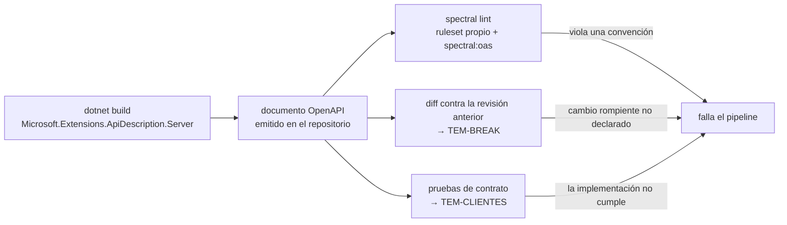

# Design-first y code-first — `TEM-DESIGNFIRST`

## 1. Resumen ejecutivo

Un documento OpenAPI se puede escribir antes que el código o derivar de él. La primera opción convierte la especificación en la fuente de verdad y al código en su implementación; la segunda convierte al código en la fuente de verdad y a la especificación en su reflejo. La decisión parece de proceso y es de gobierno: determina quién puede cambiar el contrato y en qué momento se entera el resto.

La discusión suele plantearse como si hubiera un ganador, y no lo hay. Design-first compra revisabilidad y paralelismo, y cuesta ceremonia y sincronización. Code-first compra velocidad y coherencia automática entre lo declarado y lo implementado, y cuesta que el contrato se decida en el mismo *commit* en que se escribe la lógica —el problema que `MARCO-ACTORES` describe como decisiones sin dueño—. Lo que hace decidible la elección no es el escenario sino el **contexto**: en `CTX-1` design-first es casi obligatorio, en `CTX-2` es genuinamente discutible.

Hay además un desenlace que ninguna de las dos opciones evita por sí sola y que es el hallazgo más frecuente de `ESC-4a`: la **divergencia entre lo que la especificación declara y lo que la implementación hace**. Design-first la produce cuando el código se adelanta; code-first la produce cuando las anotaciones se desactualizan. Se combate con verificación automática, no con elegir bien el enfoque.

---

## 2. Definición

### Qué es

**Design-first** es el enfoque en el que el documento OpenAPI se escribe y se acuerda antes de que exista la implementación, y el código se construye para cumplirlo. La especificación es un artefacto de primera clase: se versiona, se revisa y su cambio es un evento con dueño.

**Code-first** es el enfoque inverso: el documento se genera a partir del código —de las firmas de los endpoints, de los tipos de retorno, de atributos y metadatos— y es un producto de la compilación. En ASP.NET Core con .NET 10 es el camino que la plataforma facilita: `AddOpenApi()` produce el documento desde lo que el enrutamiento y los tipos ya declaran (`N-32`).

La oposición no es binaria en la práctica. Existe un tercer arreglo, que esta guía llama **contrato revisado**, en el que el documento se genera desde el código pero se emite en el build, se versiona en el repositorio y su diff se revisa como parte de la revisión de código. Formalmente es code-first; en gobierno se comporta como design-first para todo lo que importa.

### Qué problema resuelve la elección

Resuelve **quién decide el contrato y cuándo**. `MARCO-ACTORES` describe el caso típico: el desarrollador que implementa un endpoint elige el nombre del recurso, el formato del error y el criterio de paginación en el mismo *commit* en que escribe la lógica, sin que nadie haya fijado esas convenciones. Design-first mueve esa decisión a un momento anterior y a un artefacto separado, donde `ACT-01` y `ACT-05` pueden intervenir. Code-first la deja donde está y compensa —cuando compensa— con verificación posterior.

### Qué no es

**No es una decisión sobre herramientas.** Se puede hacer design-first con Swashbuckle y code-first escribiendo YAML a mano —mal, pero se puede—. La herramienta no determina el enfoque; determina cuánta fricción tiene cada uno.

**No es una decisión sobre calidad del documento.** Un documento escrito a mano puede ser pobre y uno generado puede ser excelente. Lo que design-first garantiza no es calidad sino **revisabilidad**: que exista un momento en el que alguien mira el contrato sin mirar la implementación.

**No es lo mismo que «contract-first» en el sentido de SOAP.** Ahí el contrato era ejecutable: del WSDL se generaba el esqueleto del servidor y romper el contrato era imposible sin regenerar. En el mundo de OpenAPI la generación de servidores desde la especificación existe pero es marginal en .NET, y lo habitual es que el código pueda apartarse del documento sin que nada lo impida. Esa diferencia es la razón por la que la divergencia es un problema aquí y no lo era allá.

**No resuelve la divergencia.** Ver la sección 4.3.

---

## 3. Aplicación por escenario

### `ESC-1` — API nueva

Es el escenario donde la elección es libre y donde tiene más consecuencias, porque `ESC-1` termina siempre en `ESC-3` y el enfoque adoptado se hereda.

`MARCO-ESCENARIOS` fija como criterio de terminación de `ESC-1` que exista «una especificación OpenAPI revisada **antes de que se escriba el primer controlador**». Leído literalmente eso es design-first, y es la posición de esta guía para `CTX-1`. Para los demás contextos la exigencia razonable es más débil y se cumple igual con contrato revisado: lo que el criterio protege no es el orden cronológico sino que el contrato haya sido mirado por alguien distinto de quien lo implementó.

`G-06`, la guía del GDS británico, prescribe producir documentos OpenAPI **antes** de codificar. Vale para quien adopta esa guía; es una prescripción de organización, no una norma.

**Qué cambia por contexto.** En `CTX-1` design-first, sin matices: el contrato es el producto, sus consumidores son desconocidos, y todo lo que se publique hay que sostenerlo. En `CTX-2` es discutible de verdad —ver la sección 4.1—. En `CTX-3` con cliente web desplegado junto al backend, code-first con verificación es defendible; con cliente móvil instalado, el contexto se comporta como `CTX-1` y la exigencia sube. En `CTX-4` la pregunta no se plantea: el contrato viene dado.

### `ESC-2` — Exposición o migración

Design-first tiene aquí un argumento que no tiene en ningún otro escenario, y es el más fuerte de todo el documento. La tensión del escenario es que el modelo interno empuja hacia una API que lo refleja. **Code-first sobre un sistema heredado materializa exactamente ese empuje**: los tipos que el código ya tiene se convierten en los esquemas del documento, y el resultado es un contrato público que hereda decisiones de modelado de hace quince años sin que nadie las haya defendido.

Escribir el documento objetivo primero —desde el punto de vista del consumidor, no del sistema— y usarlo como especificación del adaptador es la técnica que hace explícito el costo de traducción que el escenario dice que conviene declarar ante quien financia el proyecto.

**Qué cambia por contexto.** En `CTX-2` el argumento se debilita algo porque el consumidor conocido puede absorber un contrato imperfecto; no desaparece, porque el sistema heredado va a sobrevivir a varios consumidores.

### `ESC-3` — Evolución en producción

La elección de enfoque importa menos que el mecanismo de detección. Lo determinante acá es que **exista una línea de base contra la cual comparar**, y eso lo da igual el documento escrito a mano que el emitido en el build, siempre que esté versionado en el repositorio.

El enfoque sí cambia dónde se discute el cambio. En design-first la modificación del contrato es un cambio al documento y se discute antes de implementarse; en code-first aparece como efecto colateral de un cambio de código y hay que descubrirlo. De ahí que el arreglo de contrato revisado —diff del documento en la revisión de código— sea el mínimo defendible en este escenario: sin él, un cambio rompiente puede pasar la revisión porque el revisor miró la lógica y no el contrato, que es la falla que `MARCO-ACTORES` atribuye a `ACT-02`.

**Qué cambia por contexto.** En `CTX-1` el cambio del documento debe preceder a la publicación y anunciarse. En `CTX-2` alcanza con que el diff sea visible y alguien lo mire.

### `ESC-4` — Evaluación de una API ajena

**`ESC-4a` es donde este documento tiene su hallazgo central.** La evaluación no consiste en juzgar qué enfoque usó el equipo evaluado —dato que rara vez está disponible y que importa poco— sino en medir la **distancia entre la especificación y la implementación**, que es el síntoma observable de cómo se gobierna el contrato.

El escenario nombra los hallazgos: campos documentados que ya no se devuelven, códigos de estado que el código emite y la especificación no declara, parámetros opcionales que en la práctica son obligatorios. Los tres se detectan del mismo modo: ejecutando la API contra su propio documento. La sección 4.3 desarrolla el método; la verificación automatizada de esa distancia es materia de [`TEM-CLIENTES`](Generacion-de-Clientes-y-Pruebas-de-Contrato.md).

Un indicio secundario, barato de obtener y bastante informativo: **si el documento tiene descripciones escritas por una persona, alguien lo miró**. Un documento con `summary` autogenerados a partir del nombre del método y `description` vacías indica que nunca hubo revisión de contrato, con independencia de qué enfoque se declare.

**`ESC-4b`** no permite la comparación porque no hay especificación. Lo que corresponde es producirla como salida, marcando por operación qué se observó y qué se infirió.

**Qué cambia por contexto.** En `CTX-4`, evaluar la distancia entre la especificación del proveedor y su comportamiento real es parte del trabajo de decidir si integrarse, y el resultado condiciona cuánto aislamiento hay que construir.

---

## 4. Ejemplos concretos

Ejemplos **sintéticos** del dominio de reserva de salas.

### 4.1 Los dos enfoques, comparados

| | Design-first | Code-first |
|---|---|---|
| **Fuente de verdad** | El documento OpenAPI | El código |
| **Momento de la decisión de contrato** | Antes de implementar | Durante la implementación |
| **Quién decide de hecho** | `ACT-01` con `ACT-05` | `ACT-02` |
| **Revisión del contrato** | Es un artefacto propio y revisable | Hay que provocarla |
| **Trabajo en paralelo** | Productor y consumidor arrancan a la vez desde el documento | El consumidor espera a que exista el endpoint |
| **Riesgo de divergencia** | El código se aparta del documento | El documento refleja código pero no intención |
| **Costo de arranque** | Alto: hay que escribir y acordar antes de producir nada | Bajo: sale del build |
| **Costo sostenido** | Mantener dos artefactos sincronizados | Descubrir tarde las decisiones de contrato |
| **Falla característica** | El documento queda viejo porque nadie lo actualiza al cambiar el código | El contrato acumula decisiones que nadie tomó conscientemente |

La fila de trabajo en paralelo es la que más peso tiene en organizaciones con equipos separados y la que menos se menciona. Con un documento acordado, el equipo del cliente puede generar su cliente y trabajar contra un simulador mientras el productor implementa. Sin él, hay una dependencia secuencial que en `CTX-2` suele ser el verdadero cuello de botella.

**Por qué en `CTX-1` design-first es casi obligatorio.** `MARCO-CONTEXTOS` lo enuncia sin ambigüedad: en una API pública la especificación OpenAPI **es el producto**, no un subproducto, y todo campo expuesto es un compromiso que hay que sostener durante años. Un contrato que se decide en el momento de implementar es un contrato que nadie revisó, y en `CTX-1` no hay forma de corregirlo después sin romper a consumidores incoordinables. El «casi» cubre un caso: una API pública derivada de una interna ya estabilizada, donde el contrato efectivamente existía antes aunque el documento no.

**Por qué en `CTX-2` es discutible.** El mismo documento dice que en `CTX-2` la especificación vale menos como contrato y más como generador: de clientes tipados, de pruebas de contrato y de documentación que nadie va a escribir a mano. Para esos tres usos, un documento generado desde el código sirve igual de bien, y a veces mejor, porque está garantizadamente sincronizado con la implementación. A eso se suma que el cambio rompiente es coordinable: equivocarse en el contrato cuesta un despliegue conjunto, no una migración de consumidores. El argumento contrario, y no es débil, es que la premisa de coordinación sobrevive hasta que el equipo rota, y que el riesgo dominante del contexto —el acoplamiento invisible que produce un monolito distribuido— se alimenta precisamente de contratos que nadie revisó.

Esta guía recomienda, para `CTX-2`, el arreglo de contrato revisado: code-first con el documento emitido en el build, versionado en el repositorio y su diff mirado en cada revisión de código. Captura la mayor parte del beneficio de design-first sin su costo de sincronización.

### 4.2 Los tres arreglos, en flujo

```mermaid
flowchart TD
    subgraph DF["Design-first"]
        D1["Se escribe el documento"] --> D2["ACT-01 y ACT-05 lo revisan"]
        D2 --> D3["Se implementa contra él"]
        D3 --> D4["Prueba de contrato verifica<br/>que la implementación cumple"]
        D4 -.->|falla| D3
    end
    subgraph CF["Code-first"]
        C1["Se implementa el endpoint"] --> C2["El build emite el documento"]
        C2 --> C3["Se publica"]
    end
    subgraph CR["Contrato revisado"]
        R1["Se implementa el endpoint"] --> R2["El build emite el documento"]
        R2 --> R3["El diff aparece en la revisión de código"]
        R3 --> R4["Linter en CI verifica convenciones"]
        R4 -.->|falla| R1
        R3 -.->|el revisor objeta el contrato| R1
    end
```



Lo que distingue a code-first puro no es que genere el documento sino que **no tiene ningún punto de retorno**: nada entre la implementación y la publicación puede objetar el contrato.

### 4.3 La divergencia entre especificación e implementación

Es el hallazgo más frecuente de `ESC-4a` y merece tratamiento propio porque los dos enfoques la producen por caminos distintos.

En **design-first** la divergencia aparece cuando el código se adelanta al documento. Un desarrollador agrega un campo a la respuesta porque el cliente lo necesitaba, y no vuelve al YAML. Al cabo de unos meses el documento describe una API que ya no existe, y —peor— los consumidores que generaron su cliente desde él tienen tipos incompletos.

En **code-first** la divergencia toma otra forma, menos obvia y más engañosa: el documento refleja fielmente las **firmas** del código y no su **comportamiento**. Un endpoint declarado como `Task<Ok<Reserva>>` genera un documento que promete `200` con una reserva, aunque el código lance una excepción que el middleware traduce a `409` en la mitad de los casos reales. La especificación es sincrónicamente correcta y sustancialmente falsa.

`MARCO-ESCENARIOS` lo dice en una frase que conviene retener: una especificación generada desde el código a partir de anotaciones reduce esa divergencia pero no la elimina, porque las anotaciones también se desactualizan.

Lo que sí la reduce de forma sostenida es la verificación automática, que tiene dos formas complementarias y ninguna sustituye a la otra. La **estática** compara el documento contra sí mismo y contra reglas: es el *linting*. La **dinámica** ejecuta la API y compara sus respuestas reales contra el documento: son las pruebas de contrato, que trata [`TEM-CLIENTES`](Generacion-de-Clientes-y-Pruebas-de-Contrato.md).

Un ejemplo concreto del dominio, del tipo que aparece en cada evaluación de `ESC-4a`:

```yaml
# Lo que el documento declara para POST /salas/{salaId}/reservas
responses:
  "201": { description: Reserva creada. }
  "400": { description: Petición inválida. }
```

```http
# Lo que la API responde cuando hay solapamiento
HTTP/1.1 409 Conflict
Content-Type: application/problem+json

{ "type": "https://api.ejemplo.com/errores/solapamiento",
  "title": "La sala ya tiene una reserva en ese intervalo",
  "status": 409 }
```

El `409` funciona correctamente, está bien elegido y es invisible para cualquier consumidor que haya generado su cliente desde el documento. Ese cliente va a tratarlo como un error inesperado, y probablemente a reintentar. Un código de estado no declarado no es un defecto menor de documentación: es un camino de fallo que el consumidor no puede manejar.

### 4.4 Linting de OpenAPI en integración continua

Es la forma que `MARCO-ACTORES` identifica para que `ACT-01` ejerza autoridad sin ser cuello de botella: *«no la revisión caso por caso sino el documento de convenciones más un mecanismo automático que las verifique —un linter de OpenAPI en la integración continua—»*. Este documento la desarrolla porque es el punto donde la convención escrita se vuelve ejecutable.

`N-32` documenta el caso de uso de forma explícita: generar el documento en *build time* con `Microsoft.Extensions.ApiDescription.Server` y lintearlo con **Spectral**, mediante `spectral lint` y un `.spectral.yml` que extienda el ruleset `spectral:oas`. Que hay organizaciones que lo hacen está evidenciado: `G-07` incluye un ruleset propio, `adidas-spectral.yaml`, junto a sus guías.

El flujo completo:



Un ruleset de ejemplo, con reglas que corresponden a decisiones de las familias anteriores de esta guía:

```yaml
# .spectral.yml — sintético, para la API de reserva de salas
extends: ["spectral:oas"]
rules:
  # Toda operación declara al menos una respuesta de error (TEM-ERR)
  operacion-declara-error:
    given: "$.paths[*][get,post,put,patch,delete].responses"
    then:
      function: schema
      functionOptions:
        schema:
          type: object
          anyOf:
            - required: ["400"]
            - required: ["404"]
            - required: ["409"]
    severity: error

  # operationId presente y estable: es el nombre del método en el cliente generado
  operacion-tiene-operationid:
    given: "$.paths[*][get,post,put,patch,delete]"
    then: { field: operationId, function: truthy }
    severity: error

  # Las descripciones vacías son el síntoma de que nadie revisó el contrato
  operacion-tiene-descripcion:
    given: "$.paths[*][get,post,put,patch,delete]"
    then: { field: description, function: truthy }
    severity: warn
```

Dos precisiones de autoridad. Spectral es una herramienta de terceros; `N-32` la nombra como el ejemplo del caso de uso, lo que la hace **opción documentada por Microsoft, no prescripción**. Y las reglas del ejemplo son criterio propio de esta guía, derivadas de decisiones de `FAM-CON` y `FAM-EVO`: ninguna proviene de `N-19`, que no prescribe nada sobre completitud de un documento más allá de su validez estructural.

El valor de este mecanismo no es que detecte lo que un revisor humano detectaría, sino que **detecta siempre**, sin depender de que el revisor esté mirando el contrato en lugar de la lógica.

### 4.5 Revisión de contrato separada de revisión de código

`MARCO-ACTORES` lo enuncia como mitigación de que una persona ocupe varios roles: *«revisar el contrato en un paso separado de la revisión de la lógica»*. La razón es que son actividades cognitivamente distintas y compiten mal por la misma atención: quien está evaluando si la consulta de solapamiento es correcta no está evaluando si el `409` debería ser `422`.

En la práctica se implementa con muy poco. Esta guía recomienda tres medidas, en orden de costo creciente:

Que el documento OpenAPI esté versionado en el repositorio, de modo que un cambio de contrato produzca un diff visible y aislado del diff del código. Es la medida de mayor rendimiento por unidad de esfuerzo, y sale gratis con la generación en *build time*.

Que el cambio de contrato requiera una aprobación distinta de la del código, aunque sea la misma persona en otro momento. En `CTX-1` conviene que sea `ACT-01`; en `CTX-2` alcanza con que no sea el autor.

Que exista una lista de verificación de contrato —la de [`TEM-OPENAPI`](OpenAPI.md) §7.2 sirve— que el revisor recorra explícitamente, en lugar de confiar en que va a notar lo que falte.

La medida que **no** funciona, y que se intenta seguido, es pedirle al revisor de código que además revise el contrato sin cambiar nada más. `MARCO-ACTORES` describe por qué: las desviaciones de contrato «no se ven en revisión si el revisor mira la lógica y no el contrato».

---

## 5. Preguntas guía

- ¿Quién decidió, en el último endpoint que agregamos, cómo se llamaban sus campos y qué código de estado devolvía cada fallo? ¿Fue una decisión o un efecto de la implementación?
- Si hoy comparo mi documento OpenAPI con lo que mi API efectivamente responde, ¿cuántas diferencias encuentro? ¿Sé la respuesta o la estoy suponiendo?
- ¿Un cambio de contrato produce un diff visible en el repositorio, o queda enterrado en un cambio de código?
- ¿Qué mecanismo automático verifica mis convenciones? Si no hay ninguno, ¿cómo sé que se cumplen?
- En `CTX-2`, ¿el argumento de que «el equipo se conoce» sigue siendo cierto con la gente que hay hoy?
- ¿Un consumidor podría empezar a construir su cliente antes de que yo termine de implementar? Si no, ¿cuánto cuesta esa espera?

---

## 6. Criterios de calidad

La señal de que el enfoque —cualquiera sea— está funcionando es que **el contrato y la implementación no divergen, y alguien lo verifica sin depender de la buena voluntad**.

| Señal | Aplicación pobre | Aplicación buena |
|---|---|---|
| **Ubicación del documento** | Fuera del repositorio, en un portal o un wiki | Versionado junto al código que lo implementa |
| **Momento de la revisión** | Después de publicar, si alguien reclama | Antes de fusionar el cambio |
| **Verificación** | Ninguna; se confía en la disciplina | Linter en CI más pruebas de contrato |
| **Convenciones** | Un documento que nadie lee | Un ruleset que falla el pipeline |
| **Autoridad de `ACT-01`** | Revisa cada *pull request* o no revisa ninguno | Fija reglas y las automatiza |
| **Divergencia conocida** | Se descubre en `ESC-4a`, por un tercero | Se detecta en el build |

### Antipatrones

**Design-first ceremonial.** Se escribe el documento, se aprueba, se implementa otra cosa y nadie vuelve al documento. Es peor que code-first, porque produce un artefacto en el que la organización cree y que miente. El síntoma es un documento cuya última modificación es muy anterior a la del código que describe.

**Code-first sin punto de retorno.** El documento sale del build y se publica sin que nada ni nadie pueda objetarlo. Es el arreglo por defecto de un proyecto que activó `AddOpenApi()` y no pensó más en el tema, y es exactamente el que produce el problema de `MARCO-ACTORES`: convenciones decididas por omisión.

**`ACT-01` revisando nombre por nombre.** El propio marco lo señala: un arquitecto que revisa caso por caso se vuelve cuello de botella y termina siendo ignorado. Cuando la revisión de contrato es manual y exhaustiva, la organización aprende a esquivarla.

**Confundir tener un linter con tener convenciones.** Un `.spectral.yml` que solo extiende `spectral:oas` verifica validez estructural, no las decisiones de esta guía. El casing de los campos, el formato de error y el criterio de paginación no se verifican solos; hay que escribir las reglas.

**Aplicar el aparato de `CTX-1` en `CTX-2`.** `MARCO-CONTEXTOS` nombra los dos errores simétricos, y este es el que suele producir el rechazo del enfoque entero. Design-first completo, con aprobaciones formales y ciclos de revisión, sobre una API interna entre dos servicios del mismo equipo, es ceremonia que nadie aprovecha y que desprestigia la práctica cuando llega el caso en que sí hace falta.

**Tratar la divergencia como un problema de documentación.** No lo es. Un código de estado no declarado es un camino de fallo que el consumidor no puede manejar, y un campo declarado que ya no se devuelve rompe a quien lo deserializa con validación estricta. Son defectos de contrato, con la severidad de un defecto funcional.

---

## 7. Anexo

### 7.1 Plantilla de decisión de enfoque

Se completa al inicio del trabajo sobre una API y se revisa cuando cambia el contexto —el caso típico es una API interna que se abre al público—.

```yaml
contexto: CTX-?
escenario: ESC-?

enfoque_adoptado: design-first | code-first | contrato-revisado
justificacion: ""                 # por qué este y no otro, en una frase

artefacto:
  ubicacion: ""                   # ruta del documento en el repositorio
  generado_en: build | runtime | escrito-a-mano
  formato: json | yaml            # YAML en build time no está soportado: ver TEM-OPENAPI
  version_openapi: "3.1"          # default de .NET 10
  versionado_en_repositorio: si | no

gobierno:
  quien_aprueba_un_cambio_de_contrato: ACT-??
  revision_separada_de_la_de_codigo: si | no
  linter: ""                      # herramienta y ruta del ruleset
  reglas_propias: []              # las que no vienen del ruleset base

verificacion:
  linting_en_ci: si | no
  diff_contra_revision_anterior: si | no
  pruebas_de_contrato: si | no    # ver TEM-CLIENTES
  divergencias_conocidas: []      # las que se aceptaron y por qué
```

El campo `divergencias_conocidas` es el que más información aporta, por la misma razón que `sin_asignar` en la ficha de `MARCO-ACTORES`: una divergencia registrada es una decisión; una no registrada es una que nadie miró.

### 7.2 Lista de verificación de revisión de contrato

Se recorre sobre el **diff del documento OpenAPI**, no sobre el documento entero y no sobre el código. Diez minutos bien gastados.

```yaml
sobre_lo_que_se_agrega:
  - las operaciones nuevas siguen las convenciones de URI de TEM-URI
  - los campos nuevos siguen el casing fijado en TEM-CAMPOS
  - toda operación nueva declara sus respuestas de error
  - los esquemas nuevos tienen nombres del dominio, no del modelo interno
  - los operationId nuevos son legibles y previsiblemente estables

sobre_lo_que_cambia:
  - ningún campo cambió de nombre ni de tipo sin declararlo rompiente (TEM-BREAK)
  - ningún campo pasó de opcional a requerido en un cuerpo de petición
  - ningún enumerado ganó valores sin evaluar el impacto en clientes estrictos
  - ninguna respuesta declarada desapareció
  - ninguna validación se endureció respecto de la revisión anterior

sobre_lo_que_desaparece:
  - lo eliminado estaba marcado deprecated en una revisión anterior
  - hay evidencia de que nadie lo consume, o el contexto permite coordinarlo
  - las cabeceras Deprecation y Sunset correspondientes se emitieron a tiempo (TEM-DEPR)

sobre_el_gobierno:
  - el revisor no es el autor del cambio
  - el linter pasó, y sus reglas cubren lo que se está revisando a mano
  - si el cambio es rompiente, ACT-06 lo sabe y hay una decisión de versionado
```
