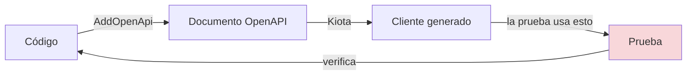
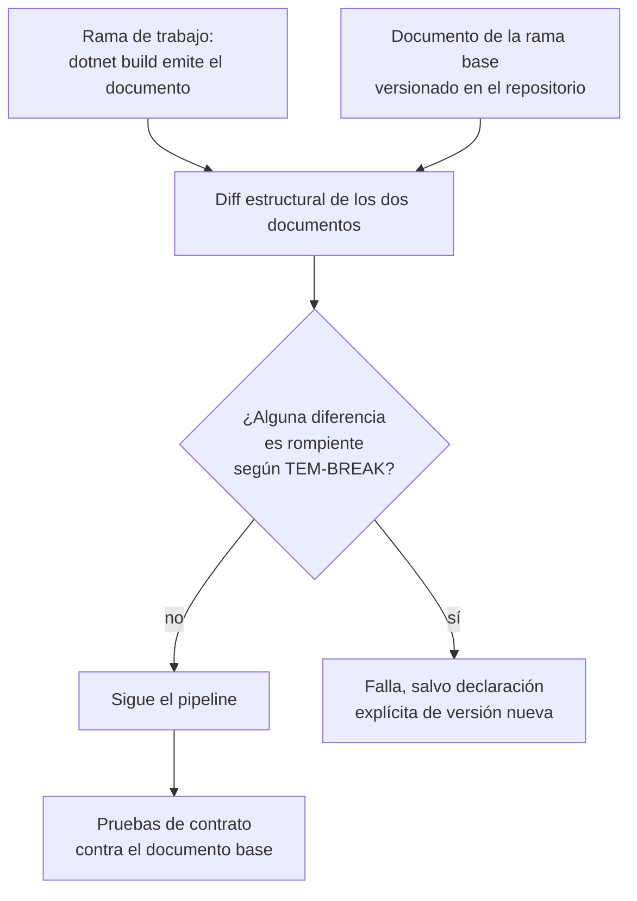

# Generación de clientes y pruebas de contrato — `TEM-CLIENTES`

## 1. Resumen ejecutivo

Un documento OpenAPI habilita dos usos que justifican por sí solos el trabajo de mantenerlo bien. Del lado del consumidor, permite **generar el cliente** en lugar de escribirlo: los tipos, los métodos y la serialización salen del documento, y lo que queda por escribir es la lógica de negocio. Del lado del productor, permite **verificar que la implementación cumple lo declarado**, que es la única defensa sostenible contra la divergencia que [`TEM-DESIGNFIRST`](Design-First-y-Code-First.md) identifica como el hallazgo más frecuente de `ESC-4a`.

Ambos usos tienen costos que se subestiman. Un cliente generado acopla el código consumidor a la forma del documento, incluyendo sus errores; regenerarlo tras un cambio de contrato produce diffs enormes y a veces roturas de compilación causadas por cambios que no eran rompientes en el cable. Y una prueba de contrato mal planteada verifica que el código coincide consigo mismo, lo que no prueba nada.

En .NET la herramienta de generación de primera parte es **Kiota** (`N-59`), producto oficial de Microsoft. Para la verificación, el andamiaje es `WebApplicationFactory<TEntryPoint>` del paquete `Microsoft.AspNetCore.Mvc.Testing` (`N-55`, `N-56`), y para la exploración manual los archivos `.http` (`N-57`). Este documento trata específicamente las pruebas **de contrato**; el andamiaje de pruebas de la API en general es materia de [`TEM-PRUEBAS`](../80-Implementacion-en-NET/Pruebas-de-API.md).

---

## 2. Definición

### Qué es

**Generar un cliente** es producir automáticamente, a partir de un documento OpenAPI, el código que un consumidor usa para llamar a la API: los tipos de petición y respuesta, un método por operación, y la maquinaria de serialización y de construcción de URLs.

**Una prueba de contrato** es una prueba cuyo objeto no es el comportamiento de negocio sino la **conformidad con la especificación**: que la respuesta a una petición dada tenga el código de estado declarado, el media type declarado y un cuerpo que valide contra el esquema declarado. Es una afirmación sobre la relación entre dos artefactos —el documento y la implementación—, no sobre la corrección de ninguno de los dos por separado.

### Qué problema resuelven

El cliente generado resuelve un problema de **volumen y de deriva**. Escribir a mano cuarenta métodos que arman URLs y deserializan JSON es trabajo mecánico, y cada uno es una oportunidad de escribir mal un nombre de campo. Peor: cuando el contrato cambia, el cliente escrito a mano no se entera —sigue compilando y falla en ejecución—, mientras que el generado deja de compilar, lo que convierte un fallo de producción en un fallo de build.

La prueba de contrato resuelve el problema que ninguna otra prueba cubre. Las pruebas unitarias verifican lógica; las de integración verifican que el sistema funciona de punta a punta. Ninguna de las dos mira el documento OpenAPI, de modo que ninguna detecta que la API devuelve un `409` que el documento no declara, ni que un campo declarado como requerido llega a veces en `null`. Ese hueco es exactamente donde vive la divergencia.

### Qué no son

**Un cliente generado no es una capa de aislamiento.** Es lo contrario: propaga la forma del contrato ajeno hacia adentro del código consumidor. En `CTX-4`, donde el riesgo dominante es que el modelo del proveedor se filtre al dominio propio, usar los tipos generados directamente en la lógica de negocio es el antipatrón, no la solución. El cliente generado va detrás de una interfaz propia; la traducción es trabajo, y es el trabajo que hace reemplazable al proveedor.

**Una prueba de contrato no es una prueba de integración.** Comparten el andamiaje y difieren en el oráculo: la de integración compara contra lo que el desarrollador espera, la de contrato compara contra lo que el documento declara. Una prueba de integración escrita a partir del código pasa aunque el documento diga otra cosa.

**Una prueba escrita con el cliente generado desde el propio documento no es una prueba de contrato.** Es la trampa más elegante del área y merece la sección 4.4.

**Un archivo `.http` no es una prueba.** Es exploración manual. No falla un pipeline y no verifica nada por sí solo.

---

## 3. Aplicación por escenario

### `ESC-1` — API nueva

La generación de clientes es una razón fuerte, y a veces la única concreta, para invertir en la calidad del documento durante este escenario. Vale la pena hacerla temprano por una razón poco obvia: **generar el cliente desde el documento revela defectos del documento que la lectura no revela**. Un esquema sin nombre produce un tipo anónimo; un `operationId` ausente produce un nombre de método ilegible; un enumerado sin valores produce un `string`. Esta guía recomienda generar el cliente una vez antes de implementar nada, aunque no se vaya a usar, solo para mirar qué salió.

Las pruebas de contrato en `ESC-1` sirven menos de lo que parece mientras el documento y el código se escriben juntos, y empiezan a servir en cuanto hay más de un contribuyente. Su valor real es acumulativo: la prueba escrita hoy protege el cambio que se haga dentro de un año, ya en `ESC-3`.

**Qué cambia por contexto.** En `CTX-1` el cliente generado no es para uno: es lo que los integradores van a producir desde el documento publicado, lo que convierte la calidad de los `operationId` y los nombres de esquema en parte de la interfaz pública. En `CTX-2` y `CTX-3` el cliente generado es de consumo propio y la exigencia es menor.

### `ESC-2` — Exposición o migración

El cliente generado tiene aquí un uso específico del escenario: **como criterio de aceptación del modelo de recursos**. Si el cliente generado desde el documento objetivo produce tipos con nombres del dominio y métodos que se leen como operaciones de negocio, la traducción funcionó; si produce `TbReservaCabResponse`, no.

Las pruebas de contrato cumplen la función de verificar que el adaptador efectivamente traduce, y no que dejó pasar campos del sistema heredado. Es más común de lo que parece que un mapeo incompleto deje escapar propiedades que el documento no declara.

**Qué cambia por contexto.** En `CTX-4`, si la migración es de la integración con un proveedor, lo que se genera es el cliente **contra** la especificación ajena, y la pregunta pasa a ser cuán fiel es esa especificación.

### `ESC-3` — Evolución en producción

Es el escenario donde ambas técnicas rinden más, y por motivos distintos.

La **detección de cambios rompientes** es el uso de mayor valor. Con el documento emitido en el build y versionado —el mecanismo que describe [`TEM-OPENAPI`](OpenAPI.md) §4.5—, cada revisión produce un par de documentos comparables, y las diferencias se clasifican según los criterios de [`TEM-BREAK`](../50-Evolucion-y-Versionado/Compatibilidad-y-Cambios-Rompientes.md). Lo que esto elimina es la peor propiedad del escenario: que un cambio rompiente pase la revisión porque nadie lo reconoció como tal. `MARCO-ESCENARIOS` enumera las trampas —campo obligatorio nuevo en una petición, valor nuevo en un enumerado, validación endurecida— y las tres son visibles en un diff de esquemas y difíciles de ver en un diff de C#.

Las **pruebas de contrato** protegen el otro flanco: que el documento siga siendo cierto después del cambio. Un refactor que altera el código de estado de un caso de borde no toca el documento y no rompe ninguna prueba de integración escrita desde el código; una prueba de contrato lo detecta.

Y los **clientes generados** introducen una restricción propia del escenario: cuando el consumidor genera su cliente desde el documento, cambios que no son rompientes en el cable pueden serlo en la compilación del consumidor. Renombrar un `operationId`, cambiar el nombre de un esquema o mover un esquema de inline a `components` no altera un solo byte de las respuestas y rompe el build de quien regenere. En `CTX-1` esto obliga a tratar esos nombres como parte del contrato.

**Qué cambia por contexto.** En `CTX-1` hay que conservar los documentos de todas las versiones vivas, porque un integrador puede regenerar contra una versión antigua. En `CTX-2` el diff basta. En `CTX-3` con clientes instalados, la versión del documento contra la que se generó cada versión del cliente es información operativa que conviene registrar.

### `ESC-4` — Evaluación de una API ajena

**`ESC-4a`** es donde estas técnicas se aplican en su forma más directa, porque la especificación es la entrada de la evaluación. El método es ejecutar la API contra su propio documento y registrar cada divergencia. Dos pasadas rinden lo suficiente para un diagnóstico:

La primera es generar el cliente desde el documento del sistema evaluado. Los errores y advertencias del generador son un diagnóstico gratuito de la calidad del documento: referencias rotas, esquemas sin resolver, operaciones sin identificador. Un documento que no genera un cliente limpio no genera confianza.

La segunda es ejercitar cada operación —con el cliente generado o con peticiones directas— y validar cada respuesta contra el esquema declarado, incluidos los caminos de fallo. `MARCO-ACTORES` señala que el alcance de `ACT-04` en este dominio es más amplio de lo que suele asumirse: no verificar que el camino feliz funcione, sino que los caminos de fallo estén especificados y se comporten como se especificó. Es exactamente lo que esta pasada mide.

**`ESC-4b`** no tiene documento y por lo tanto no admite pruebas de contrato en sentido estricto. Lo que sí admite es el recorrido inverso: construir un documento desde lo observado y usarlo como registro de la hipótesis, marcando por operación qué se observó y qué se infirió. Un archivo `.http` es aquí una herramienta razonable de exploración, con el límite ético y legal que `MARCO-ESCENARIOS` enuncia: sondear una API ajena solo es legítimo con autorización, dentro de los términos de servicio y sin exceder los límites de uso publicados.

**Qué cambia por contexto.** `CTX-4` es el hábitat de `ESC-4`, y ahí la evaluación tiene una consecuencia de diseño: cuanto peor la especificación del proveedor, más gruesa la capa de aislamiento que conviene construir.

---

## 4. Ejemplos concretos

Ejemplos **sintéticos**, del dominio de reserva de salas.

### 4.1 Generadores de clientes en .NET

| | Kiota | NSwag | Refit |
|---|---|---|---|
| **Origen** | **Producto oficial de Microsoft** (`N-59`) | Terceros | Terceros, mencionado en la documentación de Microsoft (`N-50`) |
| **Entrada** | Documento OpenAPI | Documento OpenAPI | Una interfaz C# escrita a mano con atributos |
| **Genera** | Cliente completo, tipos y maquinaria | Cliente completo y tipos | Implementación de la interfaz declarada |
| **Multi-lenguaje** | C#, Go, Java, PHP, Python, Ruby, TypeScript | Principalmente .NET y TypeScript | .NET |
| **Se regenera al cambiar el contrato** | Sí | Sí | No: la interfaz se mantiene a mano |
| **Estado verificado a 2026-07-20** | Documentado por Microsoft | **No verificado** | Documentado como opción de terceros |

Sobre **NSwag**: aparece mencionado en `N-62` como alternativa que el desarrollador puede integrar por su cuenta, y la documentación de Microsoft para .NET 6 a 8 remite a un artículo propio. **Su estado actual —versión, mantenimiento, soporte de .NET 10— no está verificado en las fuentes de esta guía** y no se afirma nada al respecto. Quien lo evalúe debe verificarlo por su cuenta.

**Kiota** es *«a command line tool for generating an API client to call any OpenAPI-described API»*. Instalación oficial:

```bash
dotnet tool install --global Microsoft.OpenApi.Kiota
```

Son también distribuciones oficiales la extensión de VS Code (en *public preview*), la GitHub Action `microsoft/setup-kiota` (en *public preview*) y la imagen de contenedor `mcr.microsoft.com/openapi/kiota`. `N-59` marca explícitamente como **no oficiales** el plugin de asdf, la fórmula de Homebrew y la extensión «REST API Client Code Generator» de Visual Studio. La distinción importa en una organización que revisa la procedencia de sus herramientas.

**No verificado:** la integración de Kiota con MSBuild mediante `OpenApiReference`. La página de instalación documenta CLI, Docker, `dotnet tool`, extensión de VS Code y GitHub Action, y nada más.

**Refit** es un caso distinto y por eso está en la tabla: no genera desde el documento sino desde una interfaz C# que el desarrollador escribe. `N-50` lo menciona textualmente: *«IHttpClientFactory can be used in combination with third-party libraries such as Refit»*, con el paquete `Refit.HttpClientFactory` y el registro `builder.Services.AddRefitClient<ITodoService>().ConfigureHttpClient(...)`. Es una opción de terceros documentada por Microsoft, no una prescripción. Su ventaja es el control total sobre la forma del cliente; su costo es que **no hay ningún mecanismo que garantice que esa interfaz sigue coincidiendo con el contrato**, lo que la deja expuesta a exactamente la deriva que la generación evita.

### 4.2 Los costos de generar

Cuatro costos que conviene tener presentes antes de adoptar la práctica.

**Acoplamiento a la forma del documento.** El cliente generado reproduce los nombres del documento, incluidos los malos. Si el proveedor llamó `TbReservaCab` a un esquema, ese nombre entra al código consumidor. La mitigación es una interfaz propia por delante, que en `CTX-4` no es opcional: es lo que hace reemplazable al proveedor.

**Roturas de compilación por cambios no rompientes.** Ya señalado en `ESC-3`: renombrar un `operationId` o un esquema, o mover un esquema de inline a `components` —lo que en ASP.NET Core ocurre solo, cuando un tipo pasa a usarse más de una vez, por la política de `$ref` de `N-34`—, no cambia nada en el cable y rompe el build del consumidor al regenerar.

**Tipos anónimos y pérdida de expresividad.** La misma política de `$ref` explica por qué un esquema usado una sola vez queda inline y no produce una clase con nombre. El generador hace lo que puede con eso, y lo que puede no es mucho.

**Código generado en el repositorio.** Hay que decidir si se versiona —diffs enormes en cada regeneración, pero build reproducible sin herramientas externas— o se genera en el pipeline —repositorio limpio, dependencia de una herramienta más—. Esta guía no recomienda una de las dos: recomienda que la decisión esté tomada explícitamente y que el código generado esté claramente marcado como tal, porque el peor desenlace es que alguien lo edite a mano.

### 4.3 Pruebas de contrato con `WebApplicationFactory`

El andamiaje es `WebApplicationFactory<TEntryPoint>` del paquete **`Microsoft.AspNetCore.Mvc.Testing`**, versión 10.0.0 para .NET 10 (`N-55`, `N-56`). Levanta la aplicación real sobre un `Microsoft.AspNetCore.TestHost.TestServer`, sin red, y `CreateClient()` devuelve un `HttpClient` que la ataca directamente.

El requisito documentado sigue siendo que `Program` sea accesible: `public partial class Program { }` al final del archivo de arranque, o `InternalsVisibleTo`. Los *top-level statements* funcionan como `TEntryPoint`. **No está verificado** que .NET 10 incluya un generador de código que haga público ese `Program` automáticamente: varias fuentes secundarias lo afirman y no se pudo confirmar de primera mano, de modo que esta guía sigue enseñando la declaración explícita.

Lo que sí es novedad verificada de .NET 10 (`N-56`): la clase implementa `IAsyncDisposable` además de `IDisposable`; se agregaron `UseKestrel()` con sus sobrecargas y `StartServer()`, que permiten **bindear un puerto real** y habilitan pruebas dirigidas por navegador; y `CreateServer(IWebHostBuilder)` quedó marcado obsoleto.

Una prueba de contrato mínima, del dominio:

```csharp
public sealed class ContratoDeReservas(WebApplicationFactory<Program> factory)
    : IClassFixture<WebApplicationFactory<Program>>
{
    private static readonly OpenApiDocument Documento = CargarDocumentoPublicado();

    [Fact]
    public async Task CrearReserva_conSolapamiento_respondeSegunLoDeclarado()
    {
        var cliente = factory.CreateClient();

        // Precondición: ya existe una reserva en ese intervalo.
        await cliente.PostAsJsonAsync("/v1/salas/a3f1/reservas", ReservaDeLas10);

        var respuesta = await cliente.PostAsJsonAsync("/v1/salas/a3f1/reservas", ReservaDeLas10);

        // 1. El código de estado está DECLARADO en el documento para esta operación.
        var operacion = Documento.Paths["/salas/{salaId}/reservas"].Operations[HttpMethod.Post];
        Assert.True(
            operacion.Responses.ContainsKey(((int)respuesta.StatusCode).ToString()),
            $"La API respondió {(int)respuesta.StatusCode}, que el documento no declara.");

        // 2. El media type coincide con el declarado para ese código.
        Assert.Equal("application/problem+json", respuesta.Content.Headers.ContentType?.MediaType);

        // 3. El cuerpo valida contra el esquema declarado.
        var cuerpo = await respuesta.Content.ReadAsStringAsync();
        AssertValidaContraEsquema(cuerpo, operacion.Responses["409"], Documento);
    }
}
```

Las tres aserciones son el contenido de una prueba de contrato, y el orden importa: la primera es la que detecta la divergencia más frecuente de `ESC-4a`, la del código de estado no declarado. La tercera —validación contra el esquema— requiere un validador de JSON Schema; **ninguna biblioteca concreta para esa tarea está verificada en las fuentes de esta guía**, de modo que la elección queda a cargo del lector y `AssertValidaContraEsquema` figura acá como el paso conceptual que hay que cubrir, no como una API existente.

Dos apuntes de andamiaje que valen para cualquier prueba y que trata en detalle [`TEM-PRUEBAS`](../80-Implementacion-en-NET/Pruebas-de-API.md): `WithWebHostBuilder(...)` con `ConfigureTestServices(...)` sustituye servicios por prueba, y la devolución de `builder.ConfigureServices` de la aplicación de prueba se ejecuta **después** del código de `Program.cs`, lo que determina qué registro gana.

### 4.4 La trampa: cuando la prueba no prueba nada

Es el error de diseño más elegante del área y conviene nombrarlo con precisión.

Un equipo genera su cliente desde su propio documento OpenAPI, y escribe las pruebas usando ese cliente. Las pruebas pasan. Lo que verificaron es que **el código generado desde el documento se comunica con la implementación**, lo cual es cierto siempre que la implementación responda algo con la forma correcta —y es una tautología si el documento también se generó desde la misma implementación—.



El circuito está cerrado: nada externo entra a verificar. La prueba pasa aunque el documento describa una API equivocada, porque los tres artefactos derivan del mismo origen.

El requisito para que una prueba de contrato pruebe algo es que **el oráculo sea independiente de la implementación**. Se consigue de tres maneras, en orden de fortaleza:

Con el documento acordado en design-first, escrito por alguien y no derivado del código. Es el argumento más fuerte a favor de ese enfoque y el que [`TEM-DESIGNFIRST`](Design-First-y-Code-First.md) no puede hacer solo.

Con el documento de la **revisión anterior** como oráculo. Aunque se genere desde el código, el documento publicado la última vez es independiente del código de hoy, y compararlo contra el comportamiento actual detecta toda regresión de contrato. Es lo que hace útil al contrato revisado.

Con aserciones escritas a mano sobre el cable —código de estado, cabeceras, campos concretos—, redactadas a partir del documento y no del código. Es lo más débil y lo más barato, y es mucho mejor que nada.

### 4.5 Detección de cambios rompientes en integración continua

El mecanismo conecta directamente con [`TEM-BREAK`](../50-Evolucion-y-Versionado/Compatibilidad-y-Cambios-Rompientes.md), que fija qué cambios rompen; acá está cómo se detectan sin que nadie los mire.



Las diferencias que este mecanismo detecta y que un diff de C# no muestra con claridad son precisamente las que `MARCO-ESCENARIOS` señala como trampa del escenario: un campo que pasó a `required` en un cuerpo de petición, un valor agregado a un `enum`, un `maxLength` reducido, una respuesta declarada que desapareció. Las cuatro son una línea de YAML en el diff del documento y pueden ser invisibles en el diff del código, sobre todo cuando el cambio proviene de un atributo de validación o de un tipo compartido.

Este es también el punto donde `ACT-01` obtiene lo que `MARCO-ACTORES` describe: un mecanismo automático que verifica lo que de otro modo exigiría revisar cada *pull request*. El *linting* que trata [`TEM-DESIGNFIRST`](Design-First-y-Code-First.md) §4.4 verifica convenciones sobre un documento; esta comparación verifica compatibilidad entre dos.

### 4.6 Archivos `.http`

`N-57` documenta el formato, y su alcance conviene precisarlo: el artículo se titula *«Use `.http` files in Visual Studio 2022»* y requiere VS 2022 17.8 o superior. El formato *«was inspired by the Visual Studio Code REST Client extension»*, y `.rest` se reconoce como extensión alternativa. Varias capacidades existen **solo** en la extensión de VS Code y no en Visual Studio: peticiones GraphQL, copiar y pegar cURL, historial de peticiones, guardar el cuerpo de respuesta a un archivo, autenticación por certificado, variables de prompt y líneas de petición multilínea.

`dotnet new webapi` genera uno, verificado en el código fuente de la plantilla (`N-66`).

```http
@salas_host = https://localhost:5001
@version = v1

### Listar las reservas de una sala
GET {{salas_host}}/{{version}}/salas/a3f1/reservas?desde=2026-08-01&limite=20
Accept: application/json
Authorization: Bearer {{login.response.body.$.token}}

### Crear una reserva
# @name crear
POST {{salas_host}}/{{version}}/salas/a3f1/reservas
Content-Type: application/json

{
  "desde": "2026-08-03T10:00:00Z",
  "hasta": "2026-08-03T11:00:00Z",
  "motivo": "Revisión de contrato"
}

### Repetir la misma reserva: debe responder 409 con application/problem+json
POST {{salas_host}}/{{version}}/salas/a3f1/reservas
Content-Type: application/json

{
  "desde": "2026-08-03T10:00:00Z",
  "hasta": "2026-08-03T11:00:00Z",
  "motivo": "Duplicada a propósito"
}
```

Capacidades verificadas del formato: separadores `###`, variables `@var=value`, entornos vía `http-client.env.json` con un entorno `$shared`, `http-client.env.json.user` con precedencia archivo `.http` > `.user` > `http-client.env.json`, variables de petición mediante `# @name login` y `{{login.response.body.$.token}}`, proveedores de secretos `AspnetUserSecrets`, `AzureKeyVault` y `Encrypted`, y las variables `$processEnv`, `$dotenv`, `$randomInt`, `$datetime`, `$localDatetime` y `$timestamp`. El **Endpoints Explorer** —View, Other Windows, Endpoints Explorer— permite generar peticiones desde los endpoints existentes con clic derecho, *Generate Request*.

El lugar de estos archivos en esta familia es acotado y vale declararlo: son **exploración manual**, útiles en `ESC-4b` para caracterizar una API ajena y útiles en `ESC-1` para probar a mano lo que se acaba de implementar. No verifican nada de forma automática y no reemplazan una prueba de contrato. Esta guía recomienda versionarlos junto al código, porque un `.http` que documenta los casos de borde de cada operación es documentación ejecutable barata, y advertir que **no** son el lugar para credenciales reales: para eso están los proveedores de secretos que el propio formato soporta.

### 4.7 Qué se prueba en cada escenario

| | `ESC-1` | `ESC-2` | `ESC-3` | `ESC-4a` |
|---|---|---|---|---|
| **Objeto principal** | Que el documento sea generable y completo | Que el adaptador traduzca y no filtre | Que el contrato no haya cambiado sin declararlo | Que documento e implementación coincidan |
| **Oráculo** | El documento acordado | El documento objetivo | El documento de la revisión anterior | El documento del sistema evaluado |
| **Técnica dominante** | Generar el cliente y mirar qué salió | Validar respuestas contra el esquema objetivo | Diff de documentos en CI | Ejercitar cada operación, incluidos los fallos |
| **Actor que conduce** | `ACT-01` | `ACT-01` con `ACT-02` | `ACT-02` con `ACT-04` | `ACT-04` |
| **Salida** | Documento revisado | Mapa recurso ↔ sistema interno verificado | Pipeline que falla ante rupturas | Informe del contrato observado |

---

## 5. Preguntas guía

- ¿Mi documento genera un cliente limpio? Si nunca lo intenté, ¿qué me dice eso sobre cuánto lo revisé?
- ¿Mis pruebas de contrato usan un oráculo independiente de la implementación, o los tres artefactos derivan del mismo origen?
- ¿Cada código de estado que mi API emite está declarado? ¿Incluidos los que produce el middleware y no el código de mi endpoint?
- ¿Qué pasa en mi pipeline si vuelvo obligatorio un campo de un cuerpo de petición? ¿Falla algo, o pasa?
- Si consumo una API con un cliente generado, ¿sus tipos circulan por mi dominio? ¿Cuánto costaría cambiar de proveedor?
- ¿Guardo los documentos de las versiones que siguen vivas, o solo el de la última?

---

## 6. Criterios de calidad

La señal es que **una ruptura de contrato falla el build de alguien antes de llegar a un consumidor**.

| Señal | Aplicación pobre | Aplicación buena |
|---|---|---|
| **Oráculo de las pruebas** | Derivado de la implementación | Documento acordado o de la revisión anterior |
| **Cobertura de fallos** | Solo el camino feliz | Cada respuesta declarada tiene una prueba |
| **Detección de rupturas** | Manual, en la revisión de código | Diff automático de documentos en CI |
| **Cliente generado** | Sus tipos circulan por el dominio | Detrás de una interfaz propia |
| **Código generado** | Editado a mano | Marcado como generado; decisión explícita de versionarlo o no |
| **Archivos `.http`** | Con credenciales reales dentro | Con proveedores de secretos; versionados |

### Antipatrones

**El circuito cerrado.** Documento generado desde el código, cliente generado desde el documento, prueba escrita con el cliente. Verde permanente y valor nulo. Es el antipatrón principal de este documento y la sección 4.4 existe para él.

**Probar solo lo que la especificación declara.** `MARCO-ACTORES` lo señala como la falla característica de `ACT-04`: los defectos de contrato más caros están en lo que la especificación **no** dice —qué pasa con un campo de más, con un valor de enumerado desconocido, con una petición concurrente sobre el mismo recurso—. Una batería de pruebas derivada mecánicamente del documento no toca ninguno de esos casos.

**Los tipos generados como modelo de dominio.** En `CTX-4` es el riesgo dominante que `MARCO-CONTEXTOS` nombra: cuando los tipos del proveedor circulan por toda la aplicación, cambiar de proveedor deja de ser una decisión comercial y pasa a ser una reescritura. El cliente generado hace que ese acoplamiento sea el camino de menor resistencia.

**Regenerar el cliente sin leer el diff.** La regeneración es la ocasión en que un cambio de contrato del proveedor se hace visible del lado del consumidor. Aceptarla a ciegas desperdicia la única señal disponible en `CTX-4`, donde no hay forma de enterarse de otro modo.

**Tratar la rotura de compilación al regenerar como un problema de la herramienta.** Cuando un cambio no rompiente en el cable rompe el build del consumidor, lo que falló es el gobierno de los nombres —`operationId`, nombres de esquema—, no el generador. En `CTX-1` esos nombres son parte del contrato y hay que tratarlos como tales.

**Confundir un `.http` con una prueba.** No falla un pipeline. Es exploración, y es valiosa como tal.

---

## 7. Anexo

### 7.1 Plantilla de configuración de verificación de contrato

Se completa junto con la ficha de [`TEM-DESIGNFIRST`](Design-First-y-Code-First.md) §7.1.

```yaml
generacion_de_clientes:
  se_genera: si | no
  herramienta: kiota | nswag | refit | ninguna | otra
  fuente_del_documento: ""          # ruta o URL del documento de entrada
  version_del_documento: ""         # contra qué revisión se generó
  codigo_generado_versionado: si | no
  interfaz_propia_por_delante: si | no   # obligatorio en CTX-4
  quien_revisa_el_diff_al_regenerar: ACT-??

pruebas_de_contrato:
  andamiaje: WebApplicationFactory | otro
  oraculo: documento-acordado | documento-revision-anterior | aserciones-a-mano
  oraculo_independiente_de_la_implementacion: si | no    # si es "no", no prueban nada
  operaciones_cubiertas: 0
  operaciones_totales: 0
  respuestas_de_error_cubiertas: si | parcial | no

deteccion_de_rupturas:
  diff_de_documentos_en_ci: si | no
  documento_base: ""                # ruta del documento contra el que se compara
  el_pipeline_falla_ante_ruptura: si | no
  excepciones_declaradas: []        # rupturas aceptadas y su justificación

exploracion:
  archivos_http_versionados: si | no
  credenciales_por_proveedor_de_secretos: si | no
```

### 7.2 Lista de verificación de conformidad

Se recorre por operación. Diseñada para `ESC-4a`, sirve igual como criterio de aceptación de `ACT-04` en `ESC-1` y `ESC-3`.

```yaml
por_operacion:
  - todos los códigos de estado que la API emite están declarados
  - todos los códigos declarados son alcanzables (no hay respuestas fantasma)
  - el media type de cada respuesta coincide con el declarado
  - el cuerpo de la respuesta de éxito valida contra su esquema, campo por campo
  - el cuerpo de al menos una respuesta de error valida contra su esquema
  - los campos declarados como required llegan siempre
  - los campos declarados como nullable son los únicos que llegan en null
  - los parámetros declarados como opcionales funcionan efectivamente omitidos
  - las cabeceras de respuesta declaradas se emiten (Location, ETag, Retry-After)
  - los valores de enumerado que la API devuelve están todos declarados

sobre_el_documento_como_conjunto:
  - genera un cliente sin errores ni advertencias
  - securitySchemes describe el mecanismo que la API realmente exige
  - los operationId son únicos y estables entre revisiones
  - no hay referencias $ref rotas ni esquemas huérfanos

registro_de_hallazgos:
  divergencias:
    - operacion: ""
      declarado: ""
      observado: ""
      severidad: rompe-consumidores | confunde | cosmetico
      confianza: observado | inferido      # obligatorio distinguirlo en ESC-4b
```
