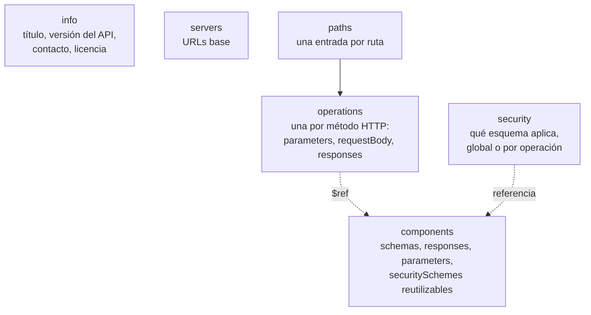
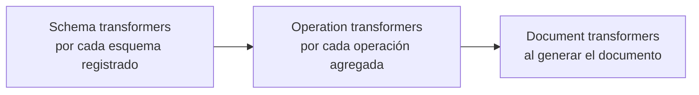

# OpenAPI — `TEM-OPENAPI`

## 1. Resumen ejecutivo

Un documento OpenAPI declara, en un archivo YAML o JSON que una máquina puede leer, qué operaciones expone una API HTTP, qué recibe cada una y qué devuelve. Con eso se generan clientes tipados, se validan peticiones, se dibuja una interfaz de exploración, se detectan cambios rompientes entre dos revisiones y se le da a un integrador algo que leer que no sea el código fuente. Es el artefacto sobre el que se apoyan las tres familias que lo rodean, y el único de esta guía cuya forma está fijada por una especificación normativa.

La OpenAPI Specification es esa especificación, y su versión estable a esta fecha es `N-19`, OAS 3.2.0, publicada el 2025-09-19. Conviene retener tres hechos sobre su estado, porque el material que circula suele estar desactualizado en los tres: la 3.1 rompió con la 3.0 al alinearse con JSON Schema y eliminar `nullable`; la 3.2 agregó capacidades sin romper; y la 4.0, conocida como «Moonwalk», **no existe como especificación publicada** —`F-06` la registra en fase de diseño, sin fecha de release y sin soporte de tooling, y el propio grupo recomienda seguir en la serie 3.x—.

Del lado de .NET, ASP.NET Core incluye generación de documentos OpenAPI desde .NET 9 mediante el paquete `Microsoft.AspNetCore.OpenApi` (`N-32`). En **.NET 10, la versión de OpenAPI emitida por defecto es 3.1**; en .NET 11, que está en preview y no es referencia de producción, pasa a 3.2 (`N-67`). Y una precisión que suele sorprender: **ASP.NET Core genera el documento y nada más**. Ninguna interfaz de usuario viene incluida, ni Swagger UI ni Scalar, ni en el framework ni en las plantillas (`N-33`, `N-66`).

---

## 2. Definición

### Qué es

Un documento OpenAPI es una **descripción declarativa de una interfaz HTTP**, estructurada según el esquema que fija la OpenAPI Specification. Describe rutas, operaciones, parámetros, cuerpos de petición, respuestas por código de estado, esquemas de datos y mecanismos de seguridad. Su valor no está en ser legible —lo es a duras penas— sino en ser **procesable**: cada herramienta del ecosistema, del generador de clientes al *linter*, opera sobre esa estructura.

La especificación es agnóstica respecto de cómo se produce el archivo. Puede escribirse a mano, generarse desde el código o compilarse desde fragmentos; nada en `N-19` privilegia un camino. Esa neutralidad es la razón por la que el debate de [`TEM-DESIGNFIRST`](Design-First-y-Code-First.md) existe y no lo resuelve la norma.

### Qué problema resuelve

Resuelve el problema de que **el contrato de una API HTTP no es inspeccionable**. Una biblioteca compilada expone sus tipos y firmas; quien la consume ve qué métodos hay y qué reciben. Una API HTTP no expone nada: es un puerto abierto que responde a ciertos caminos con ciertas formas, y sin una declaración externa la única manera de descubrir el contrato es leer el código —si se tiene— o sondear la API —lo que ubica al lector en `ESC-4b` y le devuelve una hipótesis, no un contrato—.

De ahí se derivan los usos concretos: generar el cliente en lugar de escribirlo, verificar que la implementación cumple lo declarado, comparar dos revisiones para saber si un cambio rompe, y producir documentación navegable sin escribirla.

### Qué no es

**No es documentación.** Es la confusión más costosa del área. Un documento OpenAPI dice que `POST /reservas` acepta un objeto con `salaId`, `desde` y `hasta` y puede devolver `201` o `409`; no dice que el `409` ocurre cuando la sala está ocupada, ni que hay que consultar disponibilidad antes, ni qué significa que una reserva esté en estado `pendiente`. Esa información va en las descripciones del propio documento o en un texto aparte, y no aparece sola. Un portal generado desde un documento sin descripciones es un catálogo de esquemas, y quien lo consulta sigue sin saber cómo usar la API.

**No es una garantía de conformidad.** El documento declara lo que la API debería hacer. Que efectivamente lo haga es una propiedad de la implementación que hay que verificar por separado, y el hallazgo más frecuente de `ESC-4a` es precisamente que no coinciden. Un documento generado desde el código reduce la divergencia sin eliminarla, porque las anotaciones y los atributos también se desactualizan.

**No es un lenguaje de definición de flujos.** OpenAPI describe operaciones individuales, no secuencias. Que para cancelar una reserva haya que consultarla primero, verificar la antelación y recién entonces llamar a la operación de cancelación es información que la especificación no tiene dónde alojar. Para eso existe **Arazzo** (`N-20`, versión 1.1.0 publicada el 2026-05-17), que describe *workflows* multi-operación sobre descripciones de API.

**No es exclusivo de REST.** Describe interfaces HTTP; que esas interfaces sean o no REST en el sentido de `TEM-REST` es indiferente para la especificación.

---

## 3. Aplicación por escenario

### `ESC-1` — API nueva

Es el escenario donde el documento tiene más valor y menos costo. `MARCO-ESCENARIOS` define el criterio de terminación de `ESC-1` como la existencia de «una especificación OpenAPI revisada antes de que se escriba el primer controlador», lo que ubica el artefacto en el centro del escenario y no como subproducto.

Las decisiones concretas son tres. La primera es la versión de OpenAPI a emitir: en .NET 10 el default de 3.1 es el razonable, y volver a 3.0 solo se justifica si una herramienta del pipeline no entiende 3.1 —caso real y no infrecuente, tratado más abajo—. La segunda es cuántos documentos hay: uno por versión de API es la forma que `N-68` documenta con `WithDocumentPerVersion()`, y la alternativa de un documento único con operaciones marcadas complica el consumo. La tercera es qué información no estructural se incluye: descripciones por operación, ejemplos por respuesta y respuestas de error declaradas. Esta última es la que se posterga y la que nunca se recupera.

**Qué cambia por contexto.** En `CTX-1` el documento es el producto y se revisa como tal, con `ACT-01` conduciendo y `ACT-06` decidiendo qué se publica. En `CTX-2` alcanza con que sea correcto y completo, porque su consumidor es un generador de clientes. En `CTX-3` la exigencia baja aún más si el cliente es único, y sube de golpe si ese cliente es una aplicación MAUI instalada, que en libertad de cambio se comporta como `CTX-1`. En `CTX-4` el escenario apenas aplica: se consume la especificación ajena.

### `ESC-2` — Exposición o migración

El documento cumple acá una función que no tiene en ningún otro escenario: es **el instrumento que hace visible cuánto del modelo interno se filtró**. La tensión que `MARCO-ESCENARIOS` describe para este escenario —el modelo interno empujando hacia una API que lo refleja— se manifiesta en el documento de forma imposible de disimular. Un `components.schemas` con un esquema llamado `TbReservaCab` es un diagnóstico completo.

De ahí una técnica útil: escribir el documento OpenAPI objetivo **antes** de escribir el adaptador, y usarlo como especificación del trabajo de traducción. El mapa explícito entre cada recurso y lo que lo respalda internamente, que el escenario pide como criterio de terminación, se construye contra ese documento.

En la variante de migración desde SOAP o RPC hay un atajo tentador y equivocado: generar el documento OpenAPI desde el WSDL o desde la superficie existente. Produce una descripción fiel del contrato viejo, que es exactamente lo que el escenario advierte que no hay que conservar.

**Qué cambia por contexto.** En `CTX-4`, cuando lo que se migra es la integración con un proveedor, el documento que importa es el del proveedor y la pregunta es si existe y si es fiel.

### `ESC-3` — Evolución en producción

Acá el documento deja de ser descripción y pasa a ser **línea de base**. Su función principal es permitir que la pregunta «¿este cambio rompe?» tenga respuesta automática: se compara el documento de la revisión actual con el de la anterior y se clasifica cada diferencia según los criterios de [`TEM-BREAK`](../50-Evolucion-y-Versionado/Compatibilidad-y-Cambios-Rompientes.md). Sin ese artefacto la pregunta se responde por memoria, y la memoria falla justamente en los casos que `MARCO-ESCENARIOS` señala como trampa: agregar un valor a un enumerado, endurecer una validación, volver obligatorio un campo que no lo era.

La generación en *build time* que documenta `N-32` existe en buena medida para esto: si el documento se emite en cada compilación y se versiona en el repositorio, el diff aparece en la revisión de código sin que nadie haga nada.

La segunda función es señalizar la deprecación. OpenAPI tiene el campo `deprecated` a nivel de operación y de parámetro, y en ASP.NET Core se marca por endpoint con `AddOpenApiOperationTransformer` (`N-34`). Esa marca es la contraparte declarativa de las cabeceras `Deprecation` y `Sunset` que trata [`TEM-DEPR`](../50-Evolucion-y-Versionado/Deprecacion-y-Retiro.md); conviene que no se contradigan.

**Qué cambia por contexto.** En `CTX-1` la publicación de una revisión del documento es un evento comunicable y debe estarlo. En `CTX-2` el diff en el repositorio alcanza. En `CTX-3` con clientes instalados hace falta conservar los documentos de las versiones vivas, no solo el de la última.

### `ESC-4` — Evaluación de una API ajena

**`ESC-4a` es el escenario central de este documento.** Cuando existe la especificación, ella es la entrada de la evaluación: se recorre operación por operación, se contrasta cada declaración con lo que el código hace y se registra cada divergencia. El propio escenario nombra los hallazgos típicos: campos documentados que ya no se devuelven, códigos de estado que el código emite y el documento no declara, parámetros opcionales que en la práctica son obligatorios.

Hay un orden que rinde más que recorrer el documento de arriba abajo. Primero las respuestas declaradas por operación: la ausencia de respuestas `4xx` es casi universal en documentos generados desde código sin cuidado, y significa que el contrato de error no está especificado en absoluto. Segundo, los esquemas de `components`: cuántos hay, cómo se llaman y si sus nombres pertenecen al dominio o a la base de datos. Tercero, `securitySchemes`: si está vacío mientras la API exige autenticación, el documento no sirve para generar un cliente funcional. Recién después, el detalle campo por campo.

**`ESC-4b`** no tiene especificación por definición. Lo que sí corresponde es **producir una** como salida del trabajo: el «documento que describe el contrato observado con su nivel de confianza por operación» que el escenario pide como criterio de terminación tiene en OpenAPI un formato natural, y el campo `description` de cada operación es el lugar donde declarar si lo que se afirma fue observado o inferido. Un documento OpenAPI escrito a partir de sondeos es una hipótesis del contrato y debe rotularse como tal; publicarlo sin ese rótulo convierte una inferencia en una afirmación.

**Qué cambia por contexto.** `CTX-4` es el hábitat natural de `ESC-4`: la calidad de la especificación del proveedor determina cuánto trabajo cuesta la integración, y su ausencia empuja el proyecto entero a `ESC-4b`.

---

## 4. Ejemplos concretos

Todos los ejemplos son **sintéticos**, del dominio de reserva de salas.

### 4.1 Anatomía de un documento

Las cinco zonas de un documento OpenAPI y qué decide cada una.



`paths` es el índice de rutas; cada ruta contiene una operación por método HTTP; cada operación declara qué recibe y, por código de estado, qué devuelve. `components` es el depósito de definiciones reutilizables al que las operaciones apuntan con `$ref`. La distinción entre declarar un esquema inline y referenciarlo desde `components` no es cosmética: los generadores de clientes producen un tipo con nombre por cada esquema de `components` y tipos anónimos para los inline.

### 4.2 Un documento mínimo pero completo

```yaml
openapi: 3.1.0
info:
  title: API de reserva de salas
  version: "1.0.0"
  description: |
    Gestión de salas, disponibilidad y reservas de la red de sedes.
    Las reservas se solapan por sala: dos reservas de la misma sala
    no pueden compartir ningún instante del intervalo [desde, hasta).
servers:
  - url: https://api.ejemplo.com/v1
paths:
  /salas/{salaId}/reservas:
    get:
      operationId: listarReservasDeSala
      summary: Lista las reservas de una sala en un rango de fechas
      parameters:
        - name: salaId
          in: path
          required: true
          schema: { type: string, format: uuid }
        - name: desde
          in: query
          required: true
          description: Instante inicial del rango, inclusive.
          schema: { type: string, format: date-time }
        - name: limite
          in: query
          schema: { type: integer, minimum: 1, maximum: 100, default: 20 }
      responses:
        "200":
          description: Página de reservas.
          content:
            application/json:
              schema: { $ref: "#/components/schemas/PaginaDeReservas" }
        "404":
          description: La sala no existe.
          content:
            application/problem+json:
              schema: { $ref: "#/components/schemas/ProblemDetails" }
    post:
      operationId: crearReserva
      summary: Crea una reserva sobre la sala
      requestBody:
        required: true
        content:
          application/json:
            schema: { $ref: "#/components/schemas/NuevaReserva" }
      responses:
        "201":
          description: Reserva creada.
          headers:
            Location:
              description: URI de la reserva creada.
              schema: { type: string, format: uri }
          content:
            application/json:
              schema: { $ref: "#/components/schemas/Reserva" }
        "409":
          description: El intervalo se solapa con otra reserva de la misma sala.
          content:
            application/problem+json:
              schema: { $ref: "#/components/schemas/ProblemDetails" }
components:
  schemas:
    Reserva:
      type: object
      required: [id, salaId, desde, hasta, estado]
      properties:
        id: { type: string, format: uuid }
        salaId: { type: string, format: uuid }
        desde: { type: string, format: date-time }
        hasta: { type: string, format: date-time }
        estado:
          type: string
          enum: [pendiente, confirmada, cancelada]
        motivo:
          type: [string, "null"]
          maxLength: 200
  securitySchemes:
    bearerAuth:
      type: http
      scheme: bearer
      bearerFormat: JWT
security:
  - bearerAuth: []
```

Dos detalles merecen señalarse. El campo `motivo` usa `type: [string, "null"]`: es la forma de 3.1 y no existe en 3.0, que usaría `nullable: true`. Y las dos respuestas de error están declaradas con su media type `application/problem+json`; omitirlas es lo habitual y deja el contrato de error fuera de la especificación, con las consecuencias que discute [`TEM-ERR`](../40-Contratos-y-Representaciones/Manejo-de-Errores.md).

### 4.3 Las versiones de la especificación

| | 3.0 | 3.1 | 3.2 |
|---|---|---|---|
| **Modelo de esquemas** | Subconjunto propio de JSON Schema | **JSON Schema Draft 2020-12** completo | Igual que 3.1 |
| **Nulabilidad** | `nullable: true` | `type: ["string", "null"]` — `nullable` desaparece | Igual que 3.1 |
| **`exclusiveMinimum`** | Booleano que modifica a `minimum` | Valor numérico directo | Igual que 3.1 |
| **Ejemplos en esquema** | `example` (singular) | `examples` (array) | Igual que 3.1 |
| **Binarios** | Valores de `format` | `contentEncoding` / `contentMediaType` | Igual que 3.1 |
| **`webhooks`** | No existe | Entrada de nivel superior | Sí |
| **Novedades propias** | — | — | Tags jerárquicos; streaming de primera clase (SSE, JSON Lines, multipart); métodos HTTP propios vía `additionalOperations`; OAuth 2.0 Device Authorization Flow |
| **Default de ASP.NET Core** | .NET 9 | **.NET 10** | .NET 11 (preview) |

Fuente de la columna de contenido: `N-19` y la ficha de industria; de la última fila, `N-32` y `N-67`.

El salto de 3.0 a 3.1 es el único de los dos que rompe, y rompe en dos direcciones. Un documento 3.1 no es válido como 3.0, y —más importante en la práctica— **una herramienta que solo entiende 3.0 falla ante un documento 3.1**. Esa es la consecuencia operativa de actualizar a .NET 10 que más sorprende: la aplicación compila, arranca y sirve el documento, y lo que se rompe es el generador de clientes o el validador que estaba aguas abajo en el pipeline. Se revierte explícitamente:

```csharp
builder.Services.AddOpenApi(options =>
{
    options.OpenApiVersion = Microsoft.OpenApi.OpenApiSpecVersion.OpenApi3_0;
});
```

Los tipos son `Microsoft.AspNetCore.OpenApi.OpenApiOptions.OpenApiVersion` y `Microsoft.OpenApi.OpenApiSpecVersion` (`N-32`).

Sobre la 4.0: `F-06` registra «Moonwalk» en diseño, sin fecha de release y sin soporte de tooling de producción, con el propio SIG recomendando la serie 3.x. Cualquier planificación que dependa de su publicación no tiene base. Esta guía recomienda tratar 3.1 como el objetivo actual y 3.2 como el destino previsible cuando .NET 11 alcance GA en noviembre de 2026.

### 4.4 Arazzo, para lo que OpenAPI no describe

`N-20`, Arazzo 1.1.0, describe secuencias de llamadas y sus dependencias sobre descripciones de API como OpenAPI. El caso del dominio es el flujo de reserva completo: consultar disponibilidad, crear la reserva en estado pendiente, confirmarla. OpenAPI declara las tres operaciones y no tiene dónde decir que van en ese orden ni que la salida de una alimenta a la siguiente.

Es una especificación joven y con adopción limitada. Esta guía recomienda conocerla y no adoptarla por defecto: en `CTX-1`, donde un integrador desconocido tiene que descubrir el orden de las llamadas por su cuenta, hay un caso claro; en `CTX-2` y `CTX-3`, donde el consumidor es propio y puede preguntar, el costo suele exceder al beneficio.

### 4.5 Implementación en ASP.NET Core

El paquete es **`Microsoft.AspNetCore.OpenApi`** y provee generación en *runtime*; agregar **`Microsoft.Extensions.ApiDescription.Server`** habilita la generación en *build time* (`N-32`). El soporte integrado existe desde .NET 9.

Lo que genera la plantilla `dotnet new webapi` de .NET 10, verificado en el código fuente (`N-66`):

```csharp
var builder = WebApplication.CreateBuilder(args);

builder.Services.AddOpenApi();

var app = builder.Build();

if (app.Environment.IsDevelopment())
{
    app.MapOpenApi();
}

app.UseHttpsRedirection();
```

Tres observaciones sobre este fragmento, que es un **default de plantilla y no una prescripción**. El `MapOpenApi()` está dentro de `IsDevelopment()`, de modo que el documento no se sirve en producción por defecto. No hay ninguna interfaz de usuario. Y el `launchSettings.json` de la misma plantilla trae `launchBrowser: false`, coherente con que ya no hay nada que abrir.

**Ruta y nombre del documento.** El default es `/openapi/{documentName}.json` con nombre de documento `v1`, es decir `/openapi/v1.json`. Se pueden crear documentos adicionales —`AddOpenApi("internal")`— y personalizar la ruta:

```csharp
app.MapOpenApi("/openapi/{documentName}/openapi.json");
```

Los métodos completos son `Microsoft.Extensions.DependencyInjection.OpenApiServiceCollectionExtensions.AddOpenApi` y `Microsoft.AspNetCore.Builder.OpenApiEndpointRouteBuilderExtensions.MapOpenApi`.

**YAML: runtime sí, build time no.** Basta el sufijo de la ruta:

```csharp
app.MapOpenApi("/openapi/{documentName}.yaml");
```

`N-32` es explícito en que la generación de YAML en *build time* no está soportada y figura como planificada para un preview futuro. La distinción importa para quien quiere versionar el documento en YAML dentro del repositorio: hoy hay que emitir JSON en el build y convertirlo, o generarlo desde una instancia en ejecución.

**Generación en build time.** Con `Microsoft.Extensions.ApiDescription.Server` referenciado:

```xml
<PropertyGroup>
  <OpenApiDocumentsDirectory>$(MSBuildProjectDirectory)</OpenApiDocumentsDirectory>
  <OpenApiGenerateDocuments>true</OpenApiGenerateDocuments>
  <OpenApiGenerateDocumentsOptions>--openapi-version OpenApi3_1</OpenApiGenerateDocumentsOptions>
</PropertyGroup>
```

`dotnet build` emite entonces el documento, cuyo nombre por defecto es el del `.csproj`, y se emiten todos los documentos configurados. Las otras opciones documentadas son `--file-name` y `--document-name`. Una nota operativa de `N-32` que ahorra confusión: el paso **GetDocument** no muestra progreso con el Terminal Logger en la verbosidad por defecto de .NET 8 en adelante, de modo que un build que parece no hacer nada probablemente lo esté haciendo.

Este mecanismo es el que habilita el caso de uso que `N-32` documenta explícitamente y que [`TEM-DESIGNFIRST`](Design-First-y-Code-First.md) desarrolla: **lintear el documento con Spectral** como parte del build, con un `.spectral.yml` que extienda `spectral:oas`.

**`IOpenApiDocumentProvider`**, novedad de .NET 10 (`N-64`), permite obtener el documento programáticamente **fuera de un contexto de petición HTTP** —para generar SDKs, validar contratos en procesos batch o exportarlo—. Se inyecta y se consulta así:

```csharp
public sealed class ExportadorDeContrato(
    [FromKeyedServices("v1")] IOpenApiDocumentProvider documentProvider)
{
    public async Task<OpenApiDocument> ObtenerAsync(CancellationToken ct) =>
        await documentProvider.GetOpenApiDocumentAsync(ct);
}
```

### 4.6 Transformers y su orden

Las tres interfaces viven en `Microsoft.AspNetCore.OpenApi`: `IOpenApiDocumentTransformer`, `IOpenApiOperationTransformer` e `IOpenApiSchemaTransformer`. Cada una se registra sobre `OpenApiOptions` en tres formas —delegado, instancia o tipo activado por inyección de dependencias— (`N-34`):

```csharp
builder.Services.AddOpenApi(options =>
{
    options.AddDocumentTransformer((document, context, cancellationToken) =>
    {
        document.Info.Contact = new() { Name = "Equipo de reservas" };
        return Task.CompletedTask;
    });
    options.AddOperationTransformer<AgregarRespuestaDeErrorEstandar>();
    options.AddSchemaTransformer<MarcarCamposDeSoloLectura>();
});
```

**El orden de ejecución** es el que fija `N-34` y no es el orden de registro: los *schema transformers* corren primero, a medida que se registra cada esquema; luego los *operation transformers*, a medida que se agrega cada operación; y por último los *document transformers*, al generarse el documento. Dentro de cada categoría sí rige el orden de registro. Con múltiples documentos, los transformers corren de forma independiente para cada uno.



La consecuencia práctica es que un *document transformer* ve el documento ya poblado y puede modificarlo entero, mientras que un *schema transformer* no puede razonar sobre el documento completo porque todavía no existe. Poner en el nivel equivocado es el error de uso más común: intentar agregar una respuesta común a todas las operaciones desde un *schema transformer* no funciona.

Por endpoint existe `AddOpenApiOperationTransformer`, en `Microsoft.AspNetCore.Builder.OpenApiEndpointConventionBuilderExtensions`, útil para marcar deprecación puntual:

```csharp
app.MapGet("/salas/{id}/ocupacion", ObtenerOcupacion)
   .AddOpenApiOperationTransformer((operation, context, cancellationToken) =>
   {
       operation.Deprecated = true;
       return Task.CompletedTask;
   });
```

En .NET 10 se agregaron además `context.GetOrCreateSchemaAsync(type, parameterDescription, ct)` y `context.Document?.AddComponent(name, schema)`, que permiten generar un esquema para un tipo C# desde un transformer con la misma lógica del generador y referenciarlo con `OpenApiSchemaReference` (`N-34`).

**Política de `$ref`.** Conviene conocerla porque explica la forma del documento generado: los esquemas de clases, records y structs se reemplazan por `$ref` a `components.schemas` **solo si aparecen más de una vez**; los de tipos primitivos y colecciones estándar quedan *inline*; y los de enums **siempre** se reemplazan por `$ref`. Se personaliza con `OpenApiOptions.CreateSchemaReferenceId` y `CreateDefaultSchemaReferenceId`. La consecuencia es visible del lado del consumidor: un tipo usado una sola vez no genera una clase con nombre en el cliente generado.

### 4.7 El estado real de las interfaces de usuario

`N-33` es normativo y textual: *«ASP.NET Core generates OpenAPI documents only. Interactive UIs such as Swagger UI or Scalar are not included by default and must be added separately»*. La lectura del código fuente de la plantilla (`N-66`) lo confirma: `AddOpenApi()` y `MapOpenApi()` dentro de `IsDevelopment()`, y ninguna referencia a UI alguna.

La misma fuente lleva una advertencia de seguridad con énfasis propio: **las interfaces de OpenAPI deben habilitarse solo en entornos de desarrollo**.

Las dos opciones que Microsoft documenta:

```csharp
// Swagger UI — paquete Swashbuckle.AspNetCore.SwaggerUi (solo los assets, sin generador)
app.MapOpenApi();
app.UseSwaggerUI(options =>
{
    options.SwaggerEndpoint("/openapi/v1.json", "v1");
});
```

```csharp
// Scalar — paquete Scalar.AspNetCore, producto de terceros
app.MapOpenApi();
app.MapScalarApiReference();
```

Se ven en `/swagger` y `/scalar` respectivamente. Para que el navegador abra Swagger UI al arrancar hay que poner `"launchBrowser": true` y `"launchUrl": "swagger"` en `launchSettings.json`, ya que la plantilla trae `launchBrowser: false`. ReDoc se menciona también como opción popular.

Dos correcciones que esta sección existe para hacer, porque el material que circula se equivoca en ambas:

**«.NET 10 reemplazó Swagger por Scalar en las plantillas» es falso en los dos términos.** Las plantillas no traen ninguna interfaz, y Scalar es un producto de terceros documentado como opción, no incluido.

**«Swashbuckle está muerto» es falso a esta fecha.** Lo que ocurrió está registrado en `N-62`: el equipo anunció la remoción de `Swashbuckle.AspNetCore` de la plantilla de web API en .NET 9, con una razón declarada de mantenimiento —el proyecto sin mantener activamente y sin release oficial para .NET 8—. Esa premisa dejó de describir la realidad: `F-07` publicó la versión 10.2.3 el 2026-06-22, soporta `net10.0` explícitamente, acumula 1.100 millones de descargas y **no está marcado como deprecado en NuGet**. La formulación correcta es «Swashbuckle ya no viene en las plantillas».

Sobre **NSwag**: aparece mencionado en el anuncio de remoción como alternativa que el desarrollador puede integrar por su cuenta. El estado actual del paquete —versión, mantenimiento, soporte de .NET 10— **no está verificado** en las fichas de esta guía y no se afirma nada al respecto.

### 4.8 Qué queda fuera del documento generado

Un hueco documentado que conviene tener presente: el soporte de **comentarios XML** en la generación de OpenAPI de .NET 10 y el comportamiento del atributo `[Description]` **no están verificados** en las fuentes de esta guía. Lo que sí está verificado es el mecanismo de los transformers, que permite poblar descripciones programáticamente y es el camino que estas páginas documentan.

---

## 5. Preguntas guía

- ¿Qué versión de OpenAPI emite mi API hoy, y qué herramientas aguas abajo la consumen? Si actualizo de .NET 9 a .NET 10, ¿alguna de ellas se rompe al pasar de 3.0 a 3.1?
- ¿Las respuestas de error de cada operación están declaradas en el documento, o solo el camino feliz?
- ¿El documento se sirve en producción? Si sí, ¿fue una decisión o quedó así? ¿Y la interfaz de usuario?
- ¿El documento está versionado en el repositorio, de modo que un cambio de contrato aparezca en el diff de una revisión de código?
- Si un integrador leyera solo mi documento, ¿podría hacer la primera llamada sin preguntarle nada a nadie?
- ¿Hay algo en `components.schemas` cuyo nombre venga de la base de datos y no del dominio?

---

## 6. Criterios de calidad

Un documento OpenAPI de buena calidad se reconoce en que **alguien puede integrarse leyéndolo**. Todo lo demás es derivado de eso.

| Señal | Documento pobre | Documento bueno |
|---|---|---|
| **Respuestas** | Solo `200` y `201` | Cada camino de fallo declarado con su esquema |
| **Descripciones** | Vacías o repiten el nombre de la operación | Explican el significado en términos del dominio |
| **Esquemas** | Nombres del modelo interno; todo inline | Nombres del dominio; reutilizados vía `$ref` |
| **Ejemplos** | Ninguno | Al menos uno por operación, incluido un error |
| **Seguridad** | `securitySchemes` vacío | Declarado y aplicado por operación donde difiere |
| **`operationId`** | Ausente o autogenerado ilegible | Estable y legible: es el nombre del método en el cliente generado |
| **Versión** | Sin declarar a qué versión de API corresponde | `info.version` coherente con la estrategia de [`TEM-VERS`](../50-Evolucion-y-Versionado/Estrategias-de-Versionado.md) |

### Antipatrones

**El documento que solo declara el camino feliz.** Es el más frecuente y el más caro. Un consumidor que genera su cliente desde ese documento no tiene tipos para los errores, y termina deserializando el cuerpo de un `409` contra el esquema de éxito. La regla operativa que esta guía recomienda: ninguna operación se considera especificada hasta que declare al menos una respuesta de error.

**El documento generado y nunca mirado.** Activar `AddOpenApi()` produce un documento; que ese documento sea útil es otra cosa. El síntoma es un `components.schemas` lleno de nombres como `ReservaDtoResponse2` y descripciones vacías en todas partes.

**Servir el documento y la interfaz en producción sin decidirlo.** `N-33` advierte explícitamente contra habilitar interfaces fuera de desarrollo. El documento en sí es una decisión distinta y legítima en `CTX-1` —una API pública que no publica su especificación está pidiéndole al integrador que adivine—, pero debe ser una decisión.

**`operationId` inestable.** Si cambia entre revisiones, cambian los nombres de los métodos en todos los clientes generados, y eso rompe compilaciones aguas abajo sin que ningún campo del contrato haya cambiado. Es un cambio rompiente que no se ve como tal.

**Confundir el default de la plantilla con una recomendación.** Que la plantilla no traiga interfaz de usuario no significa que no convenga tener una en desarrollo; que ponga `MapOpenApi()` bajo `IsDevelopment()` no significa que un documento público sea un error. Los niveles de autoridad de `MARCO-CONVENCIONES` existen exactamente para esta distinción.

**Fijar la versión de OpenAPI por inercia.** Dejar `OpenApi3_0` en un proyecto .NET 10 porque «así estaba» renuncia a JSON Schema 2020-12 sin haberlo decidido. Y al revés: actualizar a 3.1 sin verificar el pipeline aguas abajo produce una rotura que aparece lejos del cambio.

---

## 7. Anexo

### 7.1 Plantilla de documento OpenAPI comentada

Estructura mínima para arrancar una API nueva en `ESC-1`. Sintética, del dominio de reserva de salas.

```yaml
openapi: 3.1.0          # 3.1 es el default de .NET 10; 3.0 solo si el tooling lo exige

info:
  title: ""             # nombre del producto, no del proyecto .NET
  version: ""           # versión del CONTRATO, no del ensamblado
  description: ""       # aquí van las reglas del dominio que ninguna operación declara
  contact: { name: "", email: "" }   # obligatorio de hecho en CTX-1: sin canal no hay feedback de ACT-03

servers:
  - url: ""             # una entrada por entorno expuesto; no incluir entornos internos

security:               # esquema por defecto de toda la API; se sobreescribe por operación
  - bearerAuth: []

tags:                   # agrupación; en 3.2 admiten jerarquía
  - name: ""
    description: ""

paths:
  /recurso:
    get:
      operationId: ""   # ESTABLE: es el nombre del método en cada cliente generado
      tags: [""]
      summary: ""       # una línea
      description: ""   # el porqué, las precondiciones, el efecto sobre otros recursos
      parameters: []
      responses:
        "200":
          description: ""            # obligatorio por la especificación
          content:
            application/json:
              schema: { $ref: "" }
              examples: {}           # al menos uno; en 3.1 es plural
        "4xx":                       # DECLARAR LOS ERRORES: es el hueco más común
          description: ""
          content:
            application/problem+json:
              schema: { $ref: "#/components/schemas/ProblemDetails" }

components:
  schemas: {}           # nombres del dominio; un esquema usado una vez queda inline en .NET
  parameters: {}        # los parámetros repetidos van acá, no copiados en cada operación
  responses: {}         # las respuestas de error comunes también
  securitySchemes:
    bearerAuth:
      type: http
      scheme: bearer
      bearerFormat: JWT
```

### 7.2 Lista de verificación del documento

Se recorre sobre el documento generado o escrito, antes de publicarlo. Las tres primeras entradas son las que más hallazgos producen en `ESC-4a`.

```yaml
completitud:
  - toda operación declara al menos una respuesta de error
  - toda operación tiene summary y description no vacíos
  - securitySchemes está poblado y security aplicado donde corresponde
  - los headers de respuesta relevantes están declarados (Location, ETag, Retry-After)
  - hay al menos un ejemplo por operación, incluido uno de error

coherencia:
  - los nombres de components.schemas pertenecen al dominio, no al modelo interno
  - el casing de los campos coincide con lo fijado en TEM-CAMPOS
  - los códigos de estado declarados coinciden con los que el código emite
  - info.version es coherente con la estrategia de versionado de TEM-VERS
  - las operaciones marcadas deprecated coinciden con las cabeceras Deprecation emitidas

version_y_tooling:
  - se sabe qué versión de OpenAPI se emite y por qué
  - toda herramienta que consume el documento soporta esa versión
  - el documento se emite en el build y está versionado en el repositorio
  - hay un linter (Spectral u otro) corriendo sobre él en integración continua

exposicion:
  - la decisión de servir el documento en producción está tomada explícitamente
  - ninguna interfaz de usuario está habilitada fuera de desarrollo
  - el documento no revela endpoints internos ni entornos no públicos
```
