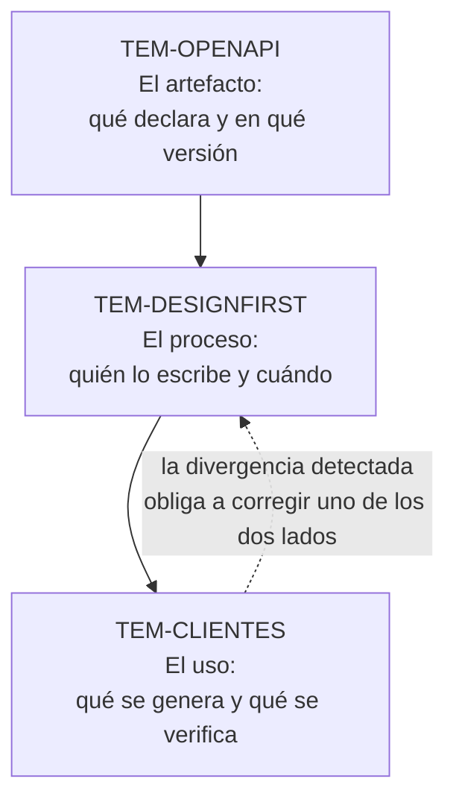

# Especificación y documentación — `FAM-ESP`

## La pregunta que responde esta familia

**¿Cómo se declara y se comunica el contrato?**

Las familias anteriores tomaron decisiones: qué recursos existen, con qué métodos se los manipula, qué forma tiene el JSON, cómo se versiona. Todas esas decisiones viven en la cabeza de quien las tomó, en el código que las implementa y —si alguien se ocupó— en un archivo que las declara. Esta familia trata ese archivo: qué formato tiene, quién lo escribe, cuándo se escribe respecto del código, y qué se puede construir a partir de él.

La distinción que gobierna toda la familia es entre **especificar** y **documentar**. Un documento OpenAPI es una declaración legible por máquina de qué operaciones existen y qué forma tienen sus entradas y salidas; sirve para generar clientes, validar peticiones y detectar cambios rompientes. La documentación es el texto que le explica a una persona por qué querría llamar a esa operación, en qué orden, y qué significa cada campo en términos del negocio. La especificación no reemplaza a la documentación, y confundirlas produce el resultado más común del área: un portal generado automáticamente donde cada endpoint tiene su esquema completo y ninguno tiene una sola frase que explique para qué sirve.

Hay una asimetría de autoridad que conviene fijar antes de entrar en los documentos. La **OpenAPI Specification** es normativa: define qué es un documento OpenAPI válido, y `N-19` (OAS 3.2.0, publicada el 2025-09-19) es la versión estable a esta fecha. Lo que ASP.NET Core hace con ella —`AddOpenApi`, `MapOpenApi`, los transformers, la ruta `/openapi/{documentName}.json`— es **implementación de Microsoft**, documentada en `N-32` a `N-34`, y podría ser distinta sin violar nada. Y lo que traen o no traen las plantillas de `dotnet new` es un **default**, verificado en el código fuente en `N-66`, no una prescripción: que la plantilla de .NET 10 no incluya ninguna interfaz de usuario de OpenAPI no significa que no deba usarse una.

---

## Documentos

| ID | Documento | Responde |
|----|-----------|----------|
| `TEM-OPENAPI` | [OpenAPI](OpenAPI.md) | ¿Qué es un documento OpenAPI, qué versiones hay y cómo se produce desde ASP.NET Core? |
| `TEM-DESIGNFIRST` | [Design-first y code-first](Design-First-y-Code-First.md) | ¿Se escribe la especificación antes o se deriva del código, y qué se paga en cada caso? |
| `TEM-CLIENTES` | [Generación de clientes y pruebas de contrato](Generacion-de-Clientes-y-Pruebas-de-Contrato.md) | ¿Qué se construye a partir de la especificación, y cómo se verifica que la implementación la cumple? |

El orden de lectura importa poco entre el segundo y el tercero, y bastante respecto del primero: `TEM-DESIGNFIRST` discute cuándo escribir un documento cuya anatomía explica `TEM-OPENAPI`, y `TEM-CLIENTES` da por sabido qué contiene ese documento. La flecha punteada señala el circuito que hace útil a la familia entera: una prueba de contrato que falla no dice solo que hay un defecto, dice que la especificación y la implementación divergieron, y obliga a decidir cuál de las dos estaba equivocada.

---

## Qué queda fuera y dónde está

Tres fronteras conviene tenerlas nombradas porque son las que más se cruzan.

**Con [`TEM-PRUEBAS`](../80-Implementacion-en-NET/Pruebas-de-API.md).** Ese documento trata las pruebas de la API en general: unitarias, de integración, el andamiaje de `WebApplicationFactory` y `Microsoft.AspNetCore.Mvc.Testing` (`N-55`, `N-56`), los patrones de arranque y sustitución de servicios. [`TEM-CLIENTES`](Generacion-de-Clientes-y-Pruebas-de-Contrato.md) usa ese mismo andamiaje para una pregunta distinta y más estrecha: si lo que el servidor efectivamente responde coincide con lo que el documento OpenAPI declara. Una prueba de integración que verifica que crear una reserva devuelve `201` es de `TEM-PRUEBAS`; una que verifica que el cuerpo de ese `201` valida contra el esquema `Reserva` de `components.schemas` es de contrato.

**Con [`TEM-SDD`](../95-Transversales/).** Ahí la especificación se trata como insumo de generación asistida: qué necesita contener un documento para que un agente produzca código correcto a partir de él. Acá se la trata como **contrato**: la declaración que obliga a dos partes y cuyo incumplimiento es un defecto. Son usos distintos del mismo archivo y las exigencias no coinciden —un documento puede ser excelente contrato y pobre insumo de generación si le faltan descripciones y ejemplos—.

**Con [`FAM-EVO`](../50-Evolucion-y-Versionado/).** La especificación es el instrumento que permite decidir si un cambio es rompiente comparando dos versiones del documento en lugar de discutirlo. [`TEM-BREAK`](../50-Evolucion-y-Versionado/Compatibilidad-y-Cambios-Rompientes.md) fija qué cambios rompen; [`TEM-CLIENTES`](Generacion-de-Clientes-y-Pruebas-de-Contrato.md) trata cómo se detectan automáticamente en integración continua. Y la representación del versionado dentro del documento —un documento por versión, con `WithDocumentPerVersion()` según `N-68`, o uno solo con operaciones marcadas— la trata [`TEM-VERS`](../50-Evolucion-y-Versionado/Estrategias-de-Versionado.md).

---

## Relación con las otras familias

**Con [`FAM-CON`](../40-Contratos-y-Representaciones/).** Esa familia decide el contenido del contrato: cómo se llaman los campos, qué forma tiene una colección paginada, qué estructura tiene un error. Esta familia decide cómo se declara ese contenido y cómo se verifica que se cumple. La conexión más productiva está en los errores: si [`TEM-ERR`](../40-Contratos-y-Representaciones/Manejo-de-Errores.md) fijó un formato, la especificación debe declararlo en las respuestas `4xx` y `5xx` de cada operación, y la omisión de esas respuestas es el hueco más frecuente de los documentos generados desde código.

**Con [`FAM-NET`](../80-Implementacion-en-NET/).** El reparto es entre qué declara el documento y cómo se produce. Que `TypedResults` aporte automáticamente la metadata de tipo de respuesta a OpenAPI mientras `Results` exige un `.Produces<T>()` explícito (`N-26`) es un hecho de implementación con consecuencia directa sobre la calidad del documento generado: se explica en [`TEM-MINIMAL`](../80-Implementacion-en-NET/Minimal-APIs-y-Controllers.md) desde la óptica del código y se usa acá desde la óptica del contrato resultante.

**Con [`MARCO-ACTORES`](../00-Marco-de-Referencia/Actores.md).** Esta familia es donde `ACT-01` ejerce autoridad sin convertirse en cuello de botella. La forma efectiva que describe ese documento —convenciones escritas más un mecanismo automático que las verifique— tiene aquí su implementación concreta: un *linter* de OpenAPI ejecutado en integración continua sobre el documento generado. `N-32` documenta ese caso de uso explícitamente para la generación en *build time*.

---

## Qué cambia según el contexto

| | `CTX-1` Pública | `CTX-2` Interna | `CTX-3` App propia | `CTX-4` Integración |
|---|---|---|---|---|
| **Rol de la especificación** | Es el producto | Genera clientes y pruebas | Genera el cliente tipado | Se consume la del proveedor, si existe |
| **Enfoque que suele corresponder** | Design-first | Discutible; code-first es defendible | Code-first con verificación | No se decide de este lado |
| **Quién la lee** | Integradores desconocidos | El equipo del servicio consumidor | El propio equipo | Nadie propio la escribe |
| **Qué se genera desde ella** | Documentación pública y SDKs | Clientes tipados y pruebas de contrato | El cliente de la aplicación | El cliente contra el proveedor |
| **Costo de no tenerla** | Fricción de integración y soporte | Aparece cuando rota el equipo | Bajo mientras el equipo sea uno | Se paga en `ESC-4b` |

La fila del costo es la que decide. En `CTX-1` la ausencia de especificación es visible de inmediato; en `CTX-2` es invisible hasta que alguien se va, y por eso la creencia de que una API interna no la necesita sobrevive tanto tiempo. `MARCO-CONTEXTOS` lo enuncia en su forma más útil: en `CTX-2` la especificación vale menos como contrato y más como generador.
