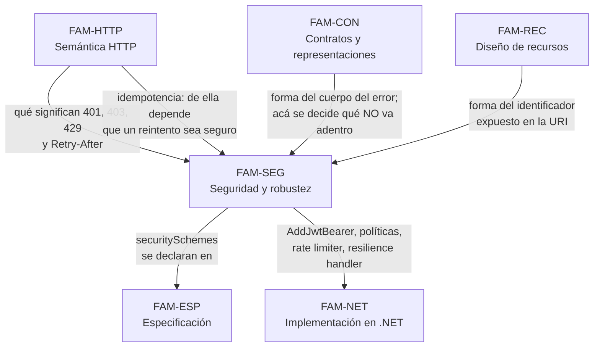

# Seguridad y robustez — `FAM-SEG`

## La pregunta que responde esta familia

**¿Quién puede hacer qué, y qué pasa cuando algo falla?**

Son dos preguntas y no una, y se juntan acá porque comparten dueño. `ACT-07` decide sobre autenticación, autorización, límites de uso y qué información puede aparecer en una respuesta, y es el único actor de la guía con **poder de veto**: una API que expone datos personales sin control de acceso no se publica aunque el negocio lo pida. Esa asimetría explica por qué esta familia se lee distinto de las demás. En [`FAM-REC`](../20-Diseno-de-Recursos/README.md) o en [`FAM-CON`](../40-Contratos-y-Representaciones/README.md) una decisión discutible produce una API incómoda; acá produce una brecha.

El nivel de autoridad de las fuentes está repartido de forma poco habitual y conviene tenerlo presente desde la primera página. La autenticación tiene respaldo normativo sólido —`N-15` (RFC 6749), `N-16` (RFC 6750), `N-17` (RFC 7519) y `N-18` (RFC 9068) son todos Proposed Standard—, mientras que la comunicación de límites de uso al cliente **no lo tiene**: los campos `RateLimit` de `F-02` siguen siendo un Internet-Draft, activo pero con fecha de expiración, y los populares `X-RateLimit-*` no aparecen en ninguna especificación. Y lo que hace ASP.NET Core es una tercera cosa: implementación, con defaults que a veces contradicen lo que el lector espera.

Ese último punto tiene un caso testigo que atraviesa la familia entera. El rate limiter nativo de ASP.NET Core rechaza con **`503 Service Unavailable`, no con `429`**: `N-43` es literal al respecto —*«Defaults to `Status503ServiceUnavailable`»*— y el `429` aparece en `N-42` solo como opt-in explícito. Un límite de uso dejado en su configuración por defecto le informa al consumidor que el servidor está caído en lugar de pedirle que baje la frecuencia, con lo que las políticas de reintento del otro lado se comportan al revés de lo previsto. La cabecera `Retry-After` tampoco es automática: hay que leerla del *lease* y escribirla a mano.

---

## Documentos

| Documento | ID | Qué establece |
|---|---|---|
| [Autenticación y autorización](Autenticacion-y-Autorizacion.md) | `TEM-AUTH` | La distinción entre ambas; API key, Basic, Bearer/JWT, OAuth 2.0 (`N-15`) y mTLS con criterios de elección por contexto; JWT según `N-17` y el perfil `N-18`; autorización por roles, políticas y recurso; la autorización a nivel de instancia; `AddJwtBearer` y `RequireAuthorization`; declaración en OpenAPI |
| [Protección de la superficie](Proteccion-de-la-Superficie.md) | `TEM-PROT` | Rate limiting: los cuatro algoritmos de `N-42`, el default de `503` y su corrección, los campos de `F-02` con sus parámetros de una letra; CORS como mecanismo del navegador; validación como frontera de seguridad; filtración de información por diferencias entre respuestas de error; identificadores secuenciales frente a opacos |
| [Resiliencia y reintentos](Resiliencia-y-Reintentos.md) | `TEM-RESIL` | El problema desde el lado del consumidor; cuándo un reintento es seguro y su dependencia de la idempotencia; *backoff* exponencial y *jitter*; `Retry-After`; circuit breaker, timeouts y degradación; `Microsoft.Extensions.Http.Resilience` e `IHttpClientFactory`; qué códigos de estado permiten al cliente decidir bien |

El orden de lectura es el de la tabla, y no es arbitrario. [`TEM-AUTH`](Autenticacion-y-Autorizacion.md) responde quién es el llamante y qué le está permitido, que es la pregunta previa a cualquier otra: sin identidad no hay partición posible de un límite de uso ni criterio para decidir si un `404` puede distinguirse de un `403`. [`TEM-PROT`](Proteccion-de-la-Superficie.md) se ocupa de la superficie expuesta al llamante ya identificado. [`TEM-RESIL`](Resiliencia-y-Reintentos.md) invierte el punto de vista y mira la API desde afuera, que es donde vive `ACT-03`.

---

## Cómo se relaciona con las demás familias

Cuatro fronteras se respetan de forma estricta, porque son las que más se erosionan cuando un tema se escribe sin mirar a los vecinos.

**El significado de los códigos de estado es de [`FAM-HTTP`](../30-Semantica-HTTP/README.md).** Qué distingue `401` de `403`, qué garantiza `429` y quién lo define —`N-03`, RFC 6585, no `N-01`— se explica en [`TEM-STATUS`](../30-Semantica-HTTP/Codigos-de-Estado.md). Esta familia trata la **decisión de seguridad** detrás de esa elección: cuándo conviene responder `404` donde la semántica admitiría `403`, y qué se está confirmando al elegir uno u otro.

**El cuerpo del error es de [`TEM-ERR`](../40-Contratos-y-Representaciones/Manejo-de-Errores.md).** El formato de `N-04` (RFC 9457) y su implementación en ASP.NET Core se desarrollan allá. Acá se trata la pregunta complementaria y de signo contrario: qué no puede aparecer nunca dentro de ese cuerpo. Es la tensión declarada entre `ACT-03`, que necesita errores informativos para construir un cliente, y `ACT-07`, que sabe que cada detalle adicional describe el sistema a quien lo mira desde afuera.

**La validación como mecánica de implementación es de [`TEM-VALID`](../80-Implementacion-en-NET/Validacion.md).** `Microsoft.Extensions.Validation`, `AddValidation()` y el source generator de .NET 10 se explican ahí, con `N-35`. [`TEM-PROT`](Proteccion-de-la-Superficie.md) trata la validación como **frontera**: qué entra al sistema, qué se rechaza antes de llegar al dominio y por qué una entrada no validada es una decisión de seguridad y no solo un defecto de calidad.

**La idempotencia es de [`TEM-IDEM`](../30-Semantica-HTTP/Idempotencia-y-Concurrencia.md).** [`TEM-RESIL`](Resiliencia-y-Reintentos.md) depende por completo de ese documento y no lo repite: si un reintento es seguro o duplica una reserva es una propiedad del método y de la operación, no de la política de reintentos.

---

## Qué se lleva el lector de esta familia

Separar autenticación de autorización con precisión operativa, y reconocer que la parte difícil casi nunca es la primera. Integrar un proveedor de identidad es trabajo acotado y con buena documentación; decidir si *esta* reserva es de *este* usuario es una pregunta que ningún framework responde solo, porque la respuesta vive en el dominio. Es el punto donde más APIs correctamente autenticadas fallan.

Saber qué está especificado y qué no. OAuth 2.0 y JWT tienen RFC; los campos con los que se comunica un límite de uso, no. Un rate limiting bien diseñado con cabeceras `X-RateLimit-*` es una decisión legítima y frecuente, siempre que se declare como convención de facto y no como estándar.

Desconfiar de los defaults, incluidos los del framework propio. El caso del `503` de `N-43` no es una curiosidad: es un default razonable desde la perspectiva de quien escribió el componente —un límite alcanzado es, en cierto sentido, indisponibilidad— y desastroso desde la perspectiva del contrato HTTP que el consumidor lee.

Diseñar pensando en el fallo del otro lado. `ESC-1` produce APIs que funcionan; `CTX-4` enseña que la mitad del trabajo de integración consiste en decidir qué hacer cuando la contraparte no responde. Un productor que devuelve los códigos correctos le está entregando al consumidor la información con la que este decide reintentar o rendirse, y esa es una responsabilidad de diseño de contrato.

---

## Alcance y límite declarado

Esta familia trata **mecanismos defensivos y decisiones de diseño**. No es un manual de seguridad ofensiva, no enumera técnicas de explotación y no reemplaza una revisión de seguridad hecha por quien corresponda. Cuando el texto explica que un `404` diferenciado confirma la existencia de un recurso, lo hace para justificar una decisión de contrato, no para describir un procedimiento.

El límite ético que enuncia [`MARCO-ESCENARIOS`](../00-Marco-de-Referencia/Escenarios.md) para `ESC-4b` rige también acá: sondear una API ajena para caracterizarla solo es legítimo con autorización y dentro de los términos de servicio publicados.
