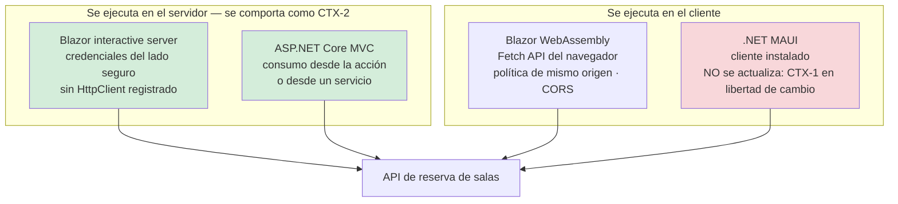

# Consumo desde Blazor y MAUI — `TEM-CONSUMO`

## Resumen ejecutivo

Consumir una API desde .NET parece un asunto único —`HttpClient` y listo— y no lo es. El mismo código de consumo se comporta de forma radicalmente distinta según dónde se ejecute, y la diferencia no es de rendimiento sino **de contexto en el sentido de esta guía**: cambia dónde viven las credenciales, quién puede alcanzar la API, con cuánta libertad se puede cambiar el contrato y qué se puede confiar del cliente.

Los cuatro anfitriones que la guía toma como referencia caen en lugares distintos del mapa. **Blazor en render interactive server** ejecuta el componente en el servidor: la llamada es servidor a servidor y se comporta como `CTX-2`, con las credenciales del lado seguro. **Blazor WebAssembly** ejecuta en el navegador sobre la Fetch API, sujeto a la política de mismo origen. **ASP.NET Core MVC** llama desde el servidor, como el primero. Y **.NET MAUI** es un cliente instalado que no se actualiza cuando el backend se despliega: en libertad de cambio se comporta como `CTX-1` aunque el equipo sea el mismo.

El andamiaje común es `IHttpClientFactory` con typed clients. Este documento trata ese andamiaje y las particularidades de cada anfitrión. La **resiliencia** —reintentos, circuit breaker, timeouts— la trata [`TEM-RESIL`](../70-Seguridad-y-Robustez/Resiliencia-y-Reintentos.md); acá solo se nombra el punto de enganche.

Le sirve sobre todo a `ACT-03`, y a `ACT-01` cuando tiene que entender por qué el mismo contrato le resulta cómodo a un cliente y hostil a otro.

---

## Definición

El **andamiaje de consumo** es la infraestructura que media entre el código que necesita datos y el `HttpClient` que hace la petición: cómo se crea el cliente, cuánto vive su handler, cómo se le inyectan las credenciales, dónde se traduce la respuesta al modelo propio y dónde se aísla el contrato ajeno.

Resuelve tres problemas: el agotamiento de sockets y la ceguera ante cambios de DNS que produce el manejo ingenuo de `HttpClient`; la dispersión de la URL base y de las credenciales por todo el código; y el acoplamiento del resto de la aplicación al contrato del proveedor.

### Qué NO es

**No es resiliencia.** `AddStandardResilienceHandler()`, las cinco estrategias del pipeline estándar y sus valores por defecto los trata [`TEM-RESIL`](../70-Seguridad-y-Robustez/Resiliencia-y-Reintentos.md). Acá se muestra dónde se engancha y nada más.

**No es autenticación.** Cómo se obtiene un token, cómo se renueva y qué valida el servidor lo trata [`TEM-AUTH`](../70-Seguridad-y-Robustez/Autenticacion-y-Autorizacion.md). Acá interesa **dónde vive la credencial en cada anfitrión**, que es una pregunta de arquitectura del cliente y no de autenticación.

**No es generación de clientes ni pruebas de contrato.** Kiota, Refit y la verificación contra la especificación los trata [`TEM-CLIENTES`](../60-Especificacion-y-Documentacion/Generacion-de-Clientes-y-Pruebas-de-Contrato.md). Acá aparecen porque son dos de los cuatro patrones de consumo que Microsoft documenta.

**No es diseño de la API.** Que el cliente necesite cinco llamadas para dibujar una pantalla es un problema de diseño, no de consumo.

---

## `IHttpClientFactory` — el andamiaje común

Paquete **`Microsoft.Extensions.Http`**; la API es `Microsoft.Extensions.DependencyInjection.HttpClientFactoryServiceCollectionExtensions.AddHttpClient`. Introducido en .NET Core 2.1 (`N-50`).

La justificación, verbatim, es la que conviene retener porque explica por qué el problema no se resuelve con un `HttpClient` estático a secas:

> *«Caching of handlers is desirable as each handler typically manages its own underlying HTTP connection pool. Creating more handlers than necessary can result in socket exhaustion and connection delays. Some handlers also keep connections open indefinitely, which can prevent the handler from reacting to DNS changes.»*

**El tiempo de vida del handler por defecto es de dos minutos** —*«The default handler lifetime is two minutes»*— y se ajusta con `SetHandlerLifetime`. Ese reciclado periódico es lo que permite reaccionar a cambios de DNS.

`N-50` nombra exactamente **cuatro patrones de consumo**: *basic usage*, *named clients*, *typed clients* y *generated clients*. No hay un quinto documentado, y las tablas de «cinco patrones» que circulan agregan alguno de cosecha propia.

Esta guía recomienda **typed clients** como opción por defecto: la URL base, las cabeceras y la política de resiliencia quedan configuradas en un solo lugar, y el resto de la aplicación depende de un tipo con métodos con nombre y no de una cadena de texto con una ruta.

```csharp
builder.Services.AddHttpClient<TodoService>(client =>
    client.BaseAddress = new Uri("https://jsonplaceholder.typicode.com/"));
```

### Cuatro restricciones documentadas y poco conocidas

**Cookies.** *«If your app requires cookies, it's recommended to avoid using `IHttpClientFactory`. Pooling the `HttpMessageHandler` instances results in sharing of `CookieContainer` objects.»* Es contraintuitivo y tiene consecuencias de seguridad: el pooling puede compartir cookies entre usuarios distintos.

**Typed clients capturados en singletons.** *«If a typed client instance is captured in a singleton, it may prevent it from reacting to DNS changes, defeating one of the purposes of `IHttpClientFactory`.»* Un typed client inyectado en un servicio singleton anula el reciclado de handlers.

**Los scopes de DI de los message handlers son distintos** de los scopes de la aplicación. El workaround documentado es `IHttpMessageHandlerFactory.CreateHandler`. Es la raíz del problema de Blazor que aparece más abajo.

**Nunca liberar los clientes creados por la factory.** `N-53` es enfático: *«**Never** dispose of `HttpClient` instances created by calling `CreateClient`.»*

Existe una alternativa documentada sin factory: un `HttpClient` de vida larga con `SocketsHttpHandler.PooledConnectionLifetime` configurado. Resuelve el mismo problema por otra vía y es la opción razonable en un anfitrión donde no hay contenedor de dependencias.

### Dónde se engancha la resiliencia

Paquete **`Microsoft.Extensions.Http.Resilience`**, construido sobre `Microsoft.Extensions.Resilience` y Polly (`N-51`). Se encadena sobre el `IHttpClientBuilder`:

```csharp
builder.Services.AddHttpClient<ClienteDeReservas>(...)
       .AddStandardResilienceHandler();
```

Dos hechos que corresponden a este documento y no a `TEM-RESIL`: **`Microsoft.Extensions.Http.Polly` está deprecado** (`N-52`), aunque sigue publicándose y recibiendo servicing —está sobre un camino cerrado, no roto—; y la prescripción de `N-51` es nivel **(a)**: *«you should only add one resilience handler and avoid stacking handlers.»*

---

## Los cuatro anfitriones



### Blazor interactive server — el caso que más se malinterpreta

El código del componente **se ejecuta en el servidor**. La consecuencia, que `MARCO-CONTEXTOS` declara explícitamente, es que el consumo de una API desde ese componente es una llamada servidor a servidor y **se comporta como `CTX-2`**: consumidor conocido, coordinable, desplegable junto con el backend.

`N-53` describe la mecánica:

> *«Server-based components call external web APIs using `HttpClient` instances, typically created using `IHttpClientFactory`.»*
> *«A server-side app doesn't include an `HttpClient` service. Provide an `HttpClient` to the app using the `HttpClient` factory infrastructure.»*

En interactive server **no hay `HttpClient` preconfigurado**: hay que registrarlo, y el camino normal es `IHttpClientFactory` como en cualquier aplicación de servidor.

Lo que cambia de verdad es **dónde viven las credenciales**. El token de acceso nunca llega al navegador: se obtiene y se guarda del lado del servidor, y el navegador solo mantiene la conexión del circuito. Eso permite cosas que en WebAssembly serían inaceptables —un secreto de cliente, una clave de API de un proveedor externo, una consulta a un servicio interno no expuesto— y elimina toda la superficie de CORS.

**El caveat verificado y difícil de diagnosticar:** `IHttpClientFactory` crea los `DelegatingHandler` en un **scope de DI distinto del circuito de Blazor**. Un servicio con ciclo de vida *scoped* inyectado en un `DelegatingHandler` *«doesn't have access to the service from the Blazor circuit»*. Es la causa habitual de que un handler que debía adjuntar el token del usuario adjunte nada o adjunte el de otro contexto.

Conviene además no repetir una afirmación que circula: **no está verificado** que Blazor Server «no pueda acceder a cookies o `localStorage` del navegador de la misma forma» que WebAssembly. `N-53` no lo dice. Lo que sí dice es la limitación de scopes de arriba.

Para Blazor Web App con OIDC, `N-53` documenta el paquete `Microsoft.Identity.Web.DownstreamApi`, con `EnableTokenAcquisitionToCallDownstreamApi()`, `AddDownstreamApi(...)`, `IDownstreamApi.CallApiForUserAsync` y `AddDistributedTokenCaches()`.

### Blazor WebAssembly — la Fetch API y sus límites

Acá está la diferencia real, y `N-53` la enuncia sin rodeos:

> *«`HttpClient` is implemented using the browser's Fetch API and is subject to its limitations, including enforcement of the same-origin policy.»*
> *«Blazor WebAssembly apps are often prevented from making direct calls across origins to web APIs due to Cross-Origin Request Sharing (CORS) security.»*

Las mitigaciones documentadas son dos: mantener un backend ASP.NET Core propio que actúe de proxy desde código de servidor, o usar un servicio proxy. Y hay una que la documentación descarta explícitamente: `SetBrowserRequestMode(BrowserRequestMode.NoCors)` **no** es un workaround.

En WebAssembly sí hay `HttpClient` preconfigurado, y su dirección base es `builder.HostEnvironment.BaseAddress` —`IWebAssemblyHostEnvironment.BaseAddress`, derivado del `<base href>` del documento—.

Para cookies, el patrón documentado es un `DelegatingHandler` que llame a `SetBrowserRequestCredentials(BrowserRequestCredentials.Include)`, registrado con `AddHttpMessageHandler<CookieHandler>()`.

**La trampa de prerendering**, que es la que produce los errores más confusos. Con los modos de render `InteractiveWebAssembly` y `Auto`, los componentes se prerenderizan en el servidor, de modo que **el mismo componente corre en ambos lados**. La recomendación de `N-53`:

> *«the recommended approach is to abstract that API call behind a service interface and implement client and server versions of the service.»*

Y el error de runtime más frecuente que produce: *«`HttpClient` services aren't registered by default in a Blazor Web App's main project»*. Con prerendering hay que registrar los clientes **en los dos proyectos**, no solo en el `.Client`.

### ASP.NET Core MVC

Es el caso sin sorpresas y por eso ocupa poco espacio: `IHttpClientFactory` con typed clients, inyección por constructor en el controller o —preferible— en un servicio de aplicación que el controller usa. Se comporta como `CTX-2`, con las credenciales del lado seguro y sin restricciones de origen.

La única advertencia propia es la de no consumir la API propia desde el propio servidor por HTTP. Si la vista MVC y la API viven en el mismo proceso, llamar a `https://localhost/v1/reservas` desde el controller agrega una ida y vuelta por la pila de red para invocar código que está en el mismo ensamblado. Aparece más seguido de lo que parece razonable, generalmente como resultado de haber empezado con una SPA.

### .NET MAUI — el cliente que no se actualiza

Es el anfitrión que más cambia las reglas, y no por razones técnicas de consumo sino por la propiedad que `MARCO-CONTEXTOS` señala: **una aplicación instalada en el teléfono de un usuario no se actualiza cuando el backend se despliega**. Sigue llamando a la API que conocía, con la versión que tenía, durante todo el tiempo que el usuario tarde en actualizar, o para siempre.

En términos de libertad de cambio, **MAUI se comporta como `CTX-1`** aunque el equipo sea el mismo y la API sea privada. Las tres consecuencias concretas:

- El versionado deja de ser opcional. Se trata en [`TEM-VERS`](../50-Evolucion-y-Versionado/Estrategias-de-Versionado.md).
- Los enums numéricos y los campos sin desplazamiento horario se vuelven trampas de largo plazo. Se trata en [`TEM-SERIAL`](Serializacion-y-Modelos.md).
- Endurecer una validación rompe a los clientes viejos, y no hay forma de coordinarlo. Se trata en [`TEM-VALID`](Validacion.md).

**El desarrollo local tiene particularidades verificadas** (`N-54`), y son la fuente de la mayor parte del tiempo perdido al empezar:

- **Emulador de Android: `10.0.2.2`** — *«the `10.0.2.2` address being an alias to your host loopback interface (127.0.0.1 on your development machine)»*.
- **Simulador de iOS: `localhost`** — *«The iOS simulator uses the host machine network.»*
- Windows y Mac Catalyst funcionan sin configuración extra si el certificado de desarrollo es de confianza.
- **Caveat:** el simulador de iOS remoto para Windows corre en el Mac emparejado, de modo que *«there's no localhost access to a web service running in Windows.»*

Para HTTP en claro en Android hay dos enfoques documentados: `[Application(UsesCleartextTraffic = true)]` en `Platforms/Android/MainApplication.cs` dentro de `#if DEBUG` —con el caveat de que *«The `UsesCleartextTraffic` property is ignored on Android 7.0 (API 24) and higher if a network security config file is present»*—, o un `Platforms/Android/Resources/xml/network_security_config.xml` con build action `AndroidResource`. En iOS, el opt-out de ATS se declara en `Platforms/iOS/Info.plist` con `NSAppTransportSecurity` y `NSAllowsLocalNetworking`.

El certificado HTTPS de desarrollo se confía con `dotnet dev-certs https --trust`; al ser autofirmado, Android lanza `java.security.cert.CertPathValidatorException` e iOS lanza `NSURLErrorDomain`.

**Novedad de .NET 10 en esa página:** *«If you're using .NET 10 or later, consider using Aspire integration to simplify connecting to local web services. Aspire automatically handles platform-specific networking configuration, service discovery, and development tunnels, eliminating much of the manual configuration described in this article.»*

Vale una advertencia de alcance: `NSUrlSessionHandler` y `AndroidMessageHandler` **no se mencionan** en `N-54`, que solo usa `HttpClientHandler`. Existen, pero están documentados en otra parte y no deben atribuirse a esta fuente.

Sobre MVVM, lo que corresponde a este documento es una sola frontera: **el `HttpClient` no vive en el ViewModel**. El ViewModel depende de un servicio tipado; ese servicio contiene el typed client. Es lo que permite probar el ViewModel sin red y reemplazar el transporte sin tocar la vista.

### Tabla comparativa

| | Blazor interactive server | Blazor WebAssembly | ASP.NET Core MVC | .NET MAUI |
|---|---|---|---|---|
| Dónde se ejecuta | Servidor | Navegador | Servidor | Dispositivo |
| Contexto equivalente | **`CTX-2`** | `CTX-3` | **`CTX-2`** | `CTX-3` con libertad de `CTX-1` |
| `HttpClient` preconfigurado | **No** (`N-53`) | Sí, con `BaseAddress` del host | No | No |
| Dónde vive la credencial | Servidor | Navegador | Servidor | Dispositivo |
| Restricción de origen | Ninguna | **Fetch API, mismo origen, CORS** | Ninguna | Ninguna |
| El cliente se actualiza con el backend | Sí | Sí, al recargar | Sí | **No** |
| Riesgo propio | Scope de DI de los `DelegatingHandler` | Prerendering: el componente corre en ambos lados | Llamarse a sí mismo por HTTP | Versiones viejas indefinidamente |

---

## Generación de clientes

Dos opciones documentadas por Microsoft, con niveles de autoridad distintos que conviene no aplanar.

**Kiota — producto oficial de Microsoft** (`N-59`). *«Kiota is a command line tool for generating an API client to call any OpenAPI-described API.»* Genera para C#, Go, Java, PHP, Python, Ruby y TypeScript. La instalación oficial es `dotnet tool install --global Microsoft.OpenApi.Kiota`; también son oficiales la extensión de VS Code —en **public preview**—, la GitHub Action `microsoft/setup-kiota` —también preview— y la imagen `mcr.microsoft.com/openapi/kiota`.

La misma página lleva un disclaimer sobre distribuciones que **no** son oficiales: el plugin de asdf, la fórmula de Homebrew y la extensión «REST API Client Code Generator» de Visual Studio. Y la integración de Kiota con MSBuild o `OpenApiReference` **no está documentada** en la página de instalación; no debe afirmarse.

**Refit — biblioteca de terceros, mencionada en la documentación de Microsoft.** `N-50` dice: *«`IHttpClientFactory` can be used in combination with third-party libraries such as Refit. Refit is a REST library for .NET.»* El paquete de integración es `Refit.HttpClientFactory` y el registro es `builder.Services.AddRefitClient<ITodoService>().ConfigureHttpClient(...)`. Es opción documentada, no prescripción.

La diferencia práctica: Kiota parte de la especificación OpenAPI y genera todo, de modo que el cliente sigue al contrato; Refit parte de una interfaz C# escrita a mano con atributos, de modo que el cliente refleja lo que el desarrollador cree que es el contrato. La primera opción detecta las divergencias; la segunda las perpetúa. La contrapartida es que un cliente generado es voluminoso y su superficie cambia cuando cambian las etiquetas del documento OpenAPI.

Un cliente generado tiene además una consecuencia que corresponde señalar acá: **el consumidor queda expuesto a la calidad de la especificación**. Una operación sin esquema de respuesta declarado —el caso de `Results` sin `.Produces<T>()` que trata [`TEM-MINIMAL`](Minimal-APIs-y-Controllers.md)— produce un método que devuelve un tipo inútil. La cadena completa la trata [`TEM-CLIENTES`](../60-Especificacion-y-Documentacion/Generacion-de-Clientes-y-Pruebas-de-Contrato.md).

---

## Aplicación por escenario

### `ESC-1` — API nueva

El consumo se diseña junto con la API, no después, y ese es el punto. Escribir el cliente de la primera operación antes de terminar la segunda revela más problemas de contrato que cualquier revisión: que faltan datos que obligan a una segunda llamada, que el error no distingue casos que el cliente necesita distinguir, que la paginación no sirve para el uso real. Es la voz consultiva de `ACT-03`, que `MARCO-ACTORES` describe como la más valiosa y la menos escuchada.

La decisión estructural del escenario es la capa de aislamiento: si el cliente va a exponer los tipos del contrato al resto de la aplicación o va a traducirlos. En `CTX-3`, con un contrato propio, exponerlos directamente es defendible; en `CTX-4` no lo es nunca.

### `ESC-2` — Exposición o migración

Cuando se pone una API sobre un sistema existente, con frecuencia hay clientes previos que consumían el sistema por otro medio. El trabajo de consumo es doble: construir el cliente nuevo y mantener el viejo funcionando durante la transición.

En la variante de migración hay un patrón útil: **el cliente nuevo se escribe contra la API nueva y se prueba contra ambas**, comparando respuestas. Es la forma más barata de detectar que la migración cambió algo que se creía idéntico, y aprovecha que en este escenario todavía existen las dos implementaciones.

### `ESC-3` — Evolución en producción

El escenario donde el anfitrión decide todo, y el diagrama de esta decisión cabe en una frase: **si el cliente se despliega con el backend, un cambio rompiente se coordina; si no, no**.

Blazor interactive server y MVC se despliegan con el backend: son `CTX-2` y admiten cambios coordinados. Blazor WebAssembly se actualiza cuando el usuario recarga, lo que es rápido pero no instantáneo, y hay una ventana en la que conviven versiones. MAUI no se actualiza: hay clientes de hace dos años en circulación, y el productor no controla ese calendario.

La consecuencia operativa: **la telemetría por versión de cliente no es opcional cuando hay MAUI en la ecuación**. Sin ella, la fecha de apagado de una versión se fija por intuición, que es exactamente el defecto que `ESC-3` señala.

Del lado del cliente, `ACT-03` tiene una obligación simétrica y menos reconocida: **no acoplarse a lo que no está garantizado**. El orden de una colección sin `sort` explícito, la forma exacta del texto de un mensaje de error, un campo no documentado que apareció en la respuesta. Los tres se rompen cuando el productor hace un cambio que considera compatible, y desde el punto de vista del contrato tiene razón.

### `ESC-4` — Evaluación de una API ajena

Es el escenario propio de `CTX-4` y donde `ACT-03` es el rol dominante.

**`ESC-4a`**, con especificación disponible: generar el cliente con Kiota es a la vez la forma de consumir y una prueba de la calidad de la especificación. Una especificación que no genera un cliente utilizable es una especificación que no describe la API.

**`ESC-4b`**, sin especificación: el cliente se escribe a mano contra el contrato observado, y **cada supuesto se registra como supuesto**. El artefacto de salida del escenario es la lista de lo que se infirió y no se verificó, y el cliente es el lugar donde esa lista se vuelve código: un comentario sobre por qué se asume que el campo `estado` solo toma cuatro valores es más útil que cualquier documento aparte.

En ambos casos la capa de aislamiento deja de ser recomendación y pasa a ser el trabajo central. El riesgo dominante de `CTX-4` es que el modelo del proveedor se filtre al dominio propio, y cuando eso pasa, cambiar de proveedor deja de ser una decisión comercial.

### Qué cambia según el contexto

| Contexto | Qué pesa en el consumo |
|---|---|
| `CTX-1` pública | Se está del otro lado: se consume una API pública ajena. Rigen los límites de uso publicados y la política de reintentos tiene que respetarlos. |
| `CTX-2` interna | Blazor interactive server y MVC caen acá. Preocupa la propagación del contexto de traza y la resiliencia ante fallas parciales, no la protección del contrato. |
| `CTX-3` app propia | El contexto se parte en dos. Blazor WebAssembly se actualiza al recargar; MAUI no se actualiza nunca. La misma API sirviendo a ambos rige por el más restrictivo. |
| `CTX-4` integración | El contrato es un dato. Todo el esfuerzo va a la capa de aislamiento y a los reintentos sin duplicar operaciones, que es donde la idempotencia deja de ser teoría. |

---

## Ejemplos concretos

Sintéticos, del dominio de reserva de salas. Tipos, métodos y paquetes verificados en `N-50` a `N-54` y `N-59`.

### Typed client y capa de aislamiento

```csharp
// Sintético. El contrato ajeno no cruza esta clase: entra JSON, sale el modelo propio.
namespace Salas.Cliente;

public sealed class ClienteDeReservas(HttpClient http)
{
    public async Task<IReadOnlyList<Reserva>> ListarPorSalaAsync(
        Guid salaId, DateTimeOffset desde, CancellationToken ct)
    {
        var respuesta = await http.GetAsync(
            $"v1/salas/{salaId}/reservas?desde={desde:O}&limite=50", ct);

        if (respuesta.StatusCode is HttpStatusCode.NotFound)
        {
            throw new SalaDesconocidaException(salaId);
        }

        respuesta.EnsureSuccessStatusCode();

        var pagina = await respuesta.Content
            .ReadFromJsonAsync<PaginaDe<ReservaResumenDto>>(cancellationToken: ct);

        return pagina!.Datos.Select(d => d.AModelo()).ToList();
    }

    public async Task<ResultadoDeReserva> ReservarAsync(
        NuevaReserva nueva, CancellationToken ct)
    {
        var respuesta = await http.PostAsJsonAsync("v1/reservas", nueva.ASolicitud(), ct);

        return respuesta.StatusCode switch
        {
            HttpStatusCode.Created  => ResultadoDeReserva.Confirmada(
                (await respuesta.Content.ReadFromJsonAsync<ReservaDetalleDto>(cancellationToken: ct))!.AModelo()),

            HttpStatusCode.Conflict => ResultadoDeReserva.Rechazada(
                (await respuesta.Content.ReadFromJsonAsync<ProblemDetails>(cancellationToken: ct))?.Title
                ?? "La reserva no pudo confirmarse."),

            HttpStatusCode.BadRequest => ResultadoDeReserva.SolicitudInvalida(
                await LeerErroresDeValidacionAsync(respuesta, ct)),

            _ => throw new HttpRequestException(
                     $"Respuesta inesperada del servicio de salas: {(int)respuesta.StatusCode}.")
        };
    }

    private static async Task<IReadOnlyDictionary<string, string[]>> LeerErroresDeValidacionAsync(
        HttpResponseMessage respuesta, CancellationToken ct)
        => (await respuesta.Content
                .ReadFromJsonAsync<HttpValidationProblemDetails>(cancellationToken: ct))?.Errors
           ?? new Dictionary<string, string[]>();
}
```

El punto del ejemplo no son los tres códigos de estado: es que **`ReservarAsync` devuelve `ResultadoDeReserva`, un tipo del dominio del cliente**, y no un `HttpResponseMessage`. Ningún tipo de la API ajena sale de esta clase.

### Registro con resiliencia

```csharp
// Sintético. La resiliencia se engancha acá; su configuración la trata TEM-RESIL.
builder.Services.AddHttpClient<ClienteDeReservas>(cliente =>
{
    cliente.BaseAddress = new Uri(builder.Configuration["ServicioDeSalas:BaseUrl"]!);
    cliente.DefaultRequestHeaders.Accept.Add(new MediaTypeWithQualityHeaderValue("application/json"));
})
.AddStandardResilienceHandler();          // un solo handler de resiliencia (N-51)
```

### Blazor interactive server

```csharp
// Sintético. Program.cs del proyecto servidor.
// No hay HttpClient preconfigurado en interactive server: hay que registrarlo (N-53).
builder.Services.AddRazorComponents().AddInteractiveServerComponents();

builder.Services.AddHttpClient<ClienteDeReservas>(cliente =>
        cliente.BaseAddress = new Uri(builder.Configuration["ServicioDeSalas:BaseUrl"]!))
    .AddHttpMessageHandler<ManejadorDeTokenDeServicio>()
    .AddStandardResilienceHandler();

// El token vive en el servidor: nunca llega al navegador.
builder.Services.AddTransient<ManejadorDeTokenDeServicio>();
```

```razor
@* Sintético. El componente se ejecuta en el SERVIDOR: la llamada es servidor a servidor.
   En términos de CTX, esto es CTX-2. *@
@page "/salas/{SalaId:guid}/agenda"
@rendermode InteractiveServer
@inject ClienteDeReservas Reservas

@if (_reservas is null)
{
    <p>Cargando la agenda…</p>
}
else
{
    <ul>
        @foreach (var reserva in _reservas)
        {
            <li>@reserva.Inicio.ToString("t") — @reserva.Solicitante</li>
        }
    </ul>
}

@code {
    [Parameter] public Guid SalaId { get; set; }
    private IReadOnlyList<Reserva>? _reservas;

    protected override async Task OnInitializedAsync() =>
        _reservas = await Reservas.ListarPorSalaAsync(SalaId, DateTimeOffset.Now, CancellationToken.None);
}
```

**El caveat del scope de DI.** Un `DelegatingHandler` que necesite un servicio *scoped* del circuito de Blazor **no lo va a recibir**: `IHttpClientFactory` lo crea en otro scope (`N-53`). Cuando el handler tiene que adjuntar el token del usuario del circuito, el patrón que funciona es pasar el valor explícitamente en lugar de inyectar el servicio:

```csharp
// Sintético. El token se resuelve en el componente o en un servicio del circuito
// y se pasa; NO se inyecta un servicio scoped del circuito en el handler.
public sealed class ManejadorDeTokenDeServicio(IProveedorDeTokenDeAplicacion proveedor)
    : DelegatingHandler
{
    protected override async Task<HttpResponseMessage> SendAsync(
        HttpRequestMessage peticion, CancellationToken ct)
    {
        // IProveedorDeTokenDeAplicacion es SINGLETON: token de servicio, no de usuario.
        peticion.Headers.Authorization =
            new AuthenticationHeaderValue("Bearer", await proveedor.ObtenerAsync(ct));

        return await base.SendAsync(peticion, ct);
    }
}
```

### Blazor WebAssembly y la trampa de prerendering

```csharp
// Sintético. La abstracción que recomienda N-53 para que el mismo componente
// funcione prerenderizado en el servidor y luego en el navegador.
public interface IFuenteDeReservas
{
    Task<IReadOnlyList<Reserva>> ListarPorSalaAsync(Guid salaId, DateTimeOffset desde, CancellationToken ct);
}
```

```csharp
// Program.cs del proyecto .Client — llamada HTTP real desde el navegador.
builder.Services.AddScoped<IFuenteDeReservas, FuenteHttpDeReservas>();
builder.Services.AddHttpClient<FuenteHttpDeReservas>(cliente =>
    cliente.BaseAddress = new Uri(builder.HostEnvironment.BaseAddress));   // <base href>
```

```csharp
// Program.cs del proyecto SERVIDOR — obligatorio también acá, o falla en prerendering.
// "HttpClient services aren't registered by default in a Blazor Web App's main project" (N-53).
builder.Services.AddScoped<IFuenteDeReservas, FuenteDirectaDeReservas>();  // sin HTTP: va a la base
```

La versión del servidor no hace una petición HTTP: consulta directamente. Es más rápida durante el prerenderizado y evita que el servidor se llame a sí mismo.

### MAUI con MVVM

```csharp
// Sintético. MauiProgram.cs — las direcciones de desarrollo están verificadas en N-54.
public static class MauiProgram
{
    public static MauiApp CreateMauiApp()
    {
        var builder = MauiApp.CreateBuilder();
        builder.UseMauiApp<App>();

        builder.Services.AddHttpClient<ClienteDeReservas>(cliente =>
                cliente.BaseAddress = new Uri(DireccionBase))
            .AddStandardResilienceHandler();

        builder.Services.AddTransient<AgendaDeSalaViewModel>();
        builder.Services.AddTransient<AgendaDeSalaPage>();

        return builder.Build();
    }

    // Emulador de Android: 10.0.2.2 es un alias del loopback del host.
    // Simulador de iOS: usa la red de la máquina anfitriona, así que localhost sirve. (N-54)
    private static string DireccionBase =>
        DeviceInfo.Platform == DevicePlatform.Android
            ? "https://10.0.2.2:5001"
            : "https://localhost:5001";
}
```

```csharp
// Sintético. El ViewModel depende del cliente tipado, NUNCA de HttpClient.
// Esa frontera es lo que permite probarlo sin red.
public sealed partial class AgendaDeSalaViewModel(ClienteDeReservas reservas) : ObservableObject
{
    [ObservableProperty] private bool _cargando;
    [ObservableProperty] private string? _mensajeDeError;

    public ObservableCollection<Reserva> Reservas { get; } = [];

    [RelayCommand]
    private async Task CargarAsync(Guid salaId, CancellationToken ct)
    {
        Cargando = true;
        MensajeDeError = null;
        try
        {
            Reservas.Clear();
            foreach (var reserva in await reservas.ListarPorSalaAsync(salaId, DateTimeOffset.Now, ct))
            {
                Reservas.Add(reserva);
            }
        }
        catch (SalaDesconocidaException)
        {
            MensajeDeError = "La sala ya no está disponible en el sistema.";
        }
        catch (HttpRequestException)
        {
            // Cliente instalado: puede estar hablando con una versión del backend
            // que ya no existe. El mensaje tiene que ser accionable para el usuario.
            MensajeDeError = "No se pudo contactar al servicio. Verificá tu conexión.";
        }
        finally
        {
            Cargando = false;
        }
    }
}
```

El `catch (HttpRequestException)` con ese mensaje no es defensivo por costumbre: es la consecuencia directa de que este cliente no se actualiza. Una versión instalada hace dos años puede estar llamando a una URI que ya no existe, y el comportamiento ante esa situación es parte del diseño de la aplicación.

### El certificado de desarrollo en dispositivo

```csharp
// Sintético. Workaround documentado en N-54, SOLO para depuración.
// El certificado de desarrollo es autofirmado: Android lanza CertPathValidatorException,
// iOS lanza NSURLErrorDomain.
var handler = new HttpClientHandler();
#if DEBUG
handler.ServerCertificateCustomValidationCallback = (message, cert, chain, errors) =>
    (cert != null && cert.Issuer.Equals("CN=localhost")) || errors == SslPolicyErrors.None;
#endif
var client = new HttpClient(handler);
```

La directiva `#if DEBUG` no es opcional. Un binario de producción con esa validación desactivada acepta cualquier certificado.

### Cliente generado con Kiota

```bash
# Kiota es producto oficial de Microsoft (N-59).
dotnet tool install --global Microsoft.OpenApi.Kiota

kiota generate \
  --openapi https://api.salas.ejemplo.com/openapi/v1.json \
  --language csharp \
  --class-name ClienteDeSalas \
  --namespace-name Salas.Cliente.Generado \
  --output ./Generado
```

El cliente generado **no reemplaza la capa de aislamiento**: la alimenta. `ClienteDeReservas` sigue existiendo, y por dentro usa el cliente generado en lugar de armar las URLs a mano. Exponer los tipos generados al resto de la aplicación reintroduce exactamente el acoplamiento que la capa venía a evitar, con el agravante de que ahora los tipos cambian solos cuando cambia la especificación.

---

## Preguntas guía

- ¿Dónde se ejecuta mi código de consumo, y qué contexto de esta guía le corresponde por eso?
- ¿Dónde vive la credencial en cada anfitrión, y quién puede leerla?
- ¿Mis clientes se despliegan conmigo? Si alguno no, ¿lo tengo contemplado en la política de versionado?
- ¿Qué tipos de la API ajena circulan por dentro de mi aplicación?
- Si el proveedor cambia, ¿cuántos archivos toco?
- ¿Estoy capturando un typed client en un singleton sin saberlo?
- ¿Qué hace mi cliente cuando la API responde `429` o `503`?
- Si mi aplicación Blazor prerenderiza, ¿registré el cliente en los dos proyectos?

---

## Criterios de calidad

Se reconoce un consumo bien construido en que **ningún tipo de la API ajena aparece fuera de la capa de cliente**, y en que el resto de la aplicación no puede distinguir si los datos llegaron por HTTP, por caché o por un doble de prueba.

Tres señales concretas: el `HttpClient` se crea siempre a través de `IHttpClientFactory` o de un cliente de vida larga con `PooledConnectionLifetime`; las URL base y las credenciales están en configuración y no en el código; y existe una prueba del cliente que corre sin red.

### Antipatrones

**`new HttpClient()` por petición.** Agota sockets y no reacciona a cambios de DNS. Es el problema que `IHttpClientFactory` existe para resolver (`N-50`).

**Capturar un typed client en un singleton.** Anula el reciclado de handlers y con él la reacción a cambios de DNS. Está documentado y casi nunca se revisa.

**Liberar un `HttpClient` obtenido de `CreateClient`.** `N-53` lo prohíbe con énfasis.

**Usar `IHttpClientFactory` cuando la aplicación depende de cookies.** El pooling comparte los `CookieContainer` entre peticiones, lo que además de romper la lógica puede compartir sesión entre usuarios.

**Inyectar un servicio *scoped* del circuito de Blazor en un `DelegatingHandler`.** El handler se crea en otro scope y no lo recibe (`N-53`). El síntoma —peticiones sin token, o con el token equivocado— parece un problema de autenticación.

**Registrar los clientes solo en el proyecto `.Client` de una Blazor Web App con prerendering.** Falla en tiempo de ejecución durante el prerenderizado, en un punto lejos de la causa.

**Usar `SetBrowserRequestMode(BrowserRequestMode.NoCors)` para esquivar CORS.** `N-53` lo señala explícitamente como algo que no es un workaround.

**Dejar `ServerCertificateCustomValidationCallback` fuera de `#if DEBUG` en MAUI.** Un binario de producción que acepta cualquier certificado.

**Tratar a MAUI como si se desplegara con el backend.** Es el error de contexto más caro de este documento: produce cambios rompientes desplegados con la confianza de una API interna, contra clientes que no se van a actualizar.

**Poner `HttpClient` en el ViewModel.** Hace imposible probar el ViewModel sin red y ata la vista al transporte.

**Exponer los tipos del cliente generado al resto de la aplicación.** Reintroduce el acoplamiento que el aislamiento evitaba, y ahora los tipos cambian solos.

**Apilar handlers de resiliencia.** `N-51` es explícito: *«you should only add one resilience handler and avoid stacking handlers.»*

**Consumir la propia API por HTTP desde el mismo proceso.** Una ida y vuelta por la pila de red para invocar código del mismo ensamblado.

---

## Anexo — Ficha de consumo

Se completa por cada API que la aplicación consume, y se revisa cuando cambia el anfitrión o el proveedor.

```yaml
api_consumida: ""
contexto: CTX-1 | CTX-2 | CTX-3 | CTX-4
version_dotnet: "10.0"

anfitrion:
  tipo: blazor_interactive_server | blazor_webassembly | aspnet_mvc | maui | otro
  se_ejecuta_en: servidor | navegador | dispositivo
  contexto_efectivo: ""              # blazor interactive server ⇒ CTX-2; maui ⇒ libertad de CTX-1
  se_despliega_con_el_backend: si | no
  telemetria_por_version_de_cliente: si | no    # obligatoria si se_despliega_con_el_backend = no

andamiaje:
  mecanismo: typed_client | named_client | basic | generated
  registrado_con: AddHttpClient | AddRefitClient | manual
  handler_lifetime: "2 minutos (default)" | ""
  capturado_en_singleton: si | no    # debe ser "no"
  depende_de_cookies: si | no        # si "sí", IHttpClientFactory está desaconsejado (N-50)

credenciales:
  donde_viven: servidor | navegador | dispositivo
  mecanismo: ""
  handler_de_token: ""
  usa_servicio_scoped_del_circuito: si | no     # debe ser "no" en Blazor (N-53)

aislamiento:
  tipos_ajenos_fuera_de_la_capa_de_cliente: si | no   # debe ser "no"
  cliente_generado: ninguno | kiota | refit
  nivel: "(a) Kiota, producto oficial" | "(a) Refit, documentado como opción de terceros"

resiliencia:
  handler: AddStandardResilienceHandler | AddResilienceHandler | ninguno
  cantidad_de_handlers: 1            # apilar está desaconsejado (N-51)
  detalle_en: TEM-RESIL

desarrollo_local:                    # solo MAUI
  direccion_android: "https://10.0.2.2:5001"
  direccion_ios: "https://localhost:5001"
  cleartext_configurado: si | no | no_aplica
  validacion_de_certificado_relajada: si | no
  encerrada_en_if_debug: si | no     # debe ser "sí" si la anterior es "sí"

supuestos_no_verificados: []         # obligatorio en ESC-4b: qué se infirió y no se confirmó
```

Los dos campos decisivos son `se_despliega_con_el_backend` y `contexto_efectivo`. Un `no` en el primero convierte a este consumidor en el que gobierna la política de cambio de toda la API, con independencia de quién sea el dueño del código.
