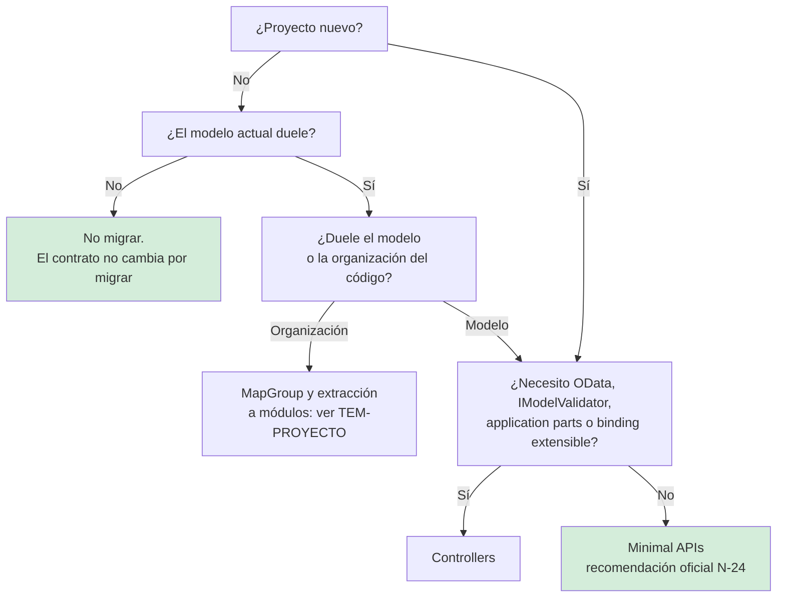

# Minimal APIs y controllers — `TEM-MINIMAL`

## Resumen ejecutivo

ASP.NET Core ofrece dos formas de declarar la superficie HTTP de una API, y desde hace algunas versiones ya no es neutral entre ellas: la documentación oficial recomienda **Minimal APIs para proyectos nuevos** y presenta los controllers como *enfoque alternativo* (`N-24`). Los títulos de sección lo dicen con esas palabras. La creencia extendida de que las Minimal APIs sirven para demos y los controllers para aplicaciones serias es la inversa exacta de la posición documentada.

Lo que este documento trata no es cuál queda más prolijo —esa pregunta la responde [`TEM-ENDP`](../../Organizacion-Estilo-Patrones-Codigo/60-Patrones-de-Codigo/Patrones-de-Endpoint.md) en la guía hermana— sino **qué contrato HTTP permite expresar cada modelo**. La pregunta importa porque los dos modelos no producen el mismo cable: difieren en cómo se declara un código de estado en la especificación OpenAPI, en qué tipo de `ProblemDetails` emiten ante una falla de validación, en qué opciones de serialización JSON los gobiernan, y en si la validación nativa de .NET 10 los alcanza. Ninguna de esas diferencias es visible mirando la lógica del endpoint; todas son visibles para el consumidor.

Le sirve a `ACT-01` cuando fija el modelo de una API nueva, a `ACT-02` cuando escribe cada endpoint y necesita saber qué le da el framework y qué tiene que declarar, y a `ACT-03` cuando lee una especificación generada y quiere entender por qué le faltan códigos de estado.

---

## Definición

### Minimal APIs

Un endpoint se declara registrando un delegado contra una ruta sobre un `IEndpointRouteBuilder` —normalmente la instancia de `WebApplication`— mediante `MapGet`, `MapPost`, `MapPut`, `MapDelete` o `MapMethods`. El framework infiere de la firma del delegado de dónde proviene cada parámetro y cómo se serializa lo que devuelve.

La URL canónica de la documentación es `/aspnet/core/fundamentals/apis` (`N-24`); `/aspnet/core/fundamentals/minimal-apis/overview` **redirige** ahí, lo cual conviene saber porque muchos enlaces de terceros apuntan al segundo.

### Controllers

Una clase derivada de `Microsoft.AspNetCore.Mvc.ControllerBase`, descubierta por reflexión al arrancar, agrupa métodos públicos que el framework asocia a rutas mediante atributos. El atributo `[ApiController]` agrega comportamientos automáticos, de los cuales el más relevante para el contrato es la respuesta `400` automática ante estado de modelo inválido (`N-36`).

### Qué NO es esta decisión

**No es una decisión de arquitectura.** Ninguno de los dos modelos dice nada sobre capas, dirección de dependencias ni modelo de dominio. Un endpoint es una cáscara de transporte. El error corriente consiste en meter la lógica de negocio dentro de la lambda, observar que `Program.cs` creció a cuatrocientas líneas y concluir que «las Minimal APIs no escalan»; lo que no escala es tener el dominio adentro del handler. La organización se trata en [`TEM-PROYECTO`](Organizacion-del-Proyecto-API.md).

**No es una decisión de rendimiento, salvo en casos extremos.** Las Minimal APIs evitan la activación del controller y la canalización de filtros de MVC. En una API que consulta una base de datos por petición, esa diferencia queda sepultada bajo la latencia de la consulta.

**«Minimal» no significa provisional.** La palabra califica la ceremonia de declaración, no la capacidad. Un route handler acepta filtros, autorización, versionado, validación nativa desde .NET 10 y generación de OpenAPI.

**No es un compromiso irreversible.** El contrato HTTP no depende del modelo elegido: la misma URI, el mismo método y el mismo cuerpo se pueden servir desde cualquiera de los dos. Lo que cambia es cuánto hay que declarar explícitamente para que el cable salga igual.

---

## La recomendación oficial, y qué dice exactamente

Este es el punto donde más material desactualizado circula, así que conviene la cita literal. `N-24` dice:

> *«ASP.NET Core provides two approaches for building HTTP APIs: Minimal APIs and controller-based APIs. For new projects, we recommend using Minimal APIs as they provide a simplified, high-performance approach for building APIs with minimal code and configuration.»*

Los títulos de sección del propio artículo son `## Minimal APIs - Recommended for new projects` y `## Controller-based APIs - Alternative approach`. En la sección *Choosing between approaches*, la instrucción es **«Start with Minimal APIs»**. Nivel: **(a) prescripción normativa de Microsoft**.

El lado de las herramientas lo confirma. `dotnet new webapi` sin opciones genera un proyecto de Minimal APIs; `--use-controllers` está disponible desde el SDK de .NET 8 y su valor por defecto es `false` (`N-58`). Nivel: **(b) default de plantilla**, coherente con (a) pero no equivalente a él.

### Cuándo sí corresponde controllers — la lista oficial

`N-24` enumera cuatro casos, y la lista es exhaustiva en el sentido de que no hay otros declarados:

> *«Consider controller-based APIs if you need: Model binding extensibility (`IModelBinderProvider`, `IModelBinder`); Advanced validation features (`IModelValidator`); Application parts or the application model; OData support.»*
>
> *«Most of these features can be implemented in Minimal APIs with custom solutions, but controllers provide them out of the box.»*

Los nombres exactos son `Microsoft.AspNetCore.Mvc.ModelBinding.IModelBinderProvider`, `Microsoft.AspNetCore.Mvc.ModelBinding.IModelBinder`, `Microsoft.AspNetCore.Mvc.ModelBinding.Validation.IModelValidator`. El soporte de OData proviene del paquete `Microsoft.AspNetCore.OData`.

A eso se suman tres preferencias blandas, que no son capacidades: aplicaciones grandes con lógica de negocio compleja, equipos familiarizados con MVC, y aplicaciones que requieran características específicas de MVC.

### Tres advertencias sobre esa lista

**No existe una tabla comparativa oficial.** El contenido de `N-24` es prosa y viñetas. Cualquier «matriz de capacidades Minimal vs Controllers» que circule por internet es **(c) convención de comunidad**, no documentación de Microsoft. La tabla que aparece más abajo en este documento es criterio propio de esta guía y se declara como tal.

**Hay deriva de versión detectada en la propia documentación.** El bloque del moniker `aspnetcore-6.0` incluye una viñeta que fue **eliminada** de los bloques 7.0 en adelante: *«Form binding support, including `IFormFile`»*. Según la documentación actual, el binding de formularios y `IFormFile` ya **no** es una carencia de Minimal APIs. Material que lo siga afirmando está citando la versión 6.

**El renderizado de vistas no figura en la lista oficial.** Es cierto que un controller de MVC puede devolver una vista Razor y un route handler no está pensado para eso, pero atribuirle a Microsoft esa razón sería inventarla. En una API REST la cuestión no se plantea.

---

## Qué contrato HTTP permite expresar cada modelo

Es la pregunta propia de esta guía, y las diferencias reales son cinco. Cuatro se resuelven con trabajo explícito; una es de capacidad.

### 1. La declaración del código de estado en OpenAPI

Con controllers y `[ApiController]`, el *ApiExplorer* de MVC infiere buena parte de la metadata de respuesta del tipo de retorno de la acción y de los atributos `[ProducesResponseType]`. Con Minimal APIs, el mecanismo equivalente es el **tipo de retorno concreto**: `TypedResults` aporta la metadata automáticamente, `Results` no (`N-26`). La consecuencia es directa sobre el contrato publicado: un endpoint que devuelve `IResult` y no declara nada produce una operación OpenAPI sin esquema de respuesta, y el consumidor recibe una especificación que no dice qué le van a devolver.

### 2. El tipo de `ProblemDetails` de una falla de validación

Los dos modelos emiten *problem details* ante un error, pero **no el mismo tipo**. Minimal APIs usa `Microsoft.AspNetCore.Http.HttpValidationProblemDetails`; MVC usa `Microsoft.AspNetCore.Mvc.ValidationProblemDetails` (`N-30`). Ambos derivan de `Microsoft.AspNetCore.Mvc.ProblemDetails` —un tipo cuyo namespace dice `Mvc` pero que se distribuye en el ensamblado `Microsoft.AspNetCore.Http.Abstractions.dll`, y por eso Minimal APIs lo usa sin referenciar MVC—. Confundirlos es un error frecuente. La diferencia de miembros entre ambos **no está verificada** en la ficha de evidencia de esta guía y no se afirma nada al respecto.

### 3. Qué opciones de JSON gobiernan la serialización

Son dos tipos distintos, en ensamblados distintos, con nombres de propiedad distintos, y **configurar uno no afecta al otro**. Es la trampa que más contratos rompe en aplicaciones que mezclan ambos modelos, y se detalla en [`TEM-SERIAL`](Serializacion-y-Modelos.md).

### 4. La validación nativa de .NET 10

`Microsoft.Extensions.Validation`, introducida en .NET 10, tiene soporte integrado para Minimal APIs y Blazor. `N-35` es literal: *«It's not supported by default in MVC.»* Esto invierte la creencia habitual. Se trata en [`TEM-VALID`](Validacion.md).

### 5. Los cuatro casos de capacidad

Model binding extensible, `IModelValidator`, application parts y OData. Son los únicos casos donde el modelo elegido determina lo que se puede hacer y no solo cuánto cuesta hacerlo.

---

## Los mecanismos de Minimal APIs que hacen falta conocer

### `MapGroup` y `RouteGroupBuilder`

`Microsoft.AspNetCore.Builder.EndpointRouteBuilderExtensions.MapGroup` devuelve un `Microsoft.AspNetCore.Routing.RouteGroupBuilder` (`N-25`, monikers 7.0 a 11.0). La documentación lo describe así:

> *«The `MapGroup` extension method helps organize groups of endpoints with a common prefix and reduces repetitive code. Use this method to customize entire groups of endpoints with a single call to methods like `RequireAuthorization` and `WithMetadata` that add endpoint metadata.»*

Los grupos se anidan, y el prefijo puede ser vacío. La semántica de orden de los filtros es la parte que hay que retener y la que menos se conoce:

> *«Adding filters or metadata to a group results in the same behavior as adding them individually to each endpoint (before adding extra filters or metadata that might exist in an inner group or specific endpoint).»*

Es decir: **los filtros del grupo externo se ejecutan siempre antes que los del interno, con independencia del orden de registro**. El orden de registro solo importa dentro del mismo grupo o endpoint. Quien asume lo contrario y registra un filtro de auditoría en el grupo interno esperando que corra primero obtiene el comportamiento opuesto.

### `TypedResults` frente a `Results`

`N-26` es prescriptivo: *«Returning `TypedResults` is preferred to returning `Results`.»* Nivel **(a)**.

Ambas son clases estáticas del namespace `Microsoft.AspNetCore.Http` con conjuntos de ayudantes similares. La diferencia es el tipo de retorno: los ayudantes de `Results` devuelven `IResult`; los de `TypedResults` devuelven uno de los tipos de implementación concretos, definidos en `Microsoft.AspNetCore.Http.HttpResults`. La documentación declara dos ventajas:

> *«`TypedResults` helpers return strongly typed objects, which can improve code readability, unit testing, and reduce the chance of runtime errors.»*
> *«The implementation type automatically provides the response type metadata for OpenAPI to describe the endpoint.»*

La segunda es la que importa para el contrato. El costo está declarado con igual franqueza: con múltiples tipos de retorno hay que declarar la unión explícitamente mediante `Microsoft.AspNetCore.Http.HttpResults.Results<TResult1, TResultN>`, o el código no compila.

> *«Using `TypedResults` is more verbose, but that's the trade-off for having the type information be statically available and thus capable of self-describing to OpenAPI.»*

Novedades de .NET 10 en esta superficie: `Results.InternalServerError(...)` y `TypedResults.ServerSentEvents(IAsyncEnumerable<SseItem<T>>)`.

Existe además un conjunto de interfaces de detección en tiempo de ejecución, pensadas para escribir filtros que inspeccionen el resultado sin conocer su tipo concreto: `IContentTypeHttpResult`, `IFileHttpResult`, `INestedHttpResult`, `IStatusCodeHttpResult`, `IValueHttpResult` e `IValueHttpResult<TValue>`, todas en `Microsoft.AspNetCore.Http`.

### Endpoint filters

Los tipos son `IEndpointFilter`, `EndpointFilterInvocationContext`, `EndpointFilterDelegate` y `EndpointFilterFactoryContext`, en `Microsoft.AspNetCore.Http` (`N-27`). La firma del método es:

```csharp
public async ValueTask<object?> InvokeAsync(
    EndpointFilterInvocationContext efiContext,
    EndpointFilterDelegate next)
```

Se registran con `.AddEndpointFilter(async (ctx, next) => …)`, `.AddEndpointFilter<TFilter>()` o `.AddEndpointFilterFactory((filterFactoryContext, next) => …)`.

El orden está documentado sin ambigüedad:

> *«The execution order of filter code called before the call to `EndpointFilterDelegate` (`next`) is First In, First Out (FIFO). The execution order of filter code called after the call to `EndpointFilterDelegate` (`next`) is First In, Last Out (FILO).»*

Y hay una limitación que sorprende a casi todo el mundo la primera vez:

> *«Although filters can resolve dependencies from DI, filters themselves can't be resolved from DI.»*

Un filtro puede pedirle servicios al contenedor, pero el filtro mismo no se resuelve desde el contenedor.

**Los endpoint filters no son exclusivos de Minimal APIs.** `N-27` documenta que se puede invocar `AddEndpointFilter` sobre un `ControllerActionEndpointConventionBuilder` *«to support executing the same filter logic on actions and endpoints»*. Es el puente que permite compartir lógica transversal entre ambos modelos, y rara vez aparece en el material de comunidad.

### Model binding

En Minimal APIs el origen de cada parámetro se **infiere de la firma**: los que coinciden con un segmento de ruta salen de la ruta, los tipos registrados en el contenedor salen del contenedor, y el resto se resuelve según reglas del framework. Los atributos explícitos —`[FromBody]`, `[FromQuery]`, `[FromRoute]`, `[FromServices]`, `[FromHeader]`— siguen disponibles cuando la inferencia no alcanza o cuando conviene documentar la intención.

Un tipo propio puede participar del binding implementando `TryParse` —para valores de ruta y de cadena de consulta— o `BindAsync` —para escenarios que requieren el `HttpContext` completo—. Es el mecanismo que reemplaza a `IModelBinder` en el modelo minimal, con la diferencia declarada por `N-24`: no hay una capa de extensibilidad de proveedores equivalente a `IModelBinderProvider`, y por eso el binding extensible figura entre las razones oficiales para elegir controllers.

---

## Aplicación por escenario

### `ESC-1` — API nueva

Es donde la recomendación oficial se aplica sin matices: **Minimal APIs**, salvo que se necesite alguno de los cuatro casos de la lista de `N-24`. La decisión adicional que hay que tomar el primer día, y que casi nadie toma, es la de usar `TypedResults` desde el principio en lugar de `Results`. Migrar después endpoint por endpoint es trabajo mecánico y aburrido, y como no rompe nada visible en el camino feliz, no se hace nunca; el resultado es una especificación OpenAPI incompleta que el consumidor descubre en `ESC-4`.

La segunda decisión temprana es la agrupación con `MapGroup`. Un `MapGroup("/v1/salas")` desde el primer endpoint cuesta una línea y evita repetir el prefijo, la autorización y las etiquetas de OpenAPI cuarenta veces.

### `ESC-2` — Exposición o migración

Dos variantes con respuestas distintas.

**Migración desde ASP.NET Framework Web API o MVC clásico.** Los controllers ofrecen un camino de menor fricción: la forma del código se conserva, los atributos de ruta se traducen casi uno a uno, y el esfuerzo se concentra donde debe estar —en el modelo de recursos que se va a exponer, no en la sintaxis—. Adoptar simultáneamente el modelo nuevo y rediseñar el contrato multiplica los frentes abiertos.

**Exposición de un sistema existente que no tenía API.** No hay código previo que conservar, de modo que la decisión es la de `ESC-1`.

En ambas variantes hay una advertencia que vale más que la elección del modelo: el riesgo dominante de `ESC-2` es filtrar el modelo interno, y ninguno de los dos modelos ayuda ni estorba en eso. Un controller que devuelve la entidad de Entity Framework y un route handler que devuelve la misma entidad producen el mismo problema.

### `ESC-3` — Evolución en producción

**El cambio de modelo no es visible para el consumidor si se hace bien**, y esa es la observación central del escenario. Reescribir un controller como route handler no altera la URI, el método, los códigos de estado ni el cuerpo, siempre que se replique cada uno de esos elementos explícitamente. Lo que sí rompe en silencio son las diferencias de default que nadie revisó: las opciones de JSON configuradas en `AddControllers().AddJsonOptions(...)` **no aplican** a los endpoints minimal, y un endpoint migrado empieza a serializar con la política por defecto.

La migración parcial es legítima y frecuente: ambos modelos conviven en la misma aplicación sin conflicto. La condición para que conviva sin romper es configurar **las dos** superficies de opciones JSON con los mismos valores, y verificarlo con una prueba que compare la respuesta antes y después.

### `ESC-4` — Evaluación de una API ajena

En **`ESC-4a`**, con acceso al código, el modelo se identifica en segundos y aporta hipótesis útiles. Un proyecto de Minimal APIs sin `TypedResults` casi con seguridad tiene una especificación OpenAPI incompleta. Un proyecto de controllers sin `[ProducesResponseType]` tiene el mismo problema por otra vía. Un proyecto que mezcla ambos modelos merece la pregunta de si alguien verificó que las dos superficies de serialización estén alineadas.

En **`ESC-4b`**, desde afuera, el modelo **no es observable** y no conviene inferirlo. Ni las cabeceras ni la forma de las respuestas lo delatan de manera confiable. Lo que sí se observa es el resultado: si la especificación publicada declara menos códigos de estado que los que la API efectivamente devuelve, hay un problema de declaración, y es indistinto de qué modelo provenga.

### Qué cambia según el contexto

| Contexto | Qué pesa en esta decisión |
|---|---|
| `CTX-1` pública | La completitud de la especificación OpenAPI es el producto. `TypedResults` deja de ser preferencia y pasa a ser requisito operativo: cada código de estado que el consumidor puede recibir tiene que estar declarado. |
| `CTX-2` interna | Es el contexto de menor presión. La especificación vale como generador de clientes y de pruebas más que como contrato, y la elección se puede tomar por familiaridad del equipo sin consecuencias graves. |
| `CTX-3` app propia | Si hay clientes instalados —MAUI—, la especificación gobierna el cliente tipado generado, y una operación sin esquema de respuesta produce un cliente que devuelve `object`. La disciplina de `CTX-1` aplica. |
| `CTX-4` integración | Casi irrelevante: acá se consume una API ajena. Lo que importa es el andamiaje de consumo, en [`TEM-CONSUMO`](Consumo-desde-Blazor-y-MAUI.md). |

---

## Ejemplos concretos

Todos los ejemplos son **sintéticos** y pertenecen al dominio de reserva de salas. Los nombres de tipos, métodos y paquetes son los verificados en `N-24` a `N-27` y `N-36`.

### El mismo endpoint en los dos modelos

Se toma la operación de crear una reserva, que tiene tres desenlaces: creada, entrada inválida y conflicto por solapamiento de horarios.

**Minimal API con `TypedResults`.** La unión de tipos de retorno declara los tres códigos, y de ahí sale la metadata de OpenAPI sin ninguna anotación adicional.

```csharp
// Sintético — dominio de reserva de salas. .NET 10.
app.MapPost("/v1/reservas", async Task<Results<Created<ReservaResumen>, ValidationProblem, Conflict<ProblemDetails>>> (
        CrearReservaSolicitud solicitud,
        IServicioReservas servicio,
        CancellationToken ct) =>
{
    var resultado = await servicio.CrearAsync(solicitud, ct);

    return resultado.Estado switch
    {
        EstadoCreacion.Creada => TypedResults.Created(
            $"/v1/reservas/{resultado.Reserva!.Id}", resultado.Reserva),

        EstadoCreacion.Solapada => TypedResults.Conflict(new ProblemDetails
        {
            Title  = "La sala ya está reservada en ese período",
            Status = StatusCodes.Status409Conflict,
            Detail = $"La sala {solicitud.SalaId} tiene una reserva entre {resultado.DesdeExistente:O} y {resultado.HastaExistente:O}."
        }),

        _ => TypedResults.ValidationProblem(resultado.Errores)
    };
});
```

**Controller equivalente.** La metadata de respuesta se declara con atributos; el `400` por validación de modelo lo emite `[ApiController]` sin código.

```csharp
// Sintético — dominio de reserva de salas. .NET 10.
[ApiController]
[Route("v1/reservas")]
public sealed class ReservasController(IServicioReservas servicio) : ControllerBase
{
    [HttpPost]
    [ProducesResponseType<ReservaResumen>(StatusCodes.Status201Created)]
    [ProducesResponseType<ValidationProblemDetails>(StatusCodes.Status400BadRequest)]
    [ProducesResponseType<ProblemDetails>(StatusCodes.Status409Conflict)]
    public async Task<IActionResult> Crear(CrearReservaSolicitud solicitud, CancellationToken ct)
    {
        var resultado = await servicio.CrearAsync(solicitud, ct);

        return resultado.Estado switch
        {
            EstadoCreacion.Creada => Created($"/v1/reservas/{resultado.Reserva!.Id}", resultado.Reserva),
            EstadoCreacion.Solapada => Problem(
                title: "La sala ya está reservada en ese período",
                statusCode: StatusCodes.Status409Conflict),
            _ => ValidationProblem()
        };
    }
}
```

Las dos respuestas son idénticas en el cable. Lo que difiere es dónde se declara el contrato: en el tipo de retorno o en los atributos. Y difiere el tipo concreto del cuerpo del `400`: `HttpValidationProblemDetails` en el primer caso, `ValidationProblemDetails` en el segundo.

### Por qué `TypedResults` cambia la especificación

El par de ejemplos que la propia documentación usa (`N-26`), adaptado al dominio:

```csharp
// Con Results hace falta declarar el tipo explícitamente.
app.MapGet("/v1/salas/{id:guid}", (Guid id, IRepositorioSalas repo)
        => Results.Ok(repo.Obtener(id)))
    .Produces<SalaResumen>();

// Con TypedResults la metadata sale del tipo de retorno.
app.MapGet("/v1/salas/{id:guid}", (Guid id, IRepositorioSalas repo)
        => TypedResults.Ok(repo.Obtener(id)));
```

En el primer caso, olvidarse de `.Produces<T>()` no rompe nada en tiempo de ejecución y deja la operación sin esquema en el documento OpenAPI. En el segundo, el olvido no es posible.

### Grupos anidados y orden de filtros

```csharp
// Sintético. El filtro del grupo externo corre SIEMPRE antes que el del interno,
// aunque se registre después.
var v1 = app.MapGroup("/v1")
    .AddEndpointFilter<FiltroDeAuditoria>();          // externo: corre primero

var salas = v1.MapGroup("/salas")
    .WithTags("Salas")
    .AddEndpointFilter<FiltroDeCuotaPorSede>();       // interno: corre después

salas.MapGet("/", ListarSalasAsync);
salas.MapGet("/{id:guid}", ObtenerSalaAsync);
salas.MapGet("/{id:guid}/reservas", ListarReservasDeSalaAsync);
```

### Un endpoint filter que traduce una excepción de dominio

Ilustra la firma real, la restricción de DI y las interfaces de detección de resultado.

```csharp
// Sintético. El filtro resuelve dependencias desde DI, pero el filtro
// mismo no se resuelve desde DI (N-27).
public sealed class FiltroDeSolapamiento : IEndpointFilter
{
    public async ValueTask<object?> InvokeAsync(
        EndpointFilterInvocationContext contexto,
        EndpointFilterDelegate next)
    {
        try
        {
            return await next(contexto);
        }
        catch (SolapamientoDeReservaException ex)
        {
            return TypedResults.Conflict(new ProblemDetails
            {
                Title  = "La sala ya está reservada en ese período",
                Status = StatusCodes.Status409Conflict,
                Detail = ex.Message
            });
        }
    }
}
```

### Compartir el filtro con los controllers

```csharp
// Sintético. AddEndpointFilter también se aplica sobre el convention builder
// de los controllers (N-27): la misma lógica sirve a ambos modelos.
app.MapControllers()
   .AddEndpointFilter<FiltroDeSolapamiento>();
```

### Un tipo propio en el model binding

```csharp
// Sintético. TryParse habilita el binding desde ruta o cadena de consulta
// sin necesidad de IModelBinder.
public readonly record struct CodigoDeSede(string Valor)
{
    public static bool TryParse(string? texto, IFormatProvider? cultura, out CodigoDeSede resultado)
    {
        if (!string.IsNullOrWhiteSpace(texto) && texto.Length == 4 && texto.All(char.IsAsciiLetterUpper))
        {
            resultado = new CodigoDeSede(texto);
            return true;
        }
        resultado = default;
        return false;
    }
}

app.MapGet("/v1/sedes/{codigo}/salas", (CodigoDeSede codigo, IRepositorioSalas repo)
    => TypedResults.Ok(repo.PorSede(codigo)));
```

Un valor que no supere `TryParse` produce un `400` sin llegar al handler. Es exactamente el comportamiento deseado y no requiere código de validación.

---

## Comparación — criterio propio de esta guía

La tabla que sigue es **criterio de esta guía**, no documentación de Microsoft. `N-24` no contiene ninguna tabla comparativa; su contenido es prosa y viñetas. Se declara porque la ausencia de tabla oficial es justamente lo que multiplica las tablas apócrifas.

| Dimensión | Minimal APIs | Controllers |
|---|---|---|
| Recomendación oficial para proyecto nuevo (`N-24`) | **Sí** | Enfoque alternativo |
| Default de `dotnet new webapi` (`N-58`) | **Sí** | Con `--use-controllers` |
| Metadata de respuesta en OpenAPI | Del tipo de retorno, con `TypedResults` | De `[ProducesResponseType]` y del ApiExplorer |
| Tipo de *problem details* de validación | `HttpValidationProblemDetails` | `ValidationProblemDetails` |
| Opciones de JSON que lo gobiernan | `Microsoft.AspNetCore.Http.Json.JsonOptions` | `Microsoft.AspNetCore.Mvc.JsonOptions` |
| Validación nativa de .NET 10 (`N-35`) | **Soportada** | **No soportada por defecto** |
| `400` automático por estado de modelo | Vía `AddValidation()` en .NET 10 | Vía `[ApiController]` (`N-36`) |
| Interceptores | `IEndpointFilter`, por endpoint o grupo | Filter pipeline de MVC, y también `IEndpointFilter` |
| Extensibilidad de model binding | `TryParse` / `BindAsync` | `IModelBinder`, `IModelBinderProvider` |
| Validación extensible (`IModelValidator`) | No | **Sí** |
| Application parts y application model | No | **Sí** |
| OData (`Microsoft.AspNetCore.OData`) | No | **Sí** |

Las cuatro últimas filas son las únicas de capacidad. El resto son diferencias de cómo se declara lo mismo.

---

## Criterios de elección



La rama que más se ignora es la de la derecha. La mayoría de las migraciones que se plantean como «pasar a controllers» no resuelven un problema de modelo sino de organización, y la organización se resuelve con `MapGroup` y extracción a módulos sin tocar el modelo. Se trata en [`TEM-PROYECTO`](Organizacion-del-Proyecto-API.md).

---

## Migración entre ambos modelos

Ambos coexisten en la misma aplicación sin conflicto, de modo que la migración es incremental por naturaleza. Lo que hay que vigilar no es el código sino **el cable**.

### De controllers a Minimal APIs

Cinco puntos de control, en orden de riesgo:

1. **Opciones de JSON.** Lo configurado con `AddControllers().AddJsonOptions(...)` no aplica a los endpoints minimal. Hay que replicarlo con `ConfigureHttpJsonOptions(...)` **antes** de mover el primer endpoint. Detalle en [`TEM-SERIAL`](Serializacion-y-Modelos.md).
2. **El `400` automático.** `[ApiController]` lo emitía sin código; en Minimal APIs hace falta `builder.Services.AddValidation()` de .NET 10, o un endpoint filter. Nótese que la guía de migración de Microsoft sigue diciendo *«Replace model validation with manual validation or custom binding»*: **esa instrucción quedó obsoleta con .NET 10** y no debe seguirse tal cual.
3. **La metadata de respuesta.** Cada `[ProducesResponseType]` tiene que convertirse en un tipo de retorno con `TypedResults` o en un `.Produces<T>()` explícito. Omitirlo degrada la especificación sin romper el camino feliz, que es la peor combinación posible.
4. **Los filtros de MVC.** Un `IAsyncActionFilter` no se traslada solo. La contrapartida es `IEndpointFilter`, con orden FIFO/FILO y sin resolución desde DI.
5. **El tipo del cuerpo de error de validación.** Cambia de `ValidationProblemDetails` a `HttpValidationProblemDetails`. Si algún consumidor deserializa ese cuerpo con esquema estricto, conviene verificarlo antes de desplegar.

### De Minimal APIs a controllers

El sentido inverso es menos frecuente y suele estar motivado por uno de los cuatro casos de capacidad. Los mismos cinco puntos se recorren al revés. El riesgo adicional está en las convenciones automáticas de `[ApiController]`, que hacen cosas que antes no ocurrían —inferencia del origen de parámetros y respuesta `400` automática— y pueden cambiar el comportamiento ante entradas que antes llegaban al handler.

---

## Preguntas guía

- ¿La elección entre ambos modelos la tomé por una de las cuatro razones de capacidad de `N-24`, o por costumbre?
- ¿Cada endpoint declara todos los códigos de estado que puede devolver, y cómo lo verifico?
- Si mi aplicación mezcla ambos modelos, ¿las dos superficies de opciones JSON están configuradas igual?
- ¿Qué haría falta para que un cambio de modelo fuera invisible para mis consumidores?
- Cuando el equipo dice «hay que migrar a controllers porque esto no escala», ¿el problema es el modelo o la organización del código?
- ¿El filtro que registré en el grupo interno corre cuando yo creo que corre?

---

## Criterios de calidad

Una aplicación buena de este tema se reconoce en que **el contrato HTTP publicado es indistinguible del modelo de implementación elegido**. La especificación declara todos los códigos de estado, el cuerpo de error tiene la misma forma venga de donde venga, y nadie que consuma la API puede deducir si detrás hay controllers o route handlers.

### Antipatrones

**Elegir el modelo por argumento de autoridad invertido.** «Minimal es para demos» contradice `N-24`. «Controllers son legacy» también es falso: Microsoft los documenta como enfoque vigente y soportado, no como obsoleto. Ninguna de las dos frases sobrevive al contacto con la documentación.

**`Results` en toda la aplicación y una especificación OpenAPI vacía.** Es el antipatrón más caro de esta familia porque no produce ningún síntoma en desarrollo. Todo funciona; lo único que falla es la especificación, y la especificación solo la lee el consumidor, que está en otra empresa y en otro trimestre.

**Migrar de modelo esperando resolver la organización.** Cambia la sintaxis y deja intacto el problema. Si la lógica de negocio está dentro del handler, va a quedar dentro de la acción.

**Mezclar ambos modelos sin alinear las opciones de JSON.** Produce una API donde `/v1/salas` devuelve `camelCase` y `/v1/reservas` devuelve otra cosa, o donde un endpoint acepta números entre comillas y el otro no. El consumidor lo reporta como bug intermitente y cuesta días encontrarlo.

**Asumir que el filtro del grupo interno corre primero.** `N-25` dice lo contrario y el comportamiento no depende del orden de registro.

**Intentar resolver un `IEndpointFilter` desde el contenedor de dependencias.** `N-27` lo prohíbe explícitamente. El filtro resuelve servicios; el filtro no se resuelve.

**Repetir la lista de carencias de Minimal APIs de la versión 6.** El binding de formularios e `IFormFile` salió de esa lista a partir del moniker 7.0. Citar la lista vieja atribuye a Microsoft una afirmación que retiró.

**Afirmar que ASP.NET Core implementa RFC 9457.** No está respaldado por la documentación: `N-28` cita RFC 7807 en la sección compartida, RFC 9457 solo en la pestaña de controllers, y `N-30` describe el tipo como basado en RFC 9110. El issue de adopción (`N-63`) está abierto en Backlog.

---

## Anexo — Lista de verificación

Se recorre antes de dar por cerrada la superficie HTTP de un servicio, con independencia del modelo elegido.

```yaml
modelo_elegido: minimal | controllers | mixto
razon_declarada: ""                    # si es controllers, ¿cuál de los 4 casos de N-24?
version_dotnet: "10.0"

contrato:
  todos_los_endpoints_declaran_codigos: si | no | parcial
  mecanismo: TypedResults | ProducesResponseType | mixto
  cuerpo_de_error_uniforme: si | no     # mismo shape venga de donde venga
  tipo_problem_details: HttpValidationProblemDetails | ValidationProblemDetails | ambos

serializacion:
  configuro_ConfigureHttpJsonOptions: si | no | no_aplica
  configuro_AddJsonOptions: si | no | no_aplica
  ambas_alineadas: si | no | no_aplica  # obligatorio si modelo_elegido = mixto

organizacion:
  usa_MapGroup: si | no | no_aplica
  endpoints_fuera_de_Program_cs: si | no
  filtros_de_grupo_documentados: si | no # ¿está claro cuál corre primero?

validacion:
  mecanismo: AddValidation | ApiController | endpoint_filter | manual | ninguno
  emite_400_ante_entrada_invalida: si | no

migracion_pendiente: []                # endpoints que siguen en el modelo anterior
```

El campo `cuerpo_de_error_uniforme` es el que más información aporta en una aplicación mixta, y es el que casi nunca se revisa. Un `400` de un controller y un `400` de un route handler pueden traer estructuras distintas en la misma API sin que nadie lo note del lado del servidor.
