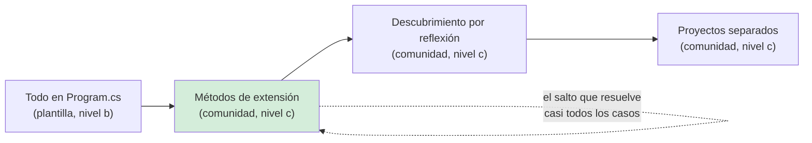
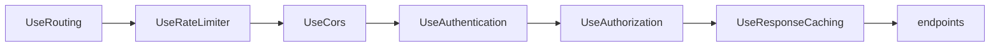

# Organización del proyecto API — `TEM-PROYECTO`

## Resumen ejecutivo

`dotnet new webapi` genera hoy un proyecto de Minimal APIs con todos los endpoints dentro de `Program.cs`, un pronóstico del tiempo aleatorio, un archivo `.http` y ninguna interfaz de OpenAPI. Eso es todo. **No genera carpetas `Services/`, `Repositories/`, `DTOs/`, `Models/` ni `Endpoints/`, no impone arquitectura en capas, no trae patrón repository ni MediatR** (`N-66`). Cualquier estructura que exceda ese punto de partida es decisión del equipo, y esa distinción —entre lo que el framework impone y lo que la costumbre sugiere— es el asunto de este documento.

La organización de un proyecto de API tiene una particularidad frente a la de cualquier otra aplicación: **una parte de ella es visible desde afuera**. La agrupación de endpoints se refleja en las etiquetas del documento OpenAPI y por lo tanto en cómo se ve la API en un portal de documentación y en cómo se llaman las clases del cliente generado. Elegir agrupar por recurso o por caso de uso no es una preferencia interna; es una decisión que llega al consumidor.

Le sirve a `ACT-01` cuando fija la estructura de un servicio nuevo, y a `ACT-02` cuando tiene que decidir dónde poner el endpoint número cuarenta y uno.

---

## Definición

La **organización de un proyecto API** es el conjunto de decisiones sobre dónde vive cada pieza de la superficie HTTP: en qué archivo se registra cada endpoint, bajo qué criterio se agrupan, cómo se compone el arranque de la aplicación, y qué se extrae a proyectos separados.

Resuelve tres problemas distintos que conviene no mezclar:

**Legibilidad de la superficie.** Poder responder «qué endpoints tiene esta API» sin ejecutar la aplicación ni abrir una herramienta.

**Localidad del cambio.** Que agregar un endpoint de reservas toque archivos de reservas y nada más.

**Composición del arranque.** Que `Program.cs` diga qué hace la aplicación en lugar de cómo lo hace, y que el orden del middleware —que es significativo y en algunos casos obligatorio— sea revisable de un vistazo.

### Qué NO es

**No es arquitectura de la aplicación.** Dónde se registra un endpoint no dice nada sobre las capas, la dirección de las dependencias ni el modelo de dominio. Un proyecto con carpetas `Application/`, `Domain/` e `Infrastructure/` puede tener toda la lógica en los handlers, y un `Program.cs` de cuarenta líneas puede delegar en un dominio impecable. Las capas las trata la guía hermana de código.

**No es una decisión que Microsoft haya prescrito.** Es el punto más importante de este documento y el que más se malinterpreta. La lectura del código fuente de la plantilla `WebApi-CSharp` de la rama `release/10.0` (`N-66`) confirma que **ninguna** de las estructuras que el ecosistema da por canónicas tiene respaldo de una plantilla ni de un documento normativo de Microsoft. Todas son **(c) convención de comunidad**. Buenas, en varios casos; oficiales, ninguna.

**No es el modelo de recursos.** La agrupación del código puede coincidir con la jerarquía de URIs o no. Cuando difieren sin razón declarada, es señal de que una de las dos se decidió por inercia. El modelo de recursos lo tratan [`TEM-RECURSOS`](../20-Diseno-de-Recursos/Modelado-de-Recursos.md) y [`TEM-URI`](../20-Diseno-de-Recursos/Nomenclatura-de-URIs.md).

---

## Qué genera realmente `dotnet new webapi` hoy

Verificado en el código fuente de la plantilla, no en la documentación que la describe (`N-66`). La distinción de método importa: es la única forma de responder con certeza.

### El default es Minimal APIs

`N-58` lo dice con precisión inusual:

> *«`-minimal|--use-minimal-apis` — Create a project that uses the ASP.NET Core minimal API. Default is `false`, but this option is overridden by `-controllers`. Since the default for `-controllers` is `false`, entering `dotnet new webapi` without specifying either option creates a minimal API project.»*

`--use-controllers` está disponible **desde el SDK de .NET 8**. Sobre cuándo cambió exactamente el default hay que ser cuidadoso: la documentación ancla `--use-controllers` a .NET 8 y **no** contiene una frase que diga «en .NET 8 el default pasó a Minimal APIs». Ese detalle circula en fuentes secundarias y no proviene de Microsoft Learn.

### El contenido real

Es una **única** carpeta `WebApi-CSharp` con archivos `Program` condicionales; no hay una carpeta «minimal» separada:

```
.template.config/
Company.WebApplication1.http                   ← archivo .http
Controllers/WeatherForecastController.cs
Program.cs                                     ← variante controllers
Program.Main.cs                                ← variante --use-program-main
Program.MinimalAPIs.WindowsOrNoAuth.cs         ← RUTA POR DEFECTO
Program.MinimalAPIs.OrgOrIndividualB2CAuth.cs
Properties/launchSettings.json
WeatherForecast.cs                             ← solo variante controllers
appsettings.json / appsettings.Development.json
```

El `Program` por defecto, verbatim de `Program.MinimalAPIs.WindowsOrNoAuth.cs`:

```csharp
var builder = WebApplication.CreateBuilder(args);

// Learn more about configuring OpenAPI at https://aka.ms/aspnet/openapi
builder.Services.AddOpenApi();

var app = builder.Build();

if (app.Environment.IsDevelopment())
{
    app.MapOpenApi();
}

app.UseHttpsRedirection();
```

| Pregunta | Respuesta verificada |
|---|---|
| ¿Minimal APIs por defecto? | Sí |
| ¿Sigue el sample `WeatherForecast`? | Sí, con `record WeatherForecast(DateOnly Date, int TemperatureC, string? Summary)` |
| ¿OpenAPI? | Sí: `AddOpenApi()` y `MapOpenApi()`, condicionados por `EnableOpenAPI`; se quitan con `--no-openapi` |
| ¿Interfaz de OpenAPI? | **No.** Ni Swagger UI ni Scalar (`N-33`, `N-66`) |
| ¿Archivo `.http`? | Sí |
| ¿Top-level statements? | Sí; `--use-program-main` genera la clase `Program` con `Main` |
| ¿Flag `--aot`? | No existe. AOT es una plantilla separada: **`webapiaot`** |

El `launchSettings.json` trae perfiles `http` (`http://localhost:5000`) y `https` (`https://localhost:5001;http://localhost:5000`), ambos con `"launchBrowser": false` —coherente con que ya no hay ninguna interfaz que abrir— y `ASPNETCORE_ENVIRONMENT=Development`.

### Las convenciones de la plantilla son nivel (b)

Todo lo siguiente es default de plantilla, no prescripción: `sourceName` igual a `Company.WebApplication1`, namespaces file-scoped, nullable habilitado, implicit usings habilitados, collection expressions, primary constructors en el controller, y nombres de endpoint declarados con `.WithName(...)` o `[HttpGet(Name = ...)]` **solo cuando OpenAPI está habilitado**.

El contenido literal del `.csproj` **no está verificado**: no reside en el repositorio porque se produce al construir el paquete de plantillas. Los valores `<ImplicitUsings>enable</ImplicitUsings>`, `<Nullable>enable</Nullable>` y `<TargetFramework>net10.0</TargetFramework>` están fuertemente inferidos de los archivos fuente, pero no leídos.

### Qué conviene cambiarle

Cuatro cosas, en orden de urgencia. Las cuatro son **criterio de esta guía**.

1. **Sacar el sample.** `WeatherForecast` y su endpoint no aportan nada y sobreviven en producción con una frecuencia que sorprende.
2. **Decidir la agrupación antes del cuarto endpoint.** Es el punto donde `Program.cs` empieza a doler y donde el costo de reorganizar todavía es cero. Después se posterga indefinidamente.
3. **Fijar las opciones de serialización explícitamente.** La plantilla no las toca, de modo que la API queda con `JsonSerializerDefaults.Web` sin que nadie lo haya decidido. Se trata en [`TEM-SERIAL`](Serializacion-y-Modelos.md).
4. **Agregar el manejo de errores.** La plantilla no llama a `AddProblemDetails()` ni a `UseExceptionHandler()`. Una excepción no controlada produce una respuesta que depende del entorno y no del contrato.

Sobre la interfaz de OpenAPI la posición correcta es la de `N-33`, que es normativa y viene con énfasis original: *«**OpenAPI user interfaces (Swagger UI, ReDoc, Scalar) should only be enabled in development environments.**»* Agregar una es legítimo; agregarla fuera de `IsDevelopment()` contradice a Microsoft. La configuración concreta la trata [`TEM-OPENAPI`](../60-Especificacion-y-Documentacion/OpenAPI.md).

---

## Dónde viven los endpoints

Cuatro alternativas, de menor a mayor ceremonia. La primera es la de la plantilla; las otras tres son convención de comunidad.

### Todo en `Program.cs`

Es lo que genera la plantilla y es adecuado hasta unos pocos endpoints. Deja de serlo cuando la superficie crece: el archivo mezcla configuración de servicios, orden de middleware y lógica de ruteo, y cualquier cambio toca el mismo archivo que todos los demás cambios.

### Métodos de extensión sobre `IEndpointRouteBuilder`

Es el paso que resuelve la mayor parte de lo que motiva las migraciones a controllers. Cada área funcional expone un método de extensión que registra su grupo, y `Program.cs` conserva una línea por área. No requiere ninguna biblioteca ni convención de descubrimiento.

### Descubrimiento automático de módulos

Una interfaz `IModuloDeEndpoints` implementada por cada área, más un barrido del ensamblado al arrancar. Cambia una línea explícita por reflexión. Es cómodo cuando hay muchas áreas y tiene un costo real: **la superficie deja de ser legible leyendo `Program.cs`**, que era una de las ventajas de las Minimal APIs frente a los controllers. Conviene tomarlo como decisión consciente y no como *default* copiado de una plantilla de comunidad.

### Proyectos separados

Un ensamblado por módulo, referenciado por el proyecto de arranque. Se justifica cuando hay un límite de propiedad real —equipos distintos— o cuando se pretende extraer el módulo a un servicio propio más adelante. Aplicado sin ese motivo, agrega fricción de compilación sin comprar nada.



---

## Agrupación por recurso frente a por caso de uso

Es la decisión estructural del documento, y la que se ve desde afuera.

### Por recurso

Un archivo por recurso del modelo: `EndpointsDeSalas`, `EndpointsDeReservas`, `EndpointsDeSedes`, `EndpointsDeUsuarios`. El eje de organización coincide con la jerarquía de URIs, lo que produce una correspondencia directa entre la estructura del código y la estructura de la API.

**A favor.** La superficie del código se lee igual que la especificación. Las etiquetas de OpenAPI salen de la agrupación sin esfuerzo. Un consumidor que pregunta «qué puedo hacer con las reservas» tiene un solo archivo del lado del servidor.

**En contra.** Un caso de uso que atraviesa recursos queda repartido. Cancelar una reserva toca reservas, libera capacidad de la sala y notifica al usuario; el archivo de reservas termina conociendo tres áreas.

### Por caso de uso

Un archivo o carpeta por operación de negocio: `CrearReserva`, `CancelarReserva`, `ConsultarDisponibilidad`. Es el eje que la comunidad llama *Vertical Slice*.

**A favor.** Localidad máxima: todo lo que un cambio necesita está junto. Escala bien en cantidad de operaciones porque cada una es independiente.

**En contra.** La correspondencia con la especificación se pierde. Las etiquetas de OpenAPI hay que declararlas a mano o el documento sale con una etiqueta por operación, lo que produce un portal de documentación con cuarenta secciones de un ítem cada una. Y el modelo de recursos se vuelve más difícil de ver en el código, lo que en `ESC-2` facilita justamente el error que hay que evitar: exponer operaciones en lugar de recursos.

### El criterio de esta guía

**Agrupar por recurso el registro de los endpoints, y por caso de uso lo que hay detrás.** El grupo `MapGroup("/v1/reservas")` con sus etiquetas y su autorización vive en un archivo de reservas; el handler de cada operación delega en un tipo propio de esa operación. Se conserva la correspondencia con la especificación y la localidad del cambio queda en la capa donde importa.

La regla que sostiene esa recomendación es simple y vale la pena enunciarla suelta: **la agrupación que se ve desde afuera debe seguir el modelo de recursos, porque es lo que el consumidor entiende**. Ningún integrador razona en términos de los casos de uso internos del proveedor.

---

## La composición de `Program.cs`

`Program.cs` hace tres cosas, y conviene que se lean como tres bloques separados: registrar servicios, componer el middleware, y registrar los endpoints.

El bloque del medio es el que tiene restricciones **normativas** y por eso no admite reordenamiento libre. Las verificadas en `N-47` y `N-48`:

> *«`UseCors`, `UseAuthentication`, and `UseAuthorization` must appear in the order shown.»*
> *«With endpoint routing, the CORS middleware must be configured to execute between the calls to `UseRouting` and `UseEndpoints`.»*
> *«`UseCors` must appear before Response Caching Middleware (`UseResponseCaching`) to add CORS headers on every request, including cached responses.»*

Y para el rate limiter (`N-42`): *«`UseRateLimiter` must be called after `UseRouting` when rate limiting endpoint specific APIs are used… When calling only global limiters, `UseRateLimiter` can be called before `UseRouting`.»*

El orden canónico que resulta:



Hay una excepción que rompe la intuición: `UseStatusCodePages` va **antes** del middleware que maneja las peticiones, no después, y solo actúa si el cuerpo de la respuesta sigue vacío (`N-29`). Es nivel **(a)**.

La configuración concreta de rate limiting y autenticación la trata [`FAM-SEG`](../70-Seguridad-y-Robustez/); acá solo interesa que el orden es significativo y que una reorganización «estética» de `Program.cs` puede desactivar CORS sin ningún síntoma en desarrollo.

---

## Aplicación por escenario

### `ESC-1` — API nueva

La decisión se toma antes del cuarto endpoint. Después no se toma nunca: mover cuarenta endpoints es trabajo mecánico que ningún sprint prioriza.

Lo que conviene fijar el primer día: el eje de agrupación, el prefijo de versión en el grupo raíz —aunque todavía haya una sola versión, porque agregarlo después cambia todas las URIs—, las opciones de serialización, y el manejo de errores. Todo eso son diez líneas en `Program.cs` el primer día y una migración el año que viene.

Lo que conviene **no** fijar: descubrimiento por reflexión, proyectos separados y cualquier andamiaje pensado para una escala que todavía no existe. Es la trampa declarada del escenario.

### `ESC-2` — Exposición o migración

La organización del proyecto nuevo **no debe heredar la del sistema previo**. Es el punto donde el riesgo dominante del escenario —filtrar el modelo interno— entra por la puerta de la estructura de carpetas: un sistema cuyas tablas se llaman `TB_RESERVA_CAB` y `TB_RESERVA_DET` produce, si nadie lo evita, un `EndpointsDeReservaCab` y un `EndpointsDeReservaDet`, y de ahí a las URIs hay un solo paso.

El artefacto útil es un mapa explícito entre cada recurso expuesto y lo que lo respalda internamente. Ese mapa se vuelve, más adelante, la documentación de por qué las cosas se llaman como se llaman.

En la variante de migración desde otra plataforma, conviene resistir la tentación de reproducir la estructura de carpetas del sistema origen. Traducir la organización no es traducir el contrato.

### `ESC-3` — Evolución en producción

Reorganizar el código de una API en producción es **barato y de bajo riesgo**, siempre que se cumpla una condición: que las rutas registradas no cambien. Mover un endpoint de un archivo a otro no se ve desde afuera; cambiar el prefijo del grupo que lo contiene, sí.

El riesgo concreto es el `MapGroup`. Reorganizar grupos altera prefijos de ruta con facilidad, y un prefijo alterado es un cambio rompiente completo —todas las URIs de ese grupo dejan de existir— disfrazado de refactorización. La prueba que lo detecta es de nivel de contrato y se trata en [`TEM-PRUEBAS`](Pruebas-de-API.md): una prueba que enumere las rutas registradas y las compare contra una lista aprobada.

El segundo riesgo es el de las etiquetas de OpenAPI. Cambiarlas no rompe la API pero sí **el cliente generado**, porque las etiquetas determinan los nombres de las clases que produce un generador. En `CTX-1` y `CTX-3` con clientes instalados, eso cuenta como cambio rompiente del lado del consumidor aunque el cable sea idéntico.

### `ESC-4` — Evaluación de una API ajena

**`ESC-4a`**, con acceso al código: la organización es evidencia de primer orden. Un `Program.cs` de seiscientas líneas con lógica de negocio adentro predice ausencia de pruebas de integración. Endpoints registrados por reflexión predicen que nadie sabe con certeza cuál es la superficie completa. Grupos con prefijos inconsistentes —algunos con `/v1`, otros sin él— predicen que el versionado se agregó tarde y solo en parte.

El contraste que más rinde es entre la organización del código y la jerarquía de URIs publicada. Cuando divergen, el modelo de recursos suele ser un accidente.

**`ESC-4b`**, desde afuera: la organización interna **no es observable** y no debe inferirse. Lo que sí se observa son las etiquetas del documento OpenAPI si está publicado, y esas sí revelan el eje de agrupación elegido. Registrarlo como inferencia, no como hecho.

### Qué cambia según el contexto

| Contexto | Qué pesa en la organización |
|---|---|
| `CTX-1` pública | Las etiquetas de OpenAPI son parte del producto: organizan el portal de documentación y nombran las clases del cliente generado. Cambiarlas se coordina como se coordina un cambio de contrato. |
| `CTX-2` interna | Es el contexto de mayor libertad estructural: reorganizar es barato porque los consumidores se coordinan. El riesgo real es el opuesto, la reorganización constante que impide que nadie aprenda dónde está nada. |
| `CTX-3` app propia | La organización tiende a seguir las pantallas del cliente, que es el antipatrón declarado del contexto. Si aparece un `EndpointsDePantallaDeReservas`, el modelo ya se filtró. |
| `CTX-4` integración | Lo que se organiza es el **cliente**, no el servidor. La estructura relevante es la capa de aislamiento del proveedor, y su criterio es que el modelo ajeno no la atraviese. |

---

## Ejemplos concretos

Sintéticos, del dominio de reserva de salas. Nombres de tipos y métodos verificados en `N-25`, `N-26`, `N-28`, `N-29`, `N-32`, `N-35`, `N-47` y `N-48`.

### Un módulo de endpoints por recurso

```csharp
// Sintético. Un archivo por recurso; el grupo declara prefijo, etiqueta y autorización una sola vez.
namespace Salas.Api.Endpoints;

public static class EndpointsDeReservas
{
    public static IEndpointRouteBuilder MapearReservas(this IEndpointRouteBuilder rutas)
    {
        var grupo = rutas.MapGroup("/v1/reservas")
            .WithTags("Reservas")
            .RequireAuthorization();

        grupo.MapGet("/",            ListarAsync);
        grupo.MapGet("/{id:guid}",   ObtenerAsync);
        grupo.MapPost("/",           CrearAsync);
        grupo.MapDelete("/{id:guid}", CancelarAsync);

        return rutas;
    }

    private static async Task<Results<Ok<PaginaDe<ReservaResumen>>, ValidationProblem>> ListarAsync(
        [AsParameters] ConsultaDeReservas consulta,
        IServicioReservas servicio,
        CancellationToken ct)
        => TypedResults.Ok(await servicio.ListarAsync(consulta, ct));

    private static async Task<Results<Ok<ReservaDetalle>, NotFound>> ObtenerAsync(
        Guid id, IServicioReservas servicio, CancellationToken ct)
        => await servicio.ObtenerAsync(id, ct) is { } reserva
            ? TypedResults.Ok(reserva)
            : TypedResults.NotFound();

    private static async Task<Results<Created<ReservaDetalle>, Conflict<ProblemDetails>>> CrearAsync(
        CrearReservaSolicitud solicitud, IServicioReservas servicio, CancellationToken ct)
    {
        var resultado = await servicio.CrearAsync(solicitud, ct);
        return resultado.HuboSolapamiento
            ? TypedResults.Conflict(new ProblemDetails
              {
                  Title  = "La sala ya está reservada en ese período",
                  Status = StatusCodes.Status409Conflict
              })
            : TypedResults.Created($"/v1/reservas/{resultado.Reserva!.Id}", resultado.Reserva);
    }

    private static async Task<Results<NoContent, NotFound, Conflict<ProblemDetails>>> CancelarAsync(
        Guid id, IServicioReservas servicio, CancellationToken ct)
        => await servicio.CancelarAsync(id, ct) switch
        {
            ResultadoCancelacion.Cancelada  => TypedResults.NoContent(),
            ResultadoCancelacion.NoExiste   => TypedResults.NotFound(),
            _ => TypedResults.Conflict(new ProblemDetails
                 {
                     Title  = "Fuera del plazo de cancelación",
                     Status = StatusCodes.Status409Conflict,
                     Detail = "La reserva solo puede cancelarse con 24 horas de antelación."
                 })
        };
}
```

El uso de `[AsParameters]` agrupa los parámetros de consulta —paginación, filtros de fecha, sede— en un tipo propio en lugar de doce argumentos sueltos, y ese tipo es además el que la validación nativa de .NET 10 recorre.

### `Program.cs` como índice

```csharp
// Sintético. Tres bloques legibles: servicios, middleware, endpoints.
// El orden del middleware es normativo (N-42, N-47, N-48).
var builder = WebApplication.CreateBuilder(args);

// --- Servicios ---------------------------------------------------------
builder.Services.AddOpenApi();
builder.Services.AddProblemDetails();
builder.Services.AddValidation();                       // .NET 10, Microsoft.Extensions.Validation
builder.Services.ConfigureHttpJsonOptions(opciones =>
{
    opciones.SerializerOptions.Converters.Add(new JsonStringEnumConverter<EstadoDeReserva>());
});

builder.Services.AddAuthentication(JwtBearerDefaults.AuthenticationScheme).AddJwtBearer();
builder.Services.AddAuthorizationBuilder()
    .AddPolicy("GestionDeSalas", p => p.RequireClaim("scope", "salas:gestion"));

builder.Services.AddCors(opciones =>
    opciones.AddPolicy("PortalCorporativo", p => p.WithOrigins("https://portal.ejemplo.com")));

builder.Services.AddScoped<IServicioReservas, ServicioReservas>();
builder.Services.AddScoped<IServicioSalas, ServicioSalas>();

var app = builder.Build();

// --- Middleware --------------------------------------------------------
app.UseExceptionHandler();
app.UseStatusCodePages();                               // antes del manejo de peticiones (N-29)

if (app.Environment.IsDevelopment())
{
    app.MapOpenApi();                                   // sin UI: la plantilla no trae ninguna (N-33, N-66)
}

app.UseHttpsRedirection();
app.UseRouting();
app.UseRateLimiter();
app.UseCors("PortalCorporativo");
app.UseAuthentication();
app.UseAuthorization();

// --- Endpoints ---------------------------------------------------------
app.MapearSedes();
app.MapearSalas();
app.MapearReservas();
app.MapearUsuarios();

app.Run();

public partial class Program { }                        // requerido por WebApplicationFactory (N-55)
```

La última línea no es decorativa y se explica en [`TEM-PRUEBAS`](Pruebas-de-API.md): `WebApplicationFactory<TEntryPoint>` necesita que `Program` sea accesible, y con top-level statements la forma documentada de conseguirlo sigue siendo `public partial class Program { }`.

### Extraer el registro de servicios cuando `Program.cs` crece

```csharp
// Sintético. El bloque de servicios se extrae cuando pasa de ~40 líneas.
// El orden del middleware NO se extrae: es normativo y tiene que quedar a la vista.
namespace Salas.Api.Composicion;

public static class RegistroDeServicios
{
    public static IServiceCollection AgregarDominioDeSalas(this IServiceCollection servicios)
    {
        servicios.AddScoped<IServicioReservas, ServicioReservas>();
        servicios.AddScoped<IServicioSalas, ServicioSalas>();
        servicios.AddScoped<IServicioSedes, ServicioSedes>();
        return servicios;
    }

    public static IServiceCollection AgregarContratoHttp(this IServiceCollection servicios)
    {
        servicios.AddOpenApi();
        servicios.AddProblemDetails();
        servicios.AddValidation();
        return servicios;
    }
}
```

La asimetría es deliberada: **el registro de servicios se puede esconder porque el orden no importa; el orden del middleware no se puede esconder porque sí importa**. Un método de extensión `UsarPipelineEstandar()` que envuelva las siete llamadas de middleware oculta precisamente la información que hay que poder revisar.

### Descubrimiento por reflexión, cuando se decide pagarlo

```csharp
// Sintético. Cambia una línea explícita por reflexión: la superficie deja de leerse en Program.cs.
public interface IModuloDeEndpoints
{
    void Mapear(IEndpointRouteBuilder rutas);
}

public static class RegistroDeModulos
{
    public static void MapearModulos(this IEndpointRouteBuilder rutas)
    {
        foreach (var tipo in typeof(RegistroDeModulos).Assembly.GetTypes()
                     .Where(t => t is { IsAbstract: false, IsInterface: false }
                                 && typeof(IModuloDeEndpoints).IsAssignableFrom(t)))
        {
            ((IModuloDeEndpoints)Activator.CreateInstance(tipo)!).Mapear(rutas);
        }
    }
}
```

Vale advertir dos costos que no se declaran en el material que lo propone: la reflexión sobre el ensamblado es incompatible con el recorte de código en publicaciones AOT, y la superficie completa deja de ser verificable por lectura. Si se adopta, conviene compensar con una prueba que enumere las rutas registradas.

### Estructura de carpetas — criterio propio

```
Salas.Api/
├── Program.cs                     ← servicios, middleware, índice de endpoints
├── Composicion/                   ← extensiones de IServiceCollection
├── Endpoints/                     ← un archivo por recurso
│   ├── EndpointsDeSalas.cs
│   ├── EndpointsDeReservas.cs
│   ├── EndpointsDeSedes.cs
│   └── EndpointsDeUsuarios.cs
├── Contratos/                     ← DTOs de entrada y salida: es el contrato público
│   ├── CrearReservaSolicitud.cs
│   ├── ReservaResumen.cs
│   └── ReservaDetalle.cs
├── Aplicacion/                    ← casos de uso; el dominio vive detrás
└── Salas.Api.http                 ← peticiones de ejemplo, incluidos los errores
```

**Nivel (c): convención de comunidad, criterio de esta guía.** No hay plantilla ni documento de Microsoft que la respalde. Lo único que la distingue de otras propuestas es que `Contratos/` está separado de los modelos internos y nombrado por lo que es —el contrato público—, para que cualquier cambio ahí adentro sea visible en la revisión como lo que es: un cambio de contrato.

---

## Preguntas guía

- ¿Puedo enumerar todos los endpoints de esta API leyendo el código, sin ejecutarla?
- La agrupación que elegí, ¿se corresponde con lo que ve el consumidor en la especificación?
- Si reorganizo los grupos, ¿alguna URI cambia? ¿Cómo lo verifico antes de desplegar?
- ¿El orden de mi middleware está a la vista, o quedó escondido detrás de un método de extensión?
- La estructura de carpetas que estoy copiando, ¿es prescripción de Microsoft, default de plantilla o costumbre?
- ¿Qué queda en `Program.cs` que debería estar en otro lado, y qué se fue de `Program.cs` que debería seguir a la vista?

---

## Criterios de calidad

Se reconoce una organización buena en que **agregar un endpoint toca un archivo, y ese archivo es el que cualquiera del equipo habría adivinado**. El corolario es que la superficie completa de la API se puede leer sin ejecutar nada.

Tres señales concretas de que la organización funciona: `Program.cs` cabe en una pantalla y media y no contiene lógica de negocio; el orden del middleware se lee de corrido y es revisable contra `N-42`, `N-47` y `N-48`; y la agrupación de los `MapGroup` coincide con las etiquetas del documento OpenAPI publicado.

### Antipatrones

**Presentar como oficial una estructura que no lo es.** Ni «Clean Architecture», ni Vertical Slice, ni las carpetas `Services/` y `Repositories/` provienen de una plantilla ni de un documento normativo de Microsoft (`N-66`). Pueden ser excelentes decisiones; el problema es el argumento de autoridad.

**Dejar el `WeatherForecast` en producción.** Suena a chiste y se encuentra con frecuencia. Es un endpoint sin autenticación que revela el framework y la versión de la plantilla.

**Envolver el orden del middleware en un método de extensión.** `app.UsarPipelineEstandar()` esconde restricciones normativas. Un error de orden en CORS no produce ningún síntoma en desarrollo —donde todo es del mismo origen— y rompe en producción.

**Reorganizar grupos sin verificar las rutas.** Es la forma más discreta de introducir un cambio rompiente completo. Se corrige con una prueba que compare las rutas registradas contra una lista aprobada.

**Organizar por pantalla.** `EndpointsDeLaPantallaDeReservas` es el antipatrón declarado de `CTX-3` manifestándose en la estructura de carpetas. Cualquier rediseño visual se convierte en un cambio de backend.

**Adoptar descubrimiento por reflexión sin declarar el costo.** Se pierde la legibilidad de la superficie, que era la ventaja del modelo elegido, y se pierde compatibilidad con el recorte en AOT.

**Crear un proyecto por capa cuando hay un solo equipo.** Multiplica el tiempo de compilación y las referencias circulares potenciales sin comprar ningún límite de propiedad real.

**Mezclar el modelo interno y el contrato en la misma carpeta.** Cuando `Reserva` (entidad) y `ReservaDetalle` (contrato) viven juntas, el paso de devolver la entidad directamente deja de tener fricción. Se detalla en [`TEM-SERIAL`](Serializacion-y-Modelos.md).

---

## Anexo — Ficha de organización

Se completa al iniciar el proyecto y se revisa cuando la cantidad de endpoints se duplica.

```yaml
version_dotnet: "10.0"
plantilla_de_origen: "dotnet new webapi"        # nivel (b): punto de partida, no prescripción
modificaciones_a_la_plantilla:
  - "sample WeatherForecast eliminado"
  - "opciones de serialización fijadas explícitamente"
  - "AddProblemDetails + UseExceptionHandler agregados"
  - "UI de OpenAPI: ninguna | Swagger UI | Scalar  (solo en Development, N-33)"

agrupacion:
  eje: recurso | caso_de_uso | mixto
  justificacion: ""
  coincide_con_etiquetas_openapi: si | no
  coincide_con_jerarquia_de_uris: si | no        # si no, ¿fue decisión o accidente?

ubicacion_de_endpoints:
  estrategia: program_cs | extensiones | reflexion | proyectos
  nivel_de_autoridad: "(c) convención de comunidad"
  costo_declarado: ""                            # obligatorio si estrategia = reflexion

program_cs:
  lineas_aproximadas: 0
  contiene_logica_de_negocio: si | no            # debe ser "no"
  orden_de_middleware_visible: si | no           # debe ser "sí"
  verificado_contra: [N-42, N-47, N-48, N-29]

contratos:
  carpeta_separada_de_entidades: si | no
  program_expone_partial_class: si | no          # requerido por WebApplicationFactory (N-55)

verificacion:
  prueba_que_enumera_rutas: si | no
  lista_de_rutas_aprobada: ""                    # ruta al archivo de referencia
```

El campo `coincide_con_jerarquia_de_uris` es el que más rinde en una revisión. Cuando la respuesta es «no» y nadie puede explicar por qué, una de las dos estructuras se decidió sola.
