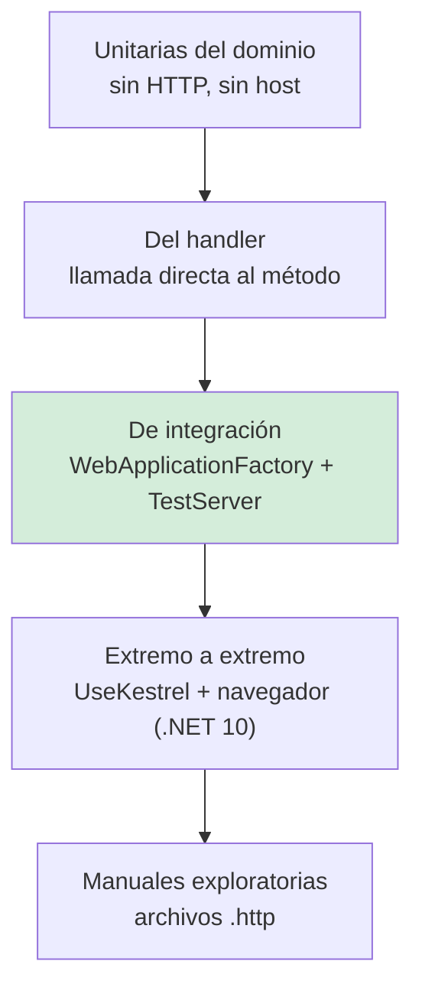

# Pruebas de API — `TEM-PRUEBAS`

## Resumen ejecutivo

`MARCO-ACTORES` describe el punto más descuidado de este dominio con precisión: *«Un endpoint que devuelve `500` ante una entrada inválida está mal aunque el camino feliz funcione perfecto, y ese defecto solo aparece si alguien lo busca.»* La observación de `ACT-04` organiza este documento. Las pruebas de una API que solo verifican el camino feliz dan una sensación de cobertura que no se corresponde con nada: el camino feliz es el que se ejercita a mano cien veces durante el desarrollo, y los caminos de error son los que nadie recorre hasta que un consumidor los encuentra en producción.

La herramienta de primera parte es `WebApplicationFactory<TEntryPoint>`, del paquete `Microsoft.AspNetCore.Mvc.Testing`, que levanta la aplicación completa en memoria sobre un `TestServer` (`N-55`). En .NET 10 ganó capacidades nuevas —`UseKestrel()` y `StartServer()`— que le permiten **bindear un puerto real** y habilitan pruebas dirigidas por navegador, no solo peticiones en memoria (`N-56`).

Este documento trata qué se prueba en cada nivel, cómo se prueban los caminos de error, cómo se manejan los datos de prueba y qué papel cumplen los archivos `.http`. Las **pruebas de contrato** contra la especificación OpenAPI las trata [`TEM-CLIENTES`](../60-Especificacion-y-Documentacion/Generacion-de-Clientes-y-Pruebas-de-Contrato.md).

---

## Definición

**Probar una API** es verificar que lo que responde coincide con lo que su contrato declara, en todos los caminos declarados y en los que no se declararon.

La segunda mitad de esa frase es la que distingue este tema de las pruebas de software en general. Los defectos de contrato más caros están en lo que la especificación **no** dice: qué pasa con un campo de más, con un valor de enumerado desconocido, con una petición concurrente sobre el mismo recurso. `MARCO-ACTORES` lo señala como el lugar donde `ACT-04` falla con más frecuencia —probar solo lo que la especificación declara— y es también donde más rinde el esfuerzo.

### Qué NO es

**No son pruebas de contrato.** Verificar que la respuesta real coincide con el esquema publicado, campo por campo, y detectar la divergencia entre especificación e implementación, lo trata [`TEM-CLIENTES`](../60-Especificacion-y-Documentacion/Generacion-de-Clientes-y-Pruebas-de-Contrato.md). Son complementarias: las de este documento verifican comportamiento, las de aquel verifican conformidad con el documento.

**No son pruebas de carga.** El comportamiento bajo concurrencia sí aparece acá, porque las condiciones de carrera producen respuestas incorrectas y no solo lentas.

**No son pruebas del dominio.** Que la regla de las 24 horas de antelación esté bien implementada se prueba en una prueba unitaria del dominio, sin HTTP. Lo que se prueba acá es que esa regla, al violarse, produce un `409` con el cuerpo correcto.

**No es cobertura de líneas.** Una API con 90 % de cobertura y ningún caso de error probado está peor que una con 40 % que los cubra. La métrica útil es la del anexo de [`TEM-VALID`](Validacion.md): cuántas de las fallas declaradas en el mapa de fallas tienen una prueba.

---

## Qué se prueba en cada nivel



### Unitarias del dominio

Las reglas de negocio, sin host y sin HTTP. Solapamiento de horarios, capacidad de la sala, plazo de cancelación. Rápidas, numerosas, y sin ninguna relación con este documento salvo por una condición: **el dominio no debe devolver códigos HTTP**, y si lo hace, estas pruebas van a tener que conocerlos, que es la señal de que el acoplamiento existe.

### Del handler

Llamar directamente al método del handler o de la acción, con dobles de las dependencias. Es el nivel donde `TypedResults` paga su verbosidad: el tipo de retorno concreto se puede afirmar sin convertir. `N-26` lo declara como una de sus ventajas —*«which can improve code readability, unit testing, and reduce the chance of runtime errors»*— y es la diferencia práctica con `Results`, cuyos ayudantes devuelven `IResult` y obligan a una conversión para llegar al tipo concreto.

Su límite es importante y se subestima: **este nivel no ejercita el pipeline**. No pasa por el model binding, ni por la validación, ni por la serialización, ni por el middleware de errores. Un handler que devuelve el objeto correcto puede producir un JSON incorrecto, y esta prueba no lo detecta.

### De integración con `WebApplicationFactory`

Es el nivel principal para una API y donde debe estar el grueso del esfuerzo. Ejercita el pipeline completo: ruteo, model binding, validación, autorización, serialización y manejo de errores. Lo único que no ejercita es la pila de red real.

Es el único nivel donde se pueden verificar las cosas que este documento y los anteriores señalan como fuentes silenciosas de defectos: que la política de nombres del JSON sea la esperada, que el cuerpo de error tenga la forma acordada, que un endpoint migrado de controller a Minimal API siga serializando igual, que la validación efectivamente ocurra.

### Extremo a extremo

En .NET 10, `WebApplicationFactory` puede bindear un puerto real con `UseKestrel()`, lo que habilita clientes externos y navegadores. El artículo de pruebas de integración recomienda **Playwright for .NET** para probar SPAs (`N-55`). Para una API pura este nivel rara vez se justifica; para verificar el consumo desde Blazor WebAssembly, incluida la configuración de CORS, sí.

### Manuales exploratorias

Los archivos `.http`. No sustituyen a las automatizadas y cumplen otra función: sondear, documentar peticiones de ejemplo y dar un punto de partida a quien se integra. Son el instrumento principal de `ESC-4b`.

---

## `WebApplicationFactory`

Paquete **`Microsoft.AspNetCore.Mvc.Testing`**, versión **10.0.0** para .NET 10 (`N-55`).

`WebApplicationFactory<TEntryPoint>` crea un `Microsoft.AspNetCore.TestHost.TestServer`. *«`TEntryPoint` is the entry point class of the SUT, usually `Program.cs`.»*

**En .NET 10 la clase implementa `IAsyncDisposable` además de `IDisposable`** (`N-56`); en monikers anteriores solo `IDisposable`. Con `xUnit`, eso significa `IAsyncLifetime` en lugar de `IDisposable` en las clases de fixture.

`CreateClient()` *«Creates an instance of `HttpClient` that automatically follows redirects and handles cookies»*. Hay una sobrecarga con `WebApplicationFactoryClientOptions`, y `AllowAutoRedirect = false` es la opción que hace falta cuando lo que se prueba es precisamente el redirect.

Los servicios se sustituyen con `WithWebHostBuilder(Action<IWebHostBuilder>)` combinado con `ConfigureTestServices(...)`.

**El gotcha de orden, verbatim:** *«The test app's `builder.ConfigureServices` callback is executed **after** the app's `Program.cs` code is executed.»* Todo registro de la aplicación ya ocurrió cuando corre el callback de la prueba, de modo que para reemplazar un servicio hay que quitar el registro previo, no solo agregar el propio.

El content root se descubre con `WebApplicationFactoryContentRootAttribute`, con un respaldo que busca un archivo `.sln`.

### La accesibilidad de `Program`

El requisito documentado sigue siendo `public partial class Program { }` —o `InternalsVisibleTo`— y los top-level statements funcionan como `TEntryPoint`.

Vale una advertencia expresa. Circula la afirmación de que .NET 10 incluye un *source generator* que hace público el `Program` de los top-level statements para `WebApplicationFactory`. **No se pudo verificar de primera mano**: las release notes de ASP.NET Core 10 no tienen sección de pruebas y el texto del artículo de integración no contiene ninguna mención al respecto. **Hasta que se confirme, corresponde seguir escribiendo `public partial class Program { }`.**

Tampoco existe evidencia de un paquete nuevo llamado `Microsoft.AspNetCore.Testing`; el paquete soportado sigue siendo `Microsoft.AspNetCore.Mvc.Testing`.

### Las novedades de .NET 10

Verificadas en la lista de miembros de la referencia de API bajo el moniker 10.0 (`N-56`):

| Miembro | Nota |
|---|---|
| `UseKestrel()` | *«Configures the factory to use Kestrel as the server.»* |
| `UseKestrel(int port)` | Sobrecarga con puerto |
| `UseKestrel(Action<KestrelServerOptions>)` | Sobrecarga con opciones |
| `StartServer()` | *«Initializes the instance by configurating the host builder.»* Levanta el servidor sin crear cliente |
| `CreateServer(IWebHostBuilder)` | **Marcado obsoleto** en los monikers 10.0 y 11.0 |

El titular es que `WebApplicationFactory` deja de estar limitado a peticiones en memoria: con un puerto real, un navegador o un cliente externo puede alcanzar la aplicación bajo prueba.

---

## Las pruebas de los caminos de error

Es el corazón del documento. La batería mínima por operación sale del mapa de fallas del anexo de [`TEM-VALID`](Validacion.md), y a esos casos hay que agregar los que **la especificación no declara**, que son los que producen los defectos caros.

### Los que sí están declarados

Uno por cada fila del mapa de fallas: campo obligatorio ausente, valor fuera de rango, incoherencia entre campos, recurso inexistente, conflicto de negocio, falta de autorización. Cada uno verifica el código de estado **y la forma del cuerpo**, no solo el código.

### Los que no están declarados y hay que probar igual

Ocho casos que rara vez figuran en ninguna especificación y que producen los hallazgos más frecuentes:

**JSON malformado.** Un cuerpo que no parsea. Debe producir `400`. Un `500` acá es el defecto más habitual y significa que nadie recorrió el camino.

**Cuerpo vacío en una operación que lo requiere.** Debe producir `400`, no una excepción de referencia nula.

**Campo de más.** Con la configuración por defecto se ignora, porque `JsonSerializerDefaults.Web` no rechaza propiedades no mapeadas. Probarlo documenta la tolerancia, que es contrato aunque no esté escrito. Si la API adopta `JsonSerializerOptions.Strict` de .NET 10, esta prueba es la que detecta que el comportamiento cambió.

**Valor de enumerado desconocido.** El caso que `TEM-BREAK` señala como cambio rompiente silencioso. Hay que saber qué hace la API cuando recibe `"estado": "Reprogramada"` y ese valor no existe.

**Número entre comillas.** Con `JsonSerializerDefaults.Web` se acepta (`N-39`). Es contrato efectivo no declarado, y la prueba lo fija.

**Nombre de campo con capitalización distinta.** También se acepta por defecto. Misma lógica.

**Content-Type incorrecto o ausente.** Debe producir `415`, no `500` ni `400`.

**Peticiones concurrentes sobre el mismo recurso.** Dos reservas simultáneas para la misma sala y el mismo período. Es el caso donde la validación en la capa de aplicación no alcanza y la integridad la garantiza la base de datos. La prueba verifica que **una** de las dos gane y que la otra reciba `409`, no que ambas fallen ni que ambas pasen. Se relaciona con [`TEM-IDEM`](../30-Semantica-HTTP/Idempotencia-y-Concurrencia.md).

### Y uno estructural

**Que el conjunto de rutas registradas sea el esperado.** Es la prueba que detecta el cambio rompiente que [`TEM-PROYECTO`](Organizacion-del-Proyecto-API.md) describe: una reorganización de `MapGroup` que altera un prefijo elimina todas las URIs de ese grupo, y no hay ninguna prueba funcional que lo note si las pruebas construyen sus URLs a partir de constantes compartidas con el código de producción.

---

## Datos de prueba

Tres decisiones, y la primera es la que más determina la utilidad del conjunto.

**Qué se sustituye.** La regla operativa: sustituir lo que no se controla —proveedores externos, reloj, generadores de identificadores— y **no** sustituir lo que forma parte de lo que se prueba. Sustituir el repositorio por un doble en una prueba de integración deja sin probar precisamente la traducción que más falla: la consulta, la proyección al DTO y las restricciones de integridad.

**Aislamiento entre pruebas.** Cada prueba debe poder correr sola y en cualquier orden. Las dos estrategias que funcionan son una base por clase de prueba, o una transacción por prueba que se revierte al terminar. Compartir estado entre pruebas produce fallos que dependen del orden y que nadie logra reproducir.

**Cómo se construyen los datos.** Constructores con valores por defecto razonables, donde cada prueba fija solo lo que le importa. Una prueba que declara doce campos para verificar uno esconde su propia intención.

Sobre el reloj: el dominio de reserva de salas tiene reglas dependientes del tiempo —la cancelación con 24 horas de antelación— y probarlas con `DateTimeOffset.Now` produce pruebas que fallan según la hora del día en que corran. Una abstracción del tiempo inyectada es la única forma de que ese caso sea determinista.

---

## Archivos `.http`

**`dotnet new webapi` sí genera un archivo `.http`**, verificado en el código fuente de la plantilla y no solo en la documentación (`N-66`):

```http
@Company.WebApplication1_HostAddress = http://localhost:5000

GET {{Company.WebApplication1_HostAddress}}/weatherforecast/
Accept: application/json

###
```

**Un matiz de alcance que conviene declarar** (`N-57`): el artículo se titula *«Use `.http` files in Visual Studio 2022»* y requiere VS 2022 17.8 o superior. La documentación reconoce el origen: *«The `.http` file format and editor was inspired by the Visual Studio Code REST Client extension.»* La extensión `.rest` se reconoce como alternativa.

Y hay funcionalidades que existen **solo** en la extensión de VS Code y **no** están soportadas en Visual Studio: peticiones GraphQL, copiar y pegar cURL, historial de peticiones, guardar el cuerpo de la respuesta a un archivo, autenticación por certificado, variables de prompt y líneas de petición multilínea. Un `.http` escrito para VS Code puede no funcionar en Visual Studio.

Lo verificado y disponible: separadores `###`, variables `@var=value`, entornos vía `http-client.env.json`, el entorno `$shared`, `http-client.env.json.user` —con precedencia archivo `.http` > `.user` > `http-client.env.json`—, variables de petición (`# @name login` y luego `{{login.response.body.$.token}}`), proveedores de secretos `AspnetUserSecrets`, `AzureKeyVault` y `Encrypted` (DPAPI), y las variables `$processEnv`, `$dotenv`, `$randomInt`, `$datetime`, `$localDatetime` y `$timestamp`. El **Endpoints Explorer** está en `View > Other Windows > Endpoints Explorer`, con `Generate Request` en el menú contextual.

El criterio de esta guía sobre para qué sirven: **un `.http` es documentación ejecutable, no una prueba**. Su valor está en incluir los casos de error junto a los del camino feliz, de modo que quien se integra vea, en el mismo archivo, qué devuelve la API cuando algo sale mal. Es el artefacto que más rinde en `CTX-1` y en `ESC-4b`, y el que menos se mantiene.

---

## Aplicación por escenario

### `ESC-1` — API nueva

Las pruebas de integración se escriben junto con el primer endpoint, y el motivo no es la disciplina sino que el andamiaje —la fixture, la base de prueba, el cliente autenticado— cuesta el mismo trabajo con un endpoint que con cuarenta, y con cuarenta ya no se hace.

La decisión propia del escenario: **el mapa de fallas se escribe antes que el endpoint, y cada fila genera una prueba**. Es lo que convierte «probamos los errores» en algo verificable.

Lo que conviene no hacer, por la trampa declarada del escenario: construir un framework propio de pruebas de API antes de tener veinte endpoints.

### `ESC-2` — Exposición o migración

En la variante de migración existe la técnica más valiosa del escenario y la que menos se usa: **probar ambas implementaciones con las mismas peticiones y comparar las respuestas**. Mientras las dos coexistan, es la forma más barata de descubrir que la migración cambió algo que se creía idéntico —un campo que ahora se omite cuando es nulo, un enum que pasó de número a string, una fecha que perdió el desplazamiento—.

En la variante de exposición de un sistema existente, la dificultad es de datos: el sistema de respaldo suele ser una base heredada que no se puede recrear desde cero para cada prueba. La salida practicable es un subconjunto congelado y anonimizado, con la contrapartida declarada de que las pruebas quedan atadas a datos que alguien tiene que mantener.

### `ESC-3` — Evolución en producción

El objetivo de las pruebas cambia: dejan de verificar que la API funciona y pasan a verificar que **sigue funcionando igual**. Las tres que importan:

**Pruebas de no regresión de forma.** Que la respuesta de cada endpoint conserve exactamente los mismos campos con los mismos nombres y tipos. Es lo que detecta que alguien cambió una opción de serialización global o agregó un campo a una entidad que se estaba serializando.

**La prueba de rutas registradas.** Detecta el cambio rompiente por reorganización de grupos.

**Pruebas por versión.** Cuando conviven dos versiones de la API, cada una necesita su conjunto. La versión vieja es la que nadie mira y la que más fácilmente se rompe con un cambio pensado para la nueva.

El caso peligroso propio del escenario: endurecer una validación. La prueba que hay que agregar **antes** de endurecer no es la de la regla nueva sino la que mide cuántas peticiones reales la violarían, y esa no es una prueba sino telemetría.

### `ESC-4` — Evaluación de una API ajena

**`ESC-4a`**, con acceso al código: lo primero es mirar si existen pruebas de los caminos de error. Un proyecto con muchas pruebas del camino feliz y ninguna de error predice `500` ante entrada inválida, y es una predicción que se cumple con frecuencia. La segunda señal es si las pruebas de integración sustituyen el repositorio: si lo sustituyen, la traducción entre el modelo interno y el contrato está sin probar.

**`ESC-4b`**, desde afuera: las pruebas **son** el trabajo. `MARCO-ACTORES` lo dice: la caracterización de una API sin documentación es esencialmente prueba exploratoria, y `ACT-04` es el actor principal.

La batería es la de los ocho casos no declarados de más arriba, aplicada a cada operación observada. El artefacto de salida es un documento del contrato observado con nivel de confianza por operación, y los archivos `.http` son el registro natural de cómo se llegó a él.

El límite ético y legal de `ESC-4b` aplica de lleno acá: sondear una API ajena solo es legítimo con autorización, dentro de los términos de servicio y sin exceder los límites de uso publicados. Enumerar identificadores para descubrir el modelo de datos no es prueba exploratoria.

### Qué cambia según el contexto

| Contexto | Qué pesa en las pruebas |
|---|---|
| `CTX-1` pública | Las pruebas de no regresión de forma son obligatorias: cualquier cambio de forma es rompiente y no hay forma de coordinarlo. Los casos no declarados —número entre comillas, campo de más— fijan el contrato efectivo que el consumidor ya está usando. |
| `CTX-2` interna | Se puede probar menos y confiar más, porque un defecto se corrige coordinando. Lo que no conviene relajar son los caminos de error: un `500` inesperado dispara los reintentos del consumidor y convierte un fallo en una tormenta. |
| `CTX-3` app propia | Con Blazor interactive server el consumo es servidor a servidor y la prueba de integración cubre casi todo. Con MAUI hay versiones viejas en circulación: hace falta probar **la versión de la API que esos clientes usan**, no solo la actual. |
| `CTX-4` integración | Se prueba el **cliente**, no la API. Lo que se verifica es que la capa de aislamiento traduce correctamente lo que el proveedor devuelve, incluidas sus respuestas de error y las malformadas, que en `CTX-4` son frecuentes. |

---

## Ejemplos concretos

Sintéticos, del dominio de reserva de salas. Tipos y paquetes verificados en `N-55`, `N-56` y `N-57`.

### La fixture

```csharp
// Sintético. Paquete Microsoft.AspNetCore.Mvc.Testing 10.0.0 (N-55).
// En .NET 10 WebApplicationFactory implementa IAsyncDisposable además de IDisposable (N-56).
public sealed class FabricaDeApiDeSalas : WebApplicationFactory<Program>, IAsyncLifetime
{
    private readonly string _nombreDeBase = $"salas_pruebas_{Guid.NewGuid():N}";

    protected override void ConfigureWebHost(IWebHostBuilder builder)
    {
        builder.UseEnvironment("Testing");

        // El callback de la prueba corre DESPUÉS del Program.cs de la app (N-55):
        // para reemplazar un servicio hay que quitar el registro previo.
        builder.ConfigureTestServices(servicios =>
        {
            servicios.RemoveAll<DbContextOptions<ContextoDeSalas>>();
            servicios.AddDbContext<ContextoDeSalas>(o => o.UseNpgsql(CadenaDeConexionDePrueba));

            // Lo que NO se controla sí se sustituye: reloj y proveedor externo.
            servicios.RemoveAll<IRelojDelSistema>();
            servicios.AddSingleton<IRelojDelSistema>(new RelojFijo(
                new DateTimeOffset(2026, 8, 15, 9, 0, 0, TimeSpan.FromHours(-3))));

            servicios.RemoveAll<IPasarelaDePagos>();
            servicios.AddSingleton<IPasarelaDePagos, PasarelaDePagosFalsa>();
        });
    }

    public HttpClient CrearClienteAutenticado(string rol = "empleado")
    {
        var cliente = CreateClient(new WebApplicationFactoryClientOptions
        {
            AllowAutoRedirect = false   // lo que se prueba es la respuesta, no el redirect
        });
        cliente.DefaultRequestHeaders.Authorization =
            new AuthenticationHeaderValue("Bearer", TokenDePrueba.Para(rol));
        return cliente;
    }

    public async Task InitializeAsync() => await SembrarDatosBaseAsync();
    async Task IAsyncLifetime.DisposeAsync() => await BorrarBaseAsync();
}
```

Nótese que el repositorio **no** se sustituye: se apunta a una base real de prueba. Sustituirlo dejaría sin probar la proyección al DTO y las restricciones de integridad, que es donde aparecen los defectos.

### Camino feliz — y qué se verifica de más

```csharp
[Fact]
public async Task Crear_reserva_valida_devuelve_201_con_Location_y_la_forma_acordada()
{
    var cliente = _fabrica.CrearClienteAutenticado();

    var respuesta = await cliente.PostAsJsonAsync("/v1/reservas", new
    {
        salaId = SalasDePrueba.AulaMagna,
        inicio = "2026-08-20T14:00:00-03:00",
        fin    = "2026-08-20T16:00:00-03:00",
        asistentesPrevistos = 12
    });

    Assert.Equal(HttpStatusCode.Created, respuesta.StatusCode);
    Assert.NotNull(respuesta.Headers.Location);

    // La forma del JSON es contrato: se verifica el JSON crudo, no el objeto deserializado.
    // Deserializar a un tipo propio esconde exactamente los defectos que importan.
    using var documento = JsonDocument.Parse(await respuesta.Content.ReadAsStringAsync());
    var raiz = documento.RootElement;

    Assert.True(raiz.TryGetProperty("id", out _));                    // camelCase
    Assert.True(raiz.TryGetProperty("estado", out var estado));
    Assert.Equal(JsonValueKind.String, estado.ValueKind);             // enum como string, no número
    Assert.Equal("Confirmada", estado.GetString());
    Assert.Contains("-03:00", raiz.GetProperty("inicio").GetString()); // lleva desplazamiento
}
```

La verificación sobre el JSON crudo no es pedantería. Deserializar la respuesta a un tipo propio del proyecto de pruebas hace que la prueba pase aunque los nombres estén en `PascalCase` y los enums en número, porque `JsonSerializerDefaults.Web` es tolerante en ambas cosas. La prueba que verifica el contrato tiene que mirar el texto.

### Los caminos de error declarados

```csharp
[Fact]
public async Task Fin_anterior_al_inicio_devuelve_400_con_ValidationProblemDetails()
{
    var cliente = _fabrica.CrearClienteAutenticado();

    var respuesta = await cliente.PostAsJsonAsync("/v1/reservas", new
    {
        salaId = SalasDePrueba.AulaMagna,
        inicio = "2026-08-20T16:00:00-03:00",
        fin    = "2026-08-20T14:00:00-03:00",
        asistentesPrevistos = 12
    });

    Assert.Equal(HttpStatusCode.BadRequest, respuesta.StatusCode);
    Assert.Equal("application/problem+json", respuesta.Content.Headers.ContentType?.MediaType);

    var problema = await respuesta.Content.ReadFromJsonAsync<HttpValidationProblemDetails>();
    Assert.Contains("Fin", problema!.Errors.Keys);
}

[Fact]
public async Task Reserva_solapada_devuelve_409_y_no_400()
{
    var cliente = _fabrica.CrearClienteAutenticado();
    var franja = new { salaId = SalasDePrueba.AulaMagna,
                       inicio = "2026-08-21T10:00:00-03:00",
                       fin    = "2026-08-21T12:00:00-03:00",
                       asistentesPrevistos = 5 };

    var primera = await cliente.PostAsJsonAsync("/v1/reservas", franja);
    Assert.Equal(HttpStatusCode.Created, primera.StatusCode);

    var segunda = await cliente.PostAsJsonAsync("/v1/reservas", franja);

    // 409, no 400: la petición era válida, el estado del mundo no lo permite.
    Assert.Equal(HttpStatusCode.Conflict, segunda.StatusCode);
    var problema = await segunda.Content.ReadFromJsonAsync<ProblemDetails>();
    Assert.Equal(409, problema!.Status);
    Assert.True(problema.Extensions.ContainsKey("reservaEnConflicto"));
}

[Fact]
public async Task Cancelar_con_menos_de_24_horas_devuelve_409()
{
    // El reloj está fijado en 2026-08-15 09:00 -03:00 por la fixture:
    // sin reloj inyectado esta prueba fallaría según la hora en que corra.
    var cliente = _fabrica.CrearClienteAutenticado();
    var reservaInminente = await SembrarReservaAsync(inicio: "2026-08-15T18:00:00-03:00");

    var respuesta = await cliente.DeleteAsync($"/v1/reservas/{reservaInminente}");

    Assert.Equal(HttpStatusCode.Conflict, respuesta.StatusCode);
}
```

### Los caminos que la especificación no declara

Esta es la batería que produce los hallazgos.

```csharp
[Fact]
public async Task Json_malformado_devuelve_400_y_no_500()
{
    var cliente = _fabrica.CrearClienteAutenticado();
    var contenido = new StringContent("{ \"salaId\": ", Encoding.UTF8, "application/json");

    var respuesta = await cliente.PostAsync("/v1/reservas", contenido);

    // El defecto más frecuente de este documento: 500 acá significa que nadie lo probó.
    Assert.Equal(HttpStatusCode.BadRequest, respuesta.StatusCode);
}

[Fact]
public async Task Content_Type_ausente_devuelve_415()
{
    var cliente = _fabrica.CrearClienteAutenticado();
    var contenido = new StringContent("{}", Encoding.UTF8);
    contenido.Headers.ContentType = null;

    var respuesta = await cliente.PostAsync("/v1/reservas", contenido);

    Assert.Equal(HttpStatusCode.UnsupportedMediaType, respuesta.StatusCode);
}

[Fact]
public async Task Valor_de_enumerado_desconocido_no_produce_500()
{
    var cliente = _fabrica.CrearClienteAutenticado();

    var respuesta = await cliente.GetAsync("/v1/reservas?estado=Reprogramada");

    // Lo importante no es cuál de los dos: es que esté decidido y documentado.
    Assert.True(respuesta.StatusCode is HttpStatusCode.BadRequest or HttpStatusCode.OK,
        $"Un valor de enumerado desconocido devolvió {(int)respuesta.StatusCode}.");
}

[Fact]
public async Task Numero_entre_comillas_se_acepta_por_JsonSerializerDefaults_Web()
{
    // Contrato efectivo NO declarado en la especificación: implicación de Web (N-39).
    // Esta prueba lo fija; si mañana se adopta JsonSerializerOptions.Strict, falla y avisa.
    var cliente = _fabrica.CrearClienteAutenticado();

    var respuesta = await cliente.PostAsJsonAsync("/v1/reservas", new
    {
        salaId = SalasDePrueba.SalaChica,
        inicio = "2026-08-22T09:00:00-03:00",
        fin    = "2026-08-22T10:00:00-03:00",
        asistentesPrevistos = "4"          // string, no número
    });

    Assert.Equal(HttpStatusCode.Created, respuesta.StatusCode);
}

[Fact]
public async Task Campo_de_mas_se_ignora()
{
    var cliente = _fabrica.CrearClienteAutenticado();

    var respuesta = await cliente.PostAsJsonAsync("/v1/reservas", new
    {
        salaId = SalasDePrueba.SalaChica,
        inicio = "2026-08-23T09:00:00-03:00",
        fin    = "2026-08-23T10:00:00-03:00",
        asistentesPrevistos = 4,
        campoQueNoExiste = "algo"
    });

    Assert.Equal(HttpStatusCode.Created, respuesta.StatusCode);
}
```

### Concurrencia

```csharp
[Fact]
public async Task Dos_reservas_simultaneas_de_la_misma_franja_solo_una_gana()
{
    var cliente = _fabrica.CrearClienteAutenticado();
    var franja = new { salaId = SalasDePrueba.AulaMagna,
                       inicio = "2026-08-25T15:00:00-03:00",
                       fin    = "2026-08-25T17:00:00-03:00",
                       asistentesPrevistos = 8 };

    var respuestas = await Task.WhenAll(
        Enumerable.Range(0, 2).Select(_ => cliente.PostAsJsonAsync("/v1/reservas", franja)));

    // La validación en la capa de aplicación no alcanza bajo concurrencia:
    // la integridad la garantiza la restricción de la base (ver TEM-IDEM).
    Assert.Equal(1, respuestas.Count(r => r.StatusCode == HttpStatusCode.Created));
    Assert.Equal(1, respuestas.Count(r => r.StatusCode == HttpStatusCode.Conflict));
    Assert.DoesNotContain(respuestas, r => (int)r.StatusCode >= 500);
}
```

### La prueba de rutas registradas

```csharp
[Fact]
public void La_superficie_de_rutas_no_cambio()
{
    using var ambito = _fabrica.Services.CreateScope();
    var fuente = ambito.ServiceProvider.GetRequiredService<EndpointDataSource>();

    var rutas = fuente.Endpoints
        .OfType<RouteEndpoint>()
        .Select(e => $"{string.Join(",", e.Metadata.GetMetadata<HttpMethodMetadata>()?.HttpMethods ?? [])} /{e.RoutePattern.RawText}")
        .OrderBy(r => r, StringComparer.Ordinal)
        .ToArray();

    // Detecta el cambio rompiente que ninguna prueba funcional nota:
    // una reorganización de MapGroup que altera un prefijo (ver TEM-PROYECTO).
    Assert.Equal(RutasAprobadas.Esperadas, rutas);
}
```

### Un archivo `.http` con los caminos de error

```http
### Sintético — Salas.Api.http
### Los ejemplos de error valen tanto como los del camino feliz:
### son lo que un integrador necesita ver y lo que nadie documenta.

@host = https://localhost:5001
@salaId = a3f1c2d4-0000-4000-8000-000000000001

# @name login
POST {{host}}/v1/sesiones
Content-Type: application/json

{ "usuario": "ana.perez", "clave": "…" }

###

@token = {{login.response.body.$.accessToken}}

### Camino feliz — crear una reserva
POST {{host}}/v1/reservas
Content-Type: application/json
Authorization: Bearer {{token}}

{
  "salaId": "{{salaId}}",
  "inicio": "2026-08-20T14:00:00-03:00",
  "fin": "2026-08-20T16:00:00-03:00",
  "asistentesPrevistos": 12
}

### Error 400 — el fin es anterior al inicio
POST {{host}}/v1/reservas
Content-Type: application/json
Authorization: Bearer {{token}}

{
  "salaId": "{{salaId}}",
  "inicio": "2026-08-20T16:00:00-03:00",
  "fin": "2026-08-20T14:00:00-03:00",
  "asistentesPrevistos": 12
}

### Error 409 — solapamiento: ejecutar dos veces seguidas
POST {{host}}/v1/reservas
Content-Type: application/json
Authorization: Bearer {{token}}

{
  "salaId": "{{salaId}}",
  "inicio": "2026-08-21T10:00:00-03:00",
  "fin": "2026-08-21T12:00:00-03:00",
  "asistentesPrevistos": 5
}

### Error 400 — JSON malformado
POST {{host}}/v1/reservas
Content-Type: application/json
Authorization: Bearer {{token}}

{ "salaId":

### Error 404 — la sala no existe
GET {{host}}/v1/salas/00000000-0000-0000-0000-000000000000/reservas
Authorization: Bearer {{token}}

###
```

Los entornos se declaran aparte, en `http-client.env.json`, y los secretos en `http-client.env.json.user`, que tiene precedencia sobre el primero (`N-57`).

---

## Preguntas guía

- Para cada operación, ¿cuántas de las filas de su mapa de fallas tienen una prueba?
- ¿Qué devuelve mi API ante un cuerpo con JSON malformado? ¿Lo verifiqué o lo supongo?
- Mis pruebas de integración, ¿verifican la forma del JSON o solo deserializan a un tipo propio?
- Si alguien cambia una opción global de serialización, ¿alguna prueba falla?
- Si alguien reorganiza los `MapGroup` y cambia un prefijo, ¿alguna prueba falla?
- ¿Sustituí el repositorio en las pruebas de integración? Si sí, ¿qué quedó sin probar?
- ¿Tengo una prueba que ejecute dos peticiones concurrentes sobre el mismo recurso?
- Si hay clientes MAUI viejos en circulación, ¿pruebo la versión de la API que ellos usan?

---

## Criterios de calidad

Se reconoce un conjunto de pruebas de API bien construido en que **ninguna entrada, por absurda que sea, produce un `500`**, y en que existe una prueba por cada camino de error declarado en el contrato.

Tres señales concretas: las pruebas de integración verifican el JSON crudo y no solo el objeto deserializado; el repositorio no está sustituido; y existe al menos una prueba estructural —rutas registradas o forma de la respuesta— que falla ante cambios que ninguna prueba funcional detecta.

### Antipatrones

**Probar solo el camino feliz.** El defecto central de este documento. El camino feliz es el que se ejercita a mano cien veces durante el desarrollo; los caminos de error son los que nadie recorre hasta producción.

**Deserializar la respuesta a un tipo propio y afirmar sobre él.** La prueba pasa aunque los nombres estén en `PascalCase` y los enums en número, porque el deserializador es tolerante en ambas cosas por defecto. Esconde precisamente los defectos de contrato.

**Sustituir el repositorio en una prueba de integración.** Deja sin probar la proyección al DTO y las restricciones de integridad, que es donde están los defectos que el nivel unitario no puede encontrar.

**Compartir estado entre pruebas.** Produce fallos dependientes del orden que nadie logra reproducir, y termina con alguien marcando la prueba como omitida.

**Probar reglas dependientes del tiempo con el reloj real.** La prueba de la cancelación con 24 horas de antelación falla según la hora en que corra el conjunto.

**Confundir cobertura con verificación de contrato.** Una API con 90 % de cobertura y ningún caso de error probado está peor que una con 40 % que los cubra.

**Un `.http` que solo tiene el camino feliz.** Desperdicia el artefacto: su valor está en mostrarle a quien se integra qué devuelve la API cuando algo sale mal.

**Escribir un `.http` con funcionalidades exclusivas de la extensión de VS Code y esperar que funcione en Visual Studio.** `N-57` lista siete que no están soportadas.

**Seguir usando `CreateServer(IWebHostBuilder)`.** Está marcado obsoleto en los monikers 10.0 y 11.0 (`N-56`).

**Confiar en que .NET 10 hace público el `Program` de top-level statements.** No está verificado. Corresponde escribir `public partial class Program { }`.

**Registrar un servicio de prueba sin quitar el previo.** El callback de la prueba corre después del `Program.cs` de la aplicación (`N-55`): agregar sin quitar deja el registro original en pie.

---

## Anexo — Lista de verificación

Se recorre por operación antes de darla por terminada. `ACT-04` es el actor que decide si se acepta.

```yaml
operacion: "POST /v1/reservas"
version_dotnet: "10.0"
paquete_de_pruebas: "Microsoft.AspNetCore.Mvc.Testing 10.0.0"

niveles:
  unitarias_de_dominio: si | no
  de_handler: si | no
  de_integracion: si | no          # el nivel principal para una API
  extremo_a_extremo: si | no | no_aplica

camino_feliz:
  codigo_de_estado_verificado: si | no
  cabecera_Location_verificada: si | no | no_aplica
  forma_del_json_verificada_en_crudo: si | no
  politica_de_nombres_verificada: si | no
  representacion_de_enums_verificada: si | no
  desplazamiento_horario_verificado: si | no

caminos_de_error_declarados:       # una fila por cada entrada del mapa de fallas de TEM-VALID
  - condicion: ""
    codigo_esperado: 0
    cuerpo_verificado: si | no
    probada: si | no

caminos_no_declarados:
  json_malformado:               probada: si | no    # debe dar 400, nunca 500
  cuerpo_vacio:                  probada: si | no
  campo_de_mas:                  probada: si | no
  enum_desconocido:              probada: si | no
  numero_entre_comillas:         probada: si | no    # implicación de Web (N-39)
  capitalizacion_distinta:       probada: si | no    # implicación de Web (N-39)
  content_type_incorrecto:       probada: si | no    # debe dar 415
  peticiones_concurrentes:       probada: si | no

estructurales:
  prueba_de_rutas_registradas: si | no
  lista_de_rutas_aprobada: ""
  prueba_de_no_regresion_de_forma: si | no           # obligatoria en CTX-1

datos:
  repositorio_sustituido: si | no                    # debería ser "no"
  reloj_inyectado: si | no                           # obligatorio si hay reglas temporales
  aislamiento: base_por_clase | transaccion | ninguno
  proveedores_externos_sustituidos: si | no

archivo_http:
  existe: si | no
  incluye_casos_de_error: si | no
  entornos_declarados: si | no
  secretos_fuera_del_repositorio: si | no
```

El bloque `caminos_no_declarados` es el que distingue una lista de verificación útil de una decorativa. Es también el bloque que, recorrido sobre una API ajena en `ESC-4b`, produce la caracterización más rápida de su calidad real.
