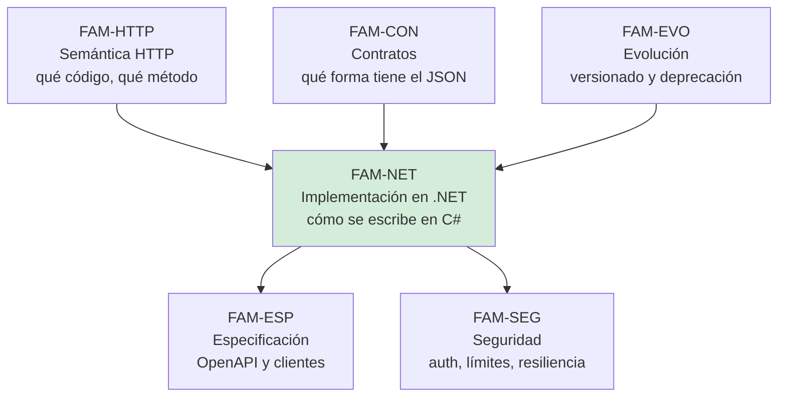

# Implementación en .NET — `FAM-NET`

## Resumen ejecutivo

Las siete familias anteriores decidieron qué contrato HTTP corresponde publicar. Esta responde una sola pregunta: **cómo se lleva ese contrato a código ASP.NET Core sin que el framework decida por uno lo que ya se había decidido**.

La distancia entre ambas cosas es más grande de lo que parece, y el motivo es que ASP.NET Core trae opiniones incorporadas. Serializa en `camelCase` sin que nadie se lo pida, acepta números entre comillas al deserializar, emite `ProblemDetails` con un formato que su propia documentación atribuye a tres RFC distintos, rechaza con `503` cuando se supera un límite de uso, y no genera ninguna interfaz de OpenAPI aunque medio internet siga escribiendo que sí. Cada uno de esos comportamientos es un pedazo de contrato HTTP que alguien fijó antes de que el equipo llegara. Conocerlos es la diferencia entre publicar el contrato que se diseñó y publicar el que el framework produjo por omisión.

La familia le sirve a `ACT-02` cuando escribe el endpoint, a `ACT-01` cuando fija la estructura del proyecto y las opciones globales de serialización, a `ACT-03` cuando construye el cliente, y a `ACT-04` cuando decide qué se prueba y en qué nivel.

---

## La versión de referencia

Todo lo que sigue aplica a **.NET 10**, publicado el 2025-11-11, de tipo **LTS**, con soporte hasta el 2028-11-10 (`N-23`). Es la versión de producción a la fecha de esta revisión y la única razonable para un proyecto nuevo: **.NET 8 y .NET 9 terminan soporte el mismo día, el 2026-11-10**, a cuatro meses de aquí.

.NET 11 está en Preview 6 desde el 2026-07-14 y tiene GA prevista para noviembre de 2026 (`N-67`, `N-69`). Es STS. Los documentos de esta familia lo citan **únicamente como contraste**, cuando un comportamiento por defecto va a cambiar y conviene saberlo antes de migrar; jamás como base de una recomendación. Los tres cambios que más afectan a una API REST son la emisión de OpenAPI 3.2 por defecto, la validación asíncrona en Minimal APIs y la protección CSRF automática.

Toda afirmación de esta familia que dependa de la versión la declara. Una frase como «ASP.NET Core serializa enums como número» sin versión al lado envejece mal y es exactamente el tipo de material que la guía intenta no producir.

---

## Los tres niveles que hay que distinguir

Es la disciplina central de la familia y la que más se pierde en el material sobre .NET. Toda prescripción que aparece en estos seis documentos está clasificada en uno de tres niveles, y el nivel se hace explícito en el texto:

| Nivel | Qué es | Ejemplo de esta familia |
|---|---|---|
| **(a) Prescripción normativa** | Microsoft lo prescribe en documentación oficial, con verbo prescriptivo | *«For new projects, we recommend using Minimal APIs»* (`N-24`); *«Returning `TypedResults` is preferred to returning `Results`»* (`N-26`) |
| **(b) Default de plantilla** | Es lo que genera `dotnet new`, y nada más | `AddOpenApi()` + `MapOpenApi()` dentro de `IsDevelopment()`, sin UI; namespaces file-scoped; `WeatherForecast` (`N-66`) |
| **(c) Convención de comunidad** | Práctica difundida sin respaldo oficial de Microsoft | Carpetas `Endpoints/`, `Services/`, `DTOs/`; Clean Architecture; Vertical Slice; FluentValidation; elegir Scalar sobre Swagger UI |

Confundir (b) con (a) produce el argumento de autoridad más frecuente del ecosistema: «la plantilla lo hace así, entonces es lo correcto». La plantilla de `dotnet new webapi` pone todos los endpoints en `Program.cs` y devuelve un pronóstico del tiempo aleatorio; nadie sostiene que eso sea prescripción arquitectónica. Y confundir (c) con (a) produce el inverso: presentar como oficial una estructura de carpetas que **ninguna plantilla ni documento normativo de Microsoft respalda** (`N-66`).

El nivel (c) no es un demérito. Buena parte de lo que conviene hacer en un proyecto real es convención de comunidad, y esta guía la recomienda cuando corresponde. Lo que no corresponde es venderla como norma.

---

## Los documentos

| Documento | ID | Qué responde |
|---|---|---|
| [Minimal APIs y controllers](Minimal-APIs-y-Controllers.md) | `TEM-MINIMAL` | Los dos modelos, la recomendación oficial de Microsoft, qué contrato HTTP permite expresar cada uno, `MapGroup`, `TypedResults`, endpoint filters, *model binding* y los criterios reales de elección |
| [Organización del proyecto API](Organizacion-del-Proyecto-API.md) | `TEM-PROYECTO` | Dónde viven los endpoints, agrupación por recurso frente a por caso de uso, la composición de `Program.cs`, la extensión por módulos, y qué genera realmente `dotnet new webapi` hoy |
| [Serialización y modelos](Serializacion-y-Modelos.md) | `TEM-SERIAL` | System.Text.Json en ASP.NET Core: los dos tipos `JsonOptions`, `JsonSerializerDefaults.Web` y sus cuatro implicaciones, source generation, enums, nulos, fechas; DTOs frente a entidades |
| [Validación](Validacion.md) | `TEM-VALID` | DataAnnotations, la validación nativa de .NET 10 y por qué no llegó a MVC, FluentValidation, dónde valida cada capa y cómo se traduce una falla al contrato HTTP |
| [Consumo desde Blazor y MAUI](Consumo-desde-Blazor-y-MAUI.md) | `TEM-CONSUMO` | `IHttpClientFactory`, typed clients, y las particularidades de cada anfitrión: Blazor interactive server, Blazor WebAssembly, MVC y MAUI con MVVM; generación de clientes con Kiota y Refit |
| [Pruebas de API](Pruebas-de-API.md) | `TEM-PRUEBAS` | `WebApplicationFactory`, qué se prueba en cada nivel, las pruebas de los caminos de error, archivos `.http` y datos de prueba |

El orden de lectura sugerido es el de la tabla. `TEM-MINIMAL` fija el vocabulario del que dependen los cinco siguientes; `TEM-CONSUMO` y `TEM-PRUEBAS` se pueden leer sueltos.

---

## Relación con las demás familias

Esta familia **implementa** decisiones que se tomaron en otra parte y no las vuelve a discutir. El mapa de responsabilidades es el siguiente:

Las fronteras concretas, para que nadie busque acá lo que está en otro lado:

- La **configuración de OpenAPI** en ASP.NET Core —`AddOpenApi`, `MapOpenApi`, transformers, generación en build time, versión de OAS emitida— la trata [`TEM-OPENAPI`](../60-Especificacion-y-Documentacion/OpenAPI.md). Acá solo aparece cuando explica por qué `TypedResults` es preferible o qué trae la plantilla.
- El **rate limiting** y la **autenticación JWT** los trata [`FAM-SEG`](../70-Seguridad-y-Robustez/), en [`TEM-PROT`](../70-Seguridad-y-Robustez/Proteccion-de-la-Superficie.md) y [`TEM-AUTH`](../70-Seguridad-y-Robustez/Autenticacion-y-Autorizacion.md). Acá solo se menciona el orden del middleware cuando afecta a la composición de `Program.cs`.
- La **resiliencia del consumidor** —`AddStandardResilienceHandler`, reintentos, circuit breaker— la trata [`TEM-RESIL`](../70-Seguridad-y-Robustez/Resiliencia-y-Reintentos.md). [`TEM-CONSUMO`](Consumo-desde-Blazor-y-MAUI.md) trata el andamiaje: `IHttpClientFactory`, typed clients y las particularidades de cada anfitrión.
- Las **pruebas de contrato** contra la especificación OpenAPI las trata [`TEM-CLIENTES`](../60-Especificacion-y-Documentacion/Generacion-de-Clientes-y-Pruebas-de-Contrato.md). [`TEM-PRUEBAS`](Pruebas-de-API.md) trata las pruebas de la API en general.
- El **formato de los errores** —qué campos lleva, cómo se documenta, qué se filtra— lo trata [`TEM-ERR`](../40-Contratos-y-Representaciones/Manejo-de-Errores.md). Acá aparece la mecánica de `ProblemDetails` solo en la medida en que la traducción de una falla de validación al contrato HTTP la exige.
- El **versionado** lo trata [`TEM-VERS`](../50-Evolucion-y-Versionado/Estrategias-de-Versionado.md), incluida la familia `Asp.Versioning` (`F-09`) y el hecho de que **no es un producto de Microsoft** pese a vivir en `github.com/dotnet/`.

Hay además una frontera con la guía hermana de código. [`TEM-ENDP`](../../Organizacion-Estilo-Patrones-Codigo/60-Patrones-de-Codigo/Patrones-de-Endpoint.md) trata Minimal APIs frente a controllers desde la óptica de la organización del código; [`TEM-MINIMAL`](Minimal-APIs-y-Controllers.md) vuelve sobre el mismo mecanismo desde la óptica del contrato HTTP que cada opción permite expresar. La duplicación es deliberada y está declarada en [`MARCO-CONVENCIONES`](../00-Marco-de-Referencia/Convenciones.md).

---

## Los hallazgos que gobiernan la familia

Siete hechos verificados contradicen la creencia habitual y aparecen repetidamente en estos documentos. Conviene tenerlos presentes desde el principio porque reorganizan buena parte de lo que se enseña sobre APIs en .NET:

1. **Microsoft recomienda normativamente Minimal APIs para proyectos nuevos** (`N-24`). Los títulos de sección de la documentación oficial dicen literalmente *«Recommended for new projects»* y *«Alternative approach»*. La creencia inversa —Minimal para demos, controllers para producción— es la que hay que desarmar.
2. **La validación nativa de .NET 10 llegó a Minimal APIs y Blazor, y explícitamente no a MVC** (`N-35`). Invierte la otra mitad de la creencia anterior.
3. **ASP.NET Core no implementa RFC 9457** y su propia documentación se contradice: bajo el mismo moniker `aspnetcore-10.0` conviven citas a RFC 7807, RFC 9457 y RFC 9110. El issue de adopción (`N-63`) sigue abierto en Backlog, sin ramas ni pull requests.
4. **Las plantillas de .NET 10 no traen ninguna UI de OpenAPI** — ni Swagger UI ni Scalar (`N-33`, `N-66`). Solo `AddOpenApi()` y `MapOpenApi()` dentro de `IsDevelopment()`.
5. **El `camelCase` es un default de ASP.NET Core, no de System.Text.Json** (`N-37`, `N-38`), y `JsonSerializerDefaults.Web` implica cuatro cosas, no una (`N-39`).
6. **El rate limiter nativo rechaza con `503`, no con `429`** (`N-43`). Se detalla en `TEM-PROT`, pero conviene saberlo desde acá porque es el ejemplo más nítido de default que rompe un contrato bien diseñado.
7. **`Asp.Versioning` no es un producto de Microsoft** pese a residir en `github.com/dotnet/` (`F-09`, `F-10`). Está activo, soporta .NET 10 y lo mantiene alguien que nunca fue del equipo de ASP.NET.

---

## Preguntas guía de la familia

- ¿Qué parte del contrato que publico la decidí yo y qué parte la decidió un default del framework?
- Si mañana cambio de Minimal APIs a controllers, ¿qué cambia en el cable y qué solo cambia en el código?
- ¿A qué versión de .NET aplica cada afirmación que estoy siguiendo, y de dónde salió?
- Lo que estoy por adoptar, ¿es prescripción de Microsoft, default de una plantilla o costumbre del ecosistema?
- ¿Mis pruebas cubren los caminos de error, o solo el camino feliz?
