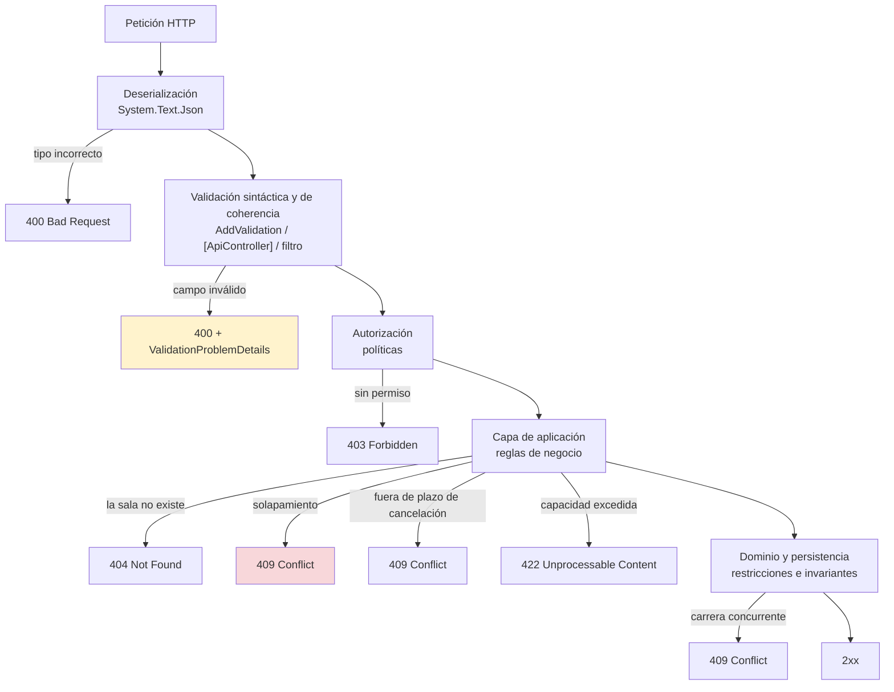

# Validación — `TEM-VALID`

## Resumen ejecutivo

.NET 10 introdujo `Microsoft.Extensions.Validation`, una validación por *source generator* que se activa con una línea. Tiene soporte integrado en **Minimal APIs y Blazor**, y la documentación es explícita sobre dónde no lo tiene: *«It's not supported by default in MVC»* (`N-35`). Esto invierte la creencia habitual de que los controllers tienen la validación buena y las Minimal APIs no tienen nada, y deja obsoleta la instrucción de la guía de migración de Microsoft que todavía dice *«Replace model validation with manual validation or custom binding»*.

La otra mitad del documento trata una pregunta que ninguna biblioteca responde: **qué código de estado corresponde a cada falla**. Un formato de fecha mal escrito, un campo obligatorio ausente, una sala que no existe, una reserva que se solapa con otra y una cancelación fuera del plazo de 24 horas son cinco fallas distintas, y devolver `400` a las cinco es tan incorrecto como devolver `500`. La validación técnica y la validación de reglas de negocio ocupan capas distintas y producen respuestas distintas.

Le sirve a `ACT-02` cuando decide qué devuelve cada camino de fallo, a `ACT-04` porque los caminos de error son el punto que menos se prueba, y a `ACT-05` porque las reglas de negocio que la API aplica son suyas y tienen que llegar al contrato con su significado intacto.

---

## Definición

**Validar** es determinar si una petición puede procesarse antes de procesarla, y traducir la negativa a una respuesta HTTP que el consumidor pueda entender y actuar.

La definición tiene dos mitades y las dos importan. La primera es la que las bibliotecas resuelven; la segunda —la traducción al contrato— es donde se pierde la mayor parte del valor, porque una validación impecable que devuelve `500 Internal Server Error` no sirve de nada.

### Los cuatro niveles

Conviene tenerlos separados porque cada uno falla distinto y responde distinto:

| Nivel | Qué verifica | Ejemplo del dominio | Respuesta |
|---|---|---|---|
| **Deserialización** | Que el cuerpo sea JSON válido y los tipos coincidan | `"inicio": "mañana"` en un `DateTimeOffset` | `400` |
| **Sintáctica** | Formato, rango, longitud, obligatoriedad de un campo aislado | `asistentesPrevistos: -3` | `400` |
| **De coherencia** | Relaciones entre campos de la misma petición | `fin` anterior a `inicio` | `400` |
| **De negocio** | Reglas que dependen del estado del sistema | La sala ya está reservada en ese período | `409`, `404`, `422` según el caso |

Los tres primeros son validación de la **petición** y se resuelven en el borde. El cuarto es validación del **dominio** y no puede resolverse ahí, porque requiere consultar el estado. Mezclarlos produce los dos errores simétricos: reglas de negocio implementadas como atributos que necesitan acceso a la base de datos, y validación de formato implementada dentro del servicio de dominio, que entonces tiene que devolver errores de forma.

### Qué NO es

**No es el formato del error.** Qué campos lleva un cuerpo de error, cómo se documenta, cuánta información se puede revelar sin filtrar la estructura interna, lo decide [`TEM-ERR`](../40-Contratos-y-Representaciones/Manejo-de-Errores.md). Acá interesa la mecánica de producirlo.

**No es la elección del código de estado.** La semántica de `400`, `404`, `409` y `422` la fija [`TEM-STATUS`](../30-Semantica-HTTP/Codigos-de-Estado.md) a partir de `N-01`. Acá interesa qué nivel de validación produce cuál.

**No es autorización.** Que el solicitante no tenga permiso para reservar esa sala no es una falla de validación: es `403`, y lo trata [`TEM-AUTH`](../70-Seguridad-y-Robustez/Autenticacion-y-Autorizacion.md). La confusión es frecuente porque ambas cosas rechazan la petición antes de procesarla.

**No es una garantía de integridad.** Validar antes de escribir no elimina la condición de carrera: dos peticiones concurrentes pueden pasar ambas la comprobación de solapamiento y ambas insertar. La integridad la garantiza la base de datos con una restricción, y la validación existe para dar un mensaje decente en el caso normal. Se trata en [`TEM-IDEM`](../30-Semantica-HTTP/Idempotencia-y-Concurrencia.md).

---

## Los tres mecanismos disponibles

### DataAnnotations

Atributos de `System.ComponentModel.DataAnnotations` —`[Required]`, `[Range]`, `[StringLength]`, `[RegularExpression]`— declarados sobre las propiedades del tipo. Es el vocabulario compartido por los tres mecanismos: tanto `[ApiController]` como `Microsoft.Extensions.Validation` los interpretan.

Su límite es estructural: un atributo ve una propiedad. La coherencia entre campos requiere `IValidatableObject` o un atributo a nivel de tipo, y ninguna regla que dependa del estado del sistema cabe ahí.

### `[ApiController]` — la vía de los controllers

`N-36` describe el comportamiento:

> *«The `[ApiController]` attribute makes model validation errors automatically trigger an HTTP 400 response. Consequently, the following code is unnecessary in an action method:»*

```csharp
if (!ModelState.IsValid)
{
    return BadRequest(ModelState);
}
```

Lo implementa `ModelStateInvalidFilter`. El cuerpo por defecto del `400` es un `ValidationProblemDetails`. Se desactiva con `ApiBehaviorOptions.SuppressModelStateInvalidFilter = true` dentro de `AddControllers().ConfigureApiBehaviorOptions(...)`, y el cuerpo se personaliza con `ApiBehaviorOptions.InvalidModelStateResponseFactory`.

Todo `ProblemDetails` y `ValidationProblemDetails` que MVC produce sale de `Microsoft.AspNetCore.Mvc.Infrastructure.ProblemDetailsFactory`, incluidos los de `ControllerBase.Problem` y `ControllerBase.ValidationProblem` (`N-28`). Reemplazarla es el punto único para uniformar el formato:

```csharp
builder.Services.AddTransient<ProblemDetailsFactory, FabricaDeProblemDetailsDeSalas>();
```

### `Microsoft.Extensions.Validation` — la novedad de .NET 10

`N-35`, verbatim: *«In .NET 10, `Microsoft.Extensions.Validation` was introduced to support complex model validation.»* La URL canónica es `/aspnet/core/validation/overview`; conviene saber que `/aspnet/core/fundamentals/minimal-apis/validation` devuelve **HTTP 404**, porque circulan enlaces a esa ruta.

Es **opt-in**, una línea:

```csharp
builder.Services.AddValidation();
```

**Dónde funciona y dónde no** (`N-35`, verbatim):

> *«ASP.NET Core has built-in support for `Microsoft.Extensions.Validation` for both minimal APIs and Blazor scenarios. It's not supported by default in MVC.»*

**Cómo funciona.** Mediante un source generator de Roslyn:

> *«The `Microsoft.Extensions.Validation` package works via a Roslyn source generator that detects the object graph and types for minimal API endpoint parameters. In some cases, not all types that are part of the object graph can be determined at compile time. In these cases, you can force the source generator to consider a type for validation by applying `ValidatableTypeAttribute` to that type.»*

**El pipeline**, en tres clases de entidad:

1. **Parámetro** — se aplican sus `ValidationAttribute`s; si es `IEnumerable`, se validan todos los elementos no nulos.
2. **Tipo** — primero las propiedades, cortando ante el primer error; luego los `ValidationAttribute`s a nivel de tipo, cortando ante error; y por último **`IValidatableObject` si está implementado**, que sí está soportado.
3. **Propiedad** — atributos, y después recursión en los elementos si es `IEnumerable`.

Que `IValidatableObject` esté soportado es el dato operativo más útil: **es donde vive la validación de coherencia entre campos** sin salir del mecanismo.

**Opt-outs.** `SkipValidationAttribute`, aplicable por parámetro, tipo o propiedad; y `.DisableValidation()` por endpoint.

**Limitaciones documentadas.** Los **nullable value types** declarados como parámetros de Minimal API **no se validan** (`N-65`). En Blazor, los tipos de modelo deben estar en un archivo `.cs` y no en un `.razor`, porque *«output of one source generator can't be used as an input for another source generator»*, y el tipo raíz necesita `[ValidatableType]`. Los grafos de objetos no resolubles en compilación requieren también `[ValidatableType]` explícito.

**Movimiento de namespace.** Las release notes de .NET 10 lo registran: *«The validation APIs have moved to the `Microsoft.Extensions.Validation` namespace and NuGet package… The public APIs and behavior remain unchanged—only the package and namespace are different.»* Material previo a .NET 10 que use el namespace anterior sigue siendo válido en comportamiento.

**Lo que no hay que repetir.** Circula la afirmación de que `Microsoft.Extensions.Validation` shippeó como «experimental» en .NET 10. Aparece solo en blogs de terceros y la documentación oficial la contradice: la documenta como shipeada y no experimental. **No debe repetirse.**

**Contraste con .NET 11 (preview, no producción).** Validación asíncrona: `AsyncValidationAttribute` e `IAsyncValidatableObject` (`N-67`). La implicación hacia atrás es la que importa hoy: **la validación de .NET 10 es síncrona**, y por lo tanto una regla que requiera consultar la base de datos no cabe dentro de ella.

### FluentValidation — nivel (c)

Biblioteca de terceros, licencia **Apache-2.0**, versión 12.1.1 publicada el 2025-12-03, 987,1 millones de descargas, repositorio activo (`F-11`).

Dos precisiones sobre rumores que circulan:

**El rumor de que se volvió comercial es falso.** El proyecto que cambió a licencia restrictiva es **Fluent Assertions**, otro proyecto, tras una alianza con Xceed en enero de 2025. FluentValidation mantiene Apache-2.0 sin cambios.

**El riesgo real es de *bus factor*.** El README dice: *«FluentValidation is developed and supported by @JeremySkinner for free in his spare time and financial sponsorship helps keep the project going.»* Un solo mantenedor, en su tiempo libre. El patrocinio es solicitado, no obligatorio.

**FluentValidation no está referenciado en la documentación de Microsoft.** Una búsqueda restringida a learn.microsoft.com no arroja guía de primera parte que lo recomiende; solo hilos de comunidad. Es **(c) convención de comunidad**. Las opciones documentadas por Microsoft son `Microsoft.Extensions.Validation` (`N-35`) y los endpoint filters (`N-27`).

Lo que aporta frente a los atributos: reglas condicionales legibles, mensajes con la lógica al lado, validadores comprobables en pruebas unitarias sin levantar el host, y —el punto real— **validadores que reciben dependencias por constructor**, lo que habilita reglas asíncronas contra la base de datos dentro del mismo mecanismo. En .NET 10 eso es algo que `Microsoft.Extensions.Validation` no puede hacer.

### Comparación

Criterio de esta guía; no existe tabla oficial.

| | DataAnnotations + `[ApiController]` | `Microsoft.Extensions.Validation` | FluentValidation |
|---|---|---|---|
| Nivel de autoridad | (a) documentado (`N-36`) | (a) documentado (`N-35`) | (c) comunidad (`F-11`) |
| Minimal APIs | No | **Sí** | Sí, manual o por filtro |
| MVC / controllers | **Sí** | **No** por defecto | Sí |
| Blazor | Parcial | **Sí**, con `[ValidatableType]` | Sí |
| Desde | Siempre | **.NET 10** | — |
| Mecanismo | Reflexión, filtro de MVC | Source generator de Roslyn | Reflexión, validadores explícitos |
| Coherencia entre campos | `IValidatableObject` | `IValidatableObject`, soportado | Nativo y legible |
| Reglas asíncronas | No | **No en .NET 10** (sí en .NET 11 preview) | Sí |
| Dependencias por DI | No | No | **Sí** |
| Compatible con AOT | Limitado | **Sí**, es su motivo | No verificado |
| Cuerpo del `400` | `ValidationProblemDetails` | `HttpValidationProblemDetails` | El que se construya |

---

## Dónde valida cada capa



La regla que organiza el diagrama: **cada capa valida lo que puede validar sola**. El borde valida la forma porque no necesita nada más; la aplicación valida las reglas porque necesita el estado; el dominio y la base de datos garantizan las invariantes porque son los únicos que pueden hacerlo bajo concurrencia.

La duplicación entre capas no es un defecto: la comprobación de solapamiento en la capa de aplicación existe para dar un `409` con un mensaje útil, y la restricción de la base de datos existe para que dos peticiones simultáneas no inserten ambas. Suprimir cualquiera de las dos es un error distinto.

**El dominio no devuelve códigos HTTP.** Devuelve un resultado que el endpoint traduce. Un servicio de dominio que devuelve `IResult` o lanza una excepción llamada `BadRequestException` acopló el dominio al transporte, y ese acoplamiento se paga cuando la misma regla tiene que aplicarse desde un trabajo por lotes o desde un mensaje de cola.

---

## Cómo se traduce una falla al contrato HTTP

Es el punto de conexión con [`TEM-ERR`](../40-Contratos-y-Representaciones/Manejo-de-Errores.md) y [`TEM-STATUS`](../30-Semantica-HTTP/Codigos-de-Estado.md), y donde la implementación se encuentra con el diseño.

### El tipo depende del modelo elegido

Los dos existen y **no son el mismo tipo** (`N-30`):

- `Microsoft.AspNetCore.Http.HttpValidationProblemDetails` — el que usa Minimal APIs.
- `Microsoft.AspNetCore.Mvc.ValidationProblemDetails` — el que usa MVC.

Ambos derivan de `Microsoft.AspNetCore.Mvc.ProblemDetails`, cuyo namespace dice `Mvc` pero cuyo ensamblado es `Microsoft.AspNetCore.Http.Abstractions.dll`, razón por la cual Minimal APIs lo usa sin referenciar MVC. Las diferencias de miembros entre ambos derivados **no están verificadas** y no se afirma nada al respecto.

Las propiedades de `ProblemDetails` son `Type`, `Title`, `Status`, `Detail`, `Instance` y `Extensions` —un `IDictionary<string, object?>`—. `Extensions` es donde va todo lo que el contrato agregue: el identificador de correlación, el código de error propio, la lista de conflictos.

### El registro que hace falta

`N-28` da la configuración canónica:

```csharp
builder.Services.AddProblemDetails();
var app = builder.Build();
app.UseExceptionHandler();
app.UseStatusCodePages();
```

`AddProblemDetails()` registra `Microsoft.AspNetCore.Http.IProblemDetailsService`, con métodos `WriteAsync(ProblemDetailsContext)` y `TryWriteAsync(ProblemDetailsContext)`. Una vez llamado, tres middlewares empiezan a emitir problem details: `ExceptionHandlerMiddleware` cuando no hay handler propio, `StatusCodePagesMiddleware` por defecto, y `DeveloperExceptionPageMiddleware` en Development cuando el `Accept` no incluye `text/html`.

La personalización global se hace con `ProblemDetailsOptions.CustomizeProblemDetails`:

```csharp
builder.Services.AddProblemDetails(options =>
    options.CustomizeProblemDetails = ctx =>
        ctx.ProblemDetails.Extensions.Add("nodeId", Environment.MachineName));
```

**Una restricción poco conocida:** `DefaultProblemDetailsWriter` soporta solo `application/json`, `application/problem+json` y comodines. *«Non-JSON media types, such as `application/xml` or `text/html`, are not supported and trigger the fallback behavior.»* Un cliente que pida XML **no recibe problem details**. En `CTX-4`, con proveedores que negocian XML, conviene saberlo.

**`UseStatusCodePages` va antes** del middleware de manejo de peticiones, y solo actúa si el cuerpo de la respuesta sigue vacío (`N-29`). Es nivel **(a)** y es contraintuitivo.

### La trampa de migración a .NET 10

`N-29` documenta un cambio de comportamiento que muerde en silencio:

> *«the default behavior is to suppress emission of diagnostics such as logs and metrics for handled exceptions (when `TryHandleAsync` returns `true`)»*

Un `IExceptionHandler` que devolvía `true` y funcionaba en .NET 9 **deja de emitir logs de excepciones al actualizar a .NET 10**, sin ningún aviso. Se restablece con `ExceptionHandlerOptions.SuppressDiagnosticsCallback`:

```csharp
app.UseExceptionHandler(new ExceptionHandlerOptions
{
    SuppressDiagnosticsCallback = context => context.Exception is ArgumentException
});
```

Es una de las cosas que hay que revisar en toda migración a .NET 10, y de las que menos aparecen en las listas de migración.

---

## Aplicación por escenario

### `ESC-1` — API nueva

Lo que hay que decidir el primer día es **el mapa de fallas**: para cada operación, qué puede fallar y con qué código responde. Es un artefacto de diez minutos por endpoint que casi nunca se produce, y su ausencia se paga en `ESC-4a`, cuando alguien descubre que la misma condición devuelve `400` en un endpoint y `409` en otro.

La segunda decisión es el mecanismo. En una API nueva sobre .NET 10 con Minimal APIs, la respuesta por defecto es `AddValidation()`: es la opción documentada, cuesta una línea y no agrega dependencias. FluentValidation se justifica cuando hacen falta reglas asíncronas contra la base de datos dentro del mismo mecanismo, y esa necesidad conviene verificarla y no suponerla.

Lo que **no** hay que hacer es lo que la trampa del escenario predice: construir un sistema de validación por capas, con abstracciones propias, antes de tener veinte endpoints.

### `ESC-2` — Exposición o migración

El sistema existente ya valida, y casi siempre de una forma que no se puede reutilizar tal cual: procedimientos almacenados que devuelven códigos numéricos, validación mezclada con lógica, mensajes en el idioma y el vocabulario del sistema de 2011.

La decisión es cuánta de esa validación se replica en el borde. Replicarla toda duplica reglas y las dos copias divergen. No replicar nada convierte cada entrada inválida en un error del sistema interno traducido a `500`. El punto intermedio razonable: **replicar en el borde la validación sintáctica y de coherencia, y traducir los códigos de negocio del sistema interno a códigos HTTP con un mapa explícito**.

Ese mapa es el artefacto valioso del escenario. Sin él, cada desarrollador traduce a criterio propio y la API termina con cinco convenciones de error.

En la variante de migración de una API existente hay una obligación adicional: **el nuevo formato de error tiene que ser el viejo** si los clientes no se pueden actualizar. Un cliente que hacía `if (respuesta.errores[0].campo == …)` se rompe con `ValidationProblemDetails` aunque el código de estado sea el mismo.

### `ESC-3` — Evolución en producción

**Endurecer una validación es un cambio rompiente.** Es el caso que `TEM-BREAK` señala como el que nadie ve venir, y la validación es su manifestación más frecuente: agregar `[Required]` a un campo que era opcional rompe a todo consumidor que no lo mandaba; reducir un `[StringLength]` rompe a quien mandaba cadenas largas; agregar un `[RegularExpression]` rompe a quien mandaba valores que antes pasaban.

Ninguno de esos cambios se percibe como cambio de contrato al hacerlo. Los tres se ven en revisión de código como «se agregó validación que faltaba», que suena a mejora.

El procedimiento razonable en `CTX-1` y en `CTX-3` con clientes instalados: medir primero cuántas peticiones violarían la regla nueva —registrando la violación sin rechazar—, después anunciar, después endurecer. En `CTX-2` se coordina el despliegue y se cambia.

**Relajar una validación es compatible**, con un matiz: relajar y después volver a endurecer no lo es, y una vez relajada la regla, los consumidores empiezan a apoyarse en la laxitud.

Adoptar `AddValidation()` en una API existente merece cuidado: si antes se validaba manualmente, es probable que el conjunto de reglas efectivas cambie —para más o para menos— y que cambie el cuerpo del `400`.

### `ESC-4` — Evaluación de una API ajena

**`ESC-4a`**, con acceso al código: se busca si la validación existe, dónde vive y si es uniforme. Las señales de problema: validación repetida en el endpoint y en el servicio con reglas ligeramente distintas; reglas de negocio implementadas como atributos que consultan la base de datos —lo cual además no funciona con `Microsoft.Extensions.Validation` en .NET 10, que es síncrona—; endpoints sin ninguna validación que confían en que el cliente mande bien; y `catch (Exception)` que traduce todo a `400`, con lo que un fallo de infraestructura se le reporta al consumidor como culpa suya.

**`ESC-4b`**, desde afuera: la validación es de lo más productivo de sondear, y es el trabajo de `ACT-04`. La batería mínima, por endpoint: campo obligatorio ausente, tipo incorrecto, valor fuera de rango, campo de más, valor de enumerado desconocido, cuerpo vacío, cuerpo con JSON malformado, y la regla de negocio que se pueda provocar sin efectos —una reserva solapada con una propia—.

Lo que se caracteriza con eso es el contrato de error efectivo, que suele ser bastante más pobre que el documentado. Un hallazgo frecuente y grave: `500` ante JSON malformado, que indica que nadie probó ese camino.

### Qué cambia según el contexto

| Contexto | Qué pesa en la validación |
|---|---|
| `CTX-1` pública | El mensaje de error **es** la documentación en el momento en que más se la necesita. La tensión con `ACT-07` es real: un error preciso ayuda al integrador y le confirma al atacante la existencia del recurso. Se resuelve caso por caso en [`TEM-ERR`](../40-Contratos-y-Representaciones/Manejo-de-Errores.md). |
| `CTX-2` interna | Se puede ser más laxo con el detalle del mensaje y más estricto con el endurecimiento, porque se coordina. Lo que igual conviene sostener es la uniformidad del formato: sin ella, cada consumidor escribe su propio parser de errores. |
| `CTX-3` app propia | Con Blazor interactive server el consumo ocurre en el servidor y la validación del cliente y la del servidor pueden compartir el mismo tipo. Con MAUI hay clientes instalados: endurecer una regla rompe a los que no se actualizaron, y rige la disciplina de `CTX-1`. |
| `CTX-4` integración | La validación que importa es la de las **respuestas ajenas**. El proveedor puede mandar campos que su propia documentación no declara, o dejar de mandar campos que declara. Validar lo que entra desde afuera es parte de la capa de aislamiento. |

---

## Ejemplos concretos

Sintéticos, del dominio de reserva de salas. Tipos y métodos verificados en `N-28`, `N-29`, `N-35` y `N-36`.

### La validación nativa de .NET 10 en Minimal APIs

```csharp
// Sintético. Una línea de registro; el resto es declarativo (N-35).
builder.Services.AddValidation();
```

```csharp
// Sintético. Contratos/CrearReservaSolicitud.cs
// Los atributos sobre parámetros posicionales de un record están soportados (N-35).
using System.ComponentModel.DataAnnotations;

namespace Salas.Api.Contratos;

public sealed record CrearReservaSolicitud(
    [Required] Guid SalaId,
    [Required] DateTimeOffset Inicio,
    [Required] DateTimeOffset Fin,
    [Range(1, 500)] int AsistentesPrevistos,
    [StringLength(280)] string? Motivo) : IValidatableObject
{
    // Coherencia entre campos: IValidatableObject SÍ está soportado por el pipeline (N-35).
    public IEnumerable<ValidationResult> Validate(ValidationContext contexto)
    {
        if (Fin <= Inicio)
        {
            yield return new ValidationResult(
                "El fin de la reserva debe ser posterior al inicio.",
                [nameof(Fin)]);
        }

        if (Fin - Inicio > TimeSpan.FromHours(8))
        {
            yield return new ValidationResult(
                "Una reserva no puede exceder las 8 horas.",
                [nameof(Inicio), nameof(Fin)]);
        }
    }
}
```

```csharp
// Sintético. El endpoint no contiene una sola línea de validación de forma.
// Si la validación falla, el runtime devuelve 400 con el detalle de los errores (N-35).
grupo.MapPost("/", async Task<Results<Created<ReservaDetalle>, ValidationProblem, NotFound, Conflict<ProblemDetails>>> (
    CrearReservaSolicitud solicitud,
    IServicioReservas servicio,
    CancellationToken ct) =>
{
    var resultado = await servicio.CrearAsync(solicitud, ct);

    return resultado switch
    {
        { Estado: EstadoCreacion.Creada } => TypedResults.Created(
            $"/v1/reservas/{resultado.Reserva!.Id}", resultado.Reserva),

        { Estado: EstadoCreacion.SalaInexistente } => TypedResults.NotFound(),

        { Estado: EstadoCreacion.Solapada } => TypedResults.Conflict(new ProblemDetails
        {
            Title  = "La sala ya está reservada en ese período",
            Status = StatusCodes.Status409Conflict,
            Detail = $"Existe una reserva entre {resultado.DesdeExistente:O} y {resultado.HastaExistente:O}.",
            Extensions = { ["reservaEnConflicto"] = resultado.IdExistente }
        }),

        _ => TypedResults.Conflict(new ProblemDetails
        {
            Title  = "La capacidad de la sala es insuficiente",
            Status = StatusCodes.Status409Conflict,
            Detail = $"La sala admite {resultado.CapacidadDeSala} personas y se solicitaron {solicitud.AsistentesPrevistos}."
        })
    };
});
```

Cuatro desenlaces distintos con cuatro respuestas distintas. El `400` no aparece en el código porque lo produce el framework.

### La respuesta de validación en el cable

```http
POST /v1/reservas HTTP/1.1
Content-Type: application/json

{
  "salaId": "a3f1c2d4-0000-4000-8000-000000000001",
  "inicio": "2026-08-15T14:00:00-03:00",
  "fin": "2026-08-15T13:00:00-03:00",
  "asistentesPrevistos": 0
}
```

```http
HTTP/1.1 400 Bad Request
Content-Type: application/problem+json

{
  "type": "https://tools.ietf.org/html/rfc9110#section-15.5.1",
  "title": "One or more validation errors occurred.",
  "status": 400,
  "errors": {
    "Fin": [ "El fin de la reserva debe ser posterior al inicio." ],
    "AsistentesPrevistos": [ "The field AsistentesPrevistos must be between 1 and 500." ]
  }
}
```

Y la falla de negocio, que no es de validación:

```http
HTTP/1.1 409 Conflict
Content-Type: application/problem+json

{
  "title": "La sala ya está reservada en ese período",
  "status": 409,
  "detail": "Existe una reserva entre 2026-08-15T13:30:00-03:00 y 2026-08-15T15:00:00-03:00.",
  "reservaEnConflicto": "b7e2…"
}
```

La diferencia entre ambas respuestas es la que el consumidor necesita: el `400` le dice que corrija la petición, el `409` le dice que la petición estaba bien y el mundo no.

### El mismo caso con controllers

```csharp
// Sintético. [ApiController] emite el 400 sin código (N-36).
[ApiController]
[Route("v1/reservas")]
public sealed class ReservasController(IServicioReservas servicio) : ControllerBase
{
    [HttpPost]
    [ProducesResponseType<ReservaDetalle>(StatusCodes.Status201Created)]
    [ProducesResponseType<ValidationProblemDetails>(StatusCodes.Status400BadRequest)]
    [ProducesResponseType<ProblemDetails>(StatusCodes.Status409Conflict)]
    public async Task<IActionResult> Crear(CrearReservaSolicitud solicitud, CancellationToken ct)
    {
        // No hace falta: if (!ModelState.IsValid) return BadRequest(ModelState);
        var resultado = await servicio.CrearAsync(solicitud, ct);

        return resultado.Estado switch
        {
            EstadoCreacion.Creada => Created($"/v1/reservas/{resultado.Reserva!.Id}", resultado.Reserva),
            EstadoCreacion.SalaInexistente => NotFound(),
            _ => Problem(
                title: "La sala ya está reservada en ese período",
                statusCode: StatusCodes.Status409Conflict)
        };
    }
}
```

Con controllers, la validación de `IValidatableObject` la ejecuta el binder de MVC, **no** `Microsoft.Extensions.Validation`, que no soporta MVC. El resultado en el cable es equivalente pero el tipo del cuerpo es `ValidationProblemDetails`.

### Un endpoint filter cuando hace falta una regla asíncrona

En .NET 10 `Microsoft.Extensions.Validation` es síncrona, de modo que una regla que consulte la base de datos no cabe. El endpoint filter es la vía documentada (`N-27`).

```csharp
// Sintético. Regla asíncrona que la validación síncrona de .NET 10 no puede expresar.
// En .NET 11 (preview) existiría IAsyncValidatableObject — no usar en producción hoy.
public sealed class FiltroDeSedeHabilitada : IEndpointFilter
{
    public async ValueTask<object?> InvokeAsync(
        EndpointFilterInvocationContext contexto,
        EndpointFilterDelegate next)
    {
        var solicitud = contexto.Arguments.OfType<CrearReservaSolicitud>().FirstOrDefault();
        if (solicitud is not null)
        {
            // Los filtros SÍ resuelven dependencias desde DI; los filtros mismos NO (N-27).
            var sedes = contexto.HttpContext.RequestServices.GetRequiredService<IServicioSedes>();

            if (!await sedes.AdmiteReservasAsync(solicitud.SalaId, contexto.HttpContext.RequestAborted))
            {
                return TypedResults.Problem(
                    title: "La sede no admite reservas en este momento",
                    statusCode: StatusCodes.Status409Conflict);
            }
        }

        return await next(contexto);
    }
}
```

```csharp
grupo.MapPost("/", CrearAsync).AddEndpointFilter<FiltroDeSedeHabilitada>();
```

### Un `IExceptionHandler` que traduce el dominio

```csharp
// Sintético. El dominio lanza excepciones propias; el borde las traduce a HTTP.
// El dominio NO conoce códigos de estado.
public sealed class ManejadorDeExcepcionesDeDominio(IProblemDetailsService problemDetails)
    : IExceptionHandler
{
    public async ValueTask<bool> TryHandleAsync(
        HttpContext httpContext,
        Exception exception,
        CancellationToken cancellationToken)
    {
        var (estado, titulo) = exception switch
        {
            SalaInexistenteException     => (StatusCodes.Status404NotFound,  "La sala no existe"),
            SolapamientoException        => (StatusCodes.Status409Conflict,  "La sala ya está reservada en ese período"),
            FueraDePlazoDeCancelacionException => (StatusCodes.Status409Conflict, "Fuera del plazo de cancelación"),
            CapacidadInsuficienteException     => (StatusCodes.Status409Conflict, "La capacidad de la sala es insuficiente"),
            _ => (0, string.Empty)
        };

        if (estado == 0) return false;   // no la manejo: pasa al siguiente handler (N-29)

        httpContext.Response.StatusCode = estado;

        return await problemDetails.TryWriteAsync(new ProblemDetailsContext
        {
            HttpContext   = httpContext,
            ProblemDetails = new ProblemDetails
            {
                Title  = titulo,
                Status = estado,
                Detail = exception.Message
            }
        });
    }
}
```

```csharp
// Registro. Múltiples handlers se llaman en el orden de registro (N-29).
builder.Services.AddExceptionHandler<ManejadorDeExcepcionesDeDominio>();
builder.Services.AddProblemDetails();

// ATENCIÓN .NET 10: devolver true suprime logs y métricas por defecto (N-29).
// Se restablece selectivamente:
app.UseExceptionHandler(new ExceptionHandlerOptions
{
    SuppressDiagnosticsCallback = ctx => ctx.Exception is SolapamientoException
});
app.UseStatusCodePages();
```

El `SuppressDiagnosticsCallback` del ejemplo suprime los diagnósticos **solo** para el solapamiento, que es una condición esperada y de alto volumen, y los conserva para el resto. Sin esa línea, en .NET 10 se pierden todos.

---

## Preguntas guía

- Para cada operación, ¿tengo escrito qué puede fallar y con qué código responde cada falla?
- ¿La misma condición devuelve el mismo código en todos los endpoints de mi API?
- ¿Mi dominio conoce códigos HTTP? Si los conoce, ¿por qué?
- La validación que estoy por endurecer, ¿a cuántos consumidores rompe? ¿Lo medí o lo supongo?
- ¿Qué devuelve mi API ante un cuerpo con JSON malformado? ¿Lo probé?
- Si migré a .NET 10, ¿mis `IExceptionHandler` siguen emitiendo logs?
- Lo que estoy usando para validar, ¿es opción documentada por Microsoft o convención de comunidad? ¿Importa en mi caso?

---

## Criterios de calidad

Se reconoce una validación bien tratada en que **ninguna entrada, por absurda que sea, produce un `500`**, y en que el código de estado de cada falla se puede predecir leyendo el mapa de fallas en lugar del código.

Tres señales concretas: cada operación tiene sus caminos de error probados —el punto que `ACT-04` señala como el más descuidado, y que trata [`TEM-PRUEBAS`](Pruebas-de-API.md)—; el cuerpo de error tiene la misma forma en toda la API; y las reglas de negocio están en un solo lugar, no repetidas entre el borde y el servicio con redacciones distintas.

### Antipatrones

**Devolver `400` a todo.** Aplana información que el consumidor necesita. Un `400` le dice «corregí la petición»; si la petición estaba bien y lo que falla es una regla de negocio, el consumidor va a buscar el error donde no está.

**Devolver `500` ante entrada inválida.** Es el defecto que `ACT-04` describe como el más caro: el camino feliz funciona perfecto y nadie lo busca. Aparece con JSON malformado, con valores de enumerado desconocidos y con campos numéricos que exceden el rango del tipo.

**Reglas de negocio como atributos de validación.** Un atributo que consulta la base de datos no cabe en `Microsoft.Extensions.Validation` de .NET 10 —es síncrona— y, aunque cupiera, pone una regla de negocio en la capa de transporte, desde donde no se puede reutilizar.

**Validar en el borde y confiar en eso para la integridad.** Dos peticiones concurrentes pasan ambas la comprobación de solapamiento. La integridad la garantiza una restricción de base de datos; la validación da el mensaje decente en el caso normal.

**Endurecer una validación sin medir.** Se ve en revisión como «se agregó validación que faltaba» y es un cambio rompiente completo.

**Excepciones de dominio con nombre HTTP.** `BadRequestException` acopla el dominio al transporte. La misma regla aplicada desde un proceso por lotes no tiene ningún `BadRequest` que devolver.

**Un `catch (Exception)` que traduce todo a `400`.** Le reporta al consumidor como culpa suya un fallo de infraestructura, y esconde el fallo real de la telemetría.

**Repetir que `Microsoft.Extensions.Validation` es experimental.** La documentación oficial lo contradice; la afirmación proviene de blogs de terceros.

**Asumir que `AddValidation()` funciona en MVC.** `N-35` dice lo contrario de manera explícita, y el síntoma es que la validación simplemente no ocurre.

**Confiar en que los nullable value types de un parámetro de Minimal API se validan.** No se validan (`N-65`). Es una limitación documentada y silenciosa.

---

## Anexo — Mapa de fallas por operación

Se completa una vez por operación, antes de implementarla. Es el artefacto que sostiene tanto las pruebas de error como la sección de respuestas de la especificación OpenAPI.

```yaml
operacion: "POST /v1/reservas"
version_dotnet: "10.0"
mecanismo_de_validacion: AddValidation | ApiController | endpoint_filter | FluentValidation
nivel_del_mecanismo: "(a) documentado por Microsoft" | "(c) comunidad"

fallas:
  - condicion: "JSON malformado"
    nivel: deserializacion
    codigo: 400
    cuerpo: ProblemDetails
    probada: si | no

  - condicion: "campo obligatorio ausente"
    nivel: sintactica
    codigo: 400
    cuerpo: HttpValidationProblemDetails
    probada: si | no

  - condicion: "asistentesPrevistos fuera de rango"
    nivel: sintactica
    codigo: 400
    probada: si | no

  - condicion: "fin anterior a inicio"
    nivel: coherencia
    codigo: 400
    implementada_en: IValidatableObject
    probada: si | no

  - condicion: "el solicitante no puede reservar esta sala"
    nivel: autorizacion
    codigo: 403
    probada: si | no

  - condicion: "la sala no existe"
    nivel: negocio
    codigo: 404
    probada: si | no

  - condicion: "solapamiento de horarios"
    nivel: negocio
    codigo: 409
    extensions: [reservaEnConflicto]
    probada: si | no

  - condicion: "capacidad de la sala insuficiente"
    nivel: negocio
    codigo: 409
    probada: si | no

  - condicion: "dos peticiones simultáneas para el mismo período"
    nivel: integridad
    codigo: 409
    garantizada_por: "restricción de base de datos"
    probada: si | no

uniformidad:
  mismo_codigo_para_la_misma_condicion_en_toda_la_api: si | no
  formato_de_cuerpo_uniforme: si | no
  declaradas_en_openapi: si | no | parcial

endurecimientos_pendientes: []      # reglas que habría que apretar; cada una es rompiente
```

El campo `probada` es el que hace útil la ficha. Un mapa de fallas completo con todos los `probada: no` describe intenciones, no comportamiento, y la divergencia entre ambas cosas es exactamente lo que `ESC-4a` encuentra.
