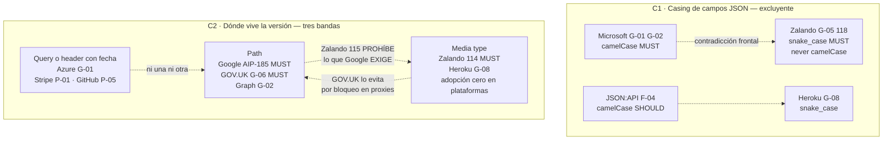
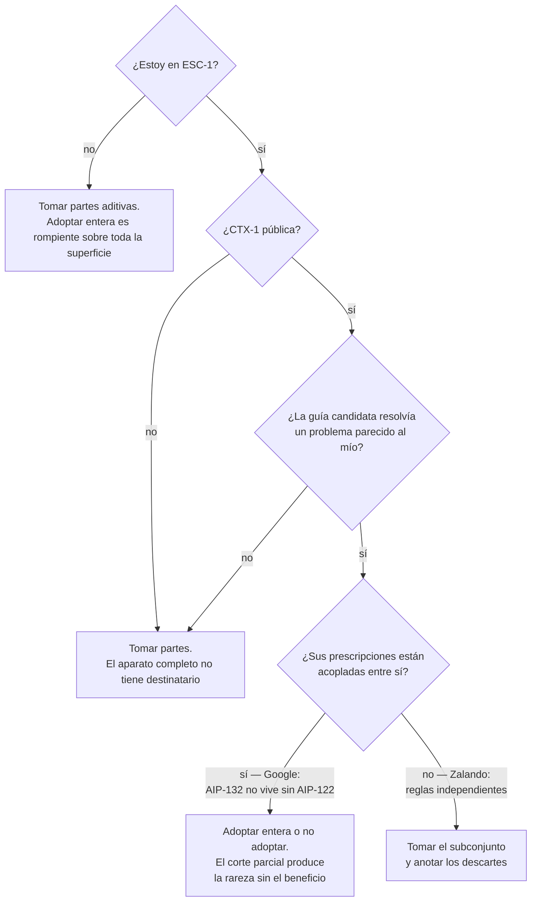

# Comparativa y criterios — `TEM-GCOMP`

## Resumen ejecutivo

Los tres documentos anteriores describieron tres sistemas prescriptivos por separado, cada uno coherente dentro de sí mismo. Puestos uno al lado del otro, el resultado es incómodo y hay que decirlo sin suavizarlo: **en las decisiones de estilo que más se discuten, la industria no tiene consenso, tiene bandos**. Sobre casing hay dos posiciones excluyentes con mandatos MUST de un lado y de otro. Sobre dónde vive la versión hay tres, una de las cuales prohíbe lo que otra exige. Sobre formato de error hay cuatro modelos mutuamente incompatibles, ninguno superconjunto de otro, y uno solo adopta el estándar del IETF.

La reacción habitual ante ese cuadro es buscar el promedio, y es la peor respuesta posible. No existe un formato de error que sea a la vez el envoltorio `error` de Microsoft y `problem+json`; no existe una API que ponga la versión en el path y a la vez no la ponga. Promediar produce un dialecto que no cumple ninguna guía y no tiene las razones de ninguna.

La respuesta que este documento propone es distinta: **elegir con criterio explícito y escribir la razón**. Una organización con una guía propia de dos páginas, cuyas quince decisiones estén tomadas a conciencia y verificadas por un linter, está mejor que una que dice seguir a Google y solo copió el nombre de un campo. Lo que sigue son las tablas que permiten ver el mapa completo, el mismo caso resuelto según cada guía para que la diferencia se vea en el cable, y cuatro procedimientos: cómo elegir una guía, cuándo adoptarla entera, cómo escribir la propia y cómo evaluar una prescripción ajena que aparece en una discusión.

---

## Definición

### Qué es

Un instrumento de decisión. Las tres secciones descriptivas de esta familia responden «qué dice cada guía»; esta responde «qué hago con eso». Su contenido son dos tablas de contraste, un ejercicio de traducción del mismo caso a cada sistema, y cuatro procedimientos con sus criterios.

### Qué problema resuelve

**Que la elección de convenciones deje de decidirse por prestigio.** El mecanismo real por el cual una API adquiere sus convenciones, cuando nadie interviene, es que `ACT-02` copia el ejemplo que encontró buscando. Ese ejemplo viene de alguna guía, o de dos mezcladas, y la decisión queda tomada sin que nadie la haya tomado. [`MARCO-ACTORES`](../00-Marco-de-Referencia/Actores.md) lo describe como el caso típico de decisión sin dueño.

**Que una discusión de equipo pueda cerrarse con evidencia.** Cuando dos personas citan dos guías que se contradicen, el punto no es cuál tiene razón: es que ninguna de las dos obliga, y que hay que decidir con criterios propios. Tener el mapa a la vista convierte una discusión de autoridad en una de costos.

**Que la guía propia se escriba una vez y se verifique siempre.** El producto de este documento no es la elección de una guía externa sino la capacidad de producir una interna que sea corta, justificada y automáticamente verificable.

### Qué NO es, y con qué se lo confunde

**No es un ranking.** No hay una guía mejor. Hay guías que resolvieron problemas distintos con recursos distintos, y la pregunta útil es cuál de esos problemas se parece al propio.

**No es una síntesis reconciliadora.** No propone un formato de error que unifique los cuatro ni un casing que contente a los dos bandos. Las contradicciones son el hallazgo del material y presentarlas como matices las falsearía.

**No reemplaza a las familias temáticas.** Acá se compara **por guía**, para poder evaluar cada sistema como un todo. La decisión punto por punto —qué casing, qué paginación, qué formato de error para esta API concreta— se toma en [`TEM-CAMPOS`](../40-Contratos-y-Representaciones/Formato-y-Nomenclatura-de-Campos.md), [`TEM-PAG`](../40-Contratos-y-Representaciones/Colecciones-y-Paginacion.md), [`TEM-ERR`](../40-Contratos-y-Representaciones/Manejo-de-Errores.md) y [`TEM-VERS`](../50-Evolucion-y-Versionado/Estrategias-de-Versionado.md).

---

## La tabla comparativa: decisión × guía

Todo lo que sigue está verificado al 2026-07-20 contra las fuentes primarias. Un guión significa que la guía no se pronuncia sobre ese punto en el documento consultado, lo cual **no es lo mismo** que permitir cualquier cosa: en varios casos, como el casing de GOV.UK, la ausencia de prescripción es deliberada y viene acompañada de una exigencia de consistencia.

| Decisión | Azure `G-01` | Graph `G-02` | Google `G-04` | Zalando `G-05` | JSON:API `F-04` | Heroku `G-08` | GOV.UK `G-06` |
|---|---|---|---|---|---|---|---|
| **Casing de campos JSON** | `camelCase` | `lowerCamelCase` (MUST) | `lower_snake_case` en protobuf (AIP-140); **casing JSON no especificado** | `snake_case` (MUST 118, regex `^[a-z_][a-z_0-9]*$`), *«never camelCase»* | `camelCase` (SHOULD, no normativo) | `snake_case` | No prescribe; exige consistencia |
| **Casing de segmentos de URI** | kebab-case preferido, o camel-case | Colecciones en plural | Collection ids en `camelCase` y plural (AIP-122, MUST) | `kebab-case` (MUST 129) | Derivada del tipo de recurso | — | Consistencia; nombres persistentes |
| **Casing de query params** | `api-version`, `top`, `skip` | `$top`, `$skip` (OData) | `page_size`, `page_token`, `filter`, `order_by` | `snake_case` (MUST 130) | `page[...]`, `filter`, `sort` | — | — |
| **Dónde vive la versión** | Query `api-version=YYYY-MM-DD` (+`-preview`), requerido en toda operación | Dos endpoints en el path: `v1.0` y `beta` | `v1`, `v2` al inicio del **path** (MUST) | **MUST NOT** en la URL (115); **MUST** media type (114) | No prescribe | Header `Accept: application/vnd.heroku+json; version=3` | **URI**: `.../v1`; evitar headers y media types |
| **Formato de la versión** | Fecha | `v1.0` / `beta` | Solo major; **MUST NOT** minor ni patch; `v1beta1`, `v1alpha` | SemVer `MAJOR.MINOR.PATCH` en `info.version` (116) | — | Entero (`version=3`) | — |
| **Paginación** | `skip`, `top`, `maxpagesize`; `value` + `nextLink` | `nextLink` (MUST); `$top`/`$skip` (SHOULD); `$skiptoken` (MAY) | `page_size`, `page_token` → `next_page_token`; **tokens opacos** (AIP-158) | MUST paginar (159); SHOULD cursor y evitar offset (160); links (161) | Familia `page[...]` + `links` | Cabecera `Content-Range` | — |
| **Filtrado y orden** | `filter`, `orderby`, `select`, `expand` | `$filter` con `eq`/`ne` (SHOULD) | `filter` con DSL propio (AIP-160), `order_by` (AIP-132) | `q`, `fields`, `embed`, `sort` (137) | `filter` (reservado, **sin sintaxis**), `sort` | — | — |
| **Formato de error** | `{"error":{code,message,target,details[],innererror}}` + cabecera `x-ms-error-code` | `{"error":{code,message,target}}`, `code` en camelCase | `google.rpc.Status` + **`ErrorInfo` obligatorio** (`reason`, `domain`, `metadata`) | **problem+json** (MUST 176) | Array `errors[]` top-level | `{id, message, url}` | Status de RFC 9110; descriptivo, sin detalles internos |
| **Identificador del recurso** | — | — | `name` con el resource name completo (AIP-122 MUST); **ningún otro campo puede llamarse `name`** | — | `id` + `type` | `id` UUID 8-4-4-4-12 en minúsculas | `user_id`, `address_id` consistentes |
| **Verbo de actualización** | — | **MUST NOT** PUT; usar PATCH | **SHOULD** PATCH, no PUT (AIP-134) | — | PATCH | — | — |
| **Fechas** | RFC 3339 en JSON y query; RFC 7231 en cabeceras | — | — | — | — | ISO 8601 en UTC (`created_at`, `updated_at`) | ISO 8601 |
| **Pluralización** | — | Plural (colecciones) | Plural (MUST) | Plural (MUST 134) | Del tipo de recurso | — | Singular o plural, pero consistente |

---

## La tabla de contradicciones

Es el hallazgo más valioso del material y el que más se pierde cuando alguien intenta escribir «las buenas prácticas de la industria».

| # | Decisión | Postura A | Postura B | Postura C | Naturaleza del conflicto |
|---|---|---|---|---|---|
| **C1** | Casing de campos JSON | Microsoft (`G-01` y `G-02`): `camelCase`, MUST | Zalando (`G-05` 118): `snake_case`, MUST, *«never camelCase»* | Heroku: `snake_case`; JSON:API: `camelCase` (SHOULD) | **Directo y frontal.** No hay reconciliación: es una elección excluyente sobre el mismo objeto |
| **C2** | Dónde vive la versión | Google AIP-185, GOV.UK y Graph: en el **path**, MUST | Zalando 114/115: **MUST NOT** en URL, MUST media type; Heroku: media type | Azure: query `api-version` con fecha; Stripe (`P-01`): header `Stripe-Version` con fecha | **De tres bandas.** Zalando prohíbe lo que Google y GOV.UK exigen. Y GOV.UK justifica su postura por el riesgo del mecanismo que Zalando manda usar |
| **C3** | Formato de la versión | Google: solo major; **MUST NOT** `v1.0`, `v1.1`, `v1.4.2` | Zalando 116: **MUST** SemVer `MAJOR.MINOR.PATCH` | Azure y Stripe: fecha; `G-03` deprecada: `Major.Minor` | **Parcial pero real.** Google prohíbe lo que Zalando obliga. Se atenúa porque aplican a superficies distintas —URL contra metadato de spec—; el modelo mental sigue siendo opuesto |
| **C4** | Casing de segmentos de URI | Zalando 129: `kebab-case`, MUST | Google AIP-122: collection ids en `camelCase`, MUST | Azure: kebab-case preferido **o** camel-case | **Directo** entre Zalando y Google. Azure elige no decidir |
| **C5** | Formato del objeto error | Microsoft: envoltorio `error` con `code`/`message`/`target`/`details`/`innererror` | Zalando 176: **problem+json**, con `type`/`title`/`status`/`detail`/`instance` | Google AIP-193: `google.rpc.Status` + `ErrorInfo` obligatorio; Heroku: `{id,message,url}`; JSON:API: `errors[]` | **La peor fragmentación del ecosistema.** Cuatro formatos incompatibles, ninguno superconjunto de otro. **Solo Zalando adopta el estándar IETF** |
| **C6** | Cursor contra offset | Google AIP-158: `page_token` opaco, **MUST NOT** parseable: cursor puro | Microsoft: `skip`/`top` y `$skip`/`$top`, offset explícito, más `nextLink`/`$skiptoken` | Zalando 160: SHOULD cursor y evitar offset — pero la 137 lista `offset` y `limit` entre los convencionales | Google prohíbe de facto lo que Microsoft ofrece como mecanismo principal para el cliente. **Zalando es internamente ambivalente** |
| **C7** | Nombres de los parámetros de paginación | `page_size`/`page_token`/`next_page_token` (Google) | `skip`/`top`/`maxpagesize`/`nextLink` (Azure); `$top`/`$skip` (Graph) | `offset`/`limit`/`cursor` (Zalando); `page[...]` (JSON:API); `Content-Range` (Heroku) | **Cero convergencia léxica.** Ni siquiera dentro de Microsoft: `top` contra `$top` |
| **C8** | Identificador del recurso | Google AIP-122: `name` es el resource name; **must not** self-links ni tuplas; **ningún otro campo puede llamarse `name`** | Heroku, JSON:API y práctica general: `id` identifica, `name` es etiqueta humana | — | **Semántico severo.** La misma palabra designa cosas distintas. Migrar entre convenciones rompe todos los clientes |
| **C9** | Verbo de actualización | Graph: **MUST NOT** PUT; Google AIP-134: SHOULD PATCH, no PUT | REST clásico y nivel 2 del modelo de madurez: PUT es el verbo canónico de reemplazo | — | Convergencia moderna contra enseñanza tradicional. **Google y Microsoft coinciden**: es de las pocas áreas de acuerdo |
| **C10** | Pluralización de colecciones | Google AIP-122, Zalando 134 y Graph: plural, MUST | GOV.UK: no prescribe; solo consistencia | — | **Débil.** GOV.UK delega donde los demás obligan |



### Dónde sí hay consenso

El contraste importa tanto como el conflicto, porque delimita lo que sí se puede afirmar sin nombrar una organización:

- **Recursos como sustantivos y verbos HTTP con su semántica estándar** — el nivel 2 del modelo de madurez de `O-03`.
- **Fechas en RFC 3339 o ISO 8601** — coinciden Azure, Heroku y GOV.UK.
- **TLS obligatorio.**
- **Paginación obligatoria en colecciones** — Zalando MUST 159, Google AIP-158, Microsoft.
- **Preferencia por PATCH sobre PUT** — Google AIP-134 y Graph, por razonamientos independientes.

Son cinco puntos. Todo lo demás que se enuncia como «buena práctica de la industria» sin nombrar una organización está, con alta probabilidad, encubriendo la elección de un bando.

### La contradicción tácita de fondo

Ninguna de estas guías la menciona, y atraviesa a todas. Casi todas prescriben APIs de **nivel 2** del modelo de madurez: recursos con URI propia y verbos usados según su semántica, sin controles de hipermedia. Fowler subraya en `O-03` que, según la definición de Fielding, **el nivel 3 es precondición para llamar REST a algo**. JSON:API es la excepción parcial, con sus `links` obligatorios.

Es decir: el corpus prescriptivo completo de la industria enseña a construir algo que el autor del término no llamaría REST, y lo llama REST. La guía adopta el uso corriente por la razón que declara [`MARCO-CONVENCIONES`](../00-Marco-de-Referencia/Convenciones.md) —es lo que el lector va a encontrar— y remite la discusión a [`TEM-RMM`](../10-Fundamentos-REST/Modelo-de-Madurez.md).

---

## Aplicación por escenario

### `ESC-1` — API nueva

El escenario donde este documento se usa completo, y el único donde adoptar una guía entera es barato. La secuencia que esta guía recomienda: determinar el contexto, ejecutar la selección de guía de la sección de criterios, decidir explícitamente los cinco puntos en conflicto —casing, versión, paginación, error, identificador—, escribir la guía propia con esas decisiones y sus razones, y montar el linter antes del primer endpoint.

El orden importa. Escribir el linter después de tener veinte endpoints significa aceptar veinte desviaciones o pagar veinte correcciones.

### `ESC-2` — Exposición o migración

Aplica con una advertencia específica: la guía se elige para el **contrato nuevo**, no para el sistema de respaldo, y la tentación es la contraria. Si las tablas internas usan `FECHA_INICIO`, adoptar `snake_case` porque «se parece más» es dejar que el modelo interno decida el contrato público por vía indirecta. La decisión de casing debe poder justificarse sin mencionar la base de datos.

Un caso concreto donde el sistema previo sí manda legítimamente: si ya expone OData —frecuente en el ecosistema Microsoft—, la superficie con `$top`, `$skip` y `$filter` existe y `G-02` describe cómo se ve bien hecha. Alinearse ahí es reconocer un hecho, no ceder.

### `ESC-3` — Evolución en producción

El escenario donde este documento sirve sobre todo para **decir que no**. Adoptar una guía sobre una API con consumidores es un cambio rompiente sobre toda la superficie: renombrar campos rompe a todo cliente que deserialice, cambiar el formato de error rompe a todo cliente que ramifique sobre él, mover la versión invalida todas las URLs publicadas. La conformidad, por sí sola, no justifica una versión mayor. Lo justifica un problema que la conformidad resuelva.

Lo que sí funciona es el corte aditivo, y hay cuatro movimientos verificados que no rompen nada:

| Movimiento | Origen | Por qué es compatible |
|---|---|---|
| Agregar la cabecera `x-ms-error-code` junto al cuerpo actual | `G-01` | Los clientes ignoran cabeceras que no leen |
| Omitir el enlace de siguiente página en la última en vez de mandarlo nulo | `G-01` | Un campo ausente y un campo nulo se tratan igual en clientes bien escritos, y ahorra una petición |
| Servir `application/problem+json` negociado por `Accept`, junto al formato previo | `G-05` 176 | El formato viejo sigue siendo el default; el nuevo es opt-in |
| Emitir una cabecera `Request-Id` con UUID en cada respuesta | `G-08` | Puramente aditivo, y convierte cada reporte de consumidor en algo rastreable |

### `ESC-4` — Evaluación de una API ajena

Las tablas de este documento funcionan como **clave de identificación**. Reconocer el sistema prescriptivo de una API ajena permite predecir la parte que todavía no se leyó, que es exactamente lo que `ESC-4b` necesita cuando cada sondeo cuesta.

| Señal observada | Sistema probable | Qué predice |
|---|---|---|
| Campo `name` con forma de path, `nextPageToken` | Google `G-04` | Get/List/Create/Update/Delete, PATCH con máscara, `ErrorInfo` con `(reason, domain)` |
| `api-version` obligatorio, colección en `value`, `x-ms-error-code` | Azure `G-01` | `skip`/`top`/`maxpagesize`, `nextLink` absoluto que se omite al final |
| `$top`, `$skip`, `v1.0` en el path | Graph `G-02` | `nextLink`, `$filter` con `eq`/`ne`, PATCH y nunca PUT |
| `snake_case` en campos y `kebab-case` en el path | Zalando `G-05` | `problem+json`, cursor, sin `/v1/` en la URL |
| `application/vnd.api+json` | JSON:API `F-04` | `data`/`errors` excluyentes, `links` de paginación, `included` |
| `Content-Range` en la respuesta de una colección | Heroku `G-08` | `id` UUID, `created_at`/`updated_at`, error `{id,message,url}` |
| `application/problem+json` | `N-04` directo o Zalando | La señal más rara: no se verificó ninguna plataforma grande sirviéndolo |

Corresponde la disciplina de `ESC-4b`: esto produce una **hipótesis del contrato**, no el contrato, y se registra como tal.

### Qué cambia según el contexto

| Contexto | Cuánto pesa adoptar una guía externa |
|---|---|
| `CTX-1` pública | Máximo. El integrador que reconoce la forma aprende más rápido, y la conformidad declarada se vuelve promesa: desviarse en un endpoint es deuda visible. Es el único contexto donde adoptar una guía entera se paga sola |
| `CTX-2` interna | Bajo, en cuanto a contenido. Alto, en cuanto a forma: lo valioso es tener reglas numeradas y verificables, no cuáles sean. Un formato de error único entre servicios ahorra un traductor por integración |
| `CTX-3` backend de app propia | Medio y asimétrico. El casing conviene alinearlo con el default del framework porque no compra nada desviarse; el versionado recién importa cuando hay clientes instalados que no se actualizan, típicamente MAUI |
| `CTX-4` integración | Nulo del lado de la decisión: la guía la eligió el proveedor. Lo que se decide es dónde traducir su convención para que no circule por el dominio propio |

Cuando una API está en varios contextos a la vez, rige el más restrictivo, como fija [`MARCO-CONTEXTOS`](../00-Marco-de-Referencia/Contextos.md).

---

## Ejemplos concretos — el mismo caso, cinco veces

El ejercicio central de esta familia. Una sola operación —**listar las reservas de la sala `a3f1`, paginadas de a veinte**— y un solo fallo —**una reserva cuya fecha de fin precede a la de inicio**— resueltos según cada sistema. Los ejemplos son sintéticos.

### Listar reservas paginadas

**Azure `G-01`**

```http
GET /salas/a3f1/reservas?api-version=2026-07-01&top=20&skip=40 HTTP/1.1
```
```json
{
  "value": [ { "id": "r-9012", "salaId": "a3f1", "fechaInicio": "2026-08-01T09:00:00Z" } ],
  "nextLink": "https://api.ejemplo.com/salas/a3f1/reservas?api-version=2026-07-01&top=20&skip=60"
}
```

**Graph `G-02`**

```http
GET /v1.0/salas/a3f1/reservas?$top=20&$skip=40 HTTP/1.1
```
```json
{
  "value": [ { "id": "r-9012", "salaId": "a3f1", "fechaInicio": "2026-08-01T09:00:00Z" } ],
  "nextLink": "https://api.ejemplo.com/v1.0/salas/a3f1/reservas?$top=20&$skiptoken=eyJ..."
}
```

**Google `G-04`**

```http
GET /v1/salas/a3f1/reservas?pageSize=20&pageToken=Q2lRSU9EZ3lNVEExTmc HTTP/1.1
```
```json
{
  "reservas": [ { "name": "salas/a3f1/reservas/9012", "sala": "salas/a3f1", "fechaInicio": "2026-08-01T09:00:00Z" } ],
  "nextPageToken": "Q2lRSU9EZ3lNVEExTndhPT0",
  "totalSize": 143
}
```

**Zalando `G-05`**

```http
GET /salas-de-reunion/a3f1/reservas?cursor=Y3Vyc29yOjQw&limit=20 HTTP/1.1
Accept: application/vnd.reservas.v2+json
```
```json
{
  "items": [ { "reserva_id": "9012", "sala_id": "a3f1", "fecha_inicio": "2026-08-01T09:00:00Z" } ],
  "next": "/salas-de-reunion/a3f1/reservas?cursor=Y3Vyc29yOjYw&limit=20"
}
```

**JSON:API `F-04`**

```http
GET /salas/a3f1/reservas?page[cursor]=Y3Vyc29yOjQw HTTP/1.1
Accept: application/vnd.api+json
```
```json
{
  "data": [
    {
      "type": "reservas",
      "id": "9012",
      "attributes": { "fechaInicio": "2026-08-01T09:00:00Z", "estado": "confirmada" },
      "relationships": { "sala": { "data": { "type": "salas", "id": "a3f1" } } }
    }
  ],
  "links": { "first": "…", "last": "…", "prev": null, "next": "/salas/a3f1/reservas?page[cursor]=Y3Vyc29yOjYw" }
}
```

Cinco peticiones a la misma operación. **No comparten un solo carácter de los nombres de parámetro.** La versión aparece en el query, en el path, en el path otra vez, en el `Accept`, y en ninguna parte. El identificador se llama `id`, `id`, `name`, `reserva_id` e `id`. La colección se llama `value`, `value`, `reservas`, `items` y `data`. El enlace a la siguiente página se llama `nextLink`, `nextLink`, `nextPageToken`, `next` y `links.next`, y en el caso de Google no es un enlace sino un token que el cliente vuelve a mandar.

Ninguna de esas diferencias es técnica. Todas son de convención, y todas rompen a un cliente escrito contra otra.

Sobre el casing JSON del bloque de Google corresponde la advertencia ya hecha en [`TEM-GGOOGLE`](Google-AIP.md): **AIP-140 normaliza `lower_snake_case` solo en protobuf y no especifica el casing JSON**. El ejemplo refleja la práctica observable, no una prescripción verificada; los nombres canónicos según la fuente son `page_size`, `page_token`, `next_page_token` y `total_size`.

### El mismo error de validación

**Azure `G-01`** — cabecera `x-ms-error-code: RangoDeFechasInvalido`

```json
{ "error": { "code": "RangoDeFechasInvalido", "message": "La fecha de fin debe ser posterior a la de inicio.",
             "target": "fechaFin", "details": [ { "code": "CampoInvalido", "target": "fechaFin", "message": "…" } ] } }
```

**Graph `G-02`**

```json
{ "error": { "code": "badRequest", "message": "La fecha de fin debe ser posterior a la de inicio.", "target": "fechaFin" } }
```

**Google `G-04`** — AIP-193

```json
{ "error": { "code": 400, "message": "El rango de fechas solicitado no es válido.", "status": "INVALID_ARGUMENT",
    "details": [ { "@type": "type.googleapis.com/google.rpc.ErrorInfo",
                   "reason": "RANGO_DE_FECHAS_INVALIDO", "domain": "reservas.ejemplo.com",
                   "metadata": { "campo": "fecha_fin", "fecha_inicio": "2026-08-01T09:00:00Z" } } ] } }
```

**Zalando `G-05`** — regla 176, `Content-Type: application/problem+json`

```json
{ "type": "https://api.ejemplo.com/problems/rango-de-fechas-invalido",
  "title": "Rango de fechas inválido", "status": 400,
  "detail": "La fecha de fin debe ser posterior a la de inicio.",
  "instance": "/salas-de-reunion/a3f1/reservas",
  "errors": [ { "detail": "2026-08-01T08:00:00Z es anterior a fecha_inicio.", "pointer": "#/fecha_fin" } ] }
```

**Heroku `G-08`**

```json
{ "id": "rango_de_fechas_invalido", "message": "La fecha de fin debe ser posterior a la de inicio.",
  "url": "https://docs.ejemplo.com/errores/rango-de-fechas-invalido" }
```

**JSON:API `F-04`**

```json
{ "errors": [ { "status": "400", "code": "rango-de-fechas-invalido", "title": "Rango de fechas inválido",
                "detail": "La fecha de fin debe ser posterior a la de inicio.",
                "source": { "pointer": "/data/attributes/fechaFin" } } ] }
```

**Ninguno es superconjunto de otro**, y la prueba es campo por campo. El identificador estable del error de negocio se llama `code` en Microsoft, `reason` en Google, `type` —y es una URI— en problem+json, `id` en Heroku y `code` en JSON:API. La ubicación del campo ofensor se llama `target` en Microsoft, viaja como `metadata` en Google, es un `pointer` de JSON Pointer en problem+json y en JSON:API, y **no existe** en Heroku. El envoltorio es un objeto en tres casos, un array en dos, y ninguno en problem+json, que va en la raíz. Errores múltiples los expresan `details` en Microsoft, `details` en Google, la extensión `errors` en problem+json y el array `errors` en JSON:API; Heroku no los expresa.

Un traductor entre dos cualesquiera de estos formatos pierde información en alguna dirección. Es lo que hace que `C5` sea la peor fragmentación del ecosistema, y lo que hace que la decisión de formato de error sea la más cara de revertir de toda la superficie de una API.

---

## Los criterios

### 1 · Cómo elegir una guía para adoptar

Cuatro preguntas, en orden. La primera que se responda con firmeza suele decidir.

**¿Quién consume, y puedo coordinar un cambio con él?** Es la pregunta de [`MARCO-CONTEXTOS`](../00-Marco-de-Referencia/Contextos.md) y gobierna todo lo demás. En `CTX-1` la conformidad con una guía conocida es valor real para el integrador; en `CTX-2` casi no lo es. Adoptar el aparato de una API pública en una interna cuesta tiempo sin comprar nada, y es el error simétrico del contrario.

**¿Cuál de las guías resolvía un problema parecido al mío?** No cuál es mejor. Azure resolvió la coherencia entre cientos de equipos con generación de SDK en el medio; Google resolvió la navegabilidad de un espacio de nombres enorme con una cadena de generación desde protobuf; Zalando resolvió gobernar decenas de equipos sin comité de revisión; GOV.UK resolvió interoperar entre organismos con capacidades muy dispares. Un sistema de reservas de salas con un equipo no tiene ninguno de esos cuatro problemas, y decirlo en voz alta es la mitad de la decisión.

**¿Qué me cuesta desviarme del default de mi plataforma?** Para el destinatario de esta guía es concreto y medible: ASP.NET Core produce `camelCase` por `JsonSerializerDefaults.Web` (`N-39`). Adoptar Microsoft en ese punto es no hacer nada; adoptar Zalando es configurar el serializador y aceptar que todo desarrollador nuevo espere lo contrario. Es un argumento de costo legítimo y **no es un argumento de corrección**; confundirlos produce la falacia de que Microsoft «tiene razón» porque .NET lo hace por defecto.

**¿Puedo verificar automáticamente lo que adopte?** Una convención no verificable se erosiona endpoint por endpoint y no se ve en revisión de código, porque el revisor mira la lógica. Entre dos guías igualmente buenas conviene la que se traduce a reglas de linter, y esa es la ventaja estructural de Zalando y de adidas sobre las demás.

### 2 · Adoptar una guía entera, o tomar partes

La respuesta no depende de la voluntad sino de **cuán acopladas están las prescripciones dentro de cada guía**, y ahí las tres grandes se comportan de forma muy distinta.



**Google es el caso acoplado.** Los cinco métodos estándar se definen en términos del nombre de recurso de AIP-122: Get recibe un `name`, List recibe un `parent`, Update identifica por el `name` del recurso. Tomar AIP-132 sin AIP-122 deja al listado sin sujeto. Lo periférico sí se puede tomar: **AIP-158, la paginación, es autocontenida**, y su disciplina de token opaco resuelve un problema real sin arrastrar nada.

**Zalando es el caso desacoplado.** Las reglas están numeradas y son mayormente independientes: tomar la 118, la 129 y la 176 sin tomar la 114 y la 115 no produce ninguna incoherencia, porque el casing no depende del versionado. Es la guía más apta para adopción parcial, y su forma es la razón.

**Microsoft es el caso bifurcado.** No hay «adoptar Microsoft»: hay adoptar `G-01` o `G-02`, y mezclarlas produce un dialecto con dos sellos prestados.

La regla que esta guía recomienda: **se puede tomar una parte si se puede explicar qué hace sin mencionar las partes descartadas**. Si la explicación necesita el resto, el corte está mal hecho.

### 3 · Cómo escribir la guía propia de una organización

El producto que la mayoría de las organizaciones necesita no es la adopción de una guía externa sino una interna, corta y verificada. Seis criterios:

**Corta y con las decisiones caras primero.** Las que después no se revierten: casing de campos, casing de path, formato de error, identificador, estrategia de versionado, forma de la paginación. Seis decisiones caben en dos páginas. Una guía interna de cuarenta páginas no se lee, y su tamaño garantiza que nadie detecte cuando se la incumple.

**Cada decisión con su razón, en una línea.** Es lo que permite revisarla dentro de tres años, cuando el contexto cambió y nadie recuerda por qué. «`camelCase` porque es el default de ASP.NET Core y no tenemos razón para pagar la desviación» es una razón; «porque lo dice Microsoft» no lo es, porque no dice qué pasaría si Microsoft cambiara de opinión.

**Con el nivel normativo declarado.** Tomado de Zalando: MUST, SHOULD, MAY. Sin él, toda la guía se lee con la misma fuerza, y en la práctica eso significa que se lee toda como sugerencia.

**Con reglas numeradas y estables.** Para que se pueda escribir «regla 7» en un comentario de revisión sin transcribirla, y para que renumerar no invalide las discusiones viejas. Números que no se reciclan.

**Verificable automáticamente, y con la lista de qué se verifica realmente.** Un ruleset de Spectral sobre la especificación OpenAPI, como el que publica adidas, en integración continua. La distancia entre lo prescrito y lo verificado es la deuda real de la guía, y conviene tenerla escrita en lugar de descubrirla.

**Con las desviaciones registradas en lugar de negadas.** Toda API vieja incumple algo. Una lista de excepciones conocidas con su razón es información; una guía que se presenta como universalmente cumplida cuando no lo es entrena a todos a ignorarla.

Y una advertencia de método sobre las citas: si la guía propia se apoya en fuentes, hay que citarlas por designación exacta y revisarlas. Vale como recordatorio que la regla 176 de Zalando —una guía viva, activa y bien mantenida— sigue citando RFC 7807, obsoleto desde julio de 2023 por `N-04`. Le pasa a los mejores.

### 4 · Cómo evaluar una prescripción ajena en una discusión de equipo

El caso operativo: alguien dice «esto no se hace así» y cita una fuente. Cinco pasos, en orden, y los tres primeros cuestan menos de dos minutos.

**Paso 1 — ¿Qué documento es, exactamente?** «Las guías de Microsoft» no identifica nada: hay tres, y una está deprecada. «Google lo hace así» no identifica una AIP, y el corpus tiene cientos con estados formales distintos, incluidos Withdrawn y Replaced. Sin designación exacta no hay nada que evaluar.

**Paso 2 — ¿Existe y está vivo?** Abrir el enlace. Es el paso que casi nadie ejecuta y el que más citas descarta: PayPal devuelve 404, `G-03` de Microsoft lleva aviso de deprecación con fecha de remoción declarada en 2024, Heroku no recibe commits. Una prescripción de un documento retirado puede seguir siendo buena, y ya no puede invocarse como autoridad.

**Paso 3 — ¿Qué nivel de autoridad tiene?** Los cuatro de [`MARCO-CONVENCIONES`](../00-Marco-de-Referencia/Convenciones.md). Que sea un RFC cambia la conversación; que sea una guía corporativa la abre en lugar de cerrarla. La pregunta que ordena todo lo demás: **¿esto lo dice un RFC o lo dice Google?**

**Paso 4 — ¿Hay otra guía grande que prescriba lo contrario?** Para las diez decisiones de la tabla de contradicciones la respuesta es sí, y saberlo desarma el argumento de autoridad sin desacreditar la propuesta. «Zalando lo prohíbe» y «Google lo exige» son ambas verdaderas sobre la versión en el path.

**Paso 5 — ¿Qué problema resolvía esa organización, y lo tengo?** El único paso que produce una decisión en lugar de un empate. Google prohíbe los tokens de paginación parseables porque necesita cambiar la estrategia de paginación de miles de servicios sin coordinar con nadie. Una API interna con dos consumidores conocidos no tiene ese problema, y puede tomar la misma decisión por otra razón, o no tomarla.

El resultado esperado de los cinco pasos no es ganar la discusión sino cambiarle el eje: de «quién tiene razón» a «qué nos conviene, y con qué costo». Cuando la respuesta final no se apoya en ninguna fuente, corresponde declararla como criterio propio, con la fórmula que la guía usa para eso.

---

## Preguntas guía

- Ante una prescripción citada en una discusión: ¿esto lo dice un RFC o lo dice una organización? ¿Cuál, y en qué documento exacto?
- ¿Abrí el enlace? ¿El documento existe y no tiene aviso de deprecación?
- ¿Hay otra guía grande que prescriba lo contrario en este punto? ¿Está en la tabla de contradicciones?
- ¿Qué problema resolvía la organización que escribió esto, y se parece al mío?
- Mis convenciones actuales, ¿las decidí, o las heredé del ejemplo que alguien copió de una búsqueda?
- ¿Puedo explicar cada parte que tomé de una guía sin mencionar las partes que descarté?
- ¿Cuánto de mi guía interna está verificado por un linter, y cuánto vive solo en un documento?
- Cuando digo «así lo hace la industria», ¿estoy hablando de uno de los cinco puntos de consenso real, o estoy encubriendo la elección de un bando?
- Si tuviera que cambiar mi formato de error mañana, ¿qué información perdería el cliente en la traducción?

---

## Criterios de calidad

Una organización maneja bien este material cuando puede responder tres preguntas sobre cualquier convención de su API: **qué decidimos, por qué, y cómo verificamos que se cumple**. Las tres respuestas escritas y en un lugar donde `ACT-02` las encuentra sin preguntar. La ausencia de la tercera es la más frecuente y la que garantiza que las otras dos envejezcan mal.

Un buen indicador secundario es la existencia de una lista de descartes. Una organización que adoptó una guía y no puede nombrar una sola prescripción que dejó afuera, casi con seguridad no la leyó.

### Antipatrones

**El falso consenso.** Escribir «la industria recomienda» sobre casing, versionado, paginación, filtrado o formato de error. En esas cinco decisiones no hay recomendación de la industria: hay bandos con mandatos MUST enfrentados. La frase encubre una elección y le presta una autoridad que no tiene.

**El promedio.** Intentar un formato de error que combine el envoltorio de Microsoft con los miembros de problem+json, o una paginación que ofrezca `skip`/`top` y token opaco a la vez. El resultado no cumple ninguna guía, no tiene las razones de ninguna, y le duplica la superficie de contrato al consumidor.

**El argumento de autoridad sin verificación.** «Lo hace Google» como cierre de discusión. Google lo hace porque tiene un generador de clientes, miles de APIs y un espacio de nombres enorme. La pregunta pendiente es si el equipo tiene eso.

**El ensamble sin costura.** `api-version` de Azure con `$top` de Graph, `name` de Google con `id` de todos los demás, `kebab-case` de Zalando con `camelCase` en el cuerpo. Cada pieza vino de una guía y el conjunto es un dialecto propio con sellos prestados. Es especialmente probable cuando las convenciones se acumulan copiando ejemplos.

**La guía interna que nadie verifica.** Cuarenta páginas en un wiki, escritas una vez, citadas en discusiones y contradichas por la mitad de los endpoints. Peor que no tener guía, porque genera la creencia de que el problema está resuelto.

**Adoptar por conformidad en `ESC-3`.** Renombrar todos los campos de una API con consumidores para cumplir una guía es un cambio rompiente masivo cuyo beneficio es la conformidad misma. Salvo que resuelva un problema concreto y nombrado, el costo lo paga el consumidor y el beneficio se lo lleva el gráfico de cumplimiento.

**Confundir el default del framework con una decisión.** Que una API .NET devuelva `camelCase` no es adhesión a `G-01`: es `JsonSerializerDefaults.Web`. La coincidencia es real y la decisión no se tomó, y ese mismo default trae tres implicaciones más documentadas en `N-39` que ninguna guía prescribe y que afectan el contrato.

**Citar de más.** Presentar la recomendación de camelCase de JSON:API como normativa cuando está en la página de recomendaciones; atribuirle a Google un casing JSON que AIP-140 no especifica; decir «seguí JSON:API para filtrar» cuando la especificación reserva `filter` sin definirle sintaxis. Las tres son citas que exceden lo que la fuente dice, y las tres suenan igual de firmes que una correcta.

---

## Anexo A — Plantilla de guía de convenciones de una organización

Diseñada para caber en dos páginas. Las seis decisiones son las caras; el resto se deja a criterio del equipo a propósito.

```yaml
guia: "Convenciones de API de <organización>"
version: 1.0.0
fecha: AAAA-MM-DD
owner: "ACT-01 <nombre>"
alcance: "todas las APIs HTTP de <organización>"        # o el subconjunto que sea
contexto_dominante: CTX-1 | CTX-2 | CTX-3 | CTX-4

decisiones:
  - n: 1
    nivel: MUST
    decision: "Los campos JSON van en camelCase."
    razon: "Es el default de ASP.NET Core (N-39); no tenemos razón para pagar la desviación."
    origen: "coincide con G-01; no es adhesión"
    verificacion: "regla de Spectral sobre el esquema de la especificación OpenAPI"

  - n: 2
    nivel: MUST
    decision: "Los segmentos de path van en kebab-case, en plural."
    razon: ""
    origen: ""
    verificacion: ""

  - n: 3
    nivel: MUST
    decision: "El identificador del recurso es 'id'; 'name' queda libre como etiqueta humana."
    razon: "Conflicto C8 resuelto en contra de G-04 AIP-122: no tenemos generación de clientes ni jerarquía profunda."
    origen: "criterio propio, alineado con la práctica general"
    verificacion: ""

  - n: 4
    nivel: MUST
    decision: "Los errores se sirven como application/problem+json."
    razon: ""
    origen: "N-04 (RFC 9457), no RFC 7807"
    verificacion: ""

  - n: 5
    nivel: MUST
    decision: "La versión mayor va en el path: /v1."
    razon: ""
    origen: ""
    verificacion: ""

  - n: 6
    nivel: MUST
    decision: "Toda colección pagina; el mecanismo es cursor opaco."
    razon: ""
    origen: ""
    verificacion: ""

excepciones_conocidas:
  - api: ""
    regla_incumplida: 0
    razon: ""
    plan: "se corrige en la próxima versión mayor | se acepta indefinidamente"

verificacion:
  herramienta: ""                # p. ej. ruleset de Spectral en CI
  reglas_verificadas: []         # cuáles de las decisiones tienen regla automática
  reglas_no_verificadas: []      # la deuda real de la guía
```

Los dos bloques finales son los que distinguen una guía viva de un documento. `reglas_no_verificadas` mide la distancia entre lo que la organización prescribe y lo que puede sostener; `excepciones_conocidas` evita que la primera desviación real desacredite el documento entero.

## Anexo B — Guion de evaluación de una prescripción ajena

Para usar durante la discusión, no después.

```yaml
prescripcion: ""                       # qué se está afirmando, en una línea
quien_la_cita: ""

paso_1_documento:
  designacion_exacta: ""               # "G-01 Azure", "G-04 AIP-158", "G-05 regla 118"
  identificado: si | no                # si es "no", la evaluación termina acá

paso_2_vigencia:
  url_responde: si | no
  aviso_de_deprecacion: si | no
  ultima_actividad: ""

paso_3_autoridad:
  nivel: normativo | guia-de-organizacion | convencion-de-facto | criterio-propio
  organizacion: ""

paso_4_contradicciones:
  hay_guia_grande_que_prescribe_lo_contrario: si | no
  cual: ""
  numero_de_conflicto: ""              # C1 a C10 de la tabla de contradicciones

paso_5_aplicabilidad:
  problema_que_resolvia_esa_organizacion: ""
  lo_tengo: si | no | parcialmente

resultado:
  decision: "se adopta | se adopta parcialmente | no se adopta"
  razon: ""
  declarada_como: "respaldada por <fuente> | criterio propio"
```

El campo `declarada_como` es el que cierra el círculo con [`MARCO-CONVENCIONES`](../00-Marco-de-Referencia/Convenciones.md). Una decisión que no se apoya en ninguna fuente no es peor por eso: es criterio propio, y lo único que corresponde es escribirlo así en lugar de prestarle el nombre de una organización que nunca opinó sobre el caso.
