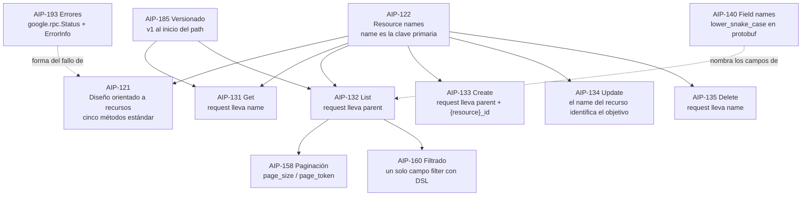

# Google AIP — `TEM-GGOOGLE`

## Resumen ejecutivo

Las *API Improvement Proposals* (`G-04`) son el corpus de diseño de APIs de Google: documentos Markdown numerados, con estado formal, editores identificados y un proceso de aprobación con firma. No es una guía de estilo con recomendaciones sueltas sino un sistema completo, donde cada AIP presupone las anteriores y donde el conjunto describe un modelo de API cerrado y notablemente coherente.

Esa coherencia es su mayor virtud y la razón por la cual adoptarlo parcialmente sale mal. Google diseña APIs desde protocol buffers y las expone en HTTP/JSON mediante un mapeo; el resultado es que decisiones que en otras guías son de estilo —cómo se llama el identificador, qué forma tiene el path, qué campos lleva una petición de listado— acá son consecuencias de un modelo de nombres jerárquicos y de cinco métodos estándar. Tomar la parte de paginación sin la parte de nombres produce una API que tiene los nombres raros de Google sin ninguna de sus ventajas.

La decisión más consecuente del sistema, y la que más choca con el resto del ecosistema, es que **`name` es la clave primaria**. AIP-122 exige que todo recurso exponga un campo `name` con su nombre de recurso completo, prohíbe las tuplas y los self-links como identificación alternativa, y prohíbe explícitamente que cualquier otro campo se llame `name`. En Heroku, en JSON:API y en la práctica general, el identificador es `id` y `name` es una etiqueta legible por humanos. Migrar entre ambas convenciones rompe a todos los clientes, y ninguna de las dos es reducible a la otra.

---

## Definición

### Qué es

Un sistema de documentos numerados que constituyen la referencia autoritativa de diseño de APIs dentro de Google, publicados en `google.aip.dev` y mantenidos en abierto. El corpus está vivo: su changelog registra actualizaciones hasta enero de 2025.

**Gobernanza.** Los mantienen los *AIP Editors*, siete personas —entre ellas Angie Lin y Jon Skeet—, con un tech lead como decisor final. Cada AIP tiene un estado formal: Draft, Reviewing, Approved, y además Withdrawn, Rejected, Deferred y Replaced. La aprobación requiere la firma de al menos dos editores, uno de los cuales debe ser el tech lead del dominio, y ausencia de objeciones activas. Ese proceso es lo que distingue a las AIPs de la mayoría de las guías corporativas: hay una decisión trazable detrás de cada prescripción, y hay un mecanismo para retirarla.

**Numeración.** Del 1 al 9 van las meta-AIPs; de 100 a 199 la guía de diseño central —conceptos, recursos, operaciones, campos, patrones—; de 200 a 236 compatibilidad, versionado y protocol buffers. El esquema completo está en AIP-2.

Las AIPs verificadas de primera mano para esta guía, y las únicas que se citan como respaldo, son **1, 121, 122, 131, 132, 133, 134, 135, 140, 158, 160, 185 y 193**. Cualquier otra que aparezca en una discusión debe verificarse antes de usarse como argumento.

### Qué problema resuelve

**Consistencia entre miles de APIs generadas.** Google no publica APIs a mano: publica definiciones en protocol buffers desde las cuales se generan superficies REST, clientes en varios lenguajes, documentación y herramientas. Un generador no admite excepciones: si el listado de recursos se llama `List` en una API y `Fetch` en otra, el generador necesita un caso especial. Las AIPs son, antes que un manual de estilo, **la especificación de entrada de una cadena de generación**. Eso explica por qué usan MUST donde otras guías usarían SHOULD, y por qué prescriben cosas que en una API escrita a mano nadie prescribiría —que el campo de resultados debe ser el primero y llevar el número de campo `1`, por ejemplo—.

**Navegabilidad de un espacio de nombres enorme.** El modelo de nombres jerárquicos de AIP-122, `publishers/123/books/les-miserables`, produce identificadores que codifican la posición del recurso en el árbol. Un solo string identifica el recurso, su padre y su tipo, sin necesidad de acompañarlo de contexto. Con decenas de miles de recursos en cientos de servicios, esa propiedad vale mucho.

**Predecibilidad de la superficie.** AIP-121 fija cinco métodos estándar —Get, List, Create, Update, Delete— y establece que *«las APIs **should** preferir los métodos estándar antes que los métodos custom»*. La consecuencia es que un desarrollador que conoce una API de Google conoce la forma del 90 % de cualquier otra, y que cada operación que no encaja tiene que justificarse.

### Qué NO es, y con qué se lo confunde

**No es un estándar.** Es la política de diseño de una empresa, publicada. Que esté bien escrita, tenga proceso de aprobación y editores identificados no le da fuerza normativa fuera de Google. La confusión es especialmente fácil acá porque las AIPs usan las keywords de RFC 2119 con rigor y se parecen mucho a una especificación.

**No es una guía de diseño de APIs REST HTTP/JSON.** Es una guía de diseño de APIs orientadas a recursos **definidas en protocol buffers**, con un mapeo a HTTP. La diferencia se vuelve concreta en un punto: AIP-140 establece que los nombres de campo *«**must** use `lower_snake_case`»* **en los archivos protobuf**, e indica que esos nombres *«se mapean a la convención de nombres apropiada en JSON y en el código generado»* — sin especificar cuál es esa convención. **El casing JSON exacto que prescribe Google no está verificado**: la práctica observable es lowerCamelCase, pero eso no se afirma acá porque AIP-140 no lo dice. Un equipo que cite «Google prescribe snake_case en JSON» está extrapolando de una regla que habla de otra cosa.

**No es un catálogo del que se toman piezas sueltas.** Es la advertencia central de este documento y la desarrolla la sección siguiente.

**No es hipermedia.** AIP-122 prohíbe expresamente los self-links: *«los recursos **must not** exponer tuplas, self-links, u otras formas de identificación de recursos»*. El modelo es de nivel 2 del modelo de madurez (`O-03`) por decisión explícita, y la identificación se resuelve con el nombre, no con el enlace.

---

## El sistema, y por qué es difícil de desarmar



La flecha que importa es la que sale de AIP-122 hacia todo lo demás. Los cinco métodos estándar se definen **en términos del nombre de recurso**: Get recibe un `name`, List recibe un `parent` que es el nombre del contenedor, Create recibe un `parent` más un identificador, Update recibe el recurso cuyo `name` señala el objetivo, Delete recibe un `name`. Quitar el modelo de nombres deja las cinco operaciones sin sujeto.

De ahí la regla práctica que esta guía recomienda: **de las AIPs se pueden tomar piezas periféricas, no centrales**. La paginación de AIP-158 es periférica y se sostiene sola. El modelo de nombres de AIP-122 es central, y adoptarlo implica arrastrar buena parte del resto.

---

## Qué prescribe, AIP por AIP

### AIP-121 — Diseño orientado a recursos

Cinco métodos estándar: Get, List, Create, Update, Delete. *«Un recurso **must** soportar como mínimo Get»* y *«**must** soportar también List, salvo los recursos singleton»*. Las relaciones entre recursos *«**must** ser representables mediante un grafo dirigido acíclico»*, lo que descarta las referencias circulares en el modelo. Y la preferencia por métodos estándar sobre métodos custom, que es la regla que gobierna las operaciones no CRUD y que trata [`TEM-ACCIONES`](../20-Diseno-de-Recursos/Operaciones-No-CRUD.md).

### AIP-122 — Resource names

La AIP más consecuente del corpus.

- El nombre es un path sin barra inicial: `publishers/123/books/les-miserables`. *«Los nombres de recurso **must** usar el carácter `/` para separar segmentos individuales»*, y los segmentos no terminales **must not** contener `/`.
- *«Los identificadores de colección **must** estar en `camelCase`»*, **must** empezar con minúscula, contener solo letras y números ASCII, ser **plurales** y únicos dentro de un mismo nombre de recurso. Hay excepción para palabras sin plural (`info`) o cuyo plural es idéntico (`moose`).
- Los identificadores provistos por el usuario **should** cumplir RFC-1034: `^[a-z]([a-z0-9-]{0,61}[a-z0-9])?$`, máximo 63 caracteres. Los caracteres no ASCII **should not** permitirse.
- *«Los recursos **must** exponer un campo `name` que contenga su nombre de recurso»*, de tipo `string`, y **should** ser el primer campo. *«Los recursos **must not** exponer tuplas, self-links, u otras formas de identificación de recursos»*. Y la regla que produce el choque: *«los campos **must not** llamarse `name` salvo para este propósito»*.
- Para referencias entre APIs existe el nombre completo, con autoridad: `//library.googleapis.com/publishers/123/books/les-miserables`.

El casing de los identificadores de colección merece atención porque es el punto donde Google contradice frontalmente a Zalando: `camelCase` obligatorio acá, `kebab-case` obligatorio en la regla 129 de `G-05`. Lo decide [`TEM-URI`](../20-Diseno-de-Recursos/Nomenclatura-de-URIs.md).

### AIP-131 a AIP-135 — Los cinco métodos estándar

| AIP | Método | Verbo y URI | Request | Response |
|---|---|---|---|---|
| 131 | Get | `GET /v1/{name=publishers/*/books/*}` | `name` requerido; **must not** haber `body`; sin filtros ni campos requeridos adicionales | El recurso mismo |
| 132 | List | `GET /v1/{parent=publishers/*}/books` | `parent` requerido si no es de nivel superior, `page_size`, `page_token`, `filter` y `order_by` opcionales; *«**must not** contener ningún otro campo requerido»* | Un campo repeated con los recursos, `next_page_token`, `total_size` opcional |
| 133 | Create | `POST` con `body` mapeado al campo del recurso | `parent`, el recurso, y `{resource}_id` — **must** para recursos de management plane, **should** para data plane, y **must** existir en el mensaje de petición y no en el recurso, con lo que en REST viaja como query param | El recurso creado, completamente poblado |
| 134 | Update | `PATCH /v1/{book.name=publishers/*/books/*}` con `body: "book"` | El recurso, cuyo `name` identifica el objetivo, más `update_mask` opcional; `allow_missing` habilita upsert | El recurso actualizado |
| 135 | Delete | `DELETE /v1/{name=publishers/*/books/*}` | `name` requerido; `etag`, `force`, `allow_missing` opcionales; **must not** haber `body` | **Should** ser `google.protobuf.Empty` |

Cuatro detalles con consecuencias fuera de Google:

**El nombre del RPC es normativo.** Cada AIP exige que el método empiece por el verbo correspondiente y que el mensaje de petición lleve el sufijo `Request`. En una API REST escrita a mano eso es invisible; en la cadena de generación de Google es lo que hace que el cliente tipado tenga los nombres correctos.

**`update_mask` y la razón declarada para preferir PATCH.** AIP-134 establece que *«el servicio **must** tratar una máscara de campos omitida como una máscara implícita equivalente a todos los campos que estén poblados»*, y prescribe **SHOULD** usar `PATCH` y no `PUT` con un argumento concreto: con PUT, agregar campos nuevos al recurso provoca el borrado accidental de los que el cliente viejo no especifica. Es el mismo mandato que `G-02` de Microsoft, alcanzado por un razonamiento distinto, y es una de las poquísimas coincidencias entre las dos guías. Lo desarrolla [`TEM-PATCH`](../40-Contratos-y-Representaciones/Actualizaciones-Parciales.md).

**El borrado con hijos.** *«La API **must** fallar con un error `FAILED_PRECONDITION` si hay recursos hijos presentes»*, salvo que llegue `force: true`. Un etag que no coincide produce `ABORTED`. Es una prescripción de semántica de dominio, no de estilo, y es de las más portables del corpus.

**El filtrado en Get está prohibido.** AIP-131 no admite filtros ni campos requeridos adicionales en la petición de obtención. Es una restricción que evita el endpoint que empieza siendo un Get y termina siendo una consulta.

### AIP-140 — Field names

*«Las definiciones de campo en archivos protobuf **must** usar nombres en `lower_snake_case`»*. Ninguna palabra **must not** empezar con número; no puede haber underscores iniciales, finales ni adyacentes. **Should** usarse las abreviaturas bien conocidas —`config`, `id`, `info`, `spec`, `stats`—; **should** evitarse las keywords de los lenguajes comunes; **should not** incluirse preposiciones como `with`, `for`, `at` o `by`, con la excepción de `per` para unidades.

Y el punto de ambigüedad ya señalado: el AIP indica que los nombres *«se mapean a la convención de nombres apropiada en JSON y en el código generado»* **sin especificar el casing JSON**. Cualquier afirmación sobre qué casing JSON prescribe Google excede lo que la fuente dice, y esta guía no la hace.

### AIP-158 — Paginación

Petición: `int32 page_size` y `string page_token`. Respuesta: `string next_page_token`.

*«El campo `page_size` **must not** ser requerido»*; un valor negativo produce `INVALID_ARGUMENT`. Si no se especifica o vale `0`, la API elige un default que **should** documentar; si excede el máximo, **should** hacer coerción hacia abajo en lugar de fallar. *«El campo `page_token` **must not** ser requerido»*. Al final de la colección `next_page_token` **must** estar vacío, y si no es el final la API **must** proveerlo. La regla que define el modelo: *«los page tokens provistos por las APIs **must** ser strings opacos (aunque seguros para URL), y **must not** ser parseables por el usuario»*. El campo de resultados **should** ser el primero y llevar el número de campo `1`.

La prohibición de tokens parseables es lo que convierte esto en cursor puro, y es incompatible en modelo mental con el `skip`/`top` que ofrece `G-01`. Lo decide [`TEM-PAG`](../40-Contratos-y-Representaciones/Colecciones-y-Paginacion.md).

### AIP-160 — Filtrado

Un único campo `string filter` con un DSL propio: `AND`, `OR`, `NOT` y `-`, los comparadores `=`, `!=`, `<`, `>`, `<=`, `>=`, traversal con `.`, el operador *has* con `:` y comodín `*`. Los campos van siempre a la izquierda y los literales a la derecha.

Trae una trampa que conviene señalar porque rompe la intuición de cualquiera que venga de SQL o de un lenguaje imperativo: **`OR` tiene mayor precedencia que `AND`**, al revés de lo habitual. Es un detalle de nota al pie con capacidad de producir consultas que devuelven silenciosamente el conjunto equivocado.

### AIP-185 — Versionado

*«Las APIs de Google **must not** exponer números de versión menor o de parche. Por ejemplo, las APIs de Google usan `v1`, no `v1.0`, `v1.1` ni `v1.4.2»*.

La versión **must** aparecer en dos lugares: al final del package de protobuf, y como **la primera parte del path URI REST**. Los pre-releases se nombran `v1alpha` y `v1beta` por canal, o `v1alpha5` y `v1beta1` por release.

Tres canales por versión mayor: alpha, que puede removerse sin aviso; beta, con 180 días de deprecación recomendados; y stable, sin sufijo. La relación entre ellos es de inclusión: *«la funcionalidad del canal beta **must** ser un superconjunto de la del canal stable… y la del canal alpha **must** ser un superconjunto de la del beta»*. La funcionalidad deprecada **must not** graduar entre niveles de estabilidad. Y una regla estructural que se olvida seguido: *«una versión mayor nueva de una API **must not** depender de una versión mayor anterior de la misma API»*.

Este es el otro extremo de la contradicción de tres bandas sobre versionado: Google **exige** en el path lo que `G-05` regla 115 **prohíbe**, y prohíbe el minor/patch que `G-05` regla 116 exige en SemVer —aunque en superficies distintas, la URL contra el metadato de la especificación—. Lo decide [`TEM-VERS`](../50-Evolucion-y-Versionado/Estrategias-de-Versionado.md).

### AIP-193 — Errores

El modelo es `google.rpc.Status`, con `code` —un enum `google.rpc.Code`, donde por ejemplo 5 es `NOT_FOUND`—, `message` para el desarrollador y en inglés, y `details`, un array de `google.protobuf.Any`.

*«Todas las respuestas de error **must** incluir un `ErrorInfo` dentro de `details»*, con tres campos:

- `reason`: UPPER_SNAKE_CASE, máximo 63 caracteres, patrón `[A-Z][A-Z0-9_]+[A-Z0-9]`.
- `domain`: una agrupación globalmente única, típicamente el nombre del servicio, como `pubsub.googleapis.com`.
- `metadata`: pares clave-valor, con claves de hasta 64 caracteres y patrón `[a-z][a-zA-Z0-9-_]+`.

El par `(reason, domain)` es el identificador legible por máquina y *«**must** ser el mismo para el mismo error»* entre llamadas. Los mensajes *«**must not** asumir que el usuario sabe algo sobre la implementación subyacente»*, y toda información contextual del mensaje *«**must** incluirse como metadata dentro del `ErrorInfo»*. Es una prescripción con consecuencia práctica fuerte: prohíbe que el cliente tenga que parsear el texto del mensaje para extraer datos.

En el mapeo HTTP/JSON, `code` lleva el status HTTP —404— y `status` lleva el nombre del enum —`NOT_FOUND`—.

Y una regla de seguridad que trasciende el estilo: *«si el usuario no tiene permiso para acceder al recurso o al padre, exista o no, el servicio **must** fallar con `PERMISSION_DENIED` (HTTP 403)»*. Es decir, no filtrar la existencia de un recurso mediante un 404. Es exactamente la tensión que `ACT-07` plantea en [`MARCO-ACTORES`](../00-Marco-de-Referencia/Actores.md), resuelta por mandato y en contra de la intuición corriente, que suele preferir el 404 para no confirmar nada. La discute [`TEM-ERR`](../40-Contratos-y-Representaciones/Manejo-de-Errores.md).

---

## Aplicación por escenario

### `ESC-1` — API nueva

Es el único escenario donde adoptar el sistema completo es viable, porque exige decisiones que después no se revierten sin romper todo. La pregunta previa no es si las AIPs son buenas —lo son, dentro de su modelo— sino si la organización tiene el problema que resuelven.

La respuesta afirmativa se parece a esto: hay muchas APIs, muchos equipos, un generador de clientes en el medio, y una jerarquía de recursos real y profunda. La respuesta negativa se parece a un sistema de reservas de salas con cuatro entidades, un equipo y dos consumidores. Adoptar AIP-122 en ese caso significa cambiar `id` por `name`, ponerle a la clave primaria un string con forma de path, y explicarle a cada desarrollador nuevo por qué el nombre de la sala no está en el campo `name`.

Hay una excepción que esta guía sí recomienda considerar en `ESC-1`: **AIP-158 como modelo de paginación**. Es autocontenida, la disciplina del token opaco resuelve un problema real —que el cliente se acople a la mecánica interna de paginación y bloquee el cambio de estrategia—, y no arrastra el resto del sistema.

### `ESC-2` — Exposición o migración

Aplica de forma limitada y con un riesgo específico. AIP-122 produce identificadores jerárquicos que codifican la posición del recurso en un árbol; si el sistema heredado no tiene esa jerarquía, hay que inventarla, y una jerarquía inventada para satisfacer una convención es peor que ninguna. La prueba está en [`TEM-JERARQ`](../20-Diseno-de-Recursos/Jerarquias-y-Relaciones.md): un recurso pertenece a otro cuando no tiene sentido fuera de él, no cuando la convención pide un `parent`.

Lo que sí es directamente aprovechable en `ESC-2` es AIP-121 como **herramienta de descarte**: el criterio de que un recurso debe soportar al menos Get, y List salvo que sea singleton, detecta con eficacia los pseudo-recursos que un modelo interno filtra hacia la API.

### `ESC-3` — Evolución en producción

Adoptar AIP-122 sobre una API publicada es de los cambios más rompientes posibles: cambia el identificador de todos los recursos, en tipo y en semántica. No hay migración compatible; hay versión nueva. Y AIP-185 agrega una restricción sobre esa versión nueva que conviene leer antes de prometerla: *«una versión mayor nueva **must not** depender de una versión mayor anterior»*, lo que en la práctica significa reimplementar en lugar de envolver.

Lo aditivo sí funciona. Agregar `ErrorInfo` a un cuerpo de error existente es compatible si el cliente ignora campos desconocidos; empezar a devolver `next_page_token` junto al mecanismo de paginación previo también.

### `ESC-4` — Evaluación de una API ajena

Es el escenario de mayor rendimiento inmediato, porque las AIPs describen un sistema **reconocible a simple vista**. Un `GET` cuya respuesta trae un campo `name` con forma de path y un `nextPageToken` es, con altísima probabilidad, una API construida sobre este corpus; de ahí se infiere el resto de la superficie sin leerla: los métodos van a llamarse Get/List/Create/Update/Delete, la actualización va a ser PATCH con máscara de campos, el borrado con hijos va a fallar salvo `force`, y el error va a traer `ErrorInfo` con su par `(reason, domain)`.

En `ESC-4a`, con la especificación a la vista, la evaluación se vuelve casi mecánica: las AIPs son lo bastante precisas como para funcionar de lista de verificación. En `ESC-4b`, la señal más barata de detectar es la forma del identificador.

### Qué cambia según el contexto

| Contexto | Qué cambia respecto de las AIPs |
|---|---|
| `CTX-1` pública | Es el contexto para el que el sistema fue diseñado, y donde la disciplina de tokens opacos y de `(reason, domain)` estables paga: le da al productor libertad para cambiar la implementación sin romper a integradores que no puede consultar |
| `CTX-2` interna | Casi todo el aparato sobra. Lo que sí conviene rescatar es el criterio de errores: un `reason` estable en UPPER_SNAKE_CASE es infinitamente más útil para un servicio que consume a otro que un mensaje en prosa, y no cuesta nada |
| `CTX-3` backend de app propia | El conflicto `name` contra `id` se vuelve incómodo: los frameworks de cliente —incluidos los de .NET— asumen `id`, y pelearse con esa suposición en una app propia es costo sin destinatario |
| `CTX-4` integración | Se consume: varias APIs de Google siguen este modelo. Lo que se decide es dónde traducir el nombre jerárquico a la identidad del dominio propio, y la respuesta razonable es en la capa de aislamiento, no en el dominio |

---

## Ejemplos concretos

Listar las reservas de una sala, según AIP-132 y AIP-158, con el modelo de nombres de AIP-122 y la versión en el path de AIP-185:

```http
GET /v1/salas/a3f1/reservas?pageSize=20&pageToken=Q2lRSU9EZ3lNVEExTmc9PQ&orderBy=fechaInicio HTTP/1.1
Host: reservas.ejemplo.com
Accept: application/json
```

```http
HTTP/1.1 200 OK
Content-Type: application/json

{
  "reservas": [
    {
      "name": "salas/a3f1/reservas/9012",
      "sala": "salas/a3f1",
      "fechaInicio": "2026-08-01T09:00:00Z",
      "estado": "CONFIRMADA"
    }
  ],
  "nextPageToken": "Q2lRSU9EZ3lNVEExTndhPT0",
  "totalSize": 143
}
```

Cuatro cosas que este bloque muestra y que ninguna otra guía produciría.

**El campo `name` es el identificador y contiene el path completo**, incluido el segmento del padre. No hay campo `id`. Y por AIP-122, **ningún otro campo puede llamarse `name`**: si la reserva tuviera un título legible, habría que llamarlo `titulo` o `displayName`, nunca `name`. Es la restricción que rompe la intuición de todos los que vienen del resto del ecosistema.

**La referencia al padre también es un nombre**, no un identificador suelto: `"sala": "salas/a3f1"` y no `"salaId": "a3f1"`.

**El identificador de colección es plural y camelCase** en el path, por AIP-122. Con un recurso compuesto —`salasDeReunion`— la diferencia con el `kebab-case` de Zalando se vuelve visible.

**El token es opaco.** Por AIP-158 **must not** ser parseable por el usuario, lo que significa que un cliente que intente decodificarlo para saltar páginas está usando algo que no le fue prometido, y que el servidor puede cambiar la estrategia de paginación entera sin romper a nadie.

Sobre el casing de las claves JSON del ejemplo —`pageSize`, `nextPageToken`, `fechaInicio`— corresponde la advertencia ya hecha: **AIP-140 normaliza `lower_snake_case` solo en protobuf y no especifica el casing JSON**, de modo que el ejemplo refleja la práctica observable de Google y no una prescripción verificada. El nombre canónico de los campos, según la fuente, es `page_size`, `page_token`, `next_page_token`, `order_by` y `total_size`.

### El mismo error de validación

Una reserva cuya fecha de fin precede a la de inicio, según AIP-193:

```http
HTTP/1.1 400 Bad Request
Content-Type: application/json

{
  "error": {
    "code": 400,
    "message": "El rango de fechas solicitado no es válido.",
    "status": "INVALID_ARGUMENT",
    "details": [
      {
        "@type": "type.googleapis.com/google.rpc.ErrorInfo",
        "reason": "RANGO_DE_FECHAS_INVALIDO",
        "domain": "reservas.ejemplo.com",
        "metadata": {
          "campo": "fecha_fin",
          "fecha_inicio": "2026-08-01T09:00:00Z",
          "fecha_fin": "2026-08-01T08:00:00Z"
        }
      }
    ]
  }
}
```

El contraste con el ejemplo equivalente de [`TEM-GMS`](Microsoft-y-Azure.md) es instructivo. En el modelo de Microsoft, la información contextual vive en el `message` y en `details`, con estructura libre. Acá el mandato es explícito: toda información contextual del mensaje **must** ir como metadata dentro de `ErrorInfo`, de modo que el cliente nunca tenga que parsear texto. El par `(reason, domain)` es el que el cliente ramifica, y es estable entre llamadas por prescripción.

El mismo bloque muestra también la duplicación deliberada: `code` lleva el status HTTP y `status` lleva el nombre del enum. Es redundante a propósito, porque el mismo modelo de error sirve a la superficie gRPC y a la superficie HTTP.

Ninguno de estos formatos es `application/problem+json` de `N-04`. De las guías mayores, solo Zalando adopta el estándar del IETF, y lo trata [`TEM-GOTRAS`](Zalando-y-otras.md).

---

## Para qué organización tiene sentido adoptarlo

La pregunta correcta no es si el sistema es bueno sino si el problema coincide. Esta guía recomienda evaluar cuatro condiciones, y considerar la adopción completa solo cuando se cumplen al menos tres:

**Escala de superficie.** Muchas APIs, muchos equipos, y un consumidor que atraviesa varias. La predecibilidad entre APIs es el beneficio central del corpus, y con una sola API no hay entre qué predecir.

**Generación en el medio.** Si hay una cadena que produce clientes tipados, documentación o SDKs desde una definición, la ausencia de casos especiales que las AIPs imponen se convierte en valor directo. Sin generador, buena parte del rigor es costo sin retorno: la regla de que el campo de resultados lleve el número de campo `1` no le sirve a nadie que escriba JSON a mano.

**Jerarquía real.** El modelo de nombres paga cuando los recursos efectivamente anidan y el consumidor navega esa jerarquía. Un dominio plano gana poco y paga la rareza completa.

**Tolerancia al conflicto con el ecosistema.** Adoptar `name` como clave primaria es aceptar que las herramientas, los frameworks de cliente y los desarrolladores nuevos van a asumir `id` y van a estar equivocados. Es un costo permanente de fricción, no un costo de migración.

Para el destinatario típico de esta guía —un equipo .NET con una API de dominio acotado— la recomendación de esta guía es **no adoptar el sistema completo, y sí estudiarlo**. Las AIPs son el corpus mejor razonado del material disponible, y leer AIP-121, AIP-131 a 135 y AIP-193 mejora el criterio de diseño con independencia de qué se adopte después.

---

## Preguntas guía

- ¿Tengo el problema que las AIPs resuelven, o solo el prestigio de la fuente?
- Si adopto AIP-122, ¿estoy dispuesto a que ningún campo de ninguno de mis recursos pueda llamarse `name`, para siempre?
- ¿Mi jerarquía de recursos es real o la estoy inventando para tener un `parent` que poner en el request de List?
- ¿Puedo tomar AIP-158 sin tomar AIP-122? ¿Y AIP-132 sin AIP-122? ¿Por qué la respuesta es distinta?
- Si alguien cita «la AIP de X» en una discusión, ¿está entre las verificadas, o hay que verificarla antes de aceptar el argumento?
- Cuando esta guía dice que Google usa lowerCamelCase en JSON, ¿lo dice AIP-140 o lo estoy infiriendo de la práctica?
- La regla de `PERMISSION_DENIED` en lugar de 404 aunque el recurso no exista, ¿me conviene a mí, o le conviene a una plataforma con superficie de ataque global?

---

## Criterios de calidad

Una adopción de las AIPs está bien hecha cuando la organización puede señalar qué AIPs adoptó **por número**, cuando esas AIPs forman un conjunto coherente —esto es, cuando ninguna adoptada depende de una descartada— y cuando la elección se justifica por el problema y no por la marca. Está mal hecha cuando aparece un `name` con forma de path en una API que por lo demás usa `id`, porque alguien copió un ejemplo.

La señal de salud más útil es la coherencia interna del corte. Adoptar AIP-158 sola es defendible. Adoptar AIP-132 sin AIP-122 no lo es, porque el `parent` del request de listado no significa nada sin el modelo de nombres.

### Antipatrones

**Tomar `name` sin tomar el sistema.** Es el error más caro y el más frecuente. Un recurso con un campo `name` que contiene `"Sala Belgrano"` y otro campo `id` con la clave no está siguiendo AIP-122: está usando el nombre de campo de Google con la semántica de todos los demás, que es exactamente la combinación que confunde a cualquiera que conozca alguno de los dos modelos.

**Presentar una AIP como estándar.** «Está en la AIP-158» no es un argumento de autoridad equivalente a «está en RFC 9110». Corresponde nombrar la organización, como pide [`MARCO-CONVENCIONES`](../00-Marco-de-Referencia/Convenciones.md): «Google prescribe en AIP-158 que…».

**Citar una AIP no verificada.** El corpus tiene cientos de documentos con estados formales distintos, incluidos Withdrawn, Rejected y Replaced. Citar un número sin haber comprobado su estado puede estar invocando una propuesta retirada.

**Atribuirle a Google un casing JSON que AIP-140 no prescribe.** La AIP normaliza protobuf y menciona el mapeo sin definirlo. Toda afirmación sobre el casing JSON de Google es inferencia de la práctica, y debe presentarse como tal.

**Adoptar el DSL de AIP-160 sin advertir la precedencia de `OR`.** Un filtro `a = 1 AND b = 2 OR c = 3` no significa lo que significaría en SQL. Prescribir la sintaxis sin documentar esa inversión garantiza consultas silenciosamente equivocadas.

**Usar los cinco métodos estándar como argumento contra toda operación no CRUD.** AIP-121 dice **should** preferir los estándar, no **must** usar solo los estándar. El propio corpus admite métodos custom. Convertir esa preferencia en prohibición produce el antipatrón inverso: procesos de negocio disfrazados de actualizaciones de campo.

---

## Anexo — Ficha de evaluación de adopción

```yaml
aips_evaluadas: []                # por número; solo las verificadas cuentan como respaldo
aips_adoptadas: []
aips_descartadas: []              # cada una con su razón

condiciones_de_adopcion:
  cantidad_de_apis: 1 | pocas | muchas
  generacion_de_clientes: si | no
  jerarquia_de_recursos_real: si | no | inventada
  tolerancia_al_conflicto_con_id: si | no

coherencia_del_corte:
  adopto_122_nombres: si | no
  adopta_alguna_que_dependa_de_122: si | no    # si es "si" y la anterior es "no", el corte es incoherente

conflictos_declarados:
  identificador: "name (AIP-122)" | "id (resto del ecosistema)"
  casing_de_colecciones: "camelCase (AIP-122)" | "kebab-case (G-05 regla 129)" | otro
  version_en_path: "exigida (AIP-185)" | "prohibida (G-05 regla 115)" | otro

no_verificado:
  casing_json_prescrito_por_google: true   # AIP-140 no lo especifica; no citarlo como prescripción
```

El bloque `coherencia_del_corte` es el que detecta el error más común de esta familia. Adoptar AIP-132 o AIP-131 sin AIP-122 produce una API que pide un `parent` y devuelve un `name` sin haber adoptado el modelo que le da sentido a ninguno de los dos.
