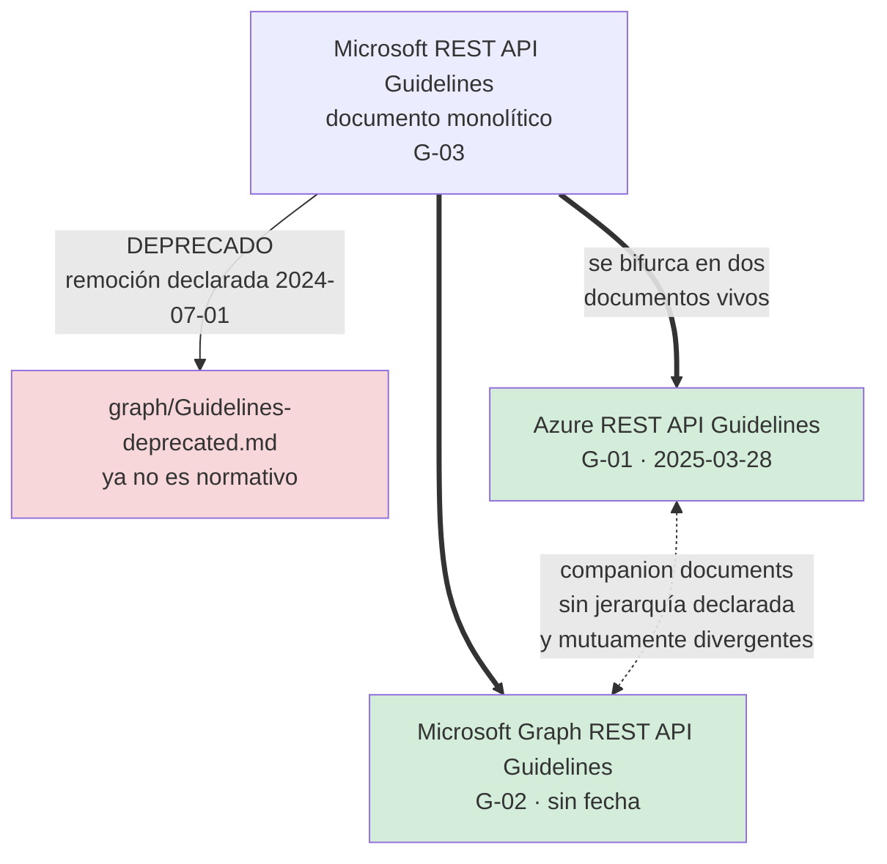

# Microsoft y Azure — `TEM-GMS`

## Resumen ejecutivo

«Las guías de Microsoft» es, a julio de 2026, una expresión sin referente único. El documento que la industria cita con ese nombre —la *Microsoft REST API Guidelines* monolítica, publicada en la raíz de `microsoft/api-guidelines`— **está deprecado**, con un aviso explícito de fusión y una fecha de remoción declarada el 2024-07-01 (`G-03`). Lo que quedó vivo son dos guías: la de Azure (`G-01`, fechada 2025-03-28) y la de Microsoft Graph (`G-02`, sin fecha en el documento). El README del repositorio las describe como *companion documents* y no declara cuál prevalece.

El problema es que no son compatibles. Azure pagina con `skip` y `top` sin prefijo y versiona con un parámetro de query con fecha; Graph pagina con `$skip` y `$top` de OData y versiona con dos endpoints en el path. Un equipo que decide «seguimos a Microsoft» todavía no decidió nada: tiene que elegir cuál de las dos, y las dos ramas divergen en casi todos los puntos donde la elección se nota.

Para un equipo .NET esto tiene una consecuencia adicional y contraintuitiva. La cercanía entre el vendor del framework y el vendor de la guía sugiere una coherencia que no existe: ASP.NET Core no implementa ninguna de las dos guías, y su único default alineado con ellas —`camelCase` en JSON— proviene de `JsonSerializerDefaults.Web` (`N-39`), no de una decisión de conformidad. Este documento recorre el linaje, contrasta las dos guías vivas punto por punto, y desarma el argumento «lo hace Microsoft, luego hay que hacerlo».

---

## Definición

### Qué es

El repositorio `microsoft/api-guidelines` es el sitio público donde Microsoft mantiene las prescripciones de diseño de APIs HTTP de dos de sus plataformas. Está activo: 949 commits en la rama `vNext`, 39 pull requests abiertos, 129 issues, 23,3 mil estrellas, sin aviso de archivo. Contiene tres documentos relevantes para esta discusión, con estados distintos:

| Documento | ID | Estado a 2026-07-20 |
|---|---|---|
| `graph/Guidelines-deprecated.md` | `G-03` | **Deprecado.** Aviso de fusión con Graph; remoción declarada 2024-07-01 |
| `azure/Guidelines.md` | `G-01` | **Activo.** Documento fechado 2025-03-28 |
| `graph/GuidelinesGraph.md` | `G-02` | **Activo.** Sin fecha de publicación en el documento (no verificada) |

`G-01` prescribe el diseño de los servicios del plano de Azure: recursos gestionados, operaciones de larga duración, control plane y data plane. `G-02` prescribe el diseño de Microsoft Graph, que es una API de datos de productividad construida sobre OData y con dos superficies públicas simultáneas. Son documentos con destinatarios distintos y presiones distintas, y esa es la explicación honesta de por qué divergen.

### Qué problema resuelve

**Coherencia entre cientos de equipos que publican bajo un mismo dominio.** Azure expone decenas de servicios construidos por organizaciones internas independientes; sin una prescripción común, un consumidor tendría que aprender un dialecto por servicio. La guía existe para que `api-version` signifique lo mismo en todos, para que el objeto de error tenga la misma forma en todos, y para que un SDK generado pueda dar por sentadas esas invariantes. Ese es el problema real, y explica varias decisiones que fuera de ese contexto parecen arbitrarias: la exigencia de `api-version` **en toda operación**, sin excepción, solo tiene sentido cuando el generador de SDK necesita una regla sin casos especiales.

**Compatibilidad con un ecosistema de herramientas preexistente.** Graph usa `$top`, `$skip`, `$filter` y `nextLink` porque está construida sobre OData, que es un estándar OASIS (`N-21`) con clientes, bibliotecas y consultores. La decisión no fue de estilo: fue de interoperabilidad con lo que ya existía.

### Qué NO es, y con qué se lo confunde

**No es documentación normativa de .NET ni de ASP.NET Core.** Es la confusión más costosa para el destinatario de esta guía. `G-01` y `G-02` prescriben el diseño de servicios que Microsoft opera; no describen ni condicionan el framework. La documentación de primera parte de Microsoft sobre versionado de APIs es `N-60`, en el Azure Architecture Center, y opera en otro plano: enumera cinco enfoques —sin versionado, URI, query string, header y media type— **sin prescribir ninguno**. Un lector que busca «la postura de Microsoft» encuentra en `N-60` una postura neutral y en `G-01` un mandato; no se contradicen porque no son el mismo tipo de documento.

**No es un estándar, aunque cite estándares.** `G-01` remite a RFC 3339 para fechas en JSON y a RFC 7231 para fechas en cabeceras. Que una guía cite normas no la vuelve normativa: la parte citada obliga, el resto es política de Microsoft. Nótese además que la referencia a RFC 7231 apunta a un documento obsoleto desde junio de 2022, reemplazado por `N-01` (RFC 9110); la prescripción de formato sigue siendo correcta, la cita no.

**No es un documento único con una postura única.** Escribir «Microsoft prescribe X» sin decir cuál de las dos guías es, en general, incorrecto. La sección siguiente muestra cuánto.

---

## El linaje y la bifurcación



Lo que prescribía el documento deprecado, y que sigue circulando atribuido a Microsoft sin aclaración:

- Nombres de propiedades JSON **SHOULD** en `camelCase`.
- Versionado `Major.Minor`, en el path como opción preferida o como query `?api-version=1.0`.
- Paginación dirigida por el cliente con `$top` y `$skip`; dirigida por el servidor con `@nextLink`.
- Error: un objeto JSON único con una propiedad `error` que contiene `code` y `message` requeridos, más `target`, `details` e `innererror` opcionales.

De esas cuatro, la primera sobrevivió en ambas ramas, la última sobrevivió con variaciones, y las dos del medio se partieron. El versionado `Major.Minor` en el path **no sobrevivió en ninguna de las dos**: es la prescripción de Microsoft más citada y la más muerta.

---

## Qué prescribe cada guía viva

| Decisión | `G-01` Azure (2025-03-28) | `G-02` Microsoft Graph |
|---|---|---|
| **Casing de campos JSON** | *«use camel case for all JSON field names»* | **MUST** lower camel case (`automaticRepliesStatus`); acrónimos de dos letras con casing consistente (`ioLimit`, `driveId`) |
| **Casing de segmentos de URI** | *«use kebab-casing (preferred) or camel-casing for URL path segments»*; segmentos tratados como sensibles a mayúsculas | Colecciones en plural (`/addresses`); tipos en singular (`address`) |
| **Estructura de la URL** | `https://<tenant>.<region>.<service>.<cloud>/<service-root>/<resource-collection>/<resource-id>` | — |
| **Versionado** | Query param `api-version` **requerido en toda operación**, formato `YYYY-MM-DD`, sufijo `-preview`. Ej. `?api-version=2021-06-04-preview` | Dos endpoints públicos: `v1.0` (GA, estable) y `beta` (se permiten cambios rompientes) |
| **Deprecación** | Referencia a una Azure Breaking Change Policy no enumerada en el documento (texto no verificado) | Mínimo **36 meses** para GA, o 24 con evidencia de no uso |
| **Paginación** | `skip` (default 0), `top` (mínimo 1), `maxpagesize`; respuesta con array en `value` más `nextLink` | **MUST** soportar `nextLink` (OData, dirigida por el servidor); **SHOULD** `$top`/`$skip`; **MAY** `$skiptoken` |
| **Filtrado y proyección** | `filter`, `orderby`, `select`, `expand` | **SHOULD** `$filter` con los operadores `eq` y `ne` |
| **Errores** | `{"error": {"code", "message", "target", "details": [], "innererror": {}}}` más cabecera de respuesta `x-ms-error-code` **requerida** | Objeto `error` con `code` obligatorio en camelCase, coincidiendo con la descripción del status HTTP, `message`, y `target` opcional |
| **Verbo de actualización** | — | **MUST NOT** usar PUT para actualizaciones; usar PATCH |
| **Fechas** | RFC 3339 en query y en JSON; RFC 7231 en cabeceras | — |

### La contradicción interna, punto por punto

Cuatro divergencias, ordenadas por cuánto se notan en el cable:

**El prefijo `$`.** Azure escribe `skip`, `top`, `filter`, `orderby`, `select`, `expand`. Graph escribe `$skip`, `$top`, `$filter`. Son los mismos parámetros con distinto nombre, lo que significa que un cliente escrito contra una superficie no funciona contra la otra ni siquiera para la operación más trivial. El origen es que Graph adhiere a la convención OData y Azure decidió no hacerlo.

**Dónde vive la versión.** Azure la pone en la query, obligatoria en toda operación, con formato de fecha. Graph la pone en el path y solo admite dos valores, `v1.0` y `beta`. Son modelos mentales opuestos: Azure versiona de forma continua y granular —cada fecha es una versión—, Graph mantiene exactamente dos superficies y promueve funcionalidad de una a otra.

**La cabecera de error.** Azure exige `x-ms-error-code` en la respuesta y que su valor coincida con el `code` del cuerpo. Graph no la menciona. Un cliente que se apoye en la cabecera para clasificar errores sin parsear el cuerpo funciona contra Azure y falla contra Graph.

**El mandato sobre PUT.** Graph es explícita: **MUST NOT** usar PUT para actualizaciones. `G-01` no contiene una prohibición equivalente en el documento consultado. Es la divergencia menos visible y la más interesante, porque coincide con `G-04` AIP-134 de Google: la única área donde dos vendors que se contradicen en todo lo demás llegaron a la misma conclusión.

---

## Aplicación por escenario

### `ESC-1` — API nueva

Es donde estas guías son más útiles y más peligrosas a la vez. Útiles porque `G-01` es un documento maduro, con las decisiones tomadas de forma coherente y con las razones a la vista; adoptarlo entero le ahorra a un equipo semanas de discusiones que ya tuvo otro. Peligrosas porque arrastra decisiones tomadas para una plataforma multi-tenant global: la estructura de URL `<tenant>.<region>.<service>.<cloud>` no le sirve a una API de reservas de salas, y la exigencia de `api-version` en toda operación —incluyendo la primera, cuando todavía no hay nada que versionar— es ceremonia comprada a cambio de una opción futura.

El criterio que esta guía recomienda para `ESC-1`: adoptar de `G-01` las decisiones baratas y coherentes —casing, forma del objeto de error, nombre del campo de la colección— y decidir por separado el versionado, que es la parte más cara y la que más depende del contexto.

### `ESC-2` — Exposición o migración

Aplica con una salvedad importante. Un sistema heredado que se expone tiende a producir nombres de campo con la forma que tenían adentro —`FECHA_INICIO`, `IdReservaCabecera`—, y adoptar el `camelCase` de `G-01` o `G-02` es una decisión de traducción explícita, con su costo de mapeo. Ese costo es exactamente lo que [`MARCO-ESCENARIOS`](../00-Marco-de-Referencia/Escenarios.md) describe como el precio de no acoplar el contrato público a la base de datos, y conviene declararlo.

Hay un caso específico donde la guía de Graph se vuelve relevante más allá del estilo: si el sistema previo ya expone OData —cosa frecuente en el ecosistema Microsoft, con WCF Data Services o Web API OData— la superficie con `$top`, `$skip` y `$filter` ya existe, y `G-02` describe cómo se ve una API OData bien diseñada. Migrar a la convención de Azure implicaría renombrar todos los parámetros.

### `ESC-3` — Evolución en producción

Adoptar cualquiera de las dos guías sobre una API con consumidores es un cambio rompiente masivo. Renombrar campos de `snake_case` a `camelCase` rompe a todo cliente que deserialice con nombres exactos; cambiar el formato del error rompe a todo cliente que ramifique sobre él; agregar `api-version` como parámetro **requerido** rompe a todo cliente existente por definición. La conformidad no es un objetivo que justifique por sí solo una versión nueva.

Lo que sí se puede tomar de `G-01` en `ESC-3` sin romper nada son las decisiones aditivas: agregar la cabecera `x-ms-error-code` junto al cuerpo que ya se devuelve, adoptar el criterio de **omitir** `nextLink` en la última página en lugar de mandarlo con valor nulo, empezar a documentar fechas en RFC 3339 si ya se emitían así. La política de deprecación de Graph —36 meses de soporte para GA, o 24 con evidencia de no uso— es un dato útil como referencia de mercado para negociar la propia, y lo trata [`TEM-DEPR`](../50-Evolucion-y-Versionado/Deprecacion-y-Retiro.md).

### `ESC-4` — Evaluación de una API ajena

Es el escenario donde este documento rinde más, y por una razón operativa: **reconocer el sistema prescriptivo permite predecir lo que todavía no se leyó**. Una API que responde con un cuerpo `{"error": {"code": ..., "message": ...}}` y una cabecera `x-ms-error-code` casi con seguridad sigue `G-01`, y de ahí se deduce que va a haber `api-version` obligatorio, que la colección viene en un campo `value` y que el enlace a la siguiente página se llama `nextLink` y desaparece al final. En `ESC-4b`, donde el contrato se infiere desde afuera, esa capacidad de anticipación reduce la cantidad de sondeos necesarios.

La advertencia simétrica es que la conformidad declarada y la real divergen. Que una documentación diga «seguimos las guías de Microsoft» no dice cuál de las dos, ni si la sigue completa. Vale registrarlo como hipótesis, en los términos que `ESC-4b` exige.

### Qué cambia según el contexto

| Contexto | Qué cambia respecto de estas guías |
|---|---|
| `CTX-1` pública | Es donde más rinde adoptar una guía entera y publicada: el integrador que ya conoció una API Azure reconoce la forma y su curva de aprendizaje baja. La contrapartida es que la conformidad se vuelve promesa, y desviarse en un endpoint es deuda visible |
| `CTX-2` interna | El valor cae. Lo que compra una guía corporativa —predecibilidad ante consumidores que no se pueden consultar— no hace falta cuando el consumidor está a un chat de distancia. Adoptar `G-01` completo acá suele ser ceremonia; adoptar solo el formato de error suele ser suficiente |
| `CTX-3` backend de app propia | Sirve el `camelCase`, que además es gratis en .NET por `N-39`, y sirve el formato de error. El versionado por `api-version` obligatorio recién se justifica cuando hay clientes instalados que no se actualizan, típicamente MAUI |
| `CTX-4` integración | No se elige: se padece. Consumir Graph obliga a `$top`/`$skip`, consumir un servicio de Azure obliga a `api-version`. Lo que sí se decide es dónde se traduce esa convención ajena para que no circule por el dominio propio |

---

## Ejemplos concretos

El mismo caso —listar las reservas de una sala, paginadas— resuelto según cada rama de Microsoft. Los ejemplos son sintéticos y usan el dominio de reserva de salas; el idioma de los identificadores es español porque el dominio es de esta guía, mientras que los nombres de parámetros y de campos estructurales reproducen lo que cada guía prescribe.

### Según `G-01` — Azure

```http
GET /salas/a3f1/reservas?api-version=2026-07-01&top=20&skip=40&orderby=fechaInicio HTTP/1.1
Host: api.reservas.ejemplo.com
Accept: application/json
```

```http
HTTP/1.1 200 OK
Content-Type: application/json

{
  "value": [
    { "id": "r-9012", "salaId": "a3f1", "fechaInicio": "2026-08-01T09:00:00Z", "estado": "confirmada" },
    { "id": "r-9013", "salaId": "a3f1", "fechaInicio": "2026-08-01T11:00:00Z", "estado": "pendiente" }
  ],
  "nextLink": "https://api.reservas.ejemplo.com/salas/a3f1/reservas?api-version=2026-07-01&top=20&skip=60"
}
```

Tres detalles que se pierden si se lee rápido. `api-version` es **requerido**, de modo que la misma petición sin él es un error, no un default. `nextLink` es una URL absoluta y **debe incluir `api-version`**, porque el cliente la sigue tal cual. Y en la última página el campo `nextLink` se **omite** en lugar de enviarse con valor nulo, lo que le ahorra al cliente una petición extra para descubrir que no había nada más.

### Según `G-02` — Microsoft Graph

```http
GET /v1.0/salas/a3f1/reservas?$top=20&$skip=40&$filter=estado eq 'confirmada' HTTP/1.1
Host: api.reservas.ejemplo.com
Accept: application/json
```

```http
HTTP/1.1 200 OK
Content-Type: application/json

{
  "value": [
    { "id": "r-9012", "salaId": "a3f1", "fechaInicio": "2026-08-01T09:00:00Z", "estado": "confirmada" }
  ],
  "nextLink": "https://api.reservas.ejemplo.com/v1.0/salas/a3f1/reservas?$top=20&$skiptoken=eyJ..."
}
```

La versión viaja en el path y no hay parámetro de versión. Los parámetros llevan `$`. El `$skiptoken` es el mecanismo opaco que la guía admite como **MAY**, y aparece cuando el servidor decide que la paginación por desplazamiento no le sirve para ese conjunto.

Las dos peticiones son incompatibles entre sí en todos los ejes visibles: ruta, nombre de parámetros y forma de la versión. Vienen del mismo vendor.

### El mismo error de validación

Una petición de creación con una fecha de fin anterior a la de inicio. Según `G-01`:

```http
HTTP/1.1 400 Bad Request
Content-Type: application/json
x-ms-error-code: RangoDeFechasInvalido

{
  "error": {
    "code": "RangoDeFechasInvalido",
    "message": "La fecha de fin debe ser posterior a la fecha de inicio.",
    "target": "fechaFin",
    "details": [
      { "code": "CampoInvalido", "target": "fechaFin", "message": "2026-08-01T08:00:00Z es anterior a fechaInicio." }
    ]
  }
}
```

La cabecera `x-ms-error-code` es **requerida** y su valor coincide con el `code` de nivel superior. Es una redundancia deliberada: permite que la infraestructura de observabilidad clasifique el error sin deserializar el cuerpo.

Según `G-02`, el mismo caso:

```http
HTTP/1.1 400 Bad Request
Content-Type: application/json

{
  "error": {
    "code": "badRequest",
    "message": "La fecha de fin debe ser posterior a la fecha de inicio.",
    "target": "fechaFin"
  }
}
```

Sin cabecera. Sin `details`. Y el `code` en camelCase, coincidiendo con la descripción del status HTTP en lugar de identificar el error de negocio, que es una diferencia sustantiva: en Graph el `code` clasifica, en Azure identifica. Un cliente que ramifique sobre `code` obtiene granularidad distinta en cada rama.

Ninguno de los dos formatos es `application/problem+json` de `N-04`. Lo trata [`TEM-ERR`](../40-Contratos-y-Representaciones/Manejo-de-Errores.md), donde también se registra que no se verificó ninguna plataforma grande sirviendo ese media type.

---

## Preguntas guía

- Cuando alguien dice «lo dicen las guías de Microsoft», ¿de cuál de los tres documentos está hablando, y sigue vivo?
- Si adopto `G-01`, ¿estoy adoptando también la exigencia de `api-version` en toda operación, o solo el casing? ¿Puedo justificar por separado cada parte que tomo?
- ¿Qué gano concretamente por parecerme a Azure? ¿Hay un consumidor real que reconozca esa forma, o es conformidad sin destinatario?
- Mi API usa `camelCase` porque lo decidí, o porque `JsonSerializerDefaults.Web` lo hace por mí y nunca lo miré?
- Si mi consumidor viene de Graph y yo sigo Azure, ¿dónde traduzco `$top` a `top`, y quién es dueño de esa traducción?
- ¿La política de 36 meses de Graph es un dato de mercado que me sirve para negociar la mía, o la estoy copiando como si me obligara?

---

## Criterios de calidad

Una adopción de estas guías está bien hecha cuando la organización puede responder **cuál** de las dos adoptó, **qué partes** tomó y **por qué** dejó afuera el resto, y cuando esa decisión está escrita en un lugar donde `ACT-02` la encuentra sin preguntar. Está mal hecha cuando la guía se cita como autoridad en las discusiones y nadie la abrió en el último año.

El indicador más confiable es la verificabilidad. Una convención adoptada y no verificada automáticamente se erosiona endpoint por endpoint, y la erosión no se ve en revisión de código porque el revisor mira la lógica. Un linter de OpenAPI en integración continua convierte la guía en algo que se cumple; un documento en un wiki la convierte en algo que se cita.

### Antipatrones

**Citar el documento deprecado como si fuera normativo.** Es el más frecuente de esta familia. Un artículo, una charla o una revisión de código que invoque «las Microsoft REST API Guidelines» con el versionado `Major.Minor` en el path está citando `G-03`, un documento con fecha de remoción declarada en 2024. El síntoma es fácil de detectar: la prescripción `Major.Minor` no sobrevivió en ninguna de las dos ramas vivas.

**Escribir «Microsoft prescribe X» sin desambiguar.** Sobre paginación, versionado y cabecera de error, Microsoft no tiene una postura: tiene dos. La afirmación sin desambiguar es incorrecta en esos tres puntos, y quien la escucha no tiene forma de saberlo.

**Mezclar las dos ramas en la misma superficie.** Una API que expone `api-version` en la query y `$top` en la paginación tomó una decisión de cada guía, y el resultado no es conformidad con ninguna: es un dialecto propio con dos sellos de autoridad prestados. Es especialmente probable cuando el equipo copia fragmentos de ejemplos encontrados por búsqueda, sin advertir que provienen de plataformas distintas.

**Confundir el default del framework con conformidad.** Que una API .NET devuelva `camelCase` no significa que siga `G-01`: significa que nadie tocó `JsonSerializerDefaults.Web`. La coincidencia es real y no es adhesión. Importa porque ese mismo default trae otras tres implicaciones documentadas en `N-39` —deserialización insensible a mayúsculas, aceptación de números entre comillas, enteros codificados lo más chico posible— que ninguna guía de Microsoft prescribe y que afectan el contrato.

**Adoptar la estructura de URL de Azure fuera de Azure.** El patrón `<tenant>.<region>.<service>.<cloud>` resuelve un problema de una nube multi-tenant con presencia geográfica y varias nubes soberanas. Reproducirlo en un sistema de reservas de salas con un despliegue produce hostnames largos sin ningún beneficio.

**Tratar `N-60` como prescripción.** El artículo del Azure Architecture Center enumera cinco enfoques de versionado sin recomendar ninguno. Citarlo como respaldo de una decisión concreta le atribuye una postura que no tiene.

---

## Anexo — Lista de verificación para una adopción declarada

Se completa cuando una organización decide alinearse con Microsoft, y se revisa cuando cambia la guía de referencia.

```yaml
guia_adoptada: G-01 | G-02        # obligatorio elegir una; "Microsoft" no es una respuesta
version_del_documento: ""         # G-01 trae fecha; G-02 no la tiene (dato no verificado)
fecha_de_la_decision: AAAA-MM-DD

partes_adoptadas:
  casing_json: si | no
  formato_de_error: si | no
  cabecera_x_ms_error_code: si | no | no-aplica   # solo G-01
  campo_value_en_colecciones: si | no
  nextLink_omitido_en_ultima_pagina: si | no
  nombres_de_paginacion: "skip/top" | "$skip/$top" | otro
  versionado: "api-version por fecha" | "v1.0/beta en path" | otro

partes_descartadas: []            # cada una con su razón; una lista vacía es sospechosa
desviaciones_conocidas: []        # dónde la API no cumple y por qué se aceptó

verificacion_automatica:
  linter_openapi: si | no
  reglas_implementadas: []        # qué se verifica realmente, no qué se prescribió
```

Los dos campos que más información aportan son `partes_descartadas` y `verificacion_automatica`. Una lista de descartes vacía casi siempre significa que la guía se adoptó de nombre y no se leyó; una verificación automática ausente significa que la conformidad va a durar hasta el siguiente sprint con prisa.
