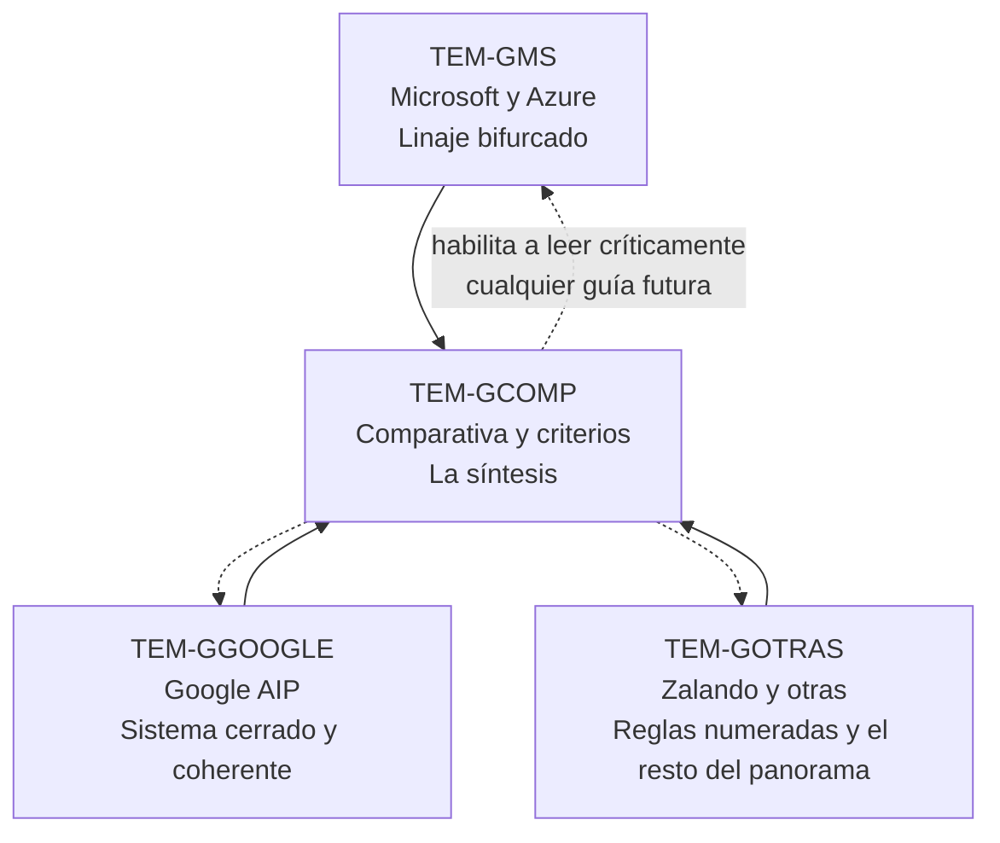

# Guías de la industria — `FAM-IND`

## La pregunta que responde esta familia

**¿Quién prescribe qué, y cuánto vale cada prescripción?**

En una discusión de diseño de API, la frase que cierra el debate suele ser un nombre propio. «Google lo hace así.» «Está en las guías de Microsoft.» «Zalando lo prohíbe.» Ninguna de esas tres frases es un argumento por sí sola, y las tres se usan como si lo fueran. Esta familia existe para que el lector pueda desarmarlas: saber de qué documento se habla, si ese documento sigue vivo, qué problema resolvía la organización que lo escribió, y si ese problema se parece al propio.

El nivel de autoridad que [`MARCO-CONVENCIONES`](../00-Marco-de-Referencia/Convenciones.md) llama **guía de organización** —el segundo de cuatro— es literalmente el objeto de estudio de estos cuatro documentos. Es también el nivel que más se confunde con el primero. Que una prescripción esté escrita, numerada, publicada en GitHub y respaldada por una empresa de cien mil empleados no la convierte en norma: la convierte en la política interna de esa empresa, expuesta al público. Un RFC pasa por un proceso de estandarización abierto y obliga a quien dice implementarlo; una guía corporativa la escribe un comité que responde a sus propias restricciones de plataforma y obliga solamente a sus equipos.

La prueba de que esa distinción no es retórica está en el material mismo. Sobre casing de campos JSON no existe ninguna norma, y las guías se contradicen de frente: Microsoft exige `camelCase`, Zalando exige `snake_case` con la fórmula literal *«never camelCase»*. Sobre dónde vive la versión de una API hay tres posturas mutuamente excluyentes, una de las cuales —la de Zalando— **prohíbe** explícitamente lo que otra —la de Google— **exige**. Sobre formato de error hay cuatro modelos incompatibles y solamente uno adopta el estándar del IETF. Si estas guías fueran normas, el ecosistema sería inconsistente; como son políticas de organización, el ecosistema simplemente tiene organizaciones distintas.

---

## Documentos

| ID | Documento | Responde |
|----|-----------|----------|
| `TEM-GMS` | [Microsoft y Azure](Microsoft-y-Azure.md) | ¿Qué prescribe hoy Microsoft, y por qué la respuesta son dos guías que se contradicen? |
| `TEM-GGOOGLE` | [Google AIP](Google-AIP.md) | ¿Qué es el sistema de AIPs, y qué implica adoptar un modelo donde `name` es la clave primaria? |
| `TEM-GOTRAS` | [Zalando y otras](Zalando-y-otras.md) | ¿Qué prescriben Zalando, GOV.UK, adidas, Heroku y JSON:API, y cuáles de esas guías siguen vivas? |
| `TEM-GCOMP` | [Comparativa y criterios](Comparativa-y-Criterios.md) | ¿Cómo se elige una guía, se escribe la propia y se evalúa una prescripción ajena? |

Los tres primeros documentos son descriptivos y se pueden leer en cualquier orden o de forma suelta, según qué guía haya aparecido en la discusión. El cuarto es el que convierte esa descripción en capacidad de decisión, y no se sostiene solo: sus tablas comparativas suponen que el lector ya entendió por qué cada guía prescribe lo que prescribe.

---

## Cómo se presenta el material acá y cómo se presenta en las familias temáticas

La misma contradicción aparece dos veces en la guía, y no es duplicación sino corte distinto.

Las familias temáticas cortan **por decisión**. [`TEM-CAMPOS`](../40-Contratos-y-Representaciones/Formato-y-Nomenclatura-de-Campos.md) reúne todo lo que se dijo sobre casing para que el lector pueda elegir un casing; [`TEM-VERS`](../50-Evolucion-y-Versionado/Estrategias-de-Versionado.md) reúne todo lo que se dijo sobre dónde poner la versión para que el lector pueda elegir dónde ponerla; [`TEM-ERR`](../40-Contratos-y-Representaciones/Manejo-de-Errores.md) hace lo propio con el formato de error.

Esta familia corta **por guía**. La razón es que una prescripción aislada de su sistema pierde la mitad de su sentido. Que Zalando exija `snake_case` no es un capricho ortográfico: es una pieza de un esquema deliberado que asigna un casing distinto a cada capa del contrato —`kebab-case` en el path, `snake_case` en query y en JSON— y que solo se entiende viéndolo entero. Que Google llame `name` a la clave primaria no es una excentricidad: se sigue de un modelo de nombres jerárquicos que atraviesa las cinco operaciones estándar, y arrancarlo de ahí produce una API que tiene la rareza sin ninguno de los beneficios.

El lector que necesita decidir un punto va a la familia temática. El lector que tiene que evaluar una guía completa —porque su organización está por adoptarla, o porque alguien la citó como autoridad— viene acá.

---

## Relación con las otras familias

**Con [`FAM-FUN`](../10-Fundamentos-REST/) — fundamentos.** Es la relación más incómoda y conviene declararla de entrada. Casi todas las guías de esta familia prescriben APIs que, medidas con el modelo de madurez de `O-03`, se ubican en el **nivel 2**: recursos con URIs propias y verbos HTTP usados según su semántica, sin controles de hipermedia. Fowler subraya en ese mismo artículo que, según la definición de Fielding, el nivel 3 es precondición para llamar REST a algo. Ninguna de las guías mayores verificadas resuelve esa tensión; la mayoría ni la menciona. JSON:API (`F-04`) es la excepción parcial, con sus `links` obligatorios de paginación. La contradicción entre la teoría canónica y la práctica prescriptiva universal es tácita, y la desarrolla [`TEM-RMM`](../10-Fundamentos-REST/Modelo-de-Madurez.md).

**Con [`FAM-REC`](../20-Diseno-de-Recursos/) — diseño de recursos.** Acá viven las prescripciones sobre pluralización y casing de segmentos de URI, y también el conflicto semántico más severo del material: `G-04` AIP-122 hace de `name` el identificador del recurso y prohíbe que cualquier otro campo se llame así, mientras el resto del ecosistema usa `id` y deja `name` como etiqueta legible. [`TEM-URI`](../20-Diseno-de-Recursos/Nomenclatura-de-URIs.md) decide el punto; [`TEM-GGOOGLE`](Google-AIP.md) explica de qué sistema sale.

**Con [`FAM-CON`](../40-Contratos-y-Representaciones/) — contratos y representaciones.** Es la familia con la que más superficie se comparte, porque casing, paginación, filtrado y formato de error son cuatro de los cinco temas donde las guías se contradicen. El reparto es estricto: allá se decide, acá se explica de dónde viene cada opción.

**Con [`FAM-EVO`](../50-Evolucion-y-Versionado/) — evolución y versionado.** El versionado es la decisión con la contradicción de tres bandas más nítida, y trae además una ironía documentada que ninguna de las partes reconoce: `G-06` (GOV.UK) justifica poner la versión en la URI **precisamente por el riesgo de que proxies y firewalls bloqueen media types custom**, que es exactamente el mecanismo que `G-05` (Zalando) obliga a usar en su regla 114. Las dos guías razonan sobre el mismo hecho técnico y llegan a mandatos opuestos.

**Con [`FAM-NET`](../80-Implementacion-en-NET/) — implementación.** La conexión práctica es que el default de ASP.NET Core coincide con la prescripción de Microsoft y no con la de Zalando: `JsonSerializerDefaults.Web` produce `camelCase` según `N-39`. Adoptar Zalando en .NET es posible y es trabajo; adoptar Microsoft es no hacer nada. Esa asimetría es un argumento legítimo de costo y no es un argumento de corrección, y conviene no confundirlos.

---

## Cómo entra cada actor

| Actor | Qué le toca en esta familia |
|---|---|
| `ACT-01` arquitecto | El destinatario principal. Decide si la organización adopta una guía entera, toma partes o escribe la propia, y esa decisión es vinculante en toda la superficie |
| `ACT-02` productor | Recibe el resultado. Le importa que la guía adoptada sea verificable automáticamente, porque una convención que solo vive en un documento se erosiona endpoint por endpoint |
| `ACT-03` consumidor | En `CTX-4` no elige: consume una API cuyo productor adoptó otra guía. Reconocer el sistema prescriptivo ajeno acelera la integración, porque permite predecir la forma de lo que todavía no se leyó |
| `ACT-04` QA | Traduce la guía adoptada en reglas verificables. Es quien detecta que la API dice seguir una guía y la incumple en la mitad de los endpoints |
| `ACT-06` product owner | Le toca la parte cara: adoptar una guía en una API con consumidores es un cambio rompiente masivo, y el calendario es suyo |

---

## Advertencia de nivel de autoridad

Todo lo que esta familia describe está en el nivel `G-xx` de [`ANEXO-REFERENCIAS`](../99-Anexos/Referencias.md), con dos excepciones que conviene tener presentes: JSON:API se clasifica como `F-04`, convención de facto, porque ninguna organización de estándares la respalda, y los datos de plataformas reales que aparecen como contraste son `P-xx`, evidencia de qué se hace y nunca de qué corresponde hacer.

Cuatro precisiones de estado, todas verificadas al 2026-07-20, que cambian cómo hay que leer buena parte del material que circula:

- **La «Microsoft REST API Guidelines» monolítica está deprecada**, con fecha de remoción declarada 2024-07-01 (`G-03`). Es el documento que internet cita de forma ubicua. Hoy hay dos guías vivas, `G-01` para Azure y `G-02` para Graph, y **se contradicen entre sí**.
- **`github.com/paypal/api-standards` devuelve HTTP 404.** Cualquier cita de «PayPal API Standards» como guía viva es insostenible a esta fecha.
- **La guía de Heroku (`G-08`) está inactiva de facto**: el repositorio existe, tiene 132 commits y no registra actividad reciente. Se sigue citando porque fue influyente, no porque se mantenga.
- **De adidas (`G-07`) se verificó el estado, no el contenido.** Repositorio activo, 730 commits, revisión indicada en febrero de 2025, uso de keywords RFC 2119 y tooling de enforcement con Spectral. Sus prescripciones REST concretas —casing, versionado, paginación, errores— **no se verificaron** y esta guía no afirma nada sobre ellas.

De ahí sale la disciplina de lectura que esta familia pide, y que se puede aplicar a cualquier guía que aparezca mañana: antes de discutir si una prescripción es buena, verificar que el documento que la contiene todavía existe.
