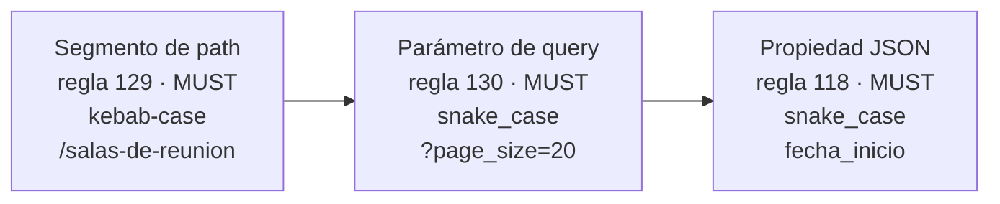

# Zalando y otras guías — `TEM-GOTRAS`

## Resumen ejecutivo

Zalando (`G-05`) publica el sistema prescriptivo más explícito del material disponible: reglas numeradas, con nivel RFC 2119 declarado —MUST, SHOULD, MAY, MUST NOT—, citables por número y estables en el tiempo. Esa forma tiene una virtud que ninguna otra guía iguala: permite discutir una prescripción concreta sin discutir la guía entera, y permite escribir «la regla 118 de Zalando exige snake_case» con precisión verificable.

También es la guía que más se aparta del resto. Prohíbe el versionado en la URL con un MUST NOT explícito, exige media type versioning en su lugar, exige `snake_case` en campos JSON con la fórmula literal *«never camelCase»*, asigna un casing distinto a cada capa del contrato, y es **la única guía mayor que adopta el estándar del IETF para errores**. Cada una de esas decisiones tiene enfrente al menos otra guía grande que prescribe exactamente lo contrario.

Alrededor de Zalando hay un panorama que conviene conocer porque aparece citado a menudo: GOV.UK (`G-06`), actualizada en 2024 y con la postura opuesta sobre versionado, justificada precisamente por el riesgo que Zalando ignora; adidas (`G-07`), activa pero cuyo contenido REST no se verificó; Heroku (`G-08`), influyente e inactiva de facto; JSON:API (`F-04`), que es una especificación de formato y no una guía de estilo; y PayPal, que es el caso ejemplar de guía muerta que se sigue citando como viva. Distinguir cuál de esas cinco es qué cosa es la mitad del valor de este documento.

---

## Definición

### Qué es

Un conjunto heterogéneo de prescripciones de organizaciones no-Microsoft y no-Google, más una especificación comunitaria de formato que suele mezclarse con ellas. Lo que las agrupa no es una tradición común sino su función en las discusiones: son las fuentes que aparecen cuando alguien quiere respaldar una posición sin invocar a los dos vendors grandes.

**Zalando RESTful API Guidelines (`G-05`).** Reglas numeradas con niveles RFC 2119, publicadas en abierto y con repositorio activo en `github.com/zalando/restful-api-guidelines`. **La página consultada no trae fecha ni versión explícita**, dato que queda sin verificar.

**GOV.UK API technical and data standards (`G-06`).** Del UK Government Digital Service, actualizada el 2024-07-19. Es una guía de gobierno: prescribe menos, delega más, y sus razones están escritas en términos de riesgo operativo antes que de pureza de diseño.

**adidas API Guidelines (`G-07`).** Repositorio activo, 730 commits, revisión indicada en febrero de 2025, licencia MIT, keywords RFC 2119, y tooling de enforcement con un ruleset de Spectral. **Sus prescripciones REST concretas no se verificaron** y no se afirma nada sobre ellas en este documento.

**Heroku HTTP API Design Guide (`G-08`).** Extraída de la Heroku Platform API, en `interagent/http-api-design`. 132 commits y **sin actividad reciente**: inactiva de facto, aunque el repositorio no esté marcado como archivado.

**JSON:API (`F-04`).** Especificación comunitaria, versión 1.1, finalizada el 2022-09-30. No es una guía de organización sino una **especificación de formato de documento**, y esa distinción cambia cómo se la cita.

### Qué problema resuelve cada una

**Zalando: gobernar decenas de equipos sin un comité de revisión.** El sistema de reglas numeradas con nivel declarado no está pensado para leerse de corrido sino para **verificarse**. Una regla con número y nivel se convierte directamente en una regla de linter, y por lo tanto en algo que se cumple sin que nadie lo revise a mano. Esa es la razón de la forma, y es lo más transferible de toda la guía con independencia de qué prescriba.

**GOV.UK: interoperabilidad entre organismos con capacidades técnicas muy dispares.** Sus prescripciones se explican por ahí. Recomendar JSON:API a quien no tiene estándar propio, exigir la versión en la URI porque los headers custom pueden ser bloqueados por infraestructura que el organismo no controla, y no prescribir casing en absoluto: son decisiones de alguien que no puede asumir que del otro lado hay un equipo de plataforma.

**Heroku: hacer enseñable el diseño de una API concreta.** Es el documento que fijó buena parte del vocabulario de facto de la década de 2010 —`created_at`, `updated_at`, UUID como identificador, TLS sin excepción, `Request-Id` para trazabilidad— y buena parte de eso sobrevivió como convención aunque el documento haya dejado de mantenerse.

**JSON:API: eliminar la discusión sobre la forma del sobre.** Su valor es que dos APIs conformes tienen la misma estructura de documento, los mismos nombres de miembros top-level y las mismas reglas de enlaces. Eso permite escribir clientes genéricos, que es exactamente lo que ninguna de las guías de estilo permite.

### Qué NO son, y con qué se las confunde

**Zalando no es una especificación pese a parecerlo.** Las reglas numeradas con MUST y MUST NOT tienen la forma de un RFC y no tienen su fuerza. La regla 115 prohíbe el versionado en URL para las APIs de Zalando, no para las APIs en general.

**JSON:API no es una guía de estilo.** Prescribe la forma del documento —`data`, `errors`, `meta`, `included`, `links`— y no prescribe el diseño de la API. Y hay un punto donde aparenta estandarizar y en realidad delega: **reserva la familia de parámetros `filter` sin definirle sintaxis**, de modo que dos APIs igualmente conformes pueden tener filtrados mutuamente ininteligibles. Quien dice «seguí JSON:API para filtrar» prescribe algo que la especificación no define. Lo trata [`TEM-FILTRO`](../40-Contratos-y-Representaciones/Filtrado-Orden-y-Seleccion.md).

**Heroku no es una guía viva.** Se la cita como si lo fuera porque su contenido envejeció bien. Que una prescripción siga siendo razonable no significa que el documento se mantenga, y la diferencia importa cuando alguien la invoca como autoridad actual.

**PayPal API Standards no existe.** `github.com/paypal/api-standards` devuelve **HTTP 404**. Se desarrolla más abajo, porque el caso enseña algo que ninguna guía viva enseña.

---

## Zalando en detalle

### Las reglas verificadas

| Regla | Nivel | Qué prescribe |
|---|---|---|
| 114 | MUST | Usar **media type versioning** vía content negotiation cuando haya cambios incompatibles |
| 115 | **MUST NOT** | *«no usar URL versioning»*: prohíbe explícitamente el `/v1/` en el path |
| 116 | MUST | SemVer `MAJOR.MINOR.PATCH` en `#/info/version` de la especificación |
| 118 | MUST | *«Los nombres de propiedad se restringen a strings ASCII en snake_case que cumplan el regex `^[a-z_][a-z_0-9]*$»*. Explícitamente **«never camelCase»**. Ejemplos: `customer_number`, `billing_address` |
| 129 | MUST | *«Los segmentos de path se restringen a strings ASCII en kebab-case que cumplan `^[a-z][a-z\-0-9]*$»*. Ej. `/shipment-orders/{shipment-order-id}` |
| 130 | MUST | *«Los parámetros de query se restringen a strings ASCII en snake_case que cumplan `^[a-z_][a-z_0-9]*$»* |
| 134 | MUST | Pluralizar los nombres de recursos |
| 137 | — | Parámetros convencionales: `offset`, `limit`, `cursor`, `sort`, `fields`, `embed`, `q` |
| 159 | MUST | Soportar paginación |
| 160 | SHOULD | *«preferir paginación basada en cursor, evitar paginación basada en offset»* |
| 161 | SHOULD | Usar pagination links |
| 176 | MUST | Soportar **problem JSON** (RFC 7807) |
| 223 | MUST/SHOULD/MAY | Esquema de naming funcional `<functional-domain>-<functional-component>`, según la audiencia de la API |
| 224 | MUST | Hostnames con la forma `<functional-name>.zalandoapis.com` |
| 225 | MUST | Permisos con la forma `<application-id>.<resource-name>.<access-mode>`, ej. `order-management.sales-order.read` |

### Los tres casings

Zalando es **la única guía mayor que separa deliberadamente el casing por capa**, y no es un descuido: son tres reglas distintas, con tres regex distintos, aprobadas por separado.



La lógica es que cada capa tiene su tradición y su tooling: los paths se leen en la barra de direcciones y el guión es más legible ahí; los parámetros y los campos se manipulan en código, donde el underscore es escribible sin comillas en JavaScript —el argumento que Heroku hace explícito—. Que sea defendible no la vuelve consensuada: `G-04` AIP-122 exige `camelCase` en los identificadores de colección, que es el mismo lugar donde la regla 129 exige `kebab-case`.

### El versionado, y la ironía con GOV.UK

La regla 115 es de las prescripciones más aisladas del material: **MUST NOT usar versionado en URL**. La 114 impone la alternativa: media type versioning por negociación de contenido. Es lo contrario exacto de `G-04` AIP-185, que **exige** la versión como primera parte del path, y de `G-06`, que exige la versión en la URI.

Lo que vuelve el caso instructivo es el argumento de GOV.UK. Esa guía recomienda *«agregar el número de versión a la URI, por ejemplo `https://myapi.service.gov.uk/v1»*, y recomienda **evitar headers custom o media types** para versionar, con una razón declarada: **proxies y firewalls pueden bloquearlos**. Es decir, GOV.UK justifica su postura por el riesgo operativo del mecanismo que Zalando obliga a usar. Las dos guías razonan sobre el mismo hecho técnico y llegan a mandatos opuestos, y ninguna reconoce a la otra.

Hay un tercer dato que ninguna de las dos discute y que corresponde traer de la evidencia de plataformas: **el versionado por media type tiene adopción cero entre las plataformas grandes verificadas**. Stripe versiona por header con fecha (`P-01`), GitHub por header custom con fecha (`P-05`), Shopify por fecha en la URL (`P-07`), Twilio por una fecha en el path congelada hace unos dieciséis años (`P-08`), Azure por query param (`G-01`). Ninguna usa `Accept: application/vnd.x.v2+json`. La opción que Zalando manda es la que nadie de ese conjunto eligió. Lo decide [`TEM-VERS`](../50-Evolucion-y-Versionado/Estrategias-de-Versionado.md); acá interesa como dato sobre el peso de la prescripción.

Una precisión sobre la regla 116, porque el conflicto con Google es real pero más chico de lo que parece: el SemVer que Zalando exige vive en `#/info/version` de la especificación OpenAPI, no en la URL. Google prohíbe minor y patch **en la versión expuesta**. Aplican a superficies distintas, y aun así el modelo mental es opuesto: uno considera que la versión de una API tiene tres números, el otro que tiene uno.

### El error, y el detalle de la cita

La regla 176 es MUST y adopta *problem JSON*. **Zalando es la única de las guías mayores que adopta el estándar del IETF para errores**, en un ecosistema donde Microsoft, Google y Heroku inventaron cada uno el suyo.

El detalle es que la regla cita **RFC 7807**, que está obsoleto desde julio de 2023, reemplazado por `N-04` (RFC 9457). El impacto sobre el formato en el cable es escaso, porque 9457 obsoleta a 7807 sin romper el JSON; el impacto sobre la cita no lo es. Es exactamente el patrón que registra la sección de documentos obsoletos de [`ANEXO-REFERENCIAS`](../99-Anexos/Referencias.md): una guía viva citando una norma retirada.

---

## El panorama alrededor

### `G-06` — GOV.UK

Actualizada el 2024-07-19, es de las guías vivas más recientes del conjunto.

- **Versionado**: en la URI, `https://myapi.service.gov.uk/v1`. Evitar headers custom y media types por el riesgo de bloqueo en proxies y firewalls.
- **Formatos**: encoding UTF-8, JSON preferido, fechas ISO 8601, datos geográficos en GeoJSON. Y una recomendación notable: **si la organización no tiene estándar propio, usar JSON:API**.
- **Naming**: no prescribe casing. Prescribe consistencia —singular o plural, pero uno solo—, identificadores coherentes entre recursos similares (`user_id`, `address_id`), y nombres de recurso persistentes entre versiones.
- **Errores**: códigos de estado estándar de RFC 9110, mensajes descriptivos y consistentes, **sin exponer detalles técnicos internos**.
- **Proceso**: producir documentos OpenAPI **antes** de escribir código. Lo desarrolla [`TEM-DESIGNFIRST`](../60-Especificacion-y-Documentacion/Diseno-Primero.md).
- **Seguridad**: autenticación para todos los usuarios, OAuth 2.0 con JWT en lugar de basic auth o API keys, rate limiting en los endpoints anónimos.

Lo que distingue a esta guía es **dónde elige no prescribir**. No fija casing y en cambio exige consistencia; no fija formato de error y en cambio fija qué no puede aparecer en él. Para una organización que necesita gobernar sin poder auditar, delegar con criterio vale más que prescribir sin poder verificar.

### `G-07` — adidas

Repositorio activo con 730 commits, revisión indicada en febrero de 2025, licencia MIT, contacto público. Usa keywords RFC 2119. La estructura declarada cubre General Guidelines, REST API Guidelines y Asynchronous API Guidelines —con Kafka y GraphQL—, e incluye tooling de enforcement: un ruleset de Spectral (`adidas-spectral.yaml`) y un `ruleset.md`.

**Sus prescripciones REST concretas no fueron verificadas.** No estaban expuestas en la página del repositorio consultada y requieren leer la sección REST del GitBook. Este documento no afirma nada sobre su casing, su versionado, su paginación ni su formato de error, y una cita de adidas sobre cualquiera de esos puntos debe verificarse antes de usarse.

Lo que sí es citable, y vale la pena, es la existencia del ruleset de Spectral: es la evidencia de que una organización tratando su guía como algo verificable automáticamente y no como un documento de lectura. Ese patrón es transferible con independencia del contenido.

### `G-08` — Heroku

Extraída de la Heroku Platform API. **Sin actividad reciente**: se cita por influencia histórica, no por vigencia.

- **Atributos**: *«poner los atributos en minúscula, pero usar separadores underscore de modo que los nombres se puedan escribir sin comillas en JavaScript»* — `service_class`, `created_at`, `updated_at`. El argumento del underscore es de ergonomía de cliente, y es el más concreto que ninguna guía da sobre casing.
- **Versionado**: header Accept con media type custom, `Accept: application/vnd.heroku+json; version=3`. Y recomienda **no tener versión por defecto**: el cliente debe especificarla explícitamente.
- **Paginación**: por cabeceras `Content-Range`. Es el único mecanismo del material que saca la paginación del cuerpo y de la query a la vez.
- **Errores**: `{id, message, url}` — `id` legible por máquina, por ejemplo `"rate_limit"`; `message` para humanos; `url` opcional hacia la documentación. Es el formato más chico de los cuatro modelos incompatibles del ecosistema, y el único que incluye por diseño un enlace a la documentación del error.
- **Timestamps**: `created_at` y `updated_at`; *«aceptar y devolver tiempos solo en UTC. Representar los tiempos en formato ISO8601»*, ej. `"finished_at": "2012-01-01T12:00:00Z"`.
- **Identificadores**: *«dar a cada recurso un atributo `id` por defecto. Usar UUIDs salvo que haya una muy buena razón para no hacerlo»*, en minúsculas con la forma 8-4-4-4-12.
- **TLS**: *«requerir TLS para acceder a la API, sin excepción»*.
- **Trazabilidad**: cabecera `Request-Id` con un UUID en cada respuesta.

Heroku coincide con Zalando en `snake_case` y con Zalando y Google en casi nada más. Y coincide con Zalando en el media type versioning, que es la posición minoritaria del ecosistema: las dos guías que la sostienen son la que está inactiva y la que está más aislada.

### `F-04` — JSON:API

Versión **1.1**, finalizada el 2022-09-30. La página de formato menciona una v1.2 futura, cuyo **estado y fecha no se verificaron**. El media type registrado ante IANA es exactamente `application/vnd.api+json`.

**Estructura del documento.** Debe contener al menos uno de `data` —los datos primarios—, `errors` —un array de errores— o `meta`, o bien un miembro definido por una extensión aplicada. **`data` y `errors` no pueden coexistir**, que es la regla estructural más consecuente de la especificación: prohíbe por construcción el éxito parcial. Los miembros top-level opcionales son `jsonapi`, `links` e `included`.

**Nombres de miembros.** Al menos un carácter; solo caracteres permitidos —a-z, A-Z, 0-9, y U+0080 y superiores—; deben empezar y terminar con caracteres globalmente permitidos; guiones, underscores y espacios solo en el interior; y `+`, `,`, `.`, `[`, `]` reservados.

**Casing.** Acá hay una precisión que se pierde en casi todas las citas: la recomendación de camelCase —*«los nombres de miembro **SHOULD** ir en camel-case, es decir `wordWordWord`»*— está en la **página de recomendaciones, que no es normativa**. Citar JSON:API como si obligara a camelCase es citar de más.

**URLs recomendadas.** Colección derivada del tipo de recurso (`/photos`), recurso individual (`/photos/1`), relationship URLs (`/photos/1/relationships/comments`) y related resource URLs (`/photos/1/comments`).

JSON:API es además la única de este conjunto que empuja hipermedia de forma efectiva, con `links` y las relaciones de paginación. Es la parte de HATEOAS que efectivamente se adoptó en el ecosistema, y lo discute [`TEM-HATEOAS`](../10-Fundamentos-REST/Hipermedia.md).

### PayPal — el caso de la guía muerta

`github.com/paypal/api-standards` devuelve **HTTP 404**. El repositorio original fue retirado. Circulan forks y archivos de terceros —por ejemplo `KuSh/api-standards`, descrito como *«Archive of PayPal's API Style Guide»*— que **no son fuentes oficiales**. PayPal sí mantiene `paypal/paypal-rest-api-specifications`, que contiene archivos de especificación y **no una guía de estilo**. Ninguna cita de «PayPal API Standards» es verificable al 2026-07-20.

El caso vale por lo que enseña, no por lo que prescribía. Las guías corporativas de diseño de APIs son artefactos de marketing técnico además de documentos internos, y **se retiran sin anuncio**. Un enlace roto no genera ninguna señal en el ecosistema: los artículos que la citaban siguen publicados, las charlas siguen grabadas, y la prescripción sigue circulando desacoplada de su fuente. Un año después, alguien la invoca en una revisión de código y nadie tiene forma de contrastarla.

De ahí la disciplina que esta guía recomienda, y que cuesta menos de un minuto: **antes de aceptar una prescripción respaldada por un nombre corporativo, abrir el documento**. No para leerlo entero, sino para verificar que existe y que no lleva un aviso de deprecación. Es la misma verificación que revela que `G-03` de Microsoft tiene fecha de remoción declarada, y que la guía de Heroku no recibe commits.

---

## Aplicación por escenario

### `ESC-1` — API nueva

Zalando es la guía **más fácil de adoptar parcialmente**, y es su mayor ventaja práctica sobre las otras dos grandes. Las reglas están numeradas y son en su mayoría independientes entre sí: tomar la 118, la 129 y la 176 sin tomar la 114 y la 115 no produce ninguna incoherencia interna, porque el casing no depende del versionado. Comparado con el sistema de Google, donde arrancar AIP-132 de AIP-122 deja al listado sin sujeto, la diferencia estructural es grande.

La decisión que sí conviene tratar aparte es el par 114/115. Prohibirse el `/v1/` en el path es una decisión de arquitectura con consecuencias en el enrutamiento, en la documentación, en las herramientas y en la curva de aprendizaje del integrador, y el mecanismo alternativo que la regla 114 impone tiene adopción nula entre las plataformas grandes verificadas. Esta guía recomienda decidir ese punto con [`TEM-VERS`](../50-Evolucion-y-Versionado/Estrategias-de-Versionado.md) a la vista y no por adhesión a la guía.

Para el destinatario .NET hay un costo concreto y medible: el `snake_case` de la regla 118 va contra el default de ASP.NET Core, que produce `camelCase` por `JsonSerializerDefaults.Web` (`N-39`). Es un cambio de configuración, no una pelea con el framework, y lo explica [`TEM-SERIAL`](../80-Implementacion-en-NET/Serializacion-Con-System-Text-Json.md). Pero conviene contarlo como costo real: todo desarrollador nuevo que llegue al proyecto va a esperar `camelCase`.

### `ESC-2` — Exposición o migración

GOV.UK es la guía más útil de este grupo para `ESC-2`, y por una razón estructural: fue escrita para organizaciones que exponen sistemas que no controlan del todo. Su combinación de prescribir poco y exigir consistencia se adapta mejor a un contexto donde parte de las decisiones ya están tomadas por el sistema de respaldo. Su regla sobre no exponer detalles técnicos internos en los mensajes de error apunta exactamente al riesgo dominante del escenario, que es filtrar el modelo interno.

Heroku aporta acá una prescripción concreta y barata: identificadores UUID en lugar de claves secuenciales de la base. Es una de las pocas decisiones de este grupo que corta de raíz una filtración de modelo interno —la enumerabilidad de los identificadores— con una sola medida.

### `ESC-3` — Evolución en producción

Adoptar la regla 118 sobre una API publicada en `camelCase` es renombrar todos los campos: cambio rompiente sobre toda la superficie, sin migración compatible posible. La regla 115 sobre una API que ya tiene `/v1/` en el path es peor, porque además invalida todas las URLs publicadas.

Lo que sí funciona aditivamente es la regla 176: empezar a servir `application/problem+json` junto al formato de error previo, negociado por `Accept`, es compatible y le da a los clientes nuevos una superficie mejor. Lo trata [`TEM-HEADERS`](../30-Semantica-HTTP/Cabeceras-y-Negociacion.md).

Y hay una pieza de Heroku que es puramente aditiva y desproporcionadamente útil: la cabecera `Request-Id` con un UUID en cada respuesta. No cambia el contrato de nadie y convierte cada reporte de un consumidor en algo rastreable.

### `ESC-4` — Evaluación de una API ajena

La forma numerada de Zalando la convierte en la **mejor herramienta de auditoría** del material, con independencia de si la organización auditada la adoptó. Una lista de reglas con nivel declarado se traduce sin esfuerzo en una lista de verificación, y se puede aplicar como cuestionario a cualquier API: ¿pagina siempre las colecciones? ¿los nombres de propiedad siguen un único regex? ¿el formato de error es uno solo en toda la superficie?

Para reconocer sistemas ajenos, las señales baratas de este grupo son nítidas. `snake_case` en campos JSON descarta Microsoft y sugiere Zalando o Heroku o influencia de Stripe. Un `Content-Range` en la respuesta de una colección apunta a Heroku. `application/vnd.api+json` es JSON:API sin ambigüedad. Y `application/problem+json` es la señal más informativa de todas, precisamente por lo rara: no se verificó ninguna plataforma grande sirviéndolo.

### Qué cambia según el contexto

| Contexto | Qué cambia respecto de estas guías |
|---|---|
| `CTX-1` pública | JSON:API pasa a ser una opción seria y no solo una curiosidad: su valor —que un cliente genérico funcione contra la API— solo se materializa con consumidores desconocidos y numerosos. La recomendación de `G-06` de adoptarla a falta de estándar propio apunta a este contexto |
| `CTX-2` interna | Lo que más rinde de Zalando no es el contenido sino la forma: reglas numeradas y verificables por linter. La regla 176 con *problem+json* también rinde, porque un formato de error común entre servicios ahorra un traductor por integración |
| `CTX-3` backend de app propia | El `snake_case` pelea contra el default de .NET y contra las expectativas del cliente propio. Difícil de justificar salvo que la organización ya lo use en todas partes, en cuyo caso la consistencia gana |
| `CTX-4` integración | Se padece lo que el proveedor eligió. Reconocer el sistema —`Content-Range` de Heroku, `application/vnd.api+json` de JSON:API— acelera la construcción de la capa de aislamiento porque permite anticipar la forma del resto |

---

## Ejemplos concretos

Listar las reservas de una sala, según Zalando: `kebab-case` en el path por la regla 129, `snake_case` en query por la 130, `snake_case` en el cuerpo por la 118, sin versión en la URL por la 115, y con la versión negociada por media type según la 114.

```http
GET /salas-de-reunion/a3f1/reservas?cursor=Y3Vyc29yOjQw&limit=20&sort=fecha_inicio HTTP/1.1
Host: reservas.ejemplo.com
Accept: application/vnd.reservas.v2+json
```

```http
HTTP/1.1 200 OK
Content-Type: application/vnd.reservas.v2+json

{
  "items": [
    {
      "reserva_id": "9012",
      "sala_id": "a3f1",
      "fecha_inicio": "2026-08-01T09:00:00Z",
      "estado": "confirmada"
    }
  ],
  "next": "/salas-de-reunion/a3f1/reservas?cursor=Y3Vyc29yOjYw&limit=20"
}
```

Los tres casings conviven en cuatro líneas: `salas-de-reunion` con guiones, `fecha_inicio` con underscore tanto en el parámetro `sort` como en la clave JSON. La versión no aparece en ninguna parte de la URL —regla 115— y viaja en el `Accept` —regla 114—, que es la parte que ninguna plataforma grande verificada hace. El `cursor` de la regla 137 es el mecanismo que la regla 160 prefiere.

Vale señalar una ambivalencia interna de la propia guía: la regla 160 **SHOULD** preferir cursor y evitar offset, mientras la regla 137 lista `offset` y `limit` entre los parámetros convencionales. Recomienda una estrategia y estandariza los nombres de la otra.

### El mismo error de validación, según la regla 176

```http
HTTP/1.1 400 Bad Request
Content-Type: application/problem+json

{
  "type": "https://api.ejemplo.com/problems/rango-de-fechas-invalido",
  "title": "Rango de fechas inválido",
  "status": 400,
  "detail": "La fecha de fin debe ser posterior a la fecha de inicio.",
  "instance": "/salas-de-reunion/a3f1/reservas",
  "errors": [
    { "detail": "2026-08-01T08:00:00Z es anterior a fecha_inicio.", "pointer": "#/fecha_fin" }
  ]
}
```

Es el único de los cuatro modelos del ecosistema que sale de una norma y no de una empresa. El miembro `errors` con `detail` y `pointer` no es invención: `N-04` trae un ejemplo con esa forma, donde cada miembro es un objeto con `detail` para describir el problema y `pointer` —un JSON Pointer— para ubicarlo dentro del contenido de la petición.

La precisión de cita corresponde de nuevo: la regla 176 dice RFC 7807, y el documento vigente es `N-04`, RFC 9457, que lo obsoleta desde julio de 2023. El JSON no cambia; la cita sí.

### El mismo error, según Heroku

```http
HTTP/1.1 400 Bad Request
Content-Type: application/json

{
  "id": "rango_de_fechas_invalido",
  "message": "La fecha de fin debe ser posterior a la fecha de inicio.",
  "url": "https://docs.ejemplo.com/errores/rango-de-fechas-invalido"
}
```

Tres campos. Ninguna estructura para errores múltiples, ningún puntero al campo ofensor, ninguna extensibilidad declarada. Y sin embargo el `url` hacia la documentación es una idea que ninguno de los otros tres modelos incluye por diseño, y que resuelve el problema real de `CTX-1`: el mensaje de error es la documentación en el momento en que más se la necesita.

Los cuatro modelos —Microsoft, Google, problem+json y Heroku— puestos uno al lado del otro están en [`TEM-GCOMP`](Comparativa-y-Criterios.md). Ninguno es superconjunto de otro.

---

## Preguntas guía

- Antes de aceptar una prescripción respaldada por un nombre corporativo, ¿abrí el documento y verifiqué que existe?
- Si adopto Zalando, ¿adopto la 115 y la 114 también, o solo el casing y el formato de error? ¿Puedo justificar el corte?
- ¿Qué me da concretamente el media type versioning que no me da la versión en el path, sabiendo que ninguna plataforma grande verificada lo usa?
- El argumento de GOV.UK sobre proxies que bloquean media types custom, ¿aplica a mi infraestructura, o lo estoy repitiendo?
- ¿Estoy diciendo «seguimos JSON:API» sobre el filtrado, cuando la especificación reserva `filter` sin definirle sintaxis?
- ¿La recomendación de camelCase de JSON:API que estoy citando es normativa, o está en la página de recomendaciones?
- ¿Mi organización tiene un ruleset de linter para su guía, como el de Spectral de adidas, o tiene un documento que nadie verifica?
- Si mi guía interna cita RFC 7807, ¿está desactualizada respecto de `N-04`, o solo la cita lo está?

---

## Criterios de calidad

La marca de calidad de este grupo es la **verificabilidad**. Zalando y adidas la tienen por construcción: reglas numeradas con nivel declarado en un caso, ruleset de Spectral en el otro. GOV.UK la tiene por sustracción: prescribe poco y lo que prescribe se comprueba. Heroku no la tiene, y no importa mientras se la cite como lo que es.

Una adopción está bien hecha cuando cada regla tomada tiene su número anotado, cuando las descartadas tienen su razón escrita, y cuando existe un mecanismo automático que verifica al menos las de casing y forma de error, que son las que más se erosionan. Está mal hecha cuando la organización dice «seguimos Zalando» y su API tiene tres formatos de error distintos porque cada equipo resolvió el suyo.

### Antipatrones

**Citar PayPal, o Heroku, como guía viva.** El primero no existe: 404. El segundo no se mantiene. Ninguna de las dos cosas se nota en una discusión salvo que alguien abra el enlace, y por eso el antipatrón sobrevive.

**Citar el fork de una guía muerta como si fuera la fuente.** Los archivos de terceros de las PayPal API Standards circulan y se ven oficiales. No lo son, y nada indica que reflejen el último estado del original.

**Presentar la recomendación de casing de JSON:API como normativa.** Está en la página de recomendaciones. La distinción existe dentro de la propia especificación y suele borrarse al citarla.

**Prescribir «seguí JSON:API para filtrar».** La especificación reserva la familia `filter` y declara ser agnóstica respecto de las estrategias de filtrado. Prescribe un nombre de parámetro, no una sintaxis.

**Adoptar la regla 115 sin evaluar el mecanismo alternativo.** Prohibirse el `/v1/` es la parte fácil; la parte difícil es que la regla 114 impone content negotiation, con su costo de tooling, de documentación y de caché, y con adopción nula entre las plataformas grandes verificadas. Adoptar la prohibición sin adoptar conscientemente el reemplazo deja a la API sin estrategia de versionado.

**Mezclar los casings de Zalando con los de otra guía.** Los tres regex de las reglas 118, 129 y 130 forman un esquema. Tomar el `kebab-case` del path y dejar `camelCase` en el JSON no es un corte de Zalando: es un dialecto propio con una regla prestada.

**Tratar la ausencia de prescripción de GOV.UK como descuido.** No fija casing a propósito, y en su lugar exige consistencia. Completar ese hueco con la prescripción de otra guía y seguir diciendo «seguimos GOV.UK» describe mal lo que se hizo.

---

## Anexo — Lista de verificación de una guía ajena

Aplicable a cualquier guía que aparezca citada, incluidas las que no están en este documento. Las cuatro primeras preguntas se responden en menos de dos minutos y descartan la mayoría de las citas insostenibles.

```yaml
# 1. Existencia y vigencia
url_responde: si | no                    # PayPal falla acá
tiene_aviso_de_deprecacion: si | no      # G-03 de Microsoft falla acá
ultima_actividad_del_repositorio: ""     # G-08 de Heroku falla acá
fecha_o_version_del_documento: ""        # G-05 y G-02 no la exponen

# 2. Naturaleza
tipo: "guia de organizacion" | "especificacion de formato" | "norma"
organizacion: ""
niveles_normativos_declarados: si | no   # RFC 2119: MUST / SHOULD / MAY
reglas_citables_por_numero: si | no

# 3. Verificabilidad
tooling_de_enforcement_publicado: si | no    # G-07 de adidas lo tiene (Spectral)
reglas_traducibles_a_linter: []

# 4. Contenido, solo si 1 a 3 pasaron
casing_json: ""
casing_de_path: ""
casing_de_query: ""
versionado: ""
paginacion: ""
formato_de_error: ""
cita_alguna_norma_obsoleta: si | no      # la regla 176 de G-05 cita RFC 7807, obsoleto por N-04

# 5. Aplicabilidad
que_problema_resolvia_esa_organizacion: ""
tengo_ese_problema: si | no | parcialmente
partes_adoptadas: []
partes_descartadas: []                   # con su razón
```

El bloque 1 es el que más citas descarta y el que casi nadie ejecuta. El bloque 5 es el que convierte una lectura en una decisión: sin una respuesta escrita a `que_problema_resolvia_esa_organizacion`, adoptar es copiar.
