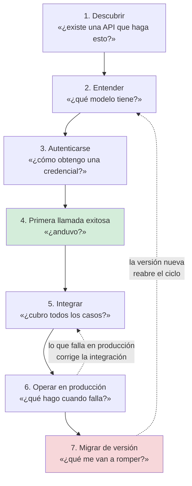

# Experiencia del consumidor — `TEM-DX`

## Resumen ejecutivo

Una API tiene usuarios. No son abstracciones: son personas que abren una documentación a las once de la noche, copian un ejemplo, reciben un `401` que no explica nada y deciden si vale la pena seguir. Ese recorrido tiene fricción medible, tiene puntos donde la gente abandona y tiene una relación directa con decisiones que se toman del lado del contrato. La tesis de este documento es simple y tiene consecuencias: **la experiencia de uso de una API se diseña o se sufre**, y la mayoría de las APIs la sufren porque nadie declaró que fuera un objeto de diseño.

El actor de referencia es `ACT-03`, el desarrollador consumidor, de quien [`MARCO-ACTORES`](../00-Marco-de-Referencia/Actores.md) dice algo que ordena todo lo que sigue: su voz sobre el contrato es consultiva, y es la más valiosa y la menos escuchada. Quien consume una API descubre en horas lo que el diseñador no vio en semanas. El problema no es que ese conocimiento no exista, sino que no tiene por dónde volver.

El tratamiento general de UX, UI y flujo de usuario está en [`DOC-UX`](../../Documentacion-Tecnica/95-Transversales/UX-UI-y-Flujo-de-Usuario.md), que desarrolla los conceptos, los artefactos y las metodologías con detalle y con fuentes. Acá se aplica ese marco a un caso particular en el que la interfaz no es visual, el usuario es un programador y el producto es un contrato.

---

## Definición

### Qué es

El conjunto de decisiones —de contrato, de documentación y de operación— que determinan cuánto esfuerzo le cuesta a `ACT-03` pasar de no conocer una API a tenerla integrada y funcionando en producción, y cuánto le cuesta seguir funcionando cuando la API cambia.

Se distingue de la documentación en el mismo sentido en que la experiencia de usuario se distingue de la interfaz: la documentación es un artefacto, la experiencia es un resultado. Una API con documentación exhaustiva y errores mudos ofrece una experiencia mala; una con documentación escueta y mensajes de error que dicen exactamente qué falta puede ofrecer una buena. Las dos afirmaciones son criterio de esta guía.

### Qué problema resuelve

**Que la fricción sea invisible para quien la produce.** Es el mecanismo central. El equipo que construye una API conoce el modelo de datos, sabe qué significa cada campo, tiene las credenciales configuradas y nunca hizo la primera llamada. La fricción que padece un integrador es literalmente inobservable desde adentro salvo que alguien la mida o la escuche, y [`MARCO-ACTORES`](../00-Marco-de-Referencia/Actores.md) advierte que en `CTX-1` esa retroalimentación llega por canales de soporte, si llega.

**Que la decisión de contrato se tome sin ver su efecto.** Elegir paginación por desplazamiento en lugar de por cursor es una decisión que se discute en términos de base de datos; su efecto se manifiesta seis meses después como un listado que repite elementos cuando el usuario hace *scroll*. Conectar las dos puntas es la mitad del valor de este documento.

**Que el costo de la migración caiga entero del lado del consumidor.** Publicar una versión nueva es barato para quien la publica. Migrar a ella no lo es, y quien decide el calendario —`ACT-06`— no es quien paga.

### Qué **no** es

**No es la documentación de la API.** [`TEM-OPENAPI`](../60-Especificacion-y-Documentacion/OpenAPI.md) trata cómo se escribe una especificación y [`TEM-CLIENTES`](../60-Especificacion-y-Documentacion/Generacion-de-Clientes-y-Pruebas-de-Contrato.md) qué se genera desde ella. Este documento trata qué necesita una persona para usarla, que incluye la especificación y no se agota en ella.

**No es «poner un Swagger».** Una interfaz interactiva sobre el documento OpenAPI resuelve un problema —explorar la superficie— y no resuelve los otros seis del flujo. Además hay una precisión de plataforma que conviene tener: `N-33` establece que ASP.NET Core genera documentos OpenAPI y **no incluye ninguna interfaz de usuario**, y advierte que Swagger UI, ReDoc o Scalar deberían habilitarse solo en entornos de desarrollo. Las plantillas de .NET 10 no traen ninguna, verificado en `N-66`.

**No es simpatía.** Un tono amable en los mensajes de error no compensa que el error no diga qué campo falló. La experiencia del consumidor es una propiedad verificable, no una cuestión de redacción.

**Y con qué se lo confunde.** Con la experiencia del usuario final. Son dos flujos distintos, con usuarios distintos, que se tocan en un punto concreto: las decisiones de contrato tienen efectos visibles en la pantalla. Confundirlos produce el antipatrón de `CTX-3`, la API modelada según la interfaz, que [`TEM-ARQ`](Arquitectura-y-REST.md) trata al hablar de BFF.

---

## Las herramientas documentales, y qué resuelve cada una

Ninguna sustituye a otra y todas cuestan mantenimiento. La tabla las ordena por lo que resuelven; el desarrollo posterior se limita a las que tienen algo específico del dominio REST.

| Herramienta | Qué resuelve | Qué no resuelve | Costo de mantener |
|---|---|---|---|
| Referencia generada desde OpenAPI | Qué operaciones y campos existen | Por dónde empezar; qué operación corresponde a qué necesidad | Bajo si se genera en la construcción |
| Portal de documentación | Reunir referencia, guías y cambios en un lugar | Nada por sí solo; es el contenedor | Alto y sostenido |
| Guía de inicio | La primera llamada exitosa | La integración completa | Medio; se rompe con cada cambio de autenticación |
| Ejemplos ejecutables | Copiar y correr sin adaptar | Casos que se apartan del ejemplo | Alto: se desactualizan en silencio |
| *Sandbox* o entorno de prueba | Probar sin consecuencias ni credenciales de producción | La confianza en que se comporta como producción | Muy alto |
| Changelog público | Saber qué cambió y cuándo | Que alguien lo lea a tiempo | Bajo si se escribe con cada versión |
| Archivos `.http` y colecciones | Ejecutar peticiones desde el editor o la herramienta | Documentar el porqué | Bajo, y se versiona con el código |

**La referencia generada** es el piso y el techo de muchas APIs. Su límite estructural es que está organizada por la estructura de la API —recursos, operaciones, esquemas— y quien llega por primera vez no tiene una pregunta con esa forma: tiene una tarea. Una referencia impecable no responde «cómo reservo una sala»; responde «qué campos acepta `POST /reservas`», que es otra cosa.

**El changelog público** merece una observación con evidencia. Las plataformas grandes lo tratan como parte del contrato, no como cortesía: `P-05` documenta la tabla de versiones de GitHub con su fecha de fin de soporte y la política de veinticuatro meses; `P-07` documenta la cadencia trimestral de Shopify con al menos doce meses de soporte por versión y nueve de solapamiento. Ambas cosas son promesas verificables por el integrador antes de decidir integrarse, y esa es su función principal. La contracara también está registrada y conviene no idealizar: `P-01` muestra que Stripe fija la versión por cuenta y el actualizar es opcional del usuario, y `P-08` que la URL base de Twilio conserva una fecha de 2010; la estrategia real de esas dos plataformas es no romper nunca antes que deprecar bien.

**Los archivos `.http`** son la herramienta con mejor relación entre valor y costo en el ecosistema .NET, y tienen respaldo documental. `N-57` describe el formato, sus separadores `###`, sus variables, sus entornos y las variables de petición que permiten encadenar una llamada de autenticación con la siguiente; la plantilla de `dotnet new webapi` genera uno, verificado en el código fuente por `N-66`. Su ventaja sobre una colección exportada es que vive en el repositorio, se revisa en el mismo *pull request* que el endpoint y no se desactualiza sin que nadie lo note. `N-57` advierte además que varias capacidades existen solo en la extensión de Visual Studio Code y no en Visual Studio, entre ellas el historial de peticiones y el pegado de cURL.

**El *sandbox*** es la herramienta más cara y la que esta guía recomienda con más cautela. Un entorno de prueba que se comporta distinto de producción es peor que no tenerlo, porque produce integraciones que funcionan hasta el día del cambio. Cuando el dominio tiene efectos irreversibles —cobros, notificaciones a terceros, emisión de comprobantes— la inversión se justifica; cuando no los tiene, un conjunto de datos de ejemplo restaurable suele alcanzar. Esta guía no dispone de evidencia verificada sobre la adopción de *sandbox* entre plataformas grandes y no afirma nada al respecto.

---

## El flujo del consumidor

Siete pasos, en orden, cada uno con su fricción característica. La secuencia es criterio propio de esta guía; lo que no es criterio propio es que cada paso tiene un punto de abandono, porque el paso siguiente nunca ocurre si el anterior falló.



**1. Descubrir.** La fricción es de existencia: el integrador no sabe que la operación se puede hacer. En `CTX-1` el remedio es un índice navegable por tarea además de por recurso. En `CTX-2` el problema es distinto y más común de lo que parece: nadie sabe qué APIs internas existen, y se construye por segunda vez algo que ya estaba. Un catálogo de servicios, que [`TEM-ARQ`](Arquitectura-y-REST.md) lista entre los artefactos que exigen los microservicios, resuelve exactamente esto.

**2. Entender.** La fricción es de vocabulario. Antes de llamar a nada hay que saber qué es una reserva, qué es una solicitud de reserva y en qué se diferencian —la distinción que `ACT-05` aporta al modelo según [`MARCO-ACTORES`](../00-Marco-de-Referencia/Actores.md)—. Esta guía recomienda que la documentación abra con el modelo conceptual y sus tres o cuatro entidades, no con la lista de endpoints. Un diagrama de las relaciones entre recursos hace más por este paso que treinta páginas de referencia.

**3. Autenticarse.** Es el paso con más abandono y el peor documentado, porque para el equipo productor es invisible: sus credenciales ya existen. La fricción se compone de obtener la credencial, saber dónde ponerla y entender cuánto dura. [`TEM-AUTH`](../70-Seguridad-y-Robustez/Autenticacion-y-Autorizacion.md) trata el mecanismo; lo que corresponde acá es que un `401` sin cuerpo en este paso es el punto donde más gente se va, porque no distingue «token vencido» de «token mal formado» de «token válido sin permiso», y las tres se corrigen distinto. La tensión con `ACT-07`, que necesita no filtrar información, es real y [`TEM-ERR`](../40-Contratos-y-Representaciones/Manejo-de-Errores.md) la desarrolla; el punto acá es que el `401` de la fase de alta no es el mismo caso que el `404` de un recurso ajeno, y tratarlos con la misma parquedad es una decisión, no una obligación de seguridad.

**4. Primera llamada exitosa.** Es el hito. Esta guía recomienda medirlo como el indicador principal de la experiencia: **tiempo desde que alguien decide integrarse hasta que ve un `200` en su terminal**. Todo lo que reduzca ese tiempo tiene retorno, y casi todo depende de que exista un ejemplo completo y copiable —con la URL real, con la credencial de prueba, con el cuerpo entero— en lugar de fragmentos que hay que armar.

**5. Integrar.** La fricción se vuelve de completitud: paginación, errores, casos de borde, concurrencia. Es donde `ACT-03` descubre lo que el diseñador no vio, y el momento en que la retroalimentación sería más útil. También es donde pesan las decisiones de [`FAM-CON`](../40-Contratos-y-Representaciones/README.md): un formato de error que no distingue casos que el cliente necesita distinguir obliga a ramificar por el texto del mensaje, y ahí el consumidor se acopla a algo que nadie garantizó.

**6. Operar en producción.** La fricción es de diagnóstico. Cuando algo falla a las tres de la mañana, lo que sirve es un identificador de petición que el soporte pueda buscar, un código de error estable que se pueda buscar en la documentación y un estado del servicio que se pueda consultar. Nada de eso es documentación en el sentido habitual y todo es parte de la experiencia.

**7. Migrar de versión.** La fricción es de riesgo: el integrador no sabe qué se va a romper. Lo que la reduce es una lista de cambios rompientes explícita, en lugar de una nota que diga «pequeñas mejoras». [`TEM-BREAK`](../50-Evolucion-y-Versionado/Compatibilidad-y-Cambios-Rompientes.md) trata qué cuenta como rompiente y [`TEM-DEPR`](../50-Evolucion-y-Versionado/Deprecacion-y-Retiro.md) cómo se anuncia. Una advertencia de estado que corresponde repetir acá: el mecanismo de protocolo existe —`N-12` (RFC 9745) para `Deprecation`, `N-13` (RFC 8594, Informational) para `Sunset`— y la verificación de [`ANEXO-REFERENCIAS`](../99-Anexos/Referencias.md) **no encontró una sola plataforma grande emitiéndolos**. Quien los use está haciendo lo correcto y no debe esperar que el consumidor los lea: la comunicación efectiva sigue siendo el changelog y el correo.

---

## Cómo se ve una decisión de API en la pantalla

Es el puente con [`DOC-UX`](../../Documentacion-Tecnica/95-Transversales/UX-UI-y-Flujo-de-Usuario.md) y el argumento que convierte una discusión de contrato en una discusión de producto. Las correspondencias de la tabla son criterio propio y se declaran como tales.

| Decisión de API | Efecto en el flujo del usuario final | Documento que la trata |
|---|---|---|
| Paginación por cursor frente a desplazamiento | Con desplazamiento, el *scroll* infinito repite o saltea elementos cuando alguien inserta datos mientras el usuario navega | [`TEM-PAG`](../40-Contratos-y-Representaciones/Colecciones-y-Paginacion.md) |
| Cantidad de llamadas por pantalla | Cada llamada adicional es un estado de carga más y un modo de falla parcial más que la interfaz tiene que dibujar | [`TEM-ARQ`](Arquitectura-y-REST.md) |
| Granularidad de los errores | Si la API devuelve un solo error para diez campos inválidos, el formulario solo puede marcar uno por vez y el usuario itera diez veces | [`TEM-ERR`](../40-Contratos-y-Representaciones/Manejo-de-Errores.md) |
| Idempotencia de la creación | Sin ella, el doble clic en «confirmar» crea dos reservas y el usuario descubre el problema después | [`TEM-IDEM`](../30-Semantica-HTTP/Idempotencia-y-Concurrencia.md) |
| Concurrencia optimista con `412` | Habilita el mensaje «alguien modificó esta reserva mientras la editabas» en lugar de la pérdida silenciosa del trabajo del usuario | [`TEM-IDEM`](../30-Semantica-HTTP/Idempotencia-y-Concurrencia.md) |
| Caché y peticiones condicionales | Una lista que se revalida con `304` se siente instantánea; una que se recarga entera muestra un cargador cada vez | [`TEM-CACHE`](../30-Semantica-HTTP/Cache-y-Peticiones-Condicionales.md) |
| Filtrado del lado del servidor | Sin él, el cliente descarga todo y filtra en memoria: la pantalla anda con doscientas reservas y no con veinte mil | [`TEM-FILTRO`](../40-Contratos-y-Representaciones/Filtrado-Orden-y-Seleccion.md) |

La fila de paginación tiene respaldo técnico independiente: `O-05` describe el fenómeno de los resultados que se desplazan cuando se inserta una fila entre dos peticiones con desplazamiento, y lo hace desde la base de datos. Que ese fenómeno se manifieste como una tarjeta repetida en un *scroll* infinito es la traducción a la pantalla, y es la que hace que un desarrollador de interfaz reporte un defecto que en realidad es una decisión de contrato.

Los seis estados mínimos de una pantalla que enumera [`DOC-UX`](../../Documentacion-Tecnica/95-Transversales/UX-UI-y-Flujo-de-Usuario.md) —vacío, cargando, con datos, error recuperable, error no recuperable, sin permiso— tienen una correspondencia casi directa con lo que la API puede expresar. «Sin permiso» requiere que la API distinga `403` de `404`; «error recuperable» requiere que distinga `503` o `429` de `400`. Una API que devuelve `500` para todo obliga a la interfaz a colapsar tres estados en uno, y el usuario recibe «ocurrió un error» en los tres casos.

---

## Integración con el marco documental de la guía hermana

La guía de documentación técnica define un corpus con familias, identificadores y responsables. La API aparece ahí en un documento propio, [`DOC-API`](../../Documentacion-Tecnica/40-Diseno/API-Specification.md), dentro de la familia de diseño. Lo que esta guía agrega es qué piezas de la experiencia del consumidor corresponden a qué documento de ese corpus, para que no se dupliquen.

| Pieza de la experiencia | Dónde vive en el corpus documental | Quién la firma |
|---|---|---|
| Contrato operación por operación | `DOC-API`, generado o mantenido junto a la especificación | `ACT-01` con `ACT-02` |
| Modelo conceptual y vocabulario | El modelo de dominio del análisis; se referencia, no se copia | `ACT-05` |
| Guía de inicio y primera llamada | [`DOC-INTEGRACION`](../../Documentacion-Tecnica/40-Diseno/Integration-Guide.md), la guía de integración | `ACT-01` con `ACT-03` |
| Cambios entre versiones | [`DOC-CHANGELOG`](../../Documentacion-Tecnica/60-Desarrollo/Change-Log.md) y las notas de versión | `ACT-06` |
| Qué hacer cuando falla | Los documentos de operación y el *runbook* | `ACT-07` |
| Flujo del usuario final afectado | [`DOC-UX`](../../Documentacion-Tecnica/95-Transversales/UX-UI-y-Flujo-de-Usuario.md), con sus fichas `FLU-` | El diseñador de la guía hermana |

La firma de la tercera fila es la que esta guía recomienda con más énfasis y la que menos se practica: **la guía de inicio la valida `ACT-03`, no `ACT-01`**. Quien escribió la API no puede juzgar si su guía de inicio funciona, porque no puede desaprender lo que sabe. La prueba operativa es entregarle la documentación a alguien que no trabajó en el proyecto y cronometrar hasta su primer `200`, sin ayudarlo. Es una evaluación de usabilidad en el sentido de [`DOC-UX`](../../Documentacion-Tecnica/95-Transversales/UX-UI-y-Flujo-de-Usuario.md), aplicada a un producto que no tiene pantalla.

---

## Aplicación por escenario

### `ESC-1` — API nueva

No hay consumidores todavía, y por eso la fricción es enteramente hipotética. La técnica que esta guía recomienda es escribir la guía de inicio **antes** del primer endpoint: si el ejemplo de la primera llamada exitosa resulta incómodo de escribir, el diseño va a ser incómodo de usar, y corregirlo ahora es gratis.

La trampa del escenario es el sobrediseño documental. Un portal completo, un *sandbox* y tres guías por audiencia para una API que todavía no tiene un solo integrador es trabajo que va a envejecer antes de leerse. El orden de inversión que sostiene esta guía es: especificación, ejemplos ejecutables, guía de inicio, y recién después el portal.

### `ESC-2` — Exposición o migración

Hay una diferencia de fondo con el escenario anterior: **ya existen consumidores del sistema previo**, aunque no de esta API. Son la mejor fuente disponible sobre qué operaciones importan y qué vocabulario usa la gente, y suelen no consultarse porque formalmente no son usuarios de lo nuevo.

La fricción propia del escenario aparece en el paso de entender: el modelo de recursos nuevo no coincide con el que los integradores conocían del sistema viejo, y sin un mapa entre ambos la migración se hace por prueba y error. Ese mapa —el mismo artefacto de salida que exige [`MARCO-ESCENARIOS`](../00-Marco-de-Referencia/Escenarios.md)— sirve dos veces: para el equipo, como control de que no se filtró el modelo interno, y para el integrador, como tabla de traducción.

### `ESC-3` — Evolución en producción

Es el escenario donde la experiencia del consumidor deja de ser una cortesía y se vuelve una restricción económica. Cada cambio tiene un costo de migración que pagan terceros, y la decisión de si vale la pena depende de cuántos son y cuánto tardan, que es exactamente lo que `ACT-06` debe poder responder.

Lo que más rinde acá es la telemetría por versión y por endpoint, porque convierte la discusión de deprecación en una discusión con datos. También es el escenario que reabre el flujo: una versión nueva devuelve al integrador al paso de entender, y una documentación que solo describe la versión actual lo deja sin saber qué cambió.

### `ESC-4` — Evaluación de una API ajena

El escenario se invierte: acá **se es** `ACT-03`, y la experiencia del consumidor no se diseña sino que se padece y se evalúa. La calidad de la documentación es evidencia legítima sobre la calidad de la API, con una salvedad: la correlación no es perfecta en ninguna de las dos direcciones. Hay APIs con documentación excelente y contratos frágiles, y APIs sin portal cuyo diseño es impecable.

Lo que sí es evidencia dura es el paso de la primera llamada exitosa. Una API que no se puede probar sin un contrato firmado, o cuyo ejemplo de la documentación no funciona copiado tal cual, está reportando algo verdadero sobre cuánto va a costar integrarse. En `ESC-4b` esa observación es a menudo lo único medible.

### Qué cambia según el contexto

| | `CTX-1` Pública | `CTX-2` Interna | `CTX-3` App propia | `CTX-4` Integración |
|---|---|---|---|---|
| **Quién es `ACT-03`** | Desconocido, sin canal directo | Un equipo identificable | El equipo de al lado, o el mismo | Se es `ACT-03` |
| **Herramientas mínimas** | Portal, guía de inicio, changelog, referencia | Especificación y archivos `.http` | Cliente tipado generado | Documentación del proveedor y una capa de aislamiento |
| **Cómo llega la retroalimentación** | Soporte, si existe el canal | Conversación | Inmediata | No llega; se reporta y se espera |
| **Riesgo propio** | Fricción invisible que nadie reporta | Suponer que «el equipo se conoce» hasta que rota | Diseñar para la pantalla de hoy | Documentación incompleta que obliga a `ESC-4b` |

`CTX-3` merece una observación que suele omitirse. Es el contexto más cómodo —el ciclo de retroalimentación dura minutos— y por eso el que peor prepara para los demás: cuando el mismo equipo produce y consume, la documentación no se escribe porque nadie la necesita, y el día en que aparece un segundo consumidor no hay nada. `MARCO-ACTORES` lo señala como el sesgo del rol combinado `ACT-02` más `ACT-03`.

---

## Ejemplos concretos

Sintéticos, del dominio de reserva de salas.

### El mismo error, con y sin experiencia diseñada

Una petición de creación con la sala inexistente y la hora de fin anterior a la de inicio.

```http
HTTP/1.1 400 Bad Request
Content-Type: application/json

{ "error": "Solicitud inválida" }
```

El consumidor sabe que algo está mal y no sabe qué. Va a probar cambiando un campo por vez. Si su formulario tiene ocho campos, es un ciclo de ocho intentos, y ninguno de ellos genera conocimiento reutilizable.

```http
HTTP/1.1 422 Unprocessable Content
Content-Type: application/problem+json

{
  "type": "https://api.ejemplo.com/errores/validacion",
  "title": "La reserva no se pudo procesar",
  "status": 422,
  "detail": "Hay 2 campos con problemas.",
  "instance": "/reservas",
  "traceId": "00-4bf92f3577b34da6a3ce929d0e0e4736-00f067aa0ba902b7-01",
  "errors": [
    { "pointer": "/salaId", "code": "sala_inexistente",
      "detail": "No existe la sala 'a3f9'. Consultá GET /v1/salas para el listado." },
    { "pointer": "/hasta", "code": "rango_invalido",
      "detail": "'hasta' debe ser posterior a 'desde'." }
  ]
}
```

Todos los campos ofensores en una respuesta, un `code` estable para ramificar sin leer el texto, un `pointer` que la interfaz puede mapear al control del formulario, y un `traceId` que el soporte puede buscar. La estructura sigue `N-04` (RFC 9457), que admite miembros de extensión y trae un ejemplo con un arreglo `errors` cuyos elementos llevan `detail` y `pointer`; el formato lo desarrolla [`TEM-ERR`](../40-Contratos-y-Representaciones/Manejo-de-Errores.md). El detalle que cambia la experiencia y no está en ninguna norma es la segunda oración de `sala_inexistente`: dice qué hacer a continuación.

### Un archivo `.http` que documenta el flujo, no las operaciones

```http
@host = https://api.ejemplo.com
@sede = centro

### 1. Obtener token (usar las credenciales de prueba de la guía de inicio)
# @name auth
POST {{host}}/v1/oauth/token
Content-Type: application/x-www-form-urlencoded

grant_type=client_credentials&client_id=demo&client_secret=demo

### 2. Buscar una sala disponible para mañana a las 10
# @name salas
GET {{host}}/v1/salas?sede={{sede}}&libreDesde=2026-08-15T10:00:00Z&libreHasta=2026-08-15T11:00:00Z
Authorization: Bearer {{auth.response.body.$.access_token}}
Accept: application/json

### 3. Reservarla. Repetir esta petición NO crea una segunda reserva.
POST {{host}}/v1/reservas
Authorization: Bearer {{auth.response.body.$.access_token}}
Content-Type: application/json
Idempotency-Key: 3f9c1a20-6d21-4f0a-9a1e-0c2b7f4e8a11

{
  "salaId": "{{salas.response.body.$.datos[0].id}}",
  "desde": "2026-08-15T10:00:00Z",
  "hasta": "2026-08-15T11:00:00Z",
  "motivo": "Revisión de sprint"
}
```

El encadenamiento por variables de petición —`# @name` y luego `{{auth.response.body.$.access_token}}`— es una capacidad documentada en `N-57`. Lo que hace valioso al archivo no es la sintaxis sino el orden: son los tres pasos de la tarea, no un catálogo de endpoints. Un integrador puede ejecutarlo sin leer nada más, y eso es la primera llamada exitosa. La cabecera `Idempotency-Key` es convención de facto sostenida por `P-04`, no norma, y [`TEM-IDEM`](../30-Semantica-HTTP/Idempotencia-y-Concurrencia.md) lo explica: el comentario que la acompaña existe porque el consumidor no puede saber por observación si la API la respeta.

### La paginación que se ve en el *scroll*

```http
GET /v1/reservas?sede=centro&offset=40&limite=20 HTTP/1.1
```

Si entre la petición de la página 3 y la de la página 4 alguien crea una reserva que ordena antes que las anteriores, todo el conjunto se desplaza y un elemento ya visto reaparece. `O-05` describe el mecanismo en la base de datos; en la pantalla se manifiesta como una tarjeta duplicada, y el defecto se reporta contra la interfaz. La alternativa por cursor no tiene el problema:

```http
GET /v1/reservas?sede=centro&limite=20&desde_cursor=eyJmIjoiMjAyNi0wOC0xNCJ9 HTTP/1.1
```

```http
HTTP/1.1 200 OK
Content-Type: application/json

{ "datos": [ … ], "siguiente": "eyJmIjoiMjAyNi0wOC0xNSJ9" }
```

Que el cursor sea opaco es una decisión con consecuencias para la experiencia y no todas son buenas: impide que el integrador construya una petición a mano para depurar. La discusión completa es de [`TEM-PAG`](../40-Contratos-y-Representaciones/Colecciones-y-Paginacion.md); lo que corresponde acá es que ninguna de las dos opciones es gratis y que el costo se paga en pantallas distintas.

---

## Preguntas guía

- ¿Cuánto tarda alguien que nunca vio esta API en obtener su primer `200`? ¿Lo medí o lo estoy suponiendo?
- ¿La guía de inicio la probó alguien que no trabajó en el proyecto?
- ¿Mis mensajes de error dicen qué hacer a continuación, o solo qué salió mal?
- Cuando un integrador se traba, ¿por dónde me entero? ¿Existe ese canal o lo estoy imaginando?
- ¿Qué decisión de contrato que tomé este mes va a aparecer como un defecto de interfaz dentro de seis?
- Si publico una versión nueva hoy, ¿el consumidor puede saber en cinco minutos qué se le rompe?
- ¿Los ejemplos de mi documentación se ejecutan en la integración continua, o nadie sabe si todavía funcionan?

---

## Criterios de calidad

### Aplicación buena

Existe un camino completo desde la portada de la documentación hasta una petición exitosa, sin que el lector tenga que armar nada. Los ejemplos se ejecutan automáticamente contra la API y su falla rompe la construcción, de modo que no pueden desactualizarse en silencio. Los errores traen un código estable, la ubicación del problema y una indicación de qué hacer. Hay un identificador de petición en cada respuesta y el soporte lo puede buscar. Los cambios entre versiones están enumerados, con los rompientes separados de los que no lo son. Y alguien tiene asignada la responsabilidad sobre esta superficie: sin dueño, la documentación es lo primero que se degrada porque nunca es lo urgente.

### Antipatrones

**La referencia como toda la documentación.** Se publica el documento OpenAPI renderizado y se considera terminado. Responde qué campos existen y no responde ninguna pregunta que alguien tenga realmente.

**El ejemplo que no se puede copiar.** Fragmentos con marcadores de posición, sin la URL completa, sin las cabeceras, con el cuerpo cortado. Cada uno exige que el lector reconstruya lo que el autor tenía en la cabeza.

**El error mudo.** `400` con «solicitud inválida», o peor, `500` para todo. Convierte la integración en un juego de adivinanzas y multiplica los tickets de soporte que la documentación tendría que haber evitado.

**La documentación que envejece sola.** Nada la verifica, nadie la revisa cuando cambia el código, y su desactualización se descubre por un integrador que perdió una tarde. Es el mismo problema que `ESC-4a` diagnostica como divergencia entre especificación e implementación, visto desde el otro lado.

**El *sandbox* que miente.** Un entorno de prueba con reglas de negocio distintas de las de producción. Produce integraciones que pasan todas las pruebas y fallan el primer día.

**La versión nueva sin lista de cambios.** «Mejoras y correcciones» obliga a cada integrador a hacer su propia auditoría. El costo se multiplica por la cantidad de consumidores, que es precisamente lo que una lista de cambios evita.

**El canal de retroalimentación inexistente.** `ACT-03` descubre un problema de diseño y no tiene a quién decírselo, así que lo rodea en su cliente. El conocimiento más valioso sobre la API se pierde, y el productor sigue creyendo que todo funciona porque nadie se queja.

---

## Anexo A — Esqueleto de portal de documentación

Estructura mínima recomendada por esta guía para `CTX-1`. En `CTX-2` sobreviven las secciones 1, 3 y 6; el resto es ceremonia. El orden es el del flujo del consumidor, no el de la estructura de la API.

```text
/
├── Empezar acá
│   ├── Qué resuelve esta API y qué no          ← alcance, en un párrafo
│   ├── Modelo conceptual                        ← 3-5 entidades + diagrama de relaciones
│   └── Primera llamada exitosa                  ← ver Anexo B
├── Guías por tarea                              ← organizadas por objetivo, no por recurso
│   ├── Reservar una sala
│   ├── Cancelar y reprogramar
│   ├── Consultar disponibilidad
│   └── Recibir notificaciones de cambios
├── Conceptos transversales
│   ├── Autenticación y renovación de credenciales
│   ├── Paginación                               ← con un ejemplo de recorrido completo
│   ├── Errores                                  ← catálogo de `code` estables
│   ├── Idempotencia y reintentos
│   └── Límites de uso                           ← valores concretos, no "razonable"
├── Referencia                                   ← generada desde OpenAPI; nunca escrita a mano
├── Versiones y cambios
│   ├── Política de versionado y compatibilidad  ← qué prometemos y por cuánto tiempo
│   ├── Changelog                                ← rompientes marcados y separados
│   └── Calendario de fin de soporte             ← fechas, no intenciones
└── Soporte
    ├── Cómo reportar un problema                ← qué datos incluir: traceId, hora, petición
    ├── Estado del servicio
    └── Cómo proponer un cambio al contrato      ← el canal de ACT-03 hacia ACT-01
```

Tres secciones son las que más se omiten y las que más cuestan después. El catálogo de códigos de error estables, porque sin él el consumidor ramifica por el texto del mensaje y se rompe cuando alguien corrige una tilde. El calendario de fin de soporte, porque sin fechas la política de deprecación no es una política. Y la última línea, el canal para proponer cambios, porque es el único mecanismo por el cual la voz consultiva de `ACT-03` llega a `ACT-01` antes de que sea tarde.

---

## Anexo B — Guion de «primera llamada exitosa»

Plantilla del documento más importante del portal. La restricción de diseño es que **el lector no debe tener que abrir ninguna otra página** para completarlo, y que todo bloque de código debe funcionar copiado tal cual.

```markdown
# Tu primera reserva, en 5 minutos

## Lo que necesitás
- Credenciales de prueba: `client_id=demo`, `client_secret=demo`.
  No hace falta registrarse. Estas credenciales operan sobre datos de prueba
  que se restauran todas las noches.
- Un cliente HTTP. Los ejemplos usan cURL; hay una versión en archivo `.http`
  y otra en C# más abajo.

## Paso 1 — Obtené un token
[petición completa, copiable, con la URL real]
[respuesta real, con el token recortado]
> El token dura 1 hora. Cuando venza vas a recibir `401` con
> `"code": "token_expirado"`: pedí uno nuevo con esta misma llamada.

## Paso 2 — Buscá una sala libre
[petición completa]
[respuesta real, con 2 elementos, no con "..."]
> Si la lista viene vacía no es un error: no hay salas libres en ese rango.
> Probá con otro horario.

## Paso 3 — Reservala
[petición completa, incluyendo Idempotency-Key con un valor de ejemplo]
[respuesta 201 completa, con la cabecera Location]
> Si repetís esta petición con la misma `Idempotency-Key` vas a recibir la
> misma reserva, no una nueva. Es lo que evita el doble clic.

## Qué acabás de hacer
[diagrama de 3 pasos o 3 líneas de prosa]

## Los tres errores que te van a pasar primero
| Respuesta | Qué significa | Qué hacer |
|---|---|---|
| `401` `token_expirado` | Pasó una hora | Repetir el paso 1 |
| `409` `sala_ocupada` | Alguien reservó entre tu búsqueda y tu reserva | Volver al paso 2 |
| `422` `rango_invalido` | `hasta` no es posterior a `desde` | Revisar el cuerpo |

## Y ahora
- [Guía de tu caso de uso]
- [Cómo paginar cuando tengas muchas reservas]
- [Referencia completa]
```

La sección de los tres errores es la que más rinde y la que casi nunca está. Se construye con evidencia, no con imaginación: se toman los tres códigos de error más frecuentes de los primeros treinta días de un integrador nuevo y se documentan esos. Si no hay telemetría para saber cuáles son, esa ausencia también es un hallazgo.
