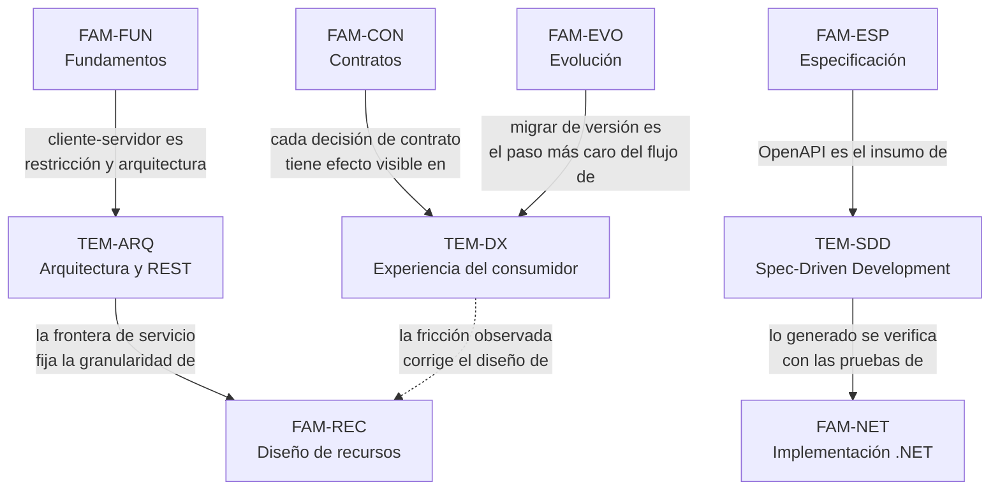

# Transversales — `FAM-TRA`

## La pregunta que responde esta familia

**¿Cómo se conecta el diseño de la API con la arquitectura, con el producto y con la generación asistida?**

Las nueve familias anteriores responden preguntas internas al contrato: qué recurso existe, qué método corresponde, cómo se pagina, dónde va la versión. Son preguntas que se pueden contestar mirando la API y nada más. Las tres de esta familia no: cada una obliga a mirar hacia afuera. Un modelo de recursos es correcto o incorrecto en relación con la arquitectura que lo sostiene; una paginación es buena o mala en relación con la pantalla que la consume; una especificación es suficiente o insuficiente en relación con quien la va a leer, que hoy puede ser un modelo de lenguaje.

Hay una consecuencia de método que conviene declarar de entrada. Buena parte de lo que sigue **no tiene fuente normativa y no puede tenerla**: que la API REST sea un adaptador primario, que la experiencia del desarrollador consumidor sea un objeto de diseño, que una especificación sirva de insumo para un agente, son posiciones argumentadas, no prescripciones acreditadas. Los tres documentos usan la fórmula «esta guía recomienda» de [`MARCO-CONVENCIONES`](../00-Marco-de-Referencia/Convenciones.md) con mucha más frecuencia que el resto de la guía, y donde sí hay respaldo —`O-01` para cliente-servidor, `P-xx` para lo que las plataformas efectivamente publican, `N-xx` para las capacidades de .NET— la cita aparece con su identificador. El `confidence: media` del frontmatter de esta familia no es modestia retórica: es la clasificación honesta de un cuerpo de texto mayoritariamente argumentativo.

---

## Documentos

| Documento | ID | Qué establece |
|---|---|---|
| [Arquitectura y REST](Arquitectura-y-REST.md) | `TEM-ARQ` | Los modelos de arquitectura vistos desde la API: microservicios y la frontera de servicio, hexagonal y la API como adaptador primario, monolítico, modelo de capas y cliente-servidor. Qué artefactos documentales exige cada modelo. El patrón BFF y `CTX-3` |
| [Experiencia del consumidor](Experiencia-del-Consumidor.md) | `TEM-DX` | UX aplicada a una API. Las herramientas documentales —portal, referencia generada, guía de inicio, ejemplos ejecutables, *sandbox*, changelog, `.http`— y el flujo del consumidor de punta a punta, con la fricción de cada paso. Cómo una decisión de API se ve en la pantalla |
| [Spec-Driven Development](Spec-Driven-Development.md) | `TEM-SDD` | La especificación OpenAPI como fuente de verdad ejecutable y como entrada estructurada para un agente. Qué se genera con confianza y qué no; el ciclo especificación → generación → verificación; el riesgo de la «convención REST» inventada con fluidez |

El orden de lectura es el de la tabla y responde a una progresión de alcance. [`TEM-ARQ`](Arquitectura-y-REST.md) ubica la API dentro del sistema; [`TEM-DX`](Experiencia-del-Consumidor.md) la ubica frente a quien la usa; [`TEM-SDD`](Spec-Driven-Development.md) la ubica dentro del proceso que la produce. Quien solo tenga tiempo para uno debería elegir según el rol que ocupa: `ACT-01` empieza por el primero, `ACT-03` y `ACT-06` por el segundo, `ACT-02` por el tercero.

---

## Cómo se relaciona con las demás familias

Tres aristas merecen precisión, porque marcan repartos de responsabilidad que esta familia respeta de forma estricta.

**Hacia [`FAM-ESP`](../60-Especificacion-y-Documentacion/README.md).** [`TEM-OPENAPI`](../60-Especificacion-y-Documentacion/OpenAPI.md) explica **qué es** una especificación OpenAPI y cómo se escribe; [`TEM-CLIENTES`](../60-Especificacion-y-Documentacion/Generacion-de-Clientes-y-Pruebas-de-Contrato.md) explica **qué herramientas** la consumen. [`TEM-SDD`](Spec-Driven-Development.md) no repite ninguna de las dos cosas: se ocupa de qué cambia cuando el lector de esa especificación es un agente y no una herramienta determinista. La diferencia es sustantiva, porque un generador de clientes que no entiende la especificación falla, y un modelo que no la entiende inventa.

**Hacia [`FAM-CON`](../40-Contratos-y-Representaciones/README.md).** La forma de la paginación se decide en [`TEM-PAG`](../40-Contratos-y-Representaciones/Colecciones-y-Paginacion.md) y el formato del error en [`TEM-ERR`](../40-Contratos-y-Representaciones/Manejo-de-Errores.md). [`TEM-DX`](Experiencia-del-Consumidor.md) no vuelve a decidirlos: muestra qué consecuencia tiene cada opción en la pantalla del usuario final y en el trabajo de `ACT-03`, que es información que debería llegar a la decisión y rara vez llega.

**Hacia [`FAM-FUN`](../10-Fundamentos-REST/README.md).** La restricción cliente-servidor de `O-01` §5.1.2 se define en [`TEM-REST`](../10-Fundamentos-REST/Que-es-REST.md), con las otras cinco. [`TEM-ARQ`](Arquitectura-y-REST.md) la retoma en un solo punto —el de mostrar que la primera restricción del estilo es, literalmente, un modelo de arquitectura— y desde ahí desarrolla lo que la disertación no trata, que es cómo se comportan los modelos posteriores a ella.

---

## Relación con las guías hermanas

Esta familia es la que más dialoga con el resto del repositorio, y por eso es la que más se cuida de no reescribirlo.

| Tema | Dónde está su tratamiento general | Qué aporta esta familia |
|---|---|---|
| Modelos de arquitectura | [`ARQ-INDICE`](../../Documentacion-Tecnica/90-Modelos-de-Arquitectura/README.md) y sus seis documentos, en la guía de documentación técnica | La lectura de cada modelo **desde la superficie HTTP**, y qué artefactos exige del lado de la API |
| Microservicios, monolito, criterios de partición | [`FAM-SRV`](../../Organizacion-Estilo-Patrones-Codigo/10-Arquitectura-de-Servicios/README.md), en la guía de organización de código | Qué relación hay entre granularidad de servicio y granularidad de recurso, que ninguna de las dos guías trata |
| Puertos y adaptadores | [`TEM-CAPAS`](../../Organizacion-Estilo-Patrones-Codigo/30-Organizacion-Interna/Modelos-de-Capas.md), tratamiento canónico | Por qué la API REST es un adaptador primario y qué se sigue de eso para el modelo de recursos |
| UX, UI y flujo de usuario | [`DOC-UX`](../../Documentacion-Tecnica/95-Transversales/UX-UI-y-Flujo-de-Usuario.md) | El consumidor de una API como usuario, con su propio flujo y su propia fricción |
| Spec-Driven Development | [`DOC-SDD`](../../Documentacion-Tecnica/95-Transversales/Spec-Driven-Development.md) | El caso particular en que la especificación es un contrato HTTP y el artefacto generado es una API |

El patrón **BFF** es la excepción: no está desarrollado en ninguna de las dos guías hermanas —la de código lo menciona sin nombrarlo, al preguntarse cómo compone la interfaz datos de varios servicios— y esta guía lo desarrolla en [`TEM-ARQ`](Arquitectura-y-REST.md) porque es, antes que nada, una decisión sobre la superficie de la API.

---

## Qué se lleva el lector de esta familia

La capacidad de ubicar una decisión de contrato en su contexto real. Que una API interna de cuatro servicios no necesite hipermedia no es una concesión a la pereza: es la observación correcta de que la propiedad que hipermedia compra —evolución sin coordinación entre partes que nunca se hablaron— no es una propiedad que ese sistema necesite. El mismo razonamiento, aplicado en sentido contrario, explica por qué una API pública sin política de deprecación publicada está incompleta aunque su modelo de recursos sea impecable.

El hábito de preguntar quién va a leer lo que se escribe. La especificación de una API tiene hoy al menos tres lectores con necesidades distintas: `ACT-03`, que quiere hacer su primera llamada exitosa en diez minutos; el generador de clientes, que quiere esquemas completos y tipos sin ambigüedad; y el agente, que quiere restricciones explícitas porque en su ausencia va a producir algo verosímil. Optimizar para uno solo de los tres deja a los otros dos trabajando con material insuficiente.

Y una advertencia sobre la generación asistida que atraviesa toda la guía. Un modelo produce con fluidez notable prescripciones que suenan a norma y no lo son: que las colecciones van en plural, que la versión va en el path, que `PUT` es el verbo de actualización. Las tres son decisiones de guías de organización que se contradicen entre sí —`G-04` AIP-122 exige plural, `G-05` regla 115 prohíbe la versión en la URL, `G-02` prohíbe `PUT`— y ninguna es una regla REST. Los cuatro niveles de autoridad de [`MARCO-CONVENCIONES`](../00-Marco-de-Referencia/Convenciones.md) existen para ese problema, y [`TEM-SDD`](Spec-Driven-Development.md) explica cómo se aplican cuando quien escribe el primer borrador no es una persona.
