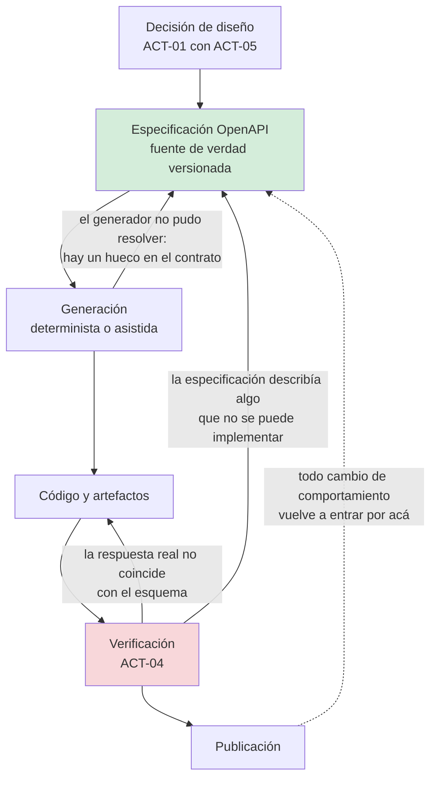

# Spec-Driven Development — `TEM-SDD`

## Resumen ejecutivo

Una especificación OpenAPI es, entre otras cosas, un documento estructurado que describe exhaustivamente un contrato HTTP. Esa propiedad la vuelve un insumo excepcionalmente bueno para la generación asistida: a diferencia de un requisito en prosa, no admite dos lecturas sobre qué campos existen, qué tipos tienen y qué respuestas son posibles. Es la razón por la cual el diseño de APIs es probablemente el dominio donde la generación asistida rinde más, y también —por un motivo que este documento desarrolla— uno de los que más cuidado exige.

El motivo es específico y conviene enunciarlo ya: **un modelo de lenguaje produce «convenciones REST» con enorme fluidez, y buena parte de ellas no existe en ninguna especificación**. Que las colecciones van en plural, que la versión va en el path, que `429` está en RFC 9110, que `Idempotency-Key` es un estándar de la IETF. Las cuatro afirmaciones suenan igual de sólidas y ninguna es correcta en los términos en que se enuncia. Es exactamente el problema que los cuatro niveles de autoridad de [`MARCO-CONVENCIONES`](../00-Marco-de-Referencia/Convenciones.md) intentan resolver, y la generación asistida lo amplifica porque produce a una velocidad a la que nadie verifica.

El tratamiento general de SDD —qué es, su ciclo, sus etapas, la doble audiencia, sus riesgos genéricos— está en [`DOC-SDD`](../../Documentacion-Tecnica/95-Transversales/Spec-Driven-Development.md), de la guía hermana de documentación técnica, y no se repite acá. Este documento trata el caso particular en que la especificación es un contrato HTTP, el artefacto generado es una API y el verificador es una prueba de contrato.

---

## Definición

### Qué es

La práctica de tratar la especificación OpenAPI como el artefacto primario del que se derivan los demás —clientes, esqueleto de servidor, pruebas, documentación— en lugar de como una descripción producida a posteriori. Aplicada a la generación asistida, agrega una segunda condición: la especificación es también el contexto que se le entrega a un agente, y su calidad determina la calidad de lo que el agente produce.

Las dos condiciones se refuerzan. Una especificación completa reduce el espacio de invención del modelo, porque cada campo declarado es una decisión que ya no hay que adivinar. Una especificación con huecos —`additionalProperties` sin restringir, respuestas de error no declaradas, un `type: object` sin propiedades— es una invitación abierta a que el modelo complete con lo que le parezca plausible, y lo va a hacer sin señalarlo.

### Qué problema resuelve

**Que el contrato se descubra leyendo el código.** Es el problema que [`TEM-DESIGNFIRST`](../60-Especificacion-y-Documentacion/Design-First-y-Code-First.md) trata como decisión de método. Lo que la generación asistida agrega es urgencia: cuando el código lo escribe un agente en minutos, no hay ninguna etapa en la que alguien haya pensado el contrato salvo que esa etapa exista explícitamente y antes.

**Que la revisión no tenga contra qué contrastar.** Revisar cien líneas de un endpoint generado sin una especificación previa es una tarea sin criterio: no hay forma de decir que está mal, solo de decir que a uno no le gusta. Con la especificación, la revisión tiene una pregunta cerrada —¿esto es lo que el contrato declara?— y esa pregunta se puede automatizar en parte.

**Que la divergencia entre lo declarado y lo implementado se acumule en silencio.** Es el hallazgo más frecuente de `ESC-4a` según [`MARCO-ESCENARIOS`](../00-Marco-de-Referencia/Escenarios.md), y la generación asistida lo agrava en un caso concreto: cuando se genera código desde una especificación y después se lo modifica a mano sin volver a la especificación, la divergencia nace en el mismo momento en que se escribe.

### Qué **no** es

**No es «pedirle a un modelo que escriba la API».** La diferencia está en el sentido del flujo. En SDD, el cambio de comportamiento entra por la especificación y el código es una consecuencia; en el otro caso el código es el artefacto y la especificación —si existe— se genera después y hereda cualquier error.

**No es generación determinista de clientes.** Un generador como Kiota, que `N-59` documenta como herramienta oficial de Microsoft para producir clientes desde una descripción OpenAPI, produce siempre la misma salida para la misma entrada y falla ruidosamente cuando la entrada es inválida. Un modelo no tiene ninguna de esas dos propiedades. Ambos consumen la misma especificación y no admiten el mismo nivel de confianza. [`TEM-CLIENTES`](../60-Especificacion-y-Documentacion/Generacion-de-Clientes-y-Pruebas-de-Contrato.md) trata la primera categoría; acá interesa la segunda.

**No suprime la revisión humana.** Es el punto donde [`DOC-SDD`](../../Documentacion-Tecnica/95-Transversales/Spec-Driven-Development.md) es explícito y esta guía coincide sin matices. Lo que cambia es dónde se pone el esfuerzo: menos en escribir y más en verificar.

**No es OpenAPI.** La especificación es el formato de esta guía por disponibilidad de herramientas —`N-19` es OAS 3.2.0, publicada el 2025-09-19— pero el método no depende de ella. Lo que el método exige es un contrato declarado antes que el código y verificable después.

**Y con qué se lo confunde.** Con generar la especificación desde el código anotado. Es una práctica válida, es la que ASP.NET Core soporta de forma nativa según `N-32`, y **es la dirección opuesta**. Ninguna de las dos es mejor en abstracto; lo que no se puede es sostener que se practica SDD mientras la fuente de verdad son los atributos del controlador.

---

## Qué se puede generar con confianza, y qué no

La distinción que ordena esta sección es entre lo que la especificación **determina** y lo que la especificación **no dice**. Todo lo que está en la primera columna se puede generar con alta confianza porque el contrato no deja grados de libertad; todo lo que está en la segunda requiere una decisión que ningún documento contiene, y por lo tanto el modelo la va a inventar.

| Artefacto | Confianza | Por qué |
|---|---|---|
| Cliente HTTP tipado | **Alta** | Determinado por completo. Además hay generación determinista disponible (`N-59`) y conviene preferirla |
| DTOs y modelos de petición y respuesta | **Alta** | Los esquemas son la definición |
| Andamiaje de endpoints: ruta, método, binding, tipos de retorno | **Alta** | Todo declarado. El cuerpo del handler, no |
| Pruebas de contrato | **Alta** | Verifican forma contra esquema, que es exactamente lo que el documento fija |
| Datos de ejemplo | **Alta en forma, nula en verosimilitud** | El esquema fija tipos y formatos; que una reserva empiece antes de terminar no está en el esquema |
| Archivos `.http` y colecciones | **Alta** | Traducción mecánica de operaciones a peticiones (`N-57`) |
| Validaciones de entrada | **Media** | Las de esquema sí; las reglas de negocio no están en el contrato |
| Manejo de errores | **Media** | Las respuestas declaradas sí; qué situación produce cada una, no |
| Lógica del handler | **Baja** | No está en la especificación. Es la parte que el contrato deliberadamente no dice |
| Reglas de negocio | **Nula** | No están, no pueden estar, y el modelo las va a producir igual si se le pide el endpoint completo |
| Decisiones de contrato faltantes | **Nula y peligrosa** | Es donde aparece la convención inventada. Se desarrolla más abajo |

Las dos filas del final son el núcleo del asunto. Cuando a un modelo se le pide un endpoint de creación de reservas y la especificación no declara qué pasa si dos reservas se solapan, el modelo no responde «falta esa decisión»: produce un `409` con un mensaje razonable, o un `400`, o una validación silenciosa que descarta la segunda. Las tres son plausibles, las tres son decisiones de contrato, y ninguna la tomó nadie.

La fila de datos de ejemplo tiene una consecuencia práctica que se subestima. Un conjunto de datos generado desde el esquema cumple todos los tipos y viola todas las reglas: salas con capacidad negativa, reservas de tres segundos, fechas de fin anteriores a las de inicio. Sirve para probar serialización y no sirve para probar el dominio, y usarlo para lo segundo produce pruebas que pasan sobre datos imposibles.

---

## El ciclo, y por qué la verificación no se delega



La regla que sostiene el diagrama la enuncia [`DOC-SDD`](../../Documentacion-Tecnica/95-Transversales/Spec-Driven-Development.md) y esta guía la adopta sin cambios: ningún cambio de comportamiento entra por el código. Lo que corresponde desarrollar acá es el arco de verificación, porque en el dominio de las APIs tiene una forma concreta y verificable.

**Por qué no se delega.** La verificación es el único paso del ciclo que compara la salida del generador contra algo que el generador no produjo. Si el mismo mecanismo que escribió el código escribe también la prueba que lo valida, la prueba va a codificar el mismo malentendido: un handler que devuelve `200` donde el contrato pide `201` acompañado de una prueba que espera `200` es un sistema internamente consistente y externamente equivocado. La independencia de la fuente es la propiedad que hace útil a la verificación, y es lo que se pierde al delegarla al mismo lugar.

**Qué forma tiene, en concreto.** Tres capas, en orden de costo creciente y de generalidad decreciente.

La primera es la **conformidad estructural**: la respuesta real valida contra el esquema declarado, campo por campo, incluidos los de error. Es automatizable en la integración continua y es donde aparece la mayoría de las divergencias. `N-55` documenta las pruebas de integración de ASP.NET Core con `WebApplicationFactory`, que es el mecanismo natural para ejecutarlas contra la aplicación real; [`TEM-PRUEBAS`](../80-Implementacion-en-NET/Pruebas-de-API.md) lo desarrolla.

La segunda es la **cobertura de caminos de fallo**. `MARCO-ACTORES` señala que el defecto de contrato más caro está en lo que la especificación no dice, y que probar solo lo declarado es el modo característico de fallar de `ACT-04`. Con generación asistida el riesgo es mayor, porque el camino feliz es justamente lo que un modelo produce mejor.

La tercera es la **verificación semántica**, que no se automatiza: alguien lee y decide si `409` era el código correcto, si el nombre del campo dice lo que el negocio entiende, si el error revela información que `ACT-07` no quiere revelar. Es el trabajo que queda, y es el que justifica que la matriz de responsabilidad de [`MARCO-ACTORES`](../00-Marco-de-Referencia/Actores.md) siga teniendo un decisor humano en cada fila.

---

## La doble audiencia, aplicada a un contrato

El marco documental de este repositorio exige que cada documento sirva a un lector humano y a un agente, y lo instrumenta con el frontmatter que fija [`MARCO-CONVENCIONES`](../00-Marco-de-Referencia/Convenciones.md). [`DOC-SDD`](../../Documentacion-Tecnica/95-Transversales/Spec-Driven-Development.md) explica por qué `doc_id`, `traces`, `origin`, `confidence` y `status` cumplen esa función. Lo que agrega el dominio de las APIs es que **la especificación OpenAPI es el único artefacto del corpus que ya nació con doble audiencia**, y que aun así la mayoría de las especificaciones sirven bien a una sola.

La asimetría se ve en qué se completa y qué se omite. Los campos que las herramientas necesitan —tipos, requeridos, formatos— suelen estar; los que un lector necesita —`description`, `summary`, `example`, el motivo por el cual un campo es opcional— suelen faltar. Para un agente, la consecuencia es peor que para una persona: una persona que encuentra un campo `estado` de tipo `string` sin descripción va a preguntar qué valores admite; un modelo va a proponer `activa`, `cancelada`, `pendiente`, con total naturalidad y sin ninguna base.

De ahí tres recomendaciones de esta guía sobre qué hace apta a una especificación para alimentar a un agente, que complementan sin repetir las siete propiedades generales de [`DOC-SDD`](../../Documentacion-Tecnica/95-Transversales/Spec-Driven-Development.md):

**Enumerar en lugar de describir.** Un `enum` explícito cierra el espacio; una descripción en prosa que menciona los valores lo deja abierto y además obliga al modelo a interpretarla.

**Declarar las restricciones negativas.** Lo que la API no hace es información que ningún esquema expresa y que evita la invención más costosa. «Esta API no expone borrado físico», «no hay endpoint de búsqueda por texto libre», «los identificadores no son secuenciales y no se debe inferir orden de ellos» son tres oraciones que ahorran tres implementaciones fantasma.

**Declarar todas las respuestas de error, incluidas las aburridas.** Una operación que declara solo `200` le está diciendo al generador que no hay otros caminos. Los `401`, `403`, `422` y `429` que faltan van a aparecer igual en producción, y el cliente generado no los va a manejar.

---

## El riesgo específico: la convención que suena a norma

Esta es la sección por la cual el documento existe. En ningún tema técnico circula tanta prescripción sin fuente como en el diseño de APIs REST, y un modelo entrenado sobre ese corpus reproduce la prescripción con la misma seguridad con que reproduce la norma. El resultado es un texto donde una cita a un Internet Standard y una convención de blog tienen exactamente el mismo tono.

La tabla siguiente reúne afirmaciones que se producen con fluidez y que la verificación de [`ANEXO-REFERENCIAS`](../99-Anexos/Referencias.md) contradice. No son ejemplos hipotéticos: cada fila corresponde a una advertencia registrada en ese anexo.

| Afirmación fluida | Qué pasa realmente | Nivel real |
|---|---|---|
| «Las colecciones van en plural, es una regla REST» | Lo exige `G-04` AIP-122 y `G-05` regla 134; `O-01` no dice nada sobre nomenclatura | Guía de organización |
| «La versión va en `/v1/` del path» | `G-04` AIP-185 lo exige, `G-05` regla 115 lo **prohíbe**, `G-01` usa `api-version` en query. Ninguna plataforma de `P-01` a `P-08` usa `/v1→/v2` como mecanismo de evolución | Guías en conflicto |
| «`PUT` es el verbo de actualización» | `G-02` prescribe **MUST NOT** usar `PUT`; `G-04` AIP-134 prefiere `PATCH` | Guía de organización |
| «`429` está definido en RFC 9110» | Lo define `N-03` (RFC 6585). `N-01` no lo contiene | Error de cita |
| «Seguí el draft IETF de `Idempotency-Key`» | `F-01` **expiró** en revisión -07 el 2025-10-15 sin llegar a RFC. Es convención de facto sostenida por `P-04` | Convención de facto |
| «El formato de error es RFC 7807» | Obsoleto desde julio de 2023; lo reemplaza `N-04` (RFC 9457) | Documento retirado |
| «ASP.NET Core implementa RFC 9457» | `N-63` sigue abierto en Backlog. La documentación de Microsoft cita tres RFC distintos en tres lugares | No respaldado |
| «Usá `Microsoft.AspNetCore.Mvc.Versioning`» | `F-10`, deprecado en NuGet desde agosto de 2022. El proyecto continúa como `F-09` `Asp.Versioning` | Paquete retirado |
| «Swashbuckle está deprecado» | `F-07` publicó 10.2.3 el 2026-06-22, soporta `net10.0` y no está marcado como deprecado. Lo que ocurrió es que salió de las plantillas (`N-62`) | Falso |
| «Agregá `app.UseSwagger()` a tu API .NET 10» | Las plantillas no traen ninguna interfaz de OpenAPI (`N-33`, `N-66`); el paquete integrado es otro | Desactualizado |
| «El rate limiter de ASP.NET Core devuelve `429`» | `N-43` es literal: el default es `503`. El `429` es opt-in explícito | Falso |
| «Los campos son `X-RateLimit-Limit`, `X-RateLimit-Remaining`…» | `F-02` define exactamente dos campos, `RateLimit-Policy` y `RateLimit`, y sigue siendo un draft con fecha de expiración | Convención sin decirlo |

El patrón que une a las doce filas es el mismo: **son afirmaciones verdaderas en algún contexto, enunciadas como si fueran universales**. Esa es precisamente la forma que toma el error, y explica por qué no se detecta leyendo: no hay nada visiblemente falso, hay una atribución de autoridad que no está.

De ahí la instrucción que esta guía recomienda incorporar a cualquier indicación que se le dé a un agente sobre diseño de APIs, y que es la aplicación directa de los cuatro niveles: **toda afirmación normativa debe venir con su nivel y su fuente, y cuando no la tenga debe declararse como criterio**. Un texto generado donde todo suena a norma es un texto que no se puede revisar; uno donde cada prescripción dice de dónde viene es revisable línea por línea, incluso por alguien que no sepa la respuesta de antemano.

Hay un caso donde el riesgo se vuelve difícil de detectar y merece mención aparte: la **contradicción entre guías**. Que `G-01` y `G-02` —ambas de Microsoft, ambas vivas— usen `skip`/`top` y `$skip`/`$top` respectivamente, y versionen en query y en path respectivamente, significa que «Microsoft prescribe X» es en general una afirmación incorrecta. Un modelo va a resolver la contradicción eligiendo una y presentándola como la posición de Microsoft. [`TEM-GCOMP`](../90-Guias-de-la-Industria/Comparativa.md) desarrolla el mapa completo de esas contradicciones, y su función principal es exactamente esta: permitir detectar cuándo una respuesta unificó lo que en la realidad está dividido.

---

## Esta guía como insumo para un agente

El corpus está construido para ser recorrido por parseo, y eso tiene consecuencias operativas que conviene enunciar, porque son la razón de varias convenciones que de otro modo parecen burocráticas.

Los `doc_id` son estables aunque los archivos se muevan, de modo que una referencia sobrevive a una reorganización. El campo `traces` forma un grafo recorrible: desde `TEM-SDD` se llega a `TEM-OPENAPI`, y desde ahí a `ANEXO-REFERENCIAS`, sin necesidad de buscar por texto. Los `origin` y `confidence` permiten decidir cuánto peso darle a cada afirmación: los documentos de esta familia llevan `confidence: media` porque son mayoritariamente argumentativos, y un agente que los use como fuente debería tratarlos distinto de como trata a `FAM-HTTP`, cuyo respaldo es normativo. El `status` filtra: solo lo vigente entra al ciclo.

El aporte específico de esta guía a un agente que genere una API es su capacidad de **contradecir**. La mayor parte del material sobre REST que un modelo ya conoce es guía de organización presentada como norma; lo que este corpus agrega no es más material sino la clasificación del que ya hay, con las advertencias de estado de [`ANEXO-REFERENCIAS`](../99-Anexos/Referencias.md) —doce de las cuales están reunidas en la tabla de la sección anterior— y con la evidencia de qué hace la industria por oposición a qué se le atribuye.

Una limitación honesta cierra el punto. Que un corpus esté bien clasificado no garantiza que un modelo respete la clasificación: nada impide que un agente lea «esta guía recomienda» y lo reproduzca como «la práctica estándar es». La convención documental reduce el problema del lado de la entrada y no lo resuelve del lado de la salida, y por eso la verificación sigue siendo el paso que no se delega.

---

## Aplicación por escenario

### `ESC-1` — API nueva

Es el escenario donde SDD rinde más y donde encaja de forma natural, porque el criterio de terminación que ya fija [`MARCO-ESCENARIOS`](../00-Marco-de-Referencia/Escenarios.md) —una especificación OpenAPI revisada antes de que se escriba el primer controlador— es literalmente el primer paso del ciclo.

La trampa propia del escenario reaparece acá con una forma nueva. Sobrediseñar es fácil cuando escribir cuesta poco: un agente produce sin esfuerzo cuarenta operaciones, siete parámetros de filtrado y tres esquemas de versionado, y ninguno de ellos responde a una necesidad. El volumen de lo generado no es evidencia de completitud; es evidencia de que se generó mucho. Esta guía recomienda que la especificación se juzgue por las decisiones que registra, no por su extensión.

### `ESC-2` — Exposición o migración

Es donde la generación asistida rinde de forma menos obvia y más útil. El trabajo pesado del escenario es la traducción entre el modelo interno existente y el modelo de recursos que conviene publicar, y ese mapeo es mecánico una vez que alguien decidió la correspondencia. Generar los adaptadores desde un mapa declarado es una tarea acotada, verificable y aburrida, que es la combinación ideal.

Lo que **no** se delega es la decisión de correspondencia. Un modelo al que se le entrega el esquema de la base de datos y se le pide una API REST va a producir un recurso por tabla, con los nombres de las tablas. Es exactamente el riesgo dominante del escenario —filtrar el modelo interno— con una vía de ejecución más rápida.

### `ESC-3` — Evolución en producción

El ciclo se invierte parcialmente: la especificación ya existe, hay consumidores, y el cambio entra por una modificación del contrato que hay que evaluar antes de generar nada. La pregunta previa es si el cambio es rompiente, y la trata [`TEM-BREAK`](../50-Evolucion-y-Versionado/Compatibilidad-y-Cambios-Rompientes.md) con respuesta técnica precisa.

Acá aparece el riesgo más caro de todo el documento, porque es silencioso: **un agente que edita una especificación sin conocer a los consumidores no distingue un cambio compatible de uno rompiente**. Agregar un valor a un enumerado, endurecer una validación, hacer obligatorio un campo que era opcional son ediciones triviales en el documento y rupturas en producción. La contención que esta guía recomienda es una comparación automática entre la especificación anterior y la nueva en la integración continua, con una decisión humana obligatoria ante cualquier diferencia clasificada como rompiente.

### `ESC-4` — Evaluación de una API ajena

En `ESC-4a`, con especificación disponible, la generación asistida sirve para lo mismo que en cualquier otro escenario: producir un cliente, producir pruebas de caracterización, producir la lista de preguntas que el contrato no responde. Esta última es probablemente la aplicación de mejor rendimiento y la menos usada.

En `ESC-4b` el aporte es marginal y el riesgo alto. Reconstruir un contrato a partir de peticiones observadas es una tarea de inferencia, y toda inferencia de un modelo va a salir enunciada con la misma seguridad que un hecho. El escenario ya exige registrar el nivel de confianza por operación; con generación asistida esa exigencia deja de ser una buena práctica y pasa a ser la única cosa que separa un informe de una ficción verosímil.

### Qué cambia según el contexto

| | `CTX-1` Pública | `CTX-2` Interna | `CTX-3` App propia | `CTX-4` Integración |
|---|---|---|---|---|
| **Rol de la especificación** | Es el producto; la generación es secundaria | Genera clientes y pruebas; ese es su valor | Genera el cliente tipado del cliente propio | Se consume la ajena; a veces hay que reconstruirla |
| **Qué se puede generar** | Todo salvo las decisiones de contrato | Casi todo; el ciclo es corto | Cliente, DTOs, `.http` | Cliente y capa de aislamiento |
| **Verificación exigible** | Contrato, caminos de fallo y revisión semántica | Contrato en CI | Contrato, y que compile | Pruebas de caracterización contra el proveedor |
| **Riesgo dominante** | Publicar algo inventado que después hay que sostener | Deriva silenciosa entre spec e implementación | Que el contrato se modele según la pantalla | Dar por cierto lo inferido |

---

## Ejemplos concretos

Sintéticos, del dominio de reserva de salas.

### Una especificación que deja huecos, y lo que el hueco produce

```yaml
paths:
  /reservas:
    post:
      summary: Crea una reserva
      requestBody:
        content:
          application/json:
            schema:
              type: object
              properties:
                salaId: { type: string }
                desde:  { type: string, format: date-time }
                hasta:  { type: string, format: date-time }
      responses:
        '201': { description: Creada }
```

Todo lo que falta acá es una decisión de contrato que alguien va a tomar, y no va a ser `ACT-01`. No se declara qué campos son obligatorios, de modo que el andamiaje generado va a aceptar un cuerpo vacío. No se declara ninguna respuesta de error, de modo que el solapamiento de horarios —la regla central del dominio— no tiene código asignado y el generador va a elegir uno. No se declara la representación devuelta, de modo que el cliente generado va a recibir un `201` sin tipo. Y `additionalProperties` queda abierto, con lo cual un campo de más pasa sin ruido.

La versión que cierra los huecos declara lo mismo y además lo que la API **no** admite:

```yaml
paths:
  /reservas:
    post:
      operationId: crearReserva
      summary: Crea una reserva sobre una sala en un rango horario
      description: |
        La reserva se crea en estado `pendiente` y requiere confirmación
        posterior mediante POST /reservas/{id}/confirmacion.
        Esta operación NO confirma, NO cobra y NO envía notificaciones.
      parameters:
        - name: Idempotency-Key
          in: header
          required: true
          schema: { type: string, format: uuid }
          description: |
            Repetir la petición con la misma clave devuelve la reserva ya
            creada con 200, no una segunda reserva. Convención de facto;
            ver TEM-IDEM.
      requestBody:
        required: true
        content:
          application/json:
            schema:
              type: object
              required: [salaId, desde, hasta]
              additionalProperties: false
              properties:
                salaId: { type: string, description: Identificador opaco. No inferir orden ni estructura. }
                desde:  { type: string, format: date-time, description: Instante en UTC, inclusive. }
                hasta:  { type: string, format: date-time, description: Instante en UTC, exclusivo. Debe ser posterior a desde. }
                motivo: { type: string, maxLength: 200 }
      responses:
        '201':
          description: Reserva creada en estado pendiente
          headers:
            Location: { schema: { type: string }, description: URI de la reserva creada }
          content:
            application/json:
              schema: { $ref: '#/components/schemas/Reserva' }
        '200':
          description: La clave de idempotencia ya se había usado con los mismos parámetros
          content:
            application/json:
              schema: { $ref: '#/components/schemas/Reserva' }
        '409':
          description: |
            El rango solicitado se solapa con una reserva existente de la misma sala.
            `code` = `sala_ocupada`.
          content:
            application/problem+json:
              schema: { $ref: '#/components/schemas/Problema' }
        '422':
          description: El cuerpo es sintácticamente válido pero viola una regla. `code` en `errors[]`.
          content:
            application/problem+json:
              schema: { $ref: '#/components/schemas/Problema' }
```

La diferencia entre las dos versiones no es de extensión sino de decisiones tomadas: nueve, en la segunda, que en la primera iban a tomarse solas. El bloque `description` de la operación, con sus tres negaciones, es la restricción negativa que evita que el handler generado envíe notificaciones porque parecía razonable.

### Lo que se genera con confianza, y lo que hay que escribir

Desde la especificación anterior, el andamiaje del endpoint está enteramente determinado:

```csharp
// Generable con alta confianza: ruta, método, binding, cabecera requerida,
// tipos de retorno posibles. Todo eso está en el contrato.
app.MapPost("/v1/reservas", async (
        CrearReservaRequest cuerpo,
        [FromHeader(Name = "Idempotency-Key")] Guid claveIdempotencia,
        ICrearReserva casoDeUso,
        CancellationToken ct) =>
    {
        // A partir de acá, la especificación no dice nada.
        // Qué se considera solapamiento, qué pasa con una reserva cancelada
        // que ocupa el mismo rango, y si la clave de idempotencia vence,
        // son decisiones que no están en el contrato.
        var resultado = await casoDeUso.EjecutarAsync(cuerpo.AReserva(), claveIdempotencia, ct);
        return resultado.Match<Results<Created<ReservaResponse>, Ok<ReservaResponse>, Conflict<ProblemDetails>>>(
            creada:    r => TypedResults.Created($"/v1/reservas/{r.Id}", ReservaResponse.Desde(r)),
            repetida:  r => TypedResults.Ok(ReservaResponse.Desde(r)),
            ocupada:   p => TypedResults.Conflict(p));
    })
    .WithName("crearReserva")
    .Produces<ReservaResponse>(StatusCodes.Status201Created);
```

La frontera está en el comentario. Todo lo de arriba se deriva; todo lo de abajo requiere que alguien haya decidido. `TypedResults` sobre `Results` es la preferencia que documenta `N-26`, y la elección de Minimal APIs sobre controllers para un proyecto nuevo la respalda `N-24`; las dos cosas las trata [`TEM-MINIMAL`](../80-Implementacion-en-NET/Minimal-APIs-y-Controllers.md).

### La prueba de contrato que la verificación no puede delegar

```csharp
[Fact]
public async Task Crear_reserva_solapada_responde_409_con_problem_json()
{
    await using var app = new WebApplicationFactory<Program>();
    var cliente = app.CreateClient();
    // El caso lo fija la especificación, no el código: '409' con code = sala_ocupada.
    await cliente.PostAsJsonAsync("/v1/reservas", ReservaEn("a3f1", "10:00", "11:00"));

    var respuesta = await cliente.PostAsJsonAsync("/v1/reservas", ReservaEn("a3f1", "10:30", "11:30"));

    Assert.Equal(HttpStatusCode.Conflict, respuesta.StatusCode);
    Assert.Equal("application/problem+json", respuesta.Content.Headers.ContentType?.MediaType);
    var problema = await respuesta.Content.ReadFromJsonAsync<ProblemDetails>();
    Assert.Equal("sala_ocupada", problema?.Extensions["code"]?.ToString());
}
```

El caso de prueba se deriva de la especificación y no del código, que es la condición de independencia enunciada más arriba. `WebApplicationFactory` es el mecanismo que documenta `N-55`. La aserción sobre el media type importa: `N-63` establece que ASP.NET Core no adoptó formalmente `N-04`, de modo que servir `application/problem+json` es una decisión de la aplicación y hay que verificarla, no darla por hecha.

---

## Preguntas guía

- ¿Cuál es hoy la fuente de verdad de mi contrato: la especificación o el código? ¿Coinciden?
- Ante un cambio de comportamiento, ¿por dónde entra? Si entra por el código, no estoy practicando SDD.
- ¿Qué decisiones de mi contrato no están escritas en ninguna parte y por lo tanto las va a tomar quien implemente?
- De lo que se generó esta semana, ¿qué verificó una fuente independiente de la que lo produjo?
- ¿Mis pruebas de contrato se derivan de la especificación o del comportamiento observado del código?
- Cuando el texto que estoy revisando dice «según REST», ¿puedo decir qué documento lo dice y en qué sección?
- ¿Tengo una comparación automática entre la especificación de ayer y la de hoy?

---

## Criterios de calidad

### Aplicación buena

La especificación está versionada junto al código y su modificación se revisa como se revisa el código. Toda operación declara sus respuestas de error, no solo las de éxito. Los esquemas cierran `additionalProperties` y enumeran los valores admitidos en lugar de describirlos. Las restricciones negativas están escritas. Existe una comprobación automática de que la respuesta real valida contra el esquema, y falla la construcción cuando no. Existe una comparación entre versiones de la especificación que marca los cambios rompientes. Y toda afirmación normativa del material de apoyo lleva su nivel de autoridad, de modo que un revisor pueda distinguir lo que es norma de lo que es criterio sin conocer la respuesta de antemano.

### Antipatrones

**La especificación generada desde el código y presentada como fuente de verdad.** Es una descripción, no un contrato. Hereda todos los errores del código, incluidos los que el contrato tendría que haber evitado, y da la sensación de que existe un diseño.

**El esquema abierto.** `type: object` sin propiedades, `additionalProperties` sin restringir, `string` donde debería haber `enum`. Cada hueco es una decisión que va a tomar quien implemente o el modelo que genere, y ninguno de los dos la va a declarar.

**La verificación producida por el mismo mecanismo que el código.** Un sistema que se valida a sí mismo confirma su propio malentendido. Es el antipatrón más grave del documento porque produce todas las señales de estar funcionando.

**La revisión por volumen.** Se genera más de lo que se puede leer y se aprueba lo que compila. El límite práctico de la generación asistida no es lo que el modelo puede producir, es lo que un humano puede verificar, y esa es la restricción que gobierna.

**La convención inventada aceptada por fluidez.** El texto suena a norma, nadie pregunta cuál, y la convención queda en la API. Se detecta con una sola pregunta —¿qué documento y qué sección?— y sobrevive porque nadie la hace.

**El contrato editado sin mirar a los consumidores.** Un cambio trivial en el documento que rompe a quien está en producción. Es el riesgo específico de `ESC-3` y no tiene contención automática salvo que se instale una.

**Los datos de ejemplo tomados por datos de prueba.** Un conjunto generado desde el esquema cumple los tipos y viola las reglas. Las pruebas que corren sobre él pasan y no significan nada.

---

## Anexo — Plantilla de especificación lista para alimentar a un agente

Se entrega junto con el documento OpenAPI, no en su lugar: el documento fija la forma del contrato y esta ficha fija lo que el documento no puede expresar. Los identificadores siguen las convenciones de [`MARCO-CONVENCIONES`](../00-Marco-de-Referencia/Convenciones.md) y son estables.

```yaml
# --- Identidad y alcance -------------------------------------------------
spec_id: SPEC-API-RESERVAS-01
version_contrato: ""              # la de la especificación, no la del producto
openapi: ""                       # ruta al documento OpenAPI; es la fuente de la forma
escenario: ESC-?                  # ver MARCO-ESCENARIOS
contexto: CTX-?                   # ver MARCO-CONTEXTOS; determina cuánto rigor aplica
estado: vigente | borrador

# --- Contexto que el agente necesita y no está en el OpenAPI -------------
vocabulario:                      # aporte de ACT-05: lo que el negocio distingue
  - termino: ""
    significa: ""
    no_confundir_con: ""

reglas_de_negocio:                # las que el contrato hace cumplir; con ID citable
  - id: RN-__
    enunciado: ""
    operaciones_afectadas: []     # operationId del OpenAPI
    respuesta_si_se_viola: ""     # código + code estable. Si está vacío, se va a inventar

# --- Decisiones de contrato ya tomadas -----------------------------------
# Cada entrada evita una invención. Se declara el nivel de autoridad.
convenciones:
  nomenclatura_uri: ""            # ej. "kebab-case, plural" — nivel: criterio de este proyecto
  nomenclatura_campos: ""         # ej. "camelCase" — nivel: default de ASP.NET Core, N-37
  formato_error: ""               # ej. "application/problem+json, N-04" — verificar N-63
  paginacion: ""                  # ej. "cursor opaco, ver TEM-PAG"
  versionado: ""                  # ej. "prefijo /v1 en el path" — nivel: criterio, NO norma
  idempotencia: ""                # ej. "Idempotency-Key, convención de facto, P-04"
  fuente_de_cada_una: []          # ID de ANEXO-REFERENCIAS, o "criterio de este proyecto"

# --- Lo que la API NO hace ------------------------------------------------
restricciones_negativas:          # el campo que más invención evita
  - ""                            # ej. "No hay borrado físico: DELETE marca como cancelada"
  - ""                            # ej. "No existe búsqueda por texto libre"
  - ""                            # ej. "Ningún endpoint envía notificaciones de forma sincrónica"

# --- Límites de la generación --------------------------------------------
generar:                          # lo que se espera del agente
  - clientes | dtos | andamiaje | pruebas_de_contrato | archivos_http | datos_de_ejemplo
no_generar:                       # explícito, porque el default del modelo es producir todo
  - reglas_de_negocio
  - decisiones_de_contrato_faltantes
  - migraciones_de_base_de_datos

ante_un_hueco: preguntar          # preguntar | detenerse. NUNCA completar por plausibilidad
huecos_detectados: []             # el agente los reporta acá; ACT-01 los resuelve

# --- Verificación ---------------------------------------------------------
verificacion:
  conformidad_de_esquema: ""      # cómo se ejecuta; debe fallar la construcción
  caminos_de_fallo_cubiertos: []  # por operationId
  comparacion_con_version_anterior: ""
  revision_semantica_firmada_por: ACT-__   # no delegable

# --- Trazabilidad ---------------------------------------------------------
traces: []                        # IDs de esta guía cuyas decisiones aplican
consumidores_conocidos: []        # vacío en ESC-1; obligatorio en ESC-3
```

Los tres campos que más rinden son `restricciones_negativas`, porque cierran el espacio donde la invención es más probable; `ante_un_hueco`, porque convierte una omisión silenciosa en un reporte; y `fuente_de_cada_una`, porque obliga a que quien escribe la ficha se dé cuenta de cuántas de sus «convenciones REST» son criterio del proyecto. En la experiencia de escritura de esta guía, esa última cuenta suele sorprender.
