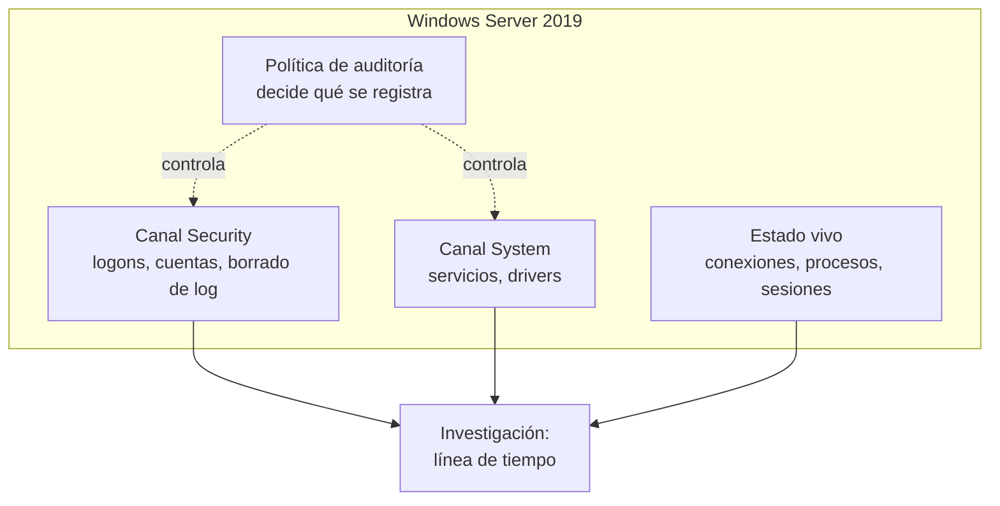
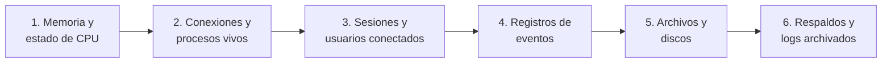
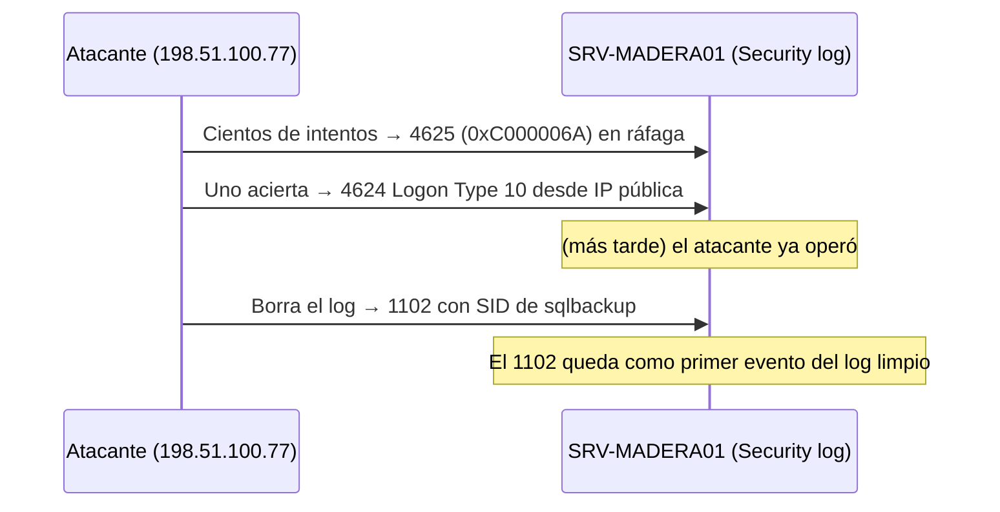
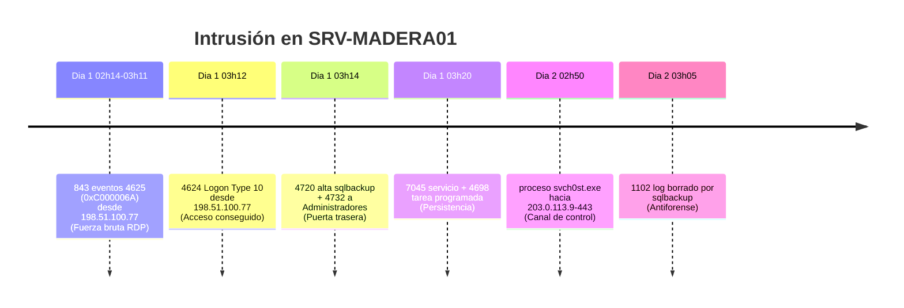
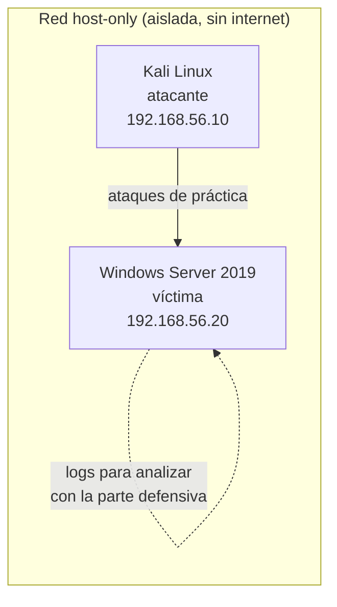
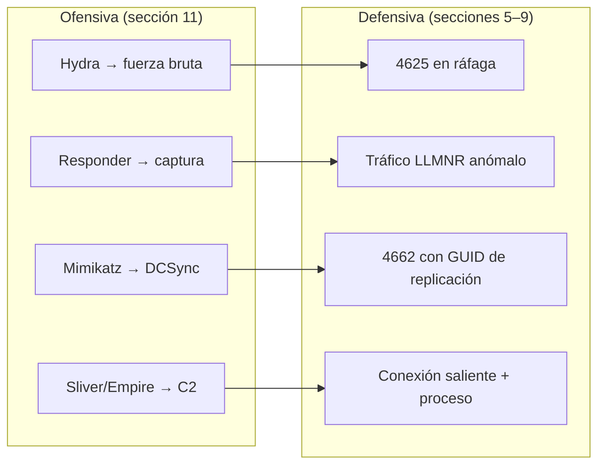

# Auditoría de seguridad e investigación de intrusiones en un servidor Windows

> **Guía de estudio para principiantes.** Está escrita para alguien que tiene acceso a un servidor Windows y sospecha que fue intervenido, pero que **no tiene formación previa en redes ni en sistemas operativos**. Cada término se define antes de usarse; cada comando dice qué se espera ver y cómo leerlo. El recorrido va de entender qué se está mirando, a preservar la evidencia, a leer los registros del sistema, a reconstruir lo que pasó, y —al final— a entender cómo se reproduce un ataque en un laboratorio para saber qué huella deja.

---

## Aviso sobre las salidas mostradas

Esta guía muestra la **forma** de la salida de cada comando y explica el significado de cada columna, pero esas salidas son **ilustrativas**: se derivan de un escenario de práctica documentado (un servidor ficticio llamado `SRV-MADERA01`, descrito en la sección 1.4), no de la captura de un sistema real. Cuando practiques sobre tu propio equipo autorizado, tus valores serán distintos; lo que se mantiene es cómo se interpretan. Toda afirmación técnica está anclada a documentación oficial, citada en las **Referencias** (sección 12).

---

## Índice

1. [Qué es lo que vas a auditar](#1-qué-es-lo-que-vas-a-auditar)
2. [El modelo de seguridad de Windows en cinco ideas](#2-el-modelo-de-seguridad-de-windows-en-cinco-ideas)
3. [Reglas de no daño: qué hacer antes de tocar nada](#3-reglas-de-no-daño-qué-hacer-antes-de-tocar-nada)
4. [El registro de eventos: dónde queda escrito lo que pasó](#4-el-registro-de-eventos-dónde-queda-escrito-lo-que-pasó)
5. [Leer los accesos: logons, fallos y el borrado del registro](#5-leer-los-accesos-logons-fallos-y-el-borrado-del-registro)
6. [Cuentas y persistencia: ¿dejaron una puerta abierta?](#6-cuentas-y-persistencia-dejaron-una-puerta-abierta)
7. [Lo que está vivo ahora: conexiones, procesos y sesiones](#7-lo-que-está-vivo-ahora-conexiones-procesos-y-sesiones)
8. [Hacer que el sistema registre lo que hoy no registra](#8-hacer-que-el-sistema-registre-lo-que-hoy-no-registra)
9. [Método de caza: juntar todo en un relato con evidencia](#9-método-de-caza-juntar-todo-en-un-relato-con-evidencia)
10. [Pentesting I: encuadre, ética y laboratorio](#10-pentesting-i-encuadre-ética-y-laboratorio)
11. [Pentesting II: herramientas de la industria y la huella que dejan](#11-pentesting-ii-herramientas-de-la-industria-y-la-huella-que-dejan)
12. [Referencias](#12-referencias)
13. [Glosario](#13-glosario)
- [Apéndice A — Montar y usar el laboratorio paso a paso](#apéndice-a--montar-y-usar-el-laboratorio-paso-a-paso)

---

## 1. Qué es lo que vas a auditar

### 1.1 Por qué empezar por acá

Antes de correr un solo comando conviene entender qué es una red Windows, porque cada dato que vas a ver —una conexión, un usuario, un evento— sólo significa algo si sabés qué representa. Un principiante que salta directo a los comandos termina mirando números sin saber cuáles son normales. La meta de esta sección es que, cuando más adelante veas «Logon Type 10 desde una dirección de internet a las tres de la madrugada», sepas por qué eso es una alarma y no ruido.

### 1.2 Red, dirección IP y puerto

Una **red** es un conjunto de computadoras que pueden hablar entre sí. Para que un mensaje llegue a destino hacen falta dos datos: **a dónde** va y **para qué programa** de esa máquina es.

- La **dirección IP** dice *dónde* está una máquina. Es un número de cuatro partes, como `10.10.0.10`. El propio estándar que la define (RFC 791) lo resume, en paráfrasis, como que una dirección indica *dónde* está algo, mientras un nombre indica *qué* se busca y una ruta indica *cómo* llegar. Hay direcciones **privadas** —las de una red interna, que no se ven desde internet, como los rangos `10.x.x.x` o `192.168.x.x`— y **públicas**, fuera de esos rangos. (En esta guía, las direcciones «de internet» del escenario usan rangos reservados para documentación —`198.51.100.x` y `203.0.113.x`, RFC 5737—, elegidos justamente para no apuntar a ningún equipo real.)
- El **puerto** dice *para qué programa*. Es un número de 0 a 65535. Por convención, ciertos servicios usan puertos fijos: el escritorio remoto (RDP) usa el 3389, el archivo compartido de Windows (SMB) usa el 445, el sistema de nombres (DNS) usa el 53. La autoridad que reparte esos números (IANA) divide el rango en *puertos de sistema* (0–1023), *de usuario* (1024–49151) y *dinámicos* (49152–65535).

Una **conexión** queda definida por cuatro datos: IP y puerto de origen, IP y puerto de destino. Ese cuarteto es lo que más adelante vas a leer en `netstat`.

> **Analogía.** La IP es la dirección de un edificio; el puerto es el número de departamento. El cartero necesita los dos para entregar la carta.

### 1.3 Dominio, Active Directory y controlador de dominio

En una empresa, las computadoras no se administran de a una. Se agrupan en un **dominio**: un conjunto de equipos y usuarios que comparten una base de datos común de cuentas y reglas. Esa base de datos es **Active Directory (AD)**, y la máquina que la guarda y la controla es el **controlador de dominio (Domain Controller, DC)**.

El DC es la pieza más sensible de la red: quien controla el DC controla todas las cuentas. Por eso, en el escenario de esta guía, el servidor auditado es a la vez el DC —y por eso una intrusión ahí es tan grave—.

Los servicios que hacen funcionar un dominio también usan puertos conocidos: Kerberos (autenticación) en el 88, LDAP (consultas al directorio) en el 389, DNS en el 53. Ver conexiones a esos puertos es normal; lo que importa es **quién** las hace y **desde dónde**.

### 1.4 El escenario de práctica: `SRV-MADERA01`

Todo lo que sigue se apoya en un caso concreto y ficticio, para que los ejemplos sean coherentes entre sí. Una empresa pequeña, «Maderera del Sur», tiene un único servidor:

| Dato | Valor |
|---|---|
| Nombre del equipo | `SRV-MADERA01` |
| Sistema operativo | Windows Server 2019 |
| Rol | Controlador de dominio + archivos + facturación |
| Dominio | `maderasur.local` |
| Dirección IP | `10.10.0.10` |
| Problema declarado | El escritorio remoto (RDP) está publicado a internet; se sospecha intrusión y borrado de registros |

Ese servidor tiene **vicios de administración** heredados: RDP abierto a todo internet, cuentas con más privilegios de los que necesitan, contraseñas que no expiran y la auditoría del sistema en su configuración de fábrica. Son exactamente las condiciones que hacen posible el ataque que vas a investigar.

### 1.5 Usuarios, grupos, cuentas de servicio y privilegios

- Un **usuario** es una identidad con la que alguien inicia sesión. En Windows cada cuenta tiene un identificador interno único llamado **SID** (Security Identifier); el nombre se puede cambiar, el SID no.
- Un **grupo** junta usuarios para darles permisos en bloque. El grupo `Administradores` (Administrators) es el más poderoso de una máquina; `Domain Admins` lo es de todo el dominio.
- Una **cuenta de servicio** es una cuenta que no usa una persona sino un programa que corre solo (por ejemplo, el sistema de facturación). Es un vicio frecuente —y presente en el escenario— que estas cuentas tengan privilegios de administrador que no necesitan.
- Un **privilegio** es un permiso especial (apagar el equipo, cambiar la hora, actuar como parte del sistema operativo). Los privilegios altos son lo que un atacante busca conseguir.

### 1.6 Qué es un logon y por qué tiene «tipos»

Un **logon** (inicio de sesión) es el acto de una cuenta autenticándose ante el sistema. Windows distingue **tipos de logon** según *cómo* se entró, y esa distinción es central para la investigación. No es lo mismo alguien sentado frente al servidor (tipo 2, interactivo) que alguien entrando por escritorio remoto desde otra máquina (tipo 10, remoto interactivo) o un servicio de red accediendo a un archivo compartido (tipo 3, de red). Cada uno deja el mismo evento pero con un número de tipo distinto, y saber leer ese número es lo que te permite decir «esto entró por RDP desde afuera».

La tabla completa de tipos de logon se detalla en la sección 5; por ahora quedate con la idea: **el tipo de logon dice cómo entró la cuenta, y ciertos tipos desde ciertos orígenes son la firma de un ataque.**

### 1.7 Línea de base: la definición de «normal»

No se puede reconocer lo anormal sin saber qué es normal. Una **línea de base (baseline)** es el retrato del sistema sano: qué cuentas existen, qué servicios corren, qué conexiones son habituales, en qué horario trabaja la gente. En el escenario, la línea de base dice que `jperez` y `mgomez` trabajan de día desde sus PCs, que los únicos administradores son `Administrador` y la cuenta de servicio, y que nadie entra al servidor de madrugada desde internet. Cada desvío de esa línea es un candidato a indicador de compromiso.

> **¿Y en TU servidor real, de dónde sale la línea de base?** Esta es la pregunta más importante antes de empezar, porque todo el método consiste en comparar contra ella. Esta guía te da la línea de base del escenario ficticio ya resuelta; en un servidor real tenés que construirla, y hay tres fuentes: (1) **el inventario aprobado de la organización** —pedile a quien administra el sistema la lista oficial de cuentas, administradores y aplicaciones que *deberían* existir—; (2) **el conocimiento del negocio** —quién trabaja, en qué horario, desde qué máquinas—; y (3) **una foto del sistema tomada cuando se lo cree sano** (correr los comandos de las secciones 6 y 7 en un momento normal y guardar el resultado). Si no tenés ninguna de las tres, tu primer trabajo no es investigar sino **construir esa línea de base**: sin ella, no vas a poder distinguir la cuenta legítima de la puerta trasera. Cuando en las secciones siguientes veas «comparar contra la línea de base», es contra *esta* información que lo hacés.

Un **indicador de compromiso (IoC)** es una señal observable de que hubo actividad maliciosa: una cuenta que no debería existir, una conexión a una dirección desconocida, un registro borrado.

### 1.8 Preguntas guía

**¿Por qué es tan grave que el servidor sea el controlador de dominio?**
Porque concentra la autoridad sobre todas las cuentas de la red. Comprometer una PC de escritorio afecta a un usuario; comprometer el DC afecta a todos. Un atacante que llega al DC puede crear cuentas, cambiar contraseñas y volverse indistinguible de un administrador legítimo.

**Si veo una conexión al puerto 88 o 389, ¿es un ataque?**
No en sí mismo: son Kerberos y LDAP, servicios normales de un dominio. Lo que convierte una conexión en sospechosa no es el puerto sino el contexto: quién la origina, desde qué dirección y en qué horario. Por eso primero se construye la línea de base.

**¿Para qué me sirve el SID si el nombre de la cuenta ya me lo dice todo?**
Porque el nombre miente y el SID no. Un atacante puede renombrar una cuenta o crear una parecida a una legítima; el SID permite distinguir la cuenta real de una impostora y correlacionar eventos aunque el nombre haya cambiado.

---

## 2. El modelo de seguridad de Windows en cinco ideas

### 2.1 Idea 1 — Todo lo que pasa puede quedar registrado

Windows tiene un **registro de eventos (Event Log)**: un sistema que anota, en canales separados, lo que ocurre en la máquina. El canal **Security** guarda los hechos de seguridad (quién entró, quién falló, qué se creó); el canal **System** guarda lo del sistema (servicios que arrancan, drivers); el canal **Application**, lo de los programas. La palabra clave es *puede*: Windows sólo registra lo que la **política de auditoría** le manda registrar, y por defecto esa política deja afuera cosas importantes. Ese hueco es la sección 8.

### 2.2 Idea 2 — Cada evento tiene un número (Event ID)

Cada tipo de hecho tiene un identificador numérico estable. Un inicio de sesión exitoso es siempre el **4624**; uno fallido, el **4625**; el borrado del registro de seguridad, el **1102**. Aprender seguridad en Windows es, en buena parte, aprender a leer un puñado de estos números. No hace falta memorizarlos todos: hace falta conocer los quince o veinte que cuentan una intrusión, y esta guía se concentra en ésos.

### 2.3 Idea 3 — Las cuentas se identifican por SID, no por nombre

Como se dijo en 1.5, el nombre es cosmético y el SID es la identidad real. Los eventos registran ambos; cuando el nombre y el SID no concuerdan con la línea de base, hay algo que mirar.

### 2.4 Idea 4 — Los eventos se correlacionan por identificadores

Un mismo inicio de sesión genera varios eventos, y todos comparten un **Logon ID**: un número (en hexadecimal) que identifica esa sesión concreta. Con el Logon ID podés unir «esta cuenta entró» (4624) con «esta cuenta borró el registro» (1102) y demostrar que fue la misma sesión. Esa capacidad de coser eventos es lo que convierte una lista de anotaciones en un relato.

> **No te asustes del hexadecimal.** Vas a ver identificadores como `0x7A441` o códigos como `0xC000006A`. El prefijo `0x` sólo indica que el número está escrito en hexadecimal; **no necesitás decodificarlo ni entender su valor**. Tu única tarea con ellos es *comparar*: verificar si dos identificadores son la misma cadena de caracteres (para saber si dos eventos pertenecen a la misma sesión) o buscar un código concreto en una tabla de significados. Tratalos como una matrícula de auto: no importa qué «vale», importa si dos coinciden.

### 2.5 Idea 5 — El atacante también sabe todo esto

Un intruso con experiencia intenta borrar sus huellas: vacía el registro de seguridad, borra tareas, cierra conexiones. Pero Windows está diseñado para que ciertos actos —sobre todo el borrado del registro— dejen su propia marca. La estrategia del investigador se apoya en eso: **en un sistema comprometido, la ausencia de registros es en sí misma un dato.** Un log de seguridad sospechosamente vacío, o con un hueco de dos horas, dice tanto como un evento explícito.

### 2.6 Diagrama: de dónde sale cada dato



### 2.7 Preguntas guía

**Si Windows registra todo, ¿por qué me dicen que la política está «de fábrica» y faltan datos?**
Porque «registrar todo» es una capacidad, no un comportamiento por defecto. De fábrica, Windows registra los inicios de sesión pero no, por ejemplo, la línea de comandos de cada proceso que se ejecuta. Habilitar esa telemetría extra es una decisión del administrador; en un servidor con vicios, esa decisión nunca se tomó.

**¿Qué gano correlacionando por Logon ID en vez de mirar los eventos por separado?**
Ganás prueba. Ver un logon a las 03:12 y un borrado de registro a las 03:05 son dos hechos sueltos; mostrar que comparten el mismo Logon ID demuestra que la misma sesión que entró fue la que borró. La correlación transforma coincidencia en evidencia.

---

## 3. Reglas de no daño: qué hacer antes de tocar nada

### 3.1 El problema del observador

Investigar un sistema lo modifica. Cada comando que corrés deja una huella, abre un archivo, genera un evento nuevo. Si el sistema está comprometido y actuás con torpeza, podés **destruir la evidencia** que venías a buscar —o peor, avisarle al intruso que lo descubriste—. Por eso la investigación no empieza por un comando: empieza por un método.

### 3.2 Orden de volatilidad: lo efímero primero

Los datos de un sistema tienen distinta esperanza de vida. Las conexiones de red de este instante desaparecen en segundos; un archivo de log puede durar meses. La guía de recolección de evidencia de la industria (RFC 3227) fija un **orden de volatilidad**: recolectar primero lo más efímero y dejar para el final lo más estable.



Para el nivel de esta guía, la traducción práctica es: **primero mirá lo que está vivo ahora** (conexiones, procesos, sesiones — sección 7), **anotá lo que ves**, y después pasá a los registros, que son más estables. Si arrancás reiniciando el servidor «para ver si se arregla», borrás de un golpe todo el nivel 1 y 2.

### 3.3 Mínima alteración y registro de tus propias acciones

Dos reglas simples que separan a un investigador de alguien que empeora las cosas:

1. **Preferí leer antes que cambiar.** Los comandos de esta guía son, casi todos, de sólo lectura. No borres cuentas sospechosas, no cierres conexiones, no «limpies» nada hasta haber documentado. La contención viene después del análisis, no antes.
2. **Registrá lo que hacés.** Anotá cada comando que corrés, a qué hora y con qué cuenta. Si más adelante interviene un profesional o hay una denuncia, tu propio registro distingue las huellas tuyas de las del atacante. Esto es la **cadena de custodia** en su versión mínima.

> **Advertencia.** Correr comandos de investigación **con la misma cuenta que el atacante pudo haber comprometido** también deja huellas y puede darle pistas si tiene acceso activo. Cuando sea posible, usá una cuenta separada creada para auditar (en el escenario, la cuenta `soporte`). Si en tu servidor real no existe una cuenta así, tenés dos opciones: pedirle a quien administra el sistema que cree una cuenta de administrador dedicada a la auditoría, o —si eso no es posible en el momento— investigar con la cuenta que tengas, **anotando que lo hiciste** para poder distinguir después tus huellas de las del atacante. Crear la cuenta de auditoría es una alteración mínima y justificada; lo que la regla de mínima alteración prohíbe es *cambiar o borrar* lo que estás investigando, no habilitarte un acceso limpio para mirar.

### 3.4 El marco de la industria: NIST SP 800-61

La respuesta profesional a incidentes sigue un ciclo estándar, descrito por el NIST en su guía SP 800-61. Conocerlo te ubica: lo que hace esta guía es sobre todo la segunda fase.

| Fase (NIST SP 800-61) | Qué es | Dónde estás en esta guía |
|---|---|---|
| Preparación | Tener herramientas, permisos y línea de base antes del incidente | Secciones 1–2 y 8 |
| Detección y análisis | Reconocer que hubo un incidente y entender su alcance | **Secciones 4–9 (el grueso)** |
| Contención, erradicación y recuperación | Frenar, limpiar y restaurar | Fuera del alcance de un principiante: se escala |
| Actividad post-incidente | Aprender y corregir la causa raíz | Sección 9.6 (recomendaciones) |

### 3.5 Cuándo NO seguir solo

Esta guía forma criterio para **detectar y entender**, no para responder a un incidente grave en producción. Parás y escalás a un profesional (o a tu responsable) cuando: hay datos personales o dinero en juego, cuando la intrusión parece activa en este momento, o cuando cualquier acción de contención podría interrumpir un servicio del que depende la empresa. Detectar bien y no romper nada es un resultado completamente válido —y a menudo el más valioso—.

### 3.6 Preguntas guía

**¿Por qué no puedo simplemente reiniciar el servidor si anda raro?**
Porque un reinicio destruye toda la evidencia volátil: las conexiones activas, los procesos del atacante en memoria, las sesiones abiertas. Si el intruso corría una herramienta sólo en memoria, el reinicio la borra sin dejar rastro. Primero se observa y se documenta lo vivo; recién después se considera intervenir.

**Si encuentro la cuenta del atacante, ¿no debería borrarla enseguida?**
No de inmediato. Borrarla es una acción de contención que conviene tomar con un plan: antes hay que entender qué hizo esa cuenta, si dejó otras puertas, y documentar todo. Borrarla a las apuradas puede eliminar evidencia y, si el atacante tiene otra vía de entrada, sólo le avisa que lo viste. Documentar primero, contener después y con criterio.

**¿Qué significa exactamente «orden de volatilidad» en la práctica de un principiante?**
Significa un orden de trabajo concreto: primero corré los comandos de la sección 7 (conexiones, procesos, sesiones vivas) y anotá lo que ves; después pasá a los registros de eventos de las secciones 4–6, que no se van a borrar solos. Nunca al revés, y nunca empezando por apagar o reiniciar.

---

## 4. El registro de eventos: dónde queda escrito lo que pasó

### 4.1 Qué es el registro de eventos

El **registro de eventos de Windows (Windows Event Log)** es el diario de a bordo del sistema. Cada vez que ocurre algo digno de anotarse —una cuenta inicia sesión, un servicio arranca, un programa falla— Windows escribe un **evento**: una anotación con fecha, un número identificador y una serie de campos. Los eventos se guardan en **canales** separados por tema. Para una investigación de intrusión, tres canales concentran casi todo:

| Canal | Qué guarda | Ejemplos de eventos |
|---|---|---|
| **Security** | Hechos de seguridad: accesos, cuentas, permisos | 4624 (logon ok), 4625 (logon fallido), 1102 (log borrado) |
| **System** | Hechos del sistema operativo: servicios, drivers | 7045 (servicio nuevo), 7040, 104 (log borrado) |
| **Application** | Hechos de los programas instalados | Errores y avisos de aplicaciones |

Hay además decenas de canales «operativos» más específicos (por ejemplo, los de PowerShell o los de Escritorio Remoto), que se usan cuando la pista lo pide.

### 4.2 Anatomía de un evento

Todo evento tiene la misma estructura básica. Conviene reconocer sus partes porque son las mismas en la interfaz gráfica y en la línea de comandos:

| Parte | Qué es | Ejemplo |
|---|---|---|
| **Fecha y hora** | Cuándo ocurrió (ojo con la zona horaria) | `2026-05-04 03:12:41` |
| **Id. del evento (Event ID)** | El número que dice *qué tipo* de hecho es | `4624` |
| **Proveedor (Source)** | Qué componente lo generó | `Microsoft-Windows-Security-Auditing` |
| **Nivel** | Información, Advertencia, Error, Crítico | Información |
| **Campos** | Los datos propios del hecho | cuenta, tipo de logon, dirección de origen… |

La clave para un principiante: **el Event ID te dice qué mirar, y los campos te dicen los detalles**. Dos eventos con el mismo ID tienen siempre los mismos campos, así que una vez que aprendés a leer un 4624, sabés leerlos todos.

### 4.3 Antes de empezar: cómo leer y ejecutar los comandos de esta guía

A partir de acá la guía muestra comandos para copiar. Como el lector no tiene por qué haber usado nunca una consola, conviene aclarar de entrada tres cosas que después se dan por sabidas.

**Hay dos consolas distintas en Windows, y la guía usa las dos.** Se distinguen por el símbolo con que empieza el comentario dentro de cada bloque de código:

| Consola | Cómo se abre | Los bloques de esta guía que le corresponden | Marca del comentario |
|---|---|---|---|
| **PowerShell** (la moderna, la principal) | Menú Inicio → escribir «PowerShell» → clic derecho → *Ejecutar como administrador* | Los que empiezan con `Get-...` (p. ej. `Get-WinEvent`) | `#` |
| **Símbolo del sistema** (`cmd`, la clásica) | Menú Inicio → escribir «cmd» → clic derecho → *Ejecutar como administrador* | Los de `netstat`, `wevtutil`, `auditpol`, `tasklist`, `query user` | `::` |

En la práctica, **PowerShell también entiende los comandos de `cmd`** (`netstat`, `wevtutil`, etc.), así que podés hacer casi todo desde una única ventana de PowerShell abierta como administrador. La línea que empieza con `#` o con `::` es un **comentario**: explica qué hace el comando y **no se ejecuta**; podés pegarla o borrarla, da igual.

**Cómo se pega un comando que ocupa varios renglones.** Muchos comandos útiles se parten en varias líneas con el símbolo `|` (la *tubería*) al final. Seleccioná y copiá el bloque **entero** y pegalo de una sola vez en la consola (clic derecho pega en estas ventanas); recién ahí apretá Enter. Si apretás Enter en medio y la consola te muestra `>>` esperando, no se colgó: está esperando el resto del comando. Para salir de ese estado y volver a empezar, apretá `Ctrl + C`.

**Qué es la «tubería» `|`.** Es una cinta transportadora: toma lo que produce el comando de la izquierda y se lo pasa al de la derecha para que lo siga trabajando. Así, `Get-WinEvent ... | Where-Object ...` significa «traé los eventos **y después** quedate sólo con los que cumplan tal condición». No hace falta dominar PowerShell para usar esta guía: alcanza con copiar el bloque, cambiar una fecha o un número cuando se indique, y leer la salida como se explica en cada caso.

### 4.4 Tres formas de leer los eventos

Hay tres herramientas nativas para leer el registro. Las tres muestran los mismos datos; se eligen según la comodidad y la tarea.

> **Un nombre para el mismo lugar.** A lo largo de la guía, el registro donde se anotan los hechos de seguridad se llama **canal Security** (o «registro de Seguridad»). Cuando aparezca la frase «registro de auditoría» entre comillas es porque así lo nombra el texto oficial del evento 1102; se refiere al mismo canal Security. Y «registro de eventos» (a secas) es el sistema completo que engloba todos los canales.

#### 4.4.1 El Visor de eventos (interfaz gráfica)

El **Visor de eventos (Event Viewer, `eventvwr.msc`)** es la puerta de entrada visual. Se abre desde Inicio escribiendo «Visor de eventos», o con `eventvwr` en la consola. En el panel izquierdo se navega a *Registros de Windows → Seguridad*; en el centro aparece la lista de eventos; al hacer clic en uno, abajo se ven sus campos. Tiene un buscador y un filtro («Filtrar registro actual…») donde se puede pedir, por ejemplo, sólo los eventos con Id. 4625.

Es cómodo para explorar, pero se queda corto cuando hay que cruzar miles de eventos o filtrar por un dato fino. Para eso está PowerShell.

#### 4.4.2 `Get-WinEvent` (PowerShell) — la herramienta de trabajo

**PowerShell** es la consola de administración moderna de Windows; viene instalada (versión 5.1) en Windows Server 2019. Se abre buscando «PowerShell» y eligiendo *Ejecutar como administrador* (leer el canal Security exige privilegios).

El cmdlet `Get-WinEvent` lee cualquier canal. Su forma más simple:

```powershell
# Traer los últimos 20 eventos del canal Security
Get-WinEvent -LogName Security -MaxEvents 20
```

*Qué se espera ver:* una tabla con las columnas `TimeCreated` (fecha), `Id` (el Event ID), `LevelDisplayName` (nivel) y `Message` (el texto del evento). *Cómo leerlo:* mirá primero la columna `Id`; ese número te dice qué tipo de hecho es. La lista está ordenada del más reciente al más antiguo.

La verdadera potencia aparece al **filtrar**. La forma eficiente es con `-FilterHashtable`, que le pide a Windows que filtre en origen (rápido, incluso con millones de eventos):

```powershell
# Todos los inicios de sesión exitosos (4624) del 4 de mayo de 2026
Get-WinEvent -FilterHashtable @{
    LogName   = 'Security'
    Id        = 4624
    StartTime = '2026-05-04 00:00:00'
    EndTime   = '2026-05-05 00:00:00'
}
```

*Qué se espera ver:* la lista de eventos 4624 ocurridos ese día. *Cómo leerlo:* cada fila es un inicio de sesión; en la sección 5 vas a aprender a extraer de cada uno quién entró, cómo y desde dónde.

> **Buena práctica de lectura.** Cuando un evento tiene muchos campos, conviene verlo entero con formato de lista:
> ```powershell
> Get-WinEvent -FilterHashtable @{LogName='Security'; Id=4624} -MaxEvents 1 | Format-List *
> ```
> Así ves el `Message` completo, con todos los campos desplegados, en vez de la tabla resumida.

#### 4.4.3 `wevtutil` (línea de comandos clásica)

**`wevtutil`** es la utilidad de línea de comandos clásica para el registro. Sirve sobre todo para tres cosas: consultar la **configuración** de un canal, **exportar** un canal a un archivo, y ver el estado de los logs. Dos usos útiles en una auditoría:

```cmd
:: Crear primero la carpeta donde vas a guardar la evidencia (si no existe)
mkdir C:\evidencia

:: Ver la configuración del canal Security: tamaño máximo, si retiene o sobrescribe
wevtutil gl Security

:: Exportar el canal Security completo a un archivo, para preservarlo como evidencia
wevtutil epl Security C:\evidencia\Security_2026-05-04.evtx
```

*Por qué importa para la evidencia:* `wevtutil gl` te dice el **tamaño máximo** del log y qué hace cuando se llena (sobrescribir los más viejos). Un log chico que se sobrescribe rápido explica por qué «faltan» eventos antiguos sin que nadie los haya borrado —un matiz importante antes de gritar «¡manipulación!»—. Y `wevtutil epl` te permite **guardar una copia** del canal como archivo `.evtx`, que es la forma correcta de preservar el registro antes de que rote o lo toquen. La carpeta `C:\evidencia\` es un ejemplo: la creás vos con `mkdir` (el comando de arriba) antes de exportar, o el `epl` fallará porque la ruta no existe. **Mejor todavía: copiá el archivo `.evtx` a otra máquina o a un pendrive** en cuanto lo generes, porque guardar la evidencia en el mismo servidor comprometido la deja al alcance del atacante.

### 4.5 Antes de leer: ¿el reloj y la zona horaria son confiables?

Toda la investigación se apoya en las horas de los eventos. Si el reloj del servidor está mal o si confundís la zona horaria, tu línea de tiempo será falsa. Antes de sacar conclusiones, verificá la hora del sistema:

```powershell
Get-Date                                  # hora actual del servidor
Get-TimeZone                              # zona horaria configurada
w32tm /query /status                      # estado de sincronización horaria
```

*Cómo leerlo:* anotá la zona horaria del servidor y usala de forma consistente en toda la investigación. Si comparás eventos del servidor con horarios de otra fuente (un router, un firewall), asegurate de llevar todo a la misma zona.

### 4.6 Preguntas guía

**¿Cuándo uso el Visor de eventos y cuándo PowerShell?**
El Visor es para explorar y para mirar un evento con calma: es visual y no exige recordar comandos. PowerShell (`Get-WinEvent`) es para trabajar en serio: filtrar por fecha y por Id, cruzar miles de eventos, extraer un campo puntual de muchos eventos a la vez. La regla práctica: explorás con el Visor, investigás con PowerShell.

**Si «faltan» eventos viejos, ¿es siempre borrado malicioso?**
No. Un canal de eventos tiene un tamaño máximo y, cuando se llena, sobrescribe los más antiguos. Si el log de Seguridad es chico y el servidor tiene mucha actividad, los eventos de hace semanas pueden haber desaparecido por rotación normal. Por eso, antes de acusar manipulación, se mira con `wevtutil gl` el tamaño y la política de retención. La manipulación deja una firma distinta —un evento 1102— que se estudia en la sección 5.

**¿Por qué tengo que abrir PowerShell «como administrador»?**
Porque el canal Security contiene información sensible y Windows exige privilegios elevados para leerlo. Si abrís PowerShell como usuario común, `Get-WinEvent -LogName Security` te va a dar un error de acceso denegado. Abrirlo como administrador —con la cuenta de auditoría, no con una comprometida— resuelve eso.

---

## 5. Leer los accesos: logons, fallos y el borrado del registro

Esta es la sección central. El caso del escenario —un servidor con RDP publicado a internet— se resuelve, en su mayor parte, leyendo tres cosas en el canal Security: los **fallos de inicio de sesión** (4625), los **inicios exitosos** (4624) y el **borrado del registro** (1102). Con esas tres piezas se reconstruye cómo entró el atacante y cómo intentó taparse.

### 5.1 El inicio de sesión exitoso: evento 4624

El evento **4624 «Se inició sesión correctamente en una cuenta»** se genera cada vez que se crea una sesión de inicio, en la máquina donde se accede (según la documentación oficial de Microsoft, «this event generates when a logon session is created on the destination machine»). Es el evento más importante de todos porque responde tres preguntas: **quién** entró, **cómo** entró y **desde dónde**.

Los campos que importan:

| Campo | Qué dice | Por qué importa |
|---|---|---|
| **Account Name** | La cuenta que inició sesión | *Quién* |
| **Logon Type** | El método de inicio (número) | *Cómo* entró |
| **Source Network Address** | La dirección IP de origen | *Desde dónde* |
| **Logon ID** | Identificador de esta sesión (hex) | Permite correlacionar con otros eventos |
| **Elevated Token** | Si la sesión tiene privilegios de administrador | Cuánto poder obtuvo |

#### Los tipos de logon (Logon Type)

El número de tipo de logon es la clave para distinguir un acceso normal de uno sospechoso. Esta es la selección de tipos que más importan en esta investigación (los nombres y significados son los de la documentación oficial de Microsoft, que lista además los tipos 0, 1 y 13):

| Tipo | Nombre | Qué significa |
|---|---|---|
| 2 | Interactive | Alguien inició sesión sentado frente a la computadora |
| 3 | Network | Una cuenta accedió desde la red (por ejemplo, a un archivo compartido) |
| 4 | Batch | Un proceso por lotes (tareas programadas) |
| 5 | Service | El administrador de servicios arrancó un servicio |
| 7 | Unlock | Se desbloqueó la estación |
| 8 | NetworkCleartext | Inicio desde la red donde la contraseña llegó al paquete de autenticación **sin cifrar (sin *hashear*)** —caso típico: la autenticación *Basic* de IIS—. **No** significa que la contraseña viaje en claro por la red |
| 9 | NewCredentials | Un proceso usó credenciales distintas para conexiones salientes (p. ej. `runas /netonly`) |
| 10 | RemoteInteractive | **Inicio remoto por Escritorio Remoto (RDP) o Terminal Services** |
| 11 | CachedInteractive | Inicio con credenciales guardadas localmente, sin contactar al DC |
| 12 | CachedRemoteInteractive | Como el 10 (RDP) pero con credenciales cacheadas; también indica acceso remoto |

**El tipo 10 es el protagonista del caso.** Un `4624` con `Logon Type 10` significa que alguien entró por RDP. Si además el campo `Source Network Address` es una dirección **pública** (de internet, no del rango interno `10.10.0.x`) y ocurrió de madrugada, tenés la firma exacta del ataque del escenario.

```powershell
# Buscar todos los inicios remotos (RDP) del período sospechoso y ver de qué IP vinieron
Get-WinEvent -FilterHashtable @{LogName='Security'; Id=4624; StartTime='2026-05-04'} |
  Where-Object { $_.Message -match 'Logon Type:\s+10' } |
  Select-Object TimeCreated,
                @{n='Cuenta'; e={ ($_.Message -split "`n" | Select-String 'Account Name:')[1] }},
                @{n='Origen'; e={ ($_.Message -split "`n" | Select-String 'Source Network Address:') }}
```

*Qué se espera ver (ilustrativo, escenario `SRV-MADERA01`):*

```text
TimeCreated           Cuenta                       Origen
-----------           ------                       ------
2026-05-04 03:12:41   Account Name:  Administrador  Source Network Address:  198.51.100.77
```

*Cómo leerlo:* un inicio remoto (tipo 10) de la cuenta `Administrador`, a las 03:12, **desde `198.51.100.77`** —una dirección pública, ajena a la red interna—. Nadie de la empresa entra al servidor por RDP desde internet a esa hora: esto es el acceso del atacante. El dato de la IP de origen es lo que convierte una sospecha en un hecho.

### 5.2 Los fallos de inicio de sesión: evento 4625 y la fuerza bruta

El evento **4625 «No se pudo iniciar sesión en una cuenta»** se registra ante cualquier fallo de inicio. Un fallo suelto no dice nada —todos erramos la contraseña alguna vez—. Lo que delata un ataque es el **patrón**: cientos o miles de 4625 en pocos minutos, sobre la misma cuenta o sobre muchas cuentas, desde la misma IP. Eso es **fuerza bruta**: probar contraseñas hasta acertar.

El evento trae un **código de subestado (Sub Status)** que explica *por qué* falló. Los más útiles para investigar (confirmados en la documentación oficial de Microsoft del evento 4625 y del 4776):

| Código | Significado | Qué sugiere |
|---|---|---|
| `0xC000006A` | Contraseña incorrecta para un usuario que **sí existe** | Fuerza bruta contra una cuenta conocida |
| `0xC0000064` | El **usuario no existe** | Enumeración de usuarios (probando nombres) |
| `0xC0000072` | Cuenta deshabilitada por el administrador | Intento contra una cuenta apagada |
| `0xC0000234` | Cuenta **bloqueada** | El ataque disparó el bloqueo por intentos |

> **Nota de rigor.** Otros códigos que se citan a menudo no figuran en la tabla del evento 4625: `0xC0000071` (contraseña expirada) aparece documentado en el evento **4776**, y `0xC0000133` (desfase de reloj) es un valor NTSTATUS de Kerberos que Microsoft **no** lista en la página del 4625. La guía sólo afirma como «de la documentación del 4625» los cuatro de la tabla de arriba.

```powershell
# Contar los fallos de logon por IP de origen en la madrugada del 4 de mayo
Get-WinEvent -FilterHashtable @{LogName='Security'; Id=4625; StartTime='2026-05-04 02:00'; EndTime='2026-05-04 04:00'} |
  ForEach-Object { if ($_.Message -match 'Source Network Address:\s+(\S+)') { $matches[1] } } |
  Group-Object | Sort-Object Count -Descending
```

*Qué se espera ver (ilustrativo):*

```text
Count  Name
-----  ----
 843   198.51.100.77
   4   10.10.0.34
```

*Cómo leerlo:* 843 fallos desde `198.51.100.77` en poco menos de una hora de madrugada (dentro de la ventana de consulta de dos horas) es, sin ambigüedad, un ataque de fuerza bruta. Los 4 fallos desde `10.10.0.34` (una PC interna) son un usuario que se equivocó de contraseña: ruido normal. Fijate que la **misma IP** `198.51.100.77` es la que después aparece en el 4624 exitoso de la sección 5.1: ahí está la historia completa —cientos de intentos y, finalmente, uno que acertó—.

> **En un controlador de dominio, mirá también Kerberos.** Los fallos de contraseña contra el dominio se ven además como evento **4771 «Error de preautenticación Kerberos»** con código de error `0x18` (contraseña incorrecta), y las validaciones NTLM como **4776**. En un DC, una ráfaga de 4771 con `0x18` es otra cara de la misma fuerza bruta.

### 5.3 La firma de la manipulación: evento 1102

Acá está el corazón del caso. El evento **1102 «Se borró el registro de auditoría»** se genera cada vez que se vacía el log de Seguridad. La documentación de Microsoft es explícita: «normalmente no deberías ver este evento… recomendamos monitorearlo e investigar por qué se realizó esta acción».

Lo que lo hace tan valioso es una propiedad de diseño: **quien vacía el registro completo no puede hacerlo sin dejar este evento**. Cuando alguien limpia el log de Seguridad por la vía normal (el Visor, `wevtutil cl`, `Clear-EventLog`), Windows escribe el 1102 *después* de vaciarlo, de modo que el primer evento del log recién limpiado es, justamente, la constancia de que se limpió. Y trae el **SID de la cuenta** que ordenó el borrado.

> **Matiz importante (no te confíes de más).** El 1102 es una garantía sólo contra el *vaciado completo* del log por los medios normales. Un atacante sofisticado puede usar herramientas que eliminan **registros individuales** del archivo `.evtx`, o que suspenden el hilo del servicio de eventos, sin generar un 1102 ni un 1100. Por eso la regla no es «no hay 1102 ⇒ el log está intacto». La conclusión correcta se apoya en varias señales —el 1102, los huecos temporales (5.4), y sobre todo la evidencia **centralizada** fuera del servidor (WEF, sección 8.5)—, que es la única defensa de fondo contra la manipulación fina. La propia ficha de MITRE ATT&CK usa el verbo «*puede* generar un evento detectable», no «siempre».

En el catálogo de técnicas de ataque **MITRE ATT&CK**, esto es la técnica **T1070.001 «Clear Windows Event Logs»**, dentro de la táctica de *evasión de defensas*. La propia ficha de MITRE señala que borrar los logs «puede generar un evento detectable (Event ID 1102)».

```powershell
# ¿Se borró el registro de seguridad? ¿Cuándo y quién?
Get-WinEvent -FilterHashtable @{LogName='Security'; Id=1102} | Format-List TimeCreated, Message
```

*Qué se espera ver (ilustrativo):*

```text
TimeCreated : 2026-05-05 03:05:12
Message     : Se borró el registro de auditoría.
              Sujeto:
                Id. de seguridad:   MADERASUR\sqlbackup
                Nombre de cuenta:   sqlbackup
                Id. de inicio de sesión:   0x7A441
```

*Cómo leerlo:* el registro de seguridad fue borrado el 5 de mayo a las 03:05 por la cuenta **`sqlbackup`** —una cuenta que, como vas a ver en la sección 6, no existía en la línea de base y fue creada por el atacante—. El `Id. de inicio de sesión` (`0x7A441`) es el hilo que permite coser este borrado con el 4624 de la sesión que lo hizo: buscás el 4624 con ese mismo Logon ID y sabrás desde qué IP se conectó quien borró. En el escenario, ese 4624 existe:

```text
TimeCreated           Id    Cuenta                 Logon Type   Origen           LogonID
-----------           --    ------                 ----------   ------           -------
2026-05-05 03:03:40   4624  MADERASUR\sqlbackup    10           198.51.100.77    0x7A441
```

*Cómo se cierra la cadena:* el 4624 de `sqlbackup` (LogonID `0x7A441`) es una sesión **distinta** de la del `Administrador` de la sección 5.1 (LogonID `0x5F3A2`) —son dos inicios de sesión separados—, pero ambos vienen de la **misma IP** `198.51.100.77`. La historia queda cosida eslabón por eslabón: `Administrador` entró por fuerza bruta (5.1) → creó `sqlbackup` (sección 6) → `sqlbackup` inició su propia sesión (este 4624, `0x7A441`) → y con esa sesión borró el registro (el 1102 de arriba, mismo `0x7A441`). El Logon ID es lo que convierte esa secuencia en prueba, no en suposición.

### 5.4 Cuando el silencio es la evidencia

Un atacante que borra el log deja un hueco: entre el 1102 y el primer evento nuevo hay un vacío temporal. Además del 1102, dos señales acompañan la manipulación:

- **Evento 1100 «El servicio de registro de eventos se ha apagado»**: puede indicar que alguien detuvo el servicio para no generar registros. Cuidado: el 1100 **también** aparece en cada apagado normal del sistema, así que por sí solo no prueba nada; suma sólo si no hubo un apagado legítimo a esa hora.
- **Huecos temporales**: si el canal Security no tiene ningún evento entre las 02:00 y las 03:05 de una noche en que sabés que hubo actividad, ese silencio es sospechoso.

La regla de criterio: **en un sistema sano, el registro de seguridad está lleno de eventos rutinarios; un registro sospechosamente limpio o con huecos es, en sí mismo, un indicador de compromiso.**

### 5.5 Diagrama: la historia que cuentan los tres eventos



### 5.6 Preguntas guía

**¿Por qué el Logon Type es más importante que el nombre de la cuenta?**
Porque el nombre de la cuenta te dice quién dice ser, pero el tipo de logon te dice cómo entró, y eso es lo que separa lo normal de lo anómalo. La cuenta `Administrador` iniciando sesión tipo 2 (sentado frente al server) es rutina; la misma cuenta con tipo 10 desde una IP de internet a las 3 AM es un ataque. Sin el tipo de logon, no podés hacer esa distinción.

**Si el atacante borró el registro, ¿no perdí toda la evidencia?**
No, y ese es el punto más importante de la sección. El acto de borrar genera el evento 1102, que sobrevive al borrado y trae el SID de quien lo hizo. Además, muchos eventos viven también en otros lados: el canal System, los logs de otras máquinas, el firewall, o telemetría como Sysmon (sección 8). Un atacante que borra el log de Seguridad rara vez borra todo lo demás. El borrado no destruye la evidencia: la reduce y, paradójicamente, agrega una prueba nueva de que hubo manipulación.

**¿Cómo pruebo que el que entró por RDP es el mismo que borró el registro?**
Con el Logon ID. El 4624 del acceso remoto trae un Logon ID; el 1102 del borrado trae un «Id. de inicio de sesión». Si coinciden, es la misma sesión. Si el atacante creó una cuenta intermedia (como `sqlbackup`), encadenás: el 4624 del RDP → la creación de `sqlbackup` (evento 4720, sección 6) → el 1102 hecho por `sqlbackup`. Cada eslabón se une por cuenta, hora y Logon ID.

---

## 6. Cuentas y persistencia: ¿dejaron una puerta abierta?

Un atacante que consiguió entrar quiere **poder volver** aunque cambien la contraseña que forzó. A eso se le llama **persistencia**: dejar un mecanismo que le devuelva el acceso. Las tres formas más comunes en Windows son crear una cuenta propia, instalar un servicio y programar una tarea. Esta sección enseña a buscar las tres, siempre comparando contra la línea de base del escenario (el inventario de cuentas está en la sección 1.7).

### 6.1 Cuentas que no deberían existir

El primer lugar donde mirar es la lista de cuentas. La pregunta es simple: **¿hay alguna cuenta que no esté en la línea de base?**

```powershell
# Usuarios locales del servidor
Get-LocalUser | Select-Object Name, Enabled, LastLogon, PasswordLastSet

# Miembros del grupo de administradores locales
Get-LocalGroupMember -Group 'Administradores'   # 'Administrators' en inglés
```

*Qué se espera ver (ilustrativo):*

```text
Name           Enabled  LastLogon             PasswordLastSet
----           -------  ---------             ---------------
Administrador  True     2026-05-05 03:04:10   2021-03-11 09:22:00
soporte        True     2026-05-05 08:00:03   2026-05-02 10:15:00
sqlbackup      True     2026-05-05 03:03:55   2026-05-04 03:14:20   <-- no estaba en la línea de base
mgomez         True     2026-05-04 17:45:11   2026-01-08 08:30:00
```

*Cómo leerlo:* `sqlbackup` no figura en el inventario del escenario, tiene una contraseña creada de madrugada (03:14 del 4 de mayo, justo después del acceso del atacante) y es miembro de `Administradores`. Es la cuenta de puerta trasera. El nombre está elegido para pasar desapercibido —suena a algo técnico y legítimo—, y ese disimulo es típico.

En el registro de eventos, la creación y la promoción de esa cuenta dejaron su rastro:

| Evento | Significado | En el caso |
|---|---|---|
| **4720** | Se creó una cuenta de usuario | Alta de `sqlbackup` |
| **4732** | Se agregó un miembro a un grupo local con seguridad habilitada | `sqlbackup` agregada a `Administradores` |
| **4728** | Se agregó un miembro a un grupo **global** (de dominio) | Si lo hubieran metido en `Domain Admins` |
| **4722** | Se habilitó una cuenta | — |
| **4724** | Se intentó restablecer una contraseña | — |

```powershell
# ¿Cuándo se creó una cuenta y cuándo se sumó a administradores?
Get-WinEvent -FilterHashtable @{LogName='Security'; Id=4720,4732} | Format-List TimeCreated, Id, Message
```

*Cómo leerlo:* buscá un 4720 (alta) seguido de cerca por un 4732 (a administradores) con el mismo nombre de cuenta. Esa secuencia —crear y de inmediato dar poder— es la firma de la puerta trasera. La hora te ancla el momento en la línea de tiempo.

> **Distinción de grupos (matiz que conviene tener claro).** El 4732 es para grupos **locales** con seguridad habilitada, como el `Administradores` propio de la máquina; el 4728, para grupos **globales** de dominio, como `Domain Admins`; el 4756, para grupos **universales**. En un controlador de dominio conviven los tres. Si el atacante buscó el máximo poder, mirá el 4728 sobre `Domain Admins`.

### 6.2 Servicios instalados: la persistencia que arranca sola

Un **servicio** es un programa que Windows arranca solo, sin que nadie inicie sesión. Es un escondite ideal: se ejecuta con privilegios altos y sobrevive a los reinicios. Un atacante puede instalar un servicio que, cada vez que el servidor arranca, le reabra el acceso.

```powershell
# Servicios ordenados por los más nuevos primero no es directo; se listan y se revisan los sospechosos
Get-CimInstance Win32_Service |
  Select-Object Name, DisplayName, State, StartMode, PathName |
  Sort-Object Name
```

*Cómo leerlo:* buscá servicios cuyo `PathName` (la ruta del ejecutable) apunte a lugares raros —`C:\Users\...`, `C:\Windows\Temp\...`, una carpeta temporal— en vez de a `C:\Windows\System32` o `C:\Program Files`. Un servicio serio vive en carpetas de sistema o de programas; uno que se ejecuta desde una carpeta temporal o desde el perfil de un usuario es una señal de alarma. También sospechá de nombres que imitan servicios reales con una letra cambiada.

En el registro, la instalación de un servicio deja un evento en el canal **System**:

- **Evento 7045 «Se instaló un servicio en el sistema»** (canal System, generado por el Administrador de control de servicios). Trae el nombre del servicio, la ruta del ejecutable y el tipo de arranque.

> **Nota de rigor.** Microsoft no publica una página de referencia oficial dedicada al 7045; es un evento del Administrador de control de servicios ampliamente documentado y usado en investigación, pero conviene tratarlo como «de facto» y no citarlo como página normativa. En **Windows Server 2016 y posteriores** existe, además, el evento **4697 «Se instaló un servicio»** en el canal **Security** (requiere habilitar la auditoría correspondiente), que es el equivalente auditado del 7045.

### 6.3 Tareas programadas: la persistencia con horario

Una **tarea programada (scheduled task)** ejecuta un programa en un momento dado o ante un disparador (al iniciar sesión, cada hora, al arrancar). Es otra vía de persistencia clásica: el atacante programa una tarea que, por ejemplo, cada 30 minutos intenta reconectarse a su servidor de control.

```powershell
# Listar tareas y quedarse con las que no son de Microsoft
Get-ScheduledTask |
  Where-Object { $_.TaskPath -notmatch '\\Microsoft\\' } |
  Select-Object TaskName, TaskPath, State
```

*Cómo leerlo:* las tareas legítimas del sistema viven bajo `\Microsoft\Windows\...`. Una tarea en la raíz `\` o en una carpeta con nombre extraño, que ejecuta un script o un binario desde una ubicación temporal, es sospechosa. Mirá la acción de la tarea (qué ejecuta) y su disparador (cuándo).

Eventos asociados en el canal Security:

| Evento | Significado |
|---|---|
| **4698** | Se creó una tarea programada |
| **4699** | Se eliminó una tarea programada |
| **4702** | Se actualizó una tarea programada |

La documentación de Microsoft del 4698 advierte que «las tareas programadas son usadas con frecuencia por malware para permanecer en el sistema tras un reinicio», y recomienda alertar si el contenido XML de la tarea guarda una contraseña (`<LogonType>Password</LogonType>`).

### 6.4 El arranque automático en general: Autoruns

Más allá de servicios y tareas, Windows tiene **decenas** de lugares desde donde un programa puede lanzarse solo al arrancar o al iniciar sesión (claves del registro `Run`, carpeta de Inicio, extensiones del explorador, y más). Revisarlos todos a mano es inviable. La herramienta **Autoruns**, de la suite gratuita **Sysinternals** de Microsoft, los muestra todos en una sola pantalla.

Según su documentación oficial, Autoruns «muestra qué programas están configurados para ejecutarse durante el arranque o el inicio de sesión»: carpeta de inicio, claves `Run`/`RunOnce`, servicios de autoarranque, notificaciones de Winlogon y mucho más. Tiene una opción clave, **«Hide Signed Microsoft Entries»** (ocultar entradas firmadas por Microsoft), que deja a la vista sólo lo que no es del sistema —justo donde suele esconderse lo anómalo—.

> **Cómo conseguirlo y usarlo, paso a paso.** Las herramientas Sysinternals no vienen con Windows: se descargan gratis del sitio oficial de Microsoft (`learn.microsoft.com/sysinternals`, o el paquete completo «Sysinternals Suite»). Bajás el `.zip`, lo **descomprimís** en una carpeta (por ejemplo `C:\Sysinternals`), y desde ahí ejecutás `Autoruns.exe` con clic derecho → *Ejecutar como administrador*. La primera vez te pide aceptar la licencia. Ya dentro, activá «Hide Signed Microsoft Entries» y «Verify Code Signatures» y revisá lo que queda: cada entrada sin firmar o con editor desconocido, que arranca desde una carpeta temporal, merece investigación.

### 6.5 Preguntas guía

**¿Por qué el atacante crea una cuenta si ya entró como Administrador?**
Porque el acceso que consiguió es frágil: si alguien cambia la contraseña de `Administrador` o cierra el RDP, lo pierde. Una cuenta propia, con un nombre discreto y privilegios de administrador, es un acceso de respaldo que sobrevive a esos cambios. Por eso, encontrar la contraseña forzada y cambiarla no alcanza: hay que buscar las cuentas y los mecanismos de persistencia que dejó.

**Un servicio que corre desde `C:\Windows\Temp` ¿es siempre malicioso?**
No siempre, pero casi nunca es normal. Los instaladores legítimos usan carpetas temporales de forma pasajera, no para alojar un servicio permanente. Un servicio cuyo ejecutable *vive* en una carpeta temporal o en el perfil de un usuario contradice cómo se instala el software serio, y eso basta para investigarlo: verificá la firma del ejecutable, su fecha de creación y qué hace.

**¿Alcanza con revisar servicios y tareas para descartar persistencia?**
No del todo, y por eso existe Autoruns. Servicios y tareas son las dos vías más comunes, pero Windows ofrece muchas más (claves del registro, extensiones, controladores). Revisar servicios y tareas cubre la mayoría de los casos de un atacante poco sofisticado; para estar más seguro, Autoruns barre el resto de los puntos de arranque en una sola pasada.

---

## 7. Lo que está vivo ahora: conexiones, procesos y sesiones

Los registros de eventos cuentan el pasado. Esta sección mira el **presente**: qué está conectado, qué se está ejecutando y quién tiene una sesión abierta en este instante. Por el orden de volatilidad (sección 3.2), esto es lo más efímero y lo que se recolecta primero cuando se sospecha una intrusión activa.

### 7.1 Conexiones de red activas: `netstat` y `Get-NetTCPConnection`

La pregunta es: **¿el servidor está hablando con alguna dirección que no debería?** Un atacante que dejó una herramienta corriendo suele tener una conexión saliente hacia su servidor de control (lo que se llama *command and control*, C2).

La herramienta clásica es `netstat`. La combinación de opciones que interesa es `-ano`:

```cmd
netstat -ano
```

Según la documentación oficial, `-a` muestra todas las conexiones activas y los puertos en escucha, `-n` muestra direcciones y puertos en forma numérica (sin resolver nombres, más rápido y honesto) y `-o` agrega el **PID** —el identificador del proceso— dueño de cada conexión.

*Qué se espera ver (ilustrativo):*

```text
Proto  Dirección local      Dirección remota      Estado         PID
TCP    10.10.0.10:3389      198.51.100.77:52001   ESTABLISHED    4120
TCP    10.10.0.10:49712     203.0.113.9:443        ESTABLISHED    6688
TCP    10.10.0.10:445       10.10.0.34:51002      ESTABLISHED    4
TCP    0.0.0.0:3389         0.0.0.0:0             LISTENING      1520
```

*Cómo leerlo, línea por línea:*
- La primera es la sesión RDP del atacante todavía abierta: el servidor (`:3389`) conectado a la IP pública `198.51.100.77`.
- La segunda es sospechosa: el servidor tiene una conexión **saliente** al puerto 443 de `203.0.113.9`, una dirección de internet desconocida. El PID `6688` te dice qué programa la mantiene (lo resolvés en 7.3). Una conexión saliente a una IP rara, de un proceso que no reconocés, es un candidato fuerte a canal de control.
- La tercera es normal: un recurso compartido (445) usado por una PC interna.
- La cuarta es el servidor *escuchando* en 3389 (esperando conexiones RDP): es el estado `LISTENING`, el vicio de tener RDP abierto.

La versión en PowerShell es `Get-NetTCPConnection`, que devuelve lo mismo como objetos con los que es más fácil trabajar. Su documentación describe que sirve «para ver propiedades de conexiones TCP como la dirección local o remota, el puerto y el estado», y el parámetro `-OwningProcess` da el PID dueño.

```powershell
# Conexiones establecidas, con el proceso dueño resuelto a su nombre
Get-NetTCPConnection -State Established |
  Select-Object LocalAddress, LocalPort, RemoteAddress, RemotePort,
                @{n='Proceso'; e={ (Get-Process -Id $_.OwningProcess).ProcessName }}
```

#### Estados de una conexión TCP

La columna «Estado» describe en qué punto de su vida está la conexión. Los que más vas a ver:

| Estado | Qué significa |
|---|---|
| `LISTENING` | El servidor espera conexiones en ese puerto (una puerta abierta) |
| `ESTABLISHED` | Conexión activa, transfiriendo datos ahora |
| `TIME_WAIT` | Conexión que se cerró hace muy poco, esperando limpiarse |
| `SYN_SENT` | Se pidió conectar y se espera respuesta (una salida en curso) |

> **Un detalle que confunde a todos: los tres «dialectos» de nombres.** El mismo estado se escribe distinto según la herramienta. El estándar TCP (RFC 9293) lo llama `SYN-SENT`; `netstat` lo muestra como `SYN_SENT`; PowerShell lo devuelve como `SynSent`. Son el mismo estado. PowerShell agrega además dos valores que no son estados del estándar (`Bound` y `DeleteTCB`). Saber esto evita creer que hay algo raro cuando sólo cambió la ortografía.

### 7.2 Una foto, no una película

Hay una limitación crucial que un principiante debe entender: **`netstat` y `Get-NetTCPConnection` muestran sólo el instante presente**. Si el atacante se conecta cada diez minutos por unos segundos, es muy probable que tu comando no capture ninguna de esas conexiones. Son una foto, no una película.

Para reconstruir el **histórico** de conexiones hacen falta otras fuentes: el evento **5156 «La Plataforma de filtrado de Windows permitió una conexión»** (si esa auditoría está habilitada) registra conexiones permitidas con su proceso y destino; y **Sysmon** (sección 8) registra cada conexión de red como su evento 3. Sin telemetría previa, lo vivo es todo lo que tenés —por eso se mira primero y se anota—.

### 7.3 De la conexión al proceso al archivo

Una conexión sospechosa te da un PID. El PID te lleva al proceso, y el proceso, al archivo en disco. Esa cadena es la que identifica *qué* programa es el intruso.

```cmd
:: ¿Qué proceso es el PID 6688 y qué servicios aloja?
tasklist /svc /fi "PID eq 6688"
```

```powershell
# Ruta del ejecutable, línea de comandos y proceso padre del PID sospechoso
Get-CimInstance Win32_Process -Filter "ProcessId = 6688" |
  Select-Object ProcessId, ParentProcessId, Name, CommandLine, ExecutablePath
```

*Qué se espera ver (ilustrativo):*

```text
ProcessId       : 6688
ParentProcessId : 4120
Name            : svch0st.exe
CommandLine     : C:\Users\sqlbackup\AppData\Local\Temp\svch0st.exe -c 203.0.113.9:443
ExecutablePath  : C:\Users\sqlbackup\AppData\Local\Temp\svch0st.exe
```

*Cómo leerlo:* el proceso se llama `svch0st.exe` —con un **cero** en lugar de la «o», imitando el legítimo `svchost.exe`— y vive en una carpeta temporal del perfil de `sqlbackup`. Su línea de comandos revela que se conecta a `203.0.113.9:443`, la IP sospechosa de netstat. Y su proceso padre (`ParentProcessId 4120`) es la sesión RDP del atacante. La cadena quedó cerrada: la sesión RDP lanzó este proceso, que mantiene el canal de control. El nombre imitando a un binario de sistema y la ubicación en `Temp` son dos indicadores clásicos.

> **`Get-CimInstance Win32_Process` trae la línea de comandos aunque 4688 no la registre.** Esta es una ventaja importante: incluso si la auditoría de creación de procesos (sección 8) no estaba activa, el proceso *que todavía corre* expone su `CommandLine` por WMI. Es una de las razones para mirar lo vivo antes de reiniciar.

### 7.4 Sesiones y usuarios conectados

¿Quién tiene una sesión abierta en el servidor ahora mismo?

```cmd
:: Sesiones interactivas / RDP
query user
```

*Qué se espera ver (ilustrativo):*

```text
 USUARIO        SESIÓN        ID  ESTADO   TIEMPO INACTIVO  INICIO DE SESIÓN
 soporte        rdp-tcp#2      2  Activo   .                2026-05-05 08:00
>administrador  rdp-tcp#5      5  Activo   0:00             2026-05-05 03:04
```

*Cómo leerlo:* `query user` (según su documentación, informa las sesiones de usuario, su estado, tiempo inactivo y hora de inicio). Acá muestra una sesión de `administrador` iniciada a las 03:04 —fuera de horario— que puede ser la del atacante todavía conectado. El `>` marca tu propia sesión.

Para el acceso a **archivos compartidos** (que llegan como logon tipo 3, sin sesión interactiva), se usan otras herramientas:

```powershell
Get-SmbSession     # quién tiene una sesión SMB abierta contra este servidor
Get-SmbOpenFile    # qué archivos compartidos están abiertos y por quién
```

`Get-SmbSession`, según su documentación, «recupera información sobre las sesiones SMB establecidas entre el servidor SMB y los clientes asociados»: te dice qué máquina y qué usuario está conectado a los recursos compartidos, algo clave si el atacante está copiando archivos.

### 7.5 Herramientas visuales: TCPView y Process Explorer

Para quien prefiere una interfaz gráfica, Sysinternals ofrece dos utilidades que muestran en vivo lo mismo que los comandos:

- **TCPView**: lista todas las conexiones TCP y UDP con el proceso dueño de cada una, y colorea en verde las nuevas, en amarillo las que cambian y en rojo las que se cierran. Ideal para *ver* aparecer una conexión sospechosa en tiempo real.
- **Process Explorer**: un administrador de tareas con esteroides; muestra el árbol de procesos (quién lanzó a quién), la cuenta dueña de cada proceso y qué archivos y DLLs tiene abiertos.

### 7.6 Preguntas guía

**Corrí `netstat` tres veces y no vi nada raro. ¿Descarté el canal de control?**
No necesariamente. `netstat` es una foto del instante; un canal de control que se conecta de forma intermitente puede no estar activo justo cuando mirás. Para descartarlo de verdad hace falta el histórico: el evento 5156 o la telemetría de Sysmon. La ausencia en una foto no prueba ausencia en el tiempo.

**¿Por qué mirar la línea de comandos del proceso y no sólo su nombre?**
Porque el nombre se falsifica trivialmente —`svch0st.exe` imita a `svchost.exe`— pero la línea de comandos revela la intención: a qué IP se conecta, qué script ejecuta, qué parámetros usa. Un proceso con nombre inocente y una línea de comandos que apunta a una IP de internet en el puerto 443 se delata solo. El nombre engaña; los argumentos, no tanto.

**¿Qué hago cuando encuentro el proceso malicioso: lo mato?**
Todavía no, si podés evitarlo. Matar el proceso es una acción de contención que borra evidencia volátil (su estado en memoria, sus conexiones). Primero documentá todo: PID, ruta, línea de comandos, conexiones, proceso padre, y de ser posible una copia del ejecutable para análisis. La contención se planifica; recordá el orden de volatilidad y el principio de mínima alteración de la sección 3.

---

## 8. Hacer que el sistema registre lo que hoy no registra

En el escenario, la investigación choca contra un muro: muchos eventos que querríamos ver **no están**, porque la política de auditoría del servidor quedó en su configuración de fábrica. Esta sección explica por qué faltan datos y cómo lograr que, de acá en más, el sistema registre lo que hoy deja pasar. Es la fase de *preparación* del ciclo NIST (sección 3.4): se hace **antes** del próximo incidente, no durante.

### 8.1 Por qué faltan datos: la política de auditoría

Windows sólo registra lo que su **política de auditoría** le indica. Esa política está dividida en categorías (inicios de sesión, gestión de cuentas, acceso a objetos, etc.). De fábrica, algunas categorías están activas y otras no; y varias de las más útiles para investigar —como la línea de comandos de los procesos— vienen apagadas.

Para ver qué se está auditando hoy:

```cmd
auditpol /get /category:*
```

Según su documentación, `auditpol` «muestra información y realiza funciones para manipular las políticas de auditoría»; `/get` muestra la política actual. La salida lista cada subcategoría y si está en `Sin auditoría`, `Correcto` (éxito), `Error` (fallo) o ambos.

*Cómo leerlo:* buscá las subcategorías clave. En un servidor con vicios vas a encontrar cosas como *Creación de procesos: Sin auditoría* —lo que explica por qué no hay eventos 4688— o *Gestión de cuentas de usuario* a medias. Cada «Sin auditoría» en una subcategoría relevante es un punto ciego.

### 8.2 Auditoría básica vs. avanzada

Windows tiene dos sistemas de configuración de auditoría que **no conviene mezclar**:

- La **auditoría básica**, en `Directivas locales → Directiva de auditoría`, con nueve categorías gruesas.
- La **auditoría avanzada** (*Advanced Audit Policy Configuration*), con más de cincuenta subcategorías finas. Es la que se usa hoy porque permite, por ejemplo, auditar sólo la creación de procesos sin activar todo el acceso a objetos.

Se accede a la avanzada por `secpol.msc` (Directiva de seguridad local) o por directiva de grupo (GPO), en `Configuración de seguridad → Configuración de directiva de auditoría avanzada`. Hay una política —«Forzar la configuración de subcategorías de directiva de auditoría para invalidar la configuración de categoría»— que hace que, cuando está habilitada, la avanzada tenga prioridad y no deba combinarse con la básica. La regla práctica: **usá la avanzada y no mezcles**.

### 8.3 Las tres mejoras que más rinden

Para un servidor como el del escenario, tres cambios cambian radicalmente lo que se puede investigar la próxima vez:

**1. Auditar la creación de procesos (evento 4688).** Habilitar la subcategoría *Audit Process Creation* hace que cada proceso que arranca deje un 4688. Por sí solo es útil, pero incompleto: **el campo de línea de comandos sale vacío** salvo que actives, además, la política `Plantillas administrativas → Sistema → Auditar la creación de procesos → Incluir la línea de comandos en los eventos de creación de procesos`. Con las dos activas, tenés registro permanente de qué se ejecutó y con qué argumentos —justo lo que en la sección 7.3 tuvimos que sacar del proceso vivo—.

```cmd
:: Habilitar auditoría de creación de procesos (éxito)
auditpol /set /subcategory:"Creación de procesos" /success:enable
```

> **Dato que sorprende:** la auditoría de creación de procesos **no viene habilitada por defecto** en Windows Server, y aun habilitándola la línea de comandos queda vacía hasta que se activa la política específica. Son dos pasos, no uno.

**2. Auditar la gestión de cuentas y de grupos.** Asegura que las altas de cuentas (4720), los cambios de grupo (4732/4728) y los reseteos de contraseña (4724) queden siempre registrados. Es lo que permite detectar la creación de una puerta trasera como `sqlbackup` en el mismo momento en que ocurre.

**3. Auditar el acceso a recursos compartidos sensibles.** Habilitar *Audit File Share* (evento 5140) y, para carpetas críticas, la auditoría de acceso a objetos, deja rastro de quién tocó qué archivos —clave cuando el atacante roba o cifra documentos—.

### 8.4 Sysmon: telemetría de nivel profesional, gratis

Aun con la auditoría avanzada bien configurada, Windows deja huecos: no registra por defecto cada conexión de red ni cada creación de archivo. **Sysmon (System Monitor)**, de la suite Sysinternals de Microsoft, llena ese vacío. Su documentación lo describe como «un servicio del sistema y un controlador de dispositivo que, una vez instalado, permanece a través de los reinicios para monitorear y registrar la actividad del sistema en el registro de eventos», con «información detallada sobre creación de procesos, conexiones de red y cambios en la hora de creación de archivos».

Sysmon escribe en su propio canal (`Aplicaciones y servicios → Microsoft → Windows → Sysmon → Operational`). Sus eventos más útiles:

| Event ID de Sysmon | Qué registra | Por qué importa |
|---|---|---|
| **1** | Creación de proceso (con línea de comandos y hash) | El 4688 «con esteroides», siempre con argumentos |
| **3** | Conexión de red (vinculada al proceso) | El histórico de conexiones que a `netstat` le falta |
| **7** | Carga de módulo (DLL) | Detecta inyección de código por DLL |
| **8** | Creación de hilo remoto | Técnica típica de inyección de malware |
| **11** | Creación de archivo | Vigila carpetas de autoarranque |
| **13** | Modificación de valor del registro | Persistencia por registro |
| **22** | Consulta DNS | Qué dominios resolvió cada proceso |

Se descarga —como el resto de Sysinternals— del sitio oficial de Microsoft (`learn.microsoft.com/sysinternals/downloads/sysmon`) y se descomprime en una carpeta. Para instalarlo necesitás además un **archivo de configuración** (un `.xml`) que le diga qué registrar; sin él, Sysmon registra muy poco. La comunidad mantiene plantillas de configuración muy usadas —la más conocida es la de **SwiftOnSecurity**, que se baja de su repositorio de GitHub como un archivo `sysmon-config.xml`—; no es un recurso oficial de Microsoft, así que se cita como referencia de la comunidad, pero es un excelente punto de arranque que filtra el ruido y deja lo relevante.

Con el ejecutable y el `.xml` en la misma carpeta, abrís una consola **como administrador**, te parás en esa carpeta y corrés:

```cmd
:: Parado en la carpeta donde están sysmon.exe y sysmon-config.xml
sysmon.exe -accepteula -i sysmon-config.xml
```

El `-accepteula` acepta la licencia y el `-i sysmon-config.xml` instala Sysmon aplicando esa configuración. A partir de ese momento, y sólo desde ese momento, Sysmon empieza a registrar en su canal.

> **Sysmon es preventivo, no retroactivo.** Instalar Sysmon hoy te da telemetría **desde hoy**. No recupera lo que pasó antes de instalarlo. Por eso es una medida de preparación: se despliega para estar listo la próxima vez, idealmente en todos los servidores, antes de que haga falta.

### 8.5 El siguiente paso: centralizar (Windows Event Forwarding)

Un atacante que borra el log de un servidor borra la evidencia local. Si esos eventos se **copian en tiempo real a otra máquina**, el borrado local ya no destruye la prueba. Windows trae para eso el **Reenvío de eventos de Windows (Windows Event Forwarding, WEF)**, que envía los eventos elegidos a un servidor recolector. Es un tema más avanzado que excede a un principiante, pero conviene conocer su nombre: **la evidencia centralizada es la mejor defensa contra el borrado de registros de la sección 5.** Un matiz importante: WEF sólo *transporta* eventos; no habilita canales ni auditoría por su cuenta —eso se configura aparte por GPO—.

### 8.6 Preguntas guía

**Si activo toda la auditoría, ¿no voy a llenar el disco de eventos?**
Podés, y por eso no se activa todo indiscriminadamente. Auditar el acceso a *cada* objeto genera un volumen enorme e inmanejable. La estrategia es selectiva: creación de procesos con línea de comandos, gestión de cuentas y grupos, y acceso a los recursos verdaderamente sensibles. Sysmon con una configuración curada (como la de la comunidad) ayuda justamente a registrar mucho de lo útil filtrando el ruido.

**¿Por qué molestarme con Sysmon si Windows ya tiene el 4688?**
Porque Sysmon registra cosas que la auditoría nativa no cubre bien o no cubre: cada conexión de red con su proceso (el histórico que a netstat le falta), la carga de DLLs, la inyección de hilos, las consultas DNS, y siempre con la línea de comandos y el hash del ejecutable. El 4688 es un buen registro de procesos; Sysmon es un registro de comportamiento mucho más rico. Se complementan.

**Todo esto es para la próxima vez. ¿De qué me sirve durante el incidente actual?**
De poco para lo ya ocurrido —esa evidencia se perdió o no— pero de mucho para el resto de la investigación en curso: si el atacante sigue activo, habilitar Sysmon y la auditoría de procesos empieza a capturar lo que haga de ahora en adelante. Y transforma la conclusión del caso en una recomendación concreta de causa raíz (sección 9.6): «esto pasó porque no había auditoría; así se configura».

---

## 9. Método de caza: juntar todo en un relato con evidencia

Las secciones anteriores dieron herramientas sueltas. Esta enseña el **método** que las une: cómo pasar de un montón de eventos a un relato defendible de lo que ocurrió, con evidencia para cada afirmación. Es la fase de *análisis* del ciclo NIST.

### 9.1 De síntoma a hipótesis a artefacto

La caza de intrusiones no empieza por los comandos sino por una **pregunta**. Un síntoma (algo raro que se notó) lleva a una hipótesis (qué pudo pasar), que lleva a un artefacto concreto que la confirma o la descarta. El escenario ilustra el ciclo:

| Síntoma observado | Hipótesis | Artefacto que la prueba |
|---|---|---|
| «El sistema estuvo lento de madrugada» | Alguien lo usaba fuera de horario | 4624 tipo 10 desde IP externa (5.1) |
| «Faltan registros» | Manipulación antiforense | 1102 + hueco temporal (5.3) |
| «Aparecieron archivos raros» | Acceso a los compartidos | 5140 / `Get-SmbSession` (7.4) |
| «La red va cargada» | Canal de control activo | conexión saliente + proceso (7.3) |

Este encuadre —síntoma → hipótesis → artefacto— evita dos errores de principiante: correr comandos sin saber qué se busca, y saltar a conclusiones sin evidencia.

### 9.2 Construir la línea de tiempo

La herramienta que convierte hechos sueltos en un relato es la **línea de tiempo (timeline)**: ordenar todos los eventos confirmados por hora, sin importar de qué canal salieron. Cuando se los pone en fila, la historia se cuenta sola.

Línea de tiempo del caso `SRV-MADERA01` (reconstruida a partir de los artefactos de las secciones anteriores):



*Cómo se lee:* cada fila es un hecho con su evidencia. Puestos en orden, muestran una intrusión completa: entrar por fuerza bruta, afianzarse con una cuenta y persistencia, operar, y tapar. La línea de tiempo es, a la vez, el resultado de la investigación y su prueba.

### 9.3 Un vocabulario común: MITRE ATT&CK

Para nombrar lo que hizo el atacante de forma estándar —y poder comparar con lo que se sabe de otros ataques— la industria usa **MITRE ATT&CK**, una base de conocimiento de *tácticas* (el objetivo del atacante) y *técnicas* (cómo lo logra), cada una con un código. Mapear el caso a ATT&CK ordena el relato y conecta con la literatura de defensa:

| Paso del caso | Táctica ATT&CK | Técnica |
|---|---|---|
| Fuerza bruta RDP | Acceso a credenciales | **T1110** Brute Force |
| Crear cuenta `sqlbackup` | Persistencia | **T1136** Create Account |
| Instalar servicio | Persistencia | **T1543** Create or Modify System Process |
| Tarea programada | Persistencia / Ejecución | **T1053** Scheduled Task/Job |
| Canal de control saliente | Command and Control | **T1071** Application Layer Protocol |
| Borrar el registro | Evasión de defensas | **T1070.001** Clear Windows Event Logs |

Con este mapa, en vez de decir «el atacante hizo cosas raras», podés decir «hubo T1110 seguido de T1136 y T1543 para persistencia, T1071 para control y T1070.001 para evasión». Eso es un informe que otro profesional entiende de inmediato.

### 9.4 Hecho vs. interpretación

Una regla de oro del informe: **separar lo que viste de lo que deducís**. «Hay 843 eventos 4625 desde 198.51.100.77» es un hecho, verificable por cualquiera que mire el log. «Hubo un ataque de fuerza bruta» es una interpretación —sólida, pero interpretación—. Mezclarlas debilita el informe; distinguirlas lo hace defendible. Para cada afirmación importante, declarar el **nivel de confianza**: confirmado con evidencia, probable, o conjetura por verificar.

### 9.5 Checklist de auditoría reproducible

Un recorrido ordenado que cualquiera puede repetir sobre un servidor Windows sospechoso, respetando el orden de volatilidad:

```text
[ ] 0. Verificar hora y zona horaria del sistema (4.5)
[ ] 1. LO VIVO PRIMERO (orden de volatilidad):
       [ ] netstat -ano  /  Get-NetTCPConnection  → conexiones salientes raras (7.1)
       [ ] resolver PID → proceso → ruta → línea de comandos (7.3)
       [ ] query user / Get-SmbSession → sesiones abiertas (7.4)
       [ ] anotar todo lo anterior antes de seguir
[ ] 2. ACCESOS (canal Security):
       [ ] 4625 en ráfaga → fuerza bruta y su IP de origen (5.2)
       [ ] 4624 tipo 10 desde IP externa → acceso conseguido (5.1)
       [ ] 1102 → ¿se borró el registro? ¿quién? (5.3)
       [ ] huecos temporales / 1100 (5.4)
[ ] 3. PERSISTENCIA:
       [ ] Get-LocalUser / 4720 / 4732 → cuentas nuevas (6.1)
       [ ] servicios con ruta rara / 7045 / 4697 (6.2)
       [ ] tareas no-Microsoft / 4698 (6.3)
       [ ] Autoruns (6.4)
[ ] 4. INTEGRACIÓN:
       [ ] armar la línea de tiempo (9.2)
       [ ] mapear a MITRE ATT&CK (9.3)
       [ ] separar hechos de interpretaciones (9.4)
[ ] 5. PREPARACIÓN (para la próxima):
       [ ] auditpol → habilitar auditoría faltante (8.3)
       [ ] instalar Sysmon (8.4)
[ ] 6. Escalar si hay datos personales, dinero o intrusión activa (3.5)
```

### 9.6 Cierre del caso y causa raíz

El caso `SRV-MADERA01` se cierra con un relato probado: un atacante forzó el RDP publicado a internet, entró como `Administrador`, creó la cuenta `sqlbackup` con privilegios de administrador, instaló persistencia, abrió un canal de control y borró el registro para taparse —dejando, en ese borrado, la prueba de la manipulación—. Pero un buen informe no termina en el «qué pasó» sino en el **por qué fue posible**, la causa raíz:

1. **RDP publicado a internet** — se cierra el reenvío del puerto 3389; el acceso remoto se hace por VPN.
2. **Política de auditoría de fábrica** — se habilita la auditoría avanzada y Sysmon (sección 8).
3. **Cuentas privilegiadas de más** — se saca la cuenta de servicio de `Domain Admins`; se aplican contraseñas que expiran.
4. **Sin evidencia centralizada** — se implementa WEF para que un borrado local no destruya la prueba.

Corregir la causa raíz es lo que evita el próximo incidente; encontrar al atacante sin corregir el vicio sólo garantiza que vuelva.

### 9.7 Preguntas guía

**¿Por qué armar una línea de tiempo si ya tengo todos los eventos?**
Porque los eventos sueltos no cuentan una historia; ordenados por hora, sí. La línea de tiempo revela relaciones causales —el 4624 a las 03:12 explica el 4720 a las 03:14— que invisibles en una lista desordenada. Además, es la forma en que un tercero (un jefe, un perito, un fiscal) puede seguir el razonamiento sin ser experto.

**¿Para qué me sirve MITRE ATT&CK si ya entiendo lo que pasó?**
Para comunicarlo y para no perderme nada. Nombrar cada paso con su técnica te conecta con todo lo que la industria documentó sobre esa técnica: cómo detectarla mejor, cómo la usan otros atacantes, cómo prevenirla. Y convierte tu informe en algo que cualquier profesional del mundo entiende sin que le expliques tu vocabulario propio.

**Encontré cómo entró pero no quién es. ¿Fracasó la investigación?**
No. Atribuir un ataque a una persona concreta es extremadamente difícil y rara vez es el objetivo de una auditoría técnica: la IP de origen suele ser de un intermediario, no del atacante real. El éxito de esta investigación se mide en otra cosa: reconstruir qué pasó, con qué evidencia, y **cerrar la causa raíz** para que no se repita. Saber que entró por RDP forzado y corregir eso vale más que un nombre.

---

## 10. Pentesting I: encuadre, ética y laboratorio

Hasta acá miraste el sistema desde la defensa: buscar las huellas de un ataque. Las dos últimas secciones cambian de silla y miran desde el atacante, porque **entender cómo se produce un ataque es lo que te enseña qué huella buscar**. Un defensor que nunca vio cómo se fuerza un RDP no sabe bien qué patrón de 4625 esperar. Pero este cambio de silla exige, antes que nada, un encuadre estricto.

### 10.1 La línea que no se cruza: autorización

**Todo lo que sigue se hace únicamente sobre sistemas propios o con autorización escrita del dueño.** Probar estas técnicas contra un sistema ajeno —el servidor de tu empresa sin permiso, una red que no es tuya, cualquier objetivo de internet— es un delito en la mayoría de las jurisdicciones, independientemente de la intención. No es una formalidad: es la diferencia entre un profesional de seguridad y un delincuente.

Un **pentest (prueba de penetración)** legítimo se define por tres cosas antes de tocar una tecla:

1. **Autorización por escrito.** Un documento firmado por quien tiene autoridad sobre el sistema, que dice qué se puede hacer.
2. **Alcance (scope) explícito.** Qué direcciones IP, qué sistemas, qué cuentas entran —y cuáles quedan afuera—. No se pivota a nada fuera del alcance.
3. **No daño.** El objetivo es demostrar el riesgo, no explotarlo: no se borran datos, no se degrada el servicio, no se dejan puertas abiertas. Toda acción se registra para poder revertirla.

Esta guía enseña el pentesting **en un laboratorio aislado que vos construís y que es tuyo**, donde la autorización es trivial —el dueño sos vos— y el no daño está garantizado por el aislamiento. Fuera de ese laboratorio, sin las tres condiciones de arriba, no hay práctica que valga.

### 10.2 El laboratorio aislado

Un laboratorio de seguridad es un conjunto de máquinas virtuales en una **red aislada**, sin salida a internet ni a la red real, donde podés atacar y romper sin consecuencias. Los ingredientes:

| Componente | Rol | Fuente |
|---|---|---|
| Un **hipervisor** | Corre las máquinas virtuales | VirtualBox (gratuito), VMware Workstation o Hyper-V |
| **Windows Server 2019** (víctima) | El objetivo a atacar y defender | ISO de evaluación del Microsoft Evaluation Center (período de prueba; verificar duración vigente) |
| **Kali Linux** (atacante) | Trae las herramientas ya instaladas | kali.org |
| Una **red host-only / interna** | Aísla el laboratorio | Configuración del hipervisor |



> **Dos reglas del laboratorio.** Primero, **red aislada de verdad**: usá una red *host-only* o *interna* del hipervisor, sin NAT hacia internet, para que ningún ataque ni ningún malware de práctica escape a tu red real. Segundo, **snapshots**: tomá una instantánea de la máquina víctima antes de cada ataque, así la restaurás a su estado limpio en segundos y repetís el ejercicio.

### 10.3 Una metodología, no una lista de trucos

El pentesting profesional sigue una **metodología** por fases, no una colección de trucos sueltos. Conocer el marco ordena el trabajo y hace el resultado comparable. Los estándares más usados coinciden en la forma:

| Fase | Qué se hace | En el ataque del escenario |
|---|---|---|
| **Reconocimiento** | Descubrir qué hay: hosts, puertos, servicios | Encontrar el 3389 abierto |
| **Enumeración** | Detallar cada servicio: usuarios, recursos, versiones | Listar cuentas del dominio |
| **Explotación** | Conseguir el primer acceso | Fuerza bruta del RDP |
| **Post-explotación** | Afianzarse, escalar, moverse | Crear cuenta, persistencia, robar credenciales |
| **Reporte** | Documentar hallazgos y remediación | El informe que cierra el trabajo |

Marcos de referencia que formalizan esto, todos públicos:
- **PTES** (Penetration Testing Execution Standard): siete fases, de la interacción previa al reporte.
- **NIST SP 800-115** (Technical Guide to Information Security Testing): planificación, descubrimiento, ataque, reporte.
- **Cyber Kill Chain** de Lockheed Martin: siete eslabones, del reconocimiento a las acciones sobre el objetivo.
- **MITRE ATT&CK**: el vocabulario de técnicas que ya usamos en defensa (sección 9.3), que sirve también para planificar la ofensiva.

La simetría es el punto pedagógico: **cada fase del ataque deja los artefactos que aprendiste a buscar en las secciones 4–9.** El pentesting no es un mundo aparte del análisis forense; es su reverso.

### 10.4 Preguntas guía

**¿Por qué necesito un laboratorio si puedo leer sobre los ataques?**
Porque leer sobre un ataque no te enseña qué huella deja. Cuando vos mismo forzás un RDP en tu laboratorio y después vas al log de Seguridad de la víctima y ves aparecer los 843 eventos 4625 seguidos del 4624, esa correspondencia se te graba de una forma que ningún texto logra. El laboratorio cierra el círculo entre la acción y su rastro.

**Si el laboratorio está aislado, ¿por qué tanto énfasis en la autorización?**
Porque la técnica que practicás en el laboratorio es la misma que sería un delito afuera, y el hábito se construye desde el primer día. Un profesional trata la autorización y el alcance como un reflejo, no como un trámite. Además, el aislamiento protege a terceros incluso de tus errores: un exploit mal calibrado o un malware de práctica que «se escapa» no puede dañar lo que no está conectado.

**¿Está mal usar herramientas como Mimikatz o Metasploit?**
Las herramientas son de doble uso: las mismas que usa un atacante las usa un defensor para probar sus defensas. Lo que define la legalidad y la ética no es la herramienta sino el **consentimiento del dueño del sistema** y el **alcance**. Con autorización y en tu laboratorio, son instrumentos de aprendizaje legítimos; sin autorización, la herramienta más inocente se vuelve ilegal.

---

## 11. Pentesting II: herramientas de la industria y la huella que dejan

Esta sección presenta las herramientas reales que se usan en un pentest, organizadas por fase, y —lo más importante para vos como defensor— **qué artefacto deja cada una en el sistema víctima**. Todas se instalan en Kali Linux; se usan sólo en el laboratorio de la sección 10.

> **Cómo leer esta sección (y una advertencia de nivel).** A diferencia del resto de la guía, acá no vas a *entender a fondo* cada herramienta: vas a **reconocer qué hace cada familia y qué huella deja**, que es lo que necesita un defensor. Por eso aparecen, condensados, varios términos del mundo ofensivo. Estos son los mínimos para no perderte:
> - **Hash (de contraseña):** una huella criptográfica de la contraseña. Windows no guarda tu contraseña sino su hash; robar el hash puede alcanzar para hacerse pasar por vos sin conocer la contraseña real.
> - **NTLM y Kerberos:** los dos protocolos con que Windows verifica identidades. Kerberos usa «tickets»; NTLM es el más viejo. Ambos dejan eventos propios (4768/4769/4771 para Kerberos, 4776 para NTLM).
> - **LSASS:** el proceso de Windows que guarda en memoria las credenciales de las sesiones activas. Es el cofre que apuntan herramientas como Mimikatz.
> - **LLMNR / NBT-NS:** protocolos viejos de resolución de nombres que, mal configurados, permiten a un atacante en la red hacerse pasar por otro equipo y capturar credenciales.
> - **DCSync:** una técnica en la que el atacante le pide al controlador de dominio que le «replique» las contraseñas, haciéndose pasar por otro controlador.
>
> No necesitás más que esto para leer la tabla. Cada término está también en el glosario (§13).

### 11.1 Reconocimiento: Nmap

**Nmap** (nmap.org) es la herramienta de reconocimiento por excelencia. Descubre qué máquinas están vivas, qué puertos tienen abiertos y qué servicios corren en ellos.

```bash
# Descubrir puertos abiertos y versiones de servicio en la víctima
nmap -sV 192.168.56.20

# Scripts especializados en SMB: sistema operativo, recursos, vulnerabilidades
nmap --script "smb-os-discovery,smb-enum-shares,smb-vuln-ms17-010" -p445 192.168.56.20
```

*Qué se espera ver:* la lista de puertos abiertos (el 3389 de RDP, el 445 de SMB, el 88 de Kerberos…) con el servicio y su versión. *Cómo se lee del lado defensor:* un escaneo de Nmap genera **muchas conexiones a muchos puertos en poco tiempo** desde una sola IP. En el defensor, eso puede verse como una ráfaga de conexiones (evento 5156 si está la auditoría de filtrado, o eventos de Sysmon 3) hacia puertos variados. En ATT&CK es reconocimiento (T1046, descubrimiento de servicios de red).

### 11.2 Enumeración de Active Directory: NetExec y BloodHound

Con acceso a la red, el atacante detalla el dominio:

- **NetExec** (`nxc`, sucesor mantenido de CrackMapExec; repo de Pennyw0rth) es la navaja suiza del pentesting de AD: prueba credenciales sobre muchos protocolos (SMB, WinRM, LDAP), enumera usuarios, recursos y políticas. Su antecesor, CrackMapExec, quedó sin mantenimiento.
- **enum4linux-ng** (repo de cddmp) enumera por SMB/RPC: usuarios, grupos, recursos compartidos, políticas.
- **BloodHound** (de SpecterOps) es distinto y muy potente: modela todo el Active Directory como un **grafo** y calcula las rutas más cortas para llegar a `Domain Admin`. Su recolector, **SharpHound**, corre en la víctima y extrae sesiones, permisos y membresías.

*Del lado defensor:* la recolección de BloodHound/SharpHound genera **muchísimas consultas LDAP y accesos** en poco tiempo desde una cuenta —un pico anómalo de actividad de directorio—. En un DC, se refleja en eventos de acceso a AD y en la actividad de la cuenta que recolecta.

### 11.3 Ataque a credenciales y a la red

Aquí están las técnicas que producen los artefactos que investigaste:

| Herramienta | Qué hace | Huella en el defensor |
|---|---|---|
| **Hydra** | Fuerza bruta *online* de servicios (RDP, SMB, SSH…) | Ráfaga de **4625** (y 4771 `0x18` en el DC) — la sección 5.2 |
| **Responder** | Envenena la resolución de nombres (LLMNR/NBT-NS/mDNS) para capturar credenciales | Tráfico en UDP 5355/137/5353; respuestas de resolución no legítimas (ATT&CK **T1557.001**) |
| **Impacket** | Suite de scripts: `secretsdump` (roba hashes de credenciales, ATT&CK **T1003**), `psexec`/`wmiexec` (ejecución remota), `ntlmrelayx` (relay NTLM) | `psexec` deja servicio (7045/4697) y logon tipo 3; `secretsdump` toca el DC |
| **Mimikatz** | Vuelca credenciales de la memoria (LSASS), pass-the-hash, **DCSync** | DCSync deja **4662** con el GUID de replicación desde una cuenta que no es un DC |
| **Hashcat** / **John** | Crackean *offline* los hashes robados (con GPU) | Ninguna en la víctima: ocurre en la máquina del atacante |

*Detalles defensivos que valen oro:*
- **Kerberoasting** (pedir tickets de servicio para crackearlos offline) deja eventos **4769** con tipo de cifrado **0x17 (RC4)** —un cifrado débil que casi nadie usa ya legítimamente—; una ráfaga de 4769 con 0x17 contra muchos servicios es un fuerte indicador. *Nota de rigor: este patrón (4769 con 0x17) es de amplio consenso en la industria y Microsoft documenta el 0x17 como RC4 en su guía de detección de RC4 en Kerberos; conviene ajustarlo a la telemetría de tu entorno antes de tratarlo como regla dura.*
- **Pass-the-hash** (autenticarse con el hash robado sin conocer la contraseña) se ve como **4624 tipo 3 con NTLM** (y 4776 en el DC). *Nota de rigor: este patrón es de amplio consenso en la industria pero conviene confirmarlo contra la documentación de Microsoft antes de darlo por dato duro.*
- **DCSync** (pedirle al DC que replique las contraseñas, como haría otro DC) deja el evento **4662** con el GUID de replicación `1131f6aa-...` desde una cuenta que **no** es un controlador de dominio: eso es siempre sospechoso.

### 11.4 Explotación y post-explotación: Metasploit y los C2

- **Metasploit Framework** (rapid7, `msfconsole`) es la plataforma de explotación más conocida: miles de módulos de exploit y un payload de post-explotación, **Meterpreter**, que da control interactivo sobre la víctima. En el laboratorio, el exploit didáctico clásico es **EternalBlue (MS17-010)**, una falla de SMBv1 —la misma que usó WannaCry— que Microsoft parcheó en el boletín MS17-010 (marzo de 2017, CVE-2017-0144 entre otros). Se prueba contra una víctima sin parchear para *ver* una explotación real de principio a fin.
- Los **frameworks de comando y control (C2)** —**Sliver** (Bishop Fox, open source), **PowerShell Empire** (BC-Security), y el comercial **Cobalt Strike**— simulan lo que hace un atacante después de entrar: mantener un canal encubierto, moverse, ejecutar. Corresponden al proceso `svch0st.exe` conectándose a `203.0.113.9:443` que investigaste en la sección 7.3. *Del lado defensor:* el C2 deja la conexión saliente persistente (netstat / Sysmon 3) y, según cómo se implemente, actividad de PowerShell (evento 4104 de bloques de script) o procesos anómalos.

### 11.5 El círculo completo: atacar para aprender a defender

La lección final de la guía es esta correspondencia, que conviene tener siempre presente:



Cada flecha es un ejercicio del cuadernillo: ejecutás el ataque en el laboratorio, después vas al log de la víctima y encontrás el artefacto. Cuando esa correspondencia se te vuelve natural, dejaste de memorizar números de evento y empezaste a **entender** lo que miran. Ese es el objetivo de toda la guía.

### 11.6 Preguntas guía

**¿Por dónde empiezo si quiero practicar sin abrumarme?**
Por el ataque del escenario, que es el más simple y el más común: montá el laboratorio (sección 10.2), forzá el RDP con Hydra, y andá al log de Seguridad de la víctima a encontrar los 4625 y el 4624. Ese solo ejercicio conecta las secciones 5, 10 y 11 y te da la experiencia completa —acción y rastro— en una tarde. Recién después sumá enumeración con Nmap y persistencia.

**¿Tengo que aprender a usar todas estas herramientas para ser un buen defensor?**
No a fondo. Como defensor te alcanza con entender **qué hace cada familia y qué huella deja** —eso es lo que esta sección prioriza—. Saber que Responder envenena la resolución de nombres y deja tráfico LLMNR anómalo te permite detectarlo sin ser un experto en Responder. La maestría operativa de cada herramienta es el terreno del pentester profesional; el criterio para reconocer su rastro es lo que todo defensor necesita.

**¿Por qué el pentest termina siempre en un reporte y no en «entré, listo»?**
Porque el valor de un pentest no es demostrar que se puede entrar —eso casi siempre se puede— sino **entregarle al dueño un mapa accionable de sus debilidades y cómo corregirlas**, priorizado por riesgo. Un pentest sin reporte es una travesura; con reporte, es el insumo que permite cerrar las causas raíz, exactamente las que identificaste en la sección 9.6. La ofensiva sólo tiene sentido si mejora la defensa.

---

## Apéndice A — Montar y usar el laboratorio paso a paso

La sección 10 explica *por qué* practicar en un laboratorio aislado y *qué* ingredientes lleva; este apéndice da los pasos concretos para quien nunca armó una máquina virtual, y los comandos para generar en la víctima la evidencia que después vas a investigar. Todo ocurre en tu propio laboratorio aislado. No es un manual exhaustivo de cada producto —para eso están sus sitios oficiales, citados en §12—, sino la secuencia mínima para llegar de cero a un laboratorio funcionando.

### A.1 Armar las dos máquinas virtuales

Una **máquina virtual (VM)** es una computadora simulada por software que corre como una ventana dentro de tu equipo. El programa que las crea es el **hipervisor**.

1. **Instalá el hipervisor.** Descargá e instalá VirtualBox (gratuito) desde `virtualbox.org`. Es el más simple para empezar.
2. **Descargá los sistemas.** La ISO (imagen de instalación) de Windows Server 2019 de evaluación se baja del Microsoft Evaluation Center (`microsoft.com/evalcenter`); Kali Linux, de `kali.org/get-kali` (ofrece una imagen ya lista para VirtualBox).
3. **Creá la VM víctima.** En VirtualBox: *Nueva* → nombre `SRV-MADERA01`, tipo Windows 2019, asignale memoria (4 GB o más) y un disco nuevo → en *Almacenamiento*, montá la ISO de Windows Server → arrancá e instalá siguiendo el asistente de Windows.
4. **Creá la VM atacante.** Importá la imagen de Kali (menú *Archivo → Importar servicio virtualizado*).
5. **Aislá la red.** Para las dos VMs: *Configuración → Red → Conectado a: «Red interna»* (o «host-only»), con el mismo nombre de red. Esto las conecta entre sí y las **desconecta de internet y de tu red real** —la condición de seguridad no negociable de §10.2—.
6. **Tomá un snapshot.** Con la víctima recién instalada y limpia: *Instantáneas → Tomar*. Un **snapshot** es una foto del estado de la VM a la que podés volver en segundos; sacá uno antes de cada ejercicio para restaurar la víctima a su estado sano.

> Los pasos exactos de cada pantalla cambian entre versiones; el manual oficial de VirtualBox (`virtualbox.org/manual`) documenta «Host-Only Networking» y las instantáneas en detalle.

### A.2 Generar la evidencia del escenario (rol atacante, en tu laboratorio)

Para tener algo que investigar, primero reproducís el ataque. El único paso «ofensivo» real es la fuerza bruta; el resto son comandos de **administración normales de Windows** que corrés como el atacante que ya entró. **Sólo contra tu VM víctima.**

**1. Fuerza bruta del RDP (desde Kali).** Con RDP habilitado en la víctima, Hydra prueba contraseñas de una lista. Un ejemplo mínimo contra la IP del laboratorio:

```bash
# SÓLO contra tu VM de laboratorio (aquí 192.168.56.20). Genera los eventos 4625/4624.
hydra -l Administrador -P /usr/share/wordlists/rockyou.txt rdp://192.168.56.20
```

Esto genera la ráfaga de eventos **4625** y, si una contraseña acierta, el **4624** tipo 10 que vas a buscar como defensor.

**2. Persistencia y antiforense (en la víctima, como administrador).** Estos comandos nativos crean la evidencia de las secciones 6 y 5:

```cmd
:: Crear la cuenta de puerta trasera y darle privilegios (genera 4720 y 4732)
net user sqlbackup Passw0rd! /add
net localgroup Administradores sqlbackup /add

:: Persistencia por tarea programada (genera 4698)
schtasks /create /tn "ActualizadorSQL" /tr "C:\Windows\Temp\x.exe" /sc onlogon /ru SYSTEM

:: Antiforense: vaciar el registro de seguridad (genera el 1102)
wevtutil cl Security
```

### A.3 Cambiar de silla e investigar (rol defensor)

Restaurá mentalmente tu papel: ahora sos quien encuentra el servidor y no sabe qué pasó. Seguí la **checklist de la sección 9.5** de principio a fin, reconstruí la línea de tiempo y compará tu reconstrucción con lo que hiciste en A.2. Cuando termines, **restaurá el snapshot** (A.1, paso 6) para dejar la víctima limpia para el próximo ejercicio.

> **Qué aprendés incluso cuando algo no deja rastro.** Si un paso que hiciste como atacante no aparece cuando investigás como defensor, esa es la lección más valiosa: mostrás con tus manos por qué la auditoría avanzada y Sysmon (sección 8) hacen falta *antes* del incidente. La ausencia de evidencia es, también en el laboratorio, un dato.

---

## 12. Referencias

Todas las URLs fueron verificadas contra la fuente oficial. Las páginas de eventos de Microsoft residen en el archivo oficial de `learn.microsoft.com` (sección `previous-versions/.../auditing/`), que sigue siendo la referencia normativa vigente para los Event IDs.

### Eventos de seguridad de Windows (Microsoft Learn)

| ID | Evento | Referencia |
|----|--------|-----------|
| 4624 | Inicio de sesión correcto (Logon Types) | learn.microsoft.com/.../auditing/event-4624 |
| 4625 | Fallo de inicio de sesión (Sub Status) | learn.microsoft.com/.../auditing/event-4625 |
| 4634 / 4647 | Cierre de sesión | learn.microsoft.com/.../auditing/event-4634 · event-4647 |
| 4648 | Inicio con credenciales explícitas | learn.microsoft.com/.../auditing/event-4648 |
| 4672 | Privilegios especiales asignados | learn.microsoft.com/.../auditing/event-4672 |
| 4720 | Cuenta de usuario creada | learn.microsoft.com/.../auditing/event-4720 |
| 4722 / 4724 / 4726 / 4738 | Cuenta habilitada / reset de contraseña / eliminada / modificada | learn.microsoft.com/.../auditing/event-4722 (y sig.) |
| 4732 / 4728 / 4756 | Miembro agregado a grupo local / global / universal | learn.microsoft.com/.../auditing/event-4732 |
| 4688 | Creación de proceso (+ línea de comandos por GPO) | learn.microsoft.com/.../auditing/event-4688 |
| 4697 | Servicio instalado (canal Security, Server 2016+) | learn.microsoft.com/.../auditing/audit-security-system-extension |
| 4698 / 4699 / 4702 | Tarea programada creada / eliminada / actualizada | learn.microsoft.com/.../auditing/event-4698 (y sig.) |
| 4768 / 4769 / 4771 | Kerberos TGT / TGS / fallo de preautenticación | learn.microsoft.com/.../auditing/event-4771 |
| 4776 | Validación de credenciales NTLM (Error Codes) | learn.microsoft.com/.../auditing/event-4776 |
| 5140 / 5145 | Acceso a recurso compartido de red | learn.microsoft.com/.../auditing/event-5140 |
| 5156 | Conexión permitida por la Plataforma de filtrado | learn.microsoft.com/.../auditing/event-5156 |
| 1102 | Registro de auditoría borrado | learn.microsoft.com/.../auditing/event-1102 |
| 1100 | Servicio de registro de eventos apagado | learn.microsoft.com/.../auditing/event-1100 |

> **Eventos del canal System sin página normativa dedicada:** 7045 (servicio instalado), 7034/7040 (estado de servicio) y 104 (log borrado, equivalente al 1102 en otros canales) son eventos del Administrador de control de servicios y del servicio de eventos, ampliamente usados en investigación pero **sin** página de referencia oficial dedicada en Microsoft Learn. Se tratan como conocimiento de facto. En Windows Server 2016 y posteriores, el 4697 (canal Security) es el equivalente auditado del 7045.

### Comandos y cmdlets nativos (Microsoft Learn)

- `Get-WinEvent`, `Get-NetTCPConnection`, `Get-LocalUser`, `Get-LocalGroupMember`, `Get-ScheduledTask`, `Get-Service`, `Get-CimInstance` (`Win32_Service`, `Win32_Process`), `Get-SmbSession`, `Get-SmbOpenFile`, `Get-MpComputerStatus` — módulos de PowerShell en `learn.microsoft.com/powershell/module/...`.
- `auditpol`, `wevtutil`, `netstat`, `tasklist`, `sc query`, `query user`, `net user`, `net localgroup`, `net session` — `learn.microsoft.com/windows-server/administration/windows-commands/...`.

### Sysinternals (Microsoft Learn)

- Sysmon, Autoruns, Process Explorer, TCPView, PsLoggedOn, Sigcheck — `learn.microsoft.com/sysinternals/downloads/...`.
- Configuración de Sysmon de la comunidad (no oficial): `github.com/SwiftOnSecurity/sysmon-config`.

### Auditoría avanzada y política (Microsoft Learn)

- Advanced Security Audit Policy Settings: `learn.microsoft.com/.../auditing/advanced-security-audit-policy-settings`.
- Audit Process Creation e «Include command line…»: `learn.microsoft.com/.../auditing/audit-process-creation`.
- «Force audit policy subcategory settings to override…»: `learn.microsoft.com/.../security-policy-settings/...`.

### Marcos, estándares y catálogos

- **NIST SP 800-61** (Computer Security Incident Handling Guide): `csrc.nist.gov/pubs/sp/800/61/r2/final` (Rev. 2; existe Rev. 3, 2025).
- **NIST SP 800-115** (Technical Guide to Information Security Testing): `csrc.nist.gov/pubs/sp/800/115/final`.
- **RFC 3227** (Guidelines for Evidence Collection and Archiving): `rfc-editor.org/rfc/rfc3227`.
- **RFC 791 / 768 / 9293** (IP / UDP / TCP): `rfc-editor.org/rfc/rfc9293`.
- **MITRE ATT&CK**: `attack.mitre.org` (técnicas citadas: T1110, T1136, T1543, T1053, T1071, T1070.001, T1557.001, T1003, T1046).
- **PTES**: `pentest-standard.org`. **OWASP WSTG**: `owasp.org/www-project-web-security-testing-guide`. **Cyber Kill Chain**: `lockheedmartin.com/.../cyber-kill-chain.html`.

### Herramientas de pentesting (sitios oficiales)

- **Nmap** `nmap.org` · **NetExec** `github.com/Pennyw0rth/NetExec` · **enum4linux-ng** `github.com/cddmp/enum4linux-ng` · **BloodHound/SharpHound** `github.com/SpecterOps` · **Responder** `github.com/lgandx/Responder` · **Impacket** `github.com/fortra/impacket` · **Mimikatz** `github.com/gentilkiwi/mimikatz` · **Hashcat** `hashcat.net` · **John the Ripper** `openwall.com/john` · **Hydra** `github.com/vanhauser-thc/thc-hydra` · **Metasploit** `metasploit.com` · **Sliver** `github.com/BishopFox/sliver` · **PowerShell Empire** `github.com/BC-SECURITY/Empire`.
- **Laboratorio**: VirtualBox `virtualbox.org` · Kali Linux `kali.org` · Windows Server 2019 (evaluación) `microsoft.com/evalcenter` · MS17-010 `learn.microsoft.com/security-updates/.../ms17-010`.

> **Nota sobre lo no verificado.** A lo largo de la guía se marcó explícitamente lo que no está respaldado por una cita literal de la fuente oficial: el código `0xC0000133` (NTSTATUS de Kerberos, no listado en el evento 4625); el patrón exacto de pass-the-hash (consenso de industria, a confirmar); y la duración de la ISO de evaluación de Windows Server (verificar en el Evaluation Center). Ninguna salida de comando mostrada proviene de una captura real: todas son ilustrativas y coherentes con el escenario testigo.

---

## 13. Glosario

| Término | Definición |
|---------|-----------|
| **Active Directory (AD)** | Base de datos central de cuentas, equipos y reglas de un dominio Windows. |
| **Canal (de log)** | Categoría del registro de eventos (Security, System, Application, operativos). |
| **Cuenta de servicio** | Cuenta usada por un programa que corre solo, no por una persona. |
| **Controlador de dominio (DC)** | Servidor que guarda y controla el Active Directory de un dominio. |
| **Command and Control (C2)** | Canal por el que un atacante controla un sistema comprometido. |
| **DCSync** | Técnica en que el atacante pide al controlador de dominio que le replique contraseñas, haciéndose pasar por otro DC. Deja evento 4662 con el GUID de replicación. |
| **Dominio** | Conjunto de equipos y usuarios que comparten una base común de cuentas y reglas. |
| **Hash (de contraseña)** | Huella criptográfica de una contraseña. Windows guarda el hash, no la contraseña; robar el hash puede bastar para suplantar a la cuenta. |
| **Kerberos** | Protocolo de autenticación del dominio basado en «tickets» (puerto 88). Deja eventos 4768/4769/4771. |
| **LLMNR / NBT-NS** | Protocolos viejos de resolución de nombres que, mal configurados, permiten a un atacante en la red suplantar equipos y capturar credenciales. |
| **LSASS** | Proceso de Windows que guarda en memoria las credenciales de las sesiones activas; objetivo de herramientas de volcado de credenciales. |
| **NTLM** | Protocolo de autenticación de Windows más antiguo que Kerberos. Su validación deja el evento 4776 en el equipo autoritativo. |
| **Evento (Event)** | Anotación del registro con fecha, un Event ID y campos. |
| **Event ID** | Número estable que identifica el tipo de un evento (p. ej. 4624). |
| **Fuerza bruta** | Ataque que prueba muchas contraseñas hasta acertar. |
| **Indicador de compromiso (IoC)** | Señal observable de actividad maliciosa. |
| **Línea de base (baseline)** | Retrato del sistema sano contra el que se compara lo anómalo. |
| **Logon / Logon Type** | Inicio de sesión; el tipo indica *cómo* se entró (2 interactivo, 3 red, 10 RDP…). |
| **Logon ID** | Identificador (hex) de una sesión, que correlaciona sus eventos. |
| **MITRE ATT&CK** | Catálogo estándar de tácticas y técnicas de ataque, con códigos. |
| **Orden de volatilidad** | Regla de recolectar primero la evidencia más efímera (RFC 3227). |
| **Pentest** | Prueba de penetración autorizada para hallar debilidades de seguridad. |
| **Persistencia** | Mecanismo que le devuelve el acceso al atacante (cuenta, servicio, tarea). |
| **PID** | Identificador numérico de un proceso en ejecución. |
| **Privilegio** | Permiso especial de una cuenta (p. ej. actuar como el sistema operativo). |
| **RDP** | Escritorio remoto de Windows (puerto 3389). |
| **SID** | Identificador de seguridad único e inmutable de una cuenta. |
| **SMB** | Protocolo de archivos compartidos de Windows (puerto 445). |
| **Sysmon** | Herramienta de Sysinternals que agrega telemetría detallada al registro. |
| **Tarea programada** | Programa que Windows ejecuta en un horario o ante un disparador. |
| **WEF** | Reenvío de eventos de Windows: centraliza eventos en un recolector. |

---

> **Cómo seguir.** Esta guía se acompaña del **[Cuaderno de ejercicios](Cuaderno-Ejercicios-Seguridad-Windows.md)**, que propone practicar cada sección sobre el escenario `SRV-MADERA01` y sobre el laboratorio de la sección 10, con sus respuestas explicadas.
