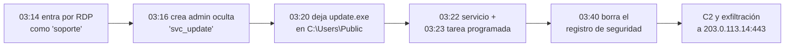
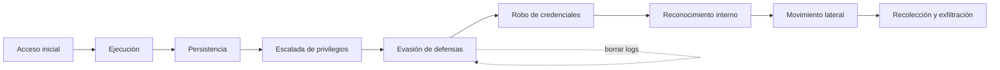
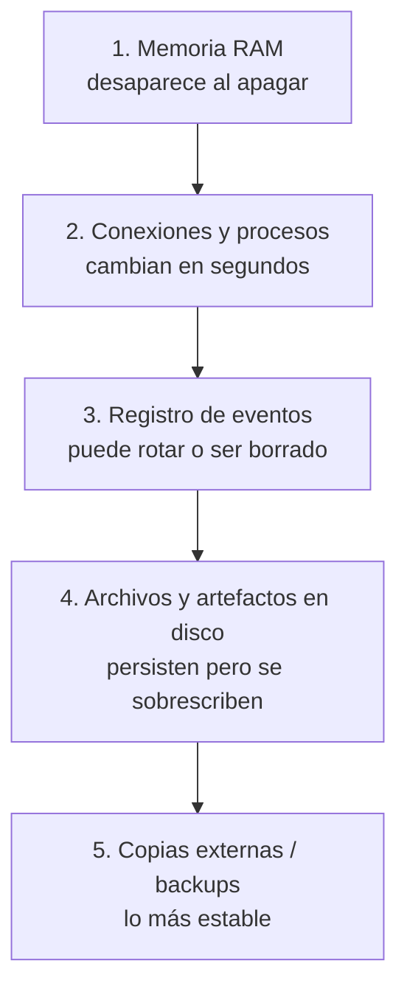
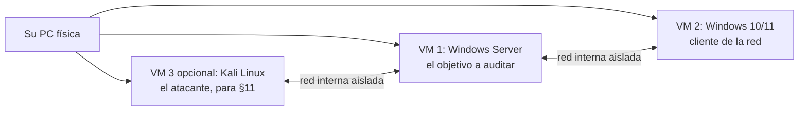
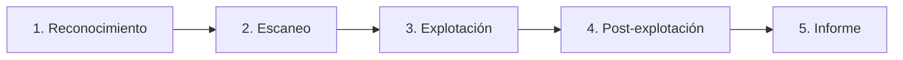
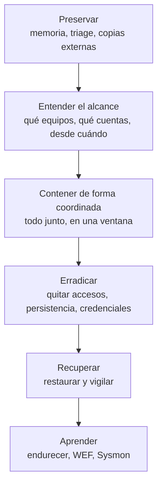

# Guía de iniciación a la auditoría de seguridad en un servidor Windows en red

**Documento:** Beginning-Security-Windows-Network-Guide.md
**Versión:** 1.3
**Estado:** Aprobado (mesa evaluadora, ciclos 1 a 3)
**Fecha:** 2026-09-17
**Audiencia:** persona sin experiencia previa en redes ni en administración de sistemas, con acceso autorizado a un servidor Windows
**Idioma:** español
**Norma bibliográfica:** APA 7

---

## Aviso de uso responsable (léase antes que nada)

Esta guía enseña a **buscar rastros de intrusión en sistemas propios o sobre los que se tiene autorización escrita**. Las técnicas de las secciones finales (§11) sirven para entender cómo actúa un atacante y así defenderse mejor. Ejecutarlas sobre sistemas ajenos, o sobre la red de una organización sin permiso formal, es ilegal en la mayoría de las jurisdicciones y puede constituir delito. Practique siempre en el laboratorio del §10.

**Sobre las salidas de comandos que verá en esta guía.** No provienen de un sistema real, sino de un **escenario testigo**: un servidor hipotético pero típico, comprometido, descrito por completo en el §2.9 y en el Anexo D. Todas las salidas de la guía se **derivan de ese único escenario** y son coherentes entre sí: la misma intrusión, las mismas cuentas, los mismos procesos, la misma línea de tiempo, vistas desde cada comando. No es una captura real, pero tampoco son valores sueltos inventados capítulo a capítulo: es un caso único y consistente, la forma en que se construye el material de entrenamiento forense. Las direcciones de red usan rangos reservados para documentación (RFC 1918 para lo interno, RFC 5737 para lo externo). Cuando la guía afirma un hecho técnico (qué evento registra un borrado, qué privilegio permite limpiar un log), ese hecho está referenciado en la bibliografía (Apéndice B).

---

## Índice

1. [Introducción y cómo leer esta guía](#1-introducción-y-cómo-leer-esta-guía)
2. [El terreno: qué es una red Windows](#2-el-terreno-qué-es-una-red-windows)
3. [Cómo trabaja un intruso (y por qué borra los logs)](#3-cómo-trabaja-un-intruso-y-por-qué-borra-los-logs)
4. [Cómo se investiga sin destruir la evidencia](#4-cómo-se-investiga-sin-destruir-la-evidencia)
5. [El registro de eventos de Windows](#5-el-registro-de-eventos-de-windows)
6. [El sistema vivo: procesos, servicios y sesiones](#6-el-sistema-vivo-procesos-servicios-y-sesiones)
7. [La red: con quién habla su servidor](#7-la-red-con-quién-habla-su-servidor)
8. [Artefactos que sobreviven al borrado de logs](#8-artefactos-que-sobreviven-al-borrado-de-logs)
9. [Identidad y Active Directory](#9-identidad-y-active-directory)
10. [Laboratorio de práctica](#10-laboratorio-de-práctica)
11. [Introducción al pentesting](#11-introducción-al-pentesting)
12. [Qué hacer con lo encontrado](#12-qué-hacer-con-lo-encontrado)
- [Apéndice A — Glosario](#apéndice-a--glosario)
- [Apéndice B — Bibliografía](#apéndice-b--bibliografía)
- [Apéndice C — Tabla de eventos de Windows citados](#apéndice-c--tabla-de-eventos-de-windows-citados)
- [Apéndice D — El escenario testigo completo](#apéndice-d--el-escenario-testigo-completo)
- [Apéndice E — Galería de logs comentados](#apéndice-e--galería-de-logs-comentados)

---

# 1. Introducción y cómo leer esta guía

## 1.1 Para quién es y qué problema resuelve

Usted administra o tiene acceso a un servidor Windows dentro de una red de una organización. Sospecha que alguien entró sin permiso y que, para no dejar rastro, está **borrando los registros** que normalmente delatarían su actividad. No es especialista en seguridad ni en sistemas: quiere aprender a **mirar el sistema y reconocer si algo anda mal**.

Esta guía lo lleva de cero. No presupone que usted sepa qué es una dirección IP, un proceso o un log. Cada uno de esos términos se define la primera vez que aparece. El objetivo no es convertirlo en perito forense, sino darle un método y un vocabulario para **levantar la mano a tiempo** cuando algo parece una intrusión.

## 1.2 La idea central de toda la guía

Si tuviera que quedarse con una sola frase, es esta:

> **Cuando un atacante borra los logs, la defensa no consiste en tener mejores logs en la máquina atacada, sino en que la evidencia viva en más de un lugar y de más de una forma.**

Un intruso puede borrar el registro de eventos de un servidor, pero le cuesta mucho más borrar, todos a la vez y sin equivocarse: el registro de eventos *copiado a otra máquina*, los rastros que el sistema deja sin querer (§8), lo que vio el firewall de la red, y la memoria del equipo mientras sigue encendido. La auditoría consiste en cruzar esas fuentes.

## 1.3 Cómo está organizada

Los capítulos siguen una dependencia estricta: ninguno usa un término antes de definirlo.

- **§2 y §3** son la base conceptual: qué es lo que está mirando y a qué se enfrenta.
- **§4** es la regla de oro del método: cómo mirar sin romper lo que investiga.
- **§5 a §9** son los cinco lugares donde se busca evidencia: eventos, sistema vivo, red, artefactos y AD.
- **§10** es el laboratorio: dónde practicar todo lo anterior sin riesgo.
- **§11** muestra el ataque desde el lado del atacante, para entender los rastros de §5–§9.
- **§12** cierra con qué hacer cuando encontró algo.

## 1.4 Convenciones

- Los comandos para la consola de Windows aparecen en bloques de código. Salvo aviso, se escriben en **PowerShell**, la consola moderna de Windows (§2.6).
- Un comando marcado con el comentario `# requiere administrador` no funciona en una consola normal: hay que abrirla "como administrador" (§2.7).
- Cada bloque de comando va seguido de **"Qué se espera ver"** y **"Cómo interpretarlo"**.
- Las **preguntas guía** cierran cada capítulo con su respuesta, para que usted verifique que formó el criterio, no solo que leyó.

## 1.5 Preguntas guía de arranque

**P. ¿Por qué no alcanza con instalar un antivirus y confiar en él?**
R. El antivirus detecta *programas maliciosos conocidos*. Un intruso que ya obtuvo credenciales legítimas no necesita ningún programa malicioso: entra por la puerta, con usuario y contraseña válidos, y usa las herramientas que el propio Windows trae. A eso se lo llama *living off the land* ("vivir de la tierra") y es invisible para un antivirus tradicional (MITRE, 2020). Por eso hace falta auditar, no solo escanear.

**P. Si el atacante borra los logs, ¿no es inútil mirarlos?**
R. No, por tres motivos que la guía desarrolla: (1) el **acto de borrar** deja su propio rastro (§5.5); (2) los logs pueden estar **copiados fuera** del equipo antes del borrado (§5.6); (3) hay evidencia que **no está en los logs** y que el atacante rara vez limpia (§8).

## 1.6 Rutas de lectura sugeridas

No hace falta leer todo de corrido. Según su urgencia:

- **Ruta "sospecho ahora mismo":** §4 (no destruir evidencia) → §5.5 y §5.7 (detectar y exportar) → §6 → §7 → §12.2. Es el camino de una respuesta inmediata.
- **Ruta "quiero aprender bien":** en orden, §1 → §12. Cada capítulo se apoya en el anterior.
- **Ruta "quiero practicar":** §10 (laboratorio) primero, y desde ahí visite cada capítulo haciendo sus ejercicios.

---

# 2. El terreno: qué es una red Windows

Antes de buscar a un intruso hay que saber qué se está mirando. Este capítulo define el vocabulario mínimo. Si ya conoce estos términos, saltee al §3.

## 2.1 Servidor, cliente y red

**Definición — Red.** Conjunto de computadoras conectadas que pueden intercambiar datos. En una oficina, los equipos de escritorio, las impresoras y los servidores están todos en la misma red.

**Definición — Servidor.** Computadora que ofrece un servicio a las demás: guardar archivos compartidos, gestionar el correo, controlar quién puede iniciar sesión. Suele estar siempre encendida.

**Definición — Cliente.** El equipo que consume ese servicio (la PC de un empleado, por ejemplo).

**Ejemplo.** Cuando un empleado abre una carpeta compartida `\\SERVIDOR\Contabilidad`, su PC (cliente) le pide los archivos al servidor de archivos. El servidor decide si ese empleado tiene permiso.

## 2.2 Dirección IP, puerto y nombre

**Definición — Dirección IP.** Número que identifica a un equipo dentro de la red, como `192.168.1.10`. Es el "domicilio" de la máquina.

**Definición — Puerto.** Número (de 0 a 65535) que identifica *un servicio concreto* dentro de un equipo. Si la IP es el domicilio, el puerto es el número de oficina. El servicio de escritorio remoto usa el puerto 3389; las carpetas compartidas usan el 445.

**Definición — Nombre de host.** Nombre legible de un equipo (`SRV-CONTA01`) que se traduce a su IP mediante el servicio DNS.

**Cuadro — Direcciones que son "de la propia red" (privadas).** Reconocerlas es clave en el §7: una conexión a una de estas es interna; una conexión a una dirección fuera de estos rangos sale a Internet.

| Rango | Uso |
|---|---|
| `10.0.0.0` – `10.255.255.255` | Redes internas |
| `172.16.0.0` – `172.31.255.255` | Redes internas |
| `192.168.0.0` – `192.168.255.255` | Redes internas (típico en oficinas pequeñas) |
| `127.0.0.1` | El propio equipo (se llama *localhost*) |

## 2.3 Usuario, credencial y sesión

**Definición — Cuenta de usuario.** Identidad con la que alguien inicia sesión. Tiene un nombre y una contraseña.

**Definición — Credencial.** El par usuario + contraseña (u otro secreto) que prueba la identidad.

**Definición — Sesión.** El período durante el cual un usuario está conectado y trabajando en el equipo.

**Definición — Administrador.** Cuenta con poder total sobre un equipo: instalar programas, leer cualquier archivo, borrar registros. Es el objetivo número uno de un atacante, porque quien la controla, controla la máquina.

## 2.4 Proceso, servicio y tarea programada

**Definición — Proceso.** Un programa *en ejecución*. Cuando usted abre el Bloc de notas, se crea un proceso `notepad.exe`. Todo lo que ocurre en el equipo lo hace algún proceso.

**Definición — Servicio.** Un programa que corre en segundo plano, sin ventana, normalmente desde que arranca el equipo (por ejemplo, el antivirus). Los atacantes crean servicios para asegurarse de volver a ejecutarse tras un reinicio.

**Definición — Tarea programada.** Una acción que Windows ejecuta automáticamente en un momento dado o ante un evento (todas las noches, o cada vez que alguien inicia sesión). Es otro escondite habitual de los atacantes.

## 2.5 Dominio, controlador de dominio y Active Directory

**Definición — Dominio.** Agrupación de equipos y usuarios de una organización que se administran juntos, con un directorio central de identidades.

**Definición — Active Directory (AD).** La base de datos y el conjunto de servicios de Microsoft que guarda todos los usuarios, grupos y equipos del dominio, y decide quién puede hacer qué.

**Definición — Controlador de dominio (DC).** El servidor que ejecuta Active Directory. **Es la joya de la corona**: quien controla el DC controla a *todos* los usuarios y equipos de la organización. Buena parte de la investigación en un ataque serio gira alrededor de qué pasó en el DC.

## 2.6 Las dos consolas: CMD y PowerShell

Windows tiene dos "líneas de comandos", que son ventanas donde uno escribe órdenes en texto:

- **CMD** (Símbolo del sistema): la antigua. Comandos como `netstat`, `whoami`.
- **PowerShell**: la moderna y mucho más potente. Casi todos los comandos de esta guía son de PowerShell, porque permiten filtrar y cruzar información. Se reconoce porque su indicador de línea empieza con `PS`.

**Cómo abrir PowerShell.** Menú Inicio → escriba `powershell` → Enter.

## 2.7 Consola "como administrador"

Muchas órdenes de auditoría necesitan privilegios de administrador (leer el registro de seguridad, ver qué proceso abrió una conexión). Para abrir una consola con esos privilegios: menú Inicio → escriba `powershell` → clic derecho sobre "Windows PowerShell" → **"Ejecutar como administrador"**. La ventana dirá "Administrador:" en el título.

Para confirmar que su consola tiene privilegios:

```powershell
# ¿Soy administrador en esta consola?
([Security.Principal.WindowsPrincipal][Security.Principal.WindowsIdentity]::GetCurrent()).IsInRole([Security.Principal.WindowsBuiltInRole]::Administrator)
```

**Qué se espera ver:** `True` o `False`.
**Cómo interpretarlo:** si dice `False`, cierre y vuelva a abrir la consola "como administrador"; de lo contrario, los comandos marcados `# requiere administrador` fallarán o devolverán datos incompletos.

## 2.8 Preguntas guía

**P. ¿Por qué el controlador de dominio merece atención especial?**
R. Porque concentra el control de todas las identidades de la organización. Comprometer un equipo cualquiera afecta a ese equipo; comprometer el DC permite hacerse pasar por cualquier usuario, incluido el administrador, en toda la red (Metcalf, 2019). Un atacante que llega al DC puede fabricarse credenciales válidas para siempre.

**P. Veo una conexión de mi servidor a `203.0.113.14`. ¿Es interna o sale a Internet?**
R. Sale a Internet: no cae en ninguno de los rangos privados del cuadro de §2.2. Eso no la hace maliciosa por sí sola (podría ser una actualización de Windows), pero sí es candidata a revisar en el §7, mientras que una conexión a `192.168.1.5` es tráfico interno. (De hecho, `203.0.113.14` es la dirección del atacante en el escenario de esta guía: ver §2.9.)

## 2.9 El escenario testigo de esta guía

Para que las salidas de comando no sean valores inventados sueltos, toda la guía sigue **un mismo caso hipotético y coherente**. Cada vez que un comando muestra una salida, esa salida es la que produciría *este* servidor. Convendría que lo lea ahora; volverá a él en cada capítulo.

**La organización.** Empresa mediana, dominio `CONTOSO.LOCAL` (nombre de ejemplo, no es una empresa real).

| Equipo | Rol | IP |
|---|---|---|
| SRV-DC01 | Controlador de dominio | 10.0.10.5 |
| **SRV-FILE01** | Servidor de archivos — **el equipo que investigamos** | 10.0.10.20 |
| SRV-LOG01 | Colector de eventos (recibe copias, §5.6) | 10.0.30.9 |
| Clientes | Estaciones de trabajo | 10.0.20.0/24 |

**Los vicios de administración que abren la puerta** (el enunciado pedía "una red con vicios"):

1. El escritorio remoto (RDP) de SRV-FILE01 está **expuesto a Internet**.
2. La cuenta de mesa de ayuda `soporte` tiene **administrador local** sobre el servidor y **contraseña débil**.
3. No hay segundo factor (MFA) en el acceso remoto.

**Qué pasó (madrugada del 15/09/2026).** Un atacante adivina la contraseña de `soporte` por RDP desde `203.0.113.14`, entra, crea una cuenta administradora oculta `svc_update`, deja un programa `C:\Users\Public\update.exe` como servicio y como tarea programada para volver siempre, **borra el registro de seguridad** con `svc_update` a las 03:40, y establece un canal de salida a `203.0.113.14:443` por el que se lleva datos.



**Cuentas que aparecerán en las salidas:**

| Cuenta | Qué es |
|---|---|
| `CONTOSO\flopez` | Administradora legítima (trabaja de día) |
| `CONTOSO\soporte` | Cuenta legítima **comprometida** (por ella entró el atacante) |
| `SRV-FILE01\svc_update` | Cuenta **creada por el atacante** (puerta trasera) |
| `update.exe` (PID 9310) | Programa del atacante, en `C:\Users\Public` |

El Anexo D reúne la línea de tiempo completa y la lista de qué muestra cada comando. A lo largo de la guía verá aparecer, una por una, todas estas piezas; el §12.1 las cruza para cerrar el caso.

---

# 3. Cómo trabaja un intruso (y por qué borra los logs)

Para reconocer rastros hay que entender qué los produce. Este capítulo describe, sin tecnicismo innecesario, las etapas de un ataque típico. No hace falta memorizarlas: sirven para saber *dónde* mirar en los capítulos siguientes.

## 3.1 Indicador de compromiso (IoC)

**Definición — Indicador de compromiso (IoC).** Un dato observable y concreto que sugiere actividad maliciosa: una dirección IP a la que nadie debería conectarse, un archivo en una carpeta rara, una cuenta de administrador nueva que nadie creó, un inicio de sesión a las 3 de la mañana. Todo el resto de la guía es, en el fondo, una colección de métodos para encontrar IoCs.

## 3.2 Las etapas de un ataque

El modelo más usado para ordenar las acciones de un atacante es **MITRE ATT&CK** (MITRE, 2020), un catálogo público de tácticas y técnicas observadas en ataques reales. Simplificado:



| Etapa | Qué hace el atacante | Rastro que deja (capítulo) |
|---|---|---|
| Acceso inicial | Entra: phishing, contraseña débil, servicio expuesto | Inicios de sesión anómalos (§5) |
| Ejecución | Corre su primer comando o programa | Procesos con padres raros (§6) |
| Persistencia | Se asegura de volver tras un reinicio | Servicios y tareas nuevas (§6, §8) |
| Escalada de privilegios | Pasa de usuario común a administrador | Altas en grupos de admins (§5, §9) |
| Evasión de defensas | Apaga el antivirus, **borra los logs** | Eventos de borrado y de apagado de auditoría (§5.5) |
| Robo de credenciales | Roba contraseñas de la memoria | Acceso a la memoria de `lsass` (§6) |
| Reconocimiento interno | Explora la red desde adentro | Consultas masivas a AD (§9) |
| Movimiento lateral | Salta de un equipo a otro | Inicios de sesión de red, uso de recursos administrativos (§5, §7) |
| Exfiltración | Se lleva los datos | Conexiones salientes con mucho volumen (§7, §8) |

## 3.3 Por qué borra los logs, y qué logra (y qué no)

**Definición — Log (registro).** Archivo donde un sistema anota lo que va ocurriendo: quién inició sesión, qué servicio arrancó, qué error hubo. Windows los llama *registros de eventos* (§5).

Un atacante borra o manipula los logs en la etapa de **evasión de defensas** para que, cuando usted vaya a mirar, no encuentre la huella de su entrada. Es una señal de madurez del ataque: el que borra logs sabe lo que hace.

Pero borrar logs tiene un costo para el atacante, y ahí está su oportunidad:

1. **Borrar deja su propio evento.** Vaciar el registro de seguridad genera el evento **1102**; vaciar otros registros genera el **104**. Un registro que aparece vacío *justo* después de uno de estos eventos es una confesión (Microsoft, 2023a).
2. **Puede que ya estuvieran copiados.** Si la organización reenvía los logs a otra máquina (§5.6), el atacante borra la copia local pero no la remota.
3. **No todo está en los logs.** El §8 trata rastros que Windows deja como efecto secundario de funcionar y que el atacante casi nunca limpia, porque no son "logs" y muchos ni sabe que existen.

## 3.4 "Vivir de la tierra": el ataque sin malware

**Definición — Living off the land (LOLBins).** Técnica en la que el atacante no instala programas propios, sino que usa las herramientas legítimas que Windows ya trae (PowerShell, `wmic`, `rundll32`, `certutil`). Así evita al antivirus, que no va a marcar como malicioso un programa firmado por Microsoft (MITRE, 2020, técnica T1218).

**Consecuencia para usted.** No busca "un virus". Busca **usos anómalos de herramientas normales**: por qué el Bloc de notas abrió una conexión a Internet, por qué Word lanzó PowerShell, por qué `certutil` (una herramienta de certificados) descargó un archivo. El §6 le enseña a ver esas relaciones.

## 3.5 Preguntas guía

**P. ¿Cuál es la diferencia entre un IoC y una prueba de intrusión?**
R. Un IoC es un indicio: eleva la sospecha, pero puede tener explicación legítima (un inicio de sesión nocturno puede ser un administrador trabajando tarde). Una intrusión se confirma cruzando varios IoCs coherentes entre sí: inicio de sesión nocturno + desde una IP desconocida + seguido de la creación de un usuario administrador + y del borrado del log. El método de la guía es *acumular indicios y cruzarlos*, no saltar a la conclusión con uno solo.

**P. Si el atacante "vive de la tierra", ¿cómo lo distingo de un administrador legítimo que también usa PowerShell?**
R. Por el contexto: quién lo ejecutó, desde dónde, a qué hora, con qué "proceso padre" (quién lanzó a quién, §6.3) y hacia qué destino se conectó después. PowerShell lanzado por Word, que descarga un archivo de una IP desconocida y crea una tarea programada, no es un administrador trabajando: es la cadena de §3.2 en vivo.

---

# 4. Cómo se investiga sin destruir la evidencia

Este es el capítulo más importante de la guía. Todos los siguientes le enseñan a *mirar*; este le enseña a mirar **sin arruinar lo que investiga ni avisarle al atacante**. Saltearlo es el error más caro que puede cometer un principiante.

## 4.1 El principio de no daño

Cuando usted actúa sobre un sistema comprometido, sus propias acciones dejan rastro y modifican el sistema. Encender, apagar, abrir archivos, instalar herramientas: todo cambia algo. Hay dos peligros concretos:

1. **Destruir evidencia.** Reiniciar el servidor borra la memoria (§8.6), donde puede estar la única copia de las contraseñas robadas o del programa del atacante. Abrir un archivo cambia su fecha de "último acceso".
2. **Alertar al atacante.** Si el intruso sigue conectado y usted cambia contraseñas, bloquea su IP o borra su acceso *antes* de entender el alcance, se dará cuenta de que lo descubrieron y puede acelerar el daño (cifrar todo, borrar más) o esconderse mejor.

**Regla.** Ante sospecha de intrusión *activa*, primero se **observa y se preserva**; recién cuando se entiende el alcance se **actúa**, y se actúa todo junto, en una ventana coordinada (§12).

**Supuesto de acceso.** Esta guía asume que usted investiga con una cuenta de administrador **legítima** sobre un equipo al que tiene acceso autorizado. Si el atacante ya cambió las credenciales de administrador, o el equipo quedó aislado de la red, el acceso mismo se vuelve parte del problema: en ese caso, no fuerce el ingreso y escale a un especialista (§12.3).

## 4.2 Orden de volatilidad

**Definición — Volatilidad.** Qué tan rápido desaparece una evidencia. Lo más volátil se recolecta primero. Este orden proviene de la práctica forense estándar (Brezinski & Killalea, 2002, RFC 3227).



**Consecuencia práctica.** Si va a apagar o reiniciar el equipo, hágalo **al final**, no al principio. Y si el caso es serio, capture la memoria *antes* de tocar nada (§8.6).

## 4.3 Línea de base (baseline): sin ella, todo parece normal

**Definición — Línea de base (baseline).** Un registro de cómo se ve el sistema cuando se lo considera sano: qué servicios corren, qué conexiones son habituales, qué cuentas de administrador existen, qué tareas programadas hay.

Sin línea de base, usted no puede saber si lo que ve es anómalo. Un proceso llamado `svchost.exe` puede ser legítimo (Windows tiene muchos) o el disfraz de un atacante. La diferencia solo se ve **comparando con lo normal**.

**La técnica del diferencial (diff).** La forma más poderosa y más barata de detección para un principiante es:

1. Guardar hoy una foto del sistema (conexiones, servicios, tareas, admins).
2. Guardar la misma foto mañana, y pasado.
3. Comparar. **Lo que aparece nuevo y no explica nadie, es su lista de sospechosos.**

PowerShell hace la comparación por usted con `Compare-Object` (se muestra en §7.4). No necesita saber qué es "normal" en abstracto: le alcanza con detectar *qué cambió*.

## 4.4 Preservar antes de mirar: guardar todo lo que ejecuta

Todo lo que recolecte, guárdelo **fuera del equipo investigado**: un pendrive, una carpeta de red, otro equipo. Y guarde también la *fecha y hora* de cada recolección.

**Paso previo (una sola vez).** Conecte su unidad externa y anote su letra (aquí se usa `E:`). Cree la carpeta de evidencia antes de exportar nada; si no existe, los comandos de exportación fallarán con "ruta no encontrada":

```powershell
# Crear la carpeta de evidencia en la unidad externa (ajuste E: a su unidad)
New-Item -ItemType Directory -Path E:\evidencia -Force
```

**Qué se espera ver:** la confirmación de la carpeta creada (o, si ya existía, sus datos). A partir de aquí, todos los comandos que escriben en `E:\evidencia` funcionarán.

```powershell
# Deja constancia de quién, dónde y cuándo se corrió cada cosa.
# Todo lo que escriba después en esta consola queda copiado a un archivo.
Start-Transcript -Path "E:\evidencia\transcripcion_$(Get-Date -Format yyyyMMdd_HHmmss).txt"
```

**Qué se espera ver:** un mensaje "Transcript started, output file is…".
**Cómo interpretarlo:** desde ese momento, cada comando y su salida quedan registrados en ese archivo. Al terminar, ejecute `Stop-Transcript`. Cambie `E:\` por la letra de su pendrive o unidad de evidencia.

**Definición — Cadena de custodia.** Registro de quién tuvo acceso a cada pieza de evidencia, cuándo y qué hizo con ella. Si el incidente puede terminar en un reclamo laboral o judicial, la cadena de custodia es lo que hace que la evidencia sea creíble. Para un principiante, la versión mínima es: guarde copias, no originales; anote fecha y hora; no modifique lo recolectado.

## 4.5 El triage: la recolección rápida y ordenada

**Definición — Triage.** Recolección rápida de un conjunto acotado de evidencia para decidir, en poco tiempo, si hay incidente y qué tan grave es. No es la investigación completa: es la primera foto.

Un triage mínimo para un principiante, en orden de volatilidad, es exactamente el recorrido de los próximos capítulos:

1. Conexiones de red activas y procesos (§6, §7) — lo más volátil.
2. Sesiones iniciadas y usuarios (§6.6).
3. Registro de eventos clave, exportado a archivo (§5).
4. Servicios y tareas programadas (§6.5).
5. Artefactos de persistencia y ejecución (§8).

El §10.5 arma este triage como un único script que usted podrá correr en el laboratorio.

## 4.6 Sistema comprometido: qué mirar en los primeros 10 minutos

Cuando la sospecha es fuerte y no sabe por dónde empezar, siga esta lista en orden. Está pensada para responder rápido tres preguntas: **¿sigue el atacante adentro? ¿qué tocó? ¿alcanzó a borrar rastros?** Cada paso enlaza al capítulo donde se explica.

| # | Mire… | Con… | Qué busca | Sección |
|---|---|---|---|---|
| 1 | Sesiones abiertas ahora | `query user` | Una sesión (sobre todo RDP) que no debería estar | §6.6 |
| 2 | Conexiones salientes | `Get-NetTCPConnection` | Un proceso hablando con una IP externa desconocida | §7.2 |
| 3 | Procesos y su ruta | `Get-Process` | Algo corriendo desde `C:\Users\Public`, `Temp`, `ProgramData` | §6.1 |
| 4 | **¿Borraron el log?** | evento **1102/104** | El rastro del borrado (y quién lo hizo) | §5.5 |
| 5 | **¿El borrado fue intencional?** | señales de §5.5.3 | Distinguir vaciado deliberado de causa legítima | §5.5.3 |
| 6 | Cuentas de administrador | `Get-LocalGroupMember` | Una cuenta que nadie reconoce (una puerta trasera) | §9.2 |
| 7 | Servicios y tareas nuevas | `Get-CimInstance Win32_Service`, `Get-ScheduledTask` | Persistencia recién creada | §6.4, §6.5 |
| 8 | Exportar todo a un pendrive | `wevtutil epl` | Preservar antes de que borren más | §5.7 |

**Regla de oro mientras hace esto (repetida del §4.1):** observe y preserve; **no** reinicie, **no** cambie contraseñas y **no** bloquee al atacante todavía. Primero entender; contener viene después y coordinado (§12.2). Si ve un daño irreversible **en curso** (archivos cifrándose), esa es la única excepción: aísle el equipo de la red ya.

## 4.7 Preguntas guía

**P. Encontré lo que parece un proceso malicioso conectado a una IP extraña. Mi primer impulso es apagar el servidor para "cortar el ataque". ¿Está bien?**
R. Casi nunca. Apagar destruye la memoria (§4.2), que es la evidencia más valiosa y la más volátil: ahí pueden estar las credenciales robadas y el programa del atacante que solo vive en RAM. Además, un apagado abrupto puede disparar mecanismos de daño. Lo correcto es preservar primero (capturar memoria y triage), entender el alcance, y recién entonces contener de forma coordinada (§12). La excepción es un daño en curso e irreversible, como un cifrado masivo de archivos: ahí sí se aísla de inmediato.

**P. ¿Por qué guardar la evidencia fuera del equipo si igual la estoy leyendo en pantalla?**
R. Porque el equipo está comprometido: cualquier archivo que guarde *en él* puede ser borrado o alterado por el atacante, y porque las acciones normales del sistema van sobrescribiendo evidencia con el tiempo. Una copia externa, fechada e intacta, es la única que podrá sostener después una conclusión.

---

# 5. El registro de eventos de Windows

Aquí empieza la investigación concreta. El registro de eventos es la primera fuente y, paradójicamente, la que el atacante intenta borrar. Este capítulo le enseña a leerlo, a exportarlo antes de que lo borren, y —lo más importante— a **detectar el borrado mismo**.

## 5.1 Qué es el registro de eventos

**Definición — Registro de eventos (Event Log).** El diario de a bordo de Windows. Cada cosa relevante que ocurre genera un **evento**: un inicio de sesión, un servicio que arranca, un error, un cambio de configuración. Los eventos se guardan en varios *registros* separados.

Los tres registros que más importan:

| Registro | Qué anota |
|---|---|
| **Security** (Seguridad) | Inicios de sesión, uso de privilegios, cambios de cuentas, **borrado del propio log** |
| **System** (Sistema) | Arranque y parada de servicios, drivers, apagados |
| **Application** (Aplicación) | Mensajes de los programas instalados |

**Definición — Event ID.** Cada tipo de evento tiene un número identificador. "Un inicio de sesión exitoso" es siempre el evento **4624**, en cualquier Windows. Aprender unos pocos Event IDs es como aprender a leer los titulares del diario.

## 5.2 Cómo se abre: la interfaz gráfica

La forma visual es el **Visor de eventos**: menú Inicio → escriba `eventvwr` → Enter. En el panel izquierdo, "Registros de Windows" contiene Security, System y Application. Es útil para explorar, pero para auditar en serio conviene PowerShell, porque permite filtrar y exportar.

## 5.3 Leer eventos con PowerShell

El comando central es `Get-WinEvent`.

```powershell
# requiere administrador
# Los 20 eventos más recientes del registro de seguridad
Get-WinEvent -LogName Security -MaxEvents 20 | Format-Table TimeCreated, Id, Message -AutoSize -Wrap
```

**Qué se espera ver (escenario testigo — importante: esta salida es del *colector* SRV-LOG01):**

```
TimeCreated           Id   Message
-----------           --   -------
2026-09-15 03:16:40  4732  Se agregó un miembro a un grupo local con seguridad habilitada. Miembro: svc_update ...
2026-09-15 03:16:05  4720  Se creó una cuenta de usuario. Nueva cuenta: svc_update ...
2026-09-15 03:14:22  4624  Se inició una sesión correctamente. Cuenta: soporte  Tipo: 10 ...
```

**Cómo interpretarlo:** cada fila es un evento con su hora, su número (Id) y una descripción. La secuencia cuenta una historia: a las 03:14 del 15/09 alguien inició sesión como `soporte` (tipo 10 = escritorio remoto), y dos minutos después se creó la cuenta `svc_update` y se la hizo administradora. Tres indicios encadenados.

> **Por qué "del colector".** Si usted corre este mismo comando en **SRV-FILE01** (el equipo comprometido), **no** verá estas tres filas: el atacante borró el registro de seguridad local a las 03:40 (§5.5), así que allí los eventos previos a esa hora ya no están. Sobreviven en la copia del **colector WEF** (§5.6), que los recibió cuando ocurrieron. Esta diferencia —el local vacío, el colector completo— es, en una sola pantalla, la razón de ser de toda la guía.

## 5.4 Los eventos que debe conocer

No hace falta memorizar cientos. Con esta tabla cubre la mayoría de los rastros de una intrusión (Microsoft, 2023a; MITRE, 2020). El Apéndice C la reúne completa.

| Event ID | Registro | Qué significa | Por qué importa |
|---|---|---|---|
| **4624** | Security | Inicio de sesión exitoso | El "quién entró y cómo". Ver 5.4.1 |
| **4625** | Security | Inicio de sesión fallido | Muchos seguidos = intento de adivinar contraseñas |
| **4634 / 4647** | Security | Cierre de sesión | Delimita la duración de una sesión |
| **4648** | Security | Inicio de sesión con credenciales explícitas | Señal de movimiento lateral (§3.2) |
| **4672** | Security | Se asignaron privilegios de administrador a una sesión | Alguien entró con poder |
| **4720** | Security | Se creó una cuenta de usuario | ¿La creó alguien autorizado? |
| **4728 / 4732 / 4756** | Security | Se agregó un usuario a un grupo con privilegios | Escalada de privilegios |
| **4698** | Security | Se creó una tarea programada | Persistencia (§6.5) |
| **7045** | System | Se instaló un servicio nuevo | Persistencia (§6.4) |
| **1102** | Security | **Se borró el registro de seguridad** | Ver 5.5 |
| **104** | System | **Se borró un registro de eventos** | Ver 5.5 |
| **1100** | Security | El servicio de registro de eventos se detuvo | Puede preceder a un borrado |
| **4719** | Security | Cambió la política de auditoría | Apagar la auditoría antes de actuar |
| **4616** | Security | Se cambió la hora del sistema | Ensuciar la línea de tiempo |
| **4104** | PowerShell/Operational | Bloque de script de PowerShell ejecutado | El "qué se ejecutó" (§6.7) |

**Leer un fallo de inicio de sesión (4625) a fondo.** El 4625 trae un campo **Subestado** (`Sub Status`) que dice *por qué* falló, y esa diferencia cambia el diagnóstico:

| Subestado | Significado | Qué implica |
|---|---|---|
| `0xC0000064` | El usuario **no existe** | Están probando nombres al azar (*password spraying* a ciegas) |
| `0xC000006A` | El usuario existe pero **la contraseña es incorrecta** | Están adivinando la clave de una **cuenta real** — más peligroso |
| `0xC0000234` | Cuenta **bloqueada** | Las defensas reaccionaron; el ataque siguió intentando |
| `0xC0000072` | Cuenta **deshabilitada** | Intentan una cuenta vieja que debería estar cerrada |

En el escenario, la ráfaga de 4625 contra `soporte` trae `0xC000006A`: el atacante sabe que `soporte` existe y le adivina la contraseña. Una ráfaga con `0xC000006A` sobre **una** cuenta es fuerza bruta dirigida; muchos `0xC0000064` con nombres distintos es spraying. Leer el subestado le dice cuál de los dos enfrenta.

### 5.4.1 Anatomía de un inicio de sesión (4624)

El evento 4624 trae un campo clave, el **Logon Type** (tipo de inicio de sesión), que dice *cómo* entró el usuario:

| Logon Type | Significado | Cuándo sospechar |
|---|---|---|
| 2 | Interactivo (teclado del propio equipo) | Un servidor sin monitor no debería tener muchos |
| 3 | Red (acceso a carpeta compartida) | Normal, pero útil para movimiento lateral |
| 10 | Escritorio remoto (RDP) | Un RDP desde una IP desconocida es un IoC fuerte |
| 5 | Servicio | Normal para servicios del sistema |

```powershell
# requiere administrador
# Inicios de sesión por Escritorio Remoto (RDP, tipo 10) de las últimas 24 horas
Get-WinEvent -FilterHashtable @{LogName='Security'; Id=4624; StartTime=(Get-Date).AddDays(-1)} |
  Where-Object { $_.Message -match 'Tipo de inicio de sesión:\s+10|Logon Type:\s+10' } |
  Format-Table TimeCreated, Message -Wrap
```

**Qué se espera ver (escenario testigo, consultado en el colector):** una fila del 15/09 03:14:22 con la cuenta `soporte` y, en el detalle, "Dirección de red de origen: 203.0.113.14".
**Cómo interpretarlo:** anote la IP de origen que aparece en el mensaje ("Dirección de red de origen"). Aquí es `203.0.113.14`, una dirección **externa** (no cae en los rangos privados de §2.2) desde la que nadie de la empresa debería iniciar sesión por RDP: indicio serio, que se cruza con todo lo que esa sesión hizo después. (En SRV-FILE01 esta consulta no devuelve nada por el borrado de las 03:40; por eso se consulta el colector.)

## 5.5 Detectar el borrado: el rastro que el atacante no puede evitar del todo

Esta es la respuesta directa a "están borrando los logs". Para ver cómo lucen estos eventos renderizados campo por campo, con qué leer en cada uno, consulte el **Anexo E** (galería de logs comentados).

```powershell
# requiere administrador
# ¿Alguien borró el registro de seguridad (1102) o el de sistema (104)?
Get-WinEvent -FilterHashtable @{LogName='Security'; Id=1102} -ErrorAction SilentlyContinue |
  Format-Table TimeCreated, Id, Message -Wrap
Get-WinEvent -FilterHashtable @{LogName='System'; Id=104} -ErrorAction SilentlyContinue |
  Format-Table TimeCreated, Id, Message -Wrap
```

**Qué se espera ver (escenario testigo, ejecutado en SRV-FILE01):**

```
TimeCreated           Id   Message
-----------           --   -------
2026-09-15 03:40:11  1102  El registro de auditoría se borró. Sujeto: Cuenta: svc_update ...
```

**Cómo interpretarlo:** el evento 1102 dice **quién** borró el log y **cuándo**. Aquí lo borró `svc_update` a las 03:40 del 15/09 — y `svc_update` es una cuenta que el administrador legítimo **no reconoce**: primer eslabón del caso. Un 1102 fuera de una tarea de mantenimiento planificada es una de las señales más fuertes que existen. Note además la consecuencia: como fue un borrado **total**, los eventos *anteriores* a las 03:40 (el inicio de sesión del atacante, la creación de la cuenta) ya no están en este log local; hay que ir a buscarlos al colector (§5.6). Y la trampa: el propio 1102 podría haber sido borrado *después*; por eso el siguiente paso es mirar la numeración.

### 5.5.1 La numeración: dos formas de borrado que se ven distinto

**Definición — RecordId.** Cada evento tiene un número de serie correlativo (`RecordId`) que solo crece dentro de un mismo registro. Sirve para detectar manipulación, y hay que distinguir dos casos:

- **Borrado total** (el del escenario): al vaciar el registro completo, el `RecordId` **se reinicia** y vuelve a empezar por números bajos. Un registro de seguridad con `RecordId` bajos y un 1102 como primer evento es la firma de un borrado total reciente.
- **Borrado parcial**: un atacante más fino borra *eventos individuales* sin vaciar todo (así evita dejar el 1102). Eso deja un **salto** en la numeración: …1002, 1003, **1250**, 1251… sin un 1102 ni un reinicio que lo expliquen.

```powershell
# requiere administrador
# Muestra los números de serie. Reinicio a números bajos = borrado total.
# Salto en el medio sin 1102 = posible borrado parcial.
Get-WinEvent -LogName Security -MaxEvents 200 |
  Select-Object RecordId, TimeCreated, Id |
  Sort-Object RecordId |
  Format-Table -AutoSize
```

**Qué se espera ver (escenario testigo):** los `RecordId` arrancan en números bajos (el log se reinició a las 03:40) y el primero de todos corresponde al evento 1102.
**Cómo interpretarlo:** un `RecordId` que empieza cerca de 1 junto a un 1102 confirma el borrado total del escenario. Si en cambio, en otro caso, viera la numeración subir normalmente pero con un salto grande sin 1102, sospeche un borrado parcial (manipulación fina).

### 5.5.2 Otras señales de manipulación

- **4719** (cambió la política de auditoría) o **1100** (se detuvo el servicio de eventos) *justo antes* de un período sin registros: el atacante apagó la grabación, actuó y la volvió a encender.
- **4616** (cambio de hora): un salto de hora ensucia la línea de tiempo para que los eventos parezcan estar en otro momento. Verifíquelo cruzando con fuentes externas (§7).

### 5.5.3 Cómo saber que el borrado fue intencional

Un log vacío no siempre es un ataque. Antes de declarar "me borraron los logos a propósito", hay que separar la **acción deliberada** de la **causa legítima**. La clave es entender qué significa cada cosa.

**Punto de partida: el 1102 y el 104 son acciones explícitas.** Windows **no** genera estos eventos por accidente. Un 1102 (registro de seguridad) o un 104 (otro registro) se producen **únicamente** cuando alguien ejecuta la orden de *vaciar* ese registro —desde el Visor de eventos, con `wevtutil cl`, o por programa—. No aparecen porque el disco se llene, ni porque el log rote por tamaño, ni por un reinicio. Por eso, la sola presencia de un 1102/104 **ya es** una acción intencional de borrado: la única pregunta que queda es si esa acción fue legítima (un administrador en una tarea planificada) o maliciosa.

**Señales de que ese vaciado fue malicioso, no de mantenimiento:**

| Señal | Por qué apunta a intención maliciosa |
|---|---|
| Lo ejecutó una cuenta **desconocida** o inesperada | En el escenario, el 1102 lo hizo `svc_update`, una cuenta creada por el atacante 24 minutos antes |
| **Horario** fuera de ventana de mantenimiento (madrugada, fin de semana) | 03:40 no es horario de un administrador trabajando |
| **Coincide en el tiempo** con otra actividad sospechosa | El 1102 llega justo después de crear la puerta trasera y la persistencia |
| Se borran **varios registros a la vez** (Security *y* System) | El mantenimiento no vacía todo junto; el encubrimiento sí |
| Va **precedido de 4719 o 1100** (auditoría apagada / servicio detenido) | Secuencia clásica: apagar la grabación → actuar → borrar |
| Va **acompañado de 4616** (cambio de hora) | Doble manipulación de la evidencia temporal |
| Nadie del equipo **reconoce ni registró** ese borrado | No hay ticket, no hay tarea, no hay responsable |

**Cuando NO hay 1102 pero el log igual está vacío o corto.** Aquí hay que descartar causas legítimas antes de gritar "borrado":

- **Rotación por tamaño/retención**: si el log llegó a su tamaño máximo, Windows **sobrescribe** los eventos más viejos. Esto **no** genera 1102 y es normal; se reconoce porque el evento más antiguo que queda es reciente pero la numeración (`RecordId`) es **alta y continua** (no se reinició).
- **Reinstalación o equipo nuevo**: un servidor recién montado tiene pocos eventos, legítimamente.
- **Borrado parcial (malicioso)**: si en cambio la numeración **salta** sin 1102 (§5.5.1), o el log es sospechosamente corto sin que la retención lo explique, ahí sí hay manipulación fina.

**La regla práctica.** Intencionalidad maliciosa = (hay un 1102/104 **o** un salto/reinicio de numeración no explicado por retención) **y** el contexto es hostil (cuenta desconocida, horario raro, coincide con otra actividad, nadie lo reconoce). Un 1102 solo ya prueba que *alguien vació el log a propósito*; el contexto decide si ese alguien era el enemigo. Ante la duda, trátelo como incidente y preserve: es más barato investigar de más que perder la evidencia.

## 5.6 La defensa de fondo: sacar los logs del equipo

Todo lo anterior detecta el borrado *después*. La defensa real es que los eventos **se copien a otra máquina en el momento en que ocurren**, de modo que borrar el original no borre la copia.

**Definición — Windows Event Forwarding (WEF).** Función nativa de Windows (no requiere comprar nada) por la cual los equipos *empujan* sus eventos a un servidor **colector** central. Si el atacante borra el log de un servidor a las 3:20, el colector ya tiene todo lo de hasta las 3:19 (Microsoft, 2023b).

**Definición — Telemetría.** Flujo continuo de datos de actividad enviado *fuera* del equipo que lo genera. WEF es telemetría de eventos.

Principios para que sirva de verdad:

1. El colector va en un **equipo aparte**, idealmente en un segmento de red separado.
2. Los administradores del dominio vigilado **no deben poder borrar** los logs del colector. Si el atacante ya es administrador del dominio y el colector está bajo ese mismo dominio, también lo limpia.
3. El destino ideal es de **solo-agregado** (no se puede modificar lo ya escrito).

Montar WEF excede una guía de iniciación, pero usted debe **saber que existe y pedirlo**: es la diferencia entre "nos borraron todo" y "tenemos la copia". Alternativas con más funciones son las plataformas SIEM (§12.3).

## 5.7 Exportar antes de que sea tarde

Si sospecha intrusión activa, **exporte los registros a un archivo externo ahora**, antes de seguir investigando:

```powershell
# requiere administrador
# Exporta los tres registros clave a archivos .evtx en el pendrive E:
wevtutil epl Security  E:\evidencia\Security_$(Get-Date -Format yyyyMMdd_HHmmss).evtx
wevtutil epl System    E:\evidencia\System_$(Get-Date -Format yyyyMMdd_HHmmss).evtx
wevtutil epl Application E:\evidencia\Application_$(Get-Date -Format yyyyMMdd_HHmmss).evtx
```

**Qué se espera ver:** ninguna salida si tuvo éxito (así funciona `wevtutil`: silencio es éxito).
**Cómo interpretarlo:** en `E:\evidencia` aparecen tres archivos `.evtx`. Son copias completas que puede abrir después con el Visor de eventos, ya a salvo del borrado. `epl` significa *export log*.

## 5.8 Preguntas guía

**P. Encuentro el registro de seguridad casi vacío y **no** hay ningún evento 1102. ¿Eso me tranquiliza?**
R. Al contrario, es más preocupante. Un log vacío sin un 1102 puede significar que borraron el log *y también* el evento que registraba el borrado, o que apagaron la auditoría (4719/1100) antes de actuar. Verifique la numeración (RecordId, §5.5.1), busque 4719/1100/1102 en el registro de Sistema y en cualquier copia por WEF, y trate el vacío mismo como un IoC.

**P. ¿Por qué se insiste tanto en el reenvío de eventos (WEF) si esta guía es para principiantes?**
R. Porque es la única defensa que funciona *contra el borrado*, que es exactamente el problema que motivó esta consulta. Todo lo demás de este capítulo detecta el borrado a posteriori; WEF hace que el borrado no destruya la evidencia. Aunque usted no lo instale, saber que existe le permite exigirlo a quien administre la infraestructura y transformar el problema de raíz.

---

# 6. El sistema vivo: procesos, servicios y sesiones

El registro de eventos cuenta lo que *pasó*. Este capítulo mira lo que *está pasando ahora*: qué programas corren, qué servicios hay, quién tiene sesión abierta. Es evidencia muy volátil (§4.2): cambia en segundos, así que se recolecta temprano.

## 6.1 Ver los procesos en ejecución

**Recordatorio:** un proceso es un programa en ejecución (§2.4).

```powershell
# Lista de procesos con su identificador (PID) y la ruta del programa
Get-Process | Select-Object Id, ProcessName, Path | Sort-Object ProcessName | Format-Table -AutoSize
```

**Qué se espera ver (escenario testigo, en SRV-FILE01):**

```
Id    ProcessName   Path
--    -----------   ----
4820  chrome        C:\Program Files\Google\Chrome\Application\chrome.exe
612   lsass         C:\Windows\System32\lsass.exe
7104  svchost       C:\Windows\System32\svchost.exe
9310  update         C:\Users\Public\update.exe
```

**Cómo interpretarlo:** la columna `Path` es su mejor amiga. Los programas legítimos de Windows viven en `C:\Windows\System32`. Un proceso que corre desde `C:\Users\Public`, `C:\Users\<alguien>\AppData\Local\Temp` o `C:\ProgramData` (como `update.exe` arriba) es un IoC clásico: los atacantes escriben ahí porque son carpetas donde cualquier usuario puede escribir.

**Definición — PID (Process ID).** Número que identifica a un proceso mientras corre. Sirve para cruzarlo con las conexiones de red (§7).

## 6.2 Nombres que imitan a los legítimos

Los atacantes disfrazan sus procesos con nombres casi iguales a los de Windows. Aprenda a desconfiar de:

| Legítimo | Impostor típico | Truco |
|---|---|---|
| `svchost.exe` | `svch0st.exe`, `scvhost.exe` | letra cambiada |
| `lsass.exe` | `lsass.exe` fuera de System32, `lsasss.exe` | ruta o letra de más |
| `explorer.exe` | `expl0rer.exe` | cero por o |

**Regla combinada:** nombre correcto **+** ruta correcta **+** firma digital válida. Si los tres no coinciden, sospeche.

```powershell
# ¿El programa está firmado digitalmente y por quién?
Get-Process | Where-Object Path | ForEach-Object {
  $sig = Get-AuthenticodeSignature $_.Path -ErrorAction SilentlyContinue
  [pscustomobject]@{ Proc=$_.ProcessName; Firma=$sig.Status; Firmante=$sig.SignerCertificate.Subject }
} | Sort-Object Firma | Format-Table -AutoSize
```

**Definición — Firma digital.** Sello criptográfico que prueba quién publicó un programa y que no fue alterado.
**Qué se espera ver:** una columna `Firma` con `Valid` o `NotSigned`, y el firmante (Microsoft, Google, etc.).
**Cómo interpretarlo:** un proceso `NotSigned` corriendo desde una carpeta de usuario, o firmado por alguien inesperado, sube al tope de la lista de sospechosos. Ojo: no todo lo no firmado es malicioso (hay software legítimo sin firmar), es un indicio más a cruzar.

## 6.3 El árbol de procesos: quién lanzó a quién

Este es el concepto que desenmascara el "vivir de la tierra" (§3.4). Todo proceso fue lanzado por otro, su **proceso padre**. Ciertas relaciones padre-hijo son imposibles en uso normal.

```powershell
# Muestra cada proceso con su proceso padre
Get-CimInstance Win32_Process | Select-Object ProcessId, ParentProcessId, Name, CommandLine |
  Format-Table -AutoSize -Wrap
```

**Qué se espera ver:** una fila por proceso, con su PID, el PID de su padre, el nombre y la **línea de comando** completa (los argumentos con que se lanzó).
**Cómo interpretarlo:** busque cadenas imposibles. `winword.exe` (Word) como padre de `powershell.exe` significa que un documento de Word lanzó PowerShell: firma clásica de un documento malicioso. `powershell.exe` cuya línea de comando contiene `-EncodedCommand`, `-enc`, `IEX`, `DownloadString` o `hidden` casi siempre es actividad ofensiva ocultando lo que hace.

**Cuadro — Cadenas padre→hijo que son señal de alarma:**

| Padre | Hijo | Por qué es raro |
|---|---|---|
| Word / Excel / Outlook | powershell / cmd / wscript | Un documento ejecutando comandos |
| powershell / cmd | certutil / bitsadmin | Descarga de archivos "viviendo de la tierra" |
| services.exe | proceso en carpeta de usuario | Un servicio corriendo desde Temp |

## 6.4 Servicios: escondite de persistencia

```powershell
# requiere administrador
# Servicios cuyo ejecutable NO está en la carpeta de Windows (candidatos a revisar)
Get-CimInstance Win32_Service |
  Where-Object { $_.PathName -and $_.PathName -notmatch 'C:\\Windows' } |
  Select-Object Name, State, StartMode, PathName | Format-Table -AutoSize -Wrap
```

**Qué se espera ver (escenario testigo, en SRV-FILE01):**

```
Name          State    StartMode  PathName
----          -----    ---------  --------
WinDefendUpd  Running  Auto       C:\Users\Public\update.exe
```

**Cómo interpretarlo:** `WinDefendUpd` imita el nombre del antivirus de Windows (Windows Defender), pero un servicio legítimo de Defender **nunca** correría desde `C:\Users\Public`. Arranca solo (`Auto`) y apunta al mismo `update.exe` (PID 9310) que ya vimos conectado a Internet (§7.2): es el mecanismo de persistencia del atacante. Cruce con el evento **7045** (§5.4), que en el colector muestra su instalación el 15/09 a las 03:22.

## 6.5 Tareas programadas: la otra persistencia

```powershell
# Tareas programadas activas, con la acción que ejecutan
Get-ScheduledTask | Where-Object State -ne 'Disabled' |
  ForEach-Object {
    [pscustomobject]@{
      Nombre = $_.TaskName
      Ruta   = $_.TaskPath
      Accion = ($_.Actions | ForEach-Object { $_.Execute + ' ' + $_.Arguments }) -join '; '
    }
  } | Format-Table -AutoSize -Wrap
```

**Qué se espera ver (escenario testigo, filas relevantes):**

```
Nombre          Ruta                    Accion
------          ----                    ------
SystemUpdate    \                       powershell.exe -w hidden -enc SQBFAFgA...
...             \Microsoft\Windows\...   (muchas tareas legítimas de Microsoft)
```

**Cómo interpretarlo:** la tarea `\SystemUpdate` está en la raíz (`\`), **fuera** de `\Microsoft\Windows\` donde viven las de Microsoft, y ejecuta `powershell.exe` con `-w hidden` (ventana oculta) y `-enc` (comando codificado para que usted no lo lea): tres señales de ocultamiento. Es la segunda vía de persistencia del atacante (además del servicio): asegura que, aunque usted borre `update.exe`, vuelva a ejecutarse. Cruce con el evento **4698** (creación de tarea), que el colector fecha el 15/09 a las 03:23.

## 6.6 Sesiones y usuarios activos

```powershell
# ¿Quién tiene sesión abierta ahora mismo?  (comando clásico, funciona en CMD y PowerShell)
query user
```

**Qué se espera ver (escenario testigo, en SRV-FILE01):**

```
 USERNAME    SESSIONNAME   ID  STATE   IDLE TIME  LOGON TIME
 flopez      console        1  Active  .          17/09/2026 08:30
 soporte     rdp-tcp#2      3  Active  2:14       15/09/2026 03:14
```

**Cómo interpretarlo:** la sesión de `flopez` en `console` a las 08:30 de hoy es la administradora legítima trabajando. La de `soporte` por escritorio remoto (`rdp-tcp`), iniciada a las **03:14 del 15/09** y todavía activa dos días después, es el atacante: cuenta de mesa de ayuda conectada de madrugada por RDP y sin cerrar sesión. Se cruza directamente con el evento 4624 tipo 10 desde `203.0.113.14` (§5.4.1). Complete con las cuentas locales y de administrador:

```powershell
# Usuarios locales y miembros del grupo Administradores
Get-LocalUser | Select-Object Name, Enabled, LastLogon | Format-Table -AutoSize
Get-LocalGroupMember -Group "Administradores" 2>$null; Get-LocalGroupMember -Group "Administrators" 2>$null
```

**Qué se espera ver (escenario testigo — miembros de Administradores en SRV-FILE01):**

```
Name                    ObjectClass  PrincipalSource
----                    -----------  ---------------
SRV-FILE01\Administrador User        Local
CONTOSO\Administradores del dominio  Group  ActiveDirectory
SRV-FILE01\svc_update    User        Local
```

**Cómo interpretarlo:** las dos primeras entradas son esperables (el administrador local y el grupo de administradores del dominio). La tercera, `svc_update`, es una cuenta **local** que nadie del equipo de sistemas creó: es la puerta trasera del atacante, la misma que aparece como sujeto del borrado del log (§5.5). Una cuenta de administrador que usted no reconoce, o una cuenta habilitada que debería estar deshabilitada (como la cuenta invitado), es un IoC. Cruce las altas con los eventos 4720/4732 (§5.4), que el colector fecha el 15/09 a las 03:16.

## 6.7 Qué se ejecutó en PowerShell

Si el atacante "vivió de la tierra" con PowerShell, puede haber quedado registrado el texto de sus scripts, *si* estaba activado el **Script Block Logging** (registro de bloques de script):

```powershell
# requiere administrador
# Scripts de PowerShell ejecutados (si el registro está activado)
Get-WinEvent -LogName 'Microsoft-Windows-PowerShell/Operational' -FilterXPath "*[System[EventID=4104]]" -MaxEvents 50 -ErrorAction SilentlyContinue |
  Format-Table TimeCreated, Message -Wrap
```

**Qué se espera ver:** o bien filas con el contenido de scripts ejecutados, o bien un error si el registro no estaba activo.
**Cómo interpretarlo:** si ve texto con `DownloadString`, `FromBase64String`, `-enc`, o direcciones IP/URL, ahí está lo que hizo el atacante, en sus palabras. Si no hay nada, active este registro *hacia adelante* (es una recomendación de endurecimiento, §12.4): no ayuda con el pasado, pero sí con la próxima vez.

## 6.8 Preguntas guía

**P. ¿Qué es más grave: un proceso no firmado, o un proceso firmado por Microsoft pero con un padre imposible?**
R. Depende, pero el padre imposible suele ser peor indicio. Un proceso no firmado puede ser software interno legítimo mal empaquetado. En cambio, `powershell.exe` está *legítimamente* firmado por Microsoft, y por eso el antivirus no lo toca: lo que lo delata no es su firma sino que Word lo haya lanzado y que se conecte a una IP desconocida. El "vivir de la tierra" (§3.4) usa binarios firmados; por eso el árbol de procesos (§6.3) detecta lo que la firma no puede.

**P. Corro los comandos de este capítulo dos días seguidos y el segundo día aparece un servicio nuevo que no estaba. ¿Alcanza para declarar intrusión?**
R. Es un IoC fuerte, no una prueba por sí solo (podría ser una actualización legítima). El método correcto es cruzarlo: ¿hay un evento 7045 que diga quién y cuándo lo instaló? ¿el ejecutable está firmado y en una carpeta normal? ¿ese momento coincide con un inicio de sesión anómalo (§5) o una conexión saliente (§7)? Si varios de esos indicios apuntan a lo mismo, la sospecha se vuelve conclusión.

---

# 7. La red: con quién habla su servidor

Un intruso, tarde o temprano, tiene que **comunicarse**: recibir órdenes, robar datos. Esa comunicación es una de las evidencias más difíciles de ocultar, porque muchas veces sale por la red hacia equipos que el atacante no controla (el firewall, el router). Este capítulo responde directamente a su pregunta original: *cómo revisar las conexiones activas*.

## 7.1 Conexión, escucha y el problema del muestreo

**Definición — Conexión establecida.** Un canal abierto en este momento entre su equipo y otro (local o de Internet).

**Definición — Puerto en escucha.** Un servicio de su equipo esperando que alguien se conecte. Un puerto en escucha inesperado (una "puerta trasera") es tan grave como una conexión saliente sospechosa.

**Advertencia — el muestreo.** Los comandos de este capítulo son una **foto** del instante. Un programa malicioso que se conecta un segundo cada hora para pedir órdenes probablemente no aparezca en su foto. Para no depender de la suerte hace falta *grabar continuamente* las conexiones; eso se ve en §7.5 y §8.4. Con la foto sola, repítala varias veces y a distintas horas.

## 7.2 Ver las conexiones activas (con el proceso dueño)

El comando clave. Note que pedimos, además de la conexión, **qué proceso la abrió**: sin eso, una IP sospechosa no dice quién la contactó.

```powershell
# requiere administrador
# Conexiones establecidas hacia direcciones que NO son de la red interna, con su proceso dueño
Get-NetTCPConnection -State Established |
  Where-Object { $_.RemoteAddress -notmatch '^(127\.|::1|10\.|192\.168\.|172\.(1[6-9]|2[0-9]|3[01])\.|fe80|::)' } |
  ForEach-Object {
    $p = Get-Process -Id $_.OwningProcess -ErrorAction SilentlyContinue
    [pscustomobject]@{
      Destino = "$($_.RemoteAddress):$($_.RemotePort)"
      PID     = $_.OwningProcess
      Proceso = $p.ProcessName
      Ruta    = $p.Path
    }
  } | Format-Table -AutoSize -Wrap
```

**Qué se espera ver (escenario testigo, en SRV-FILE01):**

```
Destino                PID   Proceso    Ruta
-------                ---   -------    ----
20.190.160.14:443      7104  svchost    C:\Windows\System32\svchost.exe
203.0.113.14:443       9310  update     C:\Users\Public\update.exe
```

**Cómo interpretarlo:** la primera línea (svchost desde System32 a un `:443` de un rango de Microsoft) es plausiblemente una actualización de Windows. La segunda es el atacante: `update.exe`, PID **9310**, corriendo desde `C:\Users\Public` y conectado a `203.0.113.14:443` —la misma IP externa desde la que entró por RDP (§5.4.1)—. Reúne tres indicios de una sola vez: proceso en carpeta de usuario, nombre genérico que imita una actualización, y conexión saliente a una dirección desconocida. Es su principal sospechoso, y el PID 9310 lo enlaza con el proceso de §6.1, el servicio de §6.4 y la tarea de §6.5. El filtro `Where-Object` descarta las conexiones internas (§2.2) para que se vea lo que sale a Internet.

**Equivalente clásico** (funciona también en CMD, útil si PowerShell está restringido):

```
netstat -anob
```

**Cómo interpretarlo:** `netstat` muestra, con la opción `-b`, el ejecutable de cada conexión. Busque `ESTABLISHED` hacia IPs externas y `LISTENING` en puertos que no reconoce.

## 7.3 Procesos que no deberían tener red

Combine §6 y §7: hay programas que **nunca** deberían conectarse a Internet. Si los ve conectados, es casi siempre malicioso:

`notepad.exe`, `calc.exe`, `mspaint.exe`, y —más sutiles— `rundll32.exe`, `regsvr32.exe`, `mshta.exe`, `wscript.exe`, `certutil.exe` conectándose a una IP externa. Estos últimos son herramientas del sistema que los atacantes usan para "vivir de la tierra" (§3.4).

## 7.4 La técnica del diferencial aplicada a la red

Aquí se materializa la línea de base del §4.3. Guarde una foto hoy y compárela mañana; lo nuevo es lo que investiga.

```powershell
# requiere administrador
# DÍA 1: guardar la línea de base de destinos externos
Get-NetTCPConnection -State Established | Select-Object -Expand RemoteAddress -Unique |
  Sort-Object | Set-Content E:\evidencia\baseline_red.txt

# DÍA 2: comparar lo actual contra la línea de base
$hoy = Get-NetTCPConnection -State Established | Select-Object -Expand RemoteAddress -Unique | Sort-Object
Compare-Object (Get-Content E:\evidencia\baseline_red.txt) $hoy |
  Where-Object SideIndicator -eq '=>' | Select-Object @{n='NuevoDestino';e={$_.InputObject}}
```

**Qué se espera ver:** solo las direcciones que aparecen hoy y no estaban en la base (`=>` significa "está en lo nuevo, no en la base").
**Cómo interpretarlo:** esta lista corta de "destinos nuevos" es infinitamente más manejable que revisar todo cada día. Es la forma más rentable de detección para quien empieza: no necesita saber qué es normal, solo qué cambió.

## 7.5 Detección continua: más allá de la foto

Para resolver el problema del muestreo (§7.1) hacen falta fuentes que graben *todo el tiempo*. Se nombran para que sepa que existen y pueda pedirlas:

- **Sysmon** (System Monitor, de Microsoft/Sysinternals). Se instala gratis y agrega al registro de eventos anotaciones muy detalladas que Windows no guarda por defecto: cada creación de proceso con su línea de comando (Event ID 1), **cada conexión de red con el proceso que la hizo** (Event ID 3), cada consulta de nombres DNS (Event ID 22) (Russinovich & Garnier, 2023). Es la respuesta *continua* a "con quién habla mi servidor", y reenviado por WEF (§5.6) sobrevive al borrado.
- **Registros del firewall / router / NetFlow.** Viven *fuera* de Windows, así que el atacante que controla el servidor no los toca. Sirven para reconstruir con quién habló el equipo aunque el propio equipo esté comprometido.
- **Beaconing.** Muchos programas maliciosos "llaman a casa" a intervalos regulares (cada 60 segundos, cada hora). Ese patrón rítmico, invisible en una foto, salta al analizar los registros del firewall a lo largo del tiempo. Herramientas como RITA (§11.6) buscan justamente esa regularidad.

## 7.6 Preguntas guía

**P. Reviso las conexiones tres veces en el día y nunca veo nada raro. ¿Puedo descartar la intrusión?**
R. No, por el problema del muestreo (§7.1). Un canal de control que se activa un instante cada hora es casi imposible de atrapar con fotos manuales. Lo que descarta con más confianza no es la ausencia en tres fotos, sino la revisión de una grabación *continua* (Sysmon Event ID 3, o los logs del firewall) durante un período. La foto sirve para *encontrar* algo activo, no para *descartar* algo intermitente.

**P. Veo `svchost.exe` conectado a decenas de direcciones distintas. ¿Es un ataque?**
R. Probablemente no: `svchost.exe` es el proceso que aloja muchos servicios de Windows y es normal que tenga múltiples conexiones. Lo que importa no es la cantidad sino la **coherencia de los tres factores**: que corra desde `C:\Windows\System32`, que esté firmado por Microsoft, y que los destinos sean plausibles. Un solo `svchost.exe` desde una carpeta de usuario, o conectado a una IP en una lista de reputación negativa, pesa más que diez conexiones de un `svchost` legítimo.

---

# 8. Artefactos que sobreviven al borrado de logs

Este capítulo es la segunda gran respuesta a "están borrando los logs". Windows deja, como **efecto secundario de funcionar**, un montón de rastros que no son logs de auditoría y que el atacante rara vez limpia, porque muchos ni sabe que existen o porque borrarlos rompería el sistema.

**Definición — Artefacto forense.** Rastro que el sistema genera sin la intención de auditar, como subproducto de su operación normal (para arrancar más rápido, para mostrarle a usted los archivos recientes, etc.). Precisamente por no ser un "registro de seguridad", sobrevive al borrado de logs.

## 8.1 Panorama: qué sobrevive y qué cuenta

| Artefacto | Qué revela | Sobrevive a… |
|---|---|---|
| **Prefetch** | Qué programas se ejecutaron, cuántas veces, cuándo | Borrado del Event Log |
| **Amcache / ShimCache** | Programas que existieron en el equipo, con su huella | Incluso al borrado del propio ejecutable |
| **$MFT / $UsnJrnl** | Archivos creados, modificados y borrados | Al borrado de los archivos mismos |
| **SRUM** | Cuántos datos envió cada programa, por día | Es de las pocas fuentes de *volumen histórico* |
| **Tareas programadas (XML)** | Persistencia | Ver §6.5 |
| **Registro de Windows** | Configuración de arranque automático | — |
| **Memoria RAM** | Todo lo que corre, incluidas claves y programas solo-en-memoria | Nada: desaparece al apagar |

## 8.2 Prefetch: qué se ejecutó

**Definición — Prefetch.** Windows guarda en `C:\Windows\Prefetch` un archivo `.pf` por cada programa que se ejecuta, para acelerar su próximo arranque. Como efecto colateral, es una lista de qué se ejecutó y cuándo. Este comportamiento y su valor forense están documentados en las herramientas de análisis de referencia (Zimmerman, 2023).

```powershell
# requiere administrador
# Programas ejecutados, ordenados por la última vez que corrieron
Get-ChildItem C:\Windows\Prefetch\*.pf -ErrorAction SilentlyContinue |
  Sort-Object LastWriteTime -Descending |
  Select-Object Name, LastWriteTime -First 40 | Format-Table -AutoSize
```

**Qué se espera ver (escenario testigo, filas relevantes):**

```
Name                       LastWriteTime
----                       -------------
UPDATE.EXE-9F3A1C7D.pf     15/09/2026 03:20:41
POWERSHELL.EXE-AB12CD34.pf 15/09/2026 03:23:02
```

**Cómo interpretarlo:** el `.pf` de `UPDATE.EXE` prueba que ese programa **se ejecutó** el 15/09 a las 03:20, aunque el atacante haya borrado los logs: el Prefetch no es un log de auditoría y sobrevivió. La fecha 03:20 encaja con la línea de tiempo (§2.9): fue justo después de crear la cuenta y antes de instalar el servicio. Aun si el atacante hubiera borrado `update.exe` del disco, este rastro seguiría delatando su ejecución. Un `.pf` de un programa que no reconoce es un rastro de ejecución; la fecha lo ubica en la línea de tiempo. (Nota: el Prefetch puede estar deshabilitado en algunos servidores.)

## 8.3 SRUM: cuántos datos se llevaron

**Definición — SRUM (System Resource Usage Monitor).** Base de datos donde Windows anota, por programa y por día, cuánta red y recursos consumió. Es una de las pocas fuentes que responde "¿cuántos datos salieron y cuándo?" *hacia atrás en el tiempo*, útil para estimar una exfiltración (§3.2).

SRUM no se lee con un comando simple: se necesita una herramienta forense (por ejemplo `SrumECmd` de Eric Zimmerman, §8.5; Zimmerman, 2023). Lo importante ahora es que **usted sepa que ese dato existe**: aunque borren los logs, el volumen de datos que envió cada programa quedó anotado aparte.

**En el escenario testigo**, al procesar el SRUM de SRV-FILE01 aparecería que `update.exe` envió unos **2,3 GB** hacia el exterior entre el 15 y el 17 de septiembre, mientras que un programa así no debería enviar prácticamente nada. Ese volumen anómalo, atribuido a un proceso que ya identificamos como malicioso (§6, §7), es la evidencia de la **exfiltración**: no solo entraron, se llevaron datos.

## 8.4 El sistema de archivos: $MFT y el journal

**Definición — MFT (Master File Table).** Índice maestro del disco: guarda una entrada por cada archivo, con sus fechas de creación, modificación y acceso. Cuando se borra un archivo, su entrada suele quedar un tiempo, así que el MFT recuerda archivos que ya no están.

**Definición — USN Journal.** Diario de cambios del disco: anota creaciones, modificaciones y borrados de archivos. Permite reconstruir qué archivos tocó el atacante y cuáles borró.

Estos también requieren herramientas forenses (`MFTECmd`, §8.5; Zimmerman, 2023). El concepto que debe retener: **el disco recuerda los archivos borrados por un tiempo**; borrar un archivo no lo hace desaparecer de inmediato del MFT ni del journal.

## 8.5 Recolectar todo esto sin ser forense: KAPE y Velociraptor

Recolectar Prefetch, SRUM, MFT y demás a mano es tedioso y fácil de arruinar. Hay dos herramientas gratuitas pensadas para esto:

- **KAPE** (Kroll Artifact Parser and Extractor). Con un objetivo predefinido (`!SANS_Triage`) copia de golpe todos los artefactos forenses relevantes a su unidad de evidencia, sin que usted tenga que conocerlos uno por uno.
- **Velociraptor.** Plataforma gratuita que permite recolectar estos artefactos **en muchos equipos a la vez** desde un panel central, ideal cuando la sospecha abarca varios servidores. Tiene "artefactos" listos como `Windows.Network.Netstat` o de detección de persistencia.

Estas herramientas se practican en el laboratorio (§10), nunca se estrenan sobre el servidor de producción comprometido.

## 8.6 La memoria RAM: lo más valioso y lo más frágil

**Definición — Volcado de memoria (memory dump).** Copia del contenido de la RAM del equipo en un archivo. La RAM contiene *todo* lo que está corriendo: procesos ocultos, contraseñas en claro, programas que solo viven en memoria y nunca tocaron el disco. **Desaparece por completo al apagar o reiniciar.**

Por eso el §4.2 insiste: si el caso es serio, la captura de memoria va **antes** de cualquier otra cosa. Se hace con herramientas gratuitas como WinPmem o Magnet RAM Capture, guardando el archivo en la unidad externa. El análisis posterior (con el framework Volatility) es materia avanzada; la acción de *capturar a tiempo* está al alcance de cualquiera y es irreversible si no se hace.

## 8.7 Preguntas guía

**P. El atacante borró los logs y también borró su programa del disco. ¿Perdí toda esperanza de saber qué ejecutó?**
R. No. Aunque el `.exe` ya no esté y los logs estén vacíos, el **Prefetch** (§8.2) puede conservar el registro de que ese programa corrió y cuándo; **Amcache/ShimCache** pueden guardar su huella; el **MFT/USN Journal** (§8.4) pueden recordar que el archivo existió y fue borrado; y **SRUM** (§8.3) puede decir cuántos datos envió. El borrado de logs es un problema serio, pero está lejos de dejar el sistema mudo: esa es justamente la razón por la que estos artefactos son tan valiosos.

**P. ¿Por qué capturar la memoria antes de mirar las conexiones, si mirar las conexiones también es urgente?**
R. Porque las conexiones, aunque volátiles, dejan rastro en otras fuentes (firewall, Sysmon, artefactos), mientras que el contenido de la RAM **no existe en ningún otro lado** y se pierde para siempre con un reinicio o un corte de luz. En el orden de volatilidad (§4.2), lo irrecuperable va primero. Si el equipo ya se reinició, esa evidencia se perdió y hay que apoyarse en el disco.

---

# 9. Identidad y Active Directory

Si su red tiene un dominio (§2.5), el corazón de la seguridad es **quién puede hacer qué**. Los ataques más serios no buscan un archivo: buscan **controlar las identidades**. Este capítulo es una introducción; el dominio es un mundo, y aquí se cubre lo justo para reconocer los rastros más comunes.

## 9.1 Por qué el atacante persigue el control de identidades

Recordando §2.5: quien controla el controlador de dominio (DC) controla a todos. El objetivo del atacante avanzado es escalar desde una cuenta cualquiera hasta una cuenta de **administrador de dominio**, o mejor aún, hasta poder **fabricarse credenciales válidas a voluntad**. Cuando lo logra, borrar logs es casi anecdótico: puede volver cuando quiera.

## 9.2 Cuentas y grupos privilegiados: quién tiene el poder

El primer chequeo en un dominio es **quién es administrador**. Los grupos más sensibles: *Domain Admins*, *Enterprise Admins*, *Administrators*.

> **Antes de correr los comandos de este capítulo.** Los comandos `Get-AD*` pertenecen al módulo de administración de Active Directory (parte de las herramientas RSAT), que suele estar instalado en los controladores de dominio pero **no** en un servidor común. Si un comando `Get-AD*` da error de "término no reconocido", use el equivalente clásico con `net` que se indica al pie de cada bloque, o ejecútelo desde el controlador de dominio.

```powershell
# En un controlador de dominio o equipo con las herramientas de AD instaladas (módulo RSAT)
# Miembros de los grupos más poderosos del dominio
Get-ADGroupMember "Domain Admins"  | Select-Object name, objectClass
Get-ADGroupMember "Enterprise Admins" | Select-Object name, objectClass
```

**Qué se espera ver:** la lista de cuentas con máximo privilegio en el dominio. Debería ser **corta** y **conocida**.
**Cómo interpretarlo:** cualquier cuenta en estos grupos que usted no reconozca, o que fue agregada recientemente, es un IoC de máxima prioridad. Cruce con el evento **4728** (se agregó a un grupo global con privilegios) para saber quién la agregó y cuándo. Si no tiene el módulo de AD, `net group "Domain Admins" /domain` da una versión básica desde CMD.

## 9.3 Cuentas nuevas, latentes o con contraseñas viejas

```powershell
# Cuentas creadas o modificadas recientemente, y últimas fechas de inicio de sesión
Get-ADUser -Filter * -Properties whenCreated, LastLogonDate, PasswordLastSet, Enabled |
  Sort-Object whenCreated -Descending |
  Select-Object Name, Enabled, whenCreated, PasswordLastSet, LastLogonDate -First 20 |
  Format-Table -AutoSize
```

**Cómo interpretarlo:** una cuenta creada ayer que ya es administrador; una cuenta vieja y "dormida" que de golpe inicia sesión; una cuenta de servicio cuya contraseña no cambia hace años (blanco fácil): todos son patrones que vale la pena investigar.

## 9.4 Rastros de ataques clásicos contra el dominio

No necesita dominar estas técnicas; necesita reconocer su nombre y su rastro, para pedir ayuda especializada a tiempo:

| Ataque | En una frase | Rastro / evento a mirar |
|---|---|---|
| **Fuerza bruta / password spraying** | Probar muchas contraseñas | Ráfagas de evento 4625 (§5.4) |
| **Kerberoasting** | Robar y descifrar credenciales de cuentas de servicio | Evento 4769 en volumen inusual |
| **Pass-the-Hash / Pass-the-Ticket** | Reusar credenciales robadas sin saber la contraseña | Evento 4624 tipo 3/9, 4648 (§5.4) |
| **DCSync** | Pedirle al DC que entregue las contraseñas de todos, haciéndose pasar por otro DC | Evento 4662 con permisos de replicación desde una IP que no es un DC |
| **Golden Ticket** | Fabricar un "pase" universal falso tras robar una clave maestra del dominio | Muy difícil de ver; se remedia rotando la cuenta `krbtgt` dos veces |

**Cómo interpretarlo:** si en el registro aparece un 4662 con permisos de replicación desde una máquina común, o una ráfaga de 4769, no intente resolverlo solo: documente, preserve (§4) y escale a un especialista. Reconocer el nombre del ataque es ya un gran paso.

> **Advertencia sobre la ausencia de estos eventos.** Los eventos 4662 (acceso a objetos de AD) y 4769 (vales Kerberos) **solo se registran si la auditoría correspondiente está activada** en las políticas del dominio, y no lo está por defecto en todos los entornos. Por eso, *no ver* estos eventos **no prueba** que el ataque no ocurrió: puede significar simplemente que no se estaban registrando. Es un caso más del principio del §7.6: la ausencia en un log no descarta, solo la presencia confirma. Activar esta auditoría es una de las medidas de endurecimiento del §12.4.

## 9.5 Herramientas de auditoría del dominio

Para revisar la salud de un Active Directory sin ser experto existen herramientas gratuitas que producen un informe legible:

- **PingCastle** y **Purple Knight**: escanean el dominio y devuelven un puntaje de riesgo con hallazgos priorizados (cuentas mal configuradas, contraseñas viejas, delegaciones peligrosas).
- **BloodHound**: mapea gráficamente los "caminos" por los que un atacante podría escalar de una cuenta cualquiera a administrador de dominio. Es la misma herramienta que usan los atacantes; usada en defensa, muestra dónde cerrar puertas.

Estas se corren en el laboratorio primero (§10), para entender su salida antes de aplicarlas al dominio real.

## 9.6 Preguntas guía

**P. ¿Por qué un atacante que ya es administrador de dominio se molestaría en un "Golden Ticket"?**
R. Para asegurarse la vuelta. Si usted detecta la intrusión y cambia todas las contraseñas de administrador, un atacante con un Golden Ticket todavía puede entrar, porque el "pase universal" que fabricó no depende de esas contraseñas sino de una clave maestra del dominio (la de la cuenta `krbtgt`). Por eso la remediación de un compromiso de dominio serio incluye rotar esa cuenta **dos veces**, algo que se decide con un especialista (§12).

**P. No tengo instaladas las herramientas de Active Directory. ¿Puedo igual revisar quién es administrador?**
R. Sí, con comandos clásicos desde CMD: `net group "Domain Admins" /domain` lista los administradores del dominio, y `net localgroup Administradores` (o `Administrators`) los del equipo local. Son menos cómodos que los comandos de PowerShell para AD, pero funcionan en cualquier equipo unido al dominio y sirven para el primer chequeo.

---

# 10. Laboratorio de práctica

Todo lo aprendido debe practicarse **antes** de necesitarlo, y nunca por primera vez sobre el servidor comprometido. Este capítulo arma un laboratorio seguro y gratuito donde usted puede ejecutar cada comando, provocar rastros a propósito y aprender a reconocerlos.

## 10.1 Por qué un laboratorio

Tres razones:

1. **No daño (§4).** Practicar en producción arriesga la evidencia y puede alertar al atacante.
2. **Aprender a leer lo normal.** Para reconocer lo anómalo, primero hay que ver muchas veces lo sano.
3. **Estrenar herramientas.** KAPE, Sysmon, Velociraptor o BloodHound se entienden ensuciándose las manos, no leyendo.

## 10.2 Qué se necesita

- Un equipo con al menos 8 GB de RAM y unos 60 GB de disco libre.
- Un programa de **máquinas virtuales** (VM) gratuito: VirtualBox, o Hyper-V (incluido en Windows Pro).

**Definición — Máquina virtual (VM).** Una computadora "de mentira" que corre como un programa dentro de la suya. Puede romperla, infectarla y borrarla sin consecuencias para su equipo real. Un botón la devuelve a un estado anterior (una *instantánea* o *snapshot*).

## 10.3 Montaje mínimo



1. Instale el programa de VMs.
2. Cree la **VM 1** con una versión de evaluación de Windows Server (Microsoft las ofrece gratis por 180 días).
3. Cree la **VM 2** con Windows 10 u 11 de evaluación.
4. **Aísle la red** de las VMs (en VirtualBox, modo "Red interna"): así lo que haga nunca sale a su red real ni a Internet sin control.
5. **Tome una instantánea (snapshot) de cada VM en estado limpio.** Es su "estado sano": podrá volver a él con un clic después de cada experimento.

## 10.4 Ejercicios guiados

Cada ejercicio: provoque el rastro, después búsquelo con los comandos de la guía.

| # | Provoque… | Búsquelo con… | Aprende a reconocer |
|---|---|---|---|
| 1 | Inicie sesión por RDP desde la VM2 a la VM1 | §5.4.1 (evento 4624 tipo 10) | Inicios de sesión remotos |
| 2 | Cree un usuario y agréguelo a Administradores | §5.4 (4720/4732), §6.6 | Escalada de privilegios |
| 3 | Cree una tarea programada que abra la calculadora al iniciar sesión | §6.5 (y evento 4698) | Persistencia |
| 4 | Instale Sysmon y navegue un rato | §6.7, §7.5 (Sysmon Event ID 3) | Telemetría continua |
| 5 | Borre el registro de seguridad (`wevtutil cl Security`) | §5.5 (evento 1102) | El rastro del borrado |
| 6 | Copie `powershell.exe` a `C:\Users\Public\update.exe` y ejecútelo | §6.1, §6.2, §8.2 | Proceso en ruta anómala + Prefetch |

**Ejercicio 5 en detalle** (el más relevante para su caso):

```powershell
# requiere administrador — SOLO EN EL LABORATORIO
wevtutil cl Security                 # borra el registro de seguridad a propósito
# ahora búsquelo:
Get-WinEvent -FilterHashtable @{LogName='Security'; Id=1102} | Format-Table TimeCreated, Message -Wrap
```

**Qué se espera ver:** un único evento 1102 recién generado. Al borrar el log, Windows **inmediatamente** anota que fue borrado.
**Cómo interpretarlo:** compruebe usted mismo que el borrado no es silencioso. Esa es, en vivo, la razón por la que el §5.5 funciona.

## 10.5 Un triage en un solo script

Reúna el recorrido de la guía en un script para practicar el triage del §4.5. Guárdelo como `triage.ps1` y córralo en la VM comprometida del laboratorio.

```powershell
# requiere administrador — script de triage para laboratorio
$destino = "E:\evidencia\triage_$(Get-Date -Format yyyyMMdd_HHmmss)"
New-Item -ItemType Directory -Path $destino -Force | Out-Null

# 1. Conexiones + proceso dueño
Get-NetTCPConnection -State Established,Listen |
  Select LocalPort, RemoteAddress, RemotePort, State, OwningProcess,
         @{n='Proc';e={(Get-Process -Id $_.OwningProcess -EA 0).Path}} |
  Export-Csv "$destino\conexiones.csv" -NoTypeInformation

# 2. Procesos con ruta y padre
Get-CimInstance Win32_Process |
  Select ProcessId, ParentProcessId, Name, CommandLine, ExecutablePath |
  Export-Csv "$destino\procesos.csv" -NoTypeInformation

# 3. Servicios y tareas
Get-CimInstance Win32_Service | Select Name, State, StartMode, PathName |
  Export-Csv "$destino\servicios.csv" -NoTypeInformation
Get-ScheduledTask | Select TaskName, TaskPath, State |
  Export-Csv "$destino\tareas.csv" -NoTypeInformation

# 4. Eventos clave (borrado, altas de cuenta, RDP)
foreach ($id in 1102,104,4720,4728,4732,4624,4625,7045,4698) {
  Get-WinEvent -FilterHashtable @{LogName='Security','System'; Id=$id} -MaxEvents 200 -EA SilentlyContinue |
    Select TimeCreated, Id, Message |
    Export-Csv "$destino\eventos_$id.csv" -NoTypeInformation
}

# 5. Copia completa de los registros
wevtutil epl Security "$destino\Security.evtx"
wevtutil epl System   "$destino\System.evtx"
Write-Host "Triage completo en $destino"
```

**Qué se espera ver:** al terminar, la carpeta con varios `.csv` y los `.evtx`.
**Cómo interpretarlo:** ese conjunto es su "primera foto" ordenada y externa. En un caso real se corre una sola vez, temprano, y se guarda intacto; el análisis se hace sobre las copias, no sobre el equipo vivo.

## 10.6 Preguntas guía

**P. ¿Por qué aislar la red del laboratorio?**
R. Por dos motivos. Para que sus experimentos ofensivos (§11) o el malware de prueba no escapen a su red real o a Internet, y para reproducir con fidelidad un servidor de la organización sin exponerlo. Una VM con red aislada es un campo de tiro cerrado: puede disparar sin herir a nadie.

**P. Hice un experimento y dejé la VM en un estado raro. ¿Reinstalo todo?**
R. No: para eso tomó la instantánea (snapshot) en estado limpio (§10.3). Restaurarla devuelve la VM exactamente a como estaba, en segundos. Esa es la gran ventaja del laboratorio virtual sobre un equipo físico: el error no cuesta nada y por eso puede experimentar sin miedo.

---

# 11. Introducción al pentesting

> **Encuadre obligatorio.** Todo lo de este capítulo se practica **solo en el laboratorio del §10**, o sobre sistemas para los que usted tiene **autorización escrita**. El pentesting sin permiso es un delito. Este capítulo no es un recetario de ataque: es una forma de **entender los rastros** de los capítulos §5–§9 viéndolos nacer. Cuando usted haya visto, en su laboratorio, cómo un ataque genera un evento 4625 o un proceso hijo de PowerShell, sabrá reconocerlo en producción.

## 11.1 Qué es y qué no es el pentesting

**Definición — Pentesting (prueba de penetración).** Ejercicio *autorizado* en el que alguien simula ser un atacante para encontrar las fallas antes de que las encuentre uno real. Termina en un informe con las debilidades halladas y cómo corregirlas.

**Diferenciador.** Un pentest es **autorizado, acotado y documentado**; un ataque real no. La misma herramienta (por ejemplo, un escáner de puertos) es pentesting con permiso y contrato, o delito sin ellos. La diferencia no está en la técnica: está en la autorización.

**Definición — Regla de enfrentamiento (rules of engagement).** Documento que fija qué se puede probar, cuándo, hasta dónde, y a quién avisar. Es lo primero que se firma en un pentest profesional. En su laboratorio, la regla es simple: todo dentro de las VMs aisladas, nada fuera.

## 11.2 Las fases de un pentest

Se corresponden, en espejo, con las etapas de ataque del §3.2. Verlas del lado ofensivo ilumina qué rastro deja cada una.



| Fase | Qué hace el pentester | Rastro defensivo que genera |
|---|---|---|
| Reconocimiento | Reúne información del objetivo | Poco o nulo en el objetivo |
| Escaneo | Busca puertos y servicios abiertos | Ráfaga de conexiones; visible en firewall (§7.5) |
| Explotación | Aprovecha una falla para entrar | Inicio de sesión anómalo, proceso nuevo (§5, §6) |
| Post-explotación | Escala privilegios, se mueve, persiste | Altas de admin, tareas, servicios (§6, §9) |
| Informe | Documenta hallazgos y remediación | — |

## 11.3 Herramientas de la industria (para conocer y practicar en laboratorio)

Se nombran las estándar, con su propósito. En el laboratorio se instalan en la VM de Kali Linux (§10.3).

| Herramienta | Para qué sirve | Fase |
|---|---|---|
| **Nmap** | Descubrir equipos, puertos y servicios de la red | Escaneo |
| **Wireshark** | Capturar y leer el tráfico de red paquete por paquete | Reconocimiento/análisis |
| **Metasploit** | Marco para probar exploits conocidos de forma controlada | Explotación |
| **Kali Linux** | Sistema operativo que reúne cientos de estas herramientas | Todas |
| **Responder** | Captura credenciales en una red mal configurada | Post-explotación |
| **Hydra / John the Ripper** | Probar contraseñas débiles / descifrar hashes | Credenciales |

**Definición — Exploit.** Programa o técnica que aprovecha una falla concreta de un sistema para hacerle hacer algo que no debería (por ejemplo, ejecutar código del atacante).

## 11.4 Un ejercicio reproducible: escaneo con Nmap

El ejercicio más seguro y más instructivo para empezar. Desde la VM de Kali (o desde cualquier equipo con Nmap), contra la **VM del servidor en el laboratorio**:

```bash
# EN EL LABORATORIO, contra su propia VM que reproduce SRV-FILE01 (aquí 10.0.10.20)
nmap -sV 10.0.10.20
```

**Qué se espera ver (VM de laboratorio que reproduce el escenario testigo):**

```
PORT     STATE SERVICE       VERSION
135/tcp  open  msrpc         Microsoft Windows RPC
445/tcp  open  microsoft-ds  Microsoft Windows SMB
3389/tcp open  ms-wbt-server Microsoft Terminal Services
```

**Cómo interpretarlo desde la defensa:** cada puerto abierto es una puerta que alguien podría tocar. Ver el **3389** (escritorio remoto) abierto es, en el escenario testigo, exactamente el vicio de administración que abrió el ataque (§2.9): RDP alcanzable. El pentest le muestra su servidor *como lo ve el atacante* —antes de comprometerlo— y eso le indica qué cerrar. Cierre ese círculo: el §11.5 le propone lanzar el ataque contra esta misma VM y buscar su rastro con los comandos de §5–§7.

**El lado defensivo del mismo ejercicio:** mientras Nmap escanea, corra en la VM servidor los comandos del §7 y del §5. Verá aparecer la ráfaga de conexiones y, según la configuración, los eventos correspondientes. Acaba de observar un ataque y su rastro **al mismo tiempo**. Ese es el objetivo pedagógico del capítulo.

## 11.5 De atacante a defensor: el par ataque/rastro

La forma más eficaz de aprender defensa es hacer cada ataque de laboratorio y buscar su huella:

| Ataque en laboratorio | Huella que debe encontrar |
|---|---|
| `nmap -sV` contra la VM | Ráfaga de conexiones (§7); tráfico en Wireshark |
| Intentar contraseñas con Hydra contra RDP | Ráfaga de evento 4625 (§5.4) |
| Entrar por RDP con credenciales válidas | Evento 4624 tipo 10 (§5.4.1) |
| Crear un servicio con Metasploit | Evento 7045 + servicio en ruta rara (§6.4) |

## 11.6 Herramientas de caza defensiva

Del lado de la defensa, para cerrar el círculo, dos que aparecieron antes:

- **RITA** (Real Intelligence Threat Analytics): analiza registros de red (capturados con Zeek) y detecta el *beaconing* (§7.5), ese "llamar a casa" rítmico del malware que la foto manual no ve.
- **Velociraptor / KAPE** (§8.5): recolección y caza de artefactos a escala.

## 11.7 Preguntas guía

**P. ¿Para qué me sirve aprender a atacar si lo que quiero es defender?**
R. Porque no se puede reconocer un rastro que nunca se vio nacer. Cuando usted mismo lanza un escaneo Nmap o un intento de contraseñas en el laboratorio y ve, del otro lado, la ráfaga de conexiones o los eventos 4625, aprende a identificarlos en segundos en producción. Entender el ataque no es opcional para el defensor: es la forma más directa de saber qué buscar. Lo que sí es innegociable es el encuadre: laboratorio o autorización escrita, siempre.

**P. ¿Puedo usar estas herramientas "con cuidado" sobre la red real de mi organización para ver si es vulnerable?**
R. No sin autorización escrita de quien corresponda, aunque la red sea de su empleador y su intención sea buena. Un escaneo puede tirar servicios, disparar alarmas y, sobre todo, puede constituir acceso no autorizado. El camino correcto es proponer formalmente un pentest, acordar las reglas de enfrentamiento (§11.1) por escrito y, mientras tanto, practicar en el laboratorio. La buena intención no reemplaza al permiso.

---

# 12. Qué hacer con lo encontrado

Encontrar indicios es la mitad del trabajo. La otra mitad es actuar sin empeorar las cosas. Este capítulo cierra el ciclo.

## 12.1 Confirmar antes de declarar

Un solo IoC casi nunca es prueba (§3.5). Antes de declarar un incidente, cruce al menos dos o tres indicios coherentes en el tiempo: un inicio de sesión anómalo (§5) **que coincide con** un proceso nuevo en ruta rara (§6) **que abre** una conexión saliente desconocida (§7) **seguido de** un borrado de log (§5.5). Cuando la línea de tiempo cuenta una historia, tiene un incidente.

**El escenario testigo cerrado.** Así se cruzan las piezas que fueron apareciendo capítulo a capítulo:

1. El registro local de SRV-FILE01 estaba casi vacío y empezaba con un **1102** (§5.5): alguien lo borró el 15/09 a las 03:40 con la cuenta `svc_update`, que nadie reconoce.
2. `svc_update` figura en **Administradores locales** (§9.2 / §6.6); su alta (**4720/4732**) sobrevive en el **colector WEF** (§5.3), fechada el 15/09 a las 03:16.
3. El colector también conserva el **4624 tipo 10** desde `203.0.113.14` como `soporte` a las 03:14 (§5.4.1): así entró, por RDP expuesto y con una cuenta de contraseña débil (los vicios del §2.9).
4. `update.exe` (PID 9310) sigue **corriendo** desde `C:\Users\Public` (§6.1), como **servicio** `WinDefendUpd` (§6.4) y **tarea** `\SystemUpdate` (§6.5), y está **conectado** a `203.0.113.14:443` (§7.2) —la IP del atacante—.
5. El **Prefetch** prueba que `update.exe` se ejecutó el 15/09 a las 03:20 (§8.2) y el **SRUM** muestra ~2,3 GB exfiltrados (§8.3).

Ningún indicio, solo, probaba nada. Juntos cuentan una única historia coherente: acceso por RDP → puerta trasera → persistencia → borrado del log → C2 y robo de datos. **Eso** es un incidente confirmado.

## 12.2 El orden correcto de la respuesta



**La clave es no saltearse "entender el alcance".** Si contiene a medias (bloquea una cuenta pero el atacante tiene tres más y un Golden Ticket, §9.4), lo alerta sin sacarlo, y vuelve peor. Por eso la contención se hace **todo junto**: cambiar credenciales, cerrar accesos y quitar persistencia en una sola ventana coordinada.

## 12.3 Cuándo pedir ayuda

Pida ayuda especializada, sin intentar resolverlo solo, si aparece cualquiera de estas señales:

- Indicios de compromiso del **controlador de dominio** o de cuentas de administrador de dominio (§9).
- Señales de **DCSync, Golden Ticket** u otros ataques de dominio (§9.4).
- **Cifrado de archivos en curso** (ransomware): aísle de inmediato y llame.
- El incidente involucra **datos personales o dinero**: hay obligaciones legales de notificación.
- Cadena de custodia con posible **destino judicial**.

**Definición — SIEM.** Plataforma que centraliza los logs de toda la organización, los correlaciona y alerta en tiempo real. Es el paso siguiente a WEF (§5.6) cuando la organización crece. Nombrarlo aquí es para que sepa hacia dónde escalar la capacidad de detección.

## 12.4 Endurecer para la próxima vez

Del incidente se sale más fuerte. Las medidas de mayor impacto para el problema de esta guía (borrado de logs e intrusión):

1. **Reenvío de eventos (WEF, §5.6)** a un colector fuera del alcance de los administradores del dominio. Es *la* defensa contra el borrado.
2. **Instalar Sysmon (§7.5)** en los servidores, para telemetría continua de procesos y red.
3. **Activar el Script Block Logging de PowerShell (§6.7)** y la auditoría avanzada (para tener los eventos 4688 con línea de comando, entre otros).
4. **Restringir quién puede borrar los logs.** El privilegio "Administrar registro de auditoría y seguridad" debería tenerlo solo el grupo de Administradores y estar auditado.
5. **Autenticación multifactor (MFA)** en los accesos remotos (RDP, VPN): corta de raíz el acceso inicial por contraseña robada.
6. **Línea de base y diferencial (§4.3, §7.4)** como rutina periódica.

## 12.5 Rutina de higiene periódica

Para incorporar la auditoría como hábito, no como reacción:

| Frecuencia | Chequeo | Sección |
|---|---|---|
| Diaria | Diferencial de conexiones externas | §7.4 |
| Diaria | Eventos 1102/104/4720/4728 desde ayer | §5.4 |
| Semanal | Servicios y tareas nuevas vs. baseline | §6.4, §6.5 |
| Semanal | Miembros de grupos de administradores | §9.2 |
| Mensual | Informe de PingCastle sobre el dominio | §9.5 |
| Continua | Que WEF y Sysmon estén funcionando | §5.6, §7.5 |

## 12.6 Preguntas guía

**P. Confirmé una intrusión. ¿Cambio ya todas las contraseñas para cortarla?**
R. No de inmediato ni de a una. Cambiar contraseñas es contención, y la contención va **después** de preservar la evidencia (§4) y entender el alcance (§12.2), y se hace **coordinada**: si cambia una contraseña pero el atacante mantiene otras vías (otra cuenta, una tarea programada, un Golden Ticket), solo consigue avisarle que fue descubierto. Preserve, mapee todo el acceso del atacante, y recién entonces cierre todo junto.

**P. Soy uno solo y no tengo un equipo de seguridad. ¿Todo esto es realista para mí?**
R. La detección de esta guía sí es realista para una persona: los diferenciales (§4.3, §7.4), los eventos clave (§5.4) y el triage (§10.5) están a su alcance y son de altísimo rendimiento. Lo que no debe hacer solo es la respuesta a un compromiso serio de dominio (§12.3): ahí su rol es haber detectado y preservado bien, y escalar a tiempo. Detectar temprano y no destruir evidencia es, para un principiante, el aporte más valioso posible.

---

# Apéndice A — Glosario

Términos del documento, en orden alfabético. Cuando un término se define en una sección, se indica.

- **Active Directory (AD).** Base de datos y servicios de Microsoft que gestionan usuarios, grupos y equipos de un dominio (§2.5).
- **Administrador.** Cuenta con control total sobre un equipo o dominio (§2.3).
- **Artefacto forense.** Rastro que el sistema deja como subproducto de operar, no para auditar; sobrevive al borrado de logs (§8).
- **Baseline (línea de base).** Registro de cómo se ve el sistema sano, para comparar (§4.3).
- **Beaconing.** Comunicación rítmica y periódica del malware con su centro de control (§7.5).
- **Cadena de custodia.** Registro de quién accedió a cada evidencia, cuándo y cómo (§4.4).
- **Conexión establecida.** Canal de comunicación abierto en el momento (§7.1).
- **Controlador de dominio (DC).** Servidor que ejecuta Active Directory (§2.5).
- **Credencial.** Usuario + contraseña u otro secreto que prueba identidad (§2.3).
- **DCSync.** Ataque en que se pide al DC entregar contraseñas haciéndose pasar por otro DC (§9.4).
- **Dirección IP.** Número que identifica a un equipo en la red (§2.2).
- **Dominio.** Agrupación administrada de equipos y usuarios de una organización (§2.5).
- **Event ID.** Número que identifica un tipo de evento (§5.1).
- **Evento.** Registro individual de algo ocurrido, dentro de un log (§5.1).
- **Exploit.** Técnica que aprovecha una falla para hacer al sistema algo indebido (§11.3).
- **Firma digital.** Sello que prueba quién publicó un programa y que no fue alterado (§6.2).
- **Golden Ticket.** Pase de acceso universal falsificado tras robar una clave maestra del dominio (§9.4).
- **IoC (Indicador de compromiso).** Dato observable asociado a actividad maliciosa (§3.1).
- **Living off the land / LOLBins.** Ataque que usa las herramientas legítimas de Windows (§3.4).
- **Log (registro).** Archivo donde el sistema anota lo que ocurre (§3.3, §5.1).
- **Máquina virtual (VM).** Computadora simulada que corre dentro de otra (§10.2).
- **MFT (Master File Table).** Índice maestro de archivos del disco (§8.4).
- **MITRE ATT&CK.** Catálogo público de tácticas y técnicas de atacantes reales (§3.2).
- **Pentesting.** Simulación autorizada de ataque para hallar fallas (§11.1).
- **Persistencia.** Mecanismo del atacante para sobrevivir a un reinicio (§2.4, §3.2).
- **PID (Process ID).** Número que identifica a un proceso en ejecución (§6.1).
- **Prefetch.** Archivos que Windows crea al ejecutar programas; revelan qué corrió (§8.2).
- **Proceso.** Un programa en ejecución (§2.4).
- **Proceso padre.** El proceso que lanzó a otro (§6.3).
- **Puerto.** Número que identifica un servicio dentro de un equipo (§2.2).
- **RecordId.** Número de serie correlativo de cada evento (§5.5.1).
- **Servicio.** Programa en segundo plano, sin ventana (§2.4).
- **SIEM.** Plataforma central que correlaciona logs de toda la organización y alerta (§12.3).
- **SRUM.** Base de datos de consumo de recursos y red por programa y día (§8.3).
- **Sysmon.** Herramienta de Microsoft que agrega telemetría detallada al registro de eventos (§7.5).
- **Tarea programada.** Acción que Windows ejecuta automáticamente (§2.4, §6.5).
- **Telemetría.** Flujo continuo de datos de actividad enviado fuera del equipo que lo genera (§5.6).
- **Triage.** Recolección rápida y ordenada de evidencia para decidir si hay incidente (§4.5).
- **Volatilidad.** Rapidez con que una evidencia desaparece (§4.2).
- **WEF (Windows Event Forwarding).** Reenvío nativo de eventos a un colector central (§5.6).

---

# Apéndice B — Bibliografía

Formato APA 7.

- Brezinski, D., & Killalea, T. (2002). *Guidelines for evidence collection and archiving* (RFC 3227). Internet Engineering Task Force. https://www.rfc-editor.org/rfc/rfc3227
- Center for Internet Security. (2023). *CIS Microsoft Windows Server benchmarks*. https://www.cisecurity.org/benchmark/microsoft_windows_server
- Metcalf, S. (2019). *Active Directory security* [Recurso profesional]. ADSecurity.org. https://adsecurity.org
- Microsoft. (2023a). *Appendix L: Events to monitor*. Microsoft Learn. https://learn.microsoft.com/windows-server/identity/ad-ds/plan/appendix-l--events-to-monitor
- Microsoft. (2023b). *Use Windows Event Forwarding to help with intrusion detection*. Microsoft Learn. https://learn.microsoft.com/windows/security/threat-protection/use-windows-event-forwarding-to-assist-in-intrusion-detection
- Microsoft. (2023c). *Get-WinEvent* [Documentación de PowerShell]. Microsoft Learn. https://learn.microsoft.com/powershell/module/microsoft.powershell.diagnostics/get-winevent
- MITRE. (2020). *MITRE ATT&CK: Enterprise matrix*. The MITRE Corporation. https://attack.mitre.org
- National Institute of Standards and Technology. (2012). *Computer security incident handling guide* (NIST SP 800-61 Rev. 2). U.S. Department of Commerce. https://doi.org/10.6028/NIST.SP.800-61r2
- Russinovich, M., & Garnier, T. (2023). *Sysmon* (System Monitor) [Documentación]. Microsoft Sysinternals. https://learn.microsoft.com/sysinternals/downloads/sysmon
- Zimmerman, E. (2023). *Eric Zimmerman's tools* [Herramientas forenses]. https://ericzimmerman.github.io

---

# Apéndice C — Tabla de eventos de Windows citados

Referencia rápida de los Event IDs mencionados. Fuente: Microsoft (2023a).

| Event ID | Registro | Significado | Sección |
|---|---|---|---|
| 104 | System | Se borró un registro de eventos | §5.5 |
| 1100 | Security | Se detuvo el servicio de registro de eventos | §5.5.2 |
| 1102 | Security | Se borró el registro de seguridad | §5.5 |
| 4104 | PowerShell/Operational | Bloque de script de PowerShell ejecutado | §6.7 |
| 4616 | Security | Se cambió la hora del sistema | §5.5.2 |
| 4624 | Security | Inicio de sesión exitoso | §5.4.1 |
| 4625 | Security | Inicio de sesión fallido | §5.4 |
| 4634 / 4647 | Security | Cierre de sesión | §5.4 |
| 4648 | Security | Inicio de sesión con credenciales explícitas | §5.4 |
| 4662 | Security | Operación sobre objeto de AD (relevante para DCSync) | §9.4 |
| 4672 | Security | Privilegios de administrador asignados a una sesión | §5.4 |
| 4698 | Security | Se creó una tarea programada | §5.4, §6.5 |
| 4719 | Security | Cambió la política de auditoría | §5.5.2 |
| 4720 | Security | Se creó una cuenta de usuario | §5.4 |
| 4728 / 4732 / 4756 | Security | Se agregó un usuario a un grupo con privilegios | §5.4, §9.2 |
| 4769 | Security | Solicitud de vale de servicio Kerberos (relevante para Kerberoasting) | §9.4 |
| 7045 | System | Se instaló un servicio nuevo | §5.4, §6.4 |

---

# Apéndice D — El escenario testigo completo

Toda salida de comando de esta guía se deriva de este único caso hipotético y coherente (presentado en §2.9). Es un servidor de archivos típico de una pyme, con vicios de administración habituales, comprometido. No es una captura real; es un caso sintético internamente consistente, la forma en que se construye el material de entrenamiento forense. Direcciones internas en rango privado (RFC 1918); externas en rango de documentación (RFC 5737).

## D.1 Topología

| Equipo | Rol | IP |
|---|---|---|
| SRV-DC01 | Controlador de dominio (`CONTOSO.LOCAL`) | 10.0.10.5 |
| SRV-FILE01 | Servidor de archivos — investigado | 10.0.10.20 |
| SRV-LOG01 | Colector de eventos WEF (segmento aparte) | 10.0.30.9 |
| Clientes | Estaciones de trabajo | 10.0.20.0/24 |
| (externo) | Atacante | 203.0.113.14 |

## D.2 Vicios de administración que habilitan el ataque

1. RDP (3389) de SRV-FILE01 expuesto a Internet.
2. Cuenta `soporte` (mesa de ayuda) con administrador local sobre el servidor y contraseña débil.
3. Sin segundo factor (MFA) en el acceso remoto.

## D.3 Línea de tiempo (2026-09-15)

| Hora | Acción | Evidencia | Dónde sobrevive |
|---|---|---|---|
| 03:02–03:13 | Prueba de contraseñas contra `soporte` por RDP | Ráfaga de 4625 | Colector |
| 03:14:22 | Inicio de sesión RDP como `soporte` desde 203.0.113.14 | 4624 tipo 10, 4672 | Colector |
| 03:16:05 | Crea la cuenta local `svc_update` | 4720 | Colector; y §9.2 en vivo |
| 03:16:40 | Agrega `svc_update` a Administradores | 4732 | Colector; y §9.2 en vivo |
| 03:20:41 | Ejecuta `C:\Users\Public\update.exe` (PID 9310) | Prefetch UPDATE.EXE | Disco local (§8.2) |
| 03:22:11 | Instala el servicio `WinDefendUpd` | 7045 | Colector; y §6.4 en vivo |
| 03:23:02 | Crea la tarea `\SystemUpdate` (PowerShell oculto) | 4698 | Colector; y §6.5 en vivo |
| 03:35 → | Beaconing y exfiltración a 203.0.113.14:443 (~2,3 GB) | Conexión; SRUM | §7.2, §8.3 en vivo |
| 03:40:11 | **Borra el registro de seguridad** con `svc_update` | 1102 | Log local (§5.5) |

## D.4 Qué muestra cada comando (mapa de salidas)

| Sección | Comando | Ejecutado en | Muestra |
|---|---|---|---|
| §5.3 | `Get-WinEvent Security` | Colector | 4624/4720/4732 del 15/09 |
| §5.4.1 | 4624 tipo 10 | Colector | `soporte` desde 203.0.113.14 |
| §5.5 | 1102/104 | Local | borrado por `svc_update`, 03:40 |
| §5.5.1 | RecordId | Local | reiniciado a números bajos (borrado total) |
| §6.1 | `Get-Process` | Local | `update` PID 9310, `C:\Users\Public` |
| §6.4 | servicios | Local | `WinDefendUpd` → update.exe |
| §6.5 | tareas | Local | `\SystemUpdate` → powershell oculto |
| §6.6 | `query user` | Local | sesión `soporte` rdp desde 03:14 |
| §7.2 | conexiones | Local | update.exe → 203.0.113.14:443 |
| §8.2 | Prefetch | Local | UPDATE.EXE, 03:20 |
| §8.3 | SRUM | Local | ~2,3 GB por update.exe |
| §9.2 | admins locales | Local | `svc_update` |

## D.5 Moraleja del escenario

El equipo comprometido, mirado **solo en su log local**, parece casi limpio: el atacante lo borró. Pero el caso se reconstruye igual, porque la evidencia vive en **más de un lugar y de más de una forma** (§1.2): el colector conserva lo previo al borrado, el sistema vivo delata la puerta trasera, y los artefactos del disco prueban la ejecución y el robo. Esa es, en un solo caso, la tesis completa de la guía.

---

# Apéndice E — Galería de logs comentados

Cómo se ven los eventos del caso **tal como los muestra el Visor de eventos de Windows**, y qué leer en cada uno. Todos pertenecen al escenario testigo (Anexo D). Se indica dónde vive cada evento: en la **copia del colector** (sobrevivió al borrado) o en el **log local** (después del borrado). Este anexo responde, uno por uno: *qué mirar, qué campo importa y qué significa*.

## E.1 4625 — Inicio de sesión fallido (uno de la ráfaga) · [colector]

```
Registro: Security   Id de evento: 4625
Fecha y hora: 15/09/2026 03:11:57
Error al iniciar sesión una cuenta.
    Tipo de inicio de sesión:    10
    Cuenta:                      soporte    Dominio: CONTOSO
    Motivo del error:            Nombre de usuario desconocido o contraseña incorrecta.
    Estado / Subestado:          0xC000006D / 0xC000006A
    Dirección de red de origen:  203.0.113.14   Puerto: 49722
```

**Qué leer:** el **subestado `0xC000006A`** ("contraseña incorrecta", la cuenta *sí* existe → adivinan la clave de una cuenta real, ver §5.4); el **tipo 10** (por RDP); la **IP externa**; y sobre todo la **repetición**: ~40 de estos en 11 minutos = fuerza bruta.

## E.2 4624 — El inicio de sesión que tuvo éxito · [colector]

```
Registro: Security   Id de evento: 4624
Fecha y hora: 15/09/2026 03:14:22
Se inició sesión correctamente.
    Cuenta:                      soporte    Dominio: CONTOSO
    Id. de inicio de sesión:     0x3E9A11
    Tipo de inicio de sesión:    10
    Nombre de estación:          KALI
    Dirección de red de origen:  203.0.113.14
```

**Qué leer:** el **tipo 10 + IP externa** = acceso remoto desde afuera; el **Id. de inicio de sesión `0x3E9A11`** (anótelo: enlaza todo lo que hizo esta sesión); el **nombre de estación `KALI`** (no es un equipo de la empresa); y la **hora**, pegada al final de la ráfaga de 4625 (fallos → éxito = contraseña adivinada).

## E.3 4720 + 4732 — Creación de la puerta trasera y su ascenso a admin · [colector]

```
4720  15/09/2026 03:16:05  Se creó una cuenta de usuario.
      Sujeto: soporte (Id 0x3E9A11)   Nueva cuenta: SRV-FILE01\svc_update
4732  15/09/2026 03:16:40  Se agregó un miembro a un grupo local con seguridad habilitada.
      Sujeto: soporte (Id 0x3E9A11)   Miembro: svc_update   Grupo: Administradores (Builtin)
```

**Qué leer:** el **mismo Id de sesión `0x3E9A11`** en ambos y en el 4624 encadena la historia: la sesión que entró creó `svc_update` y la hizo **Administradora** en 35 segundos. Esa velocidad es un **script**, no una persona. El grupo `Administradores` = control total del equipo.

## E.4 7045 — Servicio de persistencia · [colector, registro System]

```
Registro: System   Id de evento: 7045   15/09/2026 03:22:11
    Nombre del servicio:  WinDefendUpd
    Nombre de archivo:    C:\Users\Public\update.exe
    Tipo de inicio:       inicio automático
```

**Qué leer:** un servicio **no vive en `C:\Users\Public`** (basta este dato); el nombre imita a Defender; **inicio automático** = persistencia. Y note: **está en System, no en Security** — si el atacante borró solo Security, este quedó. Mire siempre ambos registros.

## E.5 1102 — El borrado del registro de seguridad · [log LOCAL]

```
Registro: Security   Id de evento: 1102   15/09/2026 03:40:11
Origen: Microsoft-Windows-Eventlog
El registro de auditoría se borró.
    Sujeto:  SRV-FILE01\svc_update   (Id de inicio de sesión: 0x5F2C08)
```

**Qué leer:** **quién** (`svc_update`, la cuenta del atacante, no un admin conocido); **cuándo** (03:40, madrugada); y que es el **primer evento del log** (todo lo anterior ya no está aquí → se lee del colector). Recuerde: **el 1102 solo existe si alguien vació el log a propósito** (§5.5.3); por sí mismo prueba intención de borrado.

## E.6 Un log sano, para calibrar el ojo · [local, registro System]

```
RecordId  TimeCreated           Id    Origen
 184402   15/09/2026 02:58:03   7036  Service Control Manager
 184403   15/09/2026 03:00:11   6013  EventLog
 184404   15/09/2026 03:22:11   7045  Service Control Manager
 184405   15/09/2026 03:45:02   7040  Service Control Manager
```

**Qué leer:** el **`RecordId` alto y continuo** (184402, 184403…) prueba que este log **no** fue vaciado (si lo hubieran vaciado, arrancaría cerca de 1). Compararlo con el Security local (que empieza en el 1102 con RecordId bajo) muestra, por diferencia, que **el Security fue borrado y el System no**. Aprender a leer un log sano es lo que hace evidente uno manipulado.

---

*Fin del documento. Esta guía es un material introductorio: su objetivo es formar criterio y vocabulario para detectar y preservar, no reemplazar la intervención de un especialista ante un incidente confirmado (§12.3).*
