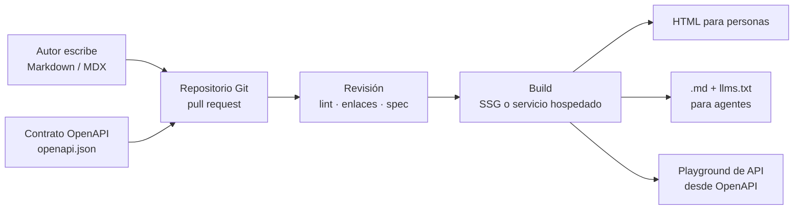
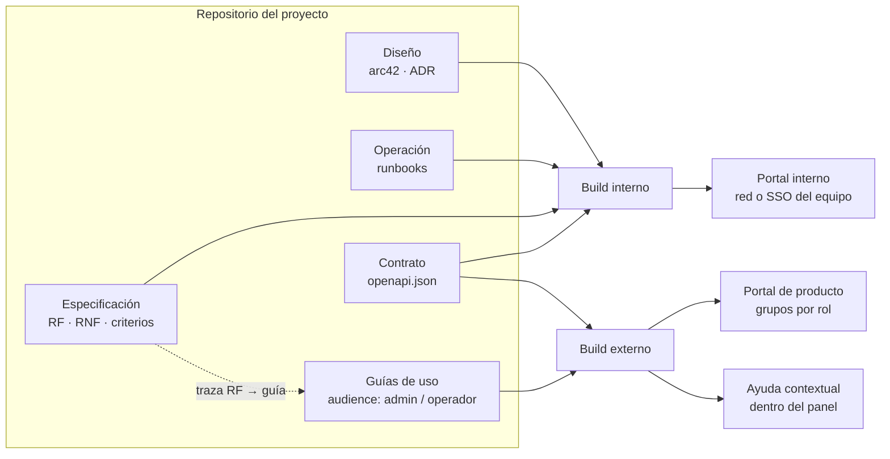
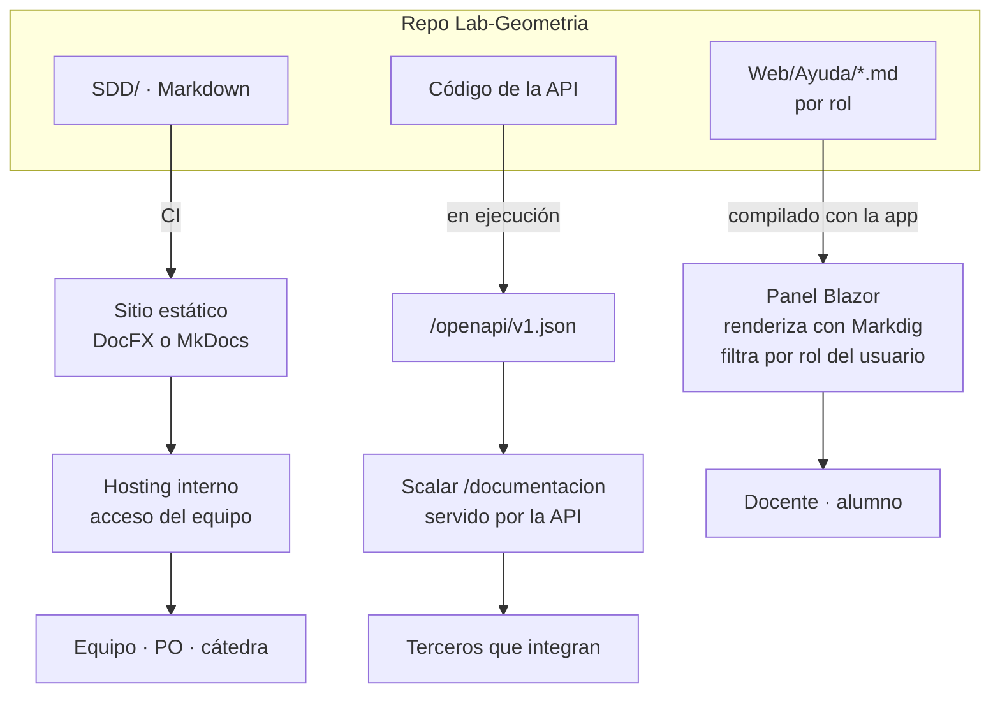
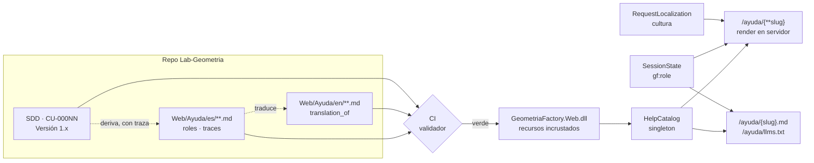
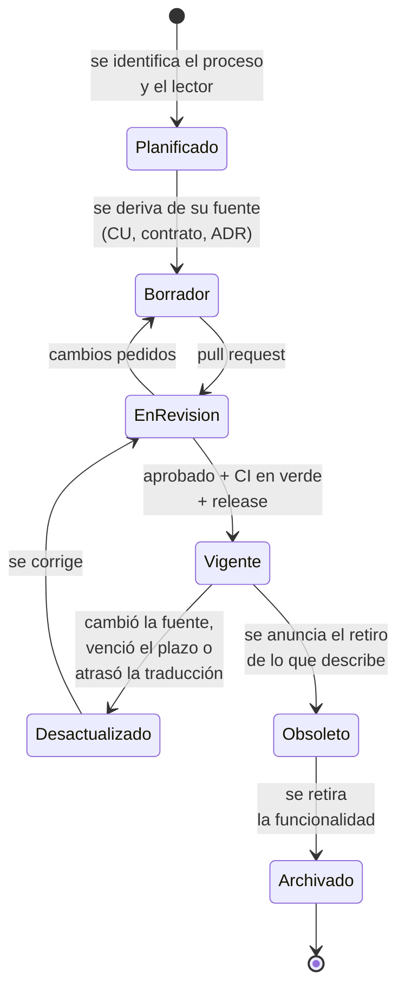
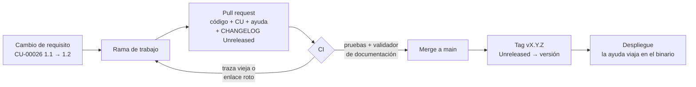

# Sistema documentador técnico — de Markdown al portal publicado

## Resumen ejecutivo

Este apunte responde a una pregunta concreta: el portal de documentación de OneSignal (`documentation.onesignal.com`) ¿nace de documentos base en Markdown que un servicio renderiza a HTML? La respuesta, verificada contra el propio sitio, es **sí**: el portal lo genera Mintlify a partir de archivos MDX (Markdown con componentes) más un archivo OpenAPI; el sitio incluso expone el fuente de cada página con sólo agregar `.md` a la URL. Ese modelo —escribir en texto plano, versionar en Git, publicar por pipeline— es la práctica llamada *docs as code* y es la forma dominante con la que la industria del software documenta productos hoy. La idea del usuario no sólo es factible: es el estándar.

Sirve a quien quiera montar un sistema documentador propio y a los agentes que después tengan que producir o consumir esa documentación.

---

## 1. Qué es el sitio consultado

La URL consultada (limpia de los parámetros de tracking `_gl`, `_ga`, `_gcl_*`, que son de Google Analytics y no cambian el contenido) es:

`https://documentation.onesignal.com/reference/create-user`

Corresponde a la referencia de la operación `POST /apps/{app_id}/users` de la API de OneSignal, un servicio de mensajería (push, email, SMS, in-app) que ofrece API, SDKs y un panel de control. El portal no es el producto: es la **documentación** del producto, y lo que interesa acá es cómo está construida.

### 1.1 Evidencia: el generador es Mintlify

| Verificación | Resultado |
|--------------|-----------|
| `curl` de la página, búsqueda de `<meta name="generator">` | `<meta name="generator" content="Mintlify"/>` |
| Ocurrencias de la cadena `mintlify` en el HTML | 1.133 (assets bajo `/mintlify-assets/`, imagen OG servida desde `onesignal.mintlify.app`) |
| Misma página en el dominio del proveedor | `https://onesignal.mintlify.app/docs/en/home` responde con el mismo contenido |

Mintlify es un servicio comercial de hosting de documentación. OneSignal escribe; Mintlify compila, hospeda y sirve.

### 1.2 Evidencia: el fuente es Markdown (MDX)

La prueba más directa es que el sitio devuelve el documento base sin renderizar:

```text
GET https://documentation.onesignal.com/reference/create-user.md
→ 200  Content-Type: text/markdown; charset=utf-8   (920 líneas)
```

Los primeros renglones del fuente:

```mdx
# Create user

> Create a new user or modify the subscriptions associated with an existing User.

<Warning>
  If you are still using pre-User Model APIs or SDKs (Mobile SDKs version 4 or
  lower, Web SDKs version 15 or lower), we recommend thorough testing ...
</Warning>
```

El bloque `<Warning>` no es HTML: es un componente de MDX, la variante de Markdown que admite JSX. La página de inicio (`/docs/en/home.md`) lo confirma de forma más cruda todavía: define un componente con `export const HomepageBanner = ({imgSrc, ...}) => { return <div ...` y luego lo invoca. Es Markdown con capacidad de programar la presentación, no Markdown puro; pero la prosa, los encabezados y las tablas siguen siendo Markdown estándar.

### 1.3 Evidencia: la referencia de API sale de OpenAPI

El mismo fuente `create-user.md` contiene, en su línea 60, un bloque:

```yaml
openapi: 3.1.0
info:
  title: api.onesignal.com
  version: '11.6'
paths:
  /apps/{app_id}/users:
    post:
      summary: Create user
      operationId: create-user
```

y el sitio sirve la especificación completa en `https://documentation.onesignal.com/openapi.json` (`"openapi": "3.1.0"`, título `api.onesignal.com`, versión `11.6`). Esto quiere decir que los parámetros, esquemas de request/response y ejemplos de código que se ven en la página **no se escriben a mano**: se derivan del contrato OpenAPI. La prosa (advertencias, contexto, notas de migración) sí es humana y vive en el MDX; las dos cosas se combinan al compilar.

Cómo lo hace Mintlify, según su documentación oficial (`mintlify.com/docs/api-playground/openapi-setup`, consultada el 2026-09-16):

> "Reference any number of OpenAPI specifications in the navigation element of your `docs.json` to create pages for your API endpoints."

> "Generated endpoint pages have these default metadata values: `title`: The operation's `summary` field, if present."

Y para páginas individuales con prosa propia, el frontmatter `openapi: "/path/to/openapi.json GET /users"` engancha una página MDX a una operación concreta. Es exactamente el patrón que muestra `create-user.md`.

### 1.4 Evidencia: el sitio está pensado también para agentes

`https://documentation.onesignal.com/llms.txt` responde `200 text/plain` con un índice de 170 páginas en formato `.md`, encabezado por una descripción del producto. Cada página `.md` abre con un aviso que apunta a ese índice ("Fetch the complete documentation index at: .../llms.txt"). La misma fuente sirve a dos audiencias: el HTML para personas, el Markdown y el índice para modelos de lenguaje. Es la regla de doble audiencia aplicada por un proveedor comercial.

---

## 2. El modelo general: *docs as code*

### 2.1 Definición

Write the Docs, la comunidad de referencia de redactores técnicos, lo define así (`writethedocs.org/guide/docs-as-code/`, consultada el 2026-09-16):

> "Documentation as Code (Docs as Code) refers to a philosophy that you should be writing documentation with the same tools as code"

y enumera los cinco componentes: *issue trackers*, control de versiones (Git), marcado en texto plano (Markdown, reStructuredText, AsciiDoc), *code reviews* y pruebas automatizadas. Lo remata con que implica "following the same workflows as development teams, and being integrated in the product team".

Lo que el usuario intuyó al mirar el portal de OneSignal es precisamente eso: la documentación no es un documento de Word ni un CMS con editor visual, es un repositorio.

### 2.2 Flujo de trabajo



El diagrama describe el caso de OneSignal, pero el esqueleto es el mismo para cualquier equipo que adopte el modelo: dos fuentes de verdad (prosa en Markdown, contrato en OpenAPI), un repositorio, un pipeline, varias salidas.

### 2.3 Evidencia de adopción en la industria

Consulta a la API pública de GitHub el 2026-09-16:

| Repositorio | Descripción declarada | Lenguaje principal | Estrellas |
|-------------|----------------------|--------------------|-----------|
| `github/docs` | "The open-source repo for docs.github.com" | TypeScript (contenido en Markdown) | 20.842 |
| `MicrosoftDocs/azure-docs` | "Open source documentation of Microsoft Azure" | Markdown | 10.975 |
| `kubernetes/website` | "Kubernetes website and documentation repo" | HTML (Hugo, contenido en Markdown) | 5.385 |
| `mintlify/docs` | "Official Mintlify documentation" | MDX | 442 |

Tres de los productos más documentados del sector (GitHub, Azure, Kubernetes) mantienen su documentación como repositorio público de Markdown y aceptan *pull requests*. El propio Mintlify documenta a Mintlify con Mintlify: su repo contiene `docs.json` (navegación y configuración), `openapi.json`, `index.mdx`, `quickstart.mdx`, `.vale.ini` (lint de prosa) y carpetas `snippets/`, `components/`, `images/`. Es una muestra completa de cómo se ve un proyecto documental de este tipo.

### 2.4 Cómo se publica

De la guía de inicio de Mintlify (`mintlify.com/docs/quickstart`):

> "A push to the production branch triggers a deployment"

El equipo autoriza la app de GitHub de Mintlify sobre el repo; cada *merge* a la rama de producción reconstruye el sitio. No hay paso manual de publicación. Localmente se previsualiza con `mint dev` desde la carpeta que contiene `docs.json`, y el CLI "find broken links, check accessibility, validate OpenAPI specs" antes de publicar.

---

## 3. Piezas de un sistema documentador

Lo observado en OneSignal y en los repos citados se descompone en piezas estables. Ninguna es exclusiva de Mintlify; cambia la herramienta, no el rol.

| Pieza | Función | En OneSignal / Mintlify | Alternativas verificables |
|-------|---------|-------------------------|---------------------------|
| Fuente de prosa | Guías, conceptos, tutoriales | MDX en repo | Markdown puro (Hugo, MkDocs), reStructuredText (Sphinx), AsciiDoc (Antora) |
| Fuente de contrato | Referencia de API exacta | `openapi.json` 3.1 | OpenAPI/Swagger, AsyncAPI, GraphQL SDL |
| Configuración de navegación | Orden, pestañas, grupos | `docs.json` | `mkdocs.yml`, `sidebars.js` (Docusaurus), `nav` de Hugo |
| Componentes | Avisos, pestañas, tarjetas, pasos | `<Warning>`, `<Card>`, etc. | Admonitions de MkDocs/Docusaurus, directivas de Sphinx |
| Fragmentos reutilizables | Un dato en un solo lugar | carpeta `snippets/` | `include` de AsciiDoc/Sphinx, partials de Hugo |
| Validación | Enlaces, spec, estilo | CLI `mint` + Vale | `lychee`, `markdownlint`, `spectral` (OpenAPI), Vale |
| Build y hosting | Compilar y servir | Mintlify (SaaS) | GitHub Pages, Netlify, Vercel, Read the Docs, contenedor propio |
| Salida para agentes | Contexto para LLM | `llms.txt` + `.md` por página | Convención `llms.txt` (adoptada por varios generadores) |

### 3.1 Sobre la estructura del contenido

Además del *cómo se publica*, la industria tiene una convención bastante extendida sobre *cómo se organiza*: Diátaxis (`diataxis.fr`, consultada el 2026-09-16), que separa la documentación en "four distinct needs, and four corresponding forms of documentation - tutorials, how-to guides, technical reference and explanation". El portal de OneSignal la refleja sin nombrarla: su `llms.txt` agrupa "User Guides", "Developer Guides" y la referencia de API en árboles distintos. Cuando se diseña un documentador propio, separar referencia (generada del contrato) de guías (prosa humana) es la decisión que más simplifica el mantenimiento.

---

## 4. Respuesta a las preguntas planteadas

**¿Los documentos base son Markdown?** Sí, verificado: MDX servido como `text/markdown` por el propio sitio, con componentes JSX embebidos para la presentación enriquecida.

**¿Se generan automáticamente?** En parte. La prosa la escriben personas. La referencia de cada endpoint (parámetros, esquemas, ejemplos por lenguaje) se genera a partir de `openapi.json`, que a su vez suele producirse desde el código del servidor o mantenerse como contrato en el repo. Lo que sí es automático de punta a punta es la publicación: *push* → build → HTML.

**¿Luego el servicio los renderiza en HTML?** Sí. Mintlify compila el repo y sirve el HTML; la misma compilación produce las salidas `.md` y `llms.txt`.

**¿Es así como trabaja la industria?** Sí, bajo el nombre *docs as code*: Markdown (o similar) en Git, revisión por *pull request*, validación automática y despliegue continuo. GitHub, Microsoft Azure y Kubernetes documentan de este modo en repositorios públicos. Lo que varía entre organizaciones es la herramienta de build (SaaS como Mintlify o GitBook, o generadores estáticos autoalojados como Docusaurus, MkDocs, Hugo, Sphinx), no el modelo.

---

## 5. Audiencias, privilegios y el lugar de la especificación

La pregunta cambia de escala cuando el proyecto no es OneSignal sino uno propio: un servicio con panel de control web que va produciendo documentación a medida que se desarrolla. Esa documentación no tiene un solo lector, y ahí se juega el diseño del documentador.

### 5.1 Dos cadenas, dos portales

Dentro de la cadena de desarrollo se escribe para decidir y construir: especificación de requisitos, diseño y arquitectura, decisiones, runbooks de operación. Fuera de ella se escribe para usar: guías del panel, referencia de la API, notas de versión. Las dos cadenas escriben en el mismo repositorio y con el mismo flujo de *docs as code*; lo que las separa es el lector y, por lo tanto, dónde se publican.

Qué documentos existen y para qué sirve cada uno no se redefine acá: lo fija la guía [Documentación técnica](../Documentacion-Tecnica/README.md) de este mismo corpus, con sus siete familias. Este apunte sólo agrega la dimensión que esa guía no trata —**hacia qué portal se compila cada familia**— y la cruza con los tipos de Diátaxis.

| Familia (guía `Documentacion-Tecnica`) | Documentos | Lector dominante | Tipo Diátaxis dominante | Portal |
|----------------------------------------|------------|------------------|-------------------------|--------|
| 1 Visión `FAM-VIS` | `DOC-VISION`, `DOC-PRD`, `DOC-ROADMAP` | PO, dirección | Explicación | Interno |
| 2 Análisis `FAM-ANA` | `DOC-SRS`, `DOC-DOMINIO` | Equipo, PO, QA | Referencia | Interno |
| 3 Arquitectura `FAM-ARQ` | `DOC-SAD`, `DOC-ADR`, `DOC-THREAT` | Equipo técnico, seguridad | Explicación | Interno |
| 4 Diseño `FAM-DIS` | `DOC-LLD`, `DOC-DATOS`, `DOC-API` | Desarrolladores | Referencia | Interno; `DOC-API` también externo, generado del mismo OpenAPI |
| 5 Operativa `FAM-OPE` | `DOC-DEPLOY`, `DOC-RUNBOOK`, `DOC-ADMIN` | Soporte, infraestructura | Guías prácticas | Interno; `DOC-ADMIN` puede ser externo si el cliente administra |
| 6 Desarrollo `FAM-DEV` | `DOC-DEVGUIDE`, `DOC-TESTPLAN`, `DOC-RELEASE`, `DOC-CHANGELOG` | Equipo | Guías prácticas | Interno; las notas de versión se publican afuera |
| 7 Usuarios `FAM-USR` | `DOC-MANUAL` (tutoriales, FAQ, guías rápidas) | Usuario del panel, por rol | Tutoriales y guías prácticas | Externo y ayuda contextual del panel |

La asignación de portal es criterio propio; la familia y los `doc_id` son los de la guía. Seis de las siete familias se quedan dentro de la cadena de desarrollo. La frontera no pasa entre familias sino a través de tres documentos —`DOC-API`, `DOC-ADMIN` y las notas de `DOC-RELEASE`—, y es justamente ahí donde un vault único necesita dos builds.

La especificación y el diseño **sí pertenecen al vault**, y la industria tiene formatos establecidos para guardarlos junto al código. La guía los desarrolla en [ADR](../Documentacion-Tecnica/30-Arquitectura/ADR.md) y [SAD](../Documentacion-Tecnica/30-Arquitectura/SAD.md); los antecedentes externos son dos. Michael Nygard propuso en 2011 los *Architecture Decision Records*: archivos cortos en Markdown guardados "in the project repository under doc/arch/adr-NNN.md", con secciones Title, Context, Decision, Status y Consequences, escritos como "a conversation with a future developer". arc42 fija las doce secciones de una documentación de arquitectura, de Introducción y Objetivos a Glosario, y su sección 9 son precisamente las decisiones. Ninguno de los dos es documentación para el usuario final, y ninguno debería llegarle. Cuando la especificación además se usa como fuente de verdad para generar código con agentes, el tema pasa a [Spec-Driven Development](../Documentacion-Tecnica/95-Transversales/Spec-Driven-Development.md) (`DOC-SDD`), que la guía trata como transversal.

### 5.2 Un vault, varias publicaciones



La especificación no se publica afuera, pero alimenta a lo que sí se publica: cada guía de uso puede trazar al requisito que describe, y el contrato OpenAPI sirve a las dos audiencias con el mismo archivo. Es la misma lógica de fuente única que OneSignal aplica entre prosa y contrato, extendida a todo el ciclo.

### 5.3 Privilegios: distinguir rol de usuario y confidencialidad

«Documentación con distintos privilegios» encierra dos problemas diferentes que conviene no mezclar.

El primero es **segmentar por rol del producto**: el administrador del panel ve la guía de gestión de usuarios, el operador no. Es contenido del mismo producto filtrado por audiencia, y los portales lo resuelven con metadatos por página. Mintlify, por ejemplo, permite declarar `groups` en el frontmatter: "Users must belong to at least one of the listed groups to access the page. If a user tries to access a page without the required group, they'll receive a 404 error". En la tradición anterior a Markdown, el estándar DITA de OASIS lo llama *conditional processing* o *profiling*: atributos como `@audience`, `@platform` o `@product` marcan cada fragmento, y un perfil DITAVAL decide al compilar qué se incluye y qué no.

El segundo es **confidencialidad**: el diseño interno, las decisiones y los runbooks no deben estar en el portal del producto con una marca que los oculte. Mintlify distingue entre *authentication*, que exige login, y *personalization*, que identifica al visitante "while keeping pages public". Su propia documentación lo advierte sin rodeos: "With personalization, `groups` control visibility but do not restrict access to a page. A visitor can still open a group-filtered page by navigating directly to its URL. Use authentication to restrict access to sensitive content." Un filtro de visibilidad no es un control de acceso. La recomendación que se desprende —criterio propio, no norma de la industria— es resolver la confidencialidad **en el build y no en la vista**: el documento interno no se compila en el sitio externo, de modo que un frontmatter mal escrito no puede filtrarlo. Los grupos por rol quedan para lo que son: comodidad del lector dentro de un contenido que ya es publicable.

### 5.4 Cómo se llama esto en la industria

No hay un nombre único; hay tres, y cada uno cubre una parte.

| Término | Qué nombra | Referencia verificada |
|---------|------------|-----------------------|
| *Docs as code* / *docs-like-code* | La práctica: documentación en texto plano, versionada y publicada con las herramientas del código | Write the Docs; libro de Anne Gentle *Docs Like Code* |
| *Internal developer portal* | El sistema de visualización de la documentación técnica del propio proyecto, asociada a cada servicio | Backstage (Spotify): "an open source framework for building developer portals" |
| *Single sourcing* / *conditional processing* | Una fuente, varias salidas según audiencia | OASIS DITA 1.3, §2.4.3 |

El que más se acerca a «un sistema de visualización de documentación técnica gestionada como proyecto» es el **portal interno de desarrollo**, y su referencia es Backstage con su módulo TechDocs, que Spotify describe como "homegrown docs-like-code solution": "Engineers write their documentation in Markdown files which live together with their code", se compila con MkDocs, y se descubre "from the Service's page in Backstage Catalog". Es decir, la documentación de cada servicio aparece colgada del servicio en un catálogo, no en un sitio aparte. La contracara externa —el portal del producto con referencia de API y guías por rol— es lo que hacen Mintlify, OneSignal o GitHub Docs.

---

## 6. Caso: un panel de control en .NET — Lab-Geometria

Las secciones anteriores describen el modelo en abstracto. Este caso lo baja a un proyecto concreto y público: [`hdcm-dev/Lab-Geometria`](https://github.com/hdcm-dev/Lab-Geometria), una solución .NET 10 con un servicio de datos REST (ASP.NET Core) y un panel web en Blazor Interactive Server que es el único punto de contacto del navegador. Las preguntas son tres: en qué repositorio va la documentación, cómo se mantiene coherente con las ramas y versiones del código, y quién renderiza el Markdown.

### 6.1 Estado verificado

El proyecto ya tiene tres de las piezas, repartidas en dos repositorios.

| Pieza | Dónde está | Evidencia (revisión `4b114d7`, 2026-09-15) |
|-------|------------|---------------------------------------------|
| Especificación y diseño (SDD) | `SDD/` **dentro del repo de código** | 580 archivos `.md` fuera de `_legacy/`; incluye intake, visión, necesidades, ADR de producto y documentación por unidad de entrega |
| Referencia de la API | La **sirve la propia API**, generada del código | `Microsoft.AspNetCore.OpenApi` 10.0.11 y `Scalar.AspNetCore` en `GeometriaFactory.Api.csproj`; rutas `GET /openapi/v1.json` y `/documentacion` en `Composition/ApiDocumentation.cs` |
| Publicación de la referencia | Condicionada, no automática | Ajuste `Documentacion:Publicada`; decisión `ADR-08008` «La superficie HTTP se describe y el explorador no se publica solo» |
| Documentación **sobre** el proyecto | Repo auxiliar `hdcm-dev/Lab-Geometria.Documentacion` | Contiene `ia-db/`, `Analisis/`, `PROMPTs/` y `Guides/` (vacía) |
| Manual de usuario del panel | **No existe** | Búsqueda de `ayuda`/`manual` en `src/GeometriaFactory.Web/**/*.razor`: sólo dos comentarios de código |
| Versiones | Tags en el repo de código | `v1.0.0` … `v1.2.0` |

La referencia de API ya sigue el patrón de OneSignal por otra vía: el contrato OpenAPI no se escribe a mano, sale del código en tiempo de ejecución, y el explorador Scalar lo presenta. Lo que falta es la familia `FAM-USR` completa: nadie le explica al docente, dentro del panel, cómo habilitar una cuenta o qué significa una discrepancia.

### 6.2 ¿Mismo repositorio o repositorio auxiliar?

La industria hace las dos cosas, y el criterio que las separa es **si el documento cambia al ritmo del código que describe**. Backstage lo formula para el caso del mismo repo —"Engineers write their documentation in Markdown files which live together with their code"—. En el otro extremo, GitHub y Kubernetes mantienen la documentación de producto en repos separados (`github/docs`, `kubernetes/website`), con equipos de redacción, traducciones y contribuyentes externos que tienen su propio ritmo.

Aplicado a Lab-Geometria:

| Documento | Repositorio | Por qué |
|-----------|-------------|---------|
| SDD (especificación, diseño, ADR) | Código (como hoy) | El pull request que cambia una regla cambia su especificación; un tag congela las dos |
| Manual del panel por rol (`FAM-USR`) | Código, dentro del proyecto Web | Describe pantallas que cambian en el mismo PR; si queda afuera, se desfasa sin que nada lo detecte |
| Guías de integración para terceros | Código, junto a la API | Complementan un contrato que se genera del mismo código |
| Índices para agentes, análisis, prompts, guías de estudio | Auxiliar `.Documentacion` (como hoy) | Hablan **del** proyecto, no **del** producto; no se despliegan con él |

La separación que ya existe es la correcta. La regla para decidir dónde va un documento nuevo es una pregunta: ¿tiene que cambiar en el mismo pull request que el código? Si sí, va al repo de código.

### 6.3 Coherencia de ramas y versiones

Con la documentación en el mismo repo, la coherencia es gratuita. El tag `v1.2.0` es el código de la 1.2.0 y también su documentación. Una rama de funcionalidad lleva su propio cambio de manual. Nada se sincroniza porque no hay dos historias.

Con un repo separado, la coherencia hay que construirla. Kubernetes lo resuelve con una rama por versión en `kubernetes/website`: la API de GitHub lista `release-1.29` a `release-1.36` entre sus 82 ramas. Ese es el costo de mantener la documentación en otro repo. Una ventaja que en Lab-Geometria no aplica.

La otra mitad de la pregunta es si hace falta versionar la documentación publicada. Docusaurus, que implementa el versionado (`docusaurus docs:version 1.1.0` copia `docs/` a `versioned_docs/`), lo desaconseja por defecto: "Most of the time, you don't need versioning as it will just increase your build time, and introduce complexity to your codebase". Un panel con un único despliegue vivo, como este, tiene una sola versión que documentar: la que está corriendo. Publicar varias versiones empieza a ser necesario cuando conviven clientes de versiones distintas: una API `v1` y otra `v2` en paralelo, o un paquete NuGet con consumidores atrasados. La ruta `/openapi/v1.json` ya deja ese lugar previsto.

### 6.4 ¿Renderiza el panel o un servicio aparte?

No hay una sola respuesta, porque hay tres lectores y cada uno pide un mecanismo distinto.



**Referencia de API → la sirve la API.** Ya está resuelto y es el mejor de los tres casos: el contrato no puede desfasarse del código porque se genera de él. Las guías de integración en prosa (cómo obtener la credencial, un flujo de ejemplo) pueden vivir como Markdown junto a la API y publicarse en el mismo explorador.

**Manual de usuario → dentro del panel.** Esta es la única familia donde renderizar en el propio panel tiene ventajas que un servicio aparte no puede igualar. El panel ya conoce la identidad y el rol del usuario. En Blazor Interactive Server el contenido se arma en el servidor, así que una sección para el docente no se le envía al alumno. El problema de privilegios de la sección 5.3 queda resuelto por construcción, con los roles que el producto ya tiene. La ayuda puede ser contextual, un enlace desde la pantalla a su sección. Y el manual es siempre el de la versión desplegada, porque viaja dentro del binario. En .NET, el renderizado de Markdown lo resuelve Markdig ("A fast, powerful, CommonMark compliant, extensible Markdown processor for .NET"). Esta propuesta es criterio propio: no está probada en Lab-Geometria.

**Documentación interna (SDD) → sitio estático aparte.** No en el panel. El panel es el front público, y la sección 5.3 ya estableció que lo confidencial se separa en el build, no en la vista. Un paso de CI compila `SDD/` a HTML estático con DocFX ("Static site generator for .NET API documentation", del propio `dotnet`) o con MkDocs, que es el motor de TechDocs. El resultado se publica en un hosting de acceso restringido. Hablar de "servicio solidario" es exagerado: son archivos estáticos que no tienen lógica en tiempo de ejecución. Cualquier servidor web o un portal interno tipo Backstage los sirve.

La respuesta corta a la pregunta es entonces: todo Markdown, todo en el repo de código, pero **tres salidas**. El panel renderiza sólo lo que es del usuario. La API sirve su propio contrato. Lo interno se compila aparte.

---

## 7. Propuesta: ayuda por rol en Lab-Geometria

El punto de partida es concreto. El panel tiene dos papeles, `Role.Student` («Alumno») y `Role.Administrator` («Administrador»), declarados en `GeometriaFactory.Domain/Values/Role.cs`. La sesión los lleva en el claim `gf:role` (`Web/Services/SessionClaims.cs`), y `SessionState.IsAdministrator` los consulta. Cada papel tiene flujos distintos, y por lo tanto documentación distinta. La pregunta es cómo ofrecer lo que ofrece OneSignal con piezas estándar de .NET y bajo *docs as code*.

Toda esta sección es **propuesta**. El motor se probó aislado (7.8); nada se construyó dentro de Lab-Geometria.

### 7.1 Qué se toma de OneSignal y cómo se traduce

| Lo que ofrece OneSignal | Equivalente propuesto en Lab-Geometria |
|-------------------------|----------------------------------------|
| Páginas escritas en MDX, compiladas por Mintlify | Páginas en Markdown dentro del proyecto Web, renderizadas por el panel con Markdig |
| Referencia de API generada de `openapi.json` | Ya existe: OpenAPI generado del código + Scalar en `/documentacion` (`ADR-08008`) |
| `groups` en el frontmatter, 404 si el usuario no pertenece | `roles` en el frontmatter, evaluados contra `gf:role`; 404 si no alcanza |
| Navegación declarada en `docs.json` | Navegación derivada del catálogo: carpeta, `order` y `roles` de cada página |
| `.md` crudo por página y `llms.txt` | `/ayuda/{página}.md` y `/ayuda/llms.txt`, **filtrados por el rol de la sesión** |
| Sitio multilenguaje (`es.json`, `fr.json` en `mintlify/docs`) | Una carpeta por cultura, con el español como idioma fuente y respaldo |
| Validación previa al deploy (`mint` CLI) | Validador en CI: enlaces, cruces de rol, cobertura de casos de uso, frescura de traducciones |

Queda una diferencia de fondo. OneSignal documenta un producto desde un sitio aparte. Acá la ayuda vive **dentro** del panel, porque es la única forma de que el filtrado por rol use la identidad que el producto ya tiene (sección 6.4).

### 7.2 Arquitectura



Las piezas en tiempo de ejecución son pocas:

| Pieza | Responsabilidad |
|-------|-----------------|
| `HelpCatalog` (singleton) | Al arrancar, lee los recursos `Ayuda/**.md` del ensamblado, parsea el frontmatter y deja el catálogo en memoria. Es inmutable: el contenido cambia sólo con un despliegue |
| Página `/ayuda/{**slug}` | Pide al catálogo la página para `(slug, rol, cultura)`. Si no existe para ese rol, responde la superficie de «no encontrado» que el panel ya tiene (`NotFoundSurface.razor`) |
| Endpoints `.md` y `llms.txt` | Devuelven el fuente y el índice **del rol de la sesión**; exigen sesión |
| Componente `<AyudaContextual Tema="…"/>` | Enlace desde una pantalla a su página de ayuda, que sólo se dibuja si el rol la puede ver |

### 7.3 Estructura del contenido y contrato del frontmatter

```text
src/GeometriaFactory.Web/Ayuda/
├── es/                              ← idioma fuente
│   ├── comun/
│   │   ├── ingresar.md
│   │   └── cambiar-contrasena.md
│   ├── alumno/
│   │   ├── enviar-un-trabajo.md
│   │   ├── leer-las-discrepancias.md
│   │   └── consultar-mis-trabajos.md
│   ├── administrador/
│   │   ├── primer-arranque.md
│   │   ├── gobernar-las-cuentas.md
│   │   ├── resetear-una-contrasena.md
│   │   └── dar-desenlace-a-la-revision.md
│   └── glosario.md
└── en/                              ← traducción, puede estar incompleta
    └── …
```

Las carpetas `comun/`, `alumno/` y `administrador/` ordenan el trabajo del autor. **No son el control de acceso**: quien decide es el campo `roles` de cada página. Una página del administrador guardada en `comun/` por error no se filtra a alumnos.

| Campo | Obligatorio | Ejemplo | Para qué |
|-------|-------------|---------|----------|
| `title` | Sí | `Enviar un trabajo` | Título, navegación, `llms.txt` |
| `description` | Sí | `Pegar la salida del programa y leer las discrepancias.` | Resumen en navegación y `llms.txt` |
| `roles` | Sí | `[Student]` | Quién la ve. Valores: los nombres del enum `Role` |
| `order` | Sí | `10` | Orden dentro de la navegación del rol |
| `traces` | Sí | `[CU-00026@1.1, RN-02005]` | Casos de uso y reglas que la página explica, con la versión del CU que se leyó |
| `topic` | No | `envio-de-trabajo` | Clave estable para `<AyudaContextual Tema="…"/>` |
| `translation_of` | Sólo en traducciones | `es/alumno/enviar-un-trabajo.md@a1b2c3d` | Página fuente y revisión de la que se tradujo |

Los valores de `roles` son los nombres del enum `Role`, y no las etiquetas en castellano. `Role.cs` fija que los papeles "se guardan y se serializan POR SU NOMBRE": la documentación sigue la misma regla.

### 7.4 Derivación desde la especificación

El cuerpo de usuario **no se genera** de la especificación, **se deriva** de ella. Los casos de uso del SDD ya tienen la forma de un manual. `CU-00026 — Enviar un trabajo y ver sus observaciones`, por ejemplo, declara Actores, Precondiciones, Flujo principal, Flujos alternativos, Excepciones y errores, y un campo **Versión**. Pero están escritos para el equipo, con vocabulario de contrato («tres tramos de un solo acto»). Un alumno necesita otra voz. La correspondencia es:

| Sección del CU | Sección de la página de ayuda | Tratamiento |
|----------------|-------------------------------|-------------|
| 2. Actores | Campo `roles` | Directo |
| 1. Propósito | Párrafo de apertura: para qué sirve | Reescrito en la voz del usuario |
| 3. Precondiciones | «Antes de empezar» | Reescrito |
| 4. Flujo principal | Pasos numerados | Reescrito, con los nombres de botones y pantallas del panel |
| 5. Flujos alternativos | «Si…» | Reescrito; sólo los que el usuario percibe |
| 6. Excepciones y errores | «Si algo sale mal»: mensaje que ve y qué hacer | Reescrito desde el mensaje de la pantalla, no desde el código de error |
| 8. Criterios de aceptación | — | No se publica: es verificación del equipo |
| Reglas `RN-` citadas | «Por qué funciona así» | Sólo las que explican un comportamiento visible |

De los CU del panel, los candidatos directos son `CU-00021` a `CU-00029`: alta de cuentas, ingreso, gobierno de cuentas, reseteo, primer arranque, envío, borrado, consulta y desenlace. Los `CU-06NNN` son internos del servicio y no se documentan para el usuario.

La traza es lo que mantiene coherente la derivación. Cada página declara en `traces` el CU **y la versión** que se leyó (`CU-00026@1.1`). Cuando el CU pasa a 1.2, el validador de CI marca la página como potencialmente desactualizada. El que escribió la página revisa, actualiza la traza y el aviso desaparece. Es el mismo mecanismo que la ia-db aplica a sus índices («cuando la evidencia contradiga un índice, manda la evidencia»), llevado a la ayuda.

Un agente puede producir el primer borrador de cada página a partir de su CU, y es trabajo apropiado para uno. La guía [Documentación técnica](../Documentacion-Tecnica/README.md) fija el límite en su actor `ACT-10`: el agente "produce borradores, no decide". La página entra por pull request y la aprueba una persona.

### 7.5 Roles: dónde se decide y cómo se prueba

La decisión se toma en el servidor y en un solo lugar: `HelpCatalog.Get(slug, rol, cultura)`. Hay tres consecuencias que valen más que la elegancia del diseño:

- **El contenido de otro rol no viaja.** El panel es Blazor Interactive Server: el HTML se arma en el servidor, y una página que el catálogo no entrega nunca llega al navegador. Es lo que Mintlify llama *authentication* y no *personalization* (sección 5.3).
- **La navegación, el `.md` crudo y el `llms.txt` pasan por el mismo filtro.** Sin eso, el índice para agentes filtraría títulos y descripciones de páginas que el rol no puede ver.
- **Los enlaces no pueden cruzar de rol.** Una página de alumno que enlaza a una de administrador es un enlace roto para el alumno. El validador lo detecta en CI: la prueba de concepto encontró un cruce de este tipo que no se había plantado (7.8).

La prueba de extremo a extremo que cierra el tema cabe en la batería Playwright que el proyecto ya tiene. Sesión de alumno, `GET /ayuda/administrador/gobernar-las-cuentas` → la superficie de no encontrado. `GET /ayuda/llms.txt` → ninguna línea de administrador.

### 7.6 Idiomas

.NET trae el mecanismo estándar para **elegir** la cultura, y ese mecanismo se usa tal cual. `AddLocalization` y `UseRequestLocalization` resuelven la cultura de cada request con tres proveedores por defecto, en orden: `QueryStringRequestCultureProvider`, `CookieRequestCultureProvider` y `AcceptLanguageHeaderRequestCultureProvider`. La documentación de Microsoft advierte que el encabezado del navegador "isn't an infallible way to detect the user's preferred language" y que "a production app should include a way for a user to customize their choice of culture". Un selector de idioma que escriba la cookie `.AspNetCore.Culture` resuelve eso.

Lo que **no** conviene usar para la ayuda son los `.resx`. Están hechos para cadenas cortas de la interfaz (etiquetas, botones, mensajes), y Microsoft mismo recomienda "Generally, only localize text, not HTML". Una página de ayuda es prosa larga con estructura. Su unidad de traducción natural es el archivo entero, como hacen los portales de la industria: Kubernetes mantiene 17 idiomas como carpetas hermanas en `kubernetes/website/content/` (`en`, `es`, `de`, `ja`, `zh-cn`…), y Docusaurus copia los documentos a `i18n/<locale>/…`. Por eso la propuesta separa dos cosas:

| Qué se traduce | Mecanismo |
|----------------|-----------|
| Cadenas del panel (menú «Ayuda», «Página no encontrada», selector de idioma) | `IStringLocalizer` + `.resx`, el estándar de ASP.NET Core |
| Páginas de ayuda | Un árbol de `.md` por cultura (`Ayuda/es/`, `Ayuda/en/`) |

La búsqueda por cultura imita el *culture fallback* de .NET, en el que, según Microsoft, "if not found, it reverts to the parent culture". Para `es-AR` se busca `es-AR/`, después `es/`. Si la página no está traducida, se sirve la del idioma fuente con un aviso visible de que no está traducida, y nunca un 404: la falta de traducción no puede quitarle la ayuda a nadie.

La frescura se controla igual que la derivación. Cada traducción declara en `translation_of` la página fuente y la revisión de la que se tradujo. Si la fuente cambia después, CI marca la traducción como atrasada.

Una aclaración para no sobredimensionar: Lab-Geometria hoy no tiene localización (no hay `AddLocalization`, `IStringLocalizer` ni `.resx` en `src/`), y su norma de nombres fija las etiquetas en castellano. La recomendación —criterio propio— es crear la carpeta `es/` desde el primer día, porque cuesta un nivel de directorio y evita mover todo el árbol después, pero **no** activar el middleware ni escribir traducciones hasta que exista un segundo idioma real.

### 7.7 Validaciones en CI

| Chequeo | Falla cuando… | Estado |
|---------|---------------|--------|
| Frontmatter | Falta un campo obligatorio, o `roles` tiene un valor que no está en el enum `Role` | Propuesto |
| Enlaces rotos | Un enlace `.md` apunta a una página inexistente | **Probado** en 7.8 |
| Cruce de rol | Una página enlaza a otra que algún rol lector no puede ver | **Probado** en 7.8 |
| HTML crudo | Una página trae HTML (Markdig lo escapa con `DisableHtml()`; el chequeo lo avisa antes) | Escape **probado** en 7.8 |
| Cobertura | Un CU del panel con actor Alumno o Administrador no tiene ninguna página que lo trace | Propuesto |
| Frescura de la derivación | La versión en `traces` es menor que la del CU | Propuesto |
| Frescura de la traducción | La revisión de `translation_of` es anterior al último cambio de la fuente | Propuesto |
| E2E de acceso | Una sesión de alumno obtiene una página o una línea de `llms.txt` de administrador | Propuesto |

### 7.8 Prueba de concepto

Se construyó una aplicación de consola aislada en .NET 10 con Markdig 0.45.0 y YamlDotNet 16.3.0, y tres páginas de ejemplo con tres defectos plantados. El código, el contenido y la salida están en [`Examples/Prueba-Ayuda-Por-Rol/`](Examples/Prueba-Ayuda-Por-Rol/README.md).

El núcleo es corto. El pipeline de Markdig y la decisión de acceso (`Examples/Prueba-Ayuda-Por-Rol/Consola/Program.cs`):

```csharp
var pipeline = new MarkdownPipelineBuilder()
    .UseAdvancedExtensions().UseYamlFrontMatter().DisableHtml().Build();

// Acceso por rol: si no alcanza, la página NO EXISTE (404)
string? Render(string slug, string role) =>
    pages.TryGetValue(slug, out var p) && p.Meta.Roles.Contains(role)
        ? p.Doc.ToHtml(pipeline) : null;
```

Y los recursos se incrustan en el ensamblado con su ruta como nombre lógico (`Examples/Prueba-Ayuda-Por-Rol/Consola/Spike.csproj`):

```xml
<EmbeddedResource Include="Ayuda\**\*.md"
                  LogicalName="Ayuda/%(RecursiveDir)%(Filename)%(Extension)" />
```

Lo que la corrida demostró (`Consola/salida.txt`, 2026-09-19):

| Comportamiento | Resultado |
|----------------|-----------|
| Navegación del alumno | `comun/ingresar`, `alumno/entregar-trabajo` |
| Navegación del administrador | `comun/ingresar`, `administrador/habilitar-cuentas` |
| Alumno pide la página de administrador | `404` |
| `llms.txt` por rol | Cada rol ve sólo sus dos entradas |
| `<script>` dentro de una página | Sale como `&lt;script&gt;`: no se ejecuta |
| Tablas de Markdown | `<table>` con `<thead>` y `<tbody>` |
| Validador | 3 fallas, código de salida 1. Dos plantadas; la tercera —`comun/ingresar` enlaza a una página sólo de alumno, que el administrador no puede abrir— **no estaba plantada** y la encontró el validador |

Sobre ese motor se armó después un panel web mínimo en Blazor, dentro de un devcontainer (`Examples/Prueba-Ayuda-Por-Rol/Web/` y su `.devcontainer/`). Tiene ingreso simulado por papel, nueve páginas derivadas de `CU-00022` a `CU-00029`, ayuda contextual en cada pantalla, fuente `.md`, `llms.txt` y dos idiomas. Se verificó con `curl` sobre `localhost` y a través de un túnel público, y quedaron siete capturas en `capturas/`:

| Verificación (2026-09-19) | Resultado |
|---------------------------|-----------|
| Arranque | `Catálogo de ayuda: 9 páginas, validador con 0 fallas` |
| Sin sesión, `/ayuda` | `302` a `/ingresar` |
| Alumno → página de administrador (HTML y `.md`) | `404`; el cuerpo no contiene el título de la página pedida |
| Administrador → página de alumno | `404` |
| `llms.txt` | 4 entradas para el alumno, 5 para el administrador |
| Inglés, página sin traducir | Se sirve la española con el aviso «This page has not been translated yet» |

La prueba web dejó un aprendizaje de .NET 10 que conviene registrar. Fijar `HttpContext.Response.StatusCode = 404` desde un componente de render estático devolvió **un cuerpo vacío** (`Content-Length: 0`). El camino que funcionó es el que prevé el framework: `NavigationManager.NotFound()` más `NotFoundPage` en el `Router`.

Lo que la prueba **no** cubre: la integración con el `SessionState` real de Lab-Geometria y su modo Interactive Server, la cobertura contra el SDD completo y el rendimiento. Esas piezas son diseño, no evidencia.

### 7.9 Cómo entraría en Lab-Geometria

Lab-Geometria no se modifica con un parche: todo cambio de alcance pasa por su SDD. Una ayuda por rol es alcance nuevo, así que entraría como una necesidad de negocio y un caso de uso propios. Sobre ellos irían la maqueta de la superficie `/ayuda`, la decisión de arquitectura (catálogo incrustado frente a sitio aparte, que es la discusión de la sección 6.4) y las pruebas. El orden de construcción razonable es este:

1. Catálogo, render y filtro por rol, con el validador de enlaces y cruces en CI.
2. Las nueve páginas derivadas de `CU-00021` a `CU-00029`, en español, con sus trazas.
3. Ayuda contextual desde las pantallas y los endpoints `.md` y `llms.txt`.
4. Cobertura y frescura de la derivación en CI.
5. Idiomas, recién cuando haya un segundo idioma real.

---

## 8. La documentación como parte del ciclo de desarrollo

Las secciones anteriores tratan la documentación como un producto que se escribe, se compila y se publica. Falta la dimensión del tiempo. Un documento nace, se revisa, se publica, envejece, se corrige, se declara obsoleto y se archiva. Si nadie gobierna esas transiciones, la documentación se degrada sola: el código cambia y el texto no.

### 8.1 Qué dice la norma

La serie ISO/IEC/IEEE de ingeniería de software ubica la documentación **dentro** de los procesos del ciclo de vida, no al lado. ISO/IEC/IEEE 15289:2019 lo declara en su alcance: "This document specifies the purpose and content of all identified systems and software life‐cycle and service management information items (documentation)". Toma como base los procesos de ISO/IEC/IEEE 12207:2017 (software) y 15288:2015 (sistemas), que "define an Information Management process, but do not 'detail information items in terms of name, format, explicit content, and recording media'". La 15289 completa ese hueco: vincula cada proceso con los documentos que produce y los clasifica en tipos genéricos.

La consecuencia práctica es la idea que motiva esta sección. Cada documento **pertenece a un proceso** del ciclo de vida del software: la especificación a la definición de requisitos, el ADR a la arquitectura, el manual a la operación. Por lo tanto cambia cuando ese proceso cambia. *Docs as code* es la forma operativa de sostener ese vínculo: si el documento vive en el mismo repositorio y pasa por el mismo pull request que el código, sus transiciones quedan atadas a las del código.

### 8.2 Las fases



| Fase | Qué pasa | Disparador | Mecanismo verificable |
|------|----------|------------|-----------------------|
| Planificar | Se decide qué documento hace falta, para qué lector y en qué portal | Un proceso nuevo del ciclo, un caso de uso nuevo | La tabla familia → portal de 5.1; la cobertura CU → página de 7.7 |
| Derivar y redactar | Se escribe a partir de su fuente | El documento planificado | Frontmatter con `traces` y versión de la fuente (7.3); `origin` y `confidence` si participó un agente |
| Revisar | Otra persona lo lee con criterio | Pull request | La revisión del PR; los chequeos de CI de 7.7 |
| Publicar | Llega a su lector | *Merge* y *release* | El documento viaja con la versión: tag, despliegue, `CHANGELOG` |
| Mantener | Se detecta y corrige lo que envejeció | Cambio de fuente, plazo vencido, traducción atrasada | Trazas con versión, `last_review` o `ms.date`, `translation_of` |
| Deprecar | Se anuncia que lo descrito va a desaparecer | Decisión de producto | Estado `obsoleto`; sección *Deprecated* del changelog |
| Archivar | Se retira del portal vivo sin destruirse | Retiro efectivo de la funcionalidad | Carpeta de archivo inmutable, versión archivada |

La secuencia es criterio de este apunte. Las piezas no lo son: cada mecanismo de la última columna se verifica en 8.3 a 8.5 contra una fuente de la industria o contra los propios repos.

### 8.3 Acoplamiento con el ciclo del código



Hay tres puntos de anclaje, y los tres ya existen en la práctica de la industria:

- **El pull request como unidad de cambio.** La regla de 6.2: si un documento tiene que cambiar en el mismo PR que el código que describe, vive en el mismo repositorio. El PR que cambia `CU-00026` también cambia su página de ayuda, porque si no, el validador de frescura de 7.7 lo rechaza.
- **El changelog como puente entre desarrollo y publicación.** Keep a Changelog 1.1.0 pide "Keep an `Unreleased` section at the top to track upcoming changes", y al publicar esa sección pasa a ser la de la versión. La guía [Change-Log](../Documentacion-Tecnica/60-Desarrollo/Change-Log.md) del corpus desarrolla ese ciclo; este apunte no lo repite.
- **El tag como congelamiento.** Con la documentación en el repo del código, el tag congela las dos cosas juntas (6.3). Lab-Geometria tiene hoy `v1.0.0` a `v1.2.0`.

### 8.4 Estados y metadatos: el ciclo de vida escrito en el documento

Una fase que no queda registrada en el documento no se puede verificar. Los sistemas revisados escriben el ciclo de vida en metadatos, y los tres casos coinciden en lo esencial:

| Pregunta del ciclo de vida | Corpus `Lab-Documentos` (`Convenciones.md`) | SDD de Lab-Geometria | Microsoft Learn | Ayuda propuesta (7.3) |
|----------------------------|---------------------------------------------|----------------------|-----------------|-----------------------|
| ¿En qué estado está? | `status: vigente \| borrador \| obsoleto` | `**Estado:**` en cabecera (`Aprobado`, `Propuesto`, `Emitido`, `Aceptado`…) | — | Heredado del PR: en `main` está vigente |
| ¿Qué versión es? | — | `**Versión:**` en cabecera | `git_commit_id` en la página publicada | La del ensamblado desplegado |
| ¿Cuándo se revisó? | `last_review` | Control de cambios fechado (en 550 documentos vivos) | `ms.date` | — (propuesta: agregarlo) |
| ¿Quién responde? | `owner` | `**Autor:**` | `ms.author` | — (propuesta: agregarlo) |
| ¿Quién lo produjo y cuánto confiar? | `origin`, `confidence` | Auditoría por fase | — | — |
| ¿De qué fuente deriva? | `traces` | `Trazabilidad upstream` | — | `traces: [CU-00026@1.1]` |
| ¿Dónde queda lo retirado? | Estado `obsoleto` | `_legacy/` fechado por migración | — | Historial de Git |

Dos definiciones de Microsoft sirven de referencia porque son explícitas. `ms.date` se muestra en la página publicada "to indicate the last time the article was substantially edited or guaranteed fresh". `ms.author` "Identifies the article's owner. The owner is responsible for decisions about the content of the article". La primera hace visible la frescura para el lector. La segunda le pone nombre a quien tiene que mantenerla. La página de localización de ASP.NET Core consultada en 7.6 lleva además en su metadato `ms.update-cycle: 365-days`: un plazo de revisión declarado por página.

La tabla deja ver un hueco concreto en la propuesta de 7.3. La ayuda por rol registra de qué fuente deriva, pero no **cuándo se revisó ni quién responde**. Agregar `last_review` y `owner` al contrato del frontmatter la alinea con las convenciones del corpus.

### 8.5 Tres formas de envejecer

Un documento vigente puede dejar de serlo por tres caminos distintos, y cada uno se detecta de otra manera:

| Envejecimiento | Causa | Cómo se detecta | Cuándo |
|----------------|-------|-----------------|--------|
| Por cambio de fuente | La especificación o el código que describe cambió | La versión en `traces` es menor que la de la fuente (7.4) | En CI, en el mismo PR que cambia la fuente |
| Por tiempo | Nada cambió en el repo, pero el mundo sí: otra versión de una dependencia, otra pantalla del navegador | `last_review` o `ms.date` más viejo que el plazo declarado (`ms.update-cycle`) | Tarea programada, no en el PR: ningún cambio la dispara |
| Por traducción | El original cambió después de traducirse | `translation_of` apunta a una revisión anterior (7.6) | En CI |

La diferencia entre la primera y la segunda fila define dónde se automatiza. El envejecimiento por cambio de fuente se atrapa en el mismo pull request, porque hay un evento que lo produce. El envejecimiento por tiempo no tiene evento, y sólo lo detecta una revisión periódica. Por eso Microsoft declara el ciclo por página en lugar de depender de que alguien se acuerde.

### 8.6 Deprecar y archivar

Retirar un documento también tiene un orden, y la industria lo resuelve con dos pasos separados. Keep a Changelog distingue "**Deprecated** for soon-to-be removed features" de "**Removed** for now removed features". La guía [Change-Log](../Documentacion-Tecnica/60-Desarrollo/Change-Log.md) del corpus explica por qué: la sección Obsoleto "anuncia con antelación lo que va a desaparecer". Una eliminación sin obsolescencia previa es un antipatrón que "rompe a todos los consumidores a la vez y sin aviso". Para la documentación rige lo mismo. La página de una funcionalidad en retiro se marca obsoleta con su fecha y recién después se quita.

Archivar no es borrar. Docusaurus recomienda mantener menos de diez versiones vivas y observa que proyectos como Jest archivan las anteriores "linking to immutable standalone deployment". Lab-Geometria lo practica dentro del repositorio: `SDD/Docs/_legacy/` guarda las emisiones reemplazadas en carpetas fechadas por migración (`2026-08-15-migracion-8.2`, `2026-08-16-consolidacion-8.5`…). Su ia-db fija la regla: "`_legacy/` es registro histórico y no se reescribe". El archivo es inmutable porque su valor está en decir lo que se sabía en ese momento.

La superficie HTTP del mismo proyecto muestra la contracara en el código. El punto `A-04` figura como "retirado y **no reciclado**" en el índice 04 de su ia-db. Un identificador retirado no se reasigna, y por eso las trazas viejas siguen apuntando a algo inequívoco. Es la misma lógica que mantiene estables los `doc_id` de una guía.

### 8.7 Quién hace qué en el ciclo

La guía [Documentación técnica](../Documentacion-Tecnica/README.md) ya fija los actores del dominio documental, y el ciclo de vida los distribuye:

| Fase | Actor principal (guía `Documentacion-Tecnica`) | Límite |
|------|-----------------------------------------------|--------|
| Planificar | `ACT-01` Product Owner, `ACT-09` Technical Writer | Decide qué documentación exige el producto |
| Derivar y redactar | `ACT-09` Technical Writer, `ACT-10` Agente de IA | El agente "produce borradores, no decide" |
| Revisar | `ACT-02` Analista funcional, `ACT-05` QA | Contrastan la página contra la especificación y contra la pantalla real |
| Publicar | `ACT-06` DevOps/SRE | El pipeline, no una persona, mueve el documento |
| Mantener | El `owner` de cada documento | Responde por su frescura |
| Deprecar y archivar | `ACT-01` Product Owner | La obsolescencia es una decisión de producto |

La asignación por fase es criterio de este apunte, construida sobre los actores de la guía, y no una matriz que la guía declare.

### 8.8 Recorrido de punta a punta: una página de ayuda

Supongamos que la cátedra decide que el alumno pueda adjuntar una captura junto al texto de su trabajo. Este es un escenario ilustrativo sobre la propuesta de la sección 7. No es un cambio real de Lab-Geometria.

El analista actualiza `CU-00026` a la versión 1.2 y agrega un paso al flujo principal. En la misma rama, el desarrollador cambia la pantalla de envío. Al abrir el pull request, el validador de CI falla: la página `alumno/enviar-un-trabajo.md` declara `traces: [CU-00026@1.1]` y el caso de uso ya está en 1.2. Un agente propone el paso nuevo redactado en la voz del alumno. El redactor lo corrige, sube la traza a `CU-00026@1.2` y actualiza `last_review`. La traducción al inglés queda atrasada, y el validador la informa sin bloquear: el alumno angloparlante sigue viendo la versión anterior hasta que se traduzca. El PR agrega una línea en *Added* bajo `Unreleased`. Al publicarse `v1.3.0`, el tag congela código, especificación y ayuda en el mismo estado, y el despliegue lleva la ayuda nueva dentro del binario.

Si un año después la cátedra retira los adjuntos, la página no se borra en el mismo PR que la funcionalidad. Primero pasa a `obsoleto` con fecha de retiro, anunciado en *Deprecated*. Se elimina en la versión siguiente, anotado en *Removed*, y queda en el historial de Git como registro de lo que la ayuda decía mientras la funcionalidad existió.

---

## 9. Preguntas guía para diseñar un documentador propio

1. ¿Qué parte de la documentación puede derivarse de un contrato (OpenAPI, esquemas de base de datos, configuración) y qué parte es necesariamente prosa? La primera se genera; la segunda se redacta y se revisa.
2. ¿Quién revisa un cambio de documentación y con qué criterio? Si la respuesta es "nadie", el repo no alcanza: falta el *pull request* como puerta.
3. ¿Qué validación corre antes de publicar? Enlaces rotos y spec inválida son lo mínimo; estilo (Vale) y estructura (frontmatter obligatorio) son el siguiente escalón.
4. ¿Se necesita MDX o alcanza Markdown puro? MDX da componentes ricos a costa de atar el contenido a un ecosistema React; Markdown puro con admonitions viaja entre generadores sin reescritura.
5. ¿La documentación va a ser consumida por agentes? Si sí, planificar desde el inicio la salida `.md` por página y el índice `llms.txt`, como hace OneSignal.
6. ¿Dónde se hospeda y quién paga? SaaS elimina operación y agrega dependencia; un SSG en contenedor propio invierte la ecuación.
7. ¿Qué documento no debe llegar nunca al usuario? Esa lista define el límite entre el build interno y el externo; si la única barrera es una marca en el frontmatter, el límite es frágil.
8. ¿Los roles del panel coinciden con los grupos de la documentación? Si el producto ya tiene roles, la documentación debería leerlos del mismo proveedor de identidad y no mantener una lista paralela.
9. ¿Este documento tiene que cambiar en el mismo pull request que el código que describe? Si la respuesta es sí, va en el repositorio de código; si no, puede vivir aparte.
10. ¿Conviven en producción clientes de versiones distintas? Si no, publicar una sola versión —la desplegada— y dejar que los tags del repo guarden las anteriores.
11. ¿Cada página de ayuda sabe qué caso de uso explica y qué versión de él leyó? Sin esa traza, un cambio en la especificación deja la ayuda desactualizada sin que nada lo detecte.
12. ¿La falta de una traducción le quita la ayuda al usuario? El respaldo al idioma fuente, con aviso, es la respuesta; el 404 no.
13. ¿Cada documento dice en qué estado está, cuándo se revisó y quién responde por él? Sin esos tres datos no hay ciclo de vida que gobernar, sólo archivos.
14. ¿Qué envejecimiento se detecta en el pull request y cuál necesita una revisión periódica? El que tiene un evento que lo dispara va a CI; el que depende del paso del tiempo, a una tarea programada.
15. ¿Lo que se retira pasa antes por obsoleto, y lo archivado queda inmutable?

---

## 10. Observaciones

| Tipo | Observación |
|------|-------------|
| Hecho | `docs.json` de OneSignal no es público: `GET /docs.json` devuelve `404 Asset not found`. El repo fuente de OneSignal no se localizó en GitHub; la estructura interna se infiere de la documentación de Mintlify y del repo `mintlify/docs`, no del repo de OneSignal. |
| Hecho | En Lab-Geometria (`4b114d7`) el panel no tiene manual ni ayuda para el usuario, y `Guides/` del repo `.Documentacion` está vacía. |
| Interpretación | La recomendación de renderizar el manual dentro del panel con Markdig (6.4) es criterio propio: no se construyó ni se midió en el proyecto. |
| Hecho | De ISO/IEC/IEEE 15289:2019 se leyó sólo la muestra pública (portada, índice y alcance) publicada por iTeh; el sitio de ISO respondió 403. Lo que 8.1 atribuye a la norma sale de ese alcance. |
| Interpretación | La secuencia de fases de 8.2 y la asignación de actores de 8.7 son criterio de este apunte; los mecanismos que las sostienen están verificados. |
| Hecho | La prueba de concepto de 7.8 corre aislada, en consola y en un panel Blazor propio; la integración con el `SessionState` y el modo Interactive Server de Lab-Geometria no se construyó. |
| Hecho | Lab-Geometria (`4b114d7`) no tiene `AddLocalization`, `IStringLocalizer` ni archivos `.resx` en `src/`. |
| Hecho | Docusaurus: el resumen obtenido de su tutorial de i18n no cita textualmente el comportamiento ante un documento no traducido; ese comportamiento no se usa como evidencia en 7.6. |
| Hecho | El HTML de la página referencia `github.com/OneSignal/onesignal-go-api`, un SDK generado desde OpenAPI: otra pista de que el contrato es la fuente compartida entre docs y SDKs. No se verificó el generador del SDK. |
| Interpretación | Que la prosa y el contrato se combinen al compilar es la lectura del frontmatter/bloque `openapi:` observado y de la doc de Mintlify; no se inspeccionó el proceso de build de Mintlify. |
| No verificado | Si OneSignal genera `openapi.json` desde el código del servidor o lo mantiene a mano. |

---

## 11. Glosario

| Término | Definición |
|---------|------------|
| Docs as code | Filosofía de producir documentación con las mismas herramientas y flujos del código: texto plano, Git, revisión, pruebas, despliegue continuo. |
| MDX | Markdown extendido que admite componentes JSX embebidos; lo usan Mintlify, Docusaurus y otros generadores basados en React. |
| OpenAPI | Especificación estándar (JSON o YAML) para describir APIs HTTP: rutas, parámetros, esquemas, respuestas. La versión vista en OneSignal es 3.1.0. |
| SSG | *Static Site Generator*: herramienta que compila fuentes de texto a HTML estático (Hugo, MkDocs, Docusaurus, Sphinx). |
| DocFX | Generador de sitios estáticos del ecosistema .NET que combina Markdown con la documentación extraída del código C#. |
| Markdig | Procesador de Markdown para .NET, compatible con CommonMark, usable para renderizar Markdown dentro de una aplicación. |
| Ciclo de vida de la documentación | Secuencia de estados por los que pasa un documento —planificado, borrador, en revisión, vigente, desactualizado, obsoleto, archivado— acoplada a los procesos del ciclo de vida del software que describe. |
| Frescura | Condición de un documento cuyo contenido sigue siendo verdad sobre lo que describe; se degrada por cambio de fuente, por tiempo o por traducción atrasada. |
| Derivación | Producir un documento para otro lector a partir de uno existente, reescribiéndolo y dejando traza con versión; se distingue de la generación, que lo produce mecánicamente. |
| Culture fallback | Mecanismo de .NET que, si no encuentra un recurso para una cultura específica (`es-AR`), lo busca en su cultura padre (`es`) y después en el recurso por defecto. |
| `llms.txt` | Convención de archivo en la raíz de un sitio que lista su contenido en Markdown para que lo consuman modelos de lenguaje. |
| ADR | *Architecture Decision Record*: archivo corto que registra una decisión de arquitectura con su contexto, estado y consecuencias. |
| arc42 | Plantilla de doce secciones para documentar arquitectura de software. |
| Portal interno de desarrollo | Sitio que reúne catálogo de servicios y su documentación técnica para el equipo; referencia: Backstage. |
| Conditional processing | También *profiling*: filtrar contenido al compilar según atributos de audiencia, plataforma o producto (DITA). |
| Diátaxis | Marco que organiza la documentación en tutoriales, guías prácticas, referencia y explicación, según la necesidad del lector. |

---

## 12. Registro de evidencias

Las consultas de las secciones 1 a 4 se realizaron el 2026-09-16; las de la sección 5, el 2026-09-19; las de las secciones 6 a 8, el 2026-09-19 sobre Lab-Geometria en `4b114d7`.

| Fuente | Cómo se obtuvo | Elemento relevante |
|--------|----------------|--------------------|
| `documentation.onesignal.com/reference/create-user` | `curl -sL -A "Mozilla/5.0"` → 200, 642 KB | `<meta name="generator" content="Mintlify"/>`; assets `/mintlify-assets/`; OG image desde `onesignal.mintlify.app` |
| `…/reference/create-user.md` | `curl` → 200 `text/markdown`, 920 líneas | Componente `<Warning>` (línea 9); bloque `openapi: 3.1.0` (línea 60) |
| `…/docs/en/home.md` | `curl` → 200 | `export const HomepageBanner = (...) => <div ...>` (MDX con JSX) |
| `…/llms.txt` | `curl` → 200 `text/plain` | 170 entradas `.md`; secciones Home, Developer Guides, User Guides |
| `…/openapi.json` | `curl` → 200 `application/json` | `"openapi": "3.1.0"`, `"title": "api.onesignal.com"`, `"version": "11.6"` |
| `…/docs.json` | `curl` → 404 | "Asset not found" |
| `mintlify.com/docs/quickstart` | WebFetch | `index.mdx`; `mint dev` desde carpeta con `docs.json`; "A push to the production branch triggers a deployment" |
| `mintlify.com/docs/api-playground/openapi-setup` | WebFetch | Campo `openapi` en navegación de `docs.json`; frontmatter `openapi: "<spec> <METHOD> <path>"`; título desde `summary` |
| `writethedocs.org/guide/docs-as-code/` | WebFetch | Definición de Docs as Code y sus cinco componentes |
| `diataxis.fr` | WebFetch | Los cuatro tipos de documentación |
| `api.github.com/repos/{github/docs, MicrosoftDocs/azure-docs, kubernetes/website, mintlify/docs}` | `curl` | Descripción, lenguaje y estrellas; listado de contenidos de `mintlify/docs` |
| `backstage.io/docs/overview/what-is-backstage` | WebFetch, 2026-09-19 | "an open source framework for building developer portals"; incluye Software Catalog, TechDocs |
| `backstage.io/docs/features/techdocs/` | WebFetch, 2026-09-19 | "homegrown docs-like-code solution"; Markdown junto al código; MkDocs; asociado al catálogo |
| `mintlify.com/docs/deploy/authentication-setup` | WebFetch, 2026-09-19 | `public: true`; `groups` en frontmatter → 404 si no pertenece; personalization mantiene páginas públicas |
| `cognitect.com/blog/2011/11/15/documenting-architecture-decisions` | WebFetch, 2026-09-19 | ADR en `doc/arch/adr-NNN.md`, Markdown; Title, Context, Decision, Status, Consequences |
| `arc42.org/overview` | WebFetch, 2026-09-19 | Las doce secciones de arc42 |
| `docs.oasis-open.org/dita/dita/v1.3/os/part1-base/archSpec/base/condproc.html` | WebSearch, 2026-09-19 | Conditional processing (profiling); `@audience`, `@platform`, `@product`; perfiles DITAVAL |
| `mintlify.com/docs/deploy/personalization-setup.md` | `curl`, 2026-09-19 | Línea 142: con personalization, `groups` "control visibility but do not restrict access to a page" |
| `PROG2/Geometria/Lab-Geometria` (local, `4b114d7`) | `find SDD -name '*.md' -not -path '*_legacy*'`; `grep` en `src/` y `.csproj`; `git tag` | 580 `.md`; `Microsoft.AspNetCore.OpenApi` 10.0.11, `Scalar.AspNetCore`; `ApiDocumentation.cs` con `Documentacion:Publicada`; tags `v1.0.0`…`v1.2.0`; sin manual en `*.razor` |
| `PROG2/Geometria/Lab-Geometria.Documentacion/ia-db/README.md` e índices 01 y 04 | Lectura | Corpus `SDD/` y su autoridad; rutas OpenAPI/Scalar condicionales por `ADR-08008` |
| `api.github.com/repos/kubernetes/website/branches` | `curl`, 2026-09-19 | 82 ramas; `release-1.29` … `release-1.36` |
| `raw.githubusercontent.com/facebook/docusaurus/main/website/docs/guides/docs/versioning.mdx` | `curl`, 2026-09-19 | Línea 20: "Most of the time, you don't need versioning…"; línea 103: `docs:version 1.1.0`; línea 330: "keep the number of your versions below 10" |
| `api.github.com/repos/{dotnet/docfx, xoofx/markdig}` | `curl`, 2026-09-19 | Descripciones declaradas de DocFX y Markdig |
| `Lab-Geometria` `src/GeometriaFactory.Domain/Values/Role.cs`, `src/GeometriaFactory.Web/Services/SessionClaims.cs`, `SessionState.cs` | Lectura | `enum Role { Student = 1, Administrator = 2 }`, serializado por nombre; claim `gf:role`; `IsAdministrator` |
| `Lab-Geometria` `SDD/…/Casos-De-Uso/CU-00026-Enviar-Un-Trabajo-Y-Ver-Sus-Observaciones.md` | Lectura | Versión 1.1; secciones Actores, Precondiciones, Flujo principal, Flujos alternativos, Excepciones |
| `Lab-Geometria` `SDD/` y `src/` | `grep` | 115 IDs `CU-`, 128 `RN-` en `SDD/` vivo; `CU-00021`…`CU-00029` son los del panel; sin localización en `src/` |
| `Examples/Prueba-Ayuda-Por-Rol/Consola/` | `dotnet run` en `mcr.microsoft.com/dotnet/sdk:10.0` | Markdig 0.45.0, YamlDotNet 16.3.0; salida en `salida.txt`; código de salida 1 por 3 fallas del validador |
| `Examples/Prueba-Ayuda-Por-Rol/Web/` | `@devcontainers/cli` 0.89.0 `up` + `exec dotnet run`; `curl`; `tools/medios/web.sh` | Compila sin advertencias; 404 por rol, `llms.txt` por rol, respaldo de idioma; capturas en `capturas/` |
| `learn.microsoft.com/en-us/aspnet/core/fundamentals/localization` | WebFetch, 2026-09-19 | Tres proveedores de cultura por defecto; "a production app should include a way for a user to customize their choice of culture"; "Generally, only localize text, not HTML"; culture fallback |
| `api.github.com/repos/kubernetes/website/contents/content` | `curl`, 2026-09-19 | 17 carpetas de idioma: `bn`, `de`, `en`, `es`, `fa`, `fr`, `hi`, `id`, `it`, `ja`, `ko`, `pl`, `pt-br`, `ru`, `uk`, `vi`, `zh-cn` |
| `docusaurus.io/docs/i18n/tutorial` | WebFetch, 2026-09-19 | Traducciones en `i18n/<locale>/docusaurus-plugin-content-docs/current`; `defaultLocale`, `locales` |
| `cdn.standards.iteh.ai/samples/74909/…/ISO-IEC-IEEE-15289-2019.pdf` | `curl` + `pdftotext`, 2026-09-19 | Cláusula 1 *Scope*: propósito y contenido de los *information items*; relación con 12207:2017 y 15288:2015 y su *Information Management process* |
| `learn.microsoft.com/en-us/contribute/content/metadata` | WebFetch, 2026-09-19 | `ms.date`: "the last time the article was substantially edited or guaranteed fresh"; `ms.author`: "Identifies the article's owner" |
| `learn.microsoft.com/en-us/aspnet/core/fundamentals/localization` (metadatos) | WebFetch, 2026-09-19 | `ms.update-cycle: 365-days`, `ms.date`, `git_commit_id` |
| `keepachangelog.com/en/1.1.0/` | WebFetch, 2026-09-19 | *Added, Changed, Deprecated, Removed, Fixed, Security*; "Keep an `Unreleased` section at the top" |
| `Lab-Documentos/Guides/Documentacion-Tecnica/00-Marco-de-Referencia/Convenciones.md` y `60-Desarrollo/Change-Log.md` | `grep` | `status: vigente \| borrador \| obsoleto`, `origin`, `confidence`, `last_review`; Obsoleto antes que Eliminado |
| `Lab-Geometria/SDD/` (`4b114d7`) | `grep`, `find` | Estados en cabecera (190 `Aprobado`, 60 `Propuesto`…); 550 documentos vivos con control de cambios; `_legacy/` fechado por migración |
