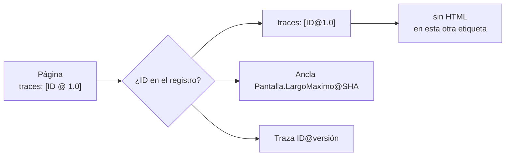

# Diagrama con la arroba entre espacios

Fuera de un bloque mermaid, `traces: [ID@1.0]` no es asunto de este control.

```mermaid
flowchart LR
  %% traces: [ID@1.0] en un comentario no se dibuja
  P["Página<br/>traces: [ID @ 1.0]"] --> R{"¿ID en el registro?"}
  R --> E["traces: [ID#64;1.0]"] --> B["sin HTML<br/>en esta otra etiqueta"]
  R --> A["Ancla Pantalla.LargoMaximo@SHA"]
  R --> V["Traza ID@versión"]
```
